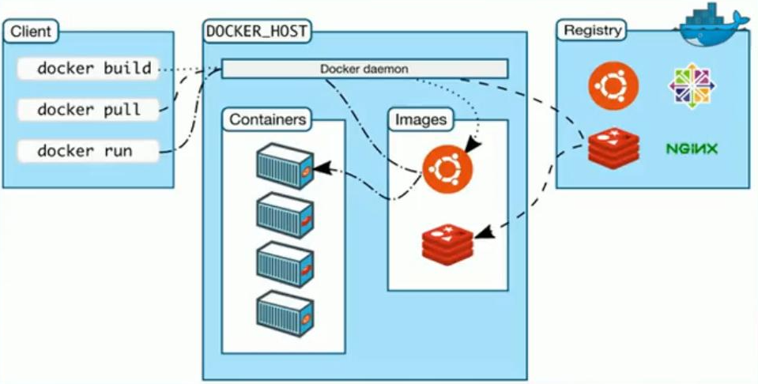
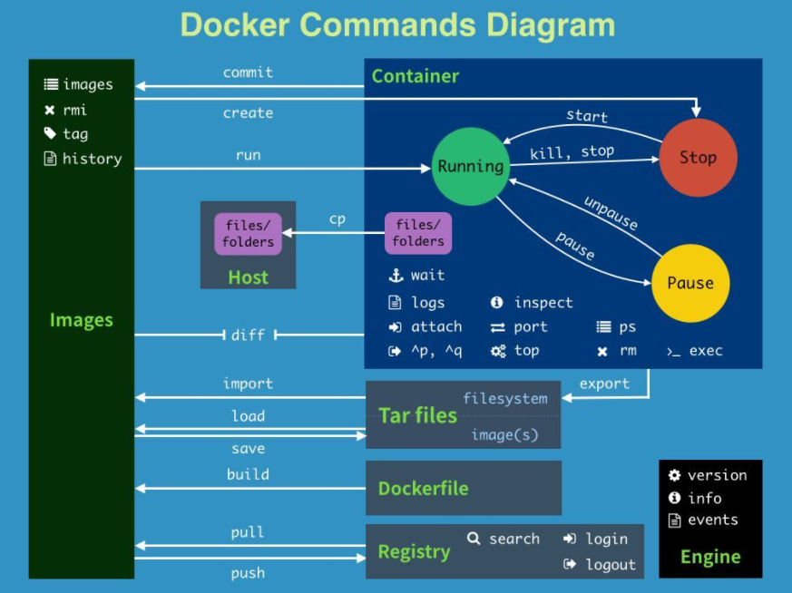
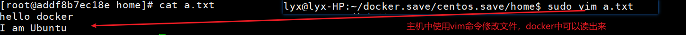
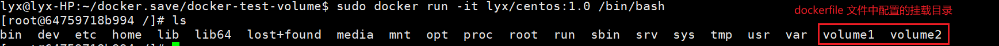
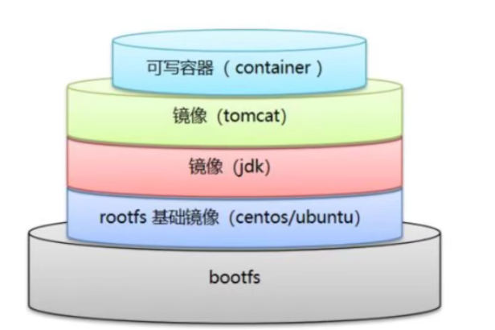
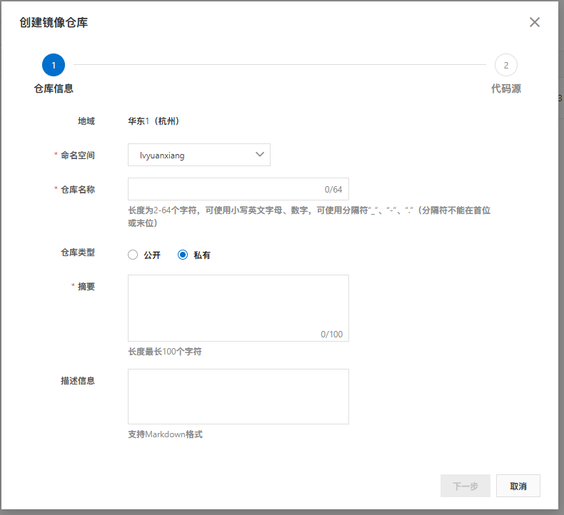
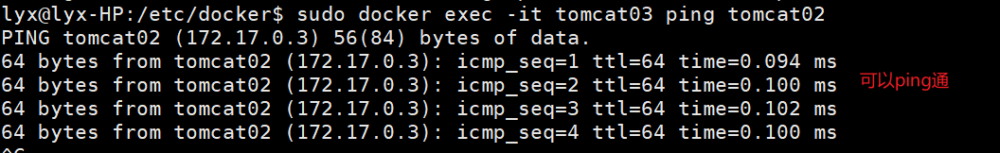
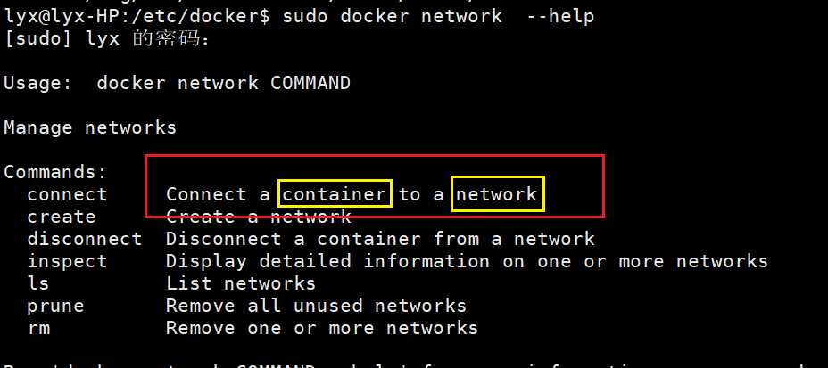

# Docker教程

## 1. Docker概述

### 1.1 Docker为什么会出现

一款产品：开发-上线两套环境！应用环境，应用配置！

开发一运维，问题：我在我的电脑上可以运行！版本更新，导致服务不可用！对于运维来说，考验就十分大？

环境配置是十分的麻烦，每一个机器都要部署环境（集群Redis、ES、Hadoop…）!费时费力。

发布一个项目（jar+(Redis MySQL jdk ES),项目能不能都带上环境安装打包！

之前在服务器配置一个应用的环境Redis MySQL jdk ES Hadoop,配置超麻烦了，不能够跨平台。

Windows,最后发布到Linux!

传统：开发jar,运维来做！

现在:开发打包部署上线，一套流程做完！

java--apk--发布（应用商店）---张三使用apk--安装即可用！

java---jar(环境）---打包项目带上环境（镜像）----(Docker仓库：商店）…下载我们发布的镜像---直接运行即可！

Docker给以上问题，提出了解决方案！

 

**Docker的思想就来白于集装箱**

JRE--多个应用（端口冲突）--原来都是交叉的！

隔离：Docker核心思想！打包装箱！每个箱子是互相隔离的

Docker通过隔离机制，可以将服务器利用到极致！


### 1.2 Docker历史

2010年，几个搞IT的年轻人，就在美国成立了一家公司 dotcloud

做一些pass的云计算服务！LXC有关的容器技术！

他们将自己的技术（容器化技术）命名就是Docker!

Docker 刚刚诞生的时候，没有引起行业的注意！dotCloud,就活不下去！

2013年，Docker开源！Docker越来越多的人发现了docker的优点！火了，Docker每个月都会更新一个版本！

2014年4月9日，Docker1.0发布！

#### 1.2.1 Docker为什么这么火

在容器技术出来之前，我们都是使用虚拟机技术！

**虚拟机：**在window中装一个Vmware,通过这个软件我们可以虚拟出来一台或者多台电脑！笨重！

虚拟机也是属于虚拟化技术，Docker容器技术，也是一种虚拟化技术！

vm: linux centos原生镜像（一个电脑！)隔离，需要开启多个虚拟机！几个G几分钟

docker: 隔离，镜像（最核心的环境4m+jdk+mysq1)十分的小巧，运行镜像就可以了！小巧！几个MKB秒级启动！

#### 1.2.1 Docker文档

> Docker是使用Go语言开发的开源项目

官方文档：[Docker Documentation](https://docs.docker.com/)

仓库地址：[Docker Hub Container Image Library | App Containerization](https://hub.docker.com/)


### 1.3 Docker能干什么

#### 1.3.1 虚拟机技术

 

**虚拟机技术缺点：**

1. 资源占用十分多
2. 冗余步骤多
3. 启动很慢！


#### 1.3.2 容器技术

> 容器技术不是模拟的一个完整的操作系统

 

**比较Docker和虚拟机技术的不同：**

* 传统虚拟机，虚拟出一条硬件，运行一个完整的操作系统，然后在这个系统上安装和运行软件
* 容器内的应用直接运行在宿主机的内核，容器是没有自己的内核的，也没有虚拟我们的硬件，所以就轻便了
* 每个容器间是互相隔离，每个容器内都有一个属于自己的文件系统，互不影响。


> DevOps(开发，运维)

* 应用更快速的交付和部署
  * 传统：一堆帮助文档，安装程序
  * Docker:打包镜像发布测试，一键运行
* 更便捷的升级和扩缩容
  * 使用了Docker之后，我们部署应用就和搭积木一样！
  * 项目打包为一个镜像，扩展服务器A!服务器B
* 更简单的系统运维
  * 在容器化之后，我们的开发，测试环境都是高度一致的。
* 更高效的计算资源利用：
  * Docker是内核级别的虚拟化，可以再一个物理机上可以运行很多的容器实例！
  * 服务器的性能可以被压榨到极致


## 2. Docker安装

### 2.1 Docker基本组成

 **镜像（image):**

docker镜像就好比是一个模板，可以通过这个模板来创建容器服务，tomcat镜像==>run==>tomcat01容器（提供服务器）,

通过这个镜像可以创建多个容器（最终服务运行或者项目运行就是在容器中的）。
**容器（container):**

Docker利用容器技术，独立运行一个或者一个组应用，通过镜像来创建的。

启动，停止，删除，基本命令！

目前就可以把这个容器理解为就是一个简易的linux系统
**仓库（repository):**

仓库就是存放镜像的地方！

仓库分为公有仓库和私有仓库！

Docker Hub(默认是国外的）

阿里云…都有容器服务器（配置镜像加速！)


### 2.2 安装Docker

#### 2.2.1 环境准备

1. 需要会一点点的Linux的基础

2. linux服务器

3. 我们使用Xshell连接远程服务器进行操作！

   

#### 2.2.2 环境查看

```bash
#linux内核3.0以上即可
lyx@lyx-HP:~$ uname -r
5.8.0-63-generic
```

```bash
#系统版本
lyx@lyx-HP:~$ cat /etc/os-release
NAME="Ubuntu"
VERSION="20.10 (Groovy Gorilla)"
ID=ubuntu
ID_LIKE=debian
PRETTY_NAME="Ubuntu 20.10"
VERSION_ID="20.10"
HOME_URL="https://www.ubuntu.com/"
SUPPORT_URL="https://help.ubuntu.com/"
BUG_REPORT_URL="https://bugs.launchpad.net/ubuntu/"
PRIVACY_POLICY_URL="https://www.ubuntu.com/legal/terms-and-policies/privacy-policy"
VERSION_CODENAME=groovy
UBUNTU_CODENAME=groovy
```


#### 2.2.3 安装

官方文档：[Install Docker Engine on Ubuntu](https://docs.docker.com/engine/install/ubuntu/)

1. 先卸载旧版的docker

   ```bash
   sudo apt-get remove docker docker-engine docker.io containerd runc
   ```

   

2. 配置所需环境

   ```bash
   sudo apt-get update
   
   sudo apt-get install \
   apt-transport-https \
   ca-certificates \
   curl \
   gnupg-agent \
   software-properties-common
   ```

   

3. 开始安装docker的gpg密钥

   ```bash
   # 阿里云gpg
   curl -fsSL http://mirrors.aliyun.com/docker-ce/linux/ubuntu/gpg | sudo apt-key add -
   ```

   

4. 验证可用密钥

   ```bash
   sudo apt-key fingerprint 0EBFCD88
   ```

   

5. 写入docker stable版本的阿里云镜像软件源

   ```bash
   sudo add-apt-repository "deb [arch=amd64] http://mirrors.aliyun.com/docker-ce/linux/ubuntu $(lsb_release -cs) stable"
   ```

   

6. 安装最新版的docker-ce

   ```bash
   sudo apt-get install docker-ce docker-ce-cli containerd.io
   ```

   

7. **阿里云加速**

   ```bash
   sudo mkdir -p /etc/docker
   
   sudo tee /etc/docker/daemon.json <<-'EOF'
   {
     "registry-mirrors": 这里需要你去阿里云注册获取,方法如下
   }
   EOF
   
   sudo systemctl daemon-reload
   
   sudo systemctl restart docker
   ```

   >[容器镜像服务 (aliyun.com)](https://cr.console.aliyun.com/cn-hangzhou/instances/mirrors)

 


### 2.3 Docker底层原理

#### 2.3.1 Docker是什么工作的？

Docker是一个Client-Server结构的系统，Docker的守护进程运行在主机上。通过Socket从客户端访问！

DockerServer接收到Docker-Client的指令，就会执行这个命令！

 

#### 2.3.2 Docker为什么比vM快?

1.  Docker有着比虚拟机更少的抽象层。

2.  docker利用的是宿主机的内核,wm需要是 Guest Os

    

所以说，新建一个容器的时候，docker不需要想虚拟机一样重新加载一个操作系统内核，避免引导。虚拟机是加载GuestOS,**分钟级**别的，而docker是利用宿主机的操作系统吗，省略了这个复杂的过程，**秒级**！

 


## 3. Docker常用命令

### 3.1 帮助命令

```bash
docker version # 查看docker版本信息
docker info # 显示docker系统信息，包括镜像和容器数量
docker 命令 --help # 帮助命令
```

> 官方命令文档：[Reference documentation | Docker Documentation](https://docs.docker.com/reference/)


### 3.2 镜像命令

#### 3.2.1 docker images

> 查看本地主机上的镜像

```bash
#@查看所有镜像
# 命令
# docker images
#####################===测试===##########################
lyx@lyx-HP:/var/lib/docker$ sudo docker images
REPOSITORY    TAG       IMAGE ID       CREATED        SIZE
hello-world   latest    d1165f221234   4 months ago   13.3kB 	

# 解释
# REPOSITORY 镜像的仓库源
# TAG        镜像的标签
# IMAGE ID   镜像的id
# CREATED    镜像的创建时间
# SIZE       镜像的大小

# 可选项
# -a  列出所有镜像
# -q  只显示镜像id
```


#### 3.2.2 docker search

> 镜像搜索

官方镜像仓库：[Docker Hub Container Image Library | App Containerization](https://hub.docker.com/)

通过search来搜索mysql

```bash
#@根据镜像名查询镜像
# 命令
# docker search 镜像名
#####################===测试===##########################
lyx@lyx-HP:/var/lib/docker$ sudo docker search mysql
NAME                              DESCRIPTION                                     STARS     OFFICIAL   AUTOMATED
mysql                             MySQL is a widely used, open-source relation…   11185     [OK]       
mariadb                           MariaDB Server is a high performing open sou…   4246      [OK]       
mysql/mysql-server                Optimized MySQL Server Docker images. Create…   833                  [OK]
percona                           Percona Server is a fork of the MySQL relati…   548       [OK]       
phpmyadmin                        phpMyAdmin - A web interface for MySQL and M…   283       [OK]       
centos/mysql-57-centos7           MySQL 5.7 SQL database server                   90                   
mysql/mysql-cluster               Experimental MySQL Cluster Docker images. Cr…   88                   
centurylink/mysql                 Image containing mysql. Optimized to be link…   59                   [OK]
databack/mysql-backup             Back up mysql databases to... anywhere!         45                   
deitch/mysql-backup               REPLACED! Please use http://hub.docker.com/r…   41                   [OK]
prom/mysqld-exporter                                                              40                   [OK]
tutum/mysql                       Base docker image to run a MySQL database se…   35                   
linuxserver/mysql                 A Mysql container, brought to you by LinuxSe…   30                   
schickling/mysql-backup-s3        Backup MySQL to S3 (supports periodic backup…   29                   [OK]
mysql/mysql-router                MySQL Router provides transparent routing be…   21                   
centos/mysql-56-centos7           MySQL 5.6 SQL database server                   20                   
arey/mysql-client                 Run a MySQL client from a docker container      18                   [OK]
fradelg/mysql-cron-backup         MySQL/MariaDB database backup using cron tas…   15                   [OK]
openshift/mysql-55-centos7        DEPRECATED: A Centos7 based MySQL v5.5 image…   6                    
devilbox/mysql                    Retagged MySQL, MariaDB and PerconaDB offici…   3                    
jelastic/mysql                    An image of the MySQL database server mainta…   2                    
ansibleplaybookbundle/mysql-apb   An APB which deploys RHSCL MySQL                2                    [OK]
widdpim/mysql-client              Dockerized MySQL Client (5.7) including Curl…   1                    [OK]
centos/mysql-80-centos7           MySQL 8.0 SQL database server                   1                    
vitess/mysqlctld                  vitess/mysqlctld                                1                    [OK]
```

可选项，通过收藏来过滤：

```bash
#@根据镜像名和星星数量查询镜像
# 命令
# docker search mysql --filter=start=数量
#####################===测试===##########################
lyx@lyx-HP:/var/lib/docker$ sudo docker search mysql --filter=stars=3000
NAME      DESCRIPTION                                     STARS     OFFICIAL   AUTOMATED
mysql     MySQL is a widely used, open-source relation…   11185     [OK]       
mariadb   MariaDB Server is a high performing open sou…   4246      [OK] 
```


#### 3.2.3 docker pull

> 下载镜像

```bash
#@根据镜像名下载最新的镜像
# 命令
# docker pull 镜像名
#####################===测试===##########################
lyx@lyx-HP:/var/lib/docker$ sudo docker pull mysql
Using default tag: latest  # 如果不写tag（版本）， 默认下载latest(最新版)
latest: Pulling from library/mysql
33847f680f63: Pull complete  # 分层下载，docker images的核心，联合文件系统
5cb67864e624: Pull complete 
1a2b594783f5: Pull complete 
b30e406dd925: Pull complete 
48901e306e4c: Pull complete 
603d2b7147fd: Pull complete 
802aa684c1c4: Pull complete 
715d3c143a06: Pull complete 
6978e1b7a511: Pull complete 
f0d78b0ac1be: Pull complete 
35a94d251ed1: Pull complete 
36f75719b1a9: Pull complete 
Digest: sha256:8b928a5117cf5c2238c7a09cd28c2e801ac98f91c3f8203a8938ae51f14700fd
Status: Downloaded newer image for mysql:latest
docker.io/library/mysql:latest # 真实地址
# docker pull mysql 等价于 docker pull docker.io/library/mysql:latest

#@根据镜像名下载指定版本的镜像
# 指定版本下载
# 命令
# docker pull mysql:5.7
#####################===测试===##########################
lyx@lyx-HP:/var/lib/docker$ sudo docker pull mysql:5.7 
5.7: Pulling from library/mysql
33847f680f63: Already exists 
5cb67864e624: Already exists 
1a2b594783f5: Already exists 
b30e406dd925: Already exists 
48901e306e4c: Already exists 
603d2b7147fd: Already exists 
802aa684c1c4: Already exists 
5b5a19178915: Pull complete 
f9ce7411c6e4: Pull complete 
f51f6977d9b2: Pull complete 
aeb6b16ce012: Pull complete 
Digest: sha256:be70d18aedc37927293e7947c8de41ae6490ecd4c79df1db40d1b5b5af7d9596
Status: Downloaded newer image for mysql:5.7
docker.io/library/mysql:5.7
```

 

#### 2.4 docker rmi

> 删除镜像

```bash
#@根据镜像id删除镜像
# 命令
# docker rmi -f 镜像id
#####################===测试===##########################
lyx@lyx-HP:/var/lib/docker$ sudo docker rmi -f 8cf625070931 # 根据id删除镜像，多个id之间空格
Untagged: mysql:5.7
Untagged: mysql@sha256:be70d18aedc37927293e7947c8de41ae6490ecd4c79df1db40d1b5b5af7d9596
Deleted: sha256:8cf6250709314f2fcd2669e8643f5d3bdebfe715bddb63990c8c96e5d261d6fc
Deleted: sha256:452fe6896278c26338d547f8d1092011d923785247c46629b374d3477fe28c84
Deleted: sha256:bd40bf60af5d06e6b93eaf5a648393d97f70998faa3bfa1b85af55b5a270cb35
Deleted: sha256:c43e9e7d1e833650e0ed54be969d6410efa4e7fa6e27a236a44a2b97e412ee93
Deleted: sha256:70f18560bbf492ddb2eadbc511c58c4d01e51e8f5af237e3dbb319632f16335b

#@删除所有镜像
# 命令
# docker rmi -f $(sudo docker images -aq)
#####################===测试===##########################
lyx@lyx-HP:/var/lib/docker$ sudo docker rmi -f $(sudo docker images -aq) #删除所有镜像
Untagged: mysql:latest
Untagged: mysql@sha256:8b928a5117cf5c2238c7a09cd28c2e801ac98f91c3f8203a8938ae51f14700fd
Deleted: sha256:c60d96bd2b771a8e3cae776e02e55ae914a6641139d963defeb3c93388f61707
Deleted: sha256:5c8c91273faab368a6d659156f2569fa9f40b0e0139222fdf9eef073df4b3797
Deleted: sha256:33d8196a776f42a16f10395b66f10f91443b1fb194bca2a9b8dfb0deff5babb8
Deleted: sha256:3ec63323025213e3cabf17ac7933506dc5520ec49226a9764418f77ea60d35c8
Deleted: sha256:1f129b005b51b049ac84ed0775b82096d480b7d9308a9a137697f37346562266
Deleted: sha256:80ed209bd0434faa1ce31fbaab8508124dddf8f6502c5736ee4b8e46697a8477
Deleted: sha256:e53f0d35c77064014a5c1c1332d84d5f421a58418ca9c208bc470691c0e483e3
Deleted: sha256:75209fb28131d5537e73406ff0f6f508f3eb1f4d86c43d1d16df76fd28b9cc35
Deleted: sha256:34a01bee1a62a01034ffc3da48a3cb45716a0cf2e264c26663e02288e81c7ec2
Deleted: sha256:9f8bca37a56017fd3462d4fc329b0b20f97c2dd4c15e55a8e6ad1c023ab5552b
Deleted: sha256:c8a6e3f9a2412c28cd8c48e2c7bed5e7fbaa0ab6649add2dbe8641cb29b967f6
Deleted: sha256:0a26eacdbd862e75d064d817e8a5bcf5e060c2680c10f77ffa52757c0b8c3328
Deleted: sha256:814bff7343242acfd20a2c841e041dd57c50f0cf844d4abd2329f78b992197f4
Untagged: hello-world:latest
Untagged: hello-world@sha256:df5f5184104426b65967e016ff2ac0bfcd44ad7899ca3bbcf8e44e4461491a9e
Deleted: sha256:d1165f2212346b2bab48cb01c1e39ee8ad1be46b87873d9ca7a4e434980a7726
```


### 3.3 容器命令

#### 3.3.1 创建容器

> 我们有镜像才能创建容器

* 下载一个centos镜像

  ```bash
  #@下载一个镜像
  # 命令 
  # docker pull 镜像名
  #####################===测试===##########################
  lyx@lyx-HP:/var/lib/docker$ sudo docker pull centos
  Using default tag: latest
  latest: Pulling from library/centos
  7a0437f04f83: Pull complete 
  Digest: sha256:5528e8b1b1719d34604c87e11dcd1c0a20bedf46e83b5632cdeac91b8c04efc1
  Status: Downloaded newer image for centos:latest
  docker.io/library/centos:latest
  lyx@lyx-HP:/var/lib/docker$ sudo docker images
  REPOSITORY   TAG       IMAGE ID       CREATED        SIZE
  centos       latest    300e315adb2f   7 months ago   209MB
  
  ```

  

* 启动

  ```bash
  # 参数说明
  # --name="name" 容器名字
  # -d            后台方式运行
  # -it           交互方式运行，进入容器查看内容
  # -p		    指定容器端口
  #	-p ip:主机端口：容器端口
  #	-p 主机端口：容器端口（常用）
  #	-p 容器端口
  # 	容器端口
  # -p            随机指定端口
  
  #@以交互方式创建容器并进入
  # 命令
  # docker run -it 镜像名 /bin/bash
  #####################===测试===##########################
  lyx@lyx-HP:/var/lib/docker$ sudo docker run -it centos /bin/bash
  [root@b0adc616cc04 /]# ls
  bin  dev  etc  home  lib  lib64  lost+found  media  mnt  opt  proc  root  run  sbin  srv  sys  tmp  usr  var
  
  #@退出正在运行的容器，容器停止运行
  # 命令
  # eixt
  #####################===测试===##########################
  [root@b0adc616cc04 /]# exit 
  exit
  
  #@退出正在运行的容器，容器不停止
  # 快捷键
  # ctrl+p+q
  ```
  


#### 3.3.2 列出容器

```bash
# docker ps 命令
# 		列出当前正在运行的容器
# -a    列出当前正在运行的容器+带出历史运行的容器
# -n=?  显示最近创建的容器
# -q    只显示容器编号

#@列出所有正在运行的容器
# 命令
# docker ps
#####################===测试===##########################
lyx@lyx-HP:/var/lib/docker$ sudo docker ps # 列出当前正在运行的容器
CONTAINER ID   IMAGE     COMMAND   CREATED   STATUS    PORTS     NAMES

#@列出正在运行的容器和历史运行过的容器
# 命令
# docker ps -a
#####################===测试===##########################
lyx@lyx-HP:/var/lib/docker$ sudo docker ps -a # 列出当前正在运行的容器+带出历史运行的容器
CONTAINER ID   IMAGE          COMMAND       CREATED         STATUS                     PORTS     NAMES
b0adc616cc04   centos         "/bin/bash"   6 minutes ago   Exited (0) 5 minutes ago             upbeat_aryabhata
91765ec83833   d1165f221234   "/hello"      2 hours ago     Exited (0) 2 hours ago               nice_hamilton

#@显示最近的容器
# 命令
# sudo ps -a -n=数量
#####################===测试===##########################
lyx@lyx-HP:/var/lib/docker$ sudo docker ps -a -n=1 # 显示最近创建的容器
CONTAINER ID   IMAGE     COMMAND       CREATED         STATUS                     PORTS     NAMES
b0adc616cc04   centos    "/bin/bash"   6 minutes ago   Exited (0) 6 minutes ago             upbeat_aryabhata

#@显示所有容器的编号
# 命令
# docker ps -aq
#####################===测试===##########################
lyx@lyx-HP:/var/lib/docker$ sudo docker ps -aq # 只显示容器编号
b0adc616cc04
91765ec83833
```


#### 3.3.3 删除容器

```bash
#@删除容器
# 命令
# docker rm 容器id
#####################===测试===##########################
lyx@lyx-HP:~$ sudo docker rm 91765ec83833
91765ec83833

#@删除所有容器
# 命令
# docker rm $(docker ps -aq)
#####################===测试===##########################
docker rm $(docker ps -aq)  #删除所有容器

```


#### 3.3.4 启动和停止容器

```bash
docker start 容器id              # 启动容器
docker restart 容器id            # 重启容器
docker stop 容器id               # 停止当前正在运行的容器
docker kill 容器id               # 强制杀死正在运行的容器

#@根据id启动容器
# 命令
# socker start 容器id
#####################===测试===##########################
lyx@lyx-HP:/var/lib/docker$ sudo docker start b0adc616cc04
b0adc616cc04
lyx@lyx-HP:/var/lib/docker$ sudo docker ps 
CONTAINER ID   IMAGE     COMMAND       CREATED          STATUS          PORTS     NAMES
b0adc616cc04   centos    "/bin/bash"   24 minutes ago   Up 16 seconds             upbeat_aryabhata

#@根据id重启容器
# 命令
# docker restart 容器id
#####################===测试===##########################
lyx@lyx-HP:/var/lib/docker$ sudo docker restart b0adc616cc04
b0adc616cc04

#@根据id强制杀死正在运行的容器
# 命令
# socker kill 容器id
#####################===测试===##########################
lyx@lyx-HP:/var/lib/docker$ sudo docker kill b0adc616cc04
b0adc616cc04
lyx@lyx-HP:/var/lib/docker$ sudo docker ps 
CONTAINER ID   IMAGE     COMMAND   CREATED   STATUS    PORTS     NAMES

```


### 3.4 常用的其他命令

#### 3.4.1 后台启动

```bash
#@后台启动容器
# 命令
# docker run -d 镜像名
#####################===测试===##########################
lyx@lyx-HP:/var/lib/docker$ sudo docker run -d centos  # 后台启动容器
7f74cba6b0f241fa4e6b372d9cf5fad37eff8be4d8b139ad252810024ecbdec6
lyx@lyx-HP:/var/lib/docker$ sudo docker ps 
CONTAINER ID   IMAGE     COMMAND   CREATED   STATUS    PORTS     NAMES
#问题docker ps,发现centos停止了
#常见的坑：docker容器使用后台运行，就必须要有要一个前台进程，docker发现没有应用，就会自动停止
# nginx,容器启动后，发现自己没有提供服务，就会立刻停止，就是没有程序了
```


#### 3.4.2 查看日志 

```bash
docker logs -tf --tail  容器id

# 测试
# 启动容器模拟日志输出
sudo docker run -d centos /bin/sh -c "while true;do echo helloworld;sleep 1;done"

# 显示容器
# -tf           #显示日志
# --tail number #显示最近日志条数

#@查看容器的日志
# 命令
# docker logs -tf --tail 数量 容器id
#####################===测试===##########################
lyx@lyx-HP:/var/lib/docker$ sudo docker logs -tf --tail 5 615c953c5eff
```


#### 3.4.3 查看容器内进程信息

```bash
#@查看容器内进程信息
# 命令
# docker top 容器id
#####################===测试===##########################
lyx@lyx-HP:/var/lib/docker$ sudo docker top 615c953c5eff # 查看容器内进程信息
UID                 PID                 PPID                C                   STIME               TTY                 TIME                CMD
root                16177               16155               0                   16:38               ?                   00:00:00            /bin/sh -c while true;do echo helloworld;sleep 1;done
root                16693               16177               0                   16:44               ?                   00:00:00            /usr/bin/coreutils --coreutils-prog-shebang=sleep /usr/bin/sleep 1
```


#### 3.3.5 查看镜像的元数据

```bash
#@根据id查看镜像元信息
# 命令
# docker inspect 容器id
#####################===测试===##########################
lyx@lyx-HP:/var/lib/docker$ sudo docker inspect 615c953c5eff # 根据id查询镜像的元数据
[
    {
        "Id": "615c953c5eff5c29b604895ae201514f2eae9cceae517631491641392b81fbff",
        "Created": "2021-07-29T08:38:03.931278888Z",
        "Path": "/bin/sh",
        "Args": [
            "-c",
            "while true;do echo helloworld;sleep 1;done"
        ],
        "State": {
            "Status": "running",
            "Running": true,
            "Paused": false,
            "Restarting": false,
            "OOMKilled": false,
            "Dead": false,
            "Pid": 16177,
            "ExitCode": 0,
            "Error": "",
            "StartedAt": "2021-07-29T08:38:05.153923519Z",
            "FinishedAt": "0001-01-01T00:00:00Z"
        },
        "Image": "sha256:300e315adb2f96afe5f0b2780b87f28ae95231fe3bdd1e16b9ba606307728f55",
        "ResolvConfPath": "/var/lib/docker/containers/615c953c5eff5c29b604895ae201514f2eae9cceae517631491641392b81fbff/resolv.conf",
        "HostnamePath": "/var/lib/docker/containers/615c953c5eff5c29b604895ae201514f2eae9cceae517631491641392b81fbff/hostname",
        "HostsPath": "/var/lib/docker/containers/615c953c5eff5c29b604895ae201514f2eae9cceae517631491641392b81fbff/hosts",
        "LogPath": "/var/lib/docker/containers/615c953c5eff5c29b604895ae201514f2eae9cceae517631491641392b81fbff/615c953c5eff5c29b604895ae201514f2eae9cceae517631491641392b81fbff-json.log",
        "Name": "/hungry_hawking",
        "RestartCount": 0,
        "Driver": "overlay2",
        "Platform": "linux",
        "MountLabel": "",
        "ProcessLabel": "",
        "AppArmorProfile": "docker-default",
        "ExecIDs": null,
        "HostConfig": {
            "Binds": null,
            "ContainerIDFile": "",
            "LogConfig": {
                "Type": "json-file",
                "Config": {}
            },
            "NetworkMode": "default",
            "PortBindings": {},
            "RestartPolicy": {
                "Name": "no",
                "MaximumRetryCount": 0
            },
            "AutoRemove": false,
            "VolumeDriver": "",
            "VolumesFrom": null,
            "CapAdd": null,
            "CapDrop": null,
            "CgroupnsMode": "host",
            "Dns": [],
            "DnsOptions": [],
            "DnsSearch": [],
            "ExtraHosts": null,
            "GroupAdd": null,
            "IpcMode": "private",
            "Cgroup": "",
            "Links": null,
            "OomScoreAdj": 0,
            "PidMode": "",
            "Privileged": false,
            "PublishAllPorts": false,
            "ReadonlyRootfs": false,
            "SecurityOpt": null,
            "UTSMode": "",
            "UsernsMode": "",
            "ShmSize": 67108864,
            "Runtime": "runc",
            "ConsoleSize": [
                0,
                0
            ],
            "Isolation": "",
            "CpuShares": 0,
            "Memory": 0,
            "NanoCpus": 0,
            "CgroupParent": "",
            "BlkioWeight": 0,
            "BlkioWeightDevice": [],
            "BlkioDeviceReadBps": null,
            "BlkioDeviceWriteBps": null,
            "BlkioDeviceReadIOps": null,
            "BlkioDeviceWriteIOps": null,
            "CpuPeriod": 0,
            "CpuQuota": 0,
            "CpuRealtimePeriod": 0,
            "CpuRealtimeRuntime": 0,
            "CpusetCpus": "",
            "CpusetMems": "",
            "Devices": [],
            "DeviceCgroupRules": null,
            "DeviceRequests": null,
            "KernelMemory": 0,
            "KernelMemoryTCP": 0,
            "MemoryReservation": 0,
            "MemorySwap": 0,
            "MemorySwappiness": null,
            "OomKillDisable": false,
            "PidsLimit": null,
            "Ulimits": null,
            "CpuCount": 0,
            "CpuPercent": 0,
            "IOMaximumIOps": 0,
            "IOMaximumBandwidth": 0,
            "MaskedPaths": [
                "/proc/asound",
                "/proc/acpi",
                "/proc/kcore",
                "/proc/keys",
                "/proc/latency_stats",
                "/proc/timer_list",
                "/proc/timer_stats",
                "/proc/sched_debug",
                "/proc/scsi",
                "/sys/firmware"
            ],
            "ReadonlyPaths": [
                "/proc/bus",
                "/proc/fs",
                "/proc/irq",
                "/proc/sys",
                "/proc/sysrq-trigger"
            ]
        },
        "GraphDriver": {
            "Data": {
                "LowerDir": "/var/lib/docker/overlay2/4c101e5cba6dd7cf77310b67028ea4dfb4e1368afbbdf7ccdd410ab4e32297f2-init/diff:/var/lib/docker/overlay2/d8ea1e9d43f28f01f953eec4fae725a5ddd5b6633e5a7ef78a453e977953cf12/diff",
                "MergedDir": "/var/lib/docker/overlay2/4c101e5cba6dd7cf77310b67028ea4dfb4e1368afbbdf7ccdd410ab4e32297f2/merged",
                "UpperDir": "/var/lib/docker/overlay2/4c101e5cba6dd7cf77310b67028ea4dfb4e1368afbbdf7ccdd410ab4e32297f2/diff",
                "WorkDir": "/var/lib/docker/overlay2/4c101e5cba6dd7cf77310b67028ea4dfb4e1368afbbdf7ccdd410ab4e32297f2/work"
            },
            "Name": "overlay2"
        },
        "Mounts": [],
        "Config": {
            "Hostname": "615c953c5eff",
            "Domainname": "",
            "User": "",
            "AttachStdin": false,
            "AttachStdout": false,
            "AttachStderr": false,
            "Tty": false,
            "OpenStdin": false,
            "StdinOnce": false,
            "Env": [
                "PATH=/usr/local/sbin:/usr/local/bin:/usr/sbin:/usr/bin:/sbin:/bin"
            ],
            "Cmd": [
                "/bin/sh",
                "-c",
                "while true;do echo helloworld;sleep 1;done"
            ],
            "Image": "centos",
            "Volumes": null,
            "WorkingDir": "",
            "Entrypoint": null,
            "OnBuild": null,
            "Labels": {
                "org.label-schema.build-date": "20201204",
                "org.label-schema.license": "GPLv2",
                "org.label-schema.name": "CentOS Base Image",
                "org.label-schema.schema-version": "1.0",
                "org.label-schema.vendor": "CentOS"
            }
        },
        "NetworkSettings": {
            "Bridge": "",
            "SandboxID": "504d0cdb40a91acd548869ecef7d376c0e53b9bdb918767246dbd5c72eb16054",
            "HairpinMode": false,
            "LinkLocalIPv6Address": "",
            "LinkLocalIPv6PrefixLen": 0,
            "Ports": {},
            "SandboxKey": "/var/run/docker/netns/504d0cdb40a9",
            "SecondaryIPAddresses": null,
            "SecondaryIPv6Addresses": null,
            "EndpointID": "492702dc48ae725a4cc37bc00420f40c1eea2a08598dfd5162bff01f22a55a2f",
            "Gateway": "172.17.0.1",
            "GlobalIPv6Address": "",
            "GlobalIPv6PrefixLen": 0,
            "IPAddress": "172.17.0.2",
            "IPPrefixLen": 16,
            "IPv6Gateway": "",
            "MacAddress": "02:42:ac:11:00:02",
            "Networks": {
                "bridge": {
                    "IPAMConfig": null,
                    "Links": null,
                    "Aliases": null,
                    "NetworkID": "594b300721077b9ab3aaa8313ef6fa951223f50d00614f56d98d96999a1fbf20",
                    "EndpointID": "492702dc48ae725a4cc37bc00420f40c1eea2a08598dfd5162bff01f22a55a2f",
                    "Gateway": "172.17.0.1",
                    "IPAddress": "172.17.0.2",
                    "IPPrefixLen": 16,
                    "IPv6Gateway": "",
                    "GlobalIPv6Address": "",
                    "GlobalIPv6PrefixLen": 0,
                    "MacAddress": "02:42:ac:11:00:02",
                    "DriverOpts": null
                }
            }
        }
    }
]
```


#### 3.3.6 进入当前正在运行的容器

```bash
#@根据id进入正在运行的容器，开启一个新的终端（常用）
# 命令
# docker exec -it 容器id /bin/bash
#####################===测试===##########################
lyx@lyx-HP:~$ sudo docker exec -it 615c953c5eff /bin/bash
[root@615c953c5eff /]# ls
bin  dev  etc  home  lib  lib64  lost+found  media  mnt  opt  proc  root  run  sbin  srv  sys  tmp  usr  var

#@根据id进入正在运行的容器，使用容器种正在运行的终端，不会启动新的进程
# 命令
# docker attach 容器id
#####################===测试===##########################
lyx@lyx-HP:~$ sudo docker attach 615c953c5eff
helloworld
helloworld
helloworld

```


#### 3.3.7 复制容器内的文件到主机上

```bash
lyx@lyx-HP:~$ sudo docker run -it centos /bin/bash
[root@8d541083650b /]# ls
bin  dev  etc  home  lib  lib64  lost+found  media  mnt  opt  proc  root  run  sbin  srv  sys  tmp  usr  var
[root@8d541083650b /]# touch /home/docker.txt #容器中创建文件
[root@8d541083650b /]# exit 
exit
#@将容器中的文件拷贝到主机中
# 命令
# docker cp 主机id:文件地址/文件名 主机存放文件地址
#####################===测试===##########################
lyx@lyx-HP:~$ sudo docker cp 8d541083650b:/home/docker.txt /home  
lyx@lyx-HP:~$ cd /home
lyx@lyx-HP:/home$ ls
docker.txt  lyx

```


### 3.5 小结




## 4. Dokcer案例

### 4.1 Docker 安装 Nginx

1. 搜索镜像

   ```bash
   # 搜索镜像
   lyx@lyx-HP:/home$ sudo docker search nginx
   NAME                              DESCRIPTION                                     STARS     OFFICIAL   AUTOMATED
   nginx                             Official build of Nginx.                        15234     [OK]       
   jwilder/nginx-proxy               Automated Nginx reverse proxy for docker con…   2053                 [OK]
   richarvey/nginx-php-fpm           Container running Nginx + PHP-FPM capable of…   816                  [OK]
   jc21/nginx-proxy-manager          Docker container for managing Nginx proxy ho…   225                  
   linuxserver/nginx                 An Nginx container, brought to you by LinuxS…   150                  
   tiangolo/nginx-rtmp               Docker image with Nginx using the nginx-rtmp…   137                  [OK]
   jlesage/nginx-proxy-manager       Docker container for Nginx Proxy Manager        126                  [OK]
   alfg/nginx-rtmp                   NGINX, nginx-rtmp-module and FFmpeg from sou…   102                  [OK]
   nginxdemos/hello                  NGINX webserver that serves a simple page co…   70                   [OK]
   privatebin/nginx-fpm-alpine       PrivateBin running on an Nginx, php-fpm & Al…   56                   [OK]
   nginx/nginx-ingress               NGINX and  NGINX Plus Ingress Controllers fo…   55                   
   nginxinc/nginx-unprivileged       Unprivileged NGINX Dockerfiles                  45                   
   staticfloat/nginx-certbot         Opinionated setup for automatic TLS certs lo…   24                   [OK]
   nginx/nginx-prometheus-exporter   NGINX Prometheus Exporter for NGINX and NGIN…   19                   
   schmunk42/nginx-redirect          A very simple container to redirect HTTP tra…   19                   [OK]
   nginxproxy/nginx-proxy            Automated Nginx reverse proxy for docker con…   16                   
   centos/nginx-112-centos7          Platform for running nginx 1.12 or building …   15                   
   centos/nginx-18-centos7           Platform for running nginx 1.8 or building n…   13                   
   bitwarden/nginx                   The Bitwarden nginx web server acting as a r…   11                   
   flashspys/nginx-static            Super Lightweight Nginx Image                   10                   [OK]
   mailu/nginx                       Mailu nginx frontend                            9                    [OK]
   sophos/nginx-vts-exporter         Simple server that scrapes Nginx vts stats a…   7                    [OK]
   devilbox/nginx-stable             Devilbox's Nginx stable (based on official N…   4                    
   ansibleplaybookbundle/nginx-apb   An APB to deploy NGINX                          2                    [OK]
   wodby/nginx                       Generic nginx                                   1                    [OK]
   ```


2. 下载Nginx镜像

   ```bash
   # 根据镜像名下载镜像
   lyx@lyx-HP:/home$ sudo docker pull nginx
   Using default tag: latest
   latest: Pulling from library/nginx
   33847f680f63: Pull complete 
   dbb907d5159d: Pull complete 
   8a268f30c42a: Pull complete 
   b10cf527a02d: Pull complete 
   c90b090c213b: Pull complete 
   1f41b2f2bf94: Pull complete 
   Digest: sha256:8f335768880da6baf72b70c701002b45f4932acae8d574dedfddaf967fc3ac90
   Status: Downloaded newer image for nginx:latest
   docker.io/library/nginx:latest
   ```

   

3. 创建容器

   ```bash
   # 以后台方式创建容器并启动，容器别名nginx01 暴露端口号将主机与docker端口映射
   lyx@lyx-HP:/home$ sudo docker run -d --name nginx01 -p 8888:80 nginx
   33746caf20b2de544edbc1e9c8b736558662b37ce546e5c8550911880120b458
   lyx@lyx-HP:/home$ sudo docker ps
   CONTAINER ID   IMAGE     COMMAND                  CREATED          STATUS         PORTS                                   NAMES
   33746caf20b2   nginx     "/docker-entrypoint.…"   11 seconds ago   Up 9 seconds   0.0.0.0:8888->80/tcp, :::8888->80/tcp   nginx01
   ```

   

4. 测试 

   

### 4.2 Docker安装Tomcat

1. 搜索镜像

   ```bash
   # 搜索镜像
   lyx@lyx-HP:/home$ sudo docker search tomcat
   NAME                          DESCRIPTION                                     STARS     OFFICIAL   AUTOMATED
   tomcat                        Apache Tomcat is an open source implementati…   3082      [OK]       
   tomee                         Apache TomEE is an all-Apache Java EE certif…   91        [OK]       
   dordoka/tomcat                Ubuntu 14.04, Oracle JDK 8 and Tomcat 8 base…   57                   [OK]
   kubeguide/tomcat-app          Tomcat image for Chapter 1                      30                   
   consol/tomcat-7.0             Tomcat 7.0.57, 8080, "admin/admin"              18                   [OK]
   cloudesire/tomcat             Tomcat server, 6/7/8                            15                   [OK]
   aallam/tomcat-mysql           Debian, Oracle JDK, Tomcat & MySQL              13                   [OK]
   arm32v7/tomcat                Apache Tomcat is an open source implementati…   11                   
   rightctrl/tomcat              CentOS , Oracle Java, tomcat application ssl…   6                    [OK]
   maluuba/tomcat7-java8         Tomcat7 with java8.                             6                    
   unidata/tomcat-docker         Security-hardened Tomcat Docker container.      5                    [OK]
   arm64v8/tomcat                Apache Tomcat is an open source implementati…   4                    
   amd64/tomcat                  Apache Tomcat is an open source implementati…   3                    
   cfje/tomcat-resource          Tomcat Concourse Resource                       2                    
   jelastic/tomcat               An image of the Tomcat Java application serv…   2                    
   oobsri/tomcat8                Testing CI Jobs with different names.           2                    
   fabric8/tomcat-8              Fabric8 Tomcat 8 Image                          2                    [OK]
   picoded/tomcat7               tomcat7 with jre8 and MANAGER_USER / MANAGER…   1                    [OK]
   camptocamp/tomcat-logback     Docker image for tomcat with logback integra…   1                    [OK]
   99taxis/tomcat7               Tomcat7                                         1                    [OK]
   chenyufeng/tomcat-centos      tomcat基于centos6的镜像                              1                    [OK]
   ppc64le/tomcat                Apache Tomcat is an open source implementati…   1                    
   secoresearch/tomcat-varnish   Tomcat and Varnish 5.0                          0                    [OK]
   s390x/tomcat                  Apache Tomcat is an open source implementati…   0                    
   softwareplant/tomcat          Tomcat images for jira-cloud testing            0                    [OK]
   ```


2. 下载Tomcat镜像

   ```bash
   # 根据镜像名下载镜像
   lyx@lyx-HP:/home$ sudo docker pull tomcat
   Using default tag: latest
   latest: Pulling from library/tomcat
   627b765e08d1: Pull complete 
   c040670e5e55: Pull complete 
   073a180f4992: Pull complete 
   bf76209566d0: Pull complete 
   f10db7ba7580: Pull complete 
   5b2f970878fa: Pull complete 
   ed434bfebf18: Pull complete 
   f6c437110aa9: Pull complete 
   a772951f83db: Pull complete 
   752225c3768e: Pull complete 
   Digest: sha256:6e40250d8fac4eca05c2067cb81f79427e4ddbaf4e78d5ecd21c35e8c5f2bfcf
   Status: Downloaded newer image for tomcat:latest
   docker.io/library/tomcat:latest
   ```

   

3. 创建容器

   ```bash
   # 以后台方式创建容器并启动，容器别名toncat01 暴露端口号将主机与docker端口映射
   lyx@lyx-HP:/home$ sudo docker run -d --name tomcat01 -p 8889:8080 tomcat
   60361d58e96f7616357a9526971f64a6a0f3cd5b79e6380aeb70f7af639fed9e
   # 进入容器
   lyx@lyx-HP:/home$ sudo docker exec -it tomcat01 /bin/bash
   root@60361d58e96f:/usr/local/tomcat# ls
   BUILDING.txt	 LICENSE  README.md	 RUNNING.txt  conf  logs	    temp     webapps.dist
   CONTRIBUTING.md  NOTICE   RELEASE-NOTES  bin	      lib   native-jni-lib  webapps  work
   # 将webapps.dist下的全部文件拷贝到webapps中
   root@60361d58e96f:/usr/local/tomcat# cp -r webapps.dist/* webapps
   ```

   

4. 测试 

    


## 5. 可视化

可视化工具：

* portainer(先用这个）

* Rancher(CI/CD再用）

什么是Portainer?

> Docker图形化界面管理工具！提供一个后台面板供我们操作！

```bash
# 安装Portainer
docker run -d -p 8088:9000 \
--restart=always -v /var/run/docker.sock:/var/run/docker.sock --privileged=true portainer/portainer
```

访问测试：


## 6. Docker镜像

### 6.1 镜像是什么

镜像是—种**轻量级**、**可执行的独立软件包**,用来打包软件运行环境和基于运行环境开发的软件,它包含运行某个软件所需的所有内容,包括代码、运行时、库、环境变量和配置文件。

所有的应用,直接打包 docker镜像,就可以直接跑起来!

**如何得到镜像：**

* 从远程仓库下载
* 朋友拷贝给你
* 自己制作一个镜像DockerFile


### 6.2 Docker镜像加载原理

> UnionFS(联合文件系统）

UnionFS(联合文件系统）:Union文件系统（UnionFS)是一种分层、轻量级并且高性能的文件系统，它支持对文件系统的修改作为一次提交来一层层的叠加，同时可以将不同目录挂载到同一个虚拟文件系统下（unite several directories into a single virtual filesystem)。Union文件系统是Docker镜像的基础。镜像可以通过分层来进行继承，基于基础镜像（没有父镜像）,可以制作各种具体的应用镜像。

特性：一次同时加载多个文件系统，但从外面看起来，只能看到一个文件系统，联合加载会把各层文件系统叠加起来，这样最终的文件系统会包含所有底层的文件和目录


> Docker镜像加载原理

docker的镜像实际上由一层一层的文件系统组成，这种层级的文件系统UnionFS。bootfs(boot file system)主要包含bootloader和kernel,bootloader主要是引导加载kernel,Linux刚启动时会加载bootfs文件系统，在Docker镜像的最底层是bootfs。这一层与我们典型的Linux/Unix系统是一样的，包含boot加载器和内核。当boot加载完成之后整个内核就都在内存中了，此时内存的使用权已由bootfs转交给内核，此时系统也会卸载bootfs。

rootfs(root file system),在bootfs之上。包含的就是典型Linux系统中的/dev,/proc,/bin,/etc等标准目录和文件。rootfs就是各种不同的操作系统发行版，比如Ubuntu,Centos等等。


平时我们安装进虚拟机的CentOS都是好几个G,为什么Docker这里才200M?


对于一个精简的OS,rootfs可以很小，只需要包含最基本的命令，工具和程序库就可以了，因为底层直接用Host的kernel,自己只需要提供rootfs就可以了。由此可见对于不同的linux发行版，bootfs基本是一致的，rootfs会有差别，因此不同的发行版可以公用bootfs.


## 7. 分层的理解

> 分层镜像

我们可以去下载个镜像，注意观察下载的日志输出，可以看到是一一层一层的在下载！


思考：为什么Docker镜像要采用这种分层的结构呢？

最大的好处，我觉得莫过于是资源共享了！比如有多个镜像都从相同的Base镜像构建而来，那么宿主机只需在磁盘上保留一份base镜像，同时内存中也只需要加载一份base镜像，这样就可以为所有的容器服务了，而且镜像的每一层都可以被共享。

查看镜像分层的方式可以通过 docker image inspect命令！

```bash
        "RootFS": {
            "Type": "layers",
            "Layers": [
                "sha256:afa3e488a0ee76983343f8aa759e4b7b898db65b715eb90abc81c181388374e3",
                "sha256:4b0edb23340c111e75557748161eed3ca159584871569ce7ec9b659e1db201b4",
                "sha256:5a9a65095453efb15a9b378a3c1e7699e8004744ecd6dd519bdbabd0ca9d2efc",
                "sha256:ad83f0aa5c0abe35b7711f226037a5557292d479c21635b3522e1e5a41e3ce23",
                "sha256:f3d5b8f6513279844b32e0a6765db6041610bd103514e6f44eb7aaa7e688aebd",
                "sha256:89819bafde3625143931d5b19c75e51810751980a6fb7d1bc06d65b5fac3804e",
                "sha256:f42aed5f7febd7be177a9cbe594e2aa6a3151297be435c6a340ebd10f6eeb007",
                "sha256:22fb506c4d03449407701eab7468419114c999ab8c297520ab0184d0a79b192c",
                "sha256:3e5f997d03b4209717029de452a3fd9c0c9e7e521f84157cf78eab0f0af104e8",
                "sha256:c37f6bc1a08d358a272c8b2afd31fbf78e318b6e62e88bcb4451e938ebc7641c"
            ]
        },
        "Metadata": {
            "LastTagTime": "0001-01-01T00:00:00Z"
        }
```

理解：

所有的Docker镜像都起始于一个基础镜像层，当进行修改或增加新的内容时，就会在当前镜像层之上，创建新的镜像层。

举一个简单的例子，假如基于Ubuntu Linux16.04创建一个新的镜像，这就是新镜像的第一层；如果在该镜像中添加Python包，就会在基础镜像层之上创建第二个镜像层；如果继续添加一个安全补丁，就会创建第三个镜像层。该镜像当前已经包含3个镜像层，如下图所示（这只是一个用于演示的很简单的例子）。


在添加额外的镜像层的同时，镜像始终保持是当前所有镜像的组合，理解这一点非常重要。下图中举了一个简单的例子，每个镜像层包含3个文件，而镜像包含了来自两个镜像层的6个文件。


上图中的镜像层跟之前图中的略有区别，主要目的是便于展示文件。
下图中展示了一个稍微复杂的三层镜像，在外部看来整个镜像只有6个文件，这是因为最上层中的文件7是文件5的一个更新版本。


这种情况下，上层镜像层中的文件覆盖了底层镜像层中的文件。这样就使得文件的更新版本作为一个新镜像层添加到镜像当中。Docker 通过存储引擎（新版本采用快照机制）的方式来实现镜像层堆栈，并保证多镜像层对外展示为统一的文件系统。Linux上可用的存储引擎有AUFS、Overlay2、Device Mapper、Btrfs以及ZFS。顾名思义，每种存储引擎都基于Linux中对应的文件系统或者块设备技术，并且每种存储引擎都有其独有的性能特点。

Docker在Windows上仅支持windowsfilter一种存储引擎，该引擎基于NTFS文件系统之上实现了分层和CoW[1]。下图展示了与系统显示相同的三层镜像。所有镜像层堆叠并合并，对外提供统一的视图。


> 特点

Docker镜像都是只读的，当容器启动时，一个新的可写层被加载到镜像的顶部！

这一层就是我们通常说的容器层，容器之下的都叫镜像层！


## 8. commit镜像

```bash
docker commit 提交容器成为一个新的副本

#命令和git原理类似
docker commit-m="提交的描述信息” -a="作者” 容器id 目标镜像名:[TAG]
# c
lyx@lyx-HP:/home$ sudo docker commit -a="lyx" -m="my tomcat" d590c4f47eba tomcat02:1.0
sha256:364a16b0ea932f0efcb730226fe82d25d85ebdd5dc77bd1124235a44906fad4a
lyx@lyx-HP:/home$ docker images
Got permission denied while trying to connect to the Docker daemon socket at unix:///var/run/docker.sock: Get http://%2Fvar%2Frun%2Fdocker.sock/v1.24/images/json: dial unix /var/run/docker.sock: connect: permission denied
lyx@lyx-HP:/home$ sudo docker images
REPOSITORY            TAG       IMAGE ID       CREATED          SIZE
tomcat02              1.0       364a16b0ea93   21 seconds ago   79.1MB
tomcat                latest    46cfbf1293b1   7 days ago       668MB
nginx                 latest    08b152afcfae   8 days ago       133MB
portainer/portainer   latest    580c0e4e98b0   4 months ago     79.1MB
centos                latest    300e315adb2f   7 months ago     209MB

```


## 9. 容器数据卷

### 9.1 什么是容器数据卷？

**docker的理念回顾**

将应用和环境打包成一个镜像！

数据？如果数据都在容器中，那么我们容器删除，数据就会丢失！需求：数据可以持久化

MySQL,容器删了，删库跑路！需求：MySQL数据可以存储在本地！

容器之间可以有一个数据共享的技术！Docker容器中产生的数据，同步到本地！

这就是卷技术！目录的挂载，将我们容器内的目录，挂载到Linux上面！


**总结一句话：容器的持久化和同步操作！容器间也是可以数据共享的**


### 9.2 使用数据卷

#### 9.2.1 命令方式

```bash
#@列出所有正在运行的容器
# 命令
# docker run -v 主机目录:r
#####################===测试===##########################
lyx@lyx-HP:~$ sudo docker run -it -v ~/docker.save/centos.save/home:/home centos /bin/bash
[root@addf8b7ec18e /]# touch docker.txt
[root@addf8b7ec18e /]# ls
bin  dev  docker.txt  etc  home  lib  lib64  lost+found  media	mnt  opt  proc	root  run  sbin  srv  sys  tmp	usr  var
[root@addf8b7ec18e /]# cd home
[root@addf8b7ec18e home]# ls
[root@addf8b7ec18e home]# touch a.txt 

# 主机查看
lyx@lyx-HP:/home$ cd ~/docker.save/centos.save/home  #在主机中已经自动创建了这个文件
lyx@lyx-HP:~/docker.save/centos.save/home$ ls
a.txt
```




#### 9.2.2 案例：Mysql

```bash
# 1.搜索mysql镜像
sudo docker search mysql
# 2.下载mysql镜像
sudo docker pull mysql:5.7
# 3.创建容器 
# 可选项说明
# -d : 后台运行
# -p : 端口号映射
# -v : 挂在目录
# -e : 环境配置(在此配置root用户密码)
# --name : 配置docker容器别名
sudo docker run -d -p 8888:3306 -v ~/docker.save/mysql.save/conf:/etc/mysql -v ~/docker.save/mysql.save/data:/var/lib/mysql -e MYSQL_ROOT_PASSWORD=root --name mysql_8888 mysql:5.7

# 4lyx@lyx-HP:~/docker.save$ ls
centos.save  mysql.save
lyx@lyx-HP:~/docker.save$ cd mysql.save/
lyx@lyx-HP:~/docker.save/mysql.save$ ls
conf  data
lyx@lyx-HP:~/docker.save/mysql.save$ cd data
lyx@lyx-HP:~/docker.save/mysql.save/data$ ls
2aeb624d9e63.pid  ca.pem           ib_buffer_pool  ib_logfile1  performance_schema  server-cert.pem
auto.cnf          client-cert.pem  ibdata1         ibtmp1       private_key.pem     server-key.pem
ca-key.pem        client-key.pem   ib_logfile0     mysql        public_key.pem      sys
 查看本机同步文件
```

远程sqlyog客户端连接：


#### 9.2.3 挂载的方式

挂载的三种方式：

1. -v 容器内路径   =》 匿名挂在
2. -v 卷名:容器内路径  =》 具名挂载
3. -v /宿主机路径:容器内路径  =》指定路径挂载

##### 1. 匿名挂载

```bash
sudo docker run -d -P -v /etc/nginx --name nginx01 nginx
#查看挂载请情况
sudo docker volume ls # 查看所有挂载情况
```


```bash
# 查看匿名卷位置
sudo docker inspect nginx01
```


##### 2. 具名挂载

```bash
sudo docker run -d -P -v nginx.save:/etc/nginx --name nginx02 nginx
# 查看所有挂载情况
```


```bash
# 查看挂载位置
sudo docker volume inspect nginx.save
```


>所有的 docke容器内的卷,没有指定目录的情况下都是在`/var/lib/docker/ volumes/xxx/_data`
>
>我们通过具名挂载可以方便的找到我们的一个卷,大多数情况在使用的具名挂载

##### 3. 拓展

```bash
#通过-V容器内路径：ro rw改变读写权限
ro readonly # 只读
rw readwrite # 可读可写
#一旦这个了设置了容器权限，容器对我们挂载出来的内容就有限定了！
sudo docker run -d -P -v nginx.save:/etc/nginx:ro --name nginx02 nginx
sudo docker run -d -P -v nginx.save:/etc/nginx:rw --name nginx02 nginx
```


#### 9.2.4 DockerFile

Dockerfile就是用来构建docker镜像的构建文件！命令脚本！先体验一下！

通过这个脚本可以生成镜像，镜像是一层一层的，脚本一个个的命令，每个命令都是一层！

```bash
# 创建dockerfile文件
lyx@lyx-HP:~/docker.save/docker-test-volume$ sudo vim dockerfile1
```

```bash
# 文件内容
FROM centos
VOLUME ["volume1","volume2"]
CMD echo "===end==="
CMD /bin/bash
```

```bash
# -f dockerfile文件位置
# -t 生产镜像名称
#构建镜像
lyx@lyx-HP:~/docker.save/docker-test-volume$ sudo docker build -f ./dockerfile1 -t lyx/centos:1.0 ./
Sending build context to Docker daemon  2.048kB
Step 1/4 : FROM centos
 ---> 300e315adb2f
Step 2/4 : VOLUME ["volume1","volume2"]
 ---> Running in 86314a37853f
Removing intermediate container 86314a37853f
 ---> 013e42039bd6
Step 3/4 : CMD echo "===end==="
 ---> Running in 135c56661230
Removing intermediate container 135c56661230
 ---> c29bd13fc91e
Step 4/4 : CMD /bin/bash
 ---> Running in daaae1ca872f
Removing intermediate container daaae1ca872f
 ---> 72cc6432651f
Successfully built 72cc6432651f
Successfully tagged lyx/centos:1.0
```

查看自己创建的镜像


启动自己的镜像



查看挂载的位置：docker inspect 镜像id


#### 9.2.5 容器数据卷

多个mysql同步数据！


```bash
# 创建docker01容器
lyx@lyx-HP:~/docker.save/docker-test-volume$ sudo docker run --name docker01 -it lyx/centos:1.0 /bin/bash
[root@d991a07c38fe /]# ls
bin  dev  etc  home  lib  lib64  lost+found  media  mnt  opt  proc  root  run  sbin  srv  sys  tmp  usr  var  volume1  volume2

# 创建docker02容器并行挂载docker01
lyx@lyx-HP:~/docker.save/docker-test-volume$ sudo docker run --name docker02 --volumes-from docker01 -it lyx/centos:1.0 /bin/bash
[root@0e08ae7c24cf /]# ls
bin  dev  etc  home  lib  lib64  lost+found  media  mnt  opt  proc  root  run  sbin  srv  sys  tmp  usr  var  volume1  volume2
# 在docker02中创建文件
[root@0e08ae7c24cf /]# cd volume1
[root@0e08ae7c24cf volume1]# touch docker02.txt
[root@0e08ae7c24cf volume1]# ls
docker02.txt
# 进入docker01容器中查看
[root@0e08ae7c24cf volume1]# lyx@lyx-HP:~/docker.save/docker-test-volume$ sudo docker attach docker01
[root@d991a07c38fe /]# cd volume1
[root@d991a07c38fe volume1]# ls
docker02.txt
# 在主机上查看
# 查看匿名挂载位置
sudo docker inspect docker01
```


根据匿名挂载位置查看文件


> 只要还有一个容器还在，数据就不会丢失！

案例：mysql数据同步

```bash
# 创建mysql01容器
sudo docker run -d -p 8888:3306 -v /etc/mysql -v /var/lib/mysql -e MYSQL_ROOT_PASSWORD=root --name mysql01_8888 mysql:5.7
# 创建mysql02容器与mysql01容器挂载
sudo docker run -d -p 8889:3306 -e MYSQL_ROOT_PASSWORD=root --name mysql02_8889 --volumes-from mysql01_8888 mysql:5.7
# 这个时候就可以实现数据同步
```

结论：

容器之间配置信息的传递，数据卷容器的生命周期一直持续到没有容器使用为止。

但是一旦你持久化到了本地，这个时候，本地的数据是不会删除的！


## 10. DockerFile

### 10.1 DockerFile介绍

dockerfile 是用来构建dokcer镜像的文件！命令参数脚本！

构建步骤：

1. 编写一个dockerfile文件
2. docker build构建成为一个镜像
3. docker run运行镜像
4. docker push发布镜像（DockerHub、阿里云镜像仓库！)

查看官方文件存放地址


很多官方镜像都是基础包，很多功能没有，我们通常会自己搭建自己的镜像！

官方既然可以制作镜像，那我们也可以！

**基础知识：**

1. 每个保留关键字（指令）都是必须是大写字母

2. 执行从上到下顺序执行

3. #表示注释

4. 每一个指令都会创建提交一个新的镜像层，并提交！

   

   

   dockerfile是面向开发的，我们以后要发布项目，做镜像，就需要编写dockerfile文件，这个文件十分单！

   Docker镜像逐渐成为企业交付的标准，必须要掌握！I

   步骤：

   * DockerFile:构建文件，定义了一切的步骤，源代码
   * Dockerlmages:通过DockerFile构建生成的镜像，最终发布和运行的产品！
   * Docker容器：容器就是镜像运行起来提供服务器


### 10.2 DockerFile命令

* FROM：基础镜镜像，一切从这里开始构建
* MAINTAINER：镜像是谁写的，姓名+邮箱
* RUN：镜像构建的时候需要运行的命令
* ADD：步骤：tomcat镜像，这个tomcat压缩包！添加内容
* WORKDIR：镜像的工作目录
* VOLUME：挂载的目录
* EXPOSE：保留端口配置
* CMD：指定这个容器启动的时候要运行的命令，只有最后一个会生效，可被替代
* ENTRYPOINT：指定这个容器启动的时候要运行的命令，可以追加命令
* ONBUILD：当构建一个被继承DockerFile这个时候就会运行ONBUILD的指令。触发指令。
* COPY：类似ADD,将我们文件拷贝到镜像中
* ENV：构建的时候设置环境变量！


### 10.3 案例

> 使用dockerfile创建自定义的centos镜像，添加vim和net-tools等功能

1. 创建dockerfile-centos文件

   ```bash
   FROM centos
   MAINTAINER LYX<testlv@foxmail.com>
   
   ENV MYPATH /usr/local
   WORKDIR $MYPATH
   
   RUN yum -y install vim
   RUN yum -y install net-tools
   
   EXPOSE 80
   
   CMD echo $MYPATH
   CMD echo "---------end-----------"
   
   CMD /bin/bash
   ```

   

2. 构建mycentos镜像

   ```bash
   sudo docker build -f ./dockerfile-centos -t mycentos:0.1 ./
   ```

    

    


3. 创建容器并测试功能

   ```bash
   lyx@lyx-HP:~/docker.save/dockerFile$ sudo docker run -it mycentos:0.1 /bin/bash
   [root@203603349cf2 local]# vim a.txt #自己安装的vim命令
   [root@203603349cf2 local]# cat a.txt 
   hello docker
   [root@203603349cf2 local]# ifconfig #自己安装的ifconfig命令
   eth0: flags=4163<UP,BROADCAST,RUNNING,MULTICAST>  mtu 1500
           inet 172.17.0.7  netmask 255.255.0.0  broadcast 172.17.255.255
           ether 02:42:ac:11:00:07  txqueuelen 0  (Ethernet)
           RX packets 24  bytes 2874 (2.8 KiB)
           RX errors 0  dropped 0  overruns 0  frame 0
           TX packets 0  bytes 0 (0.0 B)
           TX errors 0  dropped 0 overruns 0  carrier 0  collisions 0
   
   lo: flags=73<UP,LOOPBACK,RUNNING>  mtu 65536
           inet 127.0.0.1  netmask 255.0.0.0
           loop  txqueuelen 1000  (Local Loopback)
           RX packets 0  bytes 0 (0.0 B)
           RX errors 0  dropped 0  overruns 0  frame 0
           TX packets 0  bytes 0 (0.0 B)
           TX errors 0  dropped 0 overruns 0  carrier 0  collisions 0
   
   ```


4. 查看镜像的构建过程

   ```bash
   sudo docker history 镜像id
   ```

    


### 10.4 CMD和ENTRYPOINT的区别

#### 10.4.1 CMD

1. 创建测试cmd的dockerfile文件

   ```bash
   lyx@lyx-HP:~/docker.save/dockerFile$ sudo vim dockerfile-cmd-test 
   lyx@lyx-HP:~/docker.save/dockerFile$ cat dockerfile-cmd-test 
   FROM centos
   CMD ["ls","-a"]
   ```

   

2. 使用文件创建镜像

   ```bash
   lyx@lyx-HP:~/docker.save/dockerFile$ sudo docker build -f ./dockerfile-cmd-test -t cmd-test ./
   Sending build context to Docker daemon  15.87kB
   Step 1/2 : FROM centos
    ---> 300e315adb2f
   Step 2/2 : CMD ["ls","-a"]
    ---> Running in 566d8303f043
   Removing intermediate container 566d8303f043
    ---> bf1347b34a1e
   Successfully built bf1347b34a1e
   Successfully tagged cmd-test:latest
   ```


3. 正常启动镜像

   ```bash
   lyx@lyx-HP:~/docker.save/dockerFile$ sudo docker run cmd-test
   ```

    


4. 添加-l测试输出具体的目录信息

   ```bash
   sudo docker run cmd-test -l
   ```

    


> cmd的情况下， -l 替换了CMD ["ls", "-a"]命令， -l又不是命令所有报错


#### 10.4.2 ENTRYPOINT

1. 创建测试ENTRYPOINT的dockerfile

   ```bash
   lyx@lyx-HP:~/docker.save/dockerFile$ sudo vim dockerfile-entrypoint-test
   lyx@lyx-HP:~/docker.save/dockerFile$ cat dockerfile-entrypoint-test 
   FROM centos
   ENTRYPOINT ["ls","-a"]
   ```


2. 构建测试镜像

   ```bash
   lyx@lyx-HP:~/docker.save/dockerFile$ sudo docker build -f ./dockerfile-entrypoint-test  -t entrypoint-test ./
   Sending build context to Docker daemon   16.9kB
   Step 1/2 : FROM centos
    ---> 300e315adb2f
   Step 2/2 : ENTRYPOINT ["ls","-a"]
    ---> Running in b21cb34ee29f
   Removing intermediate container b21cb34ee29f
    ---> 9e08d8bf663f
   Successfully built 9e08d8bf663f
   Successfully tagged entrypoint-test:latest
   ```


3. 正常启动镜像

   ```bash
   lyx@lyx-HP:~/docker.save/dockerFile$ sudo docker run entrypoint-test
   ```

    


4. 添加-l命令启动

   ```bash
   lyx@lyx-HP:~/docker.save/dockerFile$ sudo docker run entrypoint-test -l
   ```

    


### 10.5 实战：Tomcat

1. 准备Tomcat安装包和jdk安装包

    


2. 编写dockerFile文件

   ```bash
   FROM centos
   #作者
   MAINTAINER lyx testlv@foxmail.com
   #拷贝tomcat jdk 到镜像并解压
   ADD apache-tomcat-8.5.69.tar.gz /usr/local/tomcat
   ADD jdk-8u151-linux-x64.tar.gz /usr/local/jdk
   #定义交互时登录路径
   ENV MYPATH /usr/local
   WORKDIR $MYPATH
   #配置jdk 和tomcat环境变量
   ENV JAVA_HOME /usr/local/jdk/jdk1.8.0_151
   ENV CATALINA_HOME /usr/local/tomcat/apache-tomcat-8.5.69
   ENV CATALINA_BASE /usr/local/tomcat/apache-tomcat-8.5.69
   ENV CLASSPATH $JAVA_HOME/lib/dt.jar:$JAVA_HOME/lib/tools.jar
   ENV PATH $PATH:$JAVA_HOME/bin:$CATALINA_HOME/lib:$CATALINA_HOME/bin
   #设置暴露的端口
   EXPOSE 8080
   #运行tomcat
   CMD /usr/local/tomcat/apache-tomcat-8.5.69/bin/startup.sh && tail -f /usr/local/tomcat/apache-tomcat-8.5.69/logs/catalina.out
   ```


3. 构建镜像

   ```bash
   sudo docker build -t mytomcat ./
   ```

    

   

4. 创建容器并启动

   ```bash
   sudo docker run -d -p 8888:8080 --name mytomcat -v ~/build/tomcat/logs:/usr/local/tomcat/apache-tomcat-8.5.69/logs/ -v ~/build/tomcat/webapps:/usr/local/tomcat/apache-tomcat-8.5.69/webapps/ cetos/tomcat
   ```


5. 进入本地挂载的webapps目录添加一个简单的项目

   * WEB-INF/web.xml

     ```xml
     <!DOCTYPE web-app PUBLIC
      "-//Sun Microsystems, Inc.//DTD Web Application 2.3//EN"
      "http://java.sun.com/dtd/web-app_2_3.dtd" >
     
     <web-app>
       <display-name>Archetype Created Web Application</display-name>
     </web-app>
     ```

   * index.jsp

     ```jsp
     <%@ page language="java" contentType="text/html; charset=utf-8"
     pageEncoding="utf-8"%>
     <%@taglib uri="http://java.sun.com/jsp/jstl/core" prefix="c" %>
     <!DOCTYPE html PUBLIC "-//W3C//DTD HTML 4.01 Transitional//EN" "http://www.w3.org/TR/html4/loose.dtd">
     <html>
     <head>
     <meta http-equiv="Content-Type" content="text/html; charset=utf-8">
     <title>index</title>
     </head>
     <body>
     	<%
         	system.out.println("---login index----")
         %>
     </body>
     </html>
     ```


6. 本地访问测试

   

发现项目部署成功可以直接访问！


## 11. 发布镜像到dockerhub上

1. 登录dockerhub

   ```bash
   lyx@lyx-HP:~$ docker login --help
   
   Usage:  docker login [OPTIONS] [SERVER]
   
   Log in to a Docker registry.
   If no server is specified, the default is defined by the daemon.
   
   Options:
     -p, --password string   Password #用户名
         --password-stdin    Take the password from stdin
     -u, --username string   Username #密码
     
   #登录
   lyx@lyx-HP:/etc/docker$ sudo docker login -u lvxyuanxiang
   Password: 
   WARNING! Your password will be stored unencrypted in /root/.docker/config.json.
   Configure a credential helper to remove this warning. See
   https://docs.docker.com/engine/reference/commandline/login/#credentials-store
   
   Login Succeeded #登录成功
   
   ```
   
   由于网络原因连接不上DockerHub，可使用加速器！
   
   [DaoCloud](https://www.daocloud.io/mirror)
   
   ```bash
   #linux
   curl -sSL https://get.daocloud.io/daotools/set_mirror.sh | sh -s http://f1361db2.m.daocloud.io
   ```


2. push自己的镜像到服务器上

   ```bash
   lyx@lyx-HP:/etc/docker$ sudo docker push cetos/tomcat
   Using default tag: latest
   The push refers to repository [docker.io/cetos/tomcat]
   7df7a529689e: Preparing 
   970ae5b4aded: Preparing 
   2653d992f4ef: Preparing 
   denied: requested access to the resource is denied #请求被拒绝，命名不规范
   
   # 使用tag命名修改
   # 命名格式：docker tag <imageID> <namespace>/<image name>:<version tag eg latest>
   # namespace要与自己dockerhub仓库的用户名一致
   sudo docker tag c2ffddeb65f3 lvxyuanxiang/centos-tomcat:1.0
   
   # 提交镜像
   sudo docker push lvxyuanxiang/centos-tomcat:1.0
   ```

    


## 12. 发布镜像到阿里云上

1. 登录阿里云

2. 找到容器镜像服务

3. 创建镜像仓库

    

4. 阿里云操作指南

   ## 1. 登录阿里云Docker Registry

   ```
   $ docker login --username=吕元祥来了 registry.cn-hangzhou.aliyuncs.com
   ```

   用于登录的用户名为阿里云账号全名，密码为开通服务时设置的密码。

   您可以在访问凭证页面修改凭证密码。

   ## 2. 从Registry中拉取镜像

   ```
   $ docker pull registry.cn-hangzhou.aliyuncs.com/lvyuanxiang/lyx-hub:[镜像版本号]
   ```

   ## 3. 将镜像推送到Registry

   ```
   $ docker login --username=吕元祥来了 registry.cn-hangzhou.aliyuncs.com$ docker tag [ImageId] registry.cn-hangzhou.aliyuncs.com/lvyuanxiang/lyx-hub:[镜像版本号]$ docker push registry.cn-hangzhou.aliyuncs.com/lvyuanxiang/lyx-hub:[镜像版本号]
   ```

   请根据实际镜像信息替换示例中的[ImageId]和[镜像版本号]参数。

   ## 4. 选择合适的镜像仓库地址

   从ECS推送镜像时，可以选择使用镜像仓库内网地址。推送速度将得到提升并且将不会损耗您的公网流量。

   如果您使用的机器位于VPC网络，请使用 registry-vpc.cn-hangzhou.aliyuncs.com 作为Registry的域名登录。

   ## 5. 示例

   使用"docker tag"命令重命名镜像，并将它通过专有网络地址推送至Registry。

   ```
   $ docker imagesREPOSITORY                                                         TAG                 IMAGE ID            CREATED             VIRTUAL SIZEregistry.aliyuncs.com/acs/agent                                    0.7-dfb6816         37bb9c63c8b2        7 days ago          37.89 MB$ docker tag 37bb9c63c8b2 registry-vpc.cn-hangzhou.aliyuncs.com/acs/agent:0.7-dfb6816
   ```

   使用 "docker push" 命令将该镜像推送至远程。

   ```
   $ docker push registry-vpc.cn-hangzhou.aliyuncs.com/acs/agent:0.7-dfb6816
   ```


5. 使用终端登录阿里云

   ```bash
   lyx@lyx-HP:/etc/docker$ sudo docker login --username=吕元祥来了 registry.cn-hangzhou.aliyuncs.com
   Password: 
   WARNING! Your password will be stored unencrypted in /root/.docker/config.json.
   Configure a credential helper to remove this warning. See
   https://docs.docker.com/engine/reference/commandline/login/#credentials-store
   
   Login Succeeded
   ```


6. push镜像到终端

   ```bash
   # 修改镜像tag
   sudo docker tag c2ffddeb65f3 registry.cn-hangzhou.aliyuncs.com/lvyuanxiang/lyx-hub:1.0
   
   # 上传
   sudo docker push registry.cn-hangzhou.aliyuncs.com/lvyuanxiang/lyx-hub:1.0
   ```

    


## 13. Dokcer网络

### 13.1 理解Docker0


> 问题：有三个网络，docker容器时如何处理容器网络访问的？


```bash
# 创建并后台方式运行tomcat容器
lyx@lyx-HP:/etc/docker$ sudo docker run -d -P --name tomcat01 tomcat

# 查看容器的ip addr，发现容器启动的时候会得到一eth0@if92 ip地址，docker分配的
lyx@lyx-HP:/etc/docker$ sudo docker exec -it tomcat01 ip addr
1: lo: <LOOPBACK,UP,LOWER_UP> mtu 65536 qdisc noqueue state UNKNOWN group default qlen 1000
    link/loopback 00:00:00:00:00:00 brd 00:00:00:00:00:00
    inet 127.0.0.1/8 scope host lo
       valid_lft forever preferred_lft forever
91: eth0@if92: <BROADCAST,MULTICAST,UP,LOWER_UP> mtu 1500 qdisc noqueue state UP group default 
    link/ether 02:42:ac:11:00:02 brd ff:ff:ff:ff:ff:ff link-netnsid 0
    inet 172.17.0.2/16 brd 172.17.255.255 scope global eth0
       valid_lft forever preferred_lft forever
       
 # 思考linux能不能ping通容器内部
 lyx@lyx-HP:/etc/docker$ ping 172.17.0.2
PING 172.17.0.2 (172.17.0.2) 56(84) bytes of data. 
64 bytes from 172.17.0.2: icmp_seq=1 ttl=64 time=0.128 ms 
64 bytes from 172.17.0.2: icmp_seq=2 ttl=64 time=0.071 ms
# 我们发现linux可以ping通容器

```

> 原理分析

1、我们每启动一个docker容器，docker就会给docker容器分配一个ip,我们只要安装了docker,就会有一个网卡docker0桥接模式，使用的技术是evth-pair技术！

再次测试addr

 

发现与容器中的ip addr成对出现！

evth-pair就是一对的虚拟设备接口，他们都是成对出现的，一段连着协议，一段彼此相连

正因为有这个特性，evth-pair充当一个桥梁，连接各种虚拟网络设备的

Openstac,Docker容器之间的连接，ovs的连接，都是使用evth-pair技术


> 容器间能否ping通？

1. 准备两个容器

    

2. 查看容器的ip addr

   * tomcat01

      

   * tomcat02

      

3. 使用tomcat01 ping tomcat01

    


> 总结


Docker使用的linux的桥接技术，宿主机中docker0时docker容器的一个网桥。


Docker 中的所有的网络接口都是虚拟的。虚拟的转发效率高！


## 14. 容器互联-link

> 容器间通过容器名可以直接ping通

```bash
# 创建tomcat03容器来link之前创建的tomcat02容器
sudo docker run -it --name tomcat03 --link tomcat02 tomcat

#使用tomcat03容器通过容器名ping tomcat02容器
lyx@lyx-HP:/etc/docker$ sudo docker exec -it tomcat03 ping tomcat02
```

 


反向不能ping通

 


使用inspect查看容器网络信息

```bash
lyx@lyx-HP:/etc/docker$ sudo docker network ls
NETWORK ID     NAME      DRIVER    SCOPE
d2f58192ffcb   bridge    bridge    local
64776996f6b7   host      host      local
f1fd1edcd9d7   none      null      local
lyx@lyx-HP:/etc/docker$ sudo docker network inspect d2f58192ffcb
```

 


查看tomcat03的网络配置

```bash
lyx@lyx-HP:/etc/docker$ sudo docker exec -it tomcat03 cat /etc/hosts
```


我们发现tomcat03讲tomcat的网络直接绑定在本地的，所有使用tomcat02没有配置，无法使用tomcat02直接通过容器名ping通tomcat03的。

本质探究：-link就是我们在hosts配置中增加了一个172.17.0.3	tomcat02 bd404c1a44c5

我们现在玩Docker已经不建议使用--link了！


## 15 容器互联-自定义网络

查看所有的docker网络

 


**网络模式**

* bridge:  桥接 docker(默认，自己桥接也使用bridge模式）
* none: 不配置网络
* host: 和宿主机共享网络
* container: 容器网络连通！(用的少！局限很大）


> 测试

```bash
# 创建容器的时候默认使用了--net bridge（docker0）
sudo docker run -it --name tomcat01 --net bridge tomcat

# docker0特点：默认，域名不能访问，--link可以打通连接！

# 创建自定义网络
# --driver bridge 桥接模式
# --subnet 192.168.0.0/16 子网
# --gateway 192.168.0.1 网关
lyx@lyx-HP:/etc/docker$ sudo docker network create --driver bridge --subnet 192.168.0.0/16 --gateway 192.168.0.1 mynet
430cdc7c093b739b4079ba1f62e470fbaece8840ec06ca2e141e8ad18f9aa7bc
lyx@lyx-HP:/etc/docker$ sudo docker network ls
NETWORK ID     NAME      DRIVER    SCOPE
d2f58192ffcb   bridge    bridge    local
64776996f6b7   host      host      local
430cdc7c093b   mynet     bridge    local
f1fd1edcd9d7   none      null      local
```

 


使用自定义的网络创建两个容器

```shell
lyx@lyx-HP:/etc/docker$ sudo docker run -d -P --name tomcat01 --net mynet  tomcat
cd0647f03727275ac920898c2d490c2831eeb6abcf2a0d2f7c2486de5a2068b0
lyx@lyx-HP:/etc/docker$ sudo docker run -d -P --name tomcat02 --net mynet  tomcat
32d77acc33dc541baad5ba73013f98064d575df6fb8b27954edf6520b950be1f
```

查看mynet的网络


测试两个容器是互相ping通


我们自定义的网络 docker都已经帮我们维护好了对应的关系,推荐我们平时这样使用网络

好处：不同的集群使用不同的网络,保证集群是安全和健康的


## 16. 网络连通



创建一个tomcat使用默认的网络bridge

```bash
lyx@lyx-HP:/etc/docker$ sudo docker run -d -P --name tomcat03 tomcat
db3f29d9d7fabb7ebe3220db6ddbb20be1f92cd01e7d93f23fcdc9bb95bd0f6b
```

将tomcat03与自定义的mynet网络连通

```bash
lyx@lyx-HP:/etc/docker$ sudo docker network connect mynet tomcat03
```

查看mynet网络的变化，tomcat03直接被加到mynet网络中了


个容器两个ip地址，例如：阿里云服务器 : 公网ip 内网ip

使用tomcat03去ping tomcat02容器，发现已经可以ping的通了


## 17. springBoot微服务项目打包成docker

1. 构架springBoot项目

    

2. 打包成jar包

    

3. 编写sockerfile文件

   ```dockerfile
   FROM java:8
   COPY *.jar /app.jar
   CMD ["--server.port=8080"]
   
   EXPOSE 8080
   
   ENTRYPOINT ["java","-jar","/app.jar"]
   ```

   

4. 构建镜像

    

5. 发布运行

    

6. 测试访问

    
