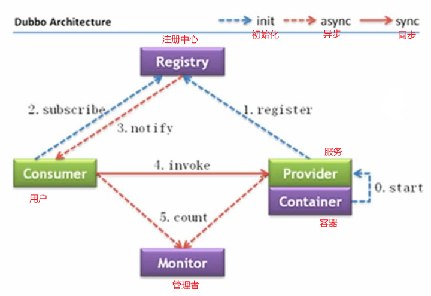
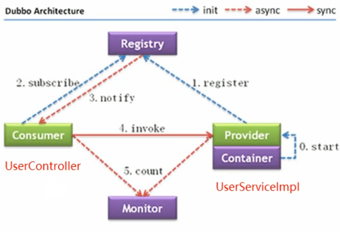
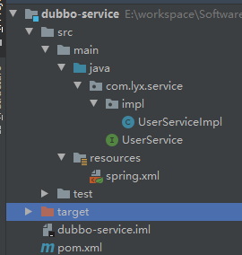
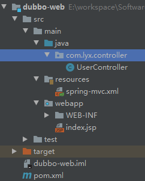
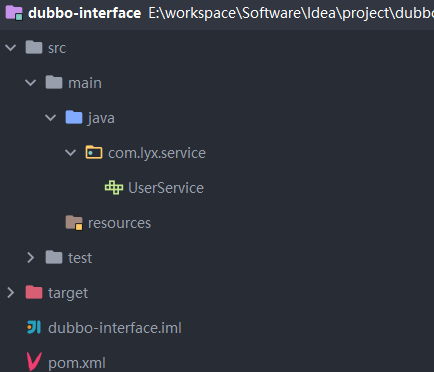
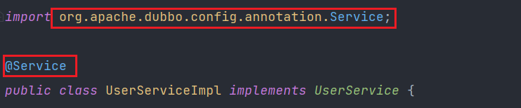
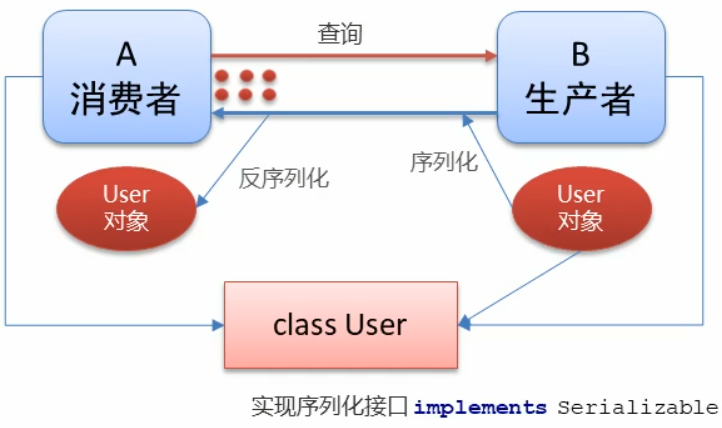
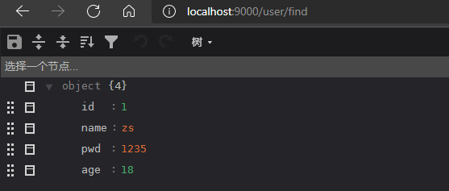

# Dubbo教程

## 1. Dubbo概述

### 1.1 Dubbo概念

* Dubbo是阿里巴巴公司开源的一个高性能、轻量级的 Java rPc框架。

* 致力于提供高性能和透明化的RPC远程服务调用方案,以及SOA服务治理方案。
* 官网[Apache Dubbo](https://dubbo.apache.org/zh/)


### 1.1 Dubbo架构



**角色说明:**

* Provider: 暴露服务的服务提供方
* Container: 服务运行容器
* Consumer: 调用远程服务的服务消费方
* Registry: 服务注册与发现的注册中心
* Monitor: 统计服务的调用次数和调用时间的监控中心


## 2. Zookeeper安装

1. 官网下载zookeeper安装文件

   [Apache Download Zookeeper](https://www.apache.org/dyn/closer.lua/zookeeper/zookeeper-3.7.0/apache-zookeeper-3.7.0-bin.tar.gz)

2. 上传到Linux服务器

3. 启动服务

   ```linux
   # 创建zookeeper安装目录
   sudo mkdir /usr/local/zookeeper
   
   # 将下载的文件复制到安装目录中
   sudo cp apache-zookeeper-3.7.0-bin.tar.gz /usr/local/zookeeper
   
   # 进入安装目录
   cd /usr/local/zookeeper
   
   # 解压文件
   sudo tar -zxvf apache-zookeeper-3.7.0-bin.tar.gz
   
   # 删除压缩包
   sudo rm apache-zookeeper-3.7.0-bin.tar.gz
   
   # 进入配置文件目录
   cd apache-zookeeper-3.7.0-bin/conf/
   
   # 修改配置文件名
   cp zoo_sample.cfg  zoo.cfg
   
   # 创建数据目录
   sudo mkdir /usr/local/zkdata
   
   # 修改zoo.cof的dataDir=/usr/local/zookeeper/zkdata
   
   # 进入bin目录
   cd /usr/local/zookeeper/apache-zookeeper-3.7.0-bin/bin
   
   # 自动zookeeper
   sudo ./zkServer.sh start
   ```

   

## 3. Dubbo快速入门

### 3.1 实现步骤

1. 创建服务提供者Prorider模块
2. 创建服务消费者 Consumer模块
3. 在服务提供者模块编写 UserServicelmp提供服务
4. 在服务消费者中的 UserController远程调用UserServicelmpl提供的服务
5. 分别启动两个服务,测试



### 3.2 创建spring模块



* pom.xml

  ```xml
  <?xml version="1.0" encoding="UTF-8"?>
  <project xmlns="http://maven.apache.org/POM/4.0.0"
           xmlns:xsi="http://www.w3.org/2001/XMLSchema-instance"
           xsi:schemaLocation="http://maven.apache.org/POM/4.0.0 http://maven.apache.org/xsd/maven-4.0.0.xsd">
      <modelVersion>4.0.0</modelVersion>
  
      <groupId>com.lyx</groupId>
      <artifactId>dubbo-service</artifactId>
      <version>1.0-SNAPSHOT</version>
  
      <properties>
          <spring.version>5.1.12.RELEASE</spring.version>
          <dubbo.version>2.7.4.1</dubbo.version>
          <zookeeper.version>4.0.0</zookeeper.version>
      </properties>
  
      <dependencies>
          <!--spring-->
          <dependency>
              <groupId>org.springframework</groupId>
              <artifactId>spring-context</artifactId>
              <version>${spring.version}</version>
          </dependency>
          <!--dubbo-->
          <dependency>
              <groupId>org.apache.dubbo</groupId>
              <artifactId>dubbo</artifactId>
              <version>${dubbo.version}</version>
          </dependency>
          <!--zookeepe客户端实现-->
          <dependency>
              <groupId>org.apache.curator</groupId>
              <artifactId>curator-framework</artifactId>
              <version>${zookeeper.version}</version>
          </dependency>
          <dependency>
              <groupId>org.apache.curator</groupId>
              <artifactId>curator-recipes</artifactId>
              <version>${zookeeper.version}</version>
          </dependency>
  
  
  
      </dependencies>
  
  
  </project>
  ```

  

* com.lyx.service.UserService.java

  ```java
  package com.lyx.service;
  
  public interface UserService {
      String say();
  }
  ```

  

* com.lyx.service.impl.UserServiceImpl.java

  ```java
  package com.lyx.service.impl;
  
  import com.lyx.service.UserService;
  import org.springframework.stereotype.Service;
  
  @Service
  public class UserServiceImpl implements UserService {
      public String say() {
          return "hello world, hello lyx";
      }
  }
  
  ```


* spring.xml

  ```xml
  <?xml version="1.0" encoding="UTF-8"?>
  <beans xmlns="http://www.springframework.org/schema/beans"
         xmlns:xsi="http://www.w3.org/2001/XMLSchema-instance"
         xmlns:context="http://www.springframework.org/schema/context"
         xsi:schemaLocation="
         http://www.springframework.org/schema/beans http://www.springframework.org/schema/beans/spring-beans.xsd
         http://www.springframework.org/schema/context http://www.springframework.org/schema/context/spring-context.xsd
  ">
      <!--开启service包扫描-->
      <context:component-scan base-package="com.lyx.service"/>
  
  </beans>
  ```


### 3.3 创建web模块



* pom.xml

  ```xml
  <?xml version="1.0" encoding="UTF-8"?>
  <project xmlns="http://maven.apache.org/POM/4.0.0"
           xmlns:xsi="http://www.w3.org/2001/XMLSchema-instance"
           xsi:schemaLocation="http://maven.apache.org/POM/4.0.0 http://maven.apache.org/xsd/maven-4.0.0.xsd">
      <modelVersion>4.0.0</modelVersion>
  
      <groupId>com.lyx</groupId>
      <artifactId>dubbo-web</artifactId>
      <version>1.0-SNAPSHOT</version>
      <packaging>war</packaging>
  
      <properties>
          <spring.version>5.1.12.RELEASE</spring.version>
          <dubbo.version>2.7.4.1</dubbo.version>
          <zookeeper.version>4.0.0</zookeeper.version>
      </properties>
  
      <dependencies>
          <!--spring-->
          <dependency>
              <groupId>org.springframework</groupId>
              <artifactId>spring-webmvc</artifactId>
              <version>${spring.version}</version>
          </dependency>
          <!--dubbo-->
          <dependency>
              <groupId>org.apache.dubbo</groupId>
              <artifactId>dubbo</artifactId>
              <version>${dubbo.version}</version>
          </dependency>
          <!--zookeepe客户端实现-->
          <dependency>
              <groupId>org.apache.curator</groupId>
              <artifactId>curator-framework</artifactId>
              <version>${zookeeper.version}</version>
          </dependency>
          <dependency>
              <groupId>org.apache.curator</groupId>
              <artifactId>curator-recipes</artifactId>
              <version>${zookeeper.version}</version>
          </dependency>
  
          <!--导入dubbo-service模块-->
          <dependency>
              <groupId>com.lyx</groupId>
              <artifactId>dubbo-service</artifactId>
              <version>1.0-SNAPSHOT</version>
          </dependency>
  
      </dependencies>
  
      <build>
          <plugins>
              <plugin>
                  <groupId>org.apache.tomcat.maven</groupId>
                  <artifactId>tomcat7-maven-plugin</artifactId>
                  <version>2.1</version>
                  <configuration>
                      <port>8000</port>
                      <path>/</path>
                  </configuration>
              </plugin>
          </plugins>
      </build>
  </project>
  ```

  

* com.lyx.controller.UserController.java

  ```java
  package com.lyx.service.impl;
  
  import com.lyx.service.UserService;
  import org.springframework.stereotype.Service;
  
  @Service
  public class UserServiceImpl implements UserService {
      public String say() {
          return "hello world, hello lyx";
      }
  }
  
  ```


* spring-mvc.xml

  ```xml
  <?xml version="1.0" encoding="UTF-8"?>
  <beans xmlns="http://www.springframework.org/schema/beans"
         xmlns:xsi="http://www.w3.org/2001/XMLSchema-instance"
         xmlns:context="http://www.springframework.org/schema/context"
         xsi:schemaLocation="
         http://www.springframework.org/schema/beans http://www.springframework.org/schema/beans/spring-beans.xsd
         http://www.springframework.org/schema/context http://www.springframework.org/schema/context/spring-context.xsd
  ">
      <!--开启controller包扫描-->
      <context:component-scan base-package="com.lyx.controller"/>
  
  </beans>
  ```


* web.xml

  ```xml
  <!DOCTYPE web-app PUBLIC
          "-//Sun Microsystems, Inc.//DTD Web Application 2.3//EN"
          "http://java.sun.com/dtd/web-app_2_3.dtd" >
  
  <web-app>
      <display-name>Archetype Created Web Application</display-name>
  
      <context-param>
          <param-name>contextConfigLocation</param-name>
          <param-value>classpath:spring.xml</param-value>
      </context-param>
      <!--spring框架启动-->
      <listener>
          <listener-class>org.springframework.web.context.ContextLoaderListener</listener-class>
      </listener>
  
      <!--springMVC前端控制器-->
      <servlet>
          <servlet-name>dispatcherServlet</servlet-name>
          <servlet-class>org.springframework.web.servlet.DispatcherServlet</servlet-class>
          <init-param>
              <param-name>contextConfigLocation</param-name>
              <param-value>classpath:spring-mvc.xml</param-value>
          </init-param>
          <load-on-startup>1</load-on-startup>
      </servlet>
      <servlet-mapping>
          <servlet-name>dispatcherServlet</servlet-name>
          <url-pattern>/</url-pattern>
      </servlet-mapping>
  </web-app>
  ```


### 3.4 测试

 


### 3.5 使用Dubbo+Zookeeper

#### 3.5.1 创建公共接口创建模块

  


```java
package com.lyx.service;

public interface UserService {
    public String say();
}
```


#### 3.5.2 改造double-service模块

1. 引入dubbo-interface模块

   ```xml
   <dependency>
       <groupId>com.lyx</groupId>
       <artifactId>dubbo-interface</artifactId>
       <version>1.0-SNAPSHOT</version>
   </dependency>
   ```

   

2. 删除项目中原来的接口

3. 将实现类中的注解替换为dubbo接口的

    

4. 修改spring.xml文件

   ```xml
   <?xml version="1.0" encoding="UTF-8"?>
   <beans xmlns="http://www.springframework.org/schema/beans"
          xmlns:xsi="http://www.w3.org/2001/XMLSchema-instance"
          xmlns:dubbo="http://dubbo.apache.org/schema/dubbo"
          xsi:schemaLocation="
          http://www.springframework.org/schema/beans http://www.springframework.org/schema/beans/spring-beans.xsd
          http://dubbo.apache.org/schema/dubbo http://dubbo.apache.org/schema/dubbo/dubbo.xsd
   ">
   
       <!--dubbo的配置-->
       <!--1.配置项目的名称，唯一-->
       <dubbo:application name="dubbo-service"/>
       <!--2.配置注册中心地址-->
       <dubbo:registry address="zookeeper://192.168.31.43:2181"/>
       <!--3.配置dubbo包扫描-->
       <dubbo:annotation package="com.lyx.service.impl"/>
       <!--服务端口，每个服务端口都不一样-->
       <dubbo:protocol port="20880" />
       <!-- 元数据配置 -->
       <dubbo:metadata-report address="zookeeper://192.168.31.43:2181" />
   
   </beans>
   ```

5. 增加web.xml的spring.xml监听器

   ```xml
   <!DOCTYPE web-app PUBLIC
           "-//Sun Microsystems, Inc.//DTD Web Application 2.3//EN"
           "http://java.sun.com/dtd/web-app_2_3.dtd" >
   
   <web-app>
     <display-name>Archetype Created Web Application</display-name>
   
     <context-param>
       <param-name>contextConfigLocation</param-name>
       <param-value>classpath:spring.xml</param-value>
     </context-param>
     <!--spring框架启动-->
     <listener>
       <listener-class>org.springframework.web.context.ContextLoaderListener</listener-class>
     </listener>
   
   </web-app>
   
   ```

6. 将打包方式改为war包

   ```xml
   <packaging>war</packaging>
   ```

   

#### 2.5.3 改造dubbo-controller模块

1. 引入dubbo-interface模块

   ```xml
   <dependency>
       <groupId>com.lyx</groupId>
       <artifactId>dubbo-interface</artifactId>
       <version>1.0-SNAPSHOT</version>
   </dependency>
   ```

2. 使用@Reference注入远程依赖

   ```java
   @Reference
   public UserService userService;
   ```

3. 改造spring-mvc.xml文件

   ```xml
   <?xml version="1.0" encoding="UTF-8"?>
   <beans xmlns="http://www.springframework.org/schema/beans"
          xmlns:xsi="http://www.w3.org/2001/XMLSchema-instance"
          xmlns:dubbo="http://dubbo.apache.org/schema/dubbo"
          xmlns:context="http://www.springframework.org/schema/context"
          xmlns:mvc="http://www.springframework.org/schema/mvc"
          xsi:schemaLocation="
          http://www.springframework.org/schema/beans http://www.springframework.org/schema/beans/spring-beans.xsd
          http://dubbo.apache.org/schema/dubbo http://dubbo.apache.org/schema/dubbo/dubbo.xsd
          http://www.springframework.org/schema/context http://www.springframework.org/schema/context/spring-context.xsd
          http://www.springframework.org/schema/mvc http://www.springframework.org/schema/mvc/spring-mvc.xsd
   ">
       <mvc:annotation-driven/>
       <context:component-scan base-package="com.lyx.controller"/>
   
       <!--dubbo的配置-->
       <!--1.配置项目的名称，唯一-->
       <dubbo:application name="dubbo-web">
           <dubbo:parameter key="qos.port" value="3333"/>
       </dubbo:application>
       <!--2.配置注册中心地址-->
       <dubbo:registry address="zookeeper://192.168.31.43:2181"/>
       <!--3.配置dubbo包扫描-->
       <dubbo:annotation package="com.lyx.controller"/>
       
   
   </beans>
   ```

4. 去掉web.xml中的spring.xml的监听器

   ```xml
   <!DOCTYPE web-app PUBLIC
           "-//Sun Microsystems, Inc.//DTD Web Application 2.3//EN"
           "http://java.sun.com/dtd/web-app_2_3.dtd" >
   
   <web-app>
     <display-name>Archetype Created Web Application</display-name>
   
   <!--  <context-param>-->
   <!--    <param-name>contextConfigLocation</param-name>-->
   <!--    <param-value>classpath:spring.xml</param-value>-->
   <!--  </context-param>-->
   <!--  &lt;!&ndash;spring框架启动&ndash;&gt;-->
   <!--  <listener>-->
   <!--    <listener-class>org.springframework.web.context.ContextLoaderListener</listener-class>-->
   <!--  </listener>-->
   
     <!--springMVC前端控制器-->
     <servlet>
       <servlet-name>dispatcherServlet</servlet-name>
       <servlet-class>org.springframework.web.servlet.DispatcherServlet</servlet-class>
       <init-param>
         <param-name>contextConfigLocation</param-name>
         <param-value>classpath:spring-mvc.xml</param-value>
       </init-param>
       <load-on-startup>1</load-on-startup>
     </servlet>
     <servlet-mapping>
       <servlet-name>dispatcherServlet</servlet-name>
       <url-pattern>/</url-pattern>
     </servlet-mapping>
   </web-app>
   ```


#### 2.5.4 测试

 


## 4. Dubbo高级特性

### 4.1 序列化

> **两台机器之间如何传输java对象?**

 

* dubbo内部已经将序列化和反序列化的过程内部封装了
* 我们只需要在定义pojo类时实现Serializable接口即可
* 一般会定义一个公共的pojo模块，让生产者和消费者都依赖该模块。


#### 4.1.1 改造案例

* 创建pojo模块

* 创建User实体类，实现Serializable接口

  ```java
  package com.lyx.pojo;
  
  import lombok.AllArgsConstructor;
  import lombok.Data;
  import lombok.NoArgsConstructor;
  
  import java.io.Serializable;
  
  @Data
  @AllArgsConstructor
  @NoArgsConstructor
  public class User implements Serializable {
      private Integer id;
      private String name;
      private String pwd;
      private Integer age;
  }
  ```

* dubbo-interface模块中加入依赖

  ```xml
  <dependency>
      <groupId>com.lyx</groupId>
      <artifactId>dubbo-pojo</artifactId>
      <version>1.0-SNAPSHOT</version>
  </dependency>
  ```

* 创建getUserById接口

  ```java
  public User getUserById(Integer id);
  ```

  

* 创建getUserById接口实现类

  ```java
  @Override
  public User getUserById(Integer id) {
      return new User(1, "zs", "1235", 18);
  }
  ```

  

* 在controller中创建find方法

  ```java
  @RequestMapping("find")
  public User find(){
      return userService.getUserById(1);
  }
  ```

  

* 测试

   


### 4.2 地址缓存

> **注册中心挂了，服务是否可以正常访问？**

* **可以**，因为dubbo服务消费者在第一次调用时，会将服务**提供方地址缓存到本地**，**以后在调用则不会访问注册中心**。

* 当服务提供者**地址发生变化时**，**注册中心会通知服务消费者**。


### 4.3 超时与重试

#### 4.3.1 超时

* 服务消费者在调用服务提供者的时候**发生了阻塞、等待**的情形，这个时候，**服务消费者会一直等待下去**。
* 在某个峰值时刻，大量的请求都在同时请求服务消费者，会造成线程的**大量堆积，势必会造成雪崩**。
* dubbo利用**超时机制**来解决这个问题，设置一个超时时间，**在这个时间段内，无法完成服务访问，则自动断开连接**。
* 使用**timeout**属性配置超时时间，**默认值1000,单位毫秒**

 设置timeout属性：

1. 设置在服务提供者上（推荐）

   ```java
   @Service(timeout = 3000)
   ```

   

2. 设置在消费者上（会覆盖掉提供者的timeout属性）

   ```java
   @Reference(timeout = 3000)
   ```


#### 4.3.2 重试

* 设置了超时时间，在这个时间段内，无法完成服务访问，则自动断开连接。
* 如果出现网络抖动，则这一次请求就会失败。
* Dubbo提供重试机制来避免类似问题的发生。
* 通过retries属性来设置重试次数。默认为2次。

```java
@Service(timeout = 3000,retries = 3) //超时一次，重试3次，最多一共4次
```


### 4.4 多版本

* 灰度发布：当出现新功能时，会让一部分用户先使用新功能，用户反馈没问题时，再将所有用户迁移到新功能。
* dubbo中使用version属性来设置和调用同一个接口的不同版本

1. 创建不同版本的服务

   * new

     ```java
     @Service(version = "2.0")
     public class UserServiceImpl2 implements UserService {
         @Override
         public String say() {
             System.out.println("hello double!");
             return "hello,double! new version";
         }
     }
     
     ```

     

   * old

     ```java
     @Service(version = "1.0")
     public class UserServiceImpl implements UserService {
         @Override
         public String say() {
             System.out.println("hello double!");
             return "hello,double! old version";
         }
     }
     ```

2. 使用@Reference接收不同版本的服务

   ```java
    @Reference(version = "2.0")
      public UserService userService;
   ```

   

### 4.5 负载均衡

负载均衡策略（4种）:

* Random(默认):按权重随机，默认值。按权重设置随
  机概率。
* RoundRobin:按权重轮询。
* LeastActive:最少活跃调用数，相同活跃数的随
  机。
* ConsistentHash:一致性Hash,相同参数的请求
  总是发到同一提供者。

1. 设置服务提供者权重

   ```java
   @Service(weight = 100)
   ```

   

2. 设置负载均衡策略

   ```java
   @Reference(loadbalance = "random")
   ```


### 4.6 集群容错

集群容错模式:
·

* Failover cluster:失败重试。默认值。当出现失败,重试其它服务器,默认重试2次,使用 retries配置。一般用于读操作
* Failfast Cluster:快速失败,只发起一次调用,失败立即报错。通常用于写操作。
* Failsafe cluster:失败安全,出现异常时,直接忽略。返回一个空结果。
* Failback cluster:失败自动恢复,后台记录失败请求,定时重发。
* Forking Cluster:并行调用多个服务器,只要个成功即返回。
* Broadcast cluster:广播调用所有提供者,逐个调用,任意台报错则报错。

设置集群容错模式：

```java
@Reference(cluster = "failover")
```


### 4.7 服务降级

服务降级方式

* mock= force:return null表示消费**方对该服务的方法调用都直接返回nul值,不发起远程调用**。用来屏蔽不重要服务不可用时对调用方的影响
* mock= fail: return null表示消费方对**该服务的方法调用在失败后,再返回nul值,不抛异常**。用来容忍不重要服务不稳定时对调用方的影响

设置服务降级

```java
@Reference(mock = "force:return null")
```


