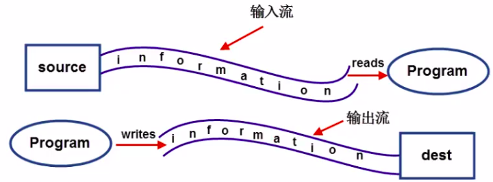
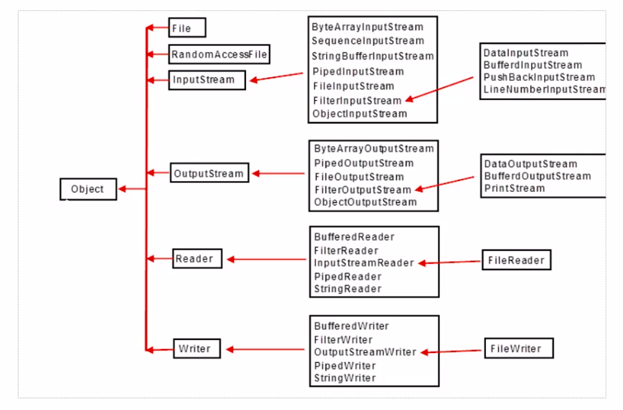

# IO流

## 1. 四大io抽象类

> **InputStream/OutputStream(字节输入出输出流)**和**Reader/Writer(字符输入输出流)类**是所有IO流类的抽象父类，我们有必要简单了解一下这个四个抽象类的作用。然后，通过它们具体的子类熟悉相关的用法。

### 1.1 InputStream

**此抽象类是表示字节输入流的所有类的父类**。InputSteam是一个抽象类，它不可以实例化。数据的读取需要由它的子类来实现。根据节点的不同，它派生了不同的节点流子类。

继承自InputSteam的流都是用于向程序中输入数据，且数据的单位为字节(8 bit)。

#### 1.1.1 常用方法

* `int read()`:	读取一个字节的数据，并将字节的值作为int类型返回（0-255之间的一个值）。如果未读出字节则返回-1(返回值为-1表示读取结束）。
* `void close()`:    关闭输入流对象，释放相关系统资源。


### 1.2 OutputStream

**此抽象类是表示字节输出流的所有类的父类**。输出流接收输出字节并将这些字节发送到某个目的地。

#### 1.2.1 常用方法

* `void write(int n)`:    向目的地中写入一个字节。
* `void close()`:    关闭输出流对象，释放相关系统资源。

### 1.3 Reader

用于读取的字符流抽象类，数据单位为字符。

#### 1.3.1 常用方法

* `int read()`:    读取一个字符的数据，并将字符的值作为int类型返回（0-65535之间的一个值，即Unicode值）。如果未读出字符则返回-1(返回值为-1表示读取结束）。
* `void close()`:    关闭流对象，释放相关系统资源。

### 1.4 Writer
用于输出的字符流抽象类，数据单位为字符。

#### 1.4.1 常用方法

* `void write(int n)`:    向输出流中写入一个字符。
* `void close()`:    关闭输出流对象，释放相关系统资源。

## 2. 流的概念细分

### 2.1 按流的方向分类

* 输入流：数据流从数据源到程序（以InputStream、Reader结尾的流）。
* 输出流：数据流从程序到目的地（以OutPutStream、Writer结尾的流）。



### 2.2 按处理的数据单元分类

* 字节流:    以字节为单位获取数据,命名上以 Stream结尾的流一般是字节流,如 FileInputstream、 File OutputStream。
* 字符流:    以字符为单位获取数据,命名上以 Reader/ Writer结尾的流一般是字符流,如 File Reader、File writer。

### 2.3 按处理对象不同分类

* 节点流:    可以直接从数据源或目的地读写数据,如 FileInputstream、 FileReader、
  DataInputstream等
* 处理流:    不直接连接到数据源或目的地,是″处理流的流″。通过对其他流的处理提高程序的性能,如 BufferedInputStream、 Buffered Reader等。处理流也叫包装流

## 3. IO流的体系



**总结：**

1. InputStream/OutputStream

   字节流的抽象类。

2. Reader/Writer
   字符流的抽象类。

3. FilelnputStream/FileOutputStream
   节点流：以字节为单位直接操作“文件”。

4. ByteArraylnputStream/ByteArrayOutputStream
   节点流：以字节为单位直接操作“字节数组对象”。

5. ObjectlnputStream/ObjectOutputStream
   处理流：以字节为单位直接操作“对象”。

6. DatalnputStream/DataOutputStream
   处理流：以字节为单位直接操作“基本数据类型与字符串类型”。

7. FileReader/FileWriter
   节点流：以字符为单位直接操作“文本文件”（注意：只能读写文本文件）。

8. BufferedReader/BufferedWriter
   处理流：将Reader/Writer对象进行包装，增加缓存功能，提高读写效率。

9. BufferedlnputStream/BufferedOutputStream
   处理流：将InputStream/OutputStream对象进行包装，增加缓存功能，提高读写效率。

10. InputStreamReader/OutputStreamWriter
    处理流：将字节流对象转化成字符流对象。

11. PrintStream
    处理流：将OutputStream进行包装，可以方便地输出字符，更加灵活。

## 4. 入门案例

要求：读取文件中的内容

```java
// 使用try-with-resource结构自动关闭FileInputStream流
try(FileInputStream fis = new FileInputStream("demo-04-IO/a.txt");){
    StringBuffer sb = new StringBuffer();  // 创建可变字符序列用于接收字符
	int temp = 0;  //定义标记
	while((temp = fis.read()) != -1){  //当读取不到时，返回-1，结束循环
    	sb.append((char) temp);  //将读取到的二进制数转换成字符，并添加到可变字符序列中
    }
    System.out.println(sb);
}catch (Exception e){
	e.printStackTrace();
}
```

## 5. File类的使用

### 5.1 File 类简介

#### 5.1.1File类的作用

File 类是Java提供的针对磁盘中的文件或目录转换对象的包装类。一个File对象而可以
代表一个文件或目录，File对象可以实现获取文件和目录属性等功能，可以实现对文件和目
录的创建，删除等功能。

#### 5.1.2File类操作目录与文件的常用方法

##### 5.1.2.1针对文件操作的方法

* `createNewFile()`:	创建新文件。

* `delete()`:    直接从磁盘上删除

* `exists()`:    查询磁盘中的文件是否存在

* `getAbsolutePath()`:    获取绝对路径

* `getPath()`:    获取相对路径

* `isFile()`:    判断是否是文件

* `length()`:    查看文件中的字节数

* `isHidden()`:    测试文件是否被这个抽象路径名是一个隐藏文件。

  

##### 5.1.2.2针对目录操作的方法

* `exists()`:    查询目录是否存在
* `isDirectory()`:    判断当前路径是否为目录
* `mkdir()`:    创建目录
* `getParentFile()`:    获取当前目录的父级目录。
* `list()`:    返回一个字符串数组，包含目录中的文件和目录的路径名。
* `listFiles`:    返回一个File数组,表示用此抽象路径名表示的目录中的文件。


## 6. 常用流对象

> FileInputStream通过**字节**的方式读取文件,**适合读取所有类型的文件**(图像、视频、文
> 本文件等)。Java也提供了 **FileReader专门读取文本文件**。
>
> FileOutputstream通过**字节**的方式写数据到文件中,**适合所有类型的文件**。Java也提供
> 了 **Filewriter专门写入文本文件**。

### 6.1 文件字节流

#### 6.1.1 文件字节输入流

```java
// 使用try-with-resource结构自动关闭FileInputStream流
try(FileInputStream is = new FileInputStream("demo-04-IO/a.txt");){  
    int temp = 0;
    while((temp = is.read()) != -1){
        System.out.println((char)temp);
    }
}catch (Exception e){
    e.printStackTrace();
}
```

#### 6.1.2 文件字节输出流

```java
// 使用try-with-resource结构自动关闭FileInputStream流                              
try(FileInputStream is = new FileInputStream("demo-04-IO/a.txt");         
    FileOutputStream out = new FileOutputStream("demo-04-IO/b.txt");){    
    int temp = 0;                                                         
    while((temp = is.read()) != -1){                                      
       out.write(temp);  //将读取到二进制数据，写入到文件中。                           
    }                                                                     
    out.flush();  //刷新缓存                                                  
}catch (Exception e){                                                     
    e.printStackTrace();                                                  
}                                                                                                
```

#### 6.1.3 使用缓冲区提高读写效率

##### 6.1.3.1 方法一（大文件）

```java
public class FileStreamBufferTest {
    /**
     * @Description: 文件拷贝（未添加缓存）
     * @Param: [is 输入流, out 输出流]
     * @return: void
     * @Author: lyx
     * @Date: 2021/6/4 下午6:52
     */
    public void fileCopy(FileInputStream is, FileOutputStream out) throws IOException {
        int len = 0;
        while((len = is.read()) != -1){  //循环读取文件
            out.write(len);  //将数据写入文件中
        }
        out.flush();  //刷新缓存
    }

    /**
     * @Description: 文件拷贝（添加缓冲区）
     * @Param: [is 输入流, out 输出流]
     * @return: void
     * @Author: lyx
     * @Date: 2021/6/4 下午7:00
     */
    public void fileCopyBuffer(FileInputStream is, FileOutputStream out) throws IOException{
        byte[] buffer = new byte[1024];  //创建1024个字节的缓冲区
        int len = 0;
        while((len = is.read(buffer)) != -1){  //根据缓冲区大小循环读取文件
            out.write(buffer, 0, len);  //将缓冲区写入到文件中
        }
        out.flush();  //清空缓冲
    }

    /**
     * @Description: 计算复制方法运行时间
     * @Param: [is 输入流, out 输出流, flag 判断是否使用buffer]
     * @return: double 方法运行时间
     * @Author: lyx
     * @Date: 2021/6/4 下午7:10
     */
    public double fileCopyMethodRunTime(FileInputStream is, FileOutputStream out, String flag){
        double start = System.currentTimeMillis();
        try{
            if(flag.equals("buffer")){
                fileCopyBuffer(is, out);
            }else{
                fileCopy(is, out);
            }
        }catch (Exception e){
            e.printStackTrace();
        }finally {
           try{
               if(out != null){
                   out.close();
               }
               if(is != null){
                   is.close();
               }
           }catch (Exception e){
               e.printStackTrace();
           }
        }

        double end = System.currentTimeMillis();
        return end - start;
    }

    public static void main(String[] args) throws FileNotFoundException {
        FileInputStream is = new FileInputStream("demo-04-IO/info.txt");
        FileOutputStream out = new FileOutputStream("demo-04-IO/infoCopy.txt");
        double noBufferTime = new FileStreamBufferTest().fileCopyMethodRunTime(is, out, "noBuffer");
        System.out.println("未使用Buffer文件拷贝时间"+noBufferTime);
        FileInputStream isBuffer = new FileInputStream("demo-04-IO/info.txt");
        FileOutputStream outBuffer = new FileOutputStream("demo-04-IO/infoCopyBuffer.txt");
        double bufferTime = new FileStreamBufferTest().fileCopyMethodRunTime(isBuffer, outBuffer, "buffer");
        System.out.println("使用Buffer文件拷贝时间"+bufferTime);


    }
}

```

##### 6.1.3.2 方法二（小文件）

```java
FileInputStream fis = null;
FileOutputStream fos = null;
try {
    fis = new FileInputStream("demo-04-IO/info.txt");
    fos = new FileOutputStream("demo-04-IO/infoCopyBufferMin.txt");
    int len = fis.available();  //获取文件的长度（注意：大文件不能使用该方式，否则会导致内存占用过多）
    byte[] buffer = new byte[len];  //创建缓冲区
    fis.read(buffer);
    fos.write(buffer);  //缓冲区的大小等于文件的大小，可一次读完。
    fos.flush;  //清空缓冲
} catch (FileNotFoundException e) {
    e.printStackTrace();
} catch (IOException e) {
    e.printStackTrace();
}finally {
    //关闭流
    try{
        if(fos != null)
            fos.close();
        if(fis != null)
            fos.close();
    } catch (IOException e) {
        e.printStackTrace();
    }
}
```

#### 6.1.4 使用缓冲流提高读写效率

Java缓冲流本身并不具有IO流的读取与写入功能，只是在别的流（节点流或其他处理流）上加上缓冲功能提高效率，就像是把别的流包装起来一样，因此缓冲流是一种**处理流（包装流）**。

当对文件或者其他数据源进行频繁的读写操作时，效率比较低，这时如果使用缓冲流就能够更高效的读写信息。因为缓冲流是先将数据缓存起来，然后当缓存区存满后或者手动刷新时再一次性的读取到程序或写入目的地。

因此，缓冲流还是很重要的，我们在IO操作时记得加上缓冲流来提升性能

`BufferedlnputStream`和`BufferedOutputstream`这两个流是缓冲字节流，通过内部缓存数
组来提高操作流的效率。

```java
FileInputStream fis = null;
FileOutputStream fos = null;
BufferedInputStream bis = null;
BufferedOutputStream bos = null;
try {
    fis = new FileInputStream("demo-04-IO/info.txt");
    bis = new BufferedInputStream(fis);
    fos = new FileOutputStream("demo-04-IO/infoCopyBuffer2.txt");
    bos = new BufferedOutputStream(fos);
    int temp = 0;
    while((temp = bis.read()) != -1){  //缓冲流中有缓冲区，无需自己定义
        bos.write(temp);
    }
    bos.flush();  //清空缓冲
} catch (FileNotFoundException e) {
    e.printStackTrace();
} catch (IOException e) {
    e.printStackTrace();
}finally {
    // 关闭资源
    // 1.多个流嵌套(一个流传到另一个流),只关最外面的
    // 2.自己创建的流 自己关
    // 3.从系统中获取的流 不用你来关闭
    try{
        if(bos != null)
            bos.close();
    } catch (IOException e) {
        e.printStackTrace();
    }
    try{
        if(bis != null)
            bis.close();
    } catch (IOException e) {
        e.printStackTrace();
    }
}
```

#### 6.1.5 文件拷贝工具类

```java
public class FileCopy {
    private static BufferedInputStream bis;
    private static BufferedOutputStream bos;

    public static String copy(String in, String out) {
        String result = "";
        try {
            //将传入的字符串转成缓冲流
            setBufferedRoot(in, out);
            //文件复制
            copy();
        } catch (FileNotFoundException e) {
            e.printStackTrace();
            result = "文件没有找到！";
        } catch (IOException e) {
            e.printStackTrace();
            result = "文件复制发生错误！";
        } finally {
            close();
            result = "文件复制成功！";

        }
        return result;
    }

    /**
     * @Description: 将传入的字符串转换成缓冲流对象
     * @Param: [in 源文件路径字符串, out 目标文件字符串路径]
     * @return: void
     * @Author: lyx
     * @Date: 2021/6/6 下午2:38
     */
    private static void setBufferedRoot(String in, String out) throws FileNotFoundException {
        bis = new BufferedInputStream(new FileInputStream(in));
        bos = new BufferedOutputStream(new FileOutputStream(out));
    }

    /**
     * @Description: 文件拷贝
     * @Param: []
     * @return: void
     * @Author: lyx
     * @Date: 2021/6/6 下午2:51
     */
    private static void copy() throws IOException {
        int temp = 0;
        while((temp = bis.read()) != -1){
            bos.write(temp);
        }
        //使用缓冲流关闭对象时也会调用flush()方法，在此也可不刷新缓冲
        bos.flush();
    }

    /**
     * @Description: 关闭流
     * @Param: [bis 缓冲输入流, bos 缓冲输出流]
     * @return: void
     * @Author: lyx
     * @Date: 2021/6/6 下午2:44
     */
    private static void close(){
        try{
            if(bos != null)
                bos.close();  // 使用缓冲流关闭对象，无需关闭节点流对象
        } catch (IOException e) {
            e.printStackTrace();
        }
        try{
            if(bis != null)
                bis.close();
        } catch (IOException e) {
            e.printStackTrace();
        }
    }

}
```

### 6.2 文件字符流

前面介绍的文件字节流可以处理所有的文件，如果我们处理的是**文本文件**，也可以使用**文件字符流**，它**以字符为单位**进行操作。、

#### 6.2.1 文件字符输入流

```java
//使用try-with-resource结构，自动关闭流
try(FileReader reader = new FileReader("demo-04-IO/a.txt")){
    int temp = 0;
    while((temp = reader.read()) != -1){
        System.out.println(temp + " : " + (char)temp);
    }
} catch (FileNotFoundException e) {
    e.printStackTrace();
} catch (IOException e) {
    e.printStackTrace();
}
```

#### 6.2.2 文件字符输出流

```java
//使用try-with-resource结构，自动关闭流
try(FileWriter writer = new FileWriter("demo-04-IO/a.txt", true)){  //默认append的值为false：直接覆盖；true表示追加到文件末尾
    writer.write("\r\n你好，世界！");
    writer.flush();  //刷新缓冲
} catch (IOException e) {
    e.printStackTrace();
}
```

#### 6.2.3 文本文件拷贝

```java
 try(FileReader reader = new FileReader("demo-04-IO/a.txt");
     FileWriter writer = new FileWriter("demo-04-IO/aCopyText.txt")){
     int temp = 0;
     while((temp = reader.read()) != -1){
         writer.write(temp);
     }
     writer.flush();
 } catch (FileNotFoundException e) {
     e.printStackTrace();
 } catch (IOException e) {
     e.printStackTrace();
 }
```

##### 6.2.3.1 创建缓冲区提高拷贝效率

```java
try(FileReader reader = new FileReader("demo-04-IO/a.txt");
    FileWriter writer = new FileWriter("demo-04-IO/aCopyTextBuffer.txt")){
    char[] buffer = new char[1024];  //创建缓冲区1024个字符
    int len = 0;
    while((len = reader.read(buffer)) != -1){
        writer.write(buffer,0, len);
    }
    writer.flush();
} catch (FileNotFoundException e) {
    e.printStackTrace();
} catch (IOException e) {
    e.printStackTrace();
}
```

#### 6.2.4 文件字符缓冲流

> `BufferedReader`/`BufferedWriter`增加了缓存机制，大大提高了读写文本文件的效率。

##### 6.2.4.1字符输入缓冲流
> `BufferedReader`是针对字符输入流的缓冲流对象，提供了更方便的按行读取的方法：`readLine()`;在使用字符流读取文本文件时，我们可以使用该方法以行为单位进行读取。

```java
try(FileReader reader = new FileReader("demo-04-IO/a.txt");
    BufferedReader bufferedReader = new BufferedReader(reader)){
    String temp = "";
    while((temp = bufferedReader.readLine()) != null){  //每次读取一行
        System.out.println(temp);
    }

} catch (FileNotFoundException e) {
    e.printStackTrace();
} catch (IOException e) {
    e.printStackTrace();
}
```

##### 6.2.4.2 字符输出缓冲流

> `BufferedWriter`是针对字符输出流的缓冲流对象，在字符输出缓冲流中可以使用`newLine()`;方法实现换行处理。

```java
 try(FileWriter writer = new FileWriter("demo-04-IO/a.txt", true);
     BufferedWriter bufferedWriter = new BufferedWriter(writer)){
     bufferedWriter.newLine();  //换行
     bufferedWriter.write("你好，java");  //写入文字
     bufferedWriter.flush();
 } catch (IOException e) {
     e.printStackTrace();
 }
```

#### 6.2.5 文本文件拷贝工具

```java
public class TextFileCopy {
    private static BufferedReader bufferedReader;
    private static BufferedWriter bufferedWriter;

    /**
     * @Description: 复制文本文件
     * @Param: [in 文件路径, out 复制路径]
     * @return: java.lang.String
     * @Author: lyx
     * @Date: 2021/6/7 上午10:55
     */
    public static String copyFile(String in, String out){
        String result = "";
        try{
            //将传入的字符串转成缓冲流
            setBufferedRoot(in, out);
            //文件复制
            copy();
            result = "文件复制成功！";
        } catch (IOException e) {
            e.printStackTrace();
            result =  "文件复制失败！";
        }finally {
            //关闭流
            close();
            return result;
        }
    }

    /**
     * @Description: 将传入的字符串转换成缓冲流对象
     * @Param: [in 源文件路径字符串, out 目标文件字符串路径]
     * @return: void
     * @Author: lyx
     * @Date: 2021/6/7 上午10:57
     */
    public static void setBufferedRoot(String in, String out) throws IOException {
        bufferedReader = new BufferedReader(new FileReader(in));
        bufferedWriter = new BufferedWriter(new FileWriter(out));
    }

    /**
     * @Description: 文件拷贝
     * @Param: []
     * @return: void
     * @Author: lyx
     * @Date: 2021/6/7 上午10:57
     */
    private static void copy() throws IOException {
        String temp = "";
        while((temp = bufferedReader.readLine()) != null){
            bufferedWriter.write(temp);
            bufferedWriter.newLine();
        }
        bufferedWriter.flush();
    }

    /**
     * @Description: 关闭io流
     * @Param: []
     * @return: void
     * @Author: lyx
     * @Date: 2021/6/7 上午11:01
     */
    private static void close(){
        try {
            if (bufferedWriter != null)
                bufferedWriter.close();
        } catch (IOException e) {
            e.printStackTrace();
        }
        try {
            if (bufferedReader != null)
                bufferedReader.close();
        } catch (IOException e) {
            e.printStackTrace();
        }

    }
}
```

## 7. 转换流

`InputStreamReader`/`OutputStreamWriter`用来实现将字节流转化成字符流。比如，如下场景：

System.in是字节流对象，代表键盘的输入，如果我们想按行接收用户的输入时，就必须用到缓冲字符流`BufferedReader`特有的方法`readLine()`,但是经过观察会发现在创建`BufferedReader`的构造方法的参数必须是一个`Reader`对象，这时候我们的转换流`InputStreamReader`就派上用场了。

而System.out也是字节流对象，代表输出到显示器，按行读取用户的输入后，并且要将读取的一行字符串直接显示到控制台，就需要用到字符流的`write(String str)`方法，所以我们要使用`OutputStreamWriter`将字节流转化为字符流。

```java
BufferedWriter bufferedWriter = null;
BufferedReader bufferedReader = null;
try {
    //将字节输入流转换成字符输入流
    bufferedReader = new BufferedReader(new InputStreamReader(System.in));
    //将字符输出流转换成字节输出流
    bufferedWriter = new BufferedWriter(new OutputStreamWriter(System.out));
    while(true){
        bufferedWriter.write("input: ");
        bufferedWriter.flush();
        String in = bufferedReader.readLine();
        if(in.equals("exit")){
            bufferedWriter.write("Game Over！");
            bufferedWriter.flush();
            break;
        }
        bufferedWriter.write("out: "+ in);
        bufferedWriter.newLine();
        bufferedWriter.flush();

    }
} catch (IOException e) {
    e.printStackTrace();
}finally {
    try{
        if(bufferedWriter != null)
            bufferedWriter.close();
    } catch (IOException e) {
        e.printStackTrace();
    }
    try{
        if(bufferedReader != null)
            bufferedReader.close();
    } catch (IOException e) {
        e.printStackTrace();
    }
}
```

## 8. 字符输出流

在Java的IO流中专门提供了用于字符输出的流对象`PrintWriter`。该对象具有**自动行刷**
**新缓冲字符输出流**，特点是**可以按行写出字符串**，并且可通过`println()`方法实现自动换行。

```java
BufferedReader br = null;
PrintWriter pw = null;
try{
    br = new BufferedReader(new InputStreamReader(new FileInputStream("demo-04-IO/a.txt")));
    pw = new PrintWriter("demo-04-IO/aNumber.txt");
    String temp = "";
    int i = 1;
    while((temp = br.readLine()) != null){
        pw.println("【"+i+"】"+temp);
        i++;
    }
} catch (FileNotFoundException e) {
    e.printStackTrace();
} catch (IOException e) {
    e.printStackTrace();
}finally {
    try{
        if(pw != null)
            pw.close();
    }catch(Exception e){
        e.printStackTrace();
    }
    try{
        if(br != null)
            br.close();
    }catch(Exception e){
        e.printStackTrace();
    }
}
```


## 9.字节数组流

`ByteArrayInputstream`和 `ByteArrayOutputstream`经常用在需要流和数组之间转化的情况。

### 9.1 字节数组输入流

说白了, `FilelnputStream`是把文件当做数据源。 `ByteArrayInputstream`则是把内存中的字节数组对象″当做数据源。

```java
byte[] arr = "hello,world!".getBytes();
ByteArrayInputStream bis = null;
try{
    bis = new ByteArrayInputStream(arr);
    int temp = 0;
    while((temp = bis.read()) != -1){
        System.out.print((char)temp+"\t");
    }
}finally {
    try {
        if(bis != null)
            bis.close();
    } catch (IOException e) {
        e.printStackTrace();
    }
}
```

### 9.2 字节数组输出流

Byte ArrayOutputStream流对象是将流中的数据写入到字节数组中。

```java
ByteArrayOutputStream bos = null;
try{
    bos = new ByteArrayOutputStream();
    bos.write('a');  //传入的参数必须是int型的，char类型可以自动转换成int型
    bos.write('b');
    byte[] arr = bos.toByteArray();  //得到内存中的字节数组
    for (int temp :
         arr) {
        System.out.println((char)temp);
    }
}finally {
    try{
        if(bos != null){
            bos.close();
        }
    } catch (IOException e) {
        e.printStackTrace();
    }
}
```

### 10. 数据流

数据流将“基本数据类型与字符串类型″作为数据源,从而允许程序以与机器无关的方式从底层输入输出流中操作Java基本数据类型与字符串类型。

`DataInputstream`和`DataOutputstream`提供了可以存取与机器无关的所有Java基础类型数据(如:int、 double、 String等)的方法。

### 10.1 数据输出流

```java
DataOutputStream dos = null;
try{
    dos = new DataOutputStream(new BufferedOutputStream(new FileOutputStream("demo-04-IO/data.txt")));
    dos.writeChar('a');
    dos.writeDouble(12.1);
    dos.writeBoolean(false);
    dos.writeUTF("你好，世界！");
    dos.flush();
} catch (FileNotFoundException e) {
    e.printStackTrace();
} catch (IOException e) {
    e.printStackTrace();
}finally {
    try{
        if(dos != null){
            dos.close();
        }
    } catch (IOException e) {
        e.printStackTrace();
    }
}
```

### 10.2 数据输入流

```java
DataInputStream dis = null;
try{
    dis = new DataInputStream(new BufferedInputStream(new FileInputStream("demo-04-IO/data.txt")));
    //注意：读取的数据类型要与写入的数据类型相匹配
    System.out.println("char : "+ dis.readChar());
    System.out.println("Double : "+ dis.readDouble());
    System.out.println("Boolean : "+ dis.readBoolean());
    System.out.println("String : "+ dis.readUTF());

} catch (FileNotFoundException e) {
    e.printStackTrace();
} catch (IOException e) {
    e.printStackTrace();
}finally {
    try{
        if(dis != null)
            dis.close();
    } catch (IOException e) {
        e.printStackTrace();
    }
}
```

## 11. 对象流

对象的本质是用来组织和存储数据的,对象本身也是数据。那么,能不能将对象存储到硬盘上的文件中呢?能不能将对象通过网络传输到另一个电脑呢?我们可以通过序列化和反序列化来实现这些需求

### 11.1 Java对象的序列化和反序列化

#### 11.1.1序列化和反序列化是什么

当两个进程远程通信时,彼此可以发送各种类型的数据。无论是何种类型的数据,都会以二进制序列的形式在网络上传送。比如,我们可以通过ht协议发送字符串信息;我们也可以在网络上直接发送Java对象。发送方需要把这个Java对象转换为字节序列,才能在网络上传送;接收方则需要把字节序列再恢复为Java对象才能正常读取。

把Java对象转换为字节序列的过程称为对象的**序列化**。把字节序列恢复为Java对象的过程称为对象的**反序列化**

对象序列化的作用有如下两种

* 持久化: 把对象的字节序列永久地保存到硬盘上,通常存放在一个文件中。
* 网络通信: 在网络上传送对象的字节序列。比如:服务器之间的数据通信、对象传递。

#### 11.1.2序列化涉及的类和接口

`ObjectOutputStream`代表对象输出流,它的 `writeObject(Object obj)`方法可对参数指定的
obj对象进行序列化,把得到的字节序列写到一个目标输出流中。

`ObjectInputStream`代表对象输入流,它的 `readobject()`方法从一个源输入流中读取字节序列,再把它们反序列化为一个对象,并将其返回。

==只有实现了 `Serializable`接口的类的对象才能被序列化。 `Serializable`接口是一个空接口,
只起到标记作用==

### 11.2 对象流操作基本数据类型

我们前边学到的数据流只能实现对基本数据类型和字符串类型的读写,并不能对Java对象进行读写操作(字符串除外),但是在对象流中除了能实现对基本数据类型进行读写操作以外,还可以对Java对象进行读写操作。

#### 11.2.1 对象输出流

```java
ObjectOutputStream oos = null;
try{
    oos = new ObjectOutputStream(new BufferedOutputStream(new FileOutputStream("demo-04-IO/objectBasicType.txt")));
    oos.writeInt(110);
    oos.writeBoolean(false);
    oos.writeDouble(11.1);
    oos.writeUTF("你好，世界！");
    oos.flush();
} catch (FileNotFoundException e) {
    e.printStackTrace();
} catch (IOException e) {
    e.printStackTrace();
}finally {
    try{
        if(oos != null)
            oos.close();
    } catch (IOException e) {
        e.printStackTrace();
    }
}
```

#### 11.2.2 对象输入流

```java
ObjectInputStream ois = null;
try{
    ois = new ObjectInputStream(new BufferedInputStream(new FileInputStream("demo-04-IO/objectBasicType.txt")));
    //读取的顺序要与写入的顺序相同
    System.out.println("Int : "+ ois.readInt());
    System.out.println("Boolean : "+ ois.readBoolean());
    System.out.println("Double : "+ ois.readDouble());
    System.out.println("String : "+ ois.readUTF());
} catch (FileNotFoundException e) {
    e.printStackTrace();
} catch (IOException e) {
    e.printStackTrace();
}finally {
    try{
        if(ois != null)
            ois.close();
    } catch (IOException e) {
        e.printStackTrace();
    }
}
```

### 11.3 对象流操作对象

#### 11.3.1将对象序列化到文件

`ObjectoutputStream`可以将一个内存中的Java对象通过序列化的方式写入到磁盘的文
件中。被序列化的对象必须要实现 `Serializable`序列化接口,否则会抛出异常。

```java
ObjectOutputStream oos = null;
try{
    oos = new ObjectOutputStream(new BufferedOutputStream(new FileOutputStream("demo-04-IO/objectObjectType.txt")));
    User user = new User(18, "lyx", "男");
    oos.writeObject(user);
    oos.flush();
} catch (FileNotFoundException e) {
    e.printStackTrace();
} catch (IOException e) {
    e.printStackTrace();
}finally {
    try{
        if(oos != null)
            oos.close();
    } catch (IOException e) {
        e.printStackTrace();
    }
}
```

#### 11.3.2 将文件中的数据反序列化到内存中

```java
ObjectInputStream ois = null;
try{
    ois = new ObjectInputStream(new BufferedInputStream(new FileInputStream("demo-04-IO/objectObjectType.txt")));
    User user = (User) ois.readObject();
    System.out.println(user);
} catch (FileNotFoundException e) {
    e.printStackTrace();
} catch (IOException e) {
    e.printStackTrace();
} catch (ClassNotFoundException e) {
    e.printStackTrace();
} finally {
    try{
        if(ois != null)
            ois.close();
    } catch (IOException e) {
        e.printStackTrace();
    }
}
```

### 12. 随机访问流

`RandomAccessFile`可以实现两个作用

1. 实现对一个文件做读和写的操作。
2. 可以访问文件的任意位置。不像其他流只能按照先后顺序读取。

在开发某些客户端软件时,经常用到这个功能强大的可以”任意操作文件内容“的类。比
如,软件的使用次数和使用日期,可以通过本类访问文件中保存次数和日期的地方进行比对
和修改。Java很少开发客户端软件,所以在Java开发中这个类用的相对较少。

学习这个流我们需掌握三个核心方法:

1. `RandomAccessFile(String name, String mode)` 
  * name用来确定文件;
  * mode取r(读)或rw(可读写),通过mode可以确定流对文件的访问权限。
2. `seek(long a)`用来定位流对象读写文件的位置,
  * a确定读写位置距离文件开头的字节个数
3. `getFilePointer()`获得流的当前读写位置。

```java
RandomAccessFile raf = null;
try{
    raf = new RandomAccessFile("demo-04-IO/randomAccess.txt", "rw");
    for(int i = 1; i < 9 ; i ++){
        raf.writeInt(i);
    }
    raf.seek(4); // 每个int类型占四个字节，指针向后移动4个字节，纸箱第二个数
    System.out.println(raf.readInt());
    //读取文件中的所有数
    for (int i = 0 ; i < 8; i ++){
        raf.seek(i * 4);
        System.out.print(raf.readInt() + "\t");
    }
    //替换第三个数
    raf.seek(8);
    raf.writeInt(10);
    System.out.println();
    //读取文件中的所有数
    for (int i = 0 ; i < 8; i ++){
        raf.seek(i * 4);
        System.out.print(raf.readInt() + "\t");
    }

} catch (FileNotFoundException e) {
    e.printStackTrace();
} catch (IOException e) {
    e.printStackTrace();
} finally {
    try{
        if(raf != null)
            raf.close();
    } catch (IOException e) {
        e.printStackTrace();
    }
}
```

## 12. File类在IO中的使用

当以文件作为数据源或目标时,除了可以使用字符串作为文件以及位置的指定以外,我们也可以使用Flie类指定。

```java
BufferedReader br = null;
BufferedWriter bw = null;
try {
    File sourceFile = new File("demo-04-IO/a.txt");
    File targetFile = new File("demo-04-IO/aCopyFileInIO.txt");
    br = new BufferedReader(new FileReader(sourceFile));
    bw = new BufferedWriter(new FileWriter(targetFile));
    String temp = "";
    int i = 1;
    while((temp = br.readLine()) != null){
        bw.write("【" + i +"】"+ temp);
        bw.newLine();
        i++;
    }
} catch (FileNotFoundException e) {
    e.printStackTrace();
} catch (IOException e) {
    e.printStackTrace();
}finally{
    try{
        if(bw != null)
            bw.close();
    } catch (IOException e) {
        e.printStackTrace();
    }
    try{
        if(br != null)
            br.close();
    } catch (IOException e) {
        e.printStackTrace();
    }
}
```

## 13. Apache IO包

JDK中提供的文件操作相关的类,但是功能都非常基础,进行复杂操作时需要做大量编程工作。实际开发中,往往需要你自己动手编写相关的代码,尤其在遍历目录文件时,经常用到递归,非常繁琐。 `Apache- commons`工具包中提供了 `lOUtils`/ `FileUtils`,可以让我们非常方便的对文件和目录进行操作。本文就是让大家对 `IOUtils`/ `FileUtils`类有一个全面的认识,便于大家以后开发与文件和目录相关的功能。

Apache `IOUtils`和`FileUtils`类库为我们提供了更加简单、功能更加强大的文件操作和IO流操作功能。非常值得大家学习和使用。

### 13.1 Apache基金会介绍

Apache软件基金会（也就是Apache Software Foundation,简称为ASF),是专门为支持开源软件项目而办的一个非盈利性组织。在它所支持的Apache项目与子项目中，所发行的软件产品都遵循Apache许可证（Apache License)。官方网址为：www.apache.org。

很多著名的Java开源项目都来源于这个组织。比如: commons、 kafka、 lucene、mven、shiro、 struts等技术,以及大数据技术中的: hadoop(大数据第一技术)、 hbase、 spark、storm、 mahout等。

### 13.2 commons-io 包下载

> 下载地址：https://mvnrepository.com/artifact/commons-io/commons-io/2.8.0

### 13.3 FileUtils的使用

FileUtils的常用方法：

打开FileUtils的api文档，我们抽出一些工作中比较常用的方法，进行总结和讲解。总结如下：

* cleanDirectory:清空目录，但不删除目录。
* contentEquals:比较两个文件的内容是否相同。
* copyDirectory:将一个目录内容拷贝到另一个目录。可以通过FileFilter过滤需要拷贝的文件。
* copyDirectory:将一个目录内容拷贝到另一个目录。可以通过 File filter过滤需要拷贝的文件。
* copyFile:将一个文件拷贝到一个新的地址。
* copy File ToDirectory:将一个文件拷贝到某个目录下。
* copylnputStream ToFile:将—个输入流中的内容拷贝到某个文件。
* deleteDirectory:删除目录
* deleteQuietly:删除文件。
* listFiles:列出指定目录下的所有文件。
* openInputsteam:打开指定文件的输入流。
* readFileTostring:将文件内容作为字符串返回
* readlines:将文件内容按行返回到一个字符串数组中。
* size:返回文件或目录的大小。
* write:将字符串内容直接写到文件中。
* writeByteArrayToFile:将字节数组内容写到文件中。
* writeLines:将容器中的元素的toString方法返回的内容依次写入文件中。
* writeStringToFile:将字符串内容写到文件中。

快速体验：

**文件读取：**

```java
try{
     String content = FileUtils.readFileToString(new File("demo-04-IO/a.txt"), "UTF-8");
     System.out.println(content);
 } catch (IOException e) {
     e.printStackTrace();
 }
```

**文件复制：**

```java
try{
    FileUtils.copyDirectory(new File("demo-04-IO/a"), new File("demo-04-IO/c"), new FileFilter() {
        @Override
        public boolean accept(File file) {
            if(file.isDirectory() || file.getName().endsWith("txt"))  //复制文件夹和txt结尾的文件
                return  true;
            return false;
        }
    });
} catch (IOException e) {
    e.printStackTrace();
}
```

### 13.4 IOUtils的使用

打开 lOUtils的api文档,我们发现它的方法大部分都是重载的。所以,我们理解它的方法并不是难事。因此,对于方法的用法总结如下:

* buffer方法:将传入的流进行包装,变成缓冲流。并可以通过参数指定缓冲大小
* closeQueitly方法:关闭流
* contentequals方法:比较两个流中的内容是否一致。
* copγ方法:将输入流中的内容拷贝到输出流中,并可以指定字符编码。
* copyLarge方法:将输入流中的内容拷贝到输岀流中,适合大于26内容的拷贝。
* linelterator方法:返回可以迭代每一行内容的迭代器。
* read方法:将输入流中的部分内容读入到字节数组中。
* readFully方法:将输入流中的所有内容读入到字节数组中。
* readline方法:读入输入流内容中的一行。
* toBufferedInputstream, toBufferedReader:将输入转为带缓存的输入流
* toBytArray, toCharArray:将输入流的内容转为字节数组、字符数组
* toString:将输入流或数组中的内容转化为字符串
* write方法:向流里面写入内容。
* writeline方法:向流里面写入一行内容。

**快速体验：**

```java
try{
    String content = IOUtils.toString(new FileInputStream("demo-04-IO/a.txt"), "utf-8");
    System.out.println(content);
} catch (FileNotFoundException e) {
    e.printStackTrace();
} catch (IOException e) {
    e.printStackTrace();
}
```

