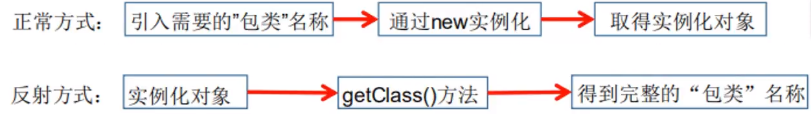
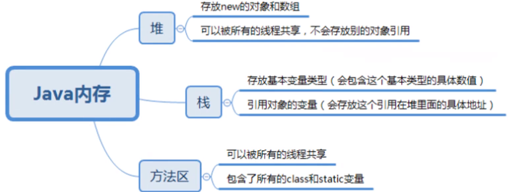
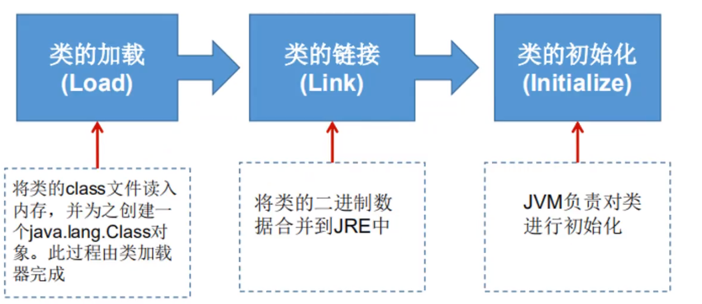
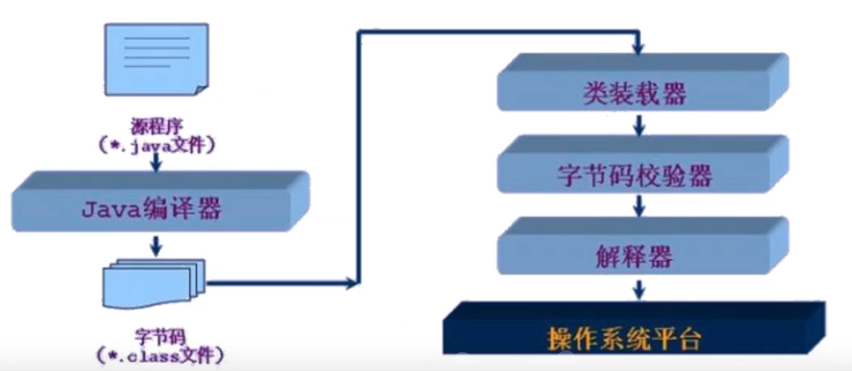
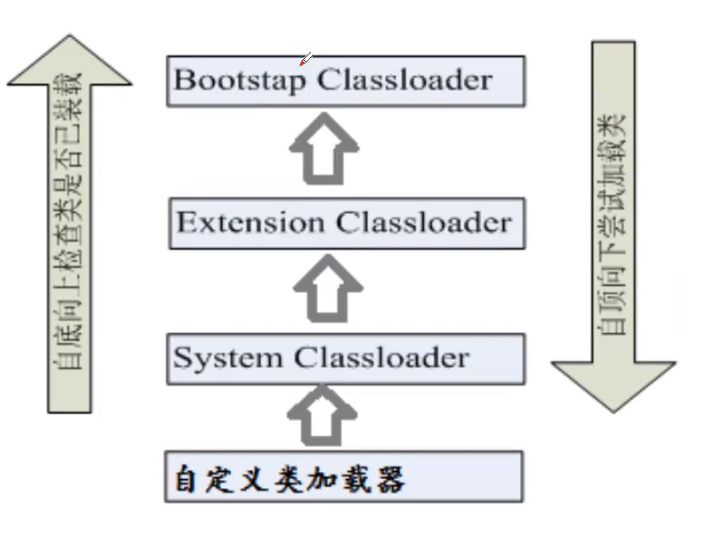
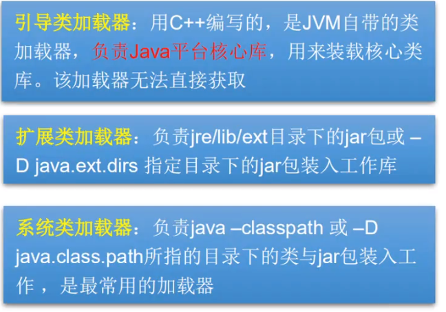

# Java复习

## 1. this

**对象创建的过程和ths的本质**

构造方法是创建Java对象的重要途径,通过new关键字调用构造器时,构造器也确实返回该类的对象,但这个对象并不是完全由构造器负责创建。创建一个对象分为如下四步

1. 分配对象空间,并将对象成员变量初始化为0或空
2. 执行属性值的显式初始化
3. 执行构造方法
4. 返回对象的地址给相关的变量

**this的本质就是“创建好的对象的地址”**!由于在构造方法调用前,对象已经创建
因此,在构造方法中也可以使用this代表“当前对象

**this最常的用法:**

* 在程序中产生二义性之处,应使用this来指明当前对象;普通方法中,this总是指
  向调用该方法的对象。构造方法中,this总是指向正要初始化的对象。
* 使用this关键字调用重载的构造方法,避免相同的初始化代码。但只能在构造方法
  中用,**并且必须位于构造方法的第一行**。

```java
class A{
    int a,b,c;
    public A(int a, int b){
        this.a = a;
        this.b = b;
    }
    public A(int a, int b, int c){
        this(a, b) // 调用重载构造方法位于第一行
        this.c = c
    }
}
```


* this不能用于 static方法中。


## 2. 注解

### 2.1 什么是注解

Annotation是从JDK5.0开始引入的新技术.

Annotation的作用：

* 不是程序本身，可以对程序作出解释.(这一点和注释（comment)没什么区别）

* **可以被其他程序（比如：编译器等）读取.**

Annotation的格式：

* 注解是以“@注释名“在代码中存在的，还可以添加一些参数值，例如：@SuppressWarnings(value="unchecked").

Annotation在哪里使用？

* 可以附加在package,class,method,field等上面，相当于给他们添加了额外的辅助信息，我们可以通过反射机制编程实现对这些元数据的访问


### 2.2 内置注解

* @Override:定义在java.lang.Override中，此注释只适用于修辞方法，表示一个方法声明打算重写超类中的另一个方法声明.
* @Deprecated:定义在java.lang.Deprecated中，此注释可以用于修辞方法，属性，类，表示不鼓励程序员使用这样的元素，通常是因为它很危险或者存在更好的选择.
* @SuppressWarnings:定义在java.lang.SuppressWarnings中，用来抑制编译时的警告信息.口与前两个注释有所不同，你需要添加一个参数才能正确使用，这些参数都是已经定义好了的，我们选择性的使用就好了.
  * @SuppressWarnings("all")
  * @SuppressWarnings("unchecked")
  * @SuppressWarnings(value={"unchecked","deprecation"})
  * 等等......


### 2.3 元注解

元注解的作用就是负责注解其他注解，Java定义了4个标准的meta-annotation类型，他们被用来提供对其他annotation类型作说明.
这些类型和它们所支持的类在java.lang.annotation包中可以找到.(@Target,@Retention,@Documented,@Inherited)

* @Target:用于描述注解的使用范围（即：被描述的注解可以用在什么地方）
  * **@Target(ElementType.TYPE)**  //接口、类、枚举、注解
  * **@Target(ElementType.FIELD)** //字段、枚举的常量
  * **@Target(ElementType.METHOD)** //方法
  * **@Target(ElementType.PARAMETER)** //方法参数
  * **@Target(ElementType.CONSTRUCTOR)** //构造函数
  * **@Target(ElementType.LOCAL_VARIABLE)**//局部变量
  * **@Target(ElementType.ANNOTATION_TYPE)**//注解
  * **@Target(ElementType.PACKAGE)** //包 
  * **@Target(ElementType.TYPE_PARAMETER)** //任何声明类型的地方
  * **@Target(ElementType.TYPE_USE)** 任意使用类型的地方
* @Retention:表示需要在什么级别保存该注释信息，用于描述注解的生命周期
  * @Retention(RetentionPolicy.SOURCE) //源码级别
  * @Retention(RetentionPolicy.CLASS) //类
  * @Retention(RetentionPolicy.RUNTIME) //运行时
* @Document:说明该注解将被包含在javadoc中
* @Inherited:说明子类可以继承父类中的该注解


### 2.4 自定义注解

```java
@Target(value = {ElementType.ANNOTATION_TYPE})
@Retention(RetentionPolicy.RUNTIME)
public @interface MyAnnotation {
    //当注解只用传一个参数的时候，使用value可以不用写value=
    //default：默认值
    String value() default "lyx";
    int[] age() default 10;
    //默认值-1表示找不到
    int[] sex() default -1;

}
```


## 3. 反射

### 3.2 静态语言和动态语言

* 动态语言
  * 是一类在运行时可以改变其结构的语言：例如新的函数、对象、甚至代码可以被引进，已有的函数可以被删除或是其他结构上的变化。通俗点说就是在运行时代码可以根据某些条件改变自身结构。
  * 主要动态语言：Object-C、C#、JavaScript、PHP、Python等。
* 静态语言
  * 与动态语言相对应的，运行时结构不可变的语言就是静态语言。如Java、C、C++。
  * Java不是动态语言，但Java可以称之为“准动态语言”。即Java有一定的动态性，我们可以利用反射机制获得类似动态语言的特性。Java的动态性让编程的时候更加灵活！


### 3.3 JAVA Reflection

* Reflection(反射）是Java被视为动态语言的关键，反射机制允许程序在执行期借助于Reflection API取得任何类的内部信息，并能直接操作任意对象的内部属性及方法。

  

  ```java
  Class c = Class.forName ( "java.lang.String " )
  ```

  

* 加载完类之后，在堆内存的方法区中就产生了一个Class类型的对象（一个类只有一个Class对象）,这个对象就包含了完整的类的结构信息。我们可以通过这个对象看到类的结构。这个对象就像一面镜子，透过这个镜子看到类的结构，所以，我们形象的称之为：反射





* 快速体验：

  ```java
  @Test
  public void testReflection() throws ClassNotFoundException {
      //通过反射回去Class对象
      Class u1 = Class.forName("com.lyx.pojo.User");
      Class u2 = Class.forName("com.lyx.pojo.User");
      //一个类在内存中只有一个Class对象
      //一个类被加载后，整个类的结构都会被封装在Class对象中
      System.out.println(u1.hashCode() == u2.hashCode());
  }
  ```


### 3.4 Class类的常用方法

| 方法名                                   | 功能说明                                                     |
| ---------------------------------------- | ------------------------------------------------------------ |
| static ClassForName(String name)         | 返回指定类名name的Class对象                                  |
| Object newInstance()                     | 调用缺省构造函数，返回一个Class对象的实例                    |
| getName()                                | 返回此Class对象所表示的实体类（类，接口，数组类或void）的名称 |
| Class getSuperClass()                    | 返回当前Class对象的父类的Class对象                           |
| Class[] getinterfaces()                  | 获取当前Class对象的接口                                      |
| ClassLoader getClassLoader()             | 返回该类的类加载器                                           |
| ClassLoader[] getConstructors()          | 返回一个包含某些Constructor对象的数组                        |
| Method getMothed(String name, Class.. T) | 返回一个Method对象，此对象的参数类型为paramType              |
| Field[] getDeclareFields()               | 返回Field对象的一个数组                                      |


### 3.5 获得Class对象的方法

1. 通过对象获得

   ```java
   Person student = new Student();
   Class c1 = student.getClass();
   ```

   

2. forname获得

   ```java
   Class c2 = Class.forName("com.lyx.Person");
   ```

   

3. 通过类名.class获得

   ```java
   Class c3 = Person.class;
   ```

   

4. 基本内置对象通过type属性获得

   ```java
   Class c4 = Integer.TYPE;
   ```

   

5. 通过子类Class对象获得

   ```java
   Class c1 = Student.class;
   Class c5 = c1.getSuperclass();
   ```

   

### 3.6 所有类型的Class对象

```java
Class c1 = Object.class; //类
Class c2 = Comparable.class; //接口
Class c3 = String[].class; //一维数组
Class c4 = int[][].class; //二维数组
Class c5 = Override.class; //注解
Class c6 = ElementType.class; //枚举
Class c7 = Integer.class; //基本数据类型
Class c8 = void.class; //void
Class c9 = Class.class; //Class

System.out.println(c1);
System.out.println(c2);
System.out.println(c3);
System.out.println(c4);
System.out.println(c5);
System.out.println(c6);
System.out.println(c7);
System.out.println(c8);
System.out.println(c9);

//只要元素的类型一样，就是同一个Class对象
int[] a = new int[10];
int[] b = new int[20];
System.out.println(a.getClass().hashCode());
System.out.println(b.getClass().hashCode());
```


### 3.7 java内存分析

 

当程序主动使用某个类时，如果该类还未被加载到内存中，则系统会通过如下三个步骤来对该类进行初始化。

 


* 加载：将class文件字节码内容加载到内存中，并将这些静态数据转换成方法区的运行时数据结构，然后生成一个代表这个类的java.lang.Class对象.
* 链接：将Java类的二进制代码合并到JVM的运行状态之中的过程。
  * 验证：确保加载的类信息符合JVM规范，没有安全方面的问题
  * 准备：正式为类变量（static)分配内存并设置类变量默认初始值的阶段，这些内存都将在方法区中进行分配。
  * 解析：虚拟机常量池内的符号引用（常量名）替换为直接引用（地址）的过程。
* 初始化：
  * 执行类构造器`<clinit>()`方法的过程。类构造器`<clinit>()`方法是由编译期自动收集类中所有类变量的赋值动作和静态代码块中的语句合并产生的。（类构造器是构造类信息的，不是构造该类对象的构造器）。
  * 当初始化一个类的时候，如果发现其父类还没有进行初始化，则需要先触发其父类的初始化。
  * 虚拟机会保证一个类的`<clinit>()`方法在多线程环境中被正确加锁和同步。

**类什么时候发送初始化？**

* 类的主动引用（一定会发生类的初始化）
  * 当虚拟机启动，先初始化main方法所在的类
  * new一个类的对象
  * 调用类的静态成员（除了final常量）和静态方法
  * 使用java.lang.reflect包的方法对类进行反射调用
  * 当初始化一个类，如果其父类没有被初始化，则先会初始化它的父类
* 类的被动引用（不会发生类的初始化）
  * 当访问一个静态域时，只有真正声明这个域的类才会被初始化。如：当**通过子类引用父类的静态变量**，不会导致子类初始化
  * **通过数组定义类**引用，不会触发此类的初始化
  * **引用常量**不会触发此类的初始化（常量在链接阶段就存入调用类的常量池中了）


### 3.8 类加载器

**类加载的作用**：将class文件字节码内容加载到内存中，并将这些静态数据转换成方法区的运行时数据结构，然后在堆中生成一个代表这个类的java.lang.Class对象，作为方法区中类数据的访问入口。

**类缓存**：标准的JavaSE类加载器可以按要求查找类，但一旦某个类被加载到类加载器中，它将维持加载（缓存）一段时间。不过JVM垃圾回收机制可以回收这些Class对象

 


类加载器作用是用来把类（class)装载进内存的。JVM规范定义了如下类型的类的加载器

 

 


```java
//获取系统的类加载器
ClassLoader systemClassLoader = ClassLoader.getSystemClassLoader();
System.out.println("系统的类加载器:"+systemClassLoader);
//获取系统类加载器的父类=>扩展类加载器
ClassLoader parent = systemClassLoader.getParent();
System.out.println("扩展类加载器:"+parent);
//获取扩展类加载器的父类=>根加载器（c/c++编写,无法读取）
ClassLoader parent1 = parent.getParent();
System.out.println("根加载器:"+parent1);
//测试当前类的加载器
ClassLoader classLoader = Class.forName("com.lyx.Test2").getClassLoader();
System.out.println("当前类的加载器:"+classLoader);
//测试jdk内置内的加载器
ClassLoader classLoader1 = Class.forName("java.lang.Object").getClassLoader();
System.out.println("jdk内置内的加载器:"+classLoader1);
//获取系统类加载器加载的位置
String property = System.getProperty("java.class.path");
String[] split = property.split(";");
for (String s : split) {
    System.out.println(s);
}
```


### 3.9 获取类运行时的结构

```java
Class user = Class.forName("com.lyx.pojo.User");

//获取类的名称
System.out.println("获取类的全类名："+user.getName());
System.out.println("获取类的名称："+user.getSimpleName());
//获取类的属性
Field[] fields = user.getFields();
System.out.println("获取类的所有公共属性(public)：");
for (Field field : fields) {
    System.out.println(field);
}
System.out.println("===================================");
Field age = user.getField("age");
System.out.println("获取公共属性（public）："+age);
Field[] declaredFields = user.getDeclaredFields();
System.out.println("获取类的所有私有属性(非public)：");
for (Field declaredField : declaredFields) {
    System.out.println(declaredField);
}
System.out.println("===================================");
System.out.println("获取私有属性（非public）："+user.getDeclaredField("name"));
Method[] methods = user.getMethods();
System.out.println("获取本类及其父类的全部public方法：");
for (Method method : methods) {
    System.out.println(method);
}
Method getName = user.getMethod("getName");
System.out.println("获取本类的public方法："+getName);
System.out.println("===================================");
Method[] declaredMethods = user.getDeclaredMethods();
System.out.println("获取本类的所有方法");
for (Method declaredMethod : declaredMethods) {
    System.out.println(declaredMethod);
}
System.out.println("===================================");
Method setAge = user.getDeclaredMethod("setAge", String.class);
System.out.println("获取本类的方法："+setAge);
System.out.println("获得public构造方法：");
Constructor[] constructors = user.getConstructors();
for (Constructor constructor : constructors) {
    System.out.println(constructor);
}
System.out.println("获得全部构造方法：");
Constructor[] declaredConstructors = user.getDeclaredConstructors();
for (Constructor declaredConstructor : declaredConstructors) {
    System.out.println(declaredConstructor);
}
System.out.println("获得指定public构造器："+user.getDeclaredConstructor(null));
System.out.println("获得指定所有构造器："+user.getConstructor(null));
```


### 3.10 通过反射动态操作类

```java
Class userClass = Class.forName("com.lyx.pojo.User");
//创建user的实例化对象
//通过空构造器获得user实例化对象
User user1 = (User) userClass.newInstance();
System.out.println("user1 :"+user1);
//通过有参构造器获得user实例化对象
Constructor constructor =
    userClass.getConstructor(String.class, String.class, String.class, String.class, String.class);
User user2 = (User) constructor.newInstance("zs", "123", "age", "1", "123@qq.com");
System.out.println(user2);

//通过反射获得user对象的方法
Method getName = userClass.getDeclaredMethod("getName", null);
Method setName = userClass.getDeclaredMethod("setName", String.class);
//激活方法
setName.invoke(user2, "ls");
String name1 = (String) getName.invoke(user2, null);
System.out.println("getName:"+ name1);

//通过反射获得类的属性
Field name = userClass.getDeclaredField("name");
//不能直接操作私有属性，需要关闭程序的安全检测
//私有属性或者方法可以使用setAccessible(true)关闭程序的安全检测
name.setAccessible(true);
name.set(user2, "Tony");
System.out.println("getField: "+ user2.getName());
```


### 3.11 性能分析

> 通过new的方法创建对象的速度最快，使用反射关闭检查次之，使用反射不关闭检查速度最慢！

```java
public static void test1(){
    User user = new User();
    long startTime = System.currentTimeMillis();
    for (int i = 0; i < 100000000; i++) {
        user.getName();
    }
    long endTime = System.currentTimeMillis();
    System.out.println("普通方法耗时："+(endTime - startTime)+"ms"); //out: 普通方法耗时：2ms
}

public static void test2() throws NoSuchMethodException, InvocationTargetException, IllegalAccessException {
    User user = new User();
    Class userClass = user.getClass();
    Method getName = userClass.getDeclaredMethod("getName");
    long startTime = System.currentTimeMillis();
    for (int i = 0; i < 100000000; i++) {
        getName.invoke(user, null);
    }
    long endTime = System.currentTimeMillis();
    System.out.println("反射（不关闭安全检查）耗时："+(endTime - startTime)+"ms"); //out: 反射（不关闭安全检查）耗时：130ms
}

public static void test3() throws NoSuchMethodException, InvocationTargetException, IllegalAccessException {
    User user = new User();
    Class userClass = user.getClass();
    Method getName = userClass.getDeclaredMethod("getName");
    getName.setAccessible(true);
    long startTime = System.currentTimeMillis();
    for (int i = 0; i < 100000000; i++) {
        getName.invoke(user, null);
    }
    long endTime = System.currentTimeMillis();
    System.out.println("反射（闭安全检查）耗时："+(endTime - startTime)+"ms"); //反射（闭安全检查）耗时：96ms
}
```


### 3.12 反射操作泛型

* Java采用泛型擦除的机制来引入泛型，Java中的泛型仅仅是给编译器javac使用的，确保数据的安全性和免去强制类型转换问题，但是，一旦编译完成，所有和泛型有关的类型全部擦除为了通过反射操作这些类型，Java新增了ParameterizedType,GenericArrayType,
* TypeVariable 和 WildcardType 几种类型来代表不能被归一到Class类中的类型但是又和原始类型齐名的类型.
* ParameterizedType:表示一种参数化类型，比如Collection<String>
* GenericArrayType:表示一种元素类型是参数化类型或者类型变量的数组类型
* TypeVariable:是各种类型变量的公共父接口
* WildcardType:代表一种通配符类型表达式

```java
public class Test6 {

    public Map<String, Object> method(List<String> name, String pwd){
        return null;
    }

    public static void main(String[] args) throws NoSuchMethodException {
        Class<Test6> test6Class = Test6.class;
        Method method = test6Class.getDeclaredMethod("method", List.class, String.class);
        Type[] genericParameterTypes = method.getGenericParameterTypes(); //获得参数类型列表
        for (Type genericParameterType : genericParameterTypes) {
            System.out.println("#"+genericParameterType);
            if (genericParameterType instanceof ParameterizedType){ //如果是参数化类型（泛型）
                //返回参数化类型的泛型类型
                Type[] actualTypeArguments = ((ParameterizedType) genericParameterType).getActualTypeArguments();
                for (Type actualTypeArgument : actualTypeArguments) {
                    System.out.println("##"+actualTypeArgument);
                }
            }
        }
        Type genericReturnType = method.getGenericReturnType(); //获得返回值类型
        System.out.println("#"+genericReturnType);
        if (genericReturnType instanceof ParameterizedType){
            Type[] actualTypeArguments = ((ParameterizedType) genericReturnType).getActualTypeArguments();
            for (Type actualTypeArgument : actualTypeArguments) {
                System.out.println("##"+actualTypeArgument);
            }
        }
    }
}
```


### 3.13 反射操作注解

```java
Class c1 = Class.forName("com.lyx.student2");

//通过反射获取类的注解信息
Annotation[] annotations = c1.getAnnotations();
for (Annotation annotation : annotations) {
    System.out.println(annotation);
}
//获得注解的值
TableMapper annotation_TableMapper = (TableMapper)c1.getAnnotation(TableMapper.class);
System.out.println(annotation_TableMapper.value());
//通过反射获取属性的注解信息
Field id = c1.getDeclaredField("id");
FieldMapper annotation = id.getAnnotation(FieldMapper.class);
System.out.println(annotation.value()); //获得注解的值
System.out.println(annotation.type());
System.out.println(annotation.length());
```

