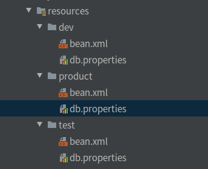

# Maven常用命令

## 执行maven命令

> ==必须在pom.xml所在目录执行==

### 编译命令

* mvn compile
  * 只编译main目录的文件，不会编译test目录中的测试文件

* maven test
  * 编译test目录中的测试文件

* maven package
  * 将项目打成jar或war包

* maven install
  * 将完成的模块添加到本地仓库中供其他项目使用
* mavne clean
  * 删除target目录（删除编译文件的目录）

### 依赖

```xml
<dependencies>
    <dependency>
        <groupId>junit</groupId>
        <artifactId>junit</artifactId>
        <version>3.8.2</version>
        <scope>test</scope>  <!-- 依赖测试时有效 -->
    </dependency>
</dependencies>
```

#### 依赖的有效性

> compile(默认) > test > provided

* compile
  * 编译
  * 测试
  * 运行
* test
  * 测试
* provided
  * 编译
  * 测试

#### 排除依赖

```xml
<dependency>
    <groupId>xxx</groupId>
    <artifactId>xxx</artifactId>
    <version>xxx</version>
    <exclusions> <!-- 排除依赖 -->
        <exclusion> <!-- 排除jar包掉依赖的其它jar包 -->
            <groupId>xxx</groupId>
            <artifactId>xxxx</artifactId>
        </exclusion>
    </exclusions>
</dependency>
```

#### 依赖的传递性

> A.jar -> B. jar -> C. jar
>
> ==要使A.jar -> C.jar: 当且仅当B.jar依赖于C.jar的范围是 **compile**==


#### 依赖优先原则

1. 路径长度不同：最短优先原则
2. 路径长度相同：
   1. 同一个pom.xml文件中，写在下面的会覆盖掉上面的。（**先写的被覆盖**）
   2. 依赖的不同模块的pom.xml文件中，有相同的依赖，写在前面的会覆盖掉后面的。（**先写的优先**）


#### 多个模块之间依赖

A module -> B module

1. 先将A module install
2. 在B module中添加A module的依赖


### 全局变量

> 在 properties定义标签,这个标签就是一个变量,标签的文本就是变量的值。使用全局变量表示多个依赖使用的版本号。

使用步骤:

1. 在 properties标签中,定义一个标签,指定版本的值

   ```xml
   <!-- 自定义全局变量 -->
       <junit.version>4.12</junit.version>
   ```

   

2. 修改依赖的版本为全局变量中定义的值

   ```xml
   <dependency>
       <groupId>junit</groupId>
       <artifactId>junit</artifactId>
       <version>${junit.version}</version>
       <scope>test</scope>
   </dependency>
   ```

   

## maven 创建web项目

* 修改jdk版本

  ```xml
  <!-- 修改jdk版本为1.8 -->
    <properties>
      <project.build.sourceEncoding>UTF-8</project.build.sourceEncoding>
      <maven.compiler.source>1.8</maven.compiler.source>
      <maven.compiler.target>1.8</maven.compiler.target>
    </properties>
  ```

  

* 修改单元测试版本

  ```xml
  <!-- 设置单元测试版本为4.12 -->
      <dependency>
        <groupId>junit</groupId>
        <artifactId>junit</artifactId>
        <version>4.12</version>
        <scope>test</scope>
      </dependency>
  ```


* 删除pluginManagement标签

  ```xml
  <pluginManagement><!-- lock down plugins versions to avoid using Maven defaults (may be moved to parent pom) -->
      <plugins>
          <plugin>
              <artifactId>maven-clean-plugin</artifactId>
              <version>3.1.0</version>
          </plugin>
          <!-- see http://maven.apache.org/ref/current/maven-core/default-bindings.html#Plugin_bindings_for_war_packaging -->
          <plugin>
              <artifactId>maven-resources-plugin</artifactId>
              <version>3.0.2</version>
          </plugin>
          <plugin>
              <artifactId>maven-compiler-plugin</artifactId>
              <version>3.8.0</version>
          </plugin>
          <plugin>
              <artifactId>maven-surefire-plugin</artifactId>
              <version>2.22.1</version>
          </plugin>
          <plugin>
              <artifactId>maven-war-plugin</artifactId>
              <version>3.2.2</version>
          </plugin>
          <plugin>
              <artifactId>maven-install-plugin</artifactId>
              <version>2.5.2</version>
          </plugin>
          <plugin>
              <artifactId>maven-deploy-plugin</artifactId>
              <version>2.8.2</version>
          </plugin>
      </plugins>
  </pluginManagement>
  ```


* 添加jetty插件

  ```xml
   <!-- 添加jetty插件 -->
  <plugin>
      <groupId>org.mortbay.jetty</groupId>
      <artifactId>maven-jetty-jspc-plugin</artifactId>
      <version>6.1.25</version>
      <configuration>
          <!-- 热部署，每10秒扫描一次 -->
          <scanIntervalSeconds>10</scanIntervalSeconds>
          <!-- 指定当前项目站点名，即浏览器访问项目的名称 -->
          <contextPath>/maven01</contextPath>
          <connectors>
              <connector implementation="org.mortbay.jetty.nio.SelectChannelConnector">
                  <port>9090</port> <!-- 设置启动端口号 -->
              </connector>
          </connectors>
      </configuration>
  </plugin>
  ```


* 添加tomcat插件

  ```xml
  <!-- 添加Tomcat插件 -->
  <plugin>
      <groupId>org.apache.tomcat.maven</groupId>
      <artifactId>tomcat7-maven-plugin</artifactId>
      <version>2.1</version>
      <configuration>
          <port>8080</port>
          <path>/test</path> <!-- 项目的站点名 -->
          <uriEncoding>UTF-8</uriEncoding>
          <server>tomcat7</server>
      </configuration>
  </plugin>
  ```

  

## 打包项目

1. 在resources文件中创建不同环境下的配置文件

   

2. 使用控制不同环境下的配置文件的选择

   ```xml
   <profiles>
       <!-- 配置配置不同环境下的配置文件 -->
       <!-- 本地环境 -->
       <profile>
           <id>dev</id>
           <properties>
               <env>dev</env>
           </properties>
           <!-- 未指定环境时默认使用本地环境 -->
           <activation>
               <activeByDefault>true</activeByDefault>
           </activation>
       </profile>
       <!-- 测试环境 -->
       <profile>
           <id>test</id>
           <properties>
               <env>test</env>
           </properties>
       </profile>
       <!-- 服务器环境 -->
       <profile>
           <id>product</id>
           <properties>
               <env>product</env>
           </properties>
       </profile>
   </profiles>
   ```

   

3. 在build中配置不同环境下配置文件的位置

   ```xml
   <!-- 对于项目资源文件的配置放在build中 -->
   <resources>
       <resource>
           <directory>src/main/resources/${env}</directory>
       </resource>
       <resource>
           <directory>src/main/java</directory>
           <includes>
               <include>**/*.xml</include>
               <include>**/*.properties</include>
               <include>**/*.tld</include>
           </includes>
           <filtering>false</filtering>
       </resource>
   </resources>
   ```

   

4. 选择不同环境时的命令

   * 本地环境
     * clean compile package -Pdev -Dmaven.test.skip=true
       * -Pdev ：表示要选择的环境为本地环境
       * -Dmaven.test.skip=true ：表示要去除测试代码
   * 测试环境
     * clean compile package -Ptest -Dmaven.test.skip=true
   * 正式环境
     * clean compile package -Pproduct -Dmaven.test.skip=true