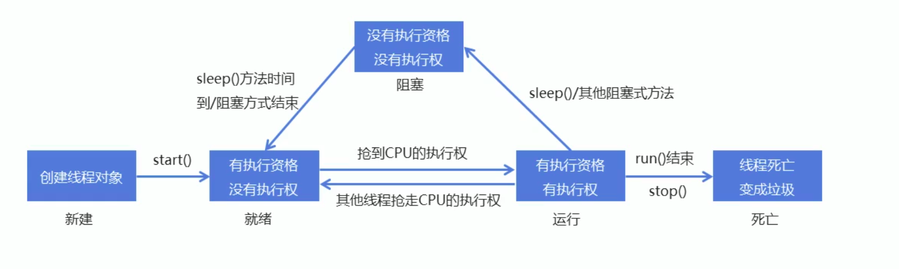

# 多任务

## 1. 实现多线程

### 1.1 进程

> ==进程:是正在运行的程序==
>
> * 是系统进行资源分配和调用的独立单位
> * 每一个进程都有它自己的内存空间和系统资源

### 1.2 线程
> ==线程:是进程中的单个顺序控制流,是一条执行路径==
>
> * 单线程:一个进程如果只有一条执行路径,则称为单线程程序
> * 多线程:一个进程如果有多条执行路径,则称为多线程程序

### 1.3 多线程的实现方式一：继承 Thread类

1. 定义一个类 MyThread继承 Thread类
2. 在 MyThread类中重写run()方法
3. 创建 MyThread类的对象
4. 调用start()方法启动线程

```java
public class MyThread  extends Thread{
    /**
     * @Description: 重写run()方法，将需要启动多线程的代码写到其中
     * @Param: []
     * @return: void
     * @Author: lyx
     * @Date: 2021/6/9 下午6:08
     */
    @Override
    public void run() {
        super.run();
        for(int i = 0; i < 100; i ++){
            System.out.println(i);
        }
    }

    public static void main(String[] args) {
        MyThread t1 = new MyThread();
        MyThread t2 = new MyThread();
        //启动多线程
        t1.start();
        t2.start();
    }
}
```


>**两个小问题:**
>
>1. 为什么要重写run()方法?
>   * 因为run()是用来封装被线程执行的代码
>2. run()方法和 start()方法的区别?
>   * run():封装线程执行的代码,直接调用,相当于普通方法的调用
>   * start():启动线程;然后由JVM调用此线程的run()方法


### 1.4 设置和获取线程名称

Thread类中设置和获取线程名称的方法

* void setName( String name): 将此线程的名称更改为等于参数name
* String getName(): 返回此线程的名称

```java
public class MyThread  extends Thread{
    /**
     * @Description: 重写run()方法，将需要启动多线程的代码写到其中
     * @Param: []
     * @return: void
     * @Author: lyx
     * @Date: 2021/6/9 下午6:08
     */
    @Override
    public void run() {
        super.run();
        for(int i = 0; i < 100; i ++){
            System.out.println(getName()+" : "+i);  //获取当前线程的名字
        }
    }

    public static void main(String[] args) {
        MyThread t1 = new MyThread();
        MyThread t2 = new MyThread();
        //设置线程名称
        //默认Thread-0，Thread-1, Thread-2 ....
        t1.setName("张三");
        t2.setName("李四");
        //启动多线程
        t1.start();
        t2.start();
    }
}
```


### 1.5 线程调度

线程有两种调度模型:

1. 分时调度模型:所有线程轮流使用CPU的使用权,平均分配每个线程占用CPU的时间片。

2. 抢占式调度模型:优先沚优先级高的线程使用CPU,如果线程的优先级相同,那么会随机选择个,优先級高的线程获取的CPU时间片相对多一些。

==Java使用的是抢占式调度模型==

假如计算机只有一个CPU,那么CPU在某一个时刻只能执一行条指令,线程只有得到CPU时间片,也就是使用权才可以执行指令。所以说多线程程序的执行是有**随机性**,因为谁抢到CPU的使用权是不一定的。

> Thread类中设置和获取线程优先级的方法:  
>
> * public final int getPriority(): 返回此线程的优先级
> * public final void setPriority(int newPriority): 更改此线程的优先级

```java
public class ThreadPriority extends Thread {
    @Override
    public void run() {
        super.run();
        for(int i = 0; i < 100; i ++){
            System.out.println(getName()+" : "+i);  //获取当前线程的名字
        }
    }

    public static void main(String[] args) {
        Thread t1 = new ThreadPriority();
        Thread t2 = new ThreadPriority();
        Thread t3 = new ThreadPriority();

        //设置线程名称
        t1.setName("飞机");
        t2.setName("高铁");
        t3.setName("汽车");

        //设置线程优先级
        //默认优先级为5
        System.out.println("Thread-"+t1.getName()+" priority : "+t1.getPriority());
        System.out.println("Thread-"+t2.getName()+" priority : "+t2.getPriority());
        System.out.println("Thread-"+t3.getName()+" priority : "+t3.getPriority());
        //优先级范围：1-10
        t1.setPriority(10);
        t2.setPriority(5);
        t3.setPriority(1);
        System.out.println("-----------修改优先级后------------");
        System.out.println("Thread-"+t1.getName()+" priority : "+t1.getPriority());
        System.out.println("Thread-"+t2.getName()+" priority : "+t2.getPriority());
        System.out.println("Thread-"+t3.getName()+" priority : "+t3.getPriority());

        //启动多线程
        //线程优先级高只是线程优先执行的概率高，并不一定先执行
        t1.start();
        t2.start();
        t3.start();
    }
}
```

### 1.6 线程控制

| 方法                           | 说明                                                         |
| ------------------------------ | ------------------------------------------------------------ |
| static void sleep(long millis) | 使当前正在执行的线程停留（暂停执行）指定的毫秒数             |
| void join()                    | 等待这个线程死亡                                             |
| void setDaemon(boolean on)     | 将此线程标记为守护线程，当运行的线程都是守护线程是，java虚拟机将退出 |

* 测试sleep

  ```java
  public class ThreadSleep extends Thread {
      @Override
      public void run() {
          super.run();
          for (int i = 0; i < 100; i++) {
              System.out.println(getName() + " : " + i);
              //设置线程等待
              try {
                  Thread.sleep(100);
              } catch (InterruptedException e) {
                  e.printStackTrace();
              }
          }
      }
  
      public static void main(String[] args) {
          Thread t1 = new ThreadSleep();
          Thread t2 = new ThreadSleep();
          Thread t3 = new ThreadSleep();
  
          //设置线程名
          t1.setName("刘备");
          t2.setName("关羽");
          t3.setName("张飞");
  
          //启动线程
          t1.run();
          t2.run();
          t3.run();
      }
  }
  ```

  

* 测试join

  ```java
  public class ThreadJoin extends Thread{
      @Override
      public void run() {
          super.run();
          for (int i = 0; i < 100; i++) {
              System.out.println(getName() + " : " + i);
          }
      }
  
      public static void main(String[] args) {
          ThreadJoin t1 = new ThreadJoin();
          ThreadJoin t2 = new ThreadJoin();
          ThreadJoin t3 = new ThreadJoin();
  
          //设置线程名称
          t1.setName("康熙");
          t2.setName("四阿哥");
          t3.setName("八阿哥");
  
          //启动多线程
          t1.start();
          try {
              t1.join();  //只有当t1执行完毕后其他线程才能执行
          } catch (InterruptedException e) {
              e.printStackTrace();
          }
          t2.start();
          t3.start();
      }
  }
  
  ```

  

* 测试setDaemon

  ```java
  public class ThreadDaemon extends Thread {
      @Override
      public void run() {
          super.run();
          for (int i = 0; i < 100; i++) {
              System.out.println(getName() + " : " + i);
          }
      }
  
      public static void main(String[] args) {
          Thread t1 = new ThreadDaemon();
          Thread t2 = new ThreadDaemon();
  
          //设置线程名
          t1.setName("关羽");
          t2.setName("张飞");
  
          //设置主线程名
          Thread.currentThread().setName("刘备");
  
          //设置守护线程
          t1.setDaemon(true);
          t2.setDaemon(true);
  
          //启动线程
          t1.start();
          t2.start();
          for (int i = 0; i < 10; i++) {
              System.out.println(Thread.currentThread().getName() + " : " + i);
          }
      }
  }
  ```

  

### 1.7 线程生命周期



### 1.8 多线程的实现方式二：实现Runnable接口

1. 定义一个类 MyRunnable实现 Runnable接囗
2. 在 MyRunnable类中重写run()方法
3. 创建 MyRunnable类的对象
4. 创建 Thread类的对象,把 MyRunnable对象作为构造方法的参数
5. 调用Thread类的start()方法启动线程

```java
public class MyRunnable implements Runnable{
    @Override
    public void run() {
        for (int i = 0; i < 100; i++) {
            System.out.println(Thread.currentThread().getName() + " : " + i);
        }
    }

    public static void main(String[] args) {
        MyRunnable my1 = new MyRunnable();
        MyRunnable my2 = new MyRunnable();

        //创建Thread类对象，传入Runnable对象
        Thread t1 = new Thread(my1, "飞机");  // 第一个参数：要实现多线程的Runnable对象，第二个参数：线程名
        Thread t2 = new Thread(my2, "高铁");

        //启动线程
        t1.start();
        t2.start();
    }
}
```

## 2. 线程同步

### 2.1 模拟案例：买票

> 需求:某电影院目前正在上映国产大片,共有100张票,而它有3个窗口卖票,请设计一个程序模拟该电影院卖票。

**思路：**

1. 定义—个类 SellTicket实现 Runnable接口,里面定义一个成员变量: private int tickets=100

2. 在 SellTicket类中重写run()方法实现卖票,代码步骤如下

   * 判断票数大于0,就卖票,并告知是哪个窗口卖的
   * 卖了票之后,总票数要减1
   * 票没有了,也可能有人来问,所以这里用死循环让卖票的动作一直执行

3. 定义一个测试类,里面有main方法,代码步骤如下

   * 创建 SellTicket类的对象
   * 创建三个 Thread类的对象,把 SellIck对象作为构造方法的参数,并给出对应的窗口名称
   * 启动线程

   ```java
   public class SellTicket implements Runnable {
       private int tickets = 100;
   
       @Override
       public void run() {
           while (tickets > 0) {
               //模拟网络延迟
               try {
                   Thread.sleep(100);
               } catch (InterruptedException e) {
                   e.printStackTrace();
               }
               System.out.println(Thread.currentThread().getName() + "窗口正在出第" + tickets + "张票");
               tickets --;
           }
       }
   
       public static void main(String[] args) {
           SellTicket s1 = new SellTicket();
   
           Thread t1 = new Thread(s1, "窗口1");
           Thread t2 = new Thread(s1, "窗口2");
           Thread t3 = new Thread(s1, "窗口3");
   
   
           t1.start();
           t2.start();
           t3.start();
       }
   }
   
   ```

   > ​	线程不安全，容易出现同一张票多次出售，以及出现负数票的情况。


### 2.2 卖票案例数据安全问题的解决

为什么出现问题?(这也是我们判断多线程程序是否会有数据安全问题的标准）

1. 是否是多线程环境
2. 是否有共享数据
3. 是否有多条语句操作共享数据

如何解决多线程安全问题呢?

> 基本思想:让程序没有安全问题的环境。

怎么实现呢?

> * 把多条语句操作共享数据的代码给锁起来,让任意时刻只能有一个线程执行即可。
> * **Java提供了同步代码块的方式来解决**。

### 2.3 同步代码快

锁多条语句操作共享数据,可以使用同步代码块实现

格式：

```java
synchronized(任意对象){
    多条语句操作共享数据的代码
}
```

> synchronized(任意对象):就相当于给代码加锁了,任意对象就可以看成是一把锁。

买票程序改进代码：

```java
public class SellTicket2 implements Runnable {
    private int tickets = 100;
    private Object obj = new Object();

    @Override
    public void run() {
        synchronized (obj){
            while (tickets > 0) {
                //模拟网络延迟
                try {
                    Thread.sleep(100);
                } catch (InterruptedException e) {
                    e.printStackTrace();
                }
                System.out.println(Thread.currentThread().getName() + "窗口正在出第" + tickets + "张票");
                tickets --;
            }
        }
    }

    public static void main(String[] args) {
        SellTicket2 s1 = new SellTicket2();

        Thread t1 = new Thread(s1, "窗口1");
        Thread t2 = new Thread(s1, "窗口2");
        Thread t3 = new Thread(s1, "窗口3");


        t1.start();
        t2.start();
        t3.start();
    }
}
```


### 2.4 同步方法

1. 同步方法:就是把 synchronized关键字加到方法上

   格式：

   ```java
   修饰符 synchronized 反回值类型 方法名法(参数列表){}
   ```

   同步方法的锁对象是什么呢？

   > this

   ```java
   public class SellTicket3 implements Runnable {
       private int tickets = 100;
       private int i;
   
       @Override
       public void run() {
           if(i % 2 == 0){
               synchronized (this){  //同步方法的锁是this，由于同步代码块和同步方法用的是同一把锁，线程安全
                   while (tickets > 0) {
                       //模拟网络延迟
                       try {
                           Thread.sleep(100);
                       } catch (InterruptedException e) {
                           e.printStackTrace();
                       }
                       System.out.println(Thread.currentThread().getName() + "窗口正在出第" + tickets + "张票");
                       tickets --;
                   }
               }
           }else {
               sell();
           }
           i ++;
       }
   
       private synchronized void sell() {
           while (tickets > 0) {
               //模拟网络延迟
               try {
                   Thread.sleep(100);
               } catch (InterruptedException e) {
                   e.printStackTrace();
               }
               System.out.println(Thread.currentThread().getName() + "窗口正在出第" + tickets + "张票");
               tickets --;
           }
       }
   
       public static void main(String[] args) {
           SellTicket3 s1 = new SellTicket3();
   
           Thread t1 = new Thread(s1, "窗口1");
           Thread t2 = new Thread(s1, "窗口2");
           Thread t3 = new Thread(s1, "窗口3");
   
   
           t1.start();
           t2.start();
           t3.start();
       }
   }
   ```

   

2. 同步静态方法:就是把 synchronized关键字加到静态方法上

   ​	格式:

   ```java
   修饰符 static synchronized 返回值类型 方法名(参数列表){}
   ```

   同步静态方法的锁对象是什么呢?

   > 类名.cass

   ```java
   public class SellTicket4 implements Runnable {
       private static int tickets = 100;
       private int i;
   
       @Override
       public void run() {
           if(i % 2 == 0){
               synchronized (SellTicket4.class){  //静态同步方法的锁是类名.class，由于同步代码块和同步方法用的是同一把锁，线程安全
                   while (tickets > 0) {
                       //模拟网络延迟
                       try {
                           Thread.sleep(100);
                       } catch (InterruptedException e) {
                           e.printStackTrace();
                       }
                       System.out.println(Thread.currentThread().getName() + "窗口正在出第" + tickets + "张票");
                       tickets --;
                   }
               }
           }else {
               sell();
           }
           i ++;
       }
   
       private synchronized void sell() {
           while (tickets > 0) {
               //模拟网络延迟
               try {
                   Thread.sleep(100);
               } catch (InterruptedException e) {
                   e.printStackTrace();
               }
               System.out.println(Thread.currentThread().getName() + "窗口正在出第" + tickets + "张票");
               tickets --;
           }
       }
   
       public static void main(String[] args) {
           SellTicket4 s1 = new SellTicket4();
   
           Thread t1 = new Thread(s1, "窗口1");
           Thread t2 = new Thread(s1, "窗口2");
           Thread t3 = new Thread(s1, "窗口3");
   
   
           t1.start();
           t2.start();
           t3.start();
       }
   }
   ```


### 2.5 线程安全类

* StringBuffer

  * 线程安全,可变的字符序列
  * 从版本JDK5开始,被 StringBuilder替代。通常应该使用 String builders类,因为它支持所有相同的操作,但它更快,因为它不执行同步

* Vector

  * 从Java2平台v1.2开始,该类改进了Lis接口,使其成为 Java Collections framework的成员。与新的集合实现不同, Vector被同步。如果不需要线程安全的实现,建议使用 ArrayList代替 Vector

* Hashtable

  * 该类实现了一个哈希表,它将键映射到值。任何非ηu对象都可以用作键或者值
  * 从Java2平台v1.2开始,该类进行了改进,实现了Map接口,使其成为 Java Collections framework的成员与新的集合实现不同, Hashtable被同步。如果不需要线程安全的实现,建议使用 HashMap代替Hashtable

* Collections的synchronized***()方法

  ```java
  List<String> arr = Collections.synchronizedList(new ArrayList<String>());  //返回一个线程安全的List
  Map<String, String> map = Collections.synchronizedMap(new HashMap<String, String>());  //返回一个线程安全的Map 
  // 还有很多容器都可以使用该方式变为线程安全
  ```


### 2.6 Lock锁

虽然我们可以理解同步代码块和同步方法的锁对象问题,但是我们并没有直接看到在哪里加上了锁,在哪里释放了锁,为了更清晰的表达如何加锁和释放锁,JDK5以后提供了一个新的锁对象Lock。

Lock实现提供比使用 synchronized方法和语句可以获得更广泛的锁定操作

Lock中提供了获得锁和释放锁的方法

* void lock0:获得锁
* void unlock0:释放锁

Lock是接口不能直接实例化,这里采用它的实现类 Reentrantlock来实例化Reentrantlock的构造方法

* Reentrantlock():创建一个 Reentrantlock的实例

```java
public class SellTicket5 implements Runnable {
    private int tickets = 100;
    private Lock lock = new ReentrantLock();

    @Override
    public void run() {
        try{
            lock.lock(); //创建锁
            while (tickets > 0) {
                //模拟网络延迟
                try {
                    Thread.sleep(100);
                } catch (InterruptedException e) {
                    e.printStackTrace();
                }
                System.out.println(Thread.currentThread().getName() + "窗口正在出第" + tickets + "张票");
                tickets --;
            }
        }finally {
            lock.unlock(); //释放锁
        }
    }

    public static void main(String[] args) {
        SellTicket5 s1 = new SellTicket5();

        Thread t1 = new Thread(s1, "窗口1");
        Thread t2 = new Thread(s1, "窗口2");
        Thread t3 = new Thread(s1, "窗口3");


        t1.start();
        t2.start();
        t3.start();
    }
}
```


## 3. 生产者消费者模式

### 3.1 生产者消费者模式概述

生产者消费者模式是—个十分经典的多线程协作的模式,弄懂生产者消费者问题能够让我们对多线程编的理解更加深刻

所谓生产者消费者问题,实际上主要是包含了两类线程

* 一类是生产者线程用于生产数据
* 一类是消费者线程用于消费数据

为了解耦生产者和消费者的关系,通常会采用共亨的数据区域,就像是一个仓库

* 生产者生产数据之后直接放置在共亨数据区中,并不需要关心消费者的行为

* 消费者只需要从共享数据区中去获取数据,并不需要关心生产者的行为


为了体现生产和消费过程中的等待和唤醒,Java就提供了几个方法供我们使用,这几个方法在Object类中
Object类的等待和唤醒方法：

| 方法名           | 说明                                                         |
| ---------------- | ------------------------------------------------------------ |
| void wait()      | 导致当前线程等待，直到另一个线程调用该对象的notify()方法或notifyAll()方法 |
| void notify()    | 唤醒正在等待对象监视器的单个线程                             |
| void notifyAll() | 唤醒正在等待对象监视器的所有线程                             |


### 3.2 生产者消费者案例
生产者消费者案例中包含的类：

1. 奶箱类(Box):定义一个成员变量,表示第x瓶奶,提供存储牛奶和获取牛奶的操作

   ```java
   public class Box {
       //表示第x瓶奶
       private int milk;
       //用了判断奶箱中是否还有牛奶
       private Boolean state = false;
   
   
       /**
        * @Description: 忘奶箱中添牛奶的数量
        * @Param: []
        * @return: void
        * @Author: lyx
        * @Date: 2021/6/10 下午5:25
        */
       public synchronized void putMilk(int milk) {
           if(state){ //如果牛奶有剩余，等待消费者拿完再送奶
               try {
                   wait();
               } catch (InterruptedException e) {
                   e.printStackTrace();
               }
           }
           this.milk = milk;
           System.out.println("送奶工将第" + milk + "瓶奶放入奶箱中！");
           //修改牛奶状态
           this.state = true;
           //唤醒其他被等待的线程
           notifyAll();
   
       }
   
       /**
        * @Description: 得到奶箱中的牛奶
        * @Param: []
        * @return: void
        * @Author: lyx
        * @Date: 2021/6/10 下午5:26
        */
       public synchronized void getMilk() {
           if(!state){  //如果牛奶没有剩余，等待送奶工送奶
               try {
                   wait();
               } catch (InterruptedException e) {
                   e.printStackTrace();
               }
           }
           System.out.println("消费者将第" + milk + "瓶奶拿走了！");
           //修改牛奶状态
           this.state = false;
           //唤醒其他等待的线程
           notifyAll();
       }
   
   }
   ```

   

2. 生产者类( Producer):实现 Runnable接口,重写run()方法,调用存储牛奶的操作

   ```java
   public class Producer implements Runnable{
       private Box b;
       public Producer(Box b) {
           this.b = b;
       }
   
       @Override
       public void run() {
           for (int i = 1; i <= 10; i++) {
               b.putMilk(i);
           }
       }
   }
   ```

   

3. 消费者类(Customer):实现 Runnable接口,重写run()方法,调用获取牛奶的操作

   ```java
   public class Customer implements Runnable{
       private Box b;
       public Customer(Box b) {
           this.b = b;
       }
   
       @Override
       public void run() {
           while(true){
               b.getMilk();
           }
       }
   }
   ```

   

4. 测试类(Test):里面有main方法,main方法中的代码步骤如下

   1. 创建奶箱对象,这是共亨数据区域
   2. 创建生产者对象,把奶箱对象作为构造方法参数传递,因为在这个类中要调用存储牛奶的操作
   3. 创建消费者对象,把奶箱对象作为构造方法参数传递,因为在这个类中要调用获取牛奶的操作
   4. 创建两个线程对象,分别把生产者对象和消费者对象作为构造方法参数传递
   5. 启动线程

   ```java
   public class Test {
       public static void main(String[] args) {
           //奶箱对象，共享数据区域
           Box b = new Box();
           //创建生产者对象
           Producer p = new Producer(b);
           //创建消费者对象
           Customer c = new Customer(b);
   
           //创建多线程
           Thread t1 = new Thread(p);
           Thread t2 = new Thread(c);
   
           //启动多线程
           t1.start();
           t2.start();
   
       }
   }
   ```

   


