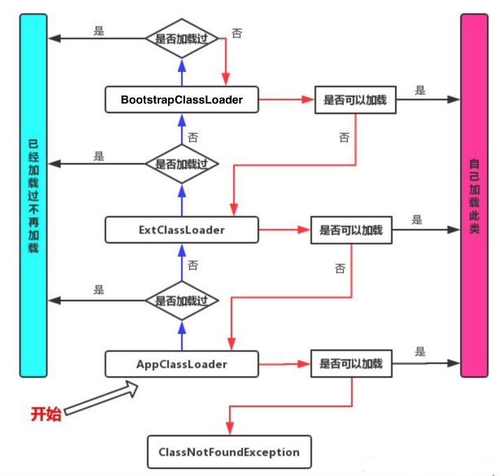

# JVM快速入门笔记

## 1、JVM系统图

### 1.1 JVM位置

> JVM是运行在操作系统之上的，它与硬件没有直接交互。


### 1.2 JVM体系结构


#### a 类装载器ClassLoader

>负责加载class文件，class文件在**文件开头有特定的文件标示**，将class文件字节码内容加载到内存中，并将这些内容转换成方法区中的运行时数据结构并且ClassLoader.只负责class文件的加载，至于它是否可以运行，则由Execution Engine决定


#### b 类装载器种类


* **虚拟机自带的加载器**
  * 启动类加载器(Bootstrap)C+
    * $JAVA_HOME$/jre/lib/rt.jar
  * 扩展类加载器(Extension)Java
    * $JAVA_HOME$/jre/lib/ext/*.jar 
  * 应用程序类加载器(AppClassLoader) Java也叫系统类加载器，加载当前应用的classpath的所有类
    * CLASSPATH 
* 用**户自定义加载器Java.lang.ClassLoader的子类，用户可以定制类的加载方式**


```java
package com.lyx.类加载器;

/**
 * <p>
 *  类加载器证明
 * </p>
 *
 * @author lvyx
 * @since 2022-06-27 15:50:18
 */
public class ClassLoaderDemo {
    public static void main(String[] args) {
        ClassLoaderDemo classLoaderDemo = new ClassLoaderDemo();
        // 应用程序类加载器     out: AppClassLoader sun.misc.Launcher$AppClassLoader@18b4aac2
        System.out.println("AppClassLoader " + classLoaderDemo.getClass().getClassLoader());
        // 扩展程序类加载器     out: ExtClassLoader sun.misc.Launcher$ExtClassLoader@1b6d3586
        System.out.println("ExtClassLoader " + classLoaderDemo.getClass().getClassLoader().getParent());
        // 根加载器     out: Bootstrap null
        System.out.println("Bootstrap " + classLoaderDemo.getClass().getClassLoader().getParent().getParent());
    }
}
```

运行结果：


#### c 双亲委派机制

>当一个自定义.class这样的文件要被加载时。不考虑我们自定义类加载器，**首先会在AppClassLoader中检查是否加载过**，如果有那就无需再加载了。如果没有，那么会**拿到父加载器**，然后调用父加载器的loadClass方法。父类中同理也会先检查自己**是否已经加载过**，**如果没有再往上**。注意这个类似递归的过程，**直到到达Bootstrap classLoader之前，都是在检查是否加载过，并不会选择自己去加载**。直到**BootstrapClassLoader，已经没有父加载器了，这时候开始考虑自己是否能加载了，如果自己无法加载，会下沉到子加载器去加载，一直到最底层，如果没有任何加载器能加载，就会抛出ClassNotFoundException。**



**这种设计的优点：**

这种设计有个好处是，如果有人想替换系统级别的类：String.java。篡改它的实现，在这种机制下这些系统的类已经被Bootstrap classLoader加载过了（为什么？因为当一个类需要加载的时候，最先去尝试加载的就是BootstrapClassLoader），所以其他类加载器并没有机会再去加载，从一定程度上**防止了危险代码的植入。**

```java
package java.lang;

/**
 * <p>
 * 自定义类，与java.lang.String类重复，
 * 由于双亲委派机制，自定义的Java.lang.String会首先进入Bootstrap根加载器
 * 中寻找，此时能找到jre/lib/rt.jar包Java.lang.String，所有会使用re包中String类的Class模板
 * 所有就会报异常。
 *
 * </p>
 *
 * @author lvyx
 * @since 2022-06-27 16:04:36
 */
public class String {
    public static void main(String[] args) {
        System.out.println("hello word");
    }
}
```

运行结果：


#### d Native

> **Native interface 本地接口**
>
> 本地接口的作用是融合不同的编程语言为Java所用，它的初衷是融合C/C+程序，Java诞生的时候是C/C+横行的时候，要想立足，必须有调用C/C++程序，于是就在内存中专门开辟了一块区域处理标记为native的代码，它的具体做法是Native Method Stack中登记native方法，在Execution Engine执行时加载native libraies。
>
> 目前该方法使用的越来越少了，除非是与硬件有关的应用，比如通过Java程序驱动打印机或者Java系统管理生产设备，在企业级应用中已经比较少见。因为现在的异构领域间的通信很发达，比如可以使用Socket通信，也可以使用Web Service等等，不多做介绍。
>
> **Native Method Stack**
>
> 它的具体做法是Native Method Stack中登记native方法，在Executi(Engine执行时加载本地方法库。

```java
// 多线程源码中，调用start() 实际上调用的是start0()方法， 这个start0()实际上调用的是操作系统的多线程方法。 
private native void start0();
```


