# RabbitMQ入门笔记

## 1、MQ的基本概念

### 1.1 MQ概述

>MQ全称Message Queue(消息队列)，是在消息的传输过程中保存消息的容器。多用于分布式系统之间进行通信。

分布式系统之间的通信方式：

1. 直接远程调用

    

2. 使用消息中间件MQ

   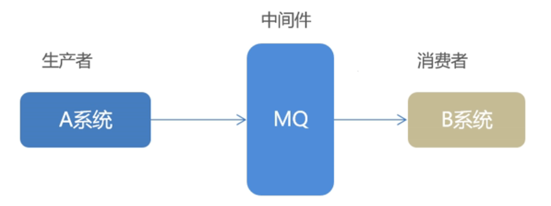  


### 1.2 MQ的优势与劣势

`优势`

* 应用解耦

  * 传统调用方式

    * ​	如果库存服务不可用了，会导致订单系统不可用，进而导致整个链路不可用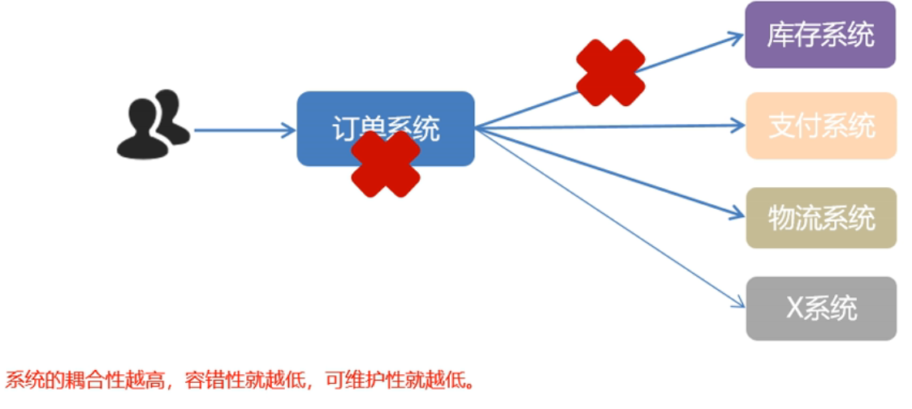

    

  * 使用MQ方式解决

    * 订单系统系订单，将消息推送到MQ上，如果库存系统不可用了，仅仅库存暂时无法使用，其他的服务依旧可以正常冲MQ中得到消息。等到库存系统恢复的时候，可以继续冲MQ中获取消息，扣减库存，保证了最终一致性。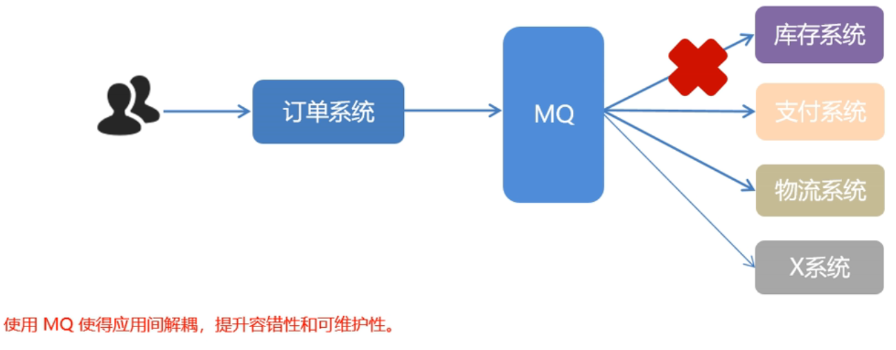


* 异步提速

  * 传统远程调用方式
    * 一个下单操作耗时：20+300+300+300=920ms用户点击完下单按钮后，需要等待920s才能得到下单响应，太慢！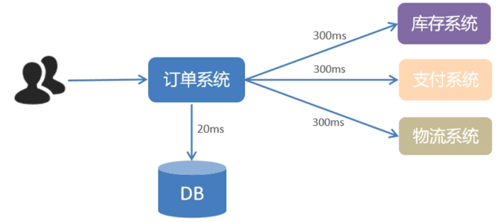
  * 使用MQ
    * 用户点击完下单按钮后，只需等待25ms就能得到下单响应(20+5=25ms)。提升用户体验和系统吞吐量（单位时间内处理请求的数目）。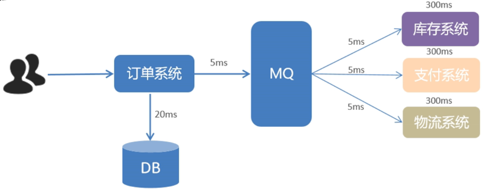 

* 削峰填谷

  * 削峰

    * 传统方式
      * 当每秒5000个请求，同时访问数据库，而数据库的最大处理请求是1000，就会导致A系统不可用。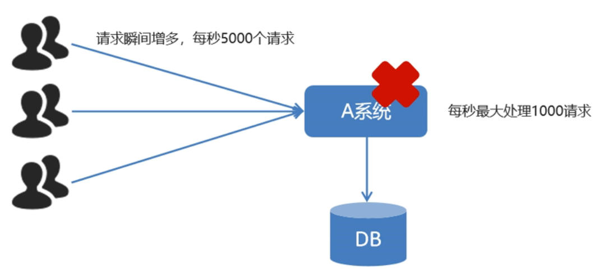
    * 使用MQ
      * 当每秒5000个请求，先放到MQ中去，然后A系统每秒去拉去1000个请求，就不会导致A系统挂掉.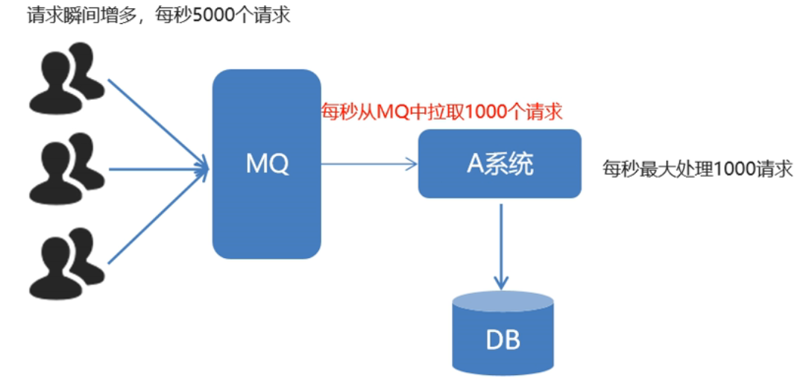

  * 填谷

    * 使用了MQ之后，限制消费消息的速度为1000，这样一来**，高峰期产生的数据势必会被积压在MQ中，高峰就被“削”掉了**，但是因为消息积压，**在高峰期过后的一段时间内，消费消息的速度还是会维持在1000，直到消费完积压的消息，这就叫做“填谷”。**

      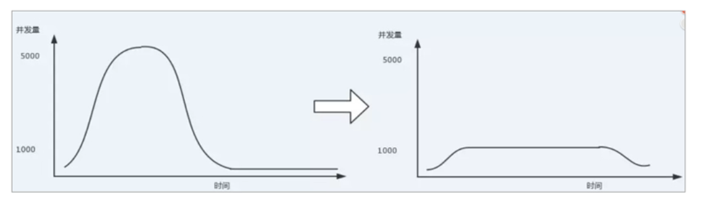

`劣势`

* 系统可用性降低
  * 系统引入的外部依赖越多，系统稳定性越差。一旦MQ宕机，就会对业务造成影响。如何保证MQ的**高可用**？
* 系统复杂度提高
  * MQ的加入大大增加了系统的复杂度，以前系统间是同步的远程调用，现在是通过MQ进行异步调用。如何保证消息没有被**重复消费**？怎么处理**消息丢失**情况？那么保证消息传递的**顺序性**？
* 一致性问题
  * A系统处理完业务，通过MQ给B、C、D三个系统发消息数据，如果B系统、C系统处理成功，D系统处理失败。如何保证消息数据处理的**一致性**？


### 1.3 使用MQ的条件

1. **生产者不需要从消费者处获得反馈**。引入消息队列之前的直接调用，其接口的**返回值应该为空**，这才让明明下层的动作还没做，上层却当成动作做完了继续往后走，即所谓异步成为了可能。
2. 容许**短暂的不一致性**。
3. 确实是用了有效果。即解耦、提速、削峰这些方面的**收益**，超过加入MQ**,管理MQ这些成本**。


### 1.4 常见的MQ产品

目前业界有很多的MQ产品，例如RabbitMQ、RocketMQ、ActiveMQ、Kafka、ZeroMQ、MetaMq等，也有直接使用Rds充当消息队列的案例，而这些消息队列产品，各有侧重，在实际选型时，需要结合自身需求及MQ产品特征，综合考虑。

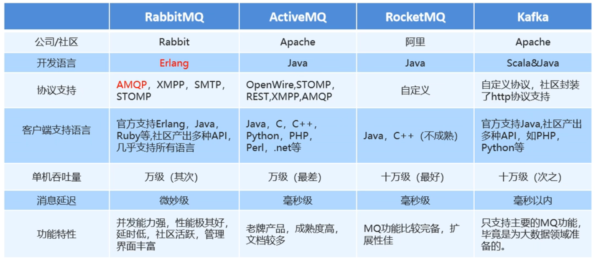


### 1.5 RabbitMQ概述

**AMQP**,即**Advanced Message Queuing Protocol**(高级消息队列协议)，是一个网络协议，是应用层协议的一个开放标准，为面向消息的中间件设计。基于此协议的客户端与消息中间件可传递消息，并不受客户端/中间件不同产品，不同的开发语言等条件的限制。2006年，AMQP规范发布。

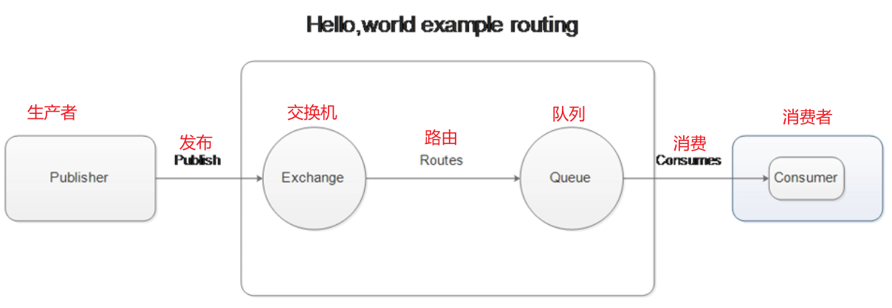


2007年，Rabbit技术公司基于AMQP标准开发的RabbitMQ1.0发布。RabbitMQ采用Erlang语言开发。Erlang语言由Ericson设计，专门为开发高并发和分布式系统的一种语言，在电信领域使用广泛。

**RabbitMQ基础架构如下图：**

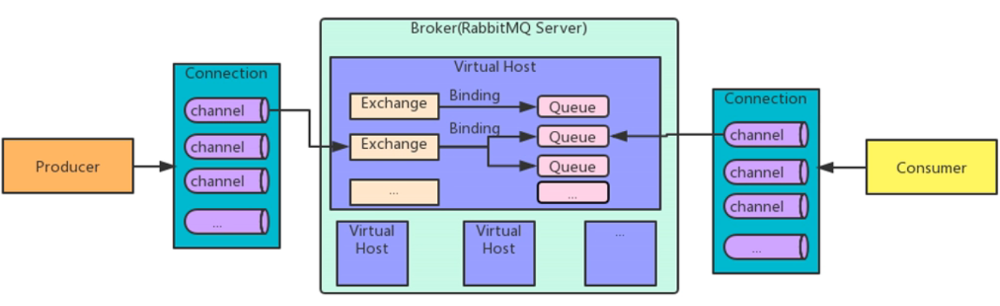

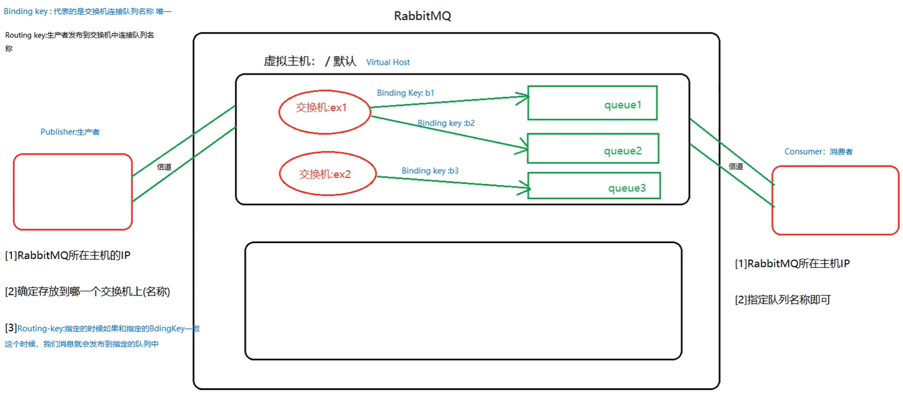

RabbitMQ中的相关概念：

* `Broker` ：接收和分发消息的应用，RabbitMQ Server就是Message Broker
* `Virtual host`：出于多租户和安全因素设计的，把AMQP的基本组件划分到一个虚拟的分组中，类似于网络中的namespace概念。当多个不同的用户使用同一个RabbitMQ server提供的服务时，可以划分出多个vhost,每个用户在自己的vhost创建exchange/queue等
* `Connection`：publisher/consumer和broker之间的TCP连接
* `Channel`：如果每一次访问RabbitMQ都建立个Connection,在消息量大的时候建立TCP Connection的开销将是巨大的，效率也较低。Channel是在connection内部建立的逻辑连接，如果应用程序支持多线程，通常每个thread创建单独的channel进行通讯，AMQP method包含了channel id帮助客户端和message broker识别channel,所以channel之间是完全隔离的。Channel作为轻量级的Connection极大减少了操作系统建立TCP connection的开销。
  * Channel中文叫做信道，是TCP里面的虚拟链接。例如：电缆相当于TCP,信道是个独立光纤束，一条TCP连接上创建多条信道是没有问题的。
  * TCP一旦打开，就会创建AMQP信道。
  * 无论是发布消息、接收消息、订阅队列，这些动作都是通过信道完成的。
* `Exchange`：message到达broker的第一站，根据分发规侧，匹配查询表中的routing key,分发消息到queue中去。常用的类型有：direct(point-to-point),topic(publish-subscribe)and fanout(multicast)
* `Queue`：消息最终被送到这里等待consumer取走Binding:exchange和queue之间的虚拟连接，binding中可以包含routing key。
* `Binding`：信息被保存到exchange中的查询表中，用于message的分发依据


**RabbitMQ提供了6种工作模式**：简单模式、work queues、Publish/Subscribe发布与订阅模式、Routing路由模式、Topics主题模式、RPC远程调用模式（远程调用，不太算MQ;暂不作介绍）。

官网对工作模式的描述：[RabbitMQ Tutorials — RabbitMQ](https://www.rabbitmq.com/getstarted.html)


### 1.6 JMS

* JMS即**Java消息服务**(Java Message Service)应用程序接口，是个Java平台中关于面向消息中间件的API。
* JMS是JavaEE规范中的一种，类比JDBC
* 很多消息中间件都实现了JMS规范，例如：ActiveMQ。RabbitMQ官方没有提供JMS的实现包，但是开源社区有。


## 2、RabbitMQ入门

### 2.1 安装

1. 拉取Rabbit的Docker镜像

   ```shell
   docker pull rabbitmq:management
   ```

   

2.  创建并指定容器

   创建时指定用户名和密码均为`lvyx`

   | 老版本（3.8.x） | docker run -d --name rabbitmq -p 15672:15672 -p 5672:5672 --restart=always -e RABBITMQ_DEFAULT_USER=lvyx -e RABBITMQ_DEFAULLT_PASS=lvyx rabbitmq:management |
   | --------------- | ------------------------------------------------------------ |
   | 新版本（3.9.x） | docker run -d --name rabbitmq -p 15672:15672 -p 5672:5672 --restart=always -e DEFAULT_USER=lvyx -e DEFAULLT_PASS=lvyx rabbitmq:management |


3. 访问 http://localhost:15276

   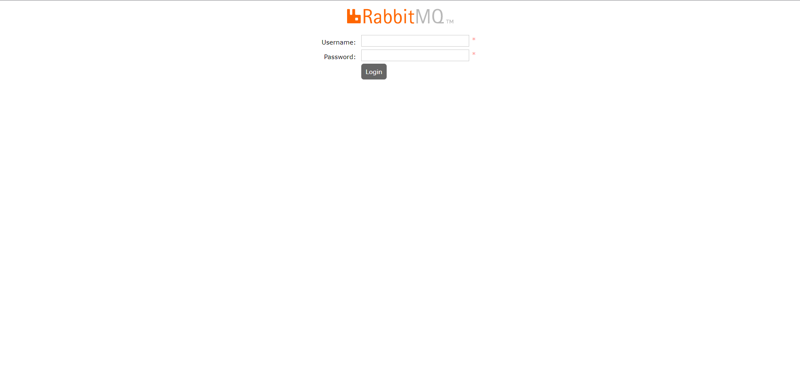


### 2.2 Spring AMQP

>Spring AMQP是Spring的一个顶s级项目。目前只支持RabbitMQ的实现。使用Spring Boot整合Spring AMQP时只需要在项目中导入spring-boot-starter-amqp启动器即可。之后在配置文件中配置RabbitMQ相关信息后就可以直接在代码中AmqpTemplate对象。AmgpTemplate接口具体实现类只有一个


#### 1. 基于代码方式创建交换机和队列

> **交换机类型：**
> Direct Exchange：直连交换机，根据Routing Key (路由键)进行投递到不同队列。
>
> Fanout Exchange：扇形交换机，采用广播模式，根据绑定的交换机，路由到与之对应的所有队列。
>
> Topic Exchange：主题交换机，对路由键进行模式匹配后进行投递，符号#表示一个或多个词，*表示一个词。
>
> Header Exchange：头交换机，不处理路由键。而是根据发送的消息内容中的headers属性进行匹配。
>
> **队列类型：**
>
> Classic 常规类型
>
> Quorum 新的队列类型，适用于对数据安全、容错方面要求高于低延迟等其他特性的场景。

```java
ConnectionFactory connectionFactory = new ConnectionFactory();
// rabbitmq 用户名和密码
connectionFactory.setUsername("lvyx");
connectionFactory.setPassword("lvyx");
// 设置rabbitmq地址
connectionFactory.setHost("119.23.188.80");
// 设施rabbitmq端口
connectionFactory.setPort(5672);
// 建立代理服务到交换机
Connection connection = connectionFactory.newConnection();
// 获得信道
Channel channel = connection.createChannel();
// 声明交换机名称
String exchangeName = "hello";
/*
 * 创建交换机
 * 1. 交换机名称: exchangeName
 * 2. type: 交换机类型, 常见的类型：fanout,direct,topic
 * 3. durable: 是否持久化。durable设置true表示持久化。持久化可以将换机存盘，才服务器重启的时候不会丢失信息。
 * 4. autoDelete：是否设置自动删除。autoDelete设置为true则表示自动删除。
 * 5. internal: 设置是否内置。如果设置为true，则表示内置交换机，客户端无法直接发送消息到这个交换机中，只能通过交换机路由到交换机这种方式
 * 6. argument: 其他一些结构化参数
 **/
channel.exchangeDeclare(exchangeName, "direct", true);
/*
 * 创建队列
 * 1. queue: 队列名称
 * 2. durable: 是否设置持久化
 * 3. exclusive: 设置是否排他
 * 4. autoDelete: 设置是否自动删除
 * 5. arguments: 设置队列的其他参数
 **/
channel.queueDeclare("hello-exchange", false,false,false,null);

String routingKey = "helloword";

// 发布消息
byte[] messageBodyByte = "lyx666".getBytes();
channel.basicPublish(exchangeName, routingKey, null, messageBodyByte);
System.out.println("send success");

channel.close();
connection.close();
```


#### 2. 基于配置方式创建交换机和队列

1. 在配置文件中添加链接信息

   ```yaml
   spring:
     # 配置rabbitMQ
     rabbitmq:
       host: 119.23.188.80
       port: 5672
       username: lvyx
       password: lvyx
   ```

   

2. 创建RabbitMQ的配置类

   ```java
   package com.lyx.boot.amqp;
   
   
   import org.springframework.amqp.core.Binding;
   import org.springframework.amqp.core.BindingBuilder;
   import org.springframework.amqp.core.DirectExchange;
   import org.springframework.amqp.core.Queue;
   import org.springframework.context.annotation.Bean;
   import org.springframework.context.annotation.Configuration;
   
   
   
   /**
    * <p>
    * RabbitMQ配置
    * </p>
    *
    * @author lvyx
    * @since 2022-07-08 22:49:56
    */
   @Configuration
   public class RabbitMQConfig {
   
       /**
        * 发送消息时如果不存在这个队列，会自动创建这个队列。
        * 注意：是发送消息时，而不是启动项目时。
        * 相当于：可视化操作时创建一个队列
        * 如果队列创建完成后，没有绑定（没有另外两个方法），默认绑定到AMQP default交换器
        *
        * @return org.springframework.amqp.core.Queue
        * @author lvyx
        * @since 2022/7/8 22:52
        **/
       @Bean
       public Queue queue(){
           return new Queue("queue1");
       }
   
       /**
        * 如果没有这个交换器，在发送消息创建这个交换器
        * 配置类中方法名就是这个类型的实例名。相当于<bean id="" cLass=">的id属性，返回值相当于cLass
        *
        * @return org.springframework.amqp.core.DirectExchange
        * @author lvyx
        * @since 2022/7/8 22:54
        **/
       @Bean
       public DirectExchange directExchange(){
           return new DirectExchange("amq.direct");
       }
   
       @Bean
       public Binding directExchange(DirectExchange directExchange, Queue queue){
           // .withQueueName() 表示队列名就是路由键名称。也可以使用.with("key")指定键名。
           return BindingBuilder.bind(queue).to(directExchange).withQueueName();
       }
   
   }
   ```


#### 3.基于图形界面创建交换机和队列

1. 创建队列

   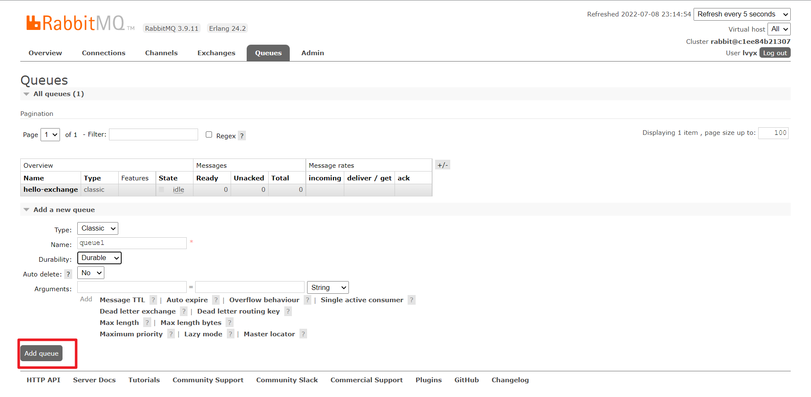

2. 创建交换机

   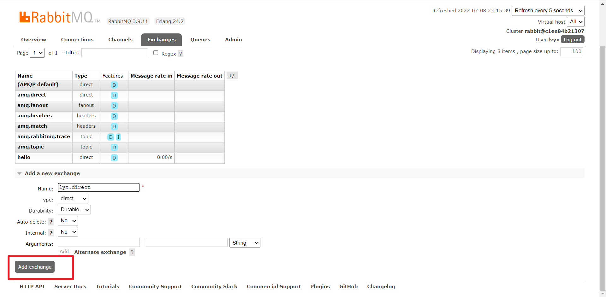

3. 绑定交换机和队列

   点击刚刚创建的交换机

   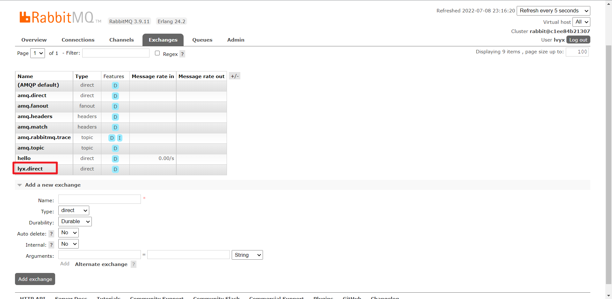

   绑定

   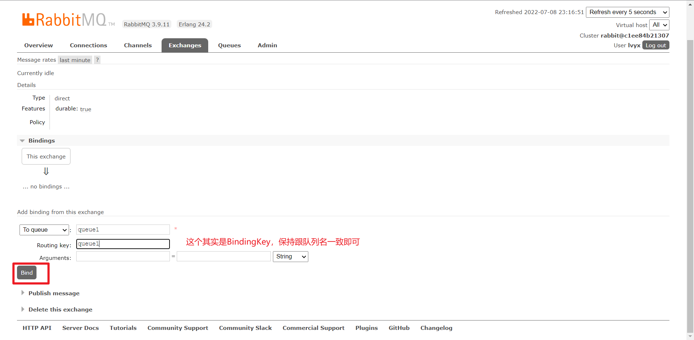


#### 4. 发送和接收消息

**生产者发送消息**

```java
package com.lyx.boot.Controller;

import org.springframework.amqp.core.AmqpTemplate;
import org.springframework.web.bind.annotation.GetMapping;
import org.springframework.web.bind.annotation.RequestMapping;
import org.springframework.web.bind.annotation.RestController;

import javax.annotation.Resource;

/**
 * <p>
 * 生产者
 * </p>
 *
 * @author lvyx
 * @since 2022-07-10 16:23:52
 */
@RestController
@RequestMapping("/publisher")
public class PublisherController {

    @Resource
    private AmqpTemplate amqpTemplate;

    @GetMapping("/send")
    private String sendMsg(){
        /*
         * 第一个参数： 交换机名称
         * 第二个参数：bindingKey
         * 第三个参数：发送的消息
         **/
        amqpTemplate.convertAndSend("lyx.direct", "queue1", "hello world, 你好，世界!");
        return "success";
    }
}
```


**消费者接受消息**

```java
package com.lyx.boot.listener;

import org.springframework.amqp.rabbit.annotation.RabbitListener;
import org.springframework.stereotype.Component;

/**
 * <p>
 * 监听器
 * </p>
 *
 * @author lvyx
 * @since 2022-07-10 16:29:05
 */
@Component
public class ReceiveListener {

	
    @RabbitListener( queues = "queue1") // 监听queue1交换机
    public void receive(String msg){
        System.out.println("消费者接收到消息: " + msg);
    }

}
```


#### 5. 接收顺序

> 如果有多个消费者接收消息，接收消息的顺序是轮询的，并且不用等待上一个消费者处理完，可以直接接收消息。

**生产者**

```java
package com.lyx.boot.Controller;

import org.springframework.amqp.core.AmqpTemplate;
import org.springframework.web.bind.annotation.GetMapping;
import org.springframework.web.bind.annotation.RequestMapping;
import org.springframework.web.bind.annotation.RestController;

import javax.annotation.Resource;

/**
 * <p>
 * 生产者
 * </p>
 *
 * @author lvyx
 * @since 2022-07-10 16:23:52
 */
@RestController
@RequestMapping("/publisher")
public class PublisherController {

    @Resource
    private AmqpTemplate amqpTemplate;

    @GetMapping("/send")
    private String sendMsg(){
        /*
         * 第一个参数： 交换机名称
         * 第二个参数：bindingKey
         * 第三个参数：发送的消息
         **/
        for (int i = 0; i < 10; i++) {
            amqpTemplate.convertAndSend("lyx.direct", "queue1", "hello world, 你好，世界!");
        }
        return "success";
    }
}
```


**消费者**

```java
package com.lyx.boot.listener;

import org.springframework.amqp.rabbit.annotation.RabbitListener;
import org.springframework.stereotype.Component;

import java.util.concurrent.TimeUnit;

/**
 * <p>
 * 监听器
 * </p>
 *
 * @author lvyx
 * @since 2022-07-10 16:29:05
 */
@Component
public class ReceiveListener {


    @RabbitListener( queues = "queue1")
    public void receive1(String msg) throws InterruptedException {
        System.out.println("消费者1接收到消息: " + msg);
        TimeUnit.MILLISECONDS.sleep(400);
        System.out.println("消费者1处理完成");
    }

    @RabbitListener( queues = "queue1")
    public void receive2(String msg) throws InterruptedException {
        System.out.println("消费者2接收到消息: " + msg);
        TimeUnit.MILLISECONDS.sleep(100);
        System.out.println("消费者2处理完成");
    }

}
```

运行结果：

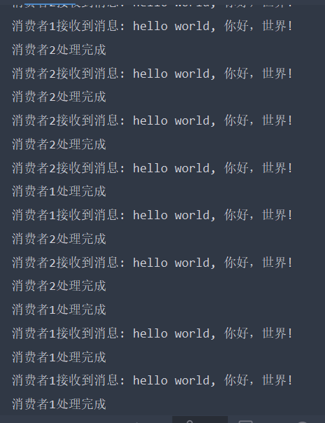 


#### 6. 通过监听创建队列

如果监听的队列为空，在项目启动的时候会报如下错误：

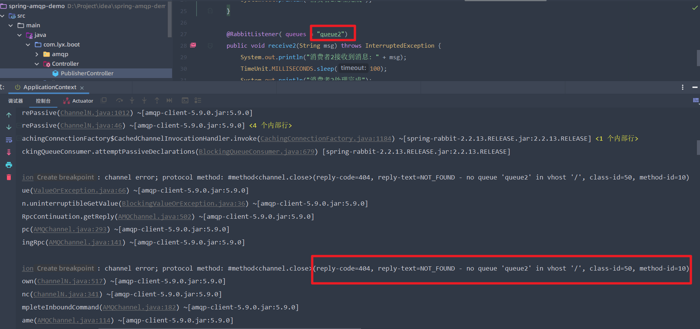


此时可以使用注解的方式，如果不存在就创建:

```java
package com.lyx.boot.listener;

import org.springframework.amqp.rabbit.annotation.Exchange;
import org.springframework.amqp.rabbit.annotation.Queue;
import org.springframework.amqp.rabbit.annotation.QueueBinding;
import org.springframework.amqp.rabbit.annotation.RabbitListener;
import org.springframework.stereotype.Component;

import java.util.concurrent.TimeUnit;

/**
 * <p>
 * 监听器
 * </p>
 *
 * @author lvyx
 * @since 2022-07-10 16:29:05
 */
@Component
public class ReceiveListener {

    @RabbitListener( bindings = {
            @QueueBinding(
                    value = @Queue("queue2"),
                    exchange = @Exchange( name = "lvyx.direct"),
                    key = "queue2"
            )
    })
    public void receive2(String msg) throws InterruptedException {
        System.out.println("消费者2接收到消息: " + msg);
        TimeUnit.MILLISECONDS.sleep(100);
        System.out.println("消费者2处理完成");
    }

}

```


### 2.3 交换机

#### 1.（Direct）直连交换机

> 直连交换机，根据Routing Key(路由键)进行投递到不同队列。

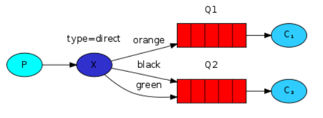


#### 2.（fanout）扇形交换机

>扇形交换器，实际上做的事情就是广播，`fanout`会把消息发送给所有的绑定在当前交换器上的队列。对应Consumer依然采用公平调度方式。
>
>使用场景：商品下订单时，同时需要发送邮件、发送短信、向库房发送订单等多个操作同步执行时，可以使用fanout交换器。

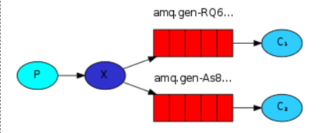

==**注意:** 创建队列和交换机绑定队列的时候，不用指定路由键，可通过广播的方式发送到所有的队列中去==


#### 3.（Topic）主题交换机

>topic比direct交换器功能更强，设置路由键时允许出现特殊字符。使用topic时路由键的写法和包写法相同。例如：com.xxx.xxx格式在绑定时可以带有下面特殊符号，中间可以出现：
>
>`*`: 代表一个单词（两个`.`之间内容）例如：com.lyx.* 可以匹配到 com.lyx.queue1
>
>`#`: 0个或多个字符 例如：com.lyx.# 可以匹配到 com.lyx.queue1.queue2

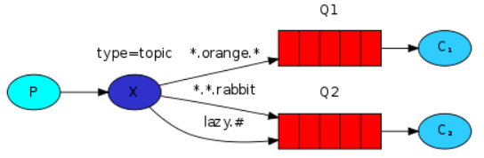


#### 4. （headers）头部交换机

>headers交换器和direct交换器的主要区别是在传递消息时可以传递header部分消息。
>
>头交换机，不处理路由键。而是根据发送的消息内容中的headers属性进行匹配。在绑定Queue与Exchange时指定一组键值对；当消息发送到RabbitMQ时会取到该消息的headers与Exchange绑定时指定的键值对进行匹配；如果完全匹配则消息会路由到该队列，否则不会路由到该队列。headers属性是一个键值对，可以是Hashtable，键值对的值可以是任何类型。而fanout，direct，topic 的路由键都需要要字符串形式的。
>
>匹配规则x-match有下列两种类型：
>
>x-match = all ：表示所有的键值对都匹配才能接受到消息
>
>x-match = any ：表示只要有键值对匹配就能接受到消息

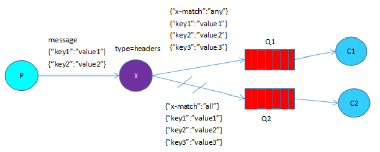


### 2.4 发送对象类型数据

> 注意：
>
> 1. 传送的对象必须实现序列化接口
> 2. 生产者和消费者传送对象的包名和类名必须完全相同

**生产者**

```java
@GetMapping("/sendObj")
public String sendObj(){
    amqpTemplate.convertAndSend("lyx.direct", "queue5", new User(1, "lyx"));
    return "send obj success";
}
```


**消费者**

```java
@RabbitListener( bindings = {
            @QueueBinding(
                    value = @Queue("queue5"),
                    exchange = @Exchange( name = "lyx.direct"),
                    key = "queue5"
            )
    })
    public void receivet(User user) {
        System.out.println("消费者5接收到消息: " + user);
    }
```


### 2.5 发送同步消息（带返回值）

**生产者**

```java
@GetMapping("/sendObj")
public String sendObj(){
    Object o = amqpTemplate.convertSendAndReceive("lyx.direct", "queue5", new User(1, "lyx"));
    return "sendObj success" + o.toString();
}
```


**消费者**

```java
@RabbitListener( bindings = {
    @QueueBinding(
        value = @Queue("queue5"),
        exchange = @Exchange( name = "lyx.direct"),
        key = "queue5"
    )
})
public String receivet5(User user) throws InterruptedException {
    System.out.println("消费者6接收到消息: " + user);
    return "OK";
}
```


如果消费者出现异常，导致生产者一直没有接收到消息，生产者不会一直等到，超过设置的超时时间，会返回Null值。

设置超时时间：

```yaml
spring:
  # 配置rabbitMQ
  rabbitmq:
    host: 119.23.188.80
    port: 5672
    username: lvyx
    password: lvyx
    template:
      reply-timeout: 1000 # 设置超时时间
```


## 3、面试题

### 3.1 什么是ACK机制 

>ACK机制是消费者从RabbitMQ收到消息并处理完成后，反馈给RabbitMQ，MQ收到反馈后才将此消息从队列中删除。消息的ACK确认机制默认是打开的。

如果一个消费者在处理消息出现了**网络不稳**、**服务器异常**等现象，那么就不会有ACK反馈，RabbitMQ会认为这个消息没有正常消费，会将消息重新放入队列。
如果在集群的情况下，RabbitMQ会立即将这个消息推送给这个在线的其他消费者。这种机制保证了在消费者服务端故障的时候，不丢失任何消息和任务。
消息永远不会从RabbitMQ中删除，只有当消费者正确发送ACK反馈，RabbitMQ确认收到后，消息才会从RabbitMQ服务器的数据中删除。
**注意事项：**

* 如果消费者发生异常，ack没法送消息应答。，Message会一直重新分发。然后RabbitMQ会占用越来越多的内容，由于RabbitMQ会长时间运行，因此这个"**内存泄漏**"是致命的。

  * 解决办法

    * （1）在程序处理中可以进行异常捕获，保证消费者的程序正常执行。

      （2）使用RabbitMQ的ack的配置确认机制。（开启重试次数）

      （3）手动设置消息应答。如果消费端异常，也返回应答成功，再把未消费成功的数据记录下来，进行补偿。


### 3.2 什么是消息幂等性问题，如何解决？

>1. (重复发送)Publisher给MQ发送消息的时候，MQ在给Publisher返回ACK时由于网络中断等问题，没有成功返回。Publisher会认为消息没有发送成功，在网络恢复后会重新发送消息。
>2. (重复消费)Consumer接收到消息后，在给MQ返回AcK时由于网络问题，MQ没有成功接收ACK,MQ会认为此消息没有正确消费。在网络重连后会把消息重新发送给此消费者，或重新广播给其他所有消费者。

解决办法：

* 解决重复发送问题。MQ内部会给每个消息生成一个唯一ID。当消息接收到后会判断此ID。

  * ```java
    MessageProperties mp = new MessagePorperties();
    mp.setMessageId(UUID.randomUUID().toString)
    ```

    

* 解决重复消费问题。在Consumer中可以通过消息的唯一ID进行判断是否已经消费过（借助Redis等工具每次消费都要记录已经消费过），也可以在每条消息中自定义唯一标识，判断是否已经消费过

  * ```java
    String messageId = message.getMessagePorperties().getMessageId();
    // 判断Redis中是否存在该messageId，如果没有，表示第一次消费该消息，将MessageId放入Redis中，如果有表示已经被消费了。
    ```


### 3.3 如何保证消息不丢失？

* 对队列开启持久化操作
* 对消息的消费开启Ack确认机制
* 对生产者开启**Comfrim消息确认机制**

#### 1. 消息的可靠性投递

>在使用RabbitMQ的时候，作为消息发送方希望杜绝任何消息丢失或者投递失败场景。RabbitMQ为我们提供了两种方式用来控制消息的投递可靠性模式。
>
>* confirm确认模式
>* return退回模式

rabbitmq整个消息投递的路径为：

producer--->rabbitmq broker--->exchange--->queue--->consumer

* 消息从producer到exchange则会返回一个confirmCallback。

* 消息从exchange->queue投递失败则会返回一个returnCallback。

我们将利用这两个callback控制消息的可靠性投递。


### 3.4 如何保证消息的顺序性？

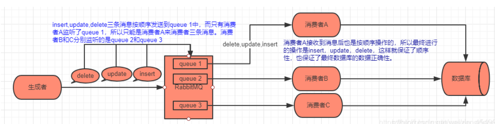

>如图所示，RabbitMQ保证消息的顺序性，就是拆分多个 queue，**每个 queue 对应一个 consumer（消费者）**，就是多一些 queue 而已，确实是麻烦点；或者就一个 queue 但是对应一个 consumer，然后这个 consumer 内部用内存队列做排队，然后分发给底层不同的 worker 来处理。