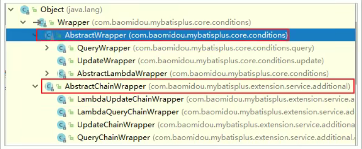

#  1mybaits-plus教程

## 1. 简介

> MyBatis-Plus (opens new window)（简称 MP）是一个 MyBatis (opens new window)的增强工具，在 MyBatis 的基础上只做增强不做改变，为简化开发、提高效率而生。


### 1.1 官方文档

官网：[官方文档 | MyBatis-Plus (baomidou.com)](https://mp.baomidou.com/guide/)


### 1.2 特性

- **无侵入**：只做增强不做改变，引入它不会对现有工程产生影响，如丝般顺滑

- **损耗小**：启动即会自动注入基本 CURD，性能基本无损耗，直接面向对象操作

- **强大的 CRUD 操作**：内置通用 Mapper、通用 Service，仅仅通过少量配置即可实现单表大部分 CRUD 操作，更有强大的条件构造器，满足各类使用需求

- **支持 Lambda 形式调用**：通过 Lambda 表达式，方便的编写各类查询条件，无需再担心字段写错

- **支持主键自动生成**：支持多达 4 种主键策略（内含分布式唯一 ID 生成器 - Sequence），可自由配置，完美解决主键问题

- **支持 ActiveRecord 模式**：支持 ActiveRecord 形式调用，实体类只需继承 Model 类即可进行强大的 CRUD 操作

- **支持自定义全局通用操作**：支持全局通用方法注入（ Write once, use anywhere ）

- **内置代码生成器**：采用代码或者 Maven 插件可快速生成 Mapper 、 Model 、 Service 、 Controller 层代码，支持模板引擎，更有超多自定义配置等您来使用

- **内置分页插件**：基于 MyBatis 物理分页，开发者无需关心具体操作，配置好插件之后，写分页等同于普通 List 查询

- **分页插件支持多种数据库**：支持 MySQL、MariaDB、Oracle、DB2、H2、HSQL、SQLite、Postgre、SQLServer 等多种数据库

- **内置性能分析插件**：可输出 Sql 语句以及其执行时间，建议开发测试时启用该功能，能快速揪出慢查询

- **内置全局拦截插件**：提供全表 delete 、 update 操作智能分析阻断，也可自定义拦截规则，预防误操作

  

## 2. 快速开始

> 对于 Mybatis整合MP有常常有三种用法,分别是 Mybatis+MP、 Spring+ Mybatis+MP、 Spring
> Boot+ Mybatis+MP。


### 2.1 创建数据库

```sql
--创建表
CREATE TABLE user
(
	id BIGINT(20) NOT NULL COMMENT '主键ID',
	name VARCHAR(30) NULL DEFAULT NULL COMMENT '姓名',
	age INT(11) NULL DEFAULT NULL COMMENT '年龄',
	email VARCHAR(50) NULL DEFAULT NULL COMMENT '邮箱',
	PRIMARY KEY (id)
);
--插入数据
INSERT INTO user (id, name, age, email) VALUES
(1, 'Jone', 18, 'test1@baomidou.com'),
(2, 'Jack', 20, 'test2@baomidou.com'),
(3, 'Tom', 28, 'test3@baomidou.com'),
(4, 'Sandy', 21, 'test4@baomidou.com'),
(5, 'Billie', 24, 'test5@baomidou.com');
```


### 2.2 创建maven工程

导入相关的依赖

```xml
<!--mybatis-plus-->
<dependency>
    <groupId>com.baomidou</groupId>
    <artifactId>mybatis-plus</artifactId>
    <version>3.1.1</version>
</dependency>
<!--mysql驱动-->
<dependency>
    <groupId>mysql</groupId>
    <artifactId>mysql-connector-java</artifactId>
    <version>5.1.6</version>
</dependency>
<!--数据连接池-->
<dependency>
    <groupId>com.alibaba</groupId>
    <artifactId>druid</artifactId>
    <version>1.0.11</version>
</dependency>
<!--简化bean代码-->
<dependency>
    <groupId>org.projectlombok</groupId>
    <artifactId>lombok</artifactId>
    <version>1.18.4</version>
    <optional>true</optional>
    <scope>provided</scope>
</dependency>
<!--单元测试-->
<dependency>
    <groupId>junit</groupId>
    <artifactId>junit</artifactId>
    <version>4.12</version>
    <scope>test</scope>
</dependency>
<!--mybatis日志-->
<dependency>
    <groupId>org.slf4j</groupId>
    <artifactId>slf4j-log4j12</artifactId>
    <version>1.6.4</version>
    <scope>test</scope>
</dependency>
```


### 2.4 创建子工程

* 导入log4j.properties日志文件

  ```xml
  log4j.rootLogger=DEBUG,A1
  log4j.appender.A1=org.apache.log4j.ConsoleAppender
  log4j.appender.A1.layout=org.apache.log4j.PatternLayout
  log4j.appender.A1.layout.ConversionPattern = [%t] [%c] - [%p] %m %n
  ```

  

* 导入mybatis全局配置文件sqlMapperConfig.xml

  ```xml
  <?xml version="1.0" encoding="UTF-8" ?>
  <!DOCTYPE configuration PUBLIC "-//mybatis.org//DTD Config 3.0//EN" "http://mybatis.org/dtd/mybatis-3-config.dtd">
  <configuration>
      <!-- 数据环境 -->
      <environments default="dev">
          <environment id="dev">
              <transactionManager type="JDBC"></transactionManager>
              <dataSource type="POOLED">
                  <property name="driver" value="com.mysql.jdbc.Driver"/>
                  <property name="url" value="jdbc:mysql://localhost:3306/mp"/>
                  <property name="username" value="root"/>
                  <property name="password" value="root"/>
              </dataSource>
          </environment>
      </environments>
      <!-- 加载映射文件 -->
      <mappers>
          <mapper resource="com/lyx/mapper/UserMapper.xml"/>
      </mappers>
  </configuration>
  ```

  

* 创建用户实体类

  ```java
  package com.lyx.pojo;
  
  import lombok.AllArgsConstructor;
  import lombok.Data;
  import lombok.NoArgsConstructor;
  
  @Data
  @AllArgsConstructor
  @NoArgsConstructor
  public class User {
      private Integer id;
      private String name;
      private Integer age;
      private String email;
  }
  ```

  

* 创建用户dao层接口

  ```java
  package com.lyx.mapper;
  
  import com.lyx.pojo.User;
  
  import java.util.List;
  
  public interface UserMapper {
      
      List<User> findAll();
  }
  
  ```

  

* 创建用户接口映射文件

  ```xml
  <?xml version="1.0" encoding="UTF-8" ?>
  <!DOCTYPE mapper PUBLIC "-//mybatis.org//DTD Mapper 3.0//EN" "http://mybatis.org/dtd/mybatis-3-mapper.dtd">
  <mapper namespace="com.lyx.mapper.UserMapper">
      <select id="findAll" resultType="com.lyx.pojo.User">
          select * from user
      </select>
  </mapper>
  ```

  

* 测试原生mybaits

  ```java
  package com.lyx.test;
  
  import com.lyx.mapper.UserMapper;
  import com.lyx.pojo.User;
  import org.apache.ibatis.io.Resources;
  import org.apache.ibatis.session.SqlSession;
  import org.apache.ibatis.session.SqlSessionFactory;
  import org.apache.ibatis.session.SqlSessionFactoryBuilder;
  import org.junit.Test;
  
  import java.io.IOException;
  import java.io.InputStream;
  import java.util.List;
  
  public class MybatisTest {
      @Test
      public void findAllTest() throws IOException {
          InputStream resourceAsStream = Resources.getResourceAsStream("sqlMapperConfig.xml");
          SqlSessionFactory sqlSessionFactory = new SqlSessionFactoryBuilder().build(resourceAsStream);
          SqlSession sqlSession = sqlSessionFactory.openSession();
          UserMapper userMapper = sqlSession.getMapper(UserMapper.class);
          List<User> userList = userMapper.findAll();
          for (User user : userList) {
              System.out.println(user);
          }
  
      }
  }
  ```

  

### 2.5 mybatis与mybatis-plus整合

1. 将UserMapper集成BaseMapper，UserMapper就会拥有BaseMapper中的所有方法

   ```java
   package com.lyx.mapper;
   
   import com.baomidou.mybatisplus.core.mapper.BaseMapper;
   import com.lyx.pojo.User;
   
   import java.util.List;
   
   public interface UserMapper extends BaseMapper<User> {
   
       List<User> findAll();
   }
   ```

   

2. 将实体类与对应的表进行指定(表明与实体类相同可忽略此步骤)

   ```java
   package com.lyx.pojo;
   
   import com.baomidou.mybatisplus.annotation.TableName;
   import lombok.AllArgsConstructor;
   import lombok.Data;
   import lombok.NoArgsConstructor;
   
   @Data
   @AllArgsConstructor
   @NoArgsConstructor
   @TableName("user")
   public class User {
       private Integer id;
       private String name;
       private Integer age;
       private String email;
   }
   ```

   

3. 使用MybatisSqlSessionFactoryBuilder()方法构建

   ```java
   SqlSessionFactory sqlSessionFactory = new MybatisSqlSessionFactoryBuilder().build(resourceAsStream);
   ```

   

4. 测试

   ```java
   package com.lyx.test;
   
   import com.baomidou.mybatisplus.core.MybatisSqlSessionFactoryBuilder;
   import com.lyx.mapper.UserMapper;
   import com.lyx.pojo.User;
   import org.apache.ibatis.io.Resources;
   import org.apache.ibatis.session.SqlSession;
   import org.apache.ibatis.session.SqlSessionFactory;
   import org.junit.Test;
   
   import java.io.IOException;
   import java.io.InputStream;
   import java.util.List;
   
   public class MybatisTest {
       @Test
       public void findAllTest() throws IOException {
           InputStream resourceAsStream = Resources.getResourceAsStream("sqlMapperConfig.xml");
           SqlSessionFactory sqlSessionFactory = new MybatisSqlSessionFactoryBuilder().build(resourceAsStream);
           SqlSession sqlSession = sqlSessionFactory.openSession();
           UserMapper userMapper = sqlSession.getMapper(UserMapper.class);
           List<User> userList = userMapper.selectList(null);//使用baseMapper中的方法进行查询
           for (User user : userList) {
               System.out.println(user);
           }
   
       }
   }
   ```

   

### 2.6 spring与mybatis-plus整合

1. 创建子工程

2. 导入依赖

   ```xml
   <properties>
       <spring.version>5.0.2.RELEASE</spring.version>
   </properties>
   
   <dependencies>
       <dependency>
           <groupId>org.springframework</groupId>
           <artifactId>spring-context</artifactId>
           <version>${spring.version}</version>
       </dependency>
       <dependency>
           <groupId>org.springframework</groupId>
           <artifactId>spring-jdbc</artifactId>
           <version>${spring.version}</version>
       </dependency>
       <dependency>
           <groupId>org.springframework</groupId>
           <artifactId>spring-test</artifactId>
           <version>${spring.version}</version>
       </dependency>
   </dependencies>
   ```

   

3. 创建dao层接口

   ```java
   package com.lyx.mapper;
   
   import com.baomidou.mybatisplus.core.mapper.BaseMapper;
   import com.lyx.pojo.User;
   
   import java.util.List;
   
   public interface UserMapper extends BaseMapper<User> {
   
       List<User> findAll();
   }
   ```

   

4. 创建dao层接口映射文件

   ```xml
   <?xml version="1.0" encoding="UTF-8" ?>
   <!DOCTYPE mapper PUBLIC "-//mybatis.org//DTD Mapper 3.0//EN" "http://mybatis.org/dtd/mybatis-3-mapper.dtd">
   <mapper namespace="com.lyx.mapper.UserMapper">
       <select id="findAll" resultType="com.lyx.pojo.User">
           select * from user
       </select>
   </mapper>
   ```

   

5. 创建spring配置文件，整合mybatis

   ```xml
   <?xml version="1.0" encoding="UTF-8"?>
   <beans xmlns="http://www.springframework.org/schema/beans"
          xmlns:xsi="http://www.w3.org/2001/XMLSchema-instance"
          xmlns:context="http://www.springframework.org/schema/context"
          xmlns:tx="http://www.springframework.org/schema/tx"
          xsi:schemaLocation="
          http://www.springframework.org/schema/beans http://www.springframework.org/schema/beans/spring-beans.xsd
          http://www.springframework.org/schema/context http://www.springframework.org/schema/context/spring-context.xsd
          http://www.springframework.org/schema/tx http://www.springframework.org/schema/tx/spring-tx.xsd
   ">
   
       <!--数据库连接池以及事务都交给spring容器来完成-->
       <!--扫描数据库配置文件-->
       <context:property-placeholder location="classpath:db.properties"/>
       <!--配置数据源-->
       <bean id="druidDataSource" class="com.alibaba.druid.pool.DruidDataSource">
           <property name="driverClassName" value="${jdbc.driver}"/>
           <property name="url" value="${jdbc.url}"/>
           <property name="username" value="${jdbc.username}"/>
           <property name="password" value="${jdbc.password}"/>
       </bean>
   
   
   
       <!--SqlSessionFactory对象应该放到spring容器中作为单例对象管理
               将原来需要在sqlMapperConfig.xml中的配置文件配置到SqlSessionFactoryBean中
       -->
       <bean id="sqlSessionFactory" class="com.baomidou.mybatisplus.extension.spring.MybatisSqlSessionFactoryBean">
           <!--开启别名映射包扫描-->
           <property name="typeAliasesPackage" value="com.lyx.pojo"/>
           <!--数据源-->
           <property name="dataSource" ref="druidDataSource"/>
       </bean>
   
   
       <!--Mapper动态代理对象交给spring管理，我们从spring容器中直接获得Mapper的代理对象-->
       <!--扫描mapper接口，生成代理对象，将生产的代理对象放在spring的ioc容器中-->
       <bean class="org.mybatis.spring.mapper.MapperScannerConfigurer">
           <!--mapper接口的包路径位置-->
           <property name="basePackage" value="com.lyx.mapper"/>
           <property name="sqlSessionFactoryBeanName" value="sqlSessionFactory"/>
       </bean>
   </beans>
   ```

   

6. 测试

   ```java
   package com.lyx;
   
   import com.lyx.mapper.UserMapper;
   import com.lyx.pojo.User;
   import org.junit.Test;
   import org.junit.runner.RunWith;
   import org.springframework.beans.factory.annotation.Autowired;
   import org.springframework.test.context.ContextConfiguration;
   import org.springframework.test.context.junit4.SpringJUnit4ClassRunner;
   
   import java.util.List;
   
   @RunWith(SpringJUnit4ClassRunner.class)
   @ContextConfiguration("classpath:spring.xml")
   public class MPTest {
   
       @Autowired
       private UserMapper userMapper;
   
       @Test
       public void findAllTest(){
           List<User> userList = userMapper.selectList(null);
           for (User user : userList) {
               System.out.println(user);
           }
       }
   }
   
   ```


## 3. 注解

### 3.1 @TableFild

在MP中通过@TableField注解可以指定字段的一些属性，常常解决的问题有2个：

1. 对象中的属性名和字段名不一致的问题（非驼峰）
2. 对象中的属性字段在表中不存在的问题

```java
package com.lyx.pojo;

import com.baomidou.mybatisplus.annotation.IdType;
import com.baomidou.mybatisplus.annotation.TableField;
import com.baomidou.mybatisplus.annotation.TableId;
import com.baomidou.mybatisplus.annotation.TableName;
import lombok.AllArgsConstructor;
import lombok.Data;
import lombok.NoArgsConstructor;


@Data
@AllArgsConstructor
@NoArgsConstructor
@TableName("user")  //关联数据表
public class User {
    @TableId(type= IdType.AUTO)  //设置id自增长策略
    private Integer id;
    private String name;

    @TableField(select = false)  //设置执行查询语句时不查出来
    private Integer age;

    @TableField("email")  //设置匹配数据库表中的字段名
    private String mail;

    @TableField(exist = false) //表示当前属性在数据库中不存在
    private String Address;


}
```


## 4. 通用CRUD操作

### 3.1 插入操作

==注意：由于mybatis-plus有id策略，默认创建的id值过大，需要将id设为自增长==

```java
package com.lyx.pojo;

import com.baomidou.mybatisplus.annotation.IdType;
import com.baomidou.mybatisplus.annotation.TableId;
import com.baomidou.mybatisplus.annotation.TableName;
import lombok.AllArgsConstructor;
import lombok.Data;
import lombok.NoArgsConstructor;

import java.lang.reflect.Type;

@Data
@AllArgsConstructor
@NoArgsConstructor
@TableName("user")  //关联数据表
public class User {
    @TableId(type= IdType.AUTO)  //设置id自增长策略
    private Integer id;
    private String name;
    private Integer age;
    private String email;
}
```


```java
@Test
public void testInsert(){
    User user = new User();
    user.setName("pony");
    user.setAge(18);
    user.setEmail("1@123.com");
    int count = userMapper.insert(user);  //返回受影响的条数
    System.out.println(count);
    //插入完成后，id会自动回写到到user对象中
    System.out.println("id = "+ user.getId());
}
```


### 3.2 更新操作

* 根据id更新用户数据

  ```java
  @Test
  public void testUpdateById(){
      User user = new User();
      user.setId(6);
      user.setName("xxx");
      user.setMail("1@qq.com");
      int i = userMapper.updateById(user);
      System.out.println(i);
  }
  ```

  

* 根据条件查询

  ```java
  //方法一
  @Test
  public void testUpdateByCondition(){
      User user = new User();  //需要更新的数据
      user.setName("hello");
      user.setMail("2@qq.com");
      QueryWrapper<User> wrapper = new QueryWrapper<User>();  //更新的条件
      wrapper.eq("name", "xxx");  //参数： 数据库中的字段名 字段对应的值
      int i = userMapper.update(user, wrapper);
      System.out.println(i);
  }
  
  //方法二
  @Test
  public void testUpdateByCondition2(){
      User user = new User();  //需要更新的数据
      user.setId(6);
      user.setName("helloworld");
      user.setMail("3@qq.com");
      UpdateWrapper<User> wrapper = new UpdateWrapper<User>();
      wrapper.set("name", user.getName())  //更新的数据
          .set("email", user.getMail())  //更新的数据
          .eq("id", user.getId());  //更新的条件
      int i = userMapper.update(null, wrapper);
      System.out.println(i);
  }
  ```

  

### 3.3 删除操作

* 根据id删除

  ```java
  @Test
  public void testDeleteById(){
      int i = userMapper.deleteById(6);
      System.out.println(i);
  }
  ```

  

* 根据条件删除

  ```java
  //方法一
  @Test
  public void testDeleteByCondition(){
      Map<String, Object> condition = new HashMap<String, Object>();
      User user = new User();  // 模拟传输的数据
      user.setName("pony");
      user.setMail("1@123.com");
      condition.put("name", user.getName());
      condition.put("email", user.getMail());
      //多个条件之间用and进行连接
      userMapper.deleteByMap(condition);
  }
  
  //方法二
  @Test
  public void testDeleteByCondition2(){
      User user = new User();  // 模拟传输的数据
      user.setName("pony");
      user.setMail("1@123.com");
      QueryWrapper<User> condition = new QueryWrapper<User>();
      condition.eq("name",user.getName())
          .eq("email", user.getMail());
      userMapper.delete(condition);
  }
  
  //方法三
  @Test
  public void testDeleteByCondition3(){
      User user = new User();  // 模拟传输的数据
      user.setName("pony");
      user.setMail("1@123.com");
      QueryWrapper<User> condition = new QueryWrapper<User>(user);  //将条件直接放入构造器中
      userMapper.delete(condition);
  }
  ```

  

* 根据id批量删除

  ```java
  @Test
  public void testDeleteByIds(){
      Integer[] ids = new Integer[]{1,2,3};
      userMapper.deleteBatchIds(Arrays.asList(ids));
  }
  ```

  

### 3.4 查询操作

* 根据id查询

  ```java
  @Test
  public void testFindById(){
      User user = userMapper.selectById(4);
      System.out.println(user);
  }
  ```

  

* 根据id批量查询

  ```java
  @Test
  public void testFindByIds(){
      ArrayList<Integer> ids = new ArrayList<Integer>();
      ids.add(4);
      ids.add(5);
      ids.add(9);
      List<User> userList = userMapper.selectBatchIds(ids);
      System.out.println(userList);
  }
  ```

  

* 查询一条结果

  ```java
  @Test
  public void testSelectOne(){
      User user = new User();
      user.setName("pony");
      QueryWrapper<User> wrapper = new QueryWrapper<User>(user);
      User result = userMapper.selectOne(wrapper);
      System.out.println(result);
  }
  ```

  

* 根据条件查询条数

  ```java
  @Test
  public void testSelectCountByCondition(){
      QueryWrapper<User> queryWrapper = new QueryWrapper<User>();
      queryWrapper.gt("age", 20);  //查询条件：年龄大于20
      Integer count = userMapper.selectCount(queryWrapper);
      System.out.println(count);
  }
  ```

  

* 查询多条结果

  ```java
  @Test
  public void testSelectListByCondition(){
      QueryWrapper<User> wrapper = new QueryWrapper<User>();
      wrapper.gt("age", 20);  //查询条件：年龄大于20
      List<User> userList = userMapper.selectList(wrapper);
      for (User user : userList) {
          System.out.println(user);
      }
  }
  ```

  

*  模糊查询

  ```java
  @Test
  public void testSelectListByCondition2(){
      QueryWrapper<User> wrapper = new QueryWrapper<User>();
      wrapper.like("name", "n"); //模糊查询，前后通配，相当于 name=%n%
      List<User> userList = userMapper.selectList(wrapper);
      for (User user : userList) {
          System.out.println(user);
      }
  }
  ```

  

* 分页查询

  1. 添加插件mybatis-plus自带插件

     ```xml
     <bean id="sqlSessionFactory" class="com.baomidou.mybatisplus.extension.spring.MybatisSqlSessionFactoryBean">
             <!--开启别名映射包扫描-->
             <property name="typeAliasesPackage" value="com.lyx.pojo"/>
             <!--数据源-->
             <property name="dataSource" ref="druidDataSource"/>
             <!--插件-->
             <property name="plugins">
                 <array>
                     <!--mybatis-plus 分页插件-->
                     <bean id="paginationInterceptor" class="com.baomidou.mybatisplus.extension.plugins.PaginationInterceptor"/>
                    
         </bean>
     ```

     ```java
     @Test
     public void findByPage(){
         Page<User> userPage = new Page<User>(1,2); //查询第一页，每页2条数据
         IPage<User> page = userMapper.selectPage(userPage, null);
         System.out.println("当前页: "+page.getCurrent());
         System.out.println("总条数："+page.getTotal());
         System.out.println("总页数："+page.getPages());
         List<User> userList = page.getRecords(); //得到页面数据
         for (User user : userList) {
             System.out.println(user);
         }
     }
     ```

  2. 使用mybatis第三方分页插件

     ```xml
     <!-- mybatis分页依赖 -->
     <dependency>
         <groupId>com.github.pagehelper</groupId>
         <artifactId>pagehelper</artifactId>
         <version>3.7.5</version>
     </dependency>
     <dependency>
         <groupId>com.github.jsqlparser</groupId>
         <artifactId>jsqlparser</artifactId>
         <version>0.9.1</version>
     </dependency>
     ```

     ```xml
      <bean id="sqlSessionFactory" class="com.baomidou.mybatisplus.extension.spring.MybatisSqlSessionFactoryBean">
          <!--开启别名映射包扫描-->
          <property name="typeAliasesPackage" value="com.lyx.pojo"/>
          <!--数据源-->
          <property name="dataSource" ref="dataSource"/>
          <!--插件-->
          <!-- 配置分页插件 -->
          <property name="plugins">
              <array>
                  <bean class="com.github.pagehelper.PageHelper">
                      <property name="properties">
                          <value>
                              dialect=hsqldb
                              reasonable=true
                          </value>
                      </property>
                  </bean>
              </array>
          </property>
     </bean>
     ```

     ```java
     //配置分页 pageNum：当前页 pageSize：每页显示条数
     PageHelper.startPage(1, 2);
     List<User> userList = userMapper.selectList(null);
     for (User user : userList) {
         System.out.println(user);
     }
     
     //获得与分页相关参数
     PageInfo<User> pageInfo = new PageInfo<>(userList);
     System.out.println("当前页："+pageInfo.getPageNum());
     System.out.println("每页页显示条数："+pageInfo.getPageSize());
     System.out.println("总条数："+pageInfo.getTotal());
     System.out.println("总页数："+pageInfo.getPages());
     System.out.println("上一页："+pageInfo.getPrePage());
     System.out.println("下一页："+ pageInfo.getNextPage());
     System.out.println("是否第一页："+pageInfo.isIsFirstPage());
     System.out.println("是否最尾页："+pageInfo.isIsLastPage());
     ```

     

  


## 5. mybatis-plus配置

### 5.1 开启驼峰自动映射

>是否开启自动驼峰命名规则（camel case)映射，即从经典数据库列名A_COLUMN(下划线命名）到经典Jave
>属性名aColumn(驼峰命名）的类似映射。
>
>mybatis默认关闭，mybatis-plus默认开启

开启方法：

1. mybatis配置文件

   ```xml
   <bean id="sqlSessionFactory" class="com.baomidou.mybatisplus.extension.spring.MybatisSqlSessionFactoryBean">
       <!--开启别名映射包扫描-->
       <property name="typeAliasesPackage" value="com.lyx.pojo"/>
       <!--数据源-->
       <property name="dataSource" ref="dataSource"/>
       <!--插件-->
       <!-- 配置分页插件 -->
       <property name="plugins">
           <array>
               <bean class="com.github.pagehelper.PageHelper">
                   <property name="properties">
                       <value>
                           dialect=hsqldb
                           reasonable=true
                       </value>
                   </property>
               </bean>
           </array>
       </property>
       <!--导入mybatis配置文件-->
       <property name="configLocation" value="classpath*:mybatis-config.xml"/>
   </bean>
   ```

   

2. 开启驼峰命名

   ```xml
   <?xml version="1.0" encoding="UTF-8" ?>
   <!DOCTYPE configuration PUBLIC "-//mybatis.org//DTD Config 3.0//EN" "http://mybatis.org/dtd/mybatis-3-config.dtd">
   <configuration>
       <settings>
           <!--开启驼峰命名-->
           <setting name="mapUnderscoreToCamelCase" value="true" />
       </settings>
   </configuration>
   ```


### 5.2 id策略

> 设置id自增长

```xml
<!--SqlSessionFactory对象应该放到spring容器中作为单例对象管理
            将原来需要在sqlMapperConfig.xml中的配置文件配置到SqlSessionFactoryBean中
    -->
<bean id="sqlSessionFactory" class="com.baomidou.mybatisplus.extension.spring.MybatisSqlSessionFactoryBean">
    <!--开启别名映射包扫描-->
    <property name="typeAliasesPackage" value="com.lyx.pojo"/>
    <!--数据源-->
    <property name="dataSource" ref="dataSource"/>
    <!--插件-->
    <!-- 配置分页插件 -->
    <property name="plugins">
        <array>
            <bean class="com.github.pagehelper.PageHelper">
                <property name="properties">
                    <value>
                        dialect=hsqldb
                        reasonable=true
                    </value>
                </property>
            </bean>
        </array>
    </property>
    <!--配置Mapper映射文件的位置-->
    <property name="mapperLocations"
              value="classpath:com/lyx/mapper/*Mapper.xml"/>
    <!--mybatis-plus全局配置-->
    <property name="globalConfig" ref="globalConfig"/>
</bean>

<!-- mybatis-plus的全局策略配置 -->
<bean id="globalConfig" class="com.baomidou.mybatisplus.core.config.GlobalConfig">
    <property name="dbConfig" ref="dbConfig"/>
</bean>
<!--开启id自增长策略-->
<bean id="dbConfig" class="com.baomidou.mybatisplus.core.config.GlobalConfig.DbConfig">
    <property name="idType" value="AUTO"></property>
</bean>
```

### 5.3 表名前缀

```xml
<!--db配置-->
    <bean id="dbConfig" class="com.baomidou.mybatisplus.core.config.GlobalConfig.DbConfig">
        <!--开启id自增长策略-->
        <property name="idType" value="AUTO"/>
        <!--表名前缀配置-->
        <property name="tablePrefix" value="tb_"/>
    </bean>
```


## 6. 条件构造器

在MP中，Wrapper接口的实现类关系如下：



可以看到, AbstractWrapper和 AbstractChainWrapper是重点实现,接下来我们重点学习 AbstractWrapper以及其子类

> 说明：
>
> QueryWrapper(LambdaQueryWrapper)和UpdateWrapper(LambdaUpdateWrapper)的父类用于生成sql的where条件，entity属性也用于生成sql的where条件
>
> 注意：entity生成的where条件与使用各个api生成的where条件没有任何关联行为


### 6.1 allEq

```java
@Test
public void allEqTest(){
    //模拟传递的参数
    User user = new User();
    user.setId(10);
    user.setName("lyx");
    Map<String, Object> condition = new HashMap<>();
    //设置条件，每个条件之间用and连接
    condition.put("name", user.getName());
    condition.put("id", user.getId());
    condition.put("email", null);
    QueryWrapper<User> userQueryWrapper = new QueryWrapper<>();

    /**
      * SELECT id,name,age,email FROM user WHERE name = ? AND id = ? AND email IS NULL
      * 当传入的条件为空时默认匹配当前字段为空的数据
      */
    /*userQueryWrapper.allEq(condition);*/

    /**
      * SELECT id,name,age,email FROM user WHERE name = ? AND id = ?
      *  第二个参数表示，忽略传入为空的字段
      */
    /*userQueryWrapper.allEq(condition,false);*/

    /**
      * SELECT id,name,age,email FROM user WHERE name = ?
      * 表示传入的参数k的值为自己设定的这些字段，才进行查询
      * false表示当传入的参数为空时，不进行匹配
      */
    userQueryWrapper.allEq((k,v)->(k.equals("name") || k.equals("email")),condition,false);
    List<User> userList = userMapper.selectList(userQueryWrapper);
    for (User user1 : userList) {
        System.out.println(user1);
    }
}
```


### 6.2 查询条件

> 不同条件之间可以同时使用，它们时间用and进行连接

1. eq

   匹配与键值相等的数据

   ```java
   eq(键,值)
   ```

   

2. ne
   匹配与键值不相等的数据

   ```java
   ne(键,值)
   ```


3. gt
   匹配大于键值的数据

   ```java
   gt(键,值)
   ```

   

4. ge
   匹配大于等于键值的数据

   ```java
   ge(键,值)
   ```

   

5. lt
   匹配小于键值的数据

   ```java
   lt(键,值)
   ```


6. le
   匹配小于等于键值的数据

   ```java
   le(键,值)
   ```


更多条件参考：[MybatisPlus Wrapper方法](https://blog.csdn.net/qq_38425719/article/details/106603783)


### 6.3 模糊查询

* like

  前后统配，相当于：`like'%值%'`

  ```java
  wrapper.like("name", "n");        
  ```

  

* notLike

  排除模糊查询，相当于：`not like '%值%'`

  ```java
  wrapper.notLike("name", "n");       
  ```

  

* likeLeft

  前模糊查询，相当于：`like '%值'`

  ```java
  wrapper.likeLeft("name", "l");       
  ```

  

* likeRight

  后模糊查询，相当于：`like '值%'`

  ```java
  wrapper.likeRight("name", "l");
  ```


### 6.4 排序查询

1. orderByAsc
   根据键值升序排列

   ```java
   orderByAsc(键1,键2,...)
   ```

   

2. orderByDesc
   根据键值降序排列

   ```java
   orderByDesc(键1,键2,...)
   ```

   

### 6.5 逻辑查询

or表示连接方法采用or的形式，默认是and

```
eq().or().eq()
```


### 6.6 指定字段查询

```java
@Test
public void selectTest(){
    QueryWrapper<User> userQueryWrapper = new QueryWrapper<>();
    userQueryWrapper.select("id","name","email"); //返回指定查询的字段
    List<User> userList = userMapper.selectList(userQueryWrapper);
    for (User user : userList) {
        System.out.println(user);
    }
}
```


## 7. ActiveRecord
ActiveRecord(简称AR)一直广受动态语言（PHP、Ruby等）的喜爱，而Java作为准静态语言，对于ActiveRecord往往只能感叹其优雅，所以我们也在AR道路上进行了一定的探索，喜欢大家能够喜欢。

>ActiveRecord也属于ORM(对象关系映射）层，由Ralls最早提出，遵循标准的ORM模型：表映射到记录，记录映射到对象，字段映射到对象属性。配合遵循的命名和配置惯例，能够很大程度的快速实现模型的操作，而且简洁易懂。
>
>ActiveRecord的主要思想是：
>
>* 每一个数据库表对应创建一个类，类的每一个对象实例对应于数据库中表的一行记录；通常表的每个字段在类中都有相应的Field;
>* **ActiveRecord同时负责把自己持久化，在ActiveRecord中封装了对数据库的访问，即CURD;**
>* ActiveRecord是一种领域模型（Domain Model),封装了部分业务逻辑；


### 7.1 开启AR之旅

在MP中,开启AR非常简单,只需要将实体对象继承Mode<T>即可。

```java
package com.lyx.pojo;

import com.baomidou.mybatisplus.extension.activerecord.Model;
import lombok.AllArgsConstructor;
import lombok.Data;
import lombok.NoArgsConstructor;

@Data
@AllArgsConstructor
@NoArgsConstructor
public class User extends Model<User> {  //开启AR
    private Integer id;
    private String name;
    private Integer age;
    private String email;
}
```


### 7.2 根据主键查询

```java
@Test
public void selectByIdTest(){
    User user = new User();
    user.setId(10);
    User user1 = user.selectById();  //无需注入UserMapper，但是UserMapper接口需要继承BaseMapper<User>
    System.out.println(user1);
}
```


### 7.3 插入数据

```java
@Test
public void insertTest(){
    User user = new User(null, "刘备", 30, "liubei@qq.com");  //如果数据为null则不会被插入
    boolean flag = user.insert();
    System.out.println(flag == true ? "插入成功":"插入失败");
}
```


### 7.4 更新数据

```java
@Test
public void updateByIdTest(){
    User user = new User(12, null, null, "guanyu@qq.com");  //如果属性的值为null，对应字段的值则不会被修改
    boolean flag = user.updateById();
    System.out.println(flag == true ? "更新成功":"更新失败");
}
```


### 7.5 删除数据

```java
@Test
public void deleteByIdTest(){
    User user = new User(12, null, null, null);
    boolean flag = user.deleteById();  //可以传入id
    System.out.println(flag == true ? "删除成功":"删除失败");
}
```


### 7.6 根据条件查询

```java
@Test
public void selectByConditionTest(){
    User user = new User();
    QueryWrapper<User> wrapper = new QueryWrapper<>();
    wrapper.ge("age", 20); //查询年龄大于20
    List<User> userList = user.selectList(wrapper);
    for (User user1 : userList) {
        System.out.println(user1);
    }
}
```

> 其他条件用法与上文类似。


## 8. 代码生成

1. 导入依赖

   ```xml
   <!--代码生成器-->
   <dependency>
       <groupId>com.baomidou</groupId>
       <artifactId>mybatis-plus-generator</artifactId>
       <version>3.4.1</version>
   </dependency>
   <dependency>
       <groupId>org.apache.velocity</groupId>
       <artifactId>velocity</artifactId>
       <version>1.7</version>
   </dependency>
   ```

2. 创建main方法并执行

   ```java
   package com.lyx.boot.generator;
   
   import com.baomidou.mybatisplus.generator.AutoGenerator;
   import com.baomidou.mybatisplus.generator.config.*;
   import com.baomidou.mybatisplus.generator.config.rules.NamingStrategy;
   
   /**
    * @Description: 代码生成器
    * @ClassName: Main
    * @Author: 吕总
    * @Date: 2021/9/17 22:21
    * @Version: 1.0
    */
   public class Main {
       public static void main(String[] args) {
           // 代码生成器
           AutoGenerator mpg = new AutoGenerator();
   
           // 全局配置
           GlobalConfig gc = new GlobalConfig();
           String projectPath = System.getProperty("user.dir");
           gc.setOutputDir(projectPath + "/spring-boot-security/src/main/java");
           gc.setActiveRecord(true);//开启AR
           gc.setBaseResultMap(true);//dao继承baseMapper
           gc.setServiceName("%sService"); //service命名格式
           gc.setServiceImplName("%sServiceImpl");
           gc.setMapperName("%sMapper"); //mapper.xml文件命名格式
           gc.setControllerName("%sController");//Controller命名格式
           gc.setAuthor("吕总");
           gc.setOpen(false); //创建完成后不打开文件夹
           // gc.setSwagger2(true); 实体属性 Swagger2 注解
           mpg.setGlobalConfig(gc);
   
           // 数据源配置
           DataSourceConfig dsc = new DataSourceConfig();
           dsc.setUrl("jdbc:mysql://localhost:3306/user_db?useUnicode=true&useSSL=false&characterEncoding=utf8");
           // dsc.setSchemaName("public");
           dsc.setDriverName("com.mysql.jdbc.Driver");
           dsc.setUsername("root");
           dsc.setPassword("root");
           mpg.setDataSource(dsc);
   
           // 包配置
           PackageConfig pc = new PackageConfig();
           pc.setParent("com.lyx.boot"); //父包
           pc.setModuleName("generator"); //创建在哪个包下
           pc.setController("controller");
           pc.setService("service");
           pc.setServiceImpl("service.impl");
           pc.setMapper("mappers");
           pc.setXml("xmlmappers");
           pc.setEntity("entity");
           mpg.setPackageInfo(pc);
   
           // 配置模板
           TemplateConfig templateConfig = new TemplateConfig();
           //控制 不生成 controller  空字符串就行
           templateConfig.setController("");
           mpg.setTemplate(templateConfig);
   
           //配置策略
           StrategyConfig sc = new StrategyConfig();
           sc.setEntityLombokModel(true); //使用lombok插件
           sc.setNaming(NamingStrategy.underline_to_camel); //驼峰命名
           sc.setColumnNaming(NamingStrategy.underline_to_camel);
           sc.setControllerMappingHyphenStyle(true);
           sc.setTablePrefix("t_");
           mpg.setStrategy(sc);
           mpg.execute();
       }
   }
   ```


### 新版代码生成

1. 依赖

   ```xml
           <!--代码生成器 start-->
           <dependency>
               <groupId>com.baomidou</groupId>
               <artifactId>mybatis-plus-generator</artifactId>
               <version>3.5.1</version>
           </dependency>
           <!--freemarker模板和velocity模板依赖，后面配置的时候会2选其1-->
           <dependency>
               <groupId>org.freemarker</groupId>
               <artifactId>freemarker</artifactId>
           </dependency>
           <dependency>
               <groupId>org.apache.velocity</groupId>
               <artifactId>velocity-engine-core</artifactId>
               <version>2.1</version>
           </dependency>
   		<!-- 代码生成器 end-->
   
           <!--swagger依赖-->
           <dependency>
               <groupId>io.swagger</groupId>
               <artifactId>swagger-annotations</artifactId>
               <version>1.5.20</version>
           </dependency>
           <dependency>
               <groupId>mysql</groupId>
               <artifactId>mysql-connector-java</artifactId>
               <version>5.1.6</version>
           </dependency>
           <!--数据连接池-->
           <dependency>
               <groupId>com.alibaba</groupId>
               <artifactId>druid</artifactId>
               <version>1.0.11</version>
           </dependency>
           <!-- springBoot整合mybatis-plus-->
           <dependency>
               <groupId>com.baomidou</groupId>
               <artifactId>mybatis-plus-boot-starter</artifactId>
               <version>3.4.3</version>
           </dependency>
   ```

   

2.  代码生成代码

   ```java
   import com.baomidou.mybatisplus.annotation.IdType;
   import com.baomidou.mybatisplus.core.mapper.BaseMapper;
   import com.baomidou.mybatisplus.generator.FastAutoGenerator;
   import com.baomidou.mybatisplus.generator.config.OutputFile;
   import com.baomidou.mybatisplus.generator.config.rules.DateType;
   import com.baomidou.mybatisplus.generator.config.rules.NamingStrategy;
   import com.baomidou.mybatisplus.generator.engine.FreemarkerTemplateEngine;
   
   import java.util.Collections;
   
   class SpringbootMybatisPlus01ApplicationTests {
       // 代码自动生成器
       public static void main(String[] args) {
           // 模块名
           String moduleName = "shiro_boot02";
           // 模块的绝对路径
           String projectPath=System.getProperty("user.dir") +"/"+ moduleName ;
           System.out.println(projectPath);
           FastAutoGenerator.create("jdbc:mysql://localhost:3306/test_shiro", "root", "root")
                   // 全局配置 GlobalConfig
                   .globalConfig(builder -> {
                                // 设置作者名
                       builder.author("lvyx")
                               //.fileOverride()  // 开启覆盖已生成文件，默认值false
                               .enableSwagger() // 开启 swagger 模式，默认值false
                               .dateType(DateType.ONLY_DATE)
                               // 指定输出目录
                               .outputDir(projectPath+"/src/main/java");
                   })
                   // 包配置 PackageConfig
                   .packageConfig(builder -> {
                       builder.parent("com.lvyx.shiro_boot02")        // 设置父包名
                               //.moduleName(moduleName)     // 父包模块名，默认值:无
                               // 上面两行代码加起来:com.IT.blog.xxx(entity、service、controller等）
                               .entity("entity")       // Entity包名
                               .service("service")     // Service包名
                               .serviceImpl("service.impl") // ServiceImpl包名
                               .controller("controller")   // Controller包名
                               .mapper("mapper")           // Mapper包名
                               .xml("mapper")              // Mapper XML包名
                               // 路径配置信息，设置mapperXml生成路径
                               .pathInfo(Collections.singletonMap(OutputFile.mapperXml,projectPath+"/src/main/resources/mapper"));
                   })
                   // 配置策略 StrategyConfig
                   .strategyConfig(builder -> {
                       builder.addInclude("user")                    // 增加表匹配，需要映射的数据库中的表名
                               //.addTablePrefix("p_")                 // 增加过滤表前缀，生成时将数据库表的前缀"p_"去掉
                               // 1.service策略配置
                               .serviceBuilder()
                               .formatServiceFileName("%sService")         // 格式化 service 接口文件名称
                               .formatServiceImplFileName("%sServiceImpl") // 格式化 service 实现类文件名称
                               // 2.实体策略配置
                               .entityBuilder()
                               .naming(NamingStrategy.underline_to_camel)  // 数据库表映射到实体的命名策略，下划线转驼峰命名
                               .enableLombok()                   // 开启 lombok 模型
                               .disableSerialVersionUID()         // 禁用生成 serialVersionUID
                               .logicDeleteColumnName("is_delete") // 逻辑删除字段名(数据库)
                               .enableTableFieldAnnotation()     // 开启生成实体时生成字段注解
                               .idType(IdType.ASSIGN_UUID)              // 全局主键类型
                               // 3.controller策略配置
                               .controllerBuilder()
                               .formatFileName("%sController")   // 格式化文件名称
                               .enableRestStyle()                // 开启生成@RestController 控制器
                               // 4.mapper策略配置
                               .mapperBuilder()
                               .superClass(BaseMapper.class)     // 设置父类
                               .enableMapperAnnotation()         // 开启 @Mapper 注解
                               .formatMapperFileName("%sMapper") // 格式化 mapper 文件名称
                               .formatXmlFileName("%sMapper");   // 格式化 xml 实现类文件名称
                   })
                   // 使用Freemarker引擎模板，默认的是Velocity引擎模板
                   .templateEngine(new FreemarkerTemplateEngine())
                   .execute();
       }
    
   }
   ```

   


## 9. 高级用法

### 9.1 调用存储过程

1. 存储过程

   ```sql
   CREATE DEFINER=`root`@`%` PROCEDURE `Generate_InspectCode`(in codeType varchar(2),out newCode varchar(10))
   begin
       declare currentYear varchar(4);  -- 当前年年份
       declare maxCodeNo int default 0;
       declare oldCode varchar(10);  --  满足条件的最近编号后4位
       select DATE_FORMAT(now(),'%Y') into currentYear;
       select ifnull(INSPECT_CODE,'') into oldCode from zf_inspect_base where substring(INSPECT_CODE,1,4) = currentYear
       and substring(INSPECT_CODE,5,2) = codeType order by CREATE_TIME desc limit 1;
       if oldCode != '' then
           SET maxCodeNo = CONVERT(SUBSTRING(oldCode, -4), DECIMAL) ;
       end if;
       select CONCAT(currentYear,codeType,LPAD((maxCodeNo + 1), 4, '0')) INTO newCode;
   end
   ```


2. Dao层

   * xxxMapper接口

     ```java
     void generateInspectCode(Map<String, Object> map);
     ```

     

   * xxxMapper.xml

     ```xml
         <select id="generateInspectCode" statementType="CALLABLE" parameterType="java.util.Map">
             {CALL Generate_InspectCode(#{codeType, mode=IN, jdbcType=VARCHAR}, #{newCode,mode=OUT,jdbcType=VARCHAR})}
         </select>
     ```

     

4. Server层

   ```java
   /**
     * 自动生成检查任务编号
     * @param type 检查任务类型
     * @return java.lang.String 任务编号
     * @author lvyx
     * @date 2021/11/3 17:39
     **/
   @Override
   public String getAutoInspectCode(String type) {
       // 定义map用于传参和接收参数
       // map类型必须为<String, Object>
       HashMap<String, Object> map = new HashMap<>();
       // 入参名称与xml文件中入参的名称相同
       map.put("codeType", type);
       baseMapper.generateInspectCode(map);
       // 返回的参数名称与存储过程中定义的参数名称相同
       return map.get("newCode") == null ? "" : map.get("newCode").toString();
   }
   ```

   