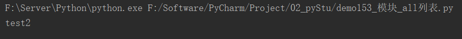

# Python基础（续1）

## 24.类和对象

### 24.1 类

类似一系类具有相同**特征**和**行为**的事物的统称，是一个抽象概念，不是真实存在的事物。

* 特征即是属性
* 行为即是方法

==类是用来创建对象的==

### 24.2 对象

对象是类创建出来的真实存在的事物

> 注意：开发中，先有类，再有对象。

### 24.3 面向对象实现方法

#### 24.3.1 定义类

Python中类分为： **经典类**和**新式类**

语法：

```python
class 类名(要继承类的类名):
    代码
    ...
```

> 注意：类名要满足标识符命名规则，同时遵循**大驼峰命名习惯**。


#### 24.3.2 创建对象

对象又叫实例

语法：

```python
对象名 = 类名()
```

#### 24.3.3 快速体验

```python
# 需求：洗衣机，功能：洗衣服
# 1.定义洗衣机
"""
class 类名():
    代码
    ...
"""


class Washer():
    def wash(self):
        print("开始洗衣服了！！！")

# 2.创建对象
haier = Washer()

# 3.验证对象是否创建成功
print(haier)  # 打印haier对象

# 调用方法
haier.wash()
```

运行结果：


### 24.4 self

`self`指的是调用该函数的对象

```python
# 创建洗衣机类，功能洗衣服
class Washer():
    def wash(self):
        print("开始洗衣服啦。。。")
        print(self)


haier = Washer()
haier.wash()
print(haier)
```

运行结果：


### 24.4 创建多个对象

快速体验：

```python
# 创建洗衣机类
class Washer():
    def wash(self, name):
        print(f"{name}开始洗衣服了")
        print(f"{name} self : {self}")


haier = Washer()
haier.wash(name="海尔")
gree = Washer()
gree.wash("格力")
```

运行结果：


### 24.5 添加和获取对象属性

#### 24.5.1 类外添加对象属性

语法：

```python
对象名.属性名 = 值
```

快速体验：

```python
class Washer():
    def wash(self):
    	print("洗衣机")
        
# 创建洗衣机对象        
haier = Washer()
# 类外该对象赋值
haier.money = 3000.0
haier.color = "black"
```

#### 24.5.2 类外获取对象属性

语法：

```python
对象名.属性名
```

快速体验：

```python
class Washer():
    def wash(self):
        print("洗衣机")


# 创建洗衣机对象
haier = Washer()

# 类外该对象赋值
haier.money = 3000.0
haier.color = "black"

# 类外获取对象属性
print(f"洗衣机的颜色是：{haier.color}")
print(f"洗衣机的价格是：{haier.money}￥")
```

运行结果：


#### 24.5.3 类里面获取对象属性

语法：

```python
self.属性名
```

快速体验：

```python
class Washer():
    def wash(self):
        print("洗衣机")
        print(f"洗衣机的颜色是：{self.color}")
        print(f"洗衣机的价格是：{self.money}")


# 创建洗衣机对象
haier = Washer()

# 类外该对象赋值
haier.money = 3000.0
haier.color = "black"

# 调用对象方法
haier.wash()
```

运行结果：


## 25.魔法方法

在python中`_xx_()`的函数叫做魔法方法，指的是具有特殊功能的函数

### 25.1 `__init__()`

> 作用：初始化对象
>
> 注意：
>
> * `__init__()`方法，在创建对象时默认调用，不用手动调用
> * `__init__(self)`中的self参数，不需要开发者传递，python解释器会自动把当前的对象引用传递过去

快速体验：

```python
class Washer():
    # 初始化方法init
    def __init__(self):  # 注意：双下划线
        self.money = 3000.0
        self.color = "black"

    def wash(self):
        print("洗衣机")
        print(f"洗衣机的颜色是：{self.color}")
        print(f"洗衣机的价格是：{self.money}")


# 创建洗衣机对象
haier = Washer()

# 调用对象方法
haier.wash()
```

运行结果：


#### 25.1.1 带参数的`__init()__`

快速体验：

```python
class Washer():
    # 初始化方法init
    def __init__(self, name, money, color):  # 注意：双下划线
        self.name = name
        self.money = money
        self.color = color

    def wash(self):
        print(f"{self.name}洗衣机")
        print(f"洗衣机的颜色是：{self.color}")
        print(f"洗衣机的价格是：{self.money}")


# 创建洗衣机对象
haier = Washer("haier", 2800.0, "黑色")
geek = Washer("格力", 2500, "灰色")

# 调用对象方法
haier.wash()
geek.wash()
```

运行结果：


### 25.2 `__str__()`

> 当使用print输出对象时，默认打印对象的内存地址。如果类定义了`__str__()`方法，那么就会打印这个方法中return的数据

快速体验：

```python
class Washer():
    # 初始化方法init
    def __init__(self, name, money, color):  # 注意：双下划线
        self.name = name
        self.money = money
        self.color = color

    # 解释说明类方法str
    def __str__(self):  # 使用return返回解释说明信息
        return """className Washer()
        作用：售卖洗衣机
        """

    def wash(self):
        print(f"{self.name}洗衣机")
        print(f"洗衣机的颜色是：{self.color}")
        print(f"洗衣机的价格是：{self.money}")


# 创建洗衣机对象
haier = Washer("haier", 2800.0, "黑色")
# 打印对象
print(haier)
```

运行结果：


### 25.3 `__del__()`

> 当删除对象时，python解释器会默认调用`__del__()`方法

快速体验：

```python
class Washer():
    # 初始化方法init
    def __init__(self, name, money, color):  # 注意：双下划线
        self.name = name
        self.money = money
        self.color = color

    # 解释说明类方法str
    def __str__(self):  # 使用return返回解释说明信息
        return """className Washer()
        作用：售卖洗衣机
        """

    # 方法结束调用的方法del
    def __del__(self):
        print(f"{self.name}的购买结束")


    def wash(self):
        print(f"{self.name}洗衣机")
        print(f"洗衣机的颜色是：{self.color}")
        print(f"洗衣机的价格是：{self.money}")


# 创建洗衣机对象
haier = Washer("haier", 2800.0, "黑色")

# 调用方法
haier.wash()
```

运行结果：


### 25.4 综合案例

```python
"""
烤地瓜：
    1.烤的时间
        0-3 没熟
        4-5 半熟
        5-7 全熟
        8分钟以上： 烤糊了
使用的方法：
    __str__() : 查看烤烤地瓜的状态
    __init__() : 初始化方法
    roast() : 烤
    addSeasoning() : 添加调料
"""


class SweetPotatoes():
    def __str__(self):
        return f"这个地瓜考了{self.time},状态：{self.state},添加了调料{self.seasoningList}"

    def __init__(self):
        # 烧烤时间
        self.time = 0
        # 地瓜状态
        self.state = "没熟"
        # 调料列表
        self.seasoningList = []

    def roast(self, time):
        self.time += time
        if self.time <= 3:
            self.state = "没熟"
        elif 4 <= self.time <= 5:
            self.state = "半熟"
        elif 6 <= self.time <= 7:
            self.state = "全熟"
        elif self.time >= 8:
            self.state = "烤糊了"

    def addSeasoning(self, seasoning):
        self.seasoningList.append(seasoning)


# 测试方法
# 创建烤地瓜对象
SweetPotatoes = SweetPotatoes()

# 烤两分钟
SweetPotatoes.roast(2)
# 查看状态
print(SweetPotatoes)

# 再烤两分钟
SweetPotatoes.roast(2)
# 添加佐料
SweetPotatoes.addSeasoning("胡椒粉")
# 查看状态
print(SweetPotatoes)

# 再烤两分钟
SweetPotatoes.roast(2)
# 添加佐料
SweetPotatoes.addSeasoning("辣椒粉")
# 查看状态
print(SweetPotatoes)

# 再烤三分钟
SweetPotatoes.roast(3)
# 查看状态
print(SweetPotatoes)
```

运行结果：


## 26.继承

### 26.1 拓展1： 经典类 和 新式类

> 不由任意内置类派生出的类，称之为**经典类**

```python
class 类名:
    代码
    ...
```

> **新式类**

```python
class 类名(object):
    代码
    ...
```

### 26.2 体验继承

> python面向对象的继承指的是多个类之间的所属关系，即子类默认继承父类的所有属性和方法

```python
# 父类A
class A():
    def __init__(self):
        self.name = "A"

    def info(self):
        print(f"{self.name}")


# 子类B
class B(A):
    pass  # 设置b类为空


# 创建B类实例化对象
result = B()
# 通过B类调用父类方法
result.info()
```

运行结果：


### 26.3 单继承

> 故事主线：一个做煎饼果子的师傅拥有高超的煎饼果子古法制作手艺，现在师傅退休，将手艺全部传给徒弟

代码实现：

```python
# 父类：师傅
class Master(object):
    def __init__(self):
        self.kongfu = "[古法秘制煎饼果子]"

    def make(self):
        print(f"使用{self.kongfu}制作煎饼果子")


# 子类：徒弟
class Prentice(Master):
    pass


# 使用徒弟类创建对象，调用父类方法
daqiu = Prentice()
daqiu.make()
```

运行结果：


### 26.4 多继承

> 故事主线：lyx非常有做煎饼果子的天赋，于是去学校学习了煎饼果子的制作方法，然后一位古法制作煎饼果子的师傅将自己的技术也传授给了他
>
> ==注意：多继承出现同名方法和属性时，默认使用第一父类的同名方法和属性==

代码实现：

```python
# 父类：师傅
class Master(object):
    def __init__(self):
        self.kongfu = "[古法秘制煎饼果子]"

    def make(self):
        print(f"使用{self.kongfu}制作煎饼果子")


class School(object):
    def __init__(self):
        self.kongfu = "[学校秘制煎饼果子]"

    def make(self):
        print(f"使用{self.kongfu}制作煎饼果子")

    def school_make(self):
        print("学校其他知识")


# 子类：徒弟
class Prentice(School, Master):  # 默认继承第一个父类的同名属性和方法
    pass


# 使用徒弟类创建对象，调用父类方法
daqiu = Prentice()
daqiu.make()
daqiu.school_make()
```

运行结果：


### 26.5 子类重写父类同名方法和属性

> 故事主线：lyx非常有做煎饼果子的天赋，于是去学校学习了煎饼果子的制作方法，然后一位古法制作煎饼果子的师傅将自己的技术也传授给了他。经过对两种方法的优化，研究出新的方法
>
> ==注意：如果子类和父类用于同名的方法和属性，默认使用子类的方法和属性==

代码实现：

```python
# 父类：师傅
class Master(object):
    def __init__(self):
        self.kongfu = "[古法秘制煎饼果子]"

    def make(self):
        print(f"使用{self.kongfu}制作煎饼果子")


class School(object):
    def __init__(self):
        self.kongfu = "[学校秘制煎饼果子]"

    def make(self):
        print(f"使用{self.kongfu}制作煎饼果子")


# 子类：徒弟
class Prentice(School, Master):  # 默认继承第一个父类的同名属性和方法
    def __init__(self):
        self.kongfu = "[自己秘制煎饼果子]"

    def make(self):
        print(f"使用{self.kongfu}制作煎饼果子")


# 使用徒弟类创建对象，调用父类方法
daqiu = Prentice()
daqiu.make()
```

运行结果：


### 26.6 拓展2：mro顺序

> 查看当前类父类的继承关系

```python
# 父类：师傅
class Master(object):
    def __init__(self):
        self.kongfu = "[古法秘制煎饼果子]"

    def make(self):
        print(f"使用{self.kongfu}制作煎饼果子")


class School(object):
    def __init__(self):
        self.kongfu = "[学校秘制煎饼果子]"

    def make(self):
        print(f"使用{self.kongfu}制作煎饼果子")


# 子类：徒弟
class Prentice(School, Master):  # 默认继承第一个父类的同名属性和方法
    def __init__(self):
        self.kongfu = "[自己秘制煎饼果子]"

    def make(self):
        print(f"使用{self.kongfu}制作煎饼果子")


# 使用徒弟类创建对象，调用父类方法
daqiu = Prentice()
daqiu.make()

# 查看父类继承关系
print(Prentice.__mro__)
print(Master.__mro__)
print(School.__mro__)
```

运行结果：


### 26.7 调用父类的重名方法和属性

> 注意：
>
> * 如果先调用父类重名的属性和方法，子类的的属性和方法会被覆盖掉。
> * 如果先调用子类重名的属性和方法，父类的的属性和方法会被覆盖掉。

快速体验：

```python
# 父类：师傅
class Master(object):
    def __init__(self):
        self.kongfu = "[古法秘制煎饼果子]"

    def make(self):
        print(f"使用{self.kongfu}制作煎饼果子")


class School(object):
    def __init__(self):
        self.kongfu = "[学校秘制煎饼果子]"

    def make(self):
        print(f"使用{self.kongfu}制作煎饼果子")


# 子类：徒弟
class Prentice(School, Master):  # 默认继承第一个父类的同名属性和方法
    def __init__(self):
        self.kongfu = "[自己秘制煎饼果子]"

    def make(self):
        print(f"使用{self.kongfu}制作煎饼果子")

        # 不初始化父类，调用父类重名方法
        # 由于父类和子类有重名的init方法，默认调用子类的init方法
        print("*"*20)
        Master.make(self)
        School.make(self)

        # 初始化父类
        print("*" * 20)
        Master.__init__(self)
        Master.make(self)
        School.__init__(self)
        School.make(self)

        # 由于调用了父类的init方法，子类方法被覆盖
        print("*" * 20)
        print(f"使用{self.kongfu}制作煎饼果子")
        # 重新使用子类初始化方法init
        self.__init__()
        print(f"使用{self.kongfu}制作煎饼果子")


# 使用徒弟类创建对象，调用父类方法
daqiu = Prentice()
daqiu.make()
```

运行结果：


### 26.8 多层继承

> 大于两层的继承关系

```python
# 父类：师傅
class Master(object):
    def __init__(self):
        self.kongfu = "[古法秘制煎饼果子]"

    def make(self):
        print(f"使用{self.kongfu}制作煎饼果子")


class School(object):
    def __init__(self):
        self.kongfu = "[学校秘制煎饼果子]"

    def make(self):
        print(f"使用{self.kongfu}制作煎饼果子")


# 子类：徒弟
class Prentice(School, Master):  # 默认继承第一个父类的同名属性和方法
    def __init__(self):
        self.kongfu = "[自己秘制煎饼果子]"

    def make(self):
        self.__init__()
        print(f"使用{self.kongfu}制作煎饼果子")

    def Master_make(self):
        Master.__init__(self)
        Master.make(self)

    def School_make(self):
        School.__init__(self)
        School.make(self)


# 徒孙类
class Tusun(Prentice):
    pass

# 创建徒孙实例
tusun = Tusun()
# 调用父类方法
tusun.make()
# 调用祖父方法
tusun.Master_make()
tusun.School_make()
```

运行结果：


### 26.9 super()调用父类方法

> 使用`__mro__`顺序调用父类重名的方法和属性，适合单继承

快速体验:

```python
# 父类：师傅
class Master(object):
    def __init__(self):
        self.kongfu = "[古法秘制煎饼果子]"

    def make(self):
        print(f"使用{self.kongfu}制作煎饼果子")


class School(object):
    def __init__(self):
        self.kongfu = "[学校秘制煎饼果子]"

    def make(self):
        print(f"使用{self.kongfu}制作煎饼果子")


# 子类：徒弟
class Prentice(Master, School):
    def __init__(self):
        self.kongfu = "[自己秘制煎饼果子]"

    def make(self):
        print(f"使用{self.kongfu}制作煎饼果子")

        # 方法1：代码冗余，当父类改名，子类也要改名
        # print("*" * 20)
        # Master.__init__(self)
        # Master.make(self)
        # School.__init__(self)
        # School.make(self)
        print(Prentice.__mro__)
        # 方法2：使用super方法
        # super(Prentice, self).__init__()
        # super(Prentice, self).make()  # 调用使用的是__mro__顺序，适合单继承使用

        # 方法2简写
        super().__init__()
        super().make()


# 使用徒弟类创建对象，调用父类方法
daqiu = Prentice()
daqiu.make()
```

运行结果：


### 26.10 私有权限

#### 26.10.1 定义私有属性和方法

在Python中，可以为实例属性和方法设置是有权限，即设置某个实例属性或实例方法不可以集成子类

> 故事主线：大师把自己的煎饼果子计算传给了徒弟，但是没有把自己的2000亿财产给徒弟继承，这个时候钱就是私有的权限

**设置私有权限的方法：在属性名和方法前面加两个下划线__**

```python
# 故事主线：大师把自己的煎饼果子计算传给了徒弟，但是没有把自己的2000亿财产给徒弟继承，这个时候钱就是私有的权限
# 父类：师傅
class Master(object):
    def __init__(self):
        self.kongfu = "[煎饼果子独门秘籍]"
        self.__money = 2000  # 将money设置为私有属性

    def make(self):
        print(f"使用{self.kongfu}制作煎饼果子！")

    def __spend_money(self):  # 将_spend_money设置成私有方法
        print(f"最多可以使用{self.__money}亿元")


# 子类：徒弟
class Student(Master):
    pass


# 实例化徒弟类
stu = Student()
stu.make()
# stu.spend_money()  # 由于该方法设置为私有，子类无法继承，报错 AttributeError: 'Student' object has no attribute 'spend_money'
# stu.__money  # 由于该属性设置为私有，子类无法继承，报错  AttributeError: 'Student' object has no attribute '__money'
```

运行结果：


#### 26.10.2 获取和修改私有属性的值

> 在Python中，一般定义函数名`get_xx`用来获取私有的属性，定义`set_xx`来修改私有属性

```python
# 故事主线：大师把自己的煎饼果子计算传给了徒弟，但是没有把自己的2000亿财产给徒弟继承，徒弟偷偷拿了一部分
# 父类：师傅
class Master(object):
    def __init__(self):
        self.kongfu = "[煎饼果子独门秘籍]"
        self.__money = 2000  # 将money设置为私有属性

    def make(self):
        print(f"使用{self.kongfu}制作煎饼果子！")

    def __spend_money(self):  # 将_spend_money设置成私有方法
        print(f"师傅有{self.__money}亿元")

    # 获取私有属性money
    def get_money(self):
        return self.__money

    # 修改私有属性
    def set_money(self, money):
        self.__money -= money


# 子类：徒弟
class Student(Master):
    pass


# 实例化徒弟类
stu = Student()
stu.make()
# 查看师傅私有属性
print(stu.get_money())
# 修改师傅私有属性
stu.set_money(50)
# 查看师傅私有属性
print(stu.get_money())
```

运行结果：


## 27.多态

### 27.1 了解多态

> 多态指的是一类事物有多种形态，（一个抽象类有多个子类，因而多态的概念依赖于继承）
>
> * 定义：多态是一种使用对象的方式，子类重写父类方法，调用不同子类对象的相同父类方法，可以产生不同的执行结果
> * 好处：调用灵活，有了解多态，跟容易编写出通用的代码，做出通用的编程，以适应需求的不断变化
> * 实现步骤：
>   * 定义父类，并提供公共方法
>   * 定义子类，并重写父类方法
>   * 传递子类对象给调用者，可以看到不同子类执行效果不同

### 27.2 体验多态

```python
"""
实现多态的步骤：
1. 定义父类，并提供公共方法
2. 定义子类，并重写父类方法
3. 传递子类对象给调用者，可以看到不同子类执行效果不同
"""


# 目标：不同的犬有不同的工作
# 父类：普通犬
class Dog(object):
    def work(self):
        print("汪汪汪~~~")


# 子类：警犬
class ArmyDog(Dog):
    def work(self):
        print("追击坏人")


# 子类：缉毒犬
class DrugDog(Dog):
    def work(self):
        print("追查毒品")


# 调用者
class Person(object):
    def work_for_dog(self, dog):
        dog.work()


# 创建工作犬的对象
ad = ArmyDog()
dd = DrugDog()
# 创建调用者对象
person = Person()
# 将对象传给调用者
person.work_for_dog(ad)
person.work_for_dog(dd)
```

运行结果：


## 28.类属性和实例属性

### 28.1 类属性

#### 28.1.1 设置和访问类属性

> * 类属性就是**类对象**所拥有的属性，它被该类的所有实例对象所共有
> * 类属性可以使用**类**或**实例对象**访问

```python
class Dog(object):
    tooth = 10  # 定义类属性


# 访问类属性
# 1.通过类来访问
print(Dog.tooth)

# 2.通过对象访问
d = Dog()
print(d.tooth)
```

运行结果：


#### 28.1.2 修改类属性

> 类属性只能通过类对象来修改，不能通过实例对象修改，如果通过实例对象来修改，则表示创建了一个同名的实例属性

```python
class Dog(object):
    tooth = 10  # 定义类属性


# 修改类属性
d1 = Dog()
d2 = Dog()
# 1.通过类对象来修改类属性
Dog.tooth = 12
# 查看类属性
print(Dog.tooth)
print(d1.tooth)
print(d2.tooth)

# 2.通过实例对象修改类属性
d1.tooth = 100  # 相当于只修改了d1实例里的tooth属性，并没有修改类属性
# 查看类属性
print(Dog.tooth)
print(d1.tooth)
print(d2.tooth)
```

运行结果：


## 29 类方法和静态方法

### 29.1 类方法

> 特点：
>
> 需要使用装饰器`@classmethod`来表示其为类方法，用于类方法，**第一个参数必须是类对象**，一般以`cls`作为第一个参数

类方法的使用场景：

* 当方法中**需要使用类对象**(如访问**私有类属性**等)时，定义类方法
* 类方法中一般和**类属性**配合使用

```python
class Dog(object):
    __tooth = 10  # 定义私有类属性

    @classmethod
    def get_tooth(cls):  # 定义类方法
        return cls.__tooth


d = Dog()
print(d.get_tooth())
```

运行结果：


### 29.2 静态方法

> 特点：
>
> * 需要通过修饰器`@staticmethod`来进行修饰，**静态方法既不需要传递类对象也不需要传递实例对象（没有self / cls)**
> * 静态方法可以通过**实例对象**和**类对象**去访问

静态方法使用场景：

* 当方法中**既不需要使用实例对象**（如实例对象，实例属性），**也不需要使用类对象**（如类属性，类方法，创建实例）时，定义静态方法
* **取消不需要的参数传递**，有利于**减少不必要的内存占用和性能消耗**

```python
class Dog(object):
    @staticmethod
    def info_print():  # 创建静态方法
        print("这是一个静态方法")


# 使用实例对象调用静态方法
d = Dog()
d.info_print()
# 使用类对象调用静态方法
Dog.info_print()
```

运行结果：


### 29.3 闭包

> * 函数内的属性，都是有生命周期的，都是在函数执行期间
> * 内部函数对外部函数**作用域**里**变量**的引用
> * 闭包内的闭包函数私有化了变量，完成了数据的封装，类似于面向对象

快速体验：

```python
# 闭包函数
lst = [i for i in range(5)]


def func(obj):
    print('func : ', obj)

    def func1():
        obj[0] += 1
        print('func1 : ', obj)

    return func1  # 不能带小括号，否则相当于自己运行函数，外部函数就无法引用到内部函数


var = func(lst)
var()
var()
var()
```

运行结果：


### 29.4 装饰器

> 装饰器：语法糖@
>
> * 在不影响函数功能的情况下，添加新的功能

快速体验：

```python
# 装饰器
import time


# 显示程序运行时间
def timer(func):
    print("timer")

    def warpper():
        print("warpper")
        start = time.time()
        func()
        end = time.time()
        print("程序运行耗时：", end - start, "秒")

    return warpper


@timer
def login():
    for i in range(100000000):
        pass

# 相当于执行程序timer(login)()
login()
```

运行结果：


> 总结： 在装饰器内函数中调用原函数

**带参数装饰器**

快速体验：

```python
"""
*args 会将单个参数合成元组
**kwargs 会将键值对参数组合成字典
"""


def outer(f):
    def inner(*args, **kwargs):
        print(args)
        print(kwargs)
        f()

    return inner


@outer
def func():
    print("func")


func(10, 20, name="zs")
```

运行结果：


> 总结：在装饰器内函数参数列表中添加原函数参数

**返回值**

快速体验：

```python
def func1(func):
    print("func1")

    def func2():
        print("func2")
        result = func()
        return result
    return func2


@func1
def func():
    print("func")
    return "hello python"


var = func()
print(var)
```

运行结果：


**总结案例：**

```python
import time


def display_time(func):
    def wrapper(*args, **kwargs):
        start = time.time()
        result = func(*args, **kwargs)
        end = time.time()
        print("总耗时：", end - start)
        return result
    return wrapper


def is_prime(num):
    if num < 2:
        return False
    elif num == 2:
        return True
    else:
        for i in range(2, num):
            if num % i == 0:
                return False
        return True


@display_time
def prim_nums(num):
    lst = []
    for i in range(num):
        if is_prime(i):
            lst.append(i)
    return lst


result = prim_nums(1000)
print(f"count:{len(result)}, lst = {result}")
```

运行结果：


## 30.异常

> 当检测到一个错误时，解释器就无法继续执行了，反而出现了一些错误的提示，这就是“异常”

例如：用`r`打开一个不存在的文件

```python
open('test,txt', 'r')
```


### 30.1 捕获指定异常

语法：

```python
try:
    可能发生错误的代码
except 异常类型:
    如果捕获到该异常执行的代码
```

快速体验：

```python
try:
    print(num)
except NameError:
    print("名字错误")
```

运行结果：


> 注意：
>
> * 捕获的异常要和执行代码的异常一致，否则无法捕获
> * 一般`try`下面只放一行尝试执行的代码

#### 30.1.1 捕获多个指定异常

> 当捕获多个异常时，可以把要捕获的异常类型的名字，放到`except`后，并使用元组的方式进行书写。

快速体验：

```python
try:
    # print(num)
    print(1/0)
except (NameError, ZeroDivisionError):
    print("出现错误")
```

运行结果：


#### 30.1.2 捕获异常描述信息

快速体验：

```python
try:
    print(1/0)
except (NameError, ZeroDivisionError) as result:
    print(f"出现错误: {result}")
```

运行结果：


 #### 30.1.3 捕获所有异常

> `Exception`是所有程序异常类的父类

快速体验：

```python
try:
    print(1/0)
except Exception as result:
    print(f"出现错误: {result}")
```

运行结果：


#### 30.1.4 异常的else

> `else`：是程序没有出现异常会执行的代码

快速体验：

```python
try:
    print("无异常")
except Exception as result:
    print(f"出现错误: {result}")
else:
    print("没有异常执行的代码！")
```

运行结果：


#### 30.1.5 异常的finally

> `finally`：是程序无论是否出现错误都会执行的代码

快速体验：

```python
try:
    print(1/0)
except Exception as result:
    print(f"出现错误: {result}")
else:
    print("没有异常执行的代码！")
finally:
    print("无论程序是否错误都会执行")
```

运行结果：


### 30.2 异常传递

> 需求：
>
> 1. 尝试以只读方式代开test.txt文件，如果文件存在则读取文件内容，如果文件不存在提示用户即可。
> 2. 读取内容要求：尝试循环读取内容，读取过程中如果检测到用户意外终止程序，则`except`捕获异常并提示用户

快速体验：

```python
import time
try:
    file = open("test.txt")  # 以只读的模式打开文件，如果没有找到出现提示
    try:
        # 循环读取文件内容
        flag = 3  # 用于模拟出现错误
        while True:
            con = file.readline()
            if len(con) == 0:
                break
            time.sleep(2)
            flag -= 1
            if flag == 0:  # 模拟出现错误
                i = 1 / 0
            print(con)
    except:
        print("文件读取出现错误！")
except:
    print("文件没找到！")
```

运行结果：


### 30.3 自定义异常类

> 在python中，抛出自定义异常的语法为`raise异常类对象`

需求：密码长度不足，则报异常（用户输入密码，如果输入的长度不足3位，则报错，即抛出自定义异常，并捕获该异常）

```python
# 创建异常类，继承Exception类
class MyInputError(Exception):
    # 初始化自定义异常类
    def __init__(self, length, min_length):
        self.length = length
        self.min_length = min_length
    
    # 设置异常描述信息
    def __str__(self):
        return f"您输入的密码长度{self.length}位不够最小长度{self.min_length}位"


def main():
    # 抛出异常
    try:
        pwd = input("请输入密码：")
        if len(pwd) < 6:
            # 抛出异常类对象
            raise MyInputError(len(pwd), 6)
    # 捕获异常
    except Exception as result:
        print(result)
    else:
        print("密码输入正确！")


# 执行main方法
main()
```

运行结果：


## 31.模块

> python模块(Module)，是一个python文件，以.py结尾，包含了python对象定义和python语句。
>
> 模块能定义函数，类和变量，模块里也能包含可执行的代码。

### 31.1 导入模块

> 导入模块的方式：
>
> * import 模块名
> * from 模块名 import 功能名
> * from 模块名 import*
> * import 模块名 as 别名
> * from 模块名 import 功能名 as 别名

#### 31.1.1import

语法：

```python
# 导入模块
import 模块名
import 模块名1,模块名2...  # 不推荐使用

# 调用功能
模块名.功能名()
```

快速体验：

```python
# 导入模块
import math
# 调用功能
print(math.sqrt(9))
```

运行结果：


#### 31.1.2 from...import...

语法：

```python
# 导入模块
from 模块名 import 功能1，功能2...
# 调用功能
功能名()
```

快速体验：

```python
# 导入模块
from math import sqrt
# 调用功能
print(sqrt(9))
```

运行结果：


#### 31.1.3 from...import*

语法：

```python
# 导入模块
form 模块名 import*
# 调用功能
功能名()
```

快速体验：

```python
# 导入模块
from math import *
# 调用功能
print(sqrt(9))
```

运行结果：


#### 31.1.4 定义别名

语法：

```python
# 模块定义别名
import 模块名 as 别名

# 功能定义别名
from 模块名 import 功能名 as 别名
```

快速体验：

```python
# 模块定义别名
import math as ma

# 功能定义别名
from math import sqrt as sq

# 调用功能
print(ma.sqrt(9))
print(sq(9))
```

运行结果：


### 31.2 制作模块

>  在python中，每个python文件都可以作为一个模块，模块名就是文件的名字。也就是说自定义**模块名必须要符合标识符命名规则**。

#### 31.2.1 定义模块

> 新建python文件，命名为`my_module1.py`，并定义`test1`函数

```python
def test1(a, b):
    return a + b
```

#### 31.2.2 测试模块

> 在实际开发中，当一个开发人员编写完一个模块后，为了让模块能够在项目中达到想要的效果，开发人员会在py文件中添加一些测试信息，例如，在`my_module1.py`文件中添加测试代码

模块：

```python
def test1(a, b):
    return a + b


# 测试模块
if __name__ == "__main__":  # __name__只有在当前文件下运行结果才是__main__，否则是python文件名，既只有在当前文件下才运行测试模块代码
    print(f"test(1, 2) = {test1(1,2)}")】
```

调用模块：

```python
# 引入自定义模块
import my_module1
# 调用方法
print(my_module1.test1(3, 6))
```

运行结果：


### 31.3 模块定位顺序

> 当导入一个模块，python解析器对模块位置的搜索顺序是：
>
> 1. 当前目录
> 2. 如果不在当前目录，python则搜索在shell变量PYTHONPATH下的每个目录
> 3. 如果都找不到，python会查看默认路径，UNIX下，默认路径为/usr/local/lib/python/ 模块搜索路径存储在system模块的sys.path变量中。变量包含当前目录，PYTHONPATH和安装过程决定默认路径
>
> 注意：
>
> * 自己的文件名不要和已有模块名重复，否则导致该模块功能无法使用
> * 使用`from 模块名 import 功能`的时候，如果功能名字重复，调用的是最后定义或导入功能。

快速体验：

```python
def sleep():
    print("这是自定义的函数")


from time import sleep  # 后导入sleep会覆盖掉原先定义的sleep
sleep(1)
```

### 31.4 all列表

> 如果一个模块中有`__all__`变量，当使用`from xxx import*`导入时，只能导入这个列表中的元素。

my_module2模块代码

```python
__all__ = ['test1']


def test1():
    print("test1")


def test2():
    print("test2")
```

调用方法：

```python
from my_module2 import *

test1()
# test2()  # test2未在all列表中，报错 NameError: name 'test2' is not defined
```

运行结果：



## 32.包

> 包将有联系的模块组织在一起，即放在同一个文件夹下，并在这个文件夹创建一个名字为`__init__.py`文件，那么这个文件夹就称之为包。

### 32.1 制作包

[New]—[Python Package]—输入包名—[ok]—新建功能模块(有联系的模块)

注意：新建包后，包内会自动创建`__init__.py`文件，这个文件控制着包的导入行为


快速体验：

1. 新建包mypackage
2. 新建模块：my_module1 和  my_module2
3. 模块内代码如下

```python
# module
print(1)


def info_print1():
    print("module1")
```

```python
# module2
print(2)


def info_print1():
    print("module2")
```

### 32.2 导入包

#### 32.2.1 方法一

语法：

```python
# 导包
import 包名.模块名


# 调用功能
包名.模块名.目标
```

快速体验：

```python
# 导包
import mypackage.my_module1

# 调用
mypackage.my_module1.info_print1()
```

运行结果：


#### 32.2.2 方法二

> ==注意：必须在`__init__.py`文件中添加`__all__=[]`，控制运行导入的模块列表==

语法：

```python
# 导包
from 包名 import *
# 调用
模块名.目标
```

快速体验：

```python
# __init__.py
__all__ = ['my_module1']
```

导包文件：

```python
# 导包
from mypackage import *

# 调用
my_module1.info_print1()
```

运行结果：


