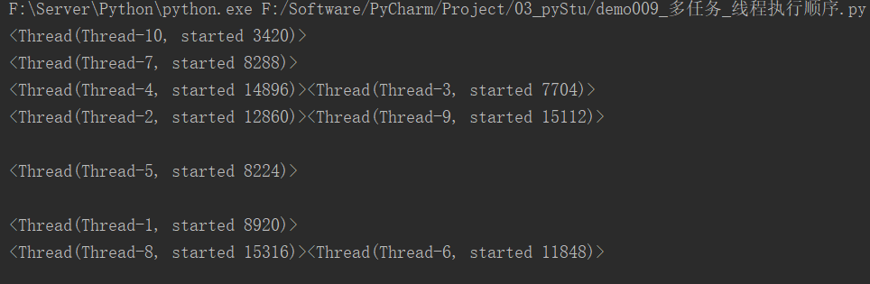
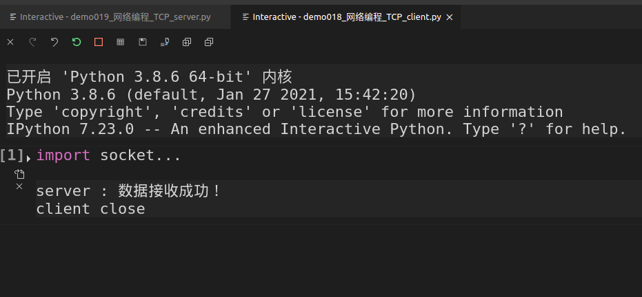
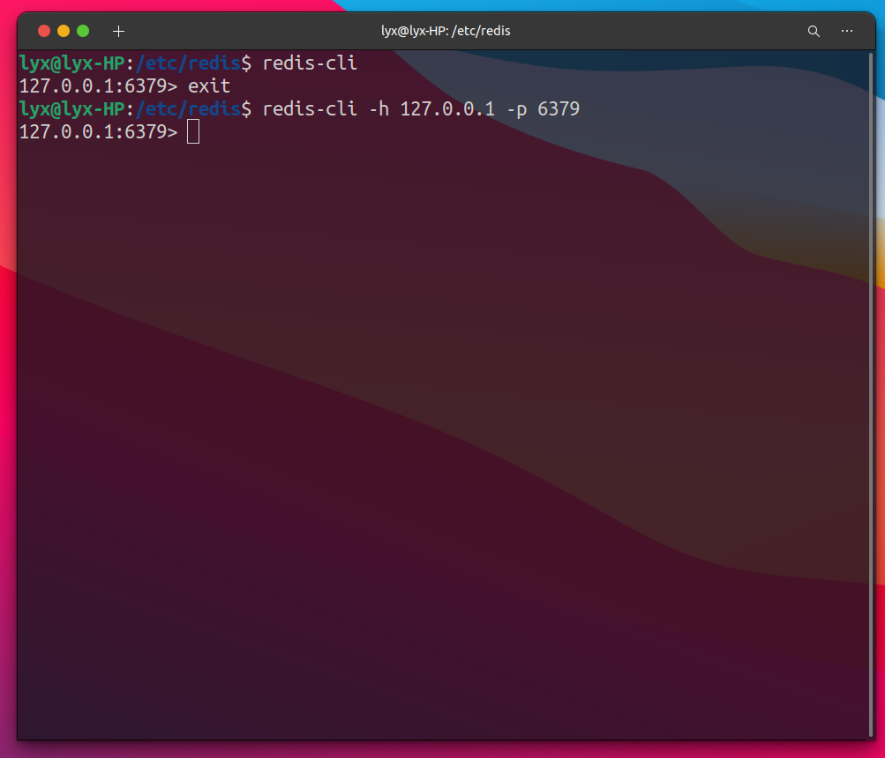
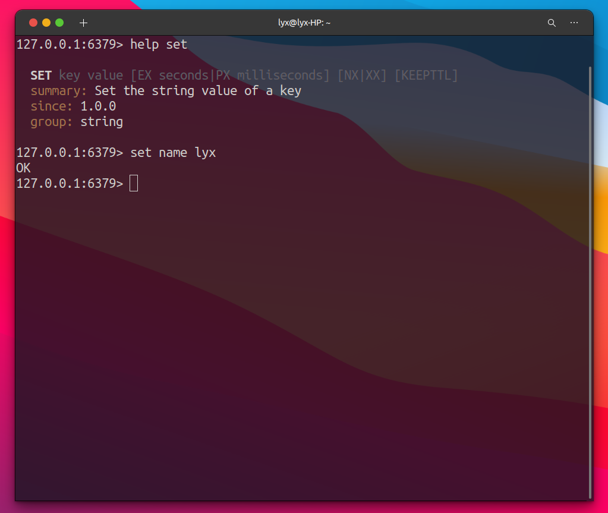

# 	Python高级

## 1. 多任务

> 多任务指的是在**同一时间**内执行**多个任务**。

### 1.1 多任务执行方式

> * 并发
> * 并行

#### 1.1.1 并发

> 在一段时间内**交替**去执行任务。

**例如：**

单核cpu处理多任务，操作系统轮流让各个软件交替去执行，例如让软件1执行0.001秒，切换到软件2，软件2执行0.001秒切换到软件3...这样反复执行下去。表面看每个软件都是交替执行，实际由于cpu的执行速度太快了，让我们感觉像是同时在执行一样，这里需要注意的是**单核cpu是并发执行多任务的**。

#### 1.1.2 并行

> 对应多核cpu处理多任务，操作系统会给cpu的每个内核安排一个执行的软件，**多个内核是正真一起执行软件的**。这里需要注意的是**多核cpu是并行执行多任务的，始终有多个软件一起执行**。

### 1.2 进程

> 在python程序中，要想实现多任务可以使用进程来完成，进程是实现多任务的一种方式。

#### 1.2.1 进程的概念

> 一个正在运行的程序或者软件就是一个进程，他是**操作系统进行资源分配的基本单位**，也就是说每启动一个进程，操作系统都会给其分配一定的运行资源（内存资源）保证正常运行。

**注意：**

==一个程序运行后至少有一个进程，一个进程默认有一个线程，进程里可以创建多个线程，线程是依附在进程里面的，没有进程就没有线程。==

#### 1.2.2 进程的作用

**单进程效果图：**


**多进程效果图：**


### 1.3 多进程的使用

#### 1.3.1 导入进程包

```python
import multiprocessing
```

#### 1.3.2 Process进程类说明

```python
Process([group,[,target[,name[,args[,kwargs]]]]])
```

* group：指定进程组，目前只能使用None
* target：执行目标任务
* name：进程名字
* args：以元组方式给执行任务传参
* kwargs：以字典方式给执行任务传参

**Process创建实例对象常用方法：**

* start()：启动子进程实体类（创建子进程）
* join()：等待子进程执行结束
* terminate()：不管任务是否完成，立即终止子进程

**Process创建实例对象的常用属性：**

​	name：当前进程的别名，默认为Process-N，N为1开始递增的整数

#### 1.3.3 快速体验

```python
# 导入进程包
import multiprocessing

import time


# 唱歌
def sing():
    for i in range(5):
        print("唱歌中...")
        time.sleep(0.5)


# 跳舞
def dance():
    for i in range(5):
        print("跳舞中...")
        time.sleep(0.5)


# 创建子进程
# 1.group：进程组目前只能None，一般不需要写
# 2.target：进程执行的目标任务
# 3.name：进程名，默认Process-1，Process-2....
# 跳舞进程
dance_process = multiprocessing.Process(target=dance)
# 唱歌进程
sing_process = multiprocessing.Process(target=sing)

# 启动子进程
if __name__ == "__main__":  # windows系统，开启子进程的操作一定要放到这下面
    # 调度进程有cpu控制，无法判断运行先后
    dance_process.start()
    sing_process.start()

# 主进程启动任务
# sing()
```

运行结果：


### 1.4 获取进程编号

> 获取进程编号的目的就是为了研究**子进程和主进程的关系**，可以得知子进程是由哪个主进程创建出来的
>
> 获取进程编号的两种操作：
>
> * **获取当前进程编号**
> * **获取父进程编号**

#### 1.4.1 获取当前进程编号

语法：

```python
import os
os.getpid() # 表示获取当前进程编号
```


#### 1.4.2 获取父进程编号

语法：

```python
import os
os.getppid() # 获取父进程编号
```

#### 1.4.3 快速体验

```python
# 导入进程包
import multiprocessing
import os
import time


# 唱歌
def sing():
    # 打印进程信息
    # 获取当前进程编号（子进程）
    sing_process_id = os.getpid()
    # 获取进程名
    sing_process_name = multiprocessing.current_process()
    # 获取父进程编号
    sing_process_parent_id = os.getppid()
    print("进程id：{}，进程名：{}，父进程id：{}".format(sing_process_id, sing_process_name, sing_process_parent_id))
    for i in range(5):
        print(f"{i}唱歌中...")
        time.sleep(0.5)
        if i == 2:
            print("kill ding_process")
            # 根据进程id强制杀死进程
            os.kill(sing_process_id, 9)


# 跳舞
def dance():
    # 打印进程信息
    # 获取当前进程编号（子进程）
    dance_process_id = os.getpid()
    # 获取进程名
    dance_process_name = multiprocessing.current_process()
    # 获取父进程编号
    dance_process_parent_id = os.getppid()
    print("进程id：{}，进程名：{}，父进程id：{}".format(dance_process_id, dance_process_name, dance_process_parent_id))
    for i in range(5):
        print(f"{i}跳舞中...")
        time.sleep(0.5)


# 创建子进程
# 1.group：进程组目前只能None，一般不需要写
# 2.target：进程执行的目标任务
# 3.name：进程名，默认Process-1，Process-2....
# 跳舞进程
dance_process = multiprocessing.Process(target=dance, name="dance_process")
# 唱歌进程
sing_process = multiprocessing.Process(target=sing, name="sing_process")

# 启动子进程
if __name__ == "__main__":  # windows系统，开启子进程的操作一定要放到这下面
    # 获取主进程信息
    # 获取进程id（主进程）
    main_process_id = os.getpid()
    # 获取进程名
    main_process_name = multiprocessing.current_process()
    print("进程id：{}，进程名：{}".format(main_process_id, main_process_name))

    # 调度进程有cpu控制，无法判断运行先后
    dance_process.start()
    sing_process.start()
```

运行结果：


### 1.5 进程执行带有参数的任务

> Process来执行任务并给任务传参有两种方式：
>
> * args： 以元组方式传参
> * kwargs：以字典方式传参

#### 1.5.1 快速体验

```python
import multiprocessing


def show_info(name, age):
    print(f"name: {name}, age：{age}")


# 以元组传参，参数列表顺序与传参的顺序相同
sub_process_1 = multiprocessing.Process(target=show_info, args=("张三", 18))
# 以字典方式传参
sub_process_2 = multiprocessing.Process(target=show_info, kwargs={"age": 20, "name": "李四"})
# 以元组和字典的方式同时传参
sub_process_3 = multiprocessing.Process(target=show_info, args=("赵六",), kwargs={"age": 22})

if __name__ == "__main__":
    sub_process_1.start()
    sub_process_2.start()
    sub_process_3.start()
```

运行结果：


### 1.6 进程的注意点

> * 进程之间不共享全局变量
>   * 创建子进程是对主进程资源的拷贝，子进程是主进程的一个副本
>   * 对于linux和mac系统，主进程执行代码不会拷贝
>   * 对于windows系统，主进程执行代码会被拷贝，相当于递归无限制创建子进程，会报错。
> * 主进程会等待所有子进程执行结束后再结束
> * 进程之间的运行是无序的

#### 1.6.1 进程之间不共享全局变量

```python
import multiprocessing
import time

# 全局变量
lst = []


# 添加数据
def add():
    name = multiprocessing.current_process().name
    for i in range(5):
        # global lst
        # list是可变数据类型
        lst.append(i)
        print(name, "第", i+1, "次添加")
        time.sleep(0.1)
    print(f"add_process读取lst：{lst}")


# 读取数据
def say():
    name = multiprocessing.current_process().name
    print(name, "读取lst : ", lst)


# 创建子进程
add_process = multiprocessing.Process(target=add, name="add_process")
say_process = multiprocessing.Process(target=say, name="say_process")

# 启动进程
if __name__ == "__main__":  # windows系统会子进程会拷贝执行代码，需要添加判断在主模块执行代码
    add_process.start()
    # 当前进程（主进程）等待添加进程执行结束后开始往下运行
    add_process.join()
    say_process.start()
    # 主进程读取lst
    name = multiprocessing.current_process().name
    print(name, "读取lst : ", lst)
```

运行结果：


#### 1.6.2 主进程会等待所有子进程执行结束在结束

```python
import multiprocessing
import time


def test():
    for i in range(10):
        print("子进程执行中...")
        time.sleep(0.1)


test_process = multiprocessing.Process(target=test)

if __name__ == "__main__":
    test_process.start()
    time.sleep(0.2)
    print("over")
```

运行结果：


### 1.7 守护进程

```python
import multiprocessing
import time


def test():
    for i in range(10):
        print("子进程执行中...")
        time.sleep(0.1)


test_process = multiprocessing.Process(target=test)

if __name__ == "__main__":
    # 将子进程设为守护线程
    test_process.daemon = True
    test_process.start()
    time.sleep(0.2)
    print("over")
```

运行结果：


### 1.8 销毁子进程

```python
import multiprocessing
import time


def test():
    for i in range(10):
        print("子进程执行中...")
        time.sleep(0.1)


test_process = multiprocessing.Process(target=test)

if __name__ == "__main__":
    test_process.start()
    time.sleep(0.2)
    # 退出主进程前，让子进程销毁
    test_process.terminate()
    print("over")
```

运行结果：


### 1.9 线程

> 在python中除了使用进程实现多任务，还可以使用线程实现多任务
>
> 线程是进程执行代码的一个分支，每个执行分子（线程）要想工作执行代码需要cpu进行调度，也就是说**线程是cpu调度的基本单位**，每个进程**至少有一个线程**，而这个线程通常是我们说的主线程。

### 1.10 线程使用

#### 1.10.1 导入线程包

```python
import threading
```

#### 1.10.2 线程类Thread参数说明

Thread([group[, target[,name[,args[,kwargs]]]]])

* group：线程组，目前只能使用None
* target：执行的目标任务
* args：以元组的方式给执行的任务传参
* kwargs：以字典的方式给执行的任务传参
* name：线程名

#### 1.10.3 启动线程

使用start方法启动线程

#### 1.10.4 快速体验

```python
# 导入线程包
import threading
import time


# 唱歌任务
def sing():
    sing_thread = threading.current_thread()
    for i in range(5):
        print(f"thread_name : {sing_thread.name} 正在跳舞...")


# 跳舞任务
def dance():
    dance_thread = threading.current_thread()
    for i in range(5):
        print(f"thread_name : {dance_thread.name} 正在唱歌...")


if __name__ == "__main__":
    # 获取当前线程
    main_thread = threading.current_thread()
    print(f"thread_name : {main_thread.name}启动")

    # 创建子线程
    sing_thread = threading.Thread(target=sing, name="sing_thread")
    dance_thread = threading.Thread(target=dance, name="dance_thread")

    # 启动子线程
    sing_thread.start()
    dance_thread.start()
```

运行结果：


### 1.11 带参数线程

> threading来执行任务并给任务传参有两种方式：
>
> * args： 以元组方式传参
> * kwargs：以字典方式传参

#### 1.11.1 快速体验

```python
import threading


# 任务
def show_info(name, age):
    print(f"name: {name}, age: {age}")


if __name__ == "__main__":
    sub_thread_1 = threading.Thread(target=show_info, args=("张三", 18))
    sub_thread_2 = threading.Thread(target=show_info, kwargs={"name": "李四", "age": 20})
    sub_thread_3 = threading.Thread(target=show_info, args=("王五",), kwargs={"age": 22})

    sub_thread_1.start()
    sub_thread_2.start()
    sub_thread_3.start()
```

运行结果：


### 1.12 线程的注意点

* 线程之间的执行是无序的
* 主线程会等待所有子线程执行结束后再结束
* 线程之间共享全局变量
* 线程之间共享全局变量会出现问题

#### 1.12.1 线程执行的顺序

> 线程之间的执行是无序的

##### 快速体验

```python
import threading
import time


def task():
    time.sleep(0.2)
    print(threading.current_thread())


if __name__ == "__main__":
    for i in range(10):
        threading.Thread(target=task).start()
```

运行结果：



#### 1.12.2 主线程等待子线程结束才结束

```python
import threading
import time


def task():
    for i in range(10):
        time.sleep(0.2)
        print(threading.current_thread(), ":执行中...")


if __name__ == "__main__":
    sub_thread = threading.Thread(target=task)
    sub_thread.start()
    print("over")

```

运行结果：


##### 1.12.2.1 守护线程

```python
import threading
import time


def task():
    for i in range(10):
        time.sleep(0.2)
        print(threading.current_thread(), ":执行中...")


if __name__ == "__main__":
    # 将线程设置为守护线程，主线程结束，守护线程结束
    sub_thread = threading.Thread(target=task, daemon=True)
    sub_thread.start()
    time.sleep(1)
    print("over")
```

运行结果：


#### 1.12.3 线程之间共享全局变量

```python
import threading
import time

lst = []

def add():
    for i in range(10):
        lst.append(i)
        print(f"lst add {i}")
        time.sleep(0.1)


def read():
    print(f"lst : {lst}")


if __name__ == "__main__":
    add_thread = threading.Thread(target=add)
    read_thread = threading.Thread(target=read)

    add_thread.start()
    # 当前（主）线程等待添加线程执行完代码继续往后执行
    add_thread.join()
    read_thread.start()
```

运行结果：


#### 1.12.4 线程之间全局变量的数据会出现错误

**需求：**

* 定义两个函数，实现循环1000000次全局变量加一

```python
import threading

num = 0


def task1():
    for i in range(1000000):
        global num
        num += 1
    print("task1 num : ", num)


def task2():
    for i in range(1000000):
        global num
        num += 1
    print("task2 num : ", num)


if __name__ == "__main__":
    task1_thread = threading.Thread(target=task1)
    task2_thread = threading.Thread(target=task2)
    task1_thread.start()
    task2_thread.start()
```

运行结果：


### 1.13 互斥锁

> 解决多线程可能带来的数据不安全情况
>
> **互斥锁**：对共享数搞进行锁定﹐保证同一时刻只能有一个线程去操作。
>
> 注意：
>
> * 互斥锁是多个线程一起去抢﹐抢到锁的线程先执行﹐没有抢到锁的线程需要等待﹐等互斥锁使用完释放后﹐其它等待的线程再去抢这个锁·

#### 1.13.1 互斥锁的使用

> `threading`模块中定义了`Lock`变量﹐这个变量本质上是一个函数﹐通过调用这个函数可以获取一把互斥锁。

**使用步骤：**

```python
#创建锁
mutex = threading.Lock()

#上锁
mutex.acquire()

'''这里编写代码能保证同一时刻只能有一个线程去操作，对共享数据进行锁定'''

#释放锁
mutex.release()

```

注意点:

* `acquire`和`release`方法之间的代码同一时刻只能有一个线程去操作
* 如果在调用`acquire`方法的时候其他线程已经使用了这个互斥锁﹐**那么此时`acquire`方法会堵塞﹐直到这个互斥锁释放后才能再次上锁。**

快速体验：

```python
import threading

num = 0

# 创建锁
lock = threading.Lock()


def task1():
    # 上锁
    lock.acquire()
    for i in range(1000000):
        global num
        num += 1
    print("task1 num : ", num)
    # 释放锁
    lock.release()


def task2():
    # 上锁
    lock.acquire()
    for i in range(1000000):
        global num
        num += 1
    print("task2 num : ", num)
    # 释放锁
    lock.release()


if __name__ == "__main__":
    task1_thread = threading.Thread(target=task1)
    task2_thread = threading.Thread(target=task2)
    task1_thread.start()
    task2_thread.start()
```

运行结果：


注意：

* 互斥锁可以保证同一时刻只有一个线程去执行代码，能够保证全局变量的数据没有问题
* 线程等待和互斥锁都是把多任务改成单任务去执行，保证了数据的准确性﹐但是执行性能会下降

### 1.14 死锁

> **死锁**：—直等待对方释放锁的情景就是新锁
>
> **死锁的结果：**
>
> * 会造成应用程序的停止响应﹐不能再处理其它任务了。

快速体验：

```python
# 模拟死锁

import threading

lock = threading.Lock()


def get_value(index):
    lock.acquire()
    lst = [i for i in range(4)]
    if index >= len(lst):
        print(f"数组下标越界了：{index}")
        return
    print(lst[index])
    lock.release()


if __name__ == "__main__":
    for i in range(10):
        get_value(i)
```

运行结果：


#### 1.14.1 解决办法

```python
import threading

lock = threading.Lock()


def get_value(index):
    lock.acquire()
    lst = [i for i in range(4)]
    if index >= len(lst):
        print(f"数组下标越界了：{index}")
        # 提前结束方法的时候要解锁
        lock.release()
        return
    print(lst[index])
    lock.release()


if __name__ == "__main__":
    for i in range(10):
        get_value(i)
```

运行结果：


## 2. 网络编程

### 2.1 IP

> IP地址就是**标识网络中设备的一个地址**﹐好比现实生活中的家庭地址。

#### 2.1.1 网络中设备效果图


#### 2.1.2 IP地址形式


说明:

* IP地址分为两类:IPv4和IPv6
* IPv4是目前使用的ip地址
* lPv6是未来使用的ip地址
* IPv4是由点分十进制组成
* lPv6是由冒号十六进制组成

#### 2.1.3 查看IP

* Linux和 mac OS使用ifconfig 这个命令

* Whndows使用ipconfig这个命令


说明：

* 192.168.1.102是设备在网络中的IP地址
* 127.0.0.1表示本机地址﹐提示∶如果和自己的电脑通信就可以使用该地址。
* 127.0.0.1该地址对应的域名是localhost，域名是ip地址的别名﹐通过域名能解析出一个对应的ip地址。

#### 2.1.4 检查网络是否可以

* 使用ping命令检查网络是否可以


说明:

* ping www.baidu.com检查是否能上公网
* ping 当前局域网的ip地址检查是否在同一个局域网内.
* ping 127.0.0.1检查本地网卡是否正常

### 2.2 端口

> 每运行一个网络程序都会有一个端口﹐想要给对应的程序发送数据﹐找到对应的端口即可。

端口效果图：


> **端口**是传输数据的通道，好比教室的门，是数据传输必经之路。那么如何准确的找到对应的端口呢?
> 其实﹐每一个端口都会有一个对应的端口号﹐好比每个教室的门都有一个门牌号﹐想要找到端口通过端口号即可。

端口号效果图：


#### 2.2.1 端口号

> * 操作系统为了统一管理这么多端口﹐就对端口进行了编号﹐这就是端口号﹐端口号其实就是一个数字﹐好比我们现实生活中的门牌号
>
> * 端口号有65536个。
>
> * 那么最终飞秋之间进行数据通信的流程是这样的﹐通过ip地址找到对应的设备﹐通过端口号找到对应的端口﹐然后通过端口把数据传输给应用程序。

通信效果图：


#### 2.2.3 端口和端口号的关系

==端口号可以唯一表示端口==

#### 2.2.4 端口号的分类

* 知名端口号
* 动态端口号

**知名端口号：**

知名端口号是指众所周知的端口，范围从0到1023 

这些端口号一般固定分配给一些服务，比如21端口分配给FTP(文件传输协议)服务，25端口分配给
SMTP(简单邮件传输协议)服务，80端口分配给HTTP服务。

**动态端口号:**

一般程序员开发应用程序使用端口号称为动态端口号，范围是从1024到65535·

如果程序员开发的程序没有设置端口号，操作系统会在动态端口号这个范围内随机生成一个给开发的
应用程序使用。

当运行一个程序默认会有一个端口号，当这个程序退出时，所占用的这个端口号就会被释放。

### 2.3 TCP

#### 2.3.1 网络应用程序之间的通信流程

之前我们学习了IP地址和端口号，通过IP地址能够找到对应的设备，然后再通过端口号找到对应的端口，再通过端口把数据传输给应用程序，这里要注意，**数据不能随便发送，在发送之前还需要选择一个对应的传输协议，保证程序之间按照指定的传输规则进行数据的通信**，而这个传输协议就是我们今天学习的TCP。

#### 2.3.2 TCP的概念

TCP的英文全拼(Transmission Control Protocol)简称**传输控制协议**，它是一种**面向连接的，可靠的，基于字节流**的传输层通信协议。
面向连接的效果图：


#### 2.3.3 TCP 通信步骤

1. 创建连接

2. 传输数据

3. 关闭连接

**说明:**

TCP通信模型相当于生活中的'打电话'，在通信开始之前，一定要先建立好连接，才能发送数据，通信结束要关闭连接。

#### 2.3.4 TCP的特点

1. 面向连接

   通信双方必须先建立好连接才能进行数据的传输，数据传输完成后，双方必须断开此连接，以释放系统资源。

2. 可靠传输

   * TCP采用发送应答机制。超时重传
   * 错误校验
   * 流量控制和阻塞管理

### 2.4 socket

#### 2.4.1 socket的概念

> socket (简称**套接字**)是**进程之间通信一个工具**，好比现实生活中的插座，所有的家用电器要想工作都是基于插座进行，**进程之间想要进行网络通信需要基于这个socket。** 

#### 2.4.2 socket效果图


#### 2.4.3 socket作用

负责进程之间的**网络数据传输**，好比数据的搬运工。

#### 2.4.4 socket使用场景

不夸张的说，只要跟网络相关的应用程序或者软件都使用到了socket。


### 2.5 TCP网络应用程序

#### 2.5.1 TCP网络应用程序开发流程的介绍

TCP网络应用程序开发分为:

* TCP客户端程序开发 
* TCP服务端程序开发

说明：

客户端程序是指运行在**用户设备上的程序**服务端程序是指运行在**服务器设备上的程序**，专门为客户端提供数据服务。

#### 2.5.2 TCP开发流程的介绍


##### 2.5.2.1 客户端步骤

1. 创建客户端套接字对象
2. 和服务端套接字建立连接
3. 发送数据
4. 接收数据
5. 关闭客户端套接字

##### 2.5.2.2 服务端步骤

1. 创建服务端端套接字对象
2. 绑定端口号
3. 设置监听
4. 等待接受客户端的连接请求
5. 接收数据
6. 发送数据
7. 关闭套接字

#### 2.5.3 客户端程序开发

##### 2.5.3.1 客户端socket类的介绍

1. 导入socket模块

   ```python
   import socket
   ```

2. 创建客户端socket对象

   ```python
   socket.socket(AddressFamily, Type)
   ```

   参数说明：

   * AddressFamily 表示IP地址类型，分为IPV4和IPV6
   * Type 表示传输协议

   方法说明

   * connect((host,port) 表示和服务端套接字建立连接，host是服务器ip地址，port是应用程序端口号。
   * send((data) 表示发送数据，data是二进制数据。
   * rec((buffersize) 表示接收数据，buffersize是每次接收数据的长度。
   
   快速体验：
   
   ```python
   import socket
   if __name__ == '__main__':
       # 1. 创建tcp客户端套接字
       # AF_INET：ipv4 ， AF_INET6：ipv6
       # SOCK_STREAM：表示使用tcp协议
       tcp_client_socket = socket.socket(socket.AF_INET, socket.SOCK_STREAM)
   
       # 2. 和服务端套接字建立连接
       tcp_client_socket.connect(("127.0.0.1", 9091))
   
       # 3. 发送数据到服务端
       send_content = "你好，我是客户端！"
       send_data = send_content.encode("utf-8")
       tcp_client_socket.send(send_data)
   
       # 4. 接收服务端的数据
       recv_data = tcp_client_socket.recv(1024)
       recv_content = recv_data.decode("utf-8") 
       print("server :", recv_content)
   
       # 5.关闭套接字
       tcp_client_socket.close()
       print("client close")
   ```
   
   

##### 2.5.3.2 服务端socket类的介绍

1. 导入socket模块

   ```python
   import socket
   ```

2. 创建客户端socket对象

   ```python
   socket.socket(AddressFamily, Type)
   ```

   参数说明：

   * AddressFamily 表示IP地址类型，分为IPV4和IPV6
   * Type 表示传输协议

   方法说明：

   * bind((host, port)) 表示绑定端口号，host是ip地址，port是端口号，ip地址一般不指定，表示本机的任何一个ip地址都可以。
   * listen(backiog) 表示设置监听，backiog表示最大等待连接的个数。
   * accept() 表示等待接收客户端的连接请求
   * send(date) 表示发送的数据，data是二进制数据
   * recv(buffersize) 表示接收数据，buffersize是每次接收数据的长度

   快速体验：

   ```python
   import socket
   
   if __name__ == '__main__':
       # 1.创建tcp服务端套接字
       # AF_INET：ipv4 ， AF_INET6：ipv6
       # SOCK_STREAM：表示使用tcp协议
       tcp_server_socket = socket.socket(socket.AF_INET, socket.SOCK_STREAM)
   
       # 2.表示绑定端口号
       # 设置端口号复用
       # SOL_SOCKET : 表示当前socket
       # SO_REUSEADDR : 表示端口复用
       # True : 表示确认复用
       tcp_server_socket.setsockopt(socket.SOL_SOCKET, socket.SO_REUSEADDR, True)
       # 第一个参数表示ip地址，一般不用指定，默认表示本机任意一个ip都可以
       # 第二个参数表示端口号
       tcp_server_socket.bind(("", 9091))
   
       # 3.设置监听
       # 128表示最大等待建立连接的个数
       tcp_server_socket.listen(128)
   
       # 4.等待接收客户的连接请求
       # 等待过程中当前线程会处于阻塞状态，直到接收到客户端的请求
       print("等待客户端连接中...")
       new_client, ip_port = tcp_server_socket.accept()
       # 代码执行到此表示客户端和服务端建立连接成功
       print("客户端连接成功，ip和端口为：", ip_port)
   
       # 5.接收客户端的数据
       recv_data = new_client.recv(1024)
       # 对二进制数据进场解码
       recv_content = recv_data.decode("utf-8")
       print("client : ", recv_content)
   
       # 6.发送数据到客户端
       send_content = "数据接收成功！"
       send_data = send_content.encode("utf-8")
       new_client.send(send_data)
   
       # 7. 关闭套接字
       new_client.close()
       tcp_server_socket.close()
       print("server close")
   ```

##### 2.5.3.3 运行结果

server：


client：



## 3. 正则表达式

> 在实际开发过程中经常会有查找符合某些复杂规则的字符串的需要，比如：邮箱，图片地址，手机号码等，这时候想匹配或者查找某些规则的字符串就可以使用正则表达式了。

### 3.1 re模块

在python中使用正则表达式，需要导入re模块

```python
# 导入re模块
import re

#使用match方法进行匹配
match_obj = re.match("正则表达式", "要匹配的字符")

# 如果上一步匹配到数据的话，可以使用group方法来提取数据
result = match.group()
```

快速体验：

```python
# 导入re模块
import re

#使用match方法进行匹配
match_obj = re.match("hel", "hello.py")

# 如果上一步匹配到数据的话，可以使用group方法来提取数据
result = match_obj.group()

print(result)
```

运行结果：


### 3.2 匹配单个字符

| 代码 | 功能                                     |
| ---- | ---------------------------------------- |
| .    | 匹配任意一个字符（除了\n）               |
| []   | 匹配[]中列举的字符                       |
| \d   | 匹配数字，即0-9                          |
| \D   | 匹配非数字，即不是数字                   |
| \s   | 匹配空白，即空格，tab键                  |
| \S   | 匹配非空白                               |
| \w   | 匹配非特殊字符`a~z`,`A~Z`,`0~9`,`_`,汉字 |
| \W   | 匹配特殊字符，即非字母，非汉字，非数据   |

快速体验：

```python
import re

# 匹配单个字符，从左边往右第一个匹配项进行匹配

# 1.| .    | 匹配任意一个字符（除了\n）               |
match_obj = re.match("h.l", "hello_world! 你好 世界！1")
if match_obj:
    print(match_obj.group())
else:
    print("未匹配成功！")

# 2.| []   | 匹配[]中列举的字符                       |
match_obj = re.match("[h]", "hello_world! 你好 世界！1")
if match_obj:
    print(match_obj.group())
else:
    print("未匹配成功！")

# 3.# | \d   | 匹配数字，即0-9                          |
match_obj = re.match("\d", "1hello_world! 你好 世界！")
if match_obj:
    print(match_obj.group())
else:
    print("未匹配成功！")

# 4.| \D   | 匹配非数字，即不是数字                   |
match_obj = re.match("\D", "hello_world! 你好 世界！")
if match_obj:
    print(match_obj.group())
else:
    print("未匹配成功！")

# 5.| \s   | 匹配空白，即空格，tab键  
match_obj = re.match("hello\sworld", "hello world! 你好 世界！")
if match_obj:
    print(match_obj.group())
else:
    print("未匹配成功！")

# 5.| \S   | 匹配非空白 
match_obj = re.match("hell\S", "hello world! 你好 世界！")
if match_obj:
    print(match_obj.group())
else:
    print("未匹配成功！")

# 6.| \w   | 匹配非特殊字符`a~z`,`A~Z`,`0~9`,`_`,汉字 |
match_obj = re.match("\w", "hello world! 你好 世界！")
if match_obj:
    print(match_obj.group())
else:
    print("未匹配成功！")

# 7.| \W   | 匹配特殊字符，即非字母，非汉字，非数据   |
match_obj = re.match("\W", "hello world! 你好 世界！")
if match_obj:
    print(match_obj.group())
else:
    print("未匹配成功！")
```

运行结果：


### 3.3 匹配多个字符

| 代码  | 功能                                               |
| ----- | -------------------------------------------------- |
| *     | 匹配前一个字符出现0次或无数次，即可有可无          |
| +     | 匹配前一个字符出现1次或无数次，即至少又一次        |
| ?     | 匹配前一个字符出现1次或0次，即要么有一次，要么没有 |
| {m}   | 匹配前一个字符出现m次                              |
| {m,n} | 匹配前一个字符出现m到n次                           |

快速体验：

```python
import re

# 1.| *     | 匹配前一个字符出现0次或无数次，即可有可无          |
match_obj = re.match("he.*o","hello")
if match_obj:
    print(match_obj.group())
else:
    print("匹配失败")

# 2.| +     | 匹配前一个字符出现1次或无数次，即至少又一次        |
match_obj = re.match("he.+o","hello")
if match_obj:
    print(match_obj.group())
else:
    print("匹配失败")

# 3.| ?     | 匹配前一个字符出现1次或0次，即要么有一次，要么没有 |
match_obj = re.match("https?","http")
if match_obj:
    print(match_obj.group())
else:
    print("匹配失败")
    
# 4.| {m}   | 匹配前一个字符出现m次                              |
match_obj = re.match("ht{2}p","http")
if match_obj:
    print(match_obj.group())
else:
    print("匹配失败")

# 5.| {m,n} | 匹配前一个字符出现m到n次                           |
match_obj = re.match("ht{1,3}p","http")
if match_obj:
    print(match_obj.group())
else:
    print("匹配失败")

# 如果n不写，表示m到无数次
match_obj = re.match("ht{1,}p","http")
if match_obj:
    print(match_obj.group())
else:
    print("匹配失败")
```

运行结果：


### 3.4 匹配开头和结尾

| 代码        | 功能                   |
| ----------- | ---------------------- |
| ^           | 匹配字符串开头         |
| [^指定字符] | 表示除了指定字符都匹配 |
| $           | 匹配字符串结尾         |

快速体验：

```python
import re

# 1.| ^           | 匹配字符串开头         |
match_obj = re.match("^\dhello", "1hello")
if match_obj:
    print(match_obj.group())
else:
    print("匹配失败")

# 2.| [^指定字符] | 表示除了指定字符都匹配 |
match_obj = re.match("[^abcd]hello", "1hello")
if match_obj:
    print(match_obj.group())
else:
    print("匹配失败")

# 3.| $           | 匹配字符串结尾         |
match_obj = re.match("hello\d$", "hello1")
if match_obj:
    print(match_obj.group())
else:
    print("匹配失败")
```

运行结果：


### 3.5 匹配分组

| 代码         | 功能                             |
| ------------ | -------------------------------- |
| \|           | 匹配左右任意一个表达式           |
| (ab)         | 讲括号中的字符作为一个分组       |
| \num         | 引用分组num匹配到的字符串        |
| `(?P<name>)` | 分组起别名                       |
| `(?P=name)`  | 引用别名为name分组匹配到的字符串 |

快速体验：

```python
import re

# 1.| |           | 匹配左右任意一个表达式           |
fruits = ['apple', 'banana', 'cherry']
for x in fruits:
    match_obj = re.match("apple|banana", x)
    if match_obj:
        print("I LIKE ", match_obj.group())
    else:
        print("I UNLIKE ", x)

# 2.| (ab)         | 讲括号中的字符作为一个分组       |
# 如果有多个分组，从左往右以此排序
my_email = "123@qq.com"
match_obj = re.match("(\d{3,20})@(qq|162|126)\.com", my_email)
if match_obj:
    # 如果不指定分组数，默认分组数为0
    print(match_obj.group(0))
    # 获取分组数据
    print(match_obj.group(2))
else:
    print("匹配失败")

# 3.| \num         | 引用分组num匹配到的字符串        |
match_obj = re.match("<([a-zA-Z1-6]+)>.*</\\1>", "<html>hh</html>")
if match_obj:
    print(match_obj.group())
else:
    print("匹配失败")

# 4.| `(?P<name>)` | 分组起别名                       |
# 5.| `(?P<name>)` | 引用别名为name分组匹配到的字符串 |
match_obj = re.match("<(?P<name1>[a-zA-Z1-6]+)><(?P<name2>[a-zA-Z1-6]+)>.*</(?P=name2)></(?P=name1)>", "<html><div>hh</div></html>")
if match_obj:
    print(match_obj.group())
else:
    print("匹配失败")
```

运行结果：


### 3.6 re相关函数

> * match()
>   * **从头开始匹配**
>   * 要么第一个就符合要求，匹配成功，要么第一个不符合，匹配失败
>   * 匹配成功返回Match对象，匹配不成功返回None
>   * 使用group()函数获取返回的数据
>   * 使用span()函数获取返回数据下标区间
>
> * search()
>   * **从字符串开头到结尾进行搜索式的匹配**
>   * 匹配成功返回Match对象，匹配不成功返回None
>   * 使用group()函数获取返回的数据
>   * 使用span()函数获取返回数据下标区间
> * findall()
>   * 按照正则表达式的规则在字符串中匹配所有符合规则的元素
>   * 结果返回一个列表，如果没有返回空列表
> * finditer()
>   * 按照正则表达式的规则在字符串中匹配所有符合规则的元素
>   * 结果返回一个迭代器
> * sub()
>   * 按照正则表达式的规则，在字符串中找到需要被替换的字符，完成一个替换
>   * 参数：
>     * pattern：正则表达式的规则，需要被替换的字符串
>     * repl：替换后的字符串
>     * string：被替换的原始字符串

#### 3.6.1 match

语法：

```python
re.match(正则表达式, 被匹配的字符串)
```

快速体验：

```python
# 导入模块                                              
import re                                           
# 被匹配字符                                             
var = "hello world"                                 
# 正则表达式                                             
re_str = "\De.*o"                                   
# 调用match函数                                         
obj = re.match(re_str, var)                         
print("Match object: ", obj)  # Match对象             
print("Match group: ", obj.group())  # 获取返回到的字符串    
print("Match span: ", obj.span())  # 获取返回道德字符串区间    
```

运行结果：


#### 3.6.2 search

语法：

```python
re.search(正则表达式, 被匹配的字符串)
```

快速体验：

```python
# 导入模块
import re
# 被匹配字符
var = "你好 世界，hello world"
# 正则表达式
re_str = "hello"
# 调用search函数
obj = re.search(re_str, var)
print("Match object: ", obj)  # Match对象
print("Match group: ", obj.group())  # 获取返回到的字符串
print("Match span: ", obj.span())  # 获取返回道德字符串区间
```

运行结果：


#### 3.6.3 findall

语法：

```python
re.findall(正则表达式, 被匹配的字符串)
```

快速体验：

```python
# 导入模块
import re
# 被匹配字符
var = "你好，我好，他好"
# 正则表达式
re_str = "\w好"
# 调用findall函数
lst = re.findall(re_str, var)
print("result list: ", lst)  # 返回结果列表
```

运行结果：


#### 3.6.4 finditer

语法：

```python
re.finditer(正则表达式, 被匹配的字符串)
```

快速体验：

```python
# 导入模块
import re
# 被匹配字符
var = "你好，我好，他好"
# 正则表达式
re_str = "\w好"
# 调用findall函数
iter_obj = re.finditer(re_str, var)
print("iter obj: ", iter_obj)  # 返回迭代器对象
for item in iter_obj:
    print("Match obj: ", item)
    print("Match span: ", item.span())
    print("Match group: ", item.group())
```

运行结果：


#### 3.6.4 sub

语法：

```python
re.sub(正则表达式, 替换后的字符, 被匹配的字符串)
```

快速体验：

```python
# 导入模块
import re
# 被匹配字符
var = "你好，我好，他好"
# 正则表达式
re_str = "\w好"
# 调用findall函数
obj = re.sub(re_str, "hello", var)
print("result: ", obj)  # 返回字符串
```

运行结果：


## 4. Redis

> Readis是一个高性能key-value数据库。

### 4.1 NoSQL

**NoSQL**：一类新出现的数据库( not only sql)

> * 泛指**非关系型的数据库**
> * 不支持SQL语法
> * 存储结构跟传统关系型数据库中的那种关系表完全不同,nosql中存储的数据都是KV形式
> * NoSQL的世界中没有一种通用的语言,每种nosql数据库都有自己的api和语法,以及擅长的业务场景
> * NoSQL中的产品种类相当多:
>   * Redis
>   * Mongodb
>   * Hbase hadoop
>   * Cassandra hadoop

#### 4.1.1NoQL和SQL数据库的比较

> * 适用场景：不同sql数据库适合用于关系特别复杂的数据查询场景,nosql反之
> * 事务特性的支持：sql对事务的持非常完善,而nosql基本不支持事务
> * 两者在不断地取长补短,呈现融合趋势

### 4.2 Redis简介

> * Redis是一个开源的使用ANSI C语言编写、支持网络、可基于内存亦可持久化的日志型、Key-Value数据库，并提供多种语言的API。从2010年3月15日起，Redis的开发工作由VMware主持。从2013年5月开始，Redis的开发由Pivotal赞助。
> * Redis是NoSQL技术阵营中的一员，它通过多种键值数据类型来适应不同场景下的存储需求，借助一些高层级的接口使用其可以胜任，如缓存、队列系统的不同角色

#### 4.2.1Redis特性

> Redis与其他key-value缓存产品有以下三个特点：
>
> * Redis支持数据的持久化，可以将内存中的数据保存在磁盘中，重后的时候可以再次加载进行使用。
> * Redis不仅仅支持简单的key-value类型的数据，同时还提供list,set,zset,hash等数据结构的存储
> * Redis支持数据的备份，即master-slave模式的数据备份。

#### 4.2.2 Redis优势

> * 性能极高：Redis能读的速度是110000次/s,写的速度是81000次/s
> * 丰富的数据类型：Redis支持二进制案例的Strings,Lists,Hashes,Sets及Ordered Sets数据类型操
>   作。
> * 原子：Redis的所有操作都是原子性的。
> * 丰富的特性：Redis还支持publish/subscribe,通知，key过期等等特性。

#### 4.2.3Redis应用场景

> * 用来做缓存（ehcache/memcached)——redis的所有数据是放在内存中的（内存数据库）
> * 可以在某些特定应用场景下替代传统数据库——比如社交类的应用
> * 在一些大型系统中，巧妙地实现一些特定的功能：session共享、购物车
> * 只要你有丰富的想象力，redis可以用在可以给你无限的惊喜......

#### 4.2.4 客户端和服务端指令

##### 4.2.4.1 服务器端

> * 服务器端的命令为redis-server
> * 可以使用help查看帮助文档redis-server--help
> * 个人习惯
>   * ps aux|grep redis 查看redis服务器进程
>   * sudo kill-9 pid 杀死redis服务器
>   * sudo redis-server/etc/redis/redis.conf指定加载的配置文件

##### 4.2.4.2 客户端

> * 客户端的命令为redis-cli
> * 可以使用help查看帮助文档redis-cli--help

**连接客户端：**

```shell
# 连接本地redis
redis-cli

# 连接远程redis
redis-cli -h ip地址 -p 端口号
```

快速体验：



**运行测试命令：**

```shell
ping
```

快速体验：


**切换数据库：**

> redis默认创建16个数据库，通过数字0-15来进行标识，默认连接0数据库

```shell
select 10
```

快速体验：


### 4.3 Redi数据

> * 键的数据类型是字符串,**键的值不能重复**
> * 值的数据类型有五种：
>   1. 字符串 string
>   2. 哈希 hash
>   3. 列表 list
>   4. 集合 set
>   5. 有序集合zset

#### 4.3.1数据操作行为

* 保存
* 修改
* 获取
* 删除

#### 4.3.2 string类型

> 字符串类型是Redis中最为基础的数据存储类型，它在Redis中是**二进制**安全的，这便意味着该类型可
> 以接受任何格式的数据，如JPEG图像数据或Json对象描述信息等·在Redis中字符串类型的Value最多可以容纳的数据长度是512M。

##### 4.3.2.1 保存

> 如果设置的键不存在则为添加，如果设置的键已经存在则修改

**语法：**

``` shell
set key value
```

例1:设置键为name值为lyx的数据

```shell
set name lyx
```

快速体验：



**拓展：**

1. **设置键的有效期**

   语法：

   ```shell
   # 设置键的有效期
   setex key seconds value
   
   # 查看键的有效期
   ttl key
   ```

   ​	快速体验：

   

   

2. **一次设置多个键值对**

   **语法：**

   ```shell
   mset key value [key value ...]
   ```

   快速体验：

   

##### 4.3.2.2 修改

1. 如果设置的键不存在则为添加，如果设置的键已经存在则修改

   **语法：**

   ```shell
   set name value
   ```

​	快速体验：


2. 添加

   语法：

   ```shell
   append key value
   ```

   快速体验：

   

##### 4.3.2.3 获取

**语法：**

```shell
get name
```

快速体验：


**拓展：**

1. **一次获取多个键的值**

   语法：

   ```shell
   mget key [key ...]
   ```

   快速体验：


##### 4.3.2.4 删除

**语法：**

```shell
del key [key ...]
```

快速体验：


#### 4.3.3 键命令

##### 4.3.3.1 查看键

语法：

```shell
ksys pattern # 支持正则表达式
```

快速体验：


##### 4.3.3.2 判断键是否存在

语法：

```shell
EXISTS key [key ...]
```

快速体验:


##### 4.3.3.3 判断键的类型

语法：

```shell
TYPE key
```

快速体验：


##### 4.3.3.4 设置键的时间

语法：

```shell
EXPIRE key seconds
```

快速体验：

