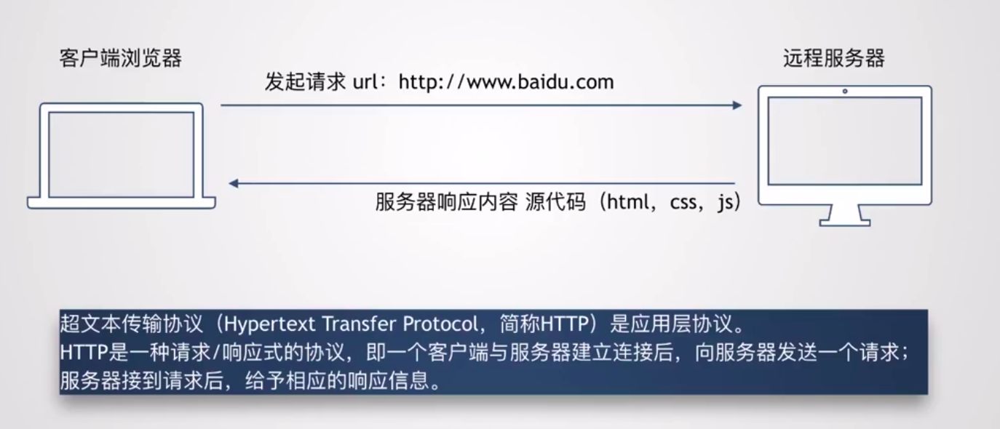
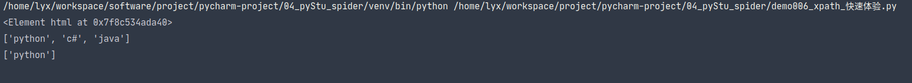
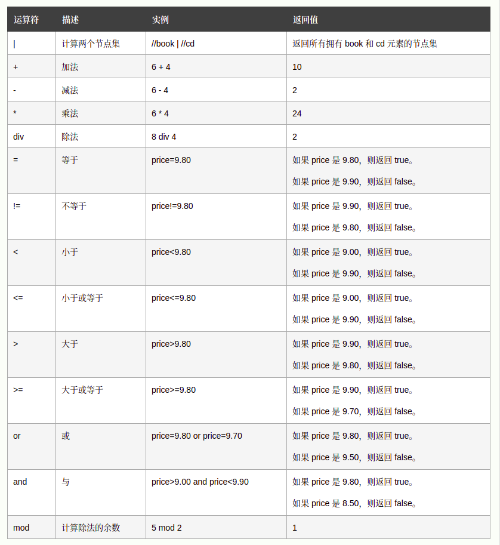

# 	Python爬虫

## 1.爬虫介绍

### 1.1 什么是爬虫

> * 如果计算机编程是魔术'的话,那么爬虫就是巫术,也就是运用“魔术”来实现精彩实用却又不费吹灰之力的“壮举”。
> * **通俗解释:通过 Python(爬虫代码),下载互联网上的数据到本地,并且提取出我们需要的信息的过程就是就是爬虫**
> * 网络爬虫(又被称为网页蜘蛛,网络机器人,或者经常的称为网页追逐者)是一种按照一定的规则,自动地抓取万维网信息的程序或者脚本。

### 1.2 Web和HTTP协议介绍



### 1.3 爬虫步骤

1. 确定需求
2. 寻找需求
3. 发送需求
4. 解析数据
5. 存储数据

## 2. Requests库

### 2.1 请求方式

> **GET和POST**
>
> * GET是默认的HTTP请求方法,用于直接输入网址的方式去访问网页
> * POST方法主是向Web服务器提交表单数据,通常表单提交时采用POST方法
> * GET把请求参数包含在URL中,POST通过请求体传递参数
> * GET相对POST不安全,参数直接暴露在URL上,用来传递敏感信息

### 2.2 Requests安装

**安装：**

```shell
pip install requests
```

快速体验：

```python
import requests

# 定义请求Url
url =  "https://www.baidu.com"

# 发起get请求
response = requests.get(url)

# 获取响应结果
print(response)  # 响应的Response对象
print(response.content)  # 获取响应对象的二进制文本流
print(response.content.decode("utf-8"))  # 将二进制文本流解码成utf-8格式
print(response.text)  # 获取响应内容
print(response.status_code)  # 获取请求状态码
print(response.url)  # 获取请求地址
print(response.request.headers)  # 获取请求头信息
print(response.headers)  # 获取响应头信息
```

### 2.3 请求头user-agent

> 默认使用requests发送请求的user-agent为`python-requests/2.25.1`,会被某些网站给屏蔽掉，需要修改user-agent来骗过网站进行发送请求。

快速体验：

```python
import requests

# 定义请求信息
url = "https://www.bilibili.com/"

# 定义请求头
headers = {
    "user-agent": "Mozilla/5.0 (X11; Linux x86_64) AppleWebKit/537.36 (KHTML, like Gecko) Chrome/89.0.4389.114 Safari/537.36"
}

# 发送get请求
response = requests.get(url=url, headers=headers)

# 获取响应状态码
status_codes = response.status_code

# 将页面信息写入到文件中
if status_codes == 200:
    with open("./spider_page/demo1.html", "w") as f:
        f.write(response.text)
else:
    print("error status : ", status_codes)
```

#### 2.3.1 常用的user-agent

**Opera**

```tex
Mozilla/5.0 (Windows NT 6.1; WOW64) AppleWebKit/537.36 (KHTML, like Gecko) Chrome/39.0.2171.95 Safari/537.36 OPR/26.0.1656.60

Opera/8.0 (Windows NT 5.1; U; en)

Mozilla/5.0 (Windows NT 5.1; U; en; rv:1.8.1) Gecko/20061208 Firefox/2.0.0 Opera 9.50

Mozilla/4.0 (compatible; MSIE 6.0; Windows NT 5.1; en) Opera 9.50

Opera/9.80 (Macintosh; Intel Mac OS X 10.6.8; U; en) Presto/2.8.131 Version/11.11

Opera/9.80 (Windows NT 6.1; U; en) Presto/2.8.131 Version/11.11

Opera/9.80 (Android 2.3.4; Linux; Opera Mobi/build-1107180945; U; en-GB) Presto/2.8.149 Version/11.10
```

**Firefox**

```tex
Mozilla/5.0 (Windows NT 6.1; WOW64; rv:34.0) Gecko/20100101 Firefox/34.0

Mozilla/5.0 (X11; U; Linux x86_64; zh-CN; rv:1.9.2.10) Gecko/20100922 Ubuntu/10.10 (maverick) Firefox/3.6.10

Mozilla/5.0 (Macintosh; Intel Mac OS X 10.6; rv,2.0.1) Gecko/20100101 Firefox/4.0.1

Mozilla/5.0 (Windows NT 6.1; rv,2.0.1) Gecko/20100101 Firefox/4.0.1
```

**Safari**

```tex
Mozilla/5.0 (Windows NT 6.1; WOW64) AppleWebKit/534.57.2 (KHTML, like Gecko) Version/5.1.7 Safari/534.57.2

MAC：Mozilla/5.0 (Windows NT 10.0; Win64; x64) AppleWebKit/537.36 (KHTML, like Gecko) Chrome/81.0.4044.122 Safari/537.36

Windows：Mozilla/5.0 (Windows; U; Windows NT 6.1; en-us) AppleWebKit/534.50 (KHTML, like Gecko) Version/5.1 Safari/534.50

Mozilla/5.0 (iPhone; U; CPU iPhone OS 4_3_3 like Mac OS X; en-us) AppleWebKit/533.17.9 (KHTML, like Gecko) Version/5.0.2 Mobile/8J2 Safari/6533.18.5

Mozilla/5.0 (iPhone; U; CPU iPhone OS 4_3_3 like Mac OS X; en-us) AppleWebKit/533.17.9 (KHTML, like Gecko) Version/5.0.2 Mobile/8J2 Safari/6533.18.5

Mozilla/5.0 (iPad; U; CPU OS 4_3_3 like Mac OS X; en-us) AppleWebKit/533.17.9 (KHTML, like Gecko) Version/5.0.2 Mobile/8J2 Safari/6533.18.5
```

**Chrome**

```tex
Mozilla/5.0 (Windows NT 6.1; WOW64) AppleWebKit/537.36 (KHTML, like Gecko) Chrome/39.0.2171.71 Safari/537.36

Mozilla/5.0 (X11; Linux x86_64) AppleWebKit/537.11 (KHTML, like Gecko) Chrome/23.0.1271.64 Safari/537.11

Mozilla/5.0 (Windows; U; Windows NT 6.1; en-US) AppleWebKit/534.16 (KHTML, like Gecko) Chrome/10.0.648.133 Safari/534.16

Mozilla/5.0 (Macintosh; Intel Mac OS X 10_7_0) AppleWebKit/535.11 (KHTML, like Gecko) Chrome/17.0.963.56 Safari/535.11
```

### 2.4 POST请求

快速体验：

```python
import requests

# 定义请求信息
import requests

# 定义请求信息
url = "http://httpbin.org/post"

# 定义请求头
headers = {
    "user-agent": "Mozilla/5.0 (X11; Linux x86_64) AppleWebKit/537.36"
                  " (KHTML, like Gecko) Chrome/89.0.4389.114 Safari/537.36"
}

# 定义请求数据
data = {
    "hello": "world"
}

# 发送post请求
response = requests.post(url=url, headers=headers, data=data)

# 接收返回数据
status_code = response.status_code
if status_code == 200:
    print("服务器响应成功！")
    print(response.json())  # 处理返回的json数据
```

运行结果：


### 2.5 Cookie

> 什么是cookie？
>
> Cookie 是一些数据, 存储于你电脑上的文本文件中。
>
> 当 web 服务器向浏览器发送 web 页面时，在连接关闭后，服务端不会记录用户的信息。
>
> Cookie 的作用就是用于解决 "如何记录客户端的用户信息":
>
> - 当用户访问 web 页面时，他的名字可以记录在 cookie 中。
> - 在用户下一次访问该页面时，可以在 cookie 中读取用户访问记录。

快速体验：

```python
import requests

# 定义请求信息
import requests

# 定义请求信息
url = "https://www.douyu.com/member/cp"

# 定义请求头
headers = {
    "user-agent": "Mozilla/5.0 (X11; Linux x86_64) AppleWebKit/537.36"
                  " (KHTML, like Gecko) Chrome/89.0.4389.114 Safari/537.36",
    # 斗鱼登录后的cookie信息
    "cookie": "dy_did=486afe456c985d057ef50b2700061601; "
              "acf_did=486afe456c985d057ef50b2700061601; "
              "Hm_lvt_e99aee90ec1b2106afe7ec3b199020a7=1619698802,"
              "1619784054,1620217406,1620317864; "
              "PHPSESSID=feu7q8187cuk1t9i0fv8atjvc7; "
              "acf_auth=5d3b2bFYNyAxhrw%2BI7XDrwy5w%2F5uvW%2BjBFG4EyelPku2OxQhbXTPWGVyx6zMr8b5487u7uGGG%2FT%2FSA8ma1G1g78ruPiUrGZcCRUa2xV1An6XHnOSscCX3TY; dy_auth=e976SZvn7Afjr58XK5MVwrbC9OVIHpSKVm8CHQEMujmhywWEF%2B%2F6zgEkbUGPP4ldWu5AcvORimCQ8MwOxvcGbXaBeDgxWpIVmYnvqWBN46NevdVmrg2SdN4; wan_auth37wan=16bf6494e1c09yR2KCuj3nc27fTX83kCyobc9g3h5staBulG2gLIuKbI7FiL7k3AnKnKpxr5PLSzL6Jszw5kiTpUJNWgNAfTa4MnrQY9FhPpTOgtfWU; acf_uid=153133699; "
              "acf_username=153133699; "
              "acf_nickname=%E5%AD%A4%E7%8B%AC%E6%89%BE%E4%B8%8D%E5%88%B0%E5%AF%82%E5%AF%9E; "
              "acf_own_room=0; acf_groupid=1; acf_phonestatus=1; "
              "acf_avatar=https%3A%2F%2Fapic.douyucdn.cn%2Fupload%2Favanew%2Fface%2F201707%2F27%2F18%2F177d190c00d35d88494ca5afb54bca7e_; "
              "acf_ct=0; acf_ltkid=33810853; acf_biz=1; acf_stk=beb6eabe88788870; "
              "Hm_lpvt_e99aee90ec1b2106afe7ec3b199020a7=1620383183"
}

# 发送post请求
response = requests.get(url=url, headers=headers)

# 处理返回结果
status_code = response.status_code

if status_code == 200:
    print("请求成功！")
    with open("./spider_page/testCookie.text", "w") as f:
        f.write(response.text)
else:
    print("error status :", status_code)
```

运行结果：


### 2.6 Session

> 由于使用手动获取cookie的方式，每次都需要先用浏览器访问才能得到cookie，之后才能手动设置cookie，显得程序不够智能。所以可以使用session方法，主动记录cookie数据。

```python
import requests

# 定义请求信息
import requests

# 定义请求信息
# 登录请求信息
login_url = "http://www.pengwei168.com/index.php/user/login"
# 最终请求信息
url = "http://www.pengwei168.com/index.php/user/index.html"

# 定义请求头
headers = {
    "user-agent": "Mozilla/5.0 (X11; Linux x86_64) AppleWebKit/537.36"
                  " (KHTML, like Gecko) Chrome/89.0.4389.114 Safari/537.36"
}

# 如果需要爬虫程序主动记录cookie并携带cookie，在使用requests之前先调用session方法
# 并使用session方法返回的对象发送请求
request = requests.session()

# 登录请求时的数据
login_data = {
    "user_name": "134679",
    "user_pwd": "LYX134679"
}
# 发起登录请求
login_response = request.post(url=login_url, headers=headers, data=login_data)

# 数据处理
# 登录请求返回的状态码
login_status_code = login_response.status_code
# 如果请求成功
if login_status_code == 200:
    print("登录请求成功！")
    print("进入个人中心请求中。。。")
    # 发送最终页面请求，要使用session方法返回的对象发送请求
    response = request.get(url=url, headers=headers)
    # 获取最终请求的状态码
    status_code = response.status_code
    # 最终请求成功
    if status_code == 200:
        print("个人中心请求成功！")
        # 将页面保存到文件中
        with open("./spider_page/testSession.txt", "w") as f:
            f.write(response.text)
    else:  # 最终请求失败
        print("erro status :", status_code)
else:  # 登录请求失败
    print("login error status :", login_status_code)
```

运行结果：


## 3. XPath

>`XPath`,全称 **XML Path Language**,即ⅩML路径语言,它是一门在XM文档中查找信息的语言。最初是用来搜寻XML文档的,但同样适用于HTML文档的搜索。所以在做爬虫时完全可以使用 XPath做相应的信息抽取。

### 3.1 XPath概览

>XPath的选择功能十分强大,它提供了非常简洁明了的路径选择表达式。另外,它还提供了超过100个内建函数,用于字符串、数值、时间的匹配以及节点、序列的处理等,几乎所有想要定位的节点都可以用 XPath来选择。官方文档:https://www.w3.org/TR/xpath/
>
>- XPath 使用路径表达式在 XML 文档中进行导航
>- XPath 包含一个标准函数库
>- XPath 是 XSLT 中的主要元素
>- XPath 是一个 W3C 标准

### 3.2 XPath常用规则

| 表达式   | 描述                     |
| -------- | ------------------------ |
| nodename | 选取此节点的所有子节点   |
| /        | 从当前节点选取直接子节点 |
| //       | 从当前节点选取子孙节点   |
| .        | 选取当前节点             |
| ..       | 选取当前父节点           |
| @        | 选取属性                 |

示例：

```html
//title[@lang=eng]
```

### 3.3 etree解析的两种方式

#### 3.3.1 直接解析python中的字符串

```python
from lxml import etree

# 需要被解析的网页源码
text = """
<!DOCTYPE html>
    <html>
    <head>
        <meta charset="UTF-8">
        <title>test xpath</title>
    </head>
    <body>
        <ul>
            <li><a>python</a></li>
            <li><a>c#</a></li>
            <li><a>java</a></li>
        </ul>
    </body>
    </html>
"""

# 使用etee解析文档
html = etree.HTML(text)
print(html)

# 提取数据
# 提取所有a标签中的文本
lst = html.xpath("/html/body/ul/li/a/text()")
print(lst)

# 提取第一个a标签中的文本
info = html.xpath("/html/body/ul/li[1]/a/text()")
print(info)
```

运行结果：



#### 3.3.2 解析外部html

快速体验：

```python
from lxml import etree

html = etree.parse("./spider_page/test.html", etree.HTMLParser())
result = etree.tostring(html)  # 解析成二进制数据
print(result.decode("utf-8"))

lst = html.xpath("/html/body/ul/li/a/text()")
print(lst)
```

运行结果：

  

### 3.4 xpath规则快速体验

```python
from lxml import etree

# 被解析的网页源码
text = """
<!DOCTYPE html>
<html>
<head>
    <meta charset="UTF-8"/>
    <title>test xpath</title>
</head>
<body>
<ul>
    <li><a>python</a></li>
    <li><a>c#</a></li>
    <li><a>java</a></li>
</ul>
<div class=“a” id="c">hello</div>
<div class="a b">world</div>
<div class="test">
<ul>
    <li><a href="a">python工程师</a></li>
    <li><a href="b">c#工程师</a></li>
    <li><a href="c">java工程师</a></li>
</ul>
</div>
</body>
</html>
"""

# 解析数据
result = etree.HTML(text)

# 根据层级关系获取元素内容
info1 = result.xpath("/html/body/ul/li/a/text()")
print(info1)

# 获取页面中所有a中的元素
info2 = result.xpath("//a/text()")
print(info2)

# 根据元素的属性获取
info3 = result.xpath("//div[@class='test']//a/text()")
print(info3)

# 获取元素属性
info4 = result.xpath("//div[@class='test']//a/@href")
print(info4)

print(list(zip(info3, info4)))

# 获取包含属性的值
info5 = result.xpath("//div[contains(@class, 'b')]/text()")
print(info5)

# 匹配过个属性
info6 = result.xpath("//div[contains(@class, 'a') and @id='c']/text()")
print(info6)
```

运行结果：


### 3.5 xpath运算符



## 4. bs4

> BeautifulSoup4(简称bs4)翻译成中文就是“美丽的汤”，这个奇特的名字来源于《爱丽丝梦游仙境》（这也是为何在其官网会配上奇怪的插图，以及用《爱丽丝》的片段作为测试文本）。
> 官方文档：https://www.crummy.com/software/BeautifulSoup/bs4/doc/index.zh.html

### 4.1 安装

```shell
pip install Beautifulsoup4
```

### 4.2 导入文档

> * 导入内置文档
> * 导入外部html文件

```python
from bs4 import BeautifulSoup

html_doc = """
<html>
    <head><title>The Dormouse's story</title></head>
    <body>
        <p class="title"><b>The Dormouse's story</b></p>
        <p class="story">Once upon a time there were three little sisters; and their names were
        <a href="http://example.com/elsie" class="sister" id="link1">Elsie</a>,
        <a href="http://example.com/lacie" class="sister" id="link2">Lacie</a> and
        <a href="http://example.com/tillie" class="sister" id="link3">Tillie</a>;
        and they lived at the bottom of a well.</p>
        <p class="story">...</p>
    </body>
</html>
"""

# 导入html文本
# html.parser: python内置标准库，执行力中等，容错率强
# lxml: 执行力强，容错率强，需要安装c语言库
suop = BeautifulSoup(html_doc,  "lxml")
print(suop)
print("="*50)
# 导入外部html (外部文档与以上html内容相同)
suop = BeautifulSoup(open("./testLib/bs4.html"), "lxml")
print(suop)
```

运行结果：


### 4.3 对象种类

> Beautiful Soup将复杂HTML文档转换成一个复杂的树形结构,每个节点都是Python对象,所有对象可以归纳为4种: `Tag` , `NavigableString` , `BeautifulSoup` , `Comment` .

#### 4.3.1 Tag

```python
from bs4 import BeautifulSoup

soup = BeautifulSoup("<p class='attr top' id='p-txt a'>hello world</p>", 'lxml')

# 通过name获取节点
# 全文匹配，默认匹配第一个符合的标签
tag = soup.p
print("find by name: ", tag)

# 获取属性
tag = soup.p
clas = tag['class']
# 当属性存在多值的时候，返回list
print("find attributes more: ", clas)
# 当html定义的属性为为单值时，返回字符串
idd = tag['id']
print("find attributes only: ", idd)

# tag的属性可以被添加,删除或修改. 再说一次, tag的属性操作方法与字典一样
# 增加
tag['height'] = '20px'
print("add attributes: ", tag)
# 删除
del tag['class']
print("del attributes: ", tag)
# 改
tag['id'] = 'hello'
print("update attrbutes: ", tag)
```

运行结果：


#### 4.3.2 NavigableString

```python
from bs4 import BeautifulSoup

soup = BeautifulSoup("<p>hello world</p>", "lxml")

# 得到p标签
tag = soup.p

# 获取标签的值
info = tag.string
print("find tag info by string: ", info)
info = tag.get_text()
print("find tag info by get_text: ", info)

# 修改标签的值
tag.string.replace_with("你好，世界！")
print("update tag info: ", tag)
```

运行结果：


### 4.4 css选择器

```python
```

### 4.5 遍历文档树

```python
from bs4 import BeautifulSoup

soup = BeautifulSoup(open("./testLib/bs4.html"), 'lxml')

# 通过.name只能获取第一个符合的标签
# 通过find_all可获得全文中所有符合的标签，返回列表类型
tag_list = soup.find_all("a")
print("find all tag: ", tag_list)
# 匹配第一个相同的
tag = soup.find("a")
print("find tag: ", tag)
# 根据class获取
# 匹配第一个相同的
tag = soup.find(class_='a')
print("find by class: ", tag)
# 匹配全文，返回list
tag = soup.find_all(class_='a')
print("find all by class: ", tag)


# tag的 .contents 属性可以将tag的子节点以列表的方式输出
# 字符串没有 .contents 属性,因为字符串没有子节点
tag_list = soup.head.contents
print("contain tag: ", tag_list)
# BeautifulSoup 对象本身一定会包含子节点,也就是说<html>标签也是 BeautifulSoup 对象的子节点
tag_list = soup.contents
print("contain tag by soup: ", tag_list)
print("contain tag by soup name: ", soup.contents[0])

# 通过tag的 .children 生成器,可以对tag的子节点进行循环
for child in soup.head.children:
    print("children: ", child)
```

运行结果：


