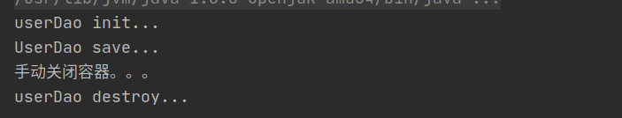
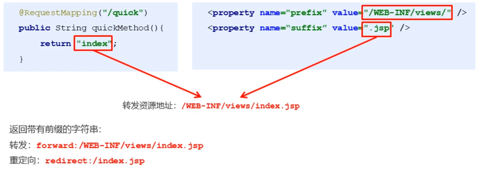

# SSM教程

## 1. spring

### 1.1 spring是什么

Spring是分层的 Java SE/EE应用 full-stack轻量级开源框架,以**lOC**( Inverse of Control:**反转控制**)和**AOP**( Aspect Oriented Programming:**面向切面编程**)为内核。

提供了**展现层 Spring MVC**和**持久层 Spring JDBCTemplate**以及**业务层事务管理**等众多的企业级应用技术还能整合开源世界众多著名的第三方框架和类库,逐渐成为使用最多的 Java ee企业应用开源框架。

### 1.2 spring的优势

1. 方便解耦,简化开发

   > 通过 Spring提供的loC容器,**可以将对象间的依赖关系交由 Spring进行控制**,避免硬编码所造成的过度耦合。用户也不必再为单例模式类、属性文件解析等这些很底层的需求编写代码,可以更专注于上层的应用。

2. AOP编程的支持

   > 通过 Spring的AOP功能,方便进行面向切面编程,许多不容易用传统OOP实现的功能可以通过AOP轻松实现。

 3. 声明式事务的支持

    > 可以将我们从单调烦闷的事务管理代码中解脱岀来,通过声明式方式灵活的进行事务管理,提高矸发效率和质量。

 4. 方便程序的测试

    > 可以用非容器依赖的编程方式进行几乎所有的测试工作,测试不再是昂贵的操作,而是随手可做的事情

	5. 方便集成各种优秀柜架

    > Spring对各种优秀框架( Struts. Hibemate、 Hessian. Quartz等)的支持

	6. 降低 JavaEE AP的使用难度

    > Spring对 JavaEE AP(如DBC、 JavaMail、远程调用等)进行了薄薄的封装层,使这些APl的使用难度大为降低

### 1.3 spring体系结构


### 1.4 spring的开发步骤


#### 1.4.1 代码实现

1. 导入spring开发的基本包坐标

   ```xml
   <dependency>
       <groupId>org.springframework</groupId>
       <artifactId>spring-context</artifactId>
       <version>5.0.5.RELEASE</version>
   </dependency>
   ```

   

2. 编写dao接口及实现类

   ```java
   //创建UserDao接口
   public interface UserDao {
       public void save();
   }
   ```

   ```java
   //创建UserDao实现类
   public class UserDaoImpl implements UserDao {
       @Override
       public void save() {
           System.out.println("UserDao save...");
       }
   }
   ```

   

3. 创建spring核心配置文件

   

   

4. 在spring的核心配置文件中配置dao接口的bean

   ```xml
   <?xml version="1.0" encoding="UTF-8"?>
   <beans xmlns="http://www.springframework.org/schema/beans"
          xmlns:xsi="http://www.w3.org/2001/XMLSchema-instance"
          xsi:schemaLocation="http://www.springframework.org/schema/beans http://www.springframework.org/schema/beans/spring-beans.xsd">
       <!-- 创建userDao的bean -->
       <bean id="userDao" class="com.lyx.dao.impl.UserDaoImpl"/>
   </beans>
   ```

   

5. 使用spring的api获取bean的实例

   ```java
   public class TestUserDao {
       @Test
       public void TestSave(){
           ApplicationContext app = new ClassPathXmlApplicationContext("applicationContext.xml");
           UserDao userDao = (UserDao) app.getBean("userDao");
           userDao.save();
       }
   }
   ```


### 1.5 spring配置文件

#### 1.5.1 Bean标签基本配置

用于配置对象交由 Spring来创建

默认情况下它调用的是类中的**无参构造函数**,如果没有无参构造函数则不能创建成功

基本属性

* id : Bean实例在 Spring容器中的唯标识
* class : Bean的全限定名称

#### 1.5.2 Bean标签的范围配置

scope ：指对象的作用范围，取值如下：

| 取值范围       | 说明                                                         |
| -------------- | ------------------------------------------------------------ |
| **singleton**  | 默认值，单例的                                               |
| **prototype**  | 多例的                                                       |
| request        | WEB项目中，Spring创建一个Bean对象，将对象存入到request域中   |
| session        | WEB项目中，Spring创建一个Bean对象，将对象存入到session域中   |
| global session | WEB项目中，应用在Portlet环境中，如果没有Portlet环境那么globalSession相当于session |

> 注意：
>
> 将scope的属性设置为singleton的时候，会在加载配置文件的时候调用构造方法。而将scope的属性设置为prototype的时候，会在调用bean的时候调用构造方法。

1. 当 scope的取值为 singleton时

   Bean的实例化个数 : **1个**

   Bean的实例化时机 : 当 Spring核心文件被加载时,实例化配置的Bean实例

   Bean的生命周期

   * 对象创建 : 当应用加载,创建容器时,对象就被创建了
   * 对象运行 : 只要容器在,对象一直活看
   * 对象销毁 : 当应用卸载,销毁容器时,对象就被毁了

2. 当 scope的取值为 prototype时

   Bean的实例化个数 : **多个**

   Bean的实例化时机 : 当调用 getBean()方法时实例化Bean

   Bean的生命周期

   * 对象创建 : 当使用对象时,创建新的对象实例
   * 对象运行 : 只要对象在使用中,就直活着
   * 对象销毁 : 当对象长时间不用时,被java的垃圾回收器回收了

#### 1.5.3 Bean生命周期配置

* init- method : 指定类中的初始化方法名称
* destroy-method : 指定类中销毁方法名称

1. 在UserDao中添加初始化和销毁方法

   ```java
   	/**
        * @Description: 测试UserDao初始化
        * @Param: []
        * @return: void
        * @Author: lyx
        * @Date: 2021/6/20 下午5:25
        */
       public void init(){
           System.out.println("userDao init...");
       }
   
       /**
        * @Description: 测试UserDao销毁 
        * @Param: [] 
        * @return: void
        * @Author: lyx
        * @Date: 2021/6/20 下午5:32
        */
       public void destroy(){
           System.out.println("userDao destroy...");
       }
   ```

   


2. 修改spring配置文件

   ```xml
   <bean id="userDao" class="com.lyx.dao.impl.UserDaoImpl" init-method="init" destroy-method="destroy"/>
   ```

   

3. 手动关闭容器

   ```java
   ClassPathXmlApplicationContext app = new 		ClassPathXmlApplicationContext("applicationContext.xml");
   UserDao userDao = (UserDao) app.getBean("userDao");
   userDao.save();
   System.out.println("手动关闭容器。。。");
   app.close();
   ```

4. 运行结果

   


#### 1.5.4 Bean实例化三种方式

* 无参构造方法实例化

  ```xml
  <bean id="userDao" class="com.lyx.dao.impl.UserDaoImpl" />
  ```

  

* 工厂静态方法实例化

  1. 创建静态工厂类

     ```java
     public class StaticFactory {
         /**
          * @Description: 模拟静态工厂
          * @Param: []
          * @return: com.lyx.dao.UserDao
          * @Author: lyx
          * @Date: 2021/6/20 下午8:57
          */
         public static UserDao getUserDao(){
             return new UserDaoImpl();
         }
     }
     ```

     

  2. 修改spring配置文件

     ```xml
     <!-- 通过静态工厂创建bean实例对象 -->
     <bean id="staticFactoryUserDao" class="com.lyx.dao.factory.StaticFactory" factory-method="getUserDao"/>
     ```

     

* 工厂实例方法实例化

  1. 创建工厂

     ```java
     public class StaticFactory {
         /**
          * @Description: 模拟静态工厂
          * @Param: []
          * @return: com.lyx.dao.UserDao
          * @Author: lyx
          * @Date: 2021/6/20 下午8:57
          */
         public static UserDao getUserDao(){
             return new UserDaoImpl();
         }
     }
     
     ```

     

  2. 修改spring配置文件

     ```xml
     <!-- 创建工厂实例化bean -->
     <bean id="factory" class="com.lyx.dao.factory.Factory" />
     <!-- 通过工厂获得UserDao实例化bean -->
     <bean id="factoryUserDao" factory-bean="factory" factory-method="getUserDao" />
     ```


#### 1.5.6 Bean的依赖注入

**依赖注入**( Dependency Injection):它是 Spring框架核心loC的具体实现。

在编写程序时,通过控制反转,把对象的创建交给了 Spring,但是代码中不可能出现没有依赖的情况。IOC解耦只是降低他们的依赖关系,但不会消除。例如:业务层仍会调用持久层的方法。那这种业务层和持久层的依赖关系,在使用 Spring之后,就让 Spring来维护了简单的说,就是坐等框架把持久层对象传入业务层,而不用我们自己去获取。

##### 1.5.6.1 Bean的依赖注入方式
怎么将 UserDao怎样注入到 UserService内部呢?

* 构造方法

  ```xml
  <!-- 创建userDao的bean -->
  <bean id="userDao" class="com.lyx.dao.impl.UserDaoImpl" init-method="init" destroy-method="destroy"/>
  
  <!-- 通过构造方法注入 -->
  <bean id="userService" class="com.lyx.service.impl.UserServiceImpl" >
      <constructor-arg name="userDao" ref="userDao" /> <!-- name: 构造方法参数名  ref：要注入的依赖的bean的id -->
  </bean>
  ```

  

* set方法

  ```xml
  <!-- 创建userDao的bean -->
  <bean id="userDao" class="com.lyx.dao.impl.UserDaoImpl" init-method="init" destroy-method="destroy"/>
  
  <!-- 创建userService的bean并通过set方法注入userDao的依赖 -->
  <bean id="userService" class="com.lyx.service.impl.UserServiceImpl">
      <property name="userDao" ref="userDao"/>  <!-- name: 被注入属性名  ref：要注入的依赖的bean的id -->
  </bean>
  ```

  * 使用p命名空间注入

    * spring文件头加入命名空间

      ```xml
      xmlns:p="http://www.springframework.org/schema/p"
      ```

      

    * 使用p命名空间注入

      ```xml
      <!-- 使用p命名空间注入 -->
      <bean id="userService" class="com.lyx.service.impl.UserServiceImpl" p:userDao-ref="userDao"/>
      ```

      


##### 1.5.6.2 Bean的依赖注入的数据类型
上面的操作,都是注入的引用Bean,除了刈象的引用可以注入,普通数据类型,集合等都可以在容器中进行注入。

注入数据的三种数据类型

* 引用数据类型

  > 见`1.5.6.1`

* 普通数据类型

  ```java
  private String name;
  private int age;
  //使用set方法进行注入
  public void setName(String name) {
      this.name = name;
  }
  
  public void setAge(int age) {
      this.age = age;
  }
  ```

  ```xml
  <bean id="userDao" class="com.lyx.dao.impl.UserDaoImpl" init-method="init" destroy-method="destroy">
      <property name="name" value="张三"/>
      <property name="age" value="18"/>
  </bean>
  ```

* 集合数据类型

  ```java
  private List<String> strList;
  private Map<String, User> userMap;
  private Properties pro;
  
  public void setStrList(List<String> strList) {
      this.strList = strList;
  }
  
  public void setUserMap(Map<String, User> userMap) {
      this.userMap = userMap;
  }
  
  public void setPro(Properties pro) {
      this.pro = pro;
  }
  ```

  ```xml
  <bean id="userDao" class="com.lyx.dao.impl.UserDaoImpl" init-method="init" destroy-method="destroy">
      <property name="strList">
          <list>
              <value>aaa</value>
              <value>bbb</value>
              <value>ccc</value>
          </list>
      </property>
      <property name="userMap">
          <map>
              <entry key="user1" value-ref="user1"/>
              <entry key="user2" value-ref="user2"/>
          </map>
      </property>
      <property name="pro">
          <props>
              <prop key="p1">ppp1</prop>
              <prop key="p2">ppp2</prop>
              <prop key="p3">ppp3</prop>
          </props>
      </property>
  </bean>
  
  <bean id="user1" class="com.lyx.pojo.User">
      <property name="name" value="zs"/>
      <property name="age" value="18"/>
  </bean>
  <bean id="user2" class="com.lyx.pojo.User">
      <property name="name" value="ls"/>
      <property name="age" value="19"/>
  </bean>
  ```


#### 1.5.7引入其他配置文件(分模块开发)
实际开发中, Spring的配置内容非常多,这就导致 Springi配置很繁杂且体积很大,所以,可以将部分配置拆解到其他配置文件中,而在Spng主配置文件通过mpor标签进行加载

```xml
<import resource="applicationcontext-xxx xml"/>
```


### 1.6 spring相关API

#### 1.6.1 ApplicationContext的实现类

1. ClassPathXmlApplication Context

   > 它是从类的根路径下加载配置文件推荐使用这种

2. File SystemXmlApplication Context

   > 它是从磁盘路径上加载配置文件,配置文件可以在磁盘的任意位置。

3. Annotation ConfigApplication Context

   > 当使用注解配置容器对象时,需要使用此类来创建 spring容器。它用来读取注解。


#### 1.6.2 getBean()方法使用

```java
//传入字符串
public object getBean(String name) throws BeansException{
	assertBeanFactoryActive();
	return getBeanFactory ().getBean(name);
}
//传入字节码
public <T> T getBean(Class<r> requiredType) throws BeansException{
	assertBeanFactoryActive();
	return getBean Factory ().getBean (requiredrype);
}
```

快速体验：

```java
//容器中允许出现多个相容类型的bean，只要id不同就行
UserService userService = (UserService)app.getBean("userService");
```

```java
//容器中不允许出现相同类型的bean
UserService userService = app.getBean(UserService.class);
```

### 1.7 spring配置数据源

#### 1.7.1数据源(连接池)的作用

* 数据源(连接池)是提高程序性能如出现的

* 事先实例化数据源,初始化部分连接资源

* 使用连接资源时从数据源中获取

* 使用完毕后将连接资源归还给数据源

  > 常见的数据源(连接池):DBCP、c3P0、 BoneCP、 Druid等

  

#### 1.7.2数据源的开发步骤

1. 导入数据源的坐标和数据库驱动坐标

   ```xml
   <!-- mysql驱动 -->
   <dependency>
       <groupId>mysql</groupId>
       <artifactId>mysql-connector-java</artifactId>
       <version>5.1.35</version>
   </dependency>
   
   <!-- c3p0数据源 -->
   <dependency>
       <groupId>com.mchange</groupId>
       <artifactId>c3p0</artifactId>
       <version>0.9.5.2</version>
   </dependency>
   
   <!-- alibaba数据连接池 -->
   <dependency>
       <groupId>com.alibaba</groupId>
       <artifactId>druid</artifactId>
       <version>1.1.10</version>
   </dependency>
   ```

   

2. 创建数据源对象

   ```java
    ComboPooledDataSource dataSource = new ComboPooledDataSource();
   ```

   

3. 设置数据源的基本连接数据

   ```java
   dataSource.setDriverClass("com.mysql.jdbc.Driver");
   dataSource.setJdbcUrl("jdbc:mysql://localhost:3306/test");
   dataSource.setUser("root");
   dataSource.setPassword("root");
   ```

   

4. 使用数据源获取连接资源和归还连接资源

   ```java
   Connection connection = dataSource.getConnection();
   System.out.println(connection);
   connection.close();
   ```

##### 1.7.2.1 Druid数据源

```java
DruidDataSource dataSource = new DruidDataSource();
dataSource.setDriverClassName("com.mysql.jdbc.Driver");
dataSource.setUrl("jdbc:mysql://localhost:3306/test");
dataSource.setUsername("root");
dataSource.setPassword("root");
Connection connection = dataSource.getConnection();
System.out.println(connection);
connection.close();
```


#### 1.7.3 获取外部文件数据

* 创建db.properties文件保存数据连接池信息

  ```properties
  jdbc.Driver=com.mysql.jdbc.Driver
  jdbc.url=jdbc:mysql://localhost:3306/test
  jdbc.username=root
  jdbc.password=root
  ```

  

* 程序获取外部文件加载数据连接池信息

  ```java
   //读取资源文件
  ResourceBundle rb = ResourceBundle.getBundle("db");
  DruidDataSource dataSource = new DruidDataSource();
  dataSource.setDriverClassName(rb.getString("jdbc.Driver"));
  dataSource.setUrl(rb.getString("jdbc.url"));
  dataSource.setUsername(rb.getString("jdbc.username"));
  dataSource.setPassword(rb.getString("jdbc.password"));
  Connection connection = dataSource.getConnection();
  System.out.println(connection);
  connection.close();
  ```


#### 1.7.4 使用spring产生数据对象

```xml
<bean id="dataSource" class="com.alibaba.druid.pool.DruidDataSource">
        <property name="driverClassName" value="com.mysql.jdbc.Driver"/>
        <property name="url" value="jdbc:mysql://localhost:3306/test"/>
        <property name="name" value="root"/>
        <property name="password" value="root"/>
    </bean>
```


```java
@Test
//通过spring获取数据源对象
public void testDataSourceBean() throws Exception{
    ApplicationContext app = new ClassPathXmlApplicationContext("applicationContext.xml");
    DruidDataSource dataSource = app.getBean(DruidDataSource.class);
    Connection connection = dataSource.getConnection();
    connection.close();
}
```


##### 1.7.4.1 spring加载外部properties文件

要在spring配置文件头部加入context的命名空间和约束路径：

* 命名空间

  ```xml
  xmlns:context="http://www.springframework.org/schema/context"
  ```

* 约束路径

  ```xml
  http://www.springframework.org/schema/context  http://www.springframework.org/schema/context/spring-context.xsd
  ```

加载外部properties文件

```xml
<context:property-placeholder location="classpath:db.properties"/>
<bean id="dataSource" class="com.alibaba.druid.pool.DruidDataSource">
    <property name="driverClassName" value="${jdbc.Driver}"/>
    <property name="url" value="${jdbc.url}"/>
    <property name="username" value="${jdbc.username}"/>
    <property name="password" value="${jdbc.password}"/>
</bean>
```

### 1.8 spring注解开发

#### 1.8.1 原始注解

Spring是轻代码而重配置的框架,配置比较繁重,影响开发效率,所以注觚开发是—种趋势,注解代替κm配置
文件可以简化配置,提高开发效率。

Spring原始注解主要是替代`<Bean>`的配置

| 注解            | 说明                                         |
| --------------- | -------------------------------------------- |
| @Component      | 使用在类上用于实例化Bean                     |
| @Controller     | 使用在web层类上用于实例化Bean                |
| @Service        | 使用在 service层类上用于实例化Bean           |
| @Repository     | 使用在dao层类上用于实例化Bean                |
| @Autowired      | 使用在字段上用于根据类型依赖注入             |
| @Qualified      | 结合@Autowired起使用用于根据名称进行依赖注入 |
| @Resource       | 相当于@Autowired+@Qualifier,按照名称进行注入 |
| @Value          | 注入普通属性                                 |
| @Scope          | 标注Bean的作用范围                           |
| @ PostConstruct | 使用在方法上标注该方法是Bean的初始化法       |


#### 1.8.2 注解开发入门案例

* dao层

  * UserDao接口

    ```java
    package com.lyx.dao;
    
    public interface UserDao {
        public void save();
    }
    ```

    

  * UserDao实现类

    ```java
    package com.lyx.dao.impl;
    
    import com.lyx.dao.UserDao;
    
    /**
     * @ProjectName Spring
     * @ClassName UserDaoImpl
     * @Description TODO
     * @Author lyx
     * @Date 2021/6/22 下午10:18
     * @Version 1.0
     * @Content 用户持久层接口
     */
    @Repository("userDao")
    public class UserDaoImpl implements UserDao {
    
        @Override
        public void save() {
            System.out.println("userDao running...");
        }
    }
    ```

    

* server层

  * UserService接口

    ```java
    package com.lyx.service;
    
    public interface UserService {
        public void save();
    }
    
    ```

    

  * UserService实现类

    ```java
    package com.lyx.service.impl;
    
    import com.lyx.dao.UserDao;
    import com.lyx.service.UserService;
    import org.springframework.beans.factory.annotation.Autowired;
    import org.springframework.beans.factory.annotation.Qualifier;
    import org.springframework.stereotype.Service;
    
    /**
     * @ProjectName Spring
     * @ClassName UserServiceImpl
     * @Description TODO
     * @Author lyx
     * @Date 2021/6/22 下午10:22
     * @Version 1.0
     * @Content 用户业务层实现类
     */
    @Service("userService")
    public class UserServiceImpl implements UserService {
        //使用set方法自动依赖注入
        @Autowired
        @Qualifier("userDao")
        private UserDao userDao;
        //使用注解方式无可以不使用set方法进行注入，后台默认使用反射方式注入
    //    public void setUserDao(UserDao userDao) {
    //        this.userDao = userDao;
    //    }
    
        @Override
        public void save() {
            userDao.save();
        }
    }
    ```

    

* spring配置注解自动扫描

  ```xml
  <?xml version="1.0" encoding="UTF-8"?>
  <beans xmlns="http://www.springframework.org/schema/beans"
         xmlns:xsi="http://www.w3.org/2001/XMLSchema-instance"
         xmlns:context="http://www.springframework.org/schema/context"
         xsi:schemaLocation="http://www.springframework.org/schema/beans http://www.springframework.org/schema/beans/spring-beans.xsd
                              http://www.springframework.org/schema/context  http://www.springframework.org/schema/context/spring-context.xsd">
      <!-- 设置自动扫描注解 -->
      <context:component-scan base-package="com.lyx"/>
  </beans>
  ```

  

* 测试配置

  ```java
  package com.lyx.service;
  
  import org.junit.Test;
  import org.springframework.context.ApplicationContext;
  import org.springframework.context.support.ClassPathXmlApplicationContext;
  
  /**
   * @ProjectName Spring
   * @ClassName TestUserService
   * @Description TODO
   * @Author lyx
   * @Date 2021/6/22 下午10:27
   * @Version 1.0
   * @Content
   */
  public class TestUserService {
  
      @Test
      public void testSave(){
          ApplicationContext app = new ClassPathXmlApplicationContext("applicationContext.xml");
          UserService userService = app.getBean(UserService.class);
          userService.save();
      }
  }
   
  ```

  

#### 1.8.3 原始注解详解

```java
package com.lyx.service.impl;

import com.lyx.dao.UserDao;
import com.lyx.service.UserService;
import org.springframework.beans.factory.annotation.Autowired;
import org.springframework.beans.factory.annotation.Qualifier;
import org.springframework.stereotype.Repository;
import org.springframework.stereotype.Service;

import javax.annotation.Resource;

/**
 * @ProjectName Spring
 * @ClassName UserServiceImpl
 * @Description TODO
 * @Author lyx
 * @Date 2021/6/22 下午10:22
 * @Version 1.0
 * @Content 用户业务层实现类
 */
@Service("userService")
public class UserServiceImpl implements UserService {
    //使用set方法自动依赖注入
//    @Autowired  //不是使用@Qualifier注解，spring容器会安装数据类型匹配
//    @Qualifier("userDao")  //安装id从spring容器中匹配 @Qualifier要结合@Autowired一起使用
    @Resource(name="userDao")  //相当于@Autowired+@Qualifier
    private UserDao userDao;
    //使用注解方式无可以不使用set方法进行注入，后台默认使用反射方式注入
//    public void setUserDao(UserDao userDao) {
//        this.userDao = userDao;
//    }

    @Override
    public void save() {
        userDao.save();
    }
}

```


##### 1.8.3.1 普通属性赋值

```java
@Value("${jdbc.Driver}")  //可获取spring容器中加载的配置文件的值
private String driver;	
```


##### 1.8.3.2 设置bean的范围

```java
@Service("userService")
@Scope("singleton")  //默认，单例
//@Scope("prototype")  //多例
public class UserServiceImpl implements UserService {
```


##### 1.8.3.3 设置bean的初始化和销毁方法

```java
@PostConstruct
//初始化方法
public void init(){
    System.out.println("service init...");
}

@PreDestroy
//销毁方法
public void destroy(){
    System.out.println("service destroy...");
}
```


#### 1.8.4 新注解

使用上面的注解还不能全部替代xm配置文件,还需要使用注解替代的配置如下：

* 非自定义的Bean的配置 : `<bean>`
* 加载 properties文件的配置: `< context:property-placeholder>`
* 组件扫描的配置: `< context:component-scan>`
* 引入其他文件: `< import>`


| 注解            | 说明                                                         |
| --------------- | ------------------------------------------------------------ |
| @ Configuration | 用于指定当前类是一个 Spring配置类,当创建容器时会从该类上加载注解 |
| @ComponentScan  | 用于指定 Spring在初始化容器时要扫描的包。作用和在 Spring的xm配置文件中的<context: component-scan base-package="com.lyx"/> |
| @Bean           | 使用在方法上,标注将该方法的返回值存储到 Spring容器中         |
| @PropertySource | 用于加载 properties文件中的配置                              |
| @lmport         | 用于导入其他配置类                                           |


**快速体验：**

* 主配置类

  ```java
  @Configuration  //标志该类是spring的核心配置类
  @ComponentScan("com.lyx")  //设置自动扫描，相当于<context:component-scan base-package="com.lyx"/>
  @Import(DataSourceConfiguration.class)
  public class SpringConfiguration {
  }
  
  ```

  

* 数据源配置类

  ```java
  @PropertySource("classpath:db.properties")  //加载properties文件到spring文件中
  public class DataSourceConfiguration {
      @Value("${jdbc.Driver")
      private String driver;
      @Value("${jdbc.url")
      private String url;
      @Value("${jdbc.username")
      private String username;
      @Value("${jdbc.password")
      private String password;
      
      /**
       * @Description: 得到c3p0数据源 
       * @Param: [] 
       * @return: javax.sql.DataSource
       * @Author: lyx
       * @Date: 2021/6/24 下午3:56
       */
      @Bean
      public DataSource getC3P0DataSource() throws Exception {
          ComboPooledDataSource dataSource = new ComboPooledDataSource();
          dataSource.setDriverClass(driver);
          dataSource.setJdbcUrl(url);
          dataSource.setUser(username);
          dataSource.setPassword(password);
          return  dataSource;
      }
  
  }
  ```

  

* 测试方法

  ```java
  @Test
  public void testSaveAnnotation(){
      AnnotationConfigApplicationContext app = new AnnotationConfigApplicationContext(SpringConfiguration.class);
      UserService userService = app.getBean(UserService.class);
      userService.save();
  }
  ```

  

#### 1.8.5 spring集成Junit测试

##### 1.8.5.1 集成步骤

1. 导入 spring集成 Junit的坐标

   ```xml
   <!-- spring集成junit -->
   <dependency>
       <groupId>org.springframework</groupId>
       <artifactId>spring-test</artifactId>
       <version>5.0.5.RELEASE</version>
   </dependency>
   ```

   

2. 使用@Runwith注解替换原来的运行期

   ```java
   @RunWith(SpringJUnit4ClassRunner.class)
   ```

   

3. 使用@Contextconfiguration指定配置文件或配置类

   ```java
   @ContextConfiguration("classpath:applicationContext.xml")  //配置文件
   @ContextConfiguration(classes = {SpringConfiguration.class})  //配置类
   ```

   

4. 使用@Autowired注入需要测试的对象

   ```java
   @Autowired
   private UserService userService;
   ```

   

5. 创建测试方法进行测试

   ```java
   @Test
   public void testSave(){
       userService.save();
   	}
   }
   ```

   

#### 1.8.6 spring集成web环境

##### 1.8.6.1 集成步骤

1. 导入依赖坐标

   ```xml
   <!--- spring的web模块 -->
   <dependency>
       <groupId>org.springframework</groupId>
       <artifactId>spring-web</artifactId>
       <version>5.0.5.RELEASE</version>
   </dependency>
   ```

   

2. 在web.xml中配置ContextLoaderListener监听器

   ```xml
   <?xml version="1.0" encoding="UTF-8"?>
   <web-app xmlns:xsi="http://www.w3.org/2001/XMLSchema-instance"
            xmlns="http://java.sun.com/xml/ns/javaee"
            xsi:schemaLocation="http://java.sun.com/xml/ns/javaee http://java.sun.com/xml/ns/javaee/web-app_3_0.xsd"
            id="WebApp_ID" version="3.0">
     <!-- 配置spring的ContextLoaderListener监听器 -->
     <listener>
       <listener-class>org.springframework.web.context.ContextLoaderListener</listener-class>
     </listener>
     <!-- 配置全局初始化参数 -->
     <context-param>
       <param-name>contextConfigLocation</param-name>
       <param-value>classpath*:applicationContext.xml</param-value>
     </context-param>
   </web-app>
   ```

   

3. 使用WebApplicationContestUtils获取上下文

   ```java
   public class UserServlet extends HttpServlet {
       @Override
       protected void doGet(HttpServletRequest req, HttpServletResponse resp) throws ServletException, IOException {
           ServletContext servletContext = this.getServletContext();
           ApplicationContext app = WebApplicationContextUtils.getWebApplicationContext(servletContext);
           UserService userService = app.getBean(UserService.class);
           userService.save();
       }
   }
   ```


### 1.9 spring AOP

####  1.9.1 什么是AoP

AOP为 Aspect Oriented Programming的缩写,意思为**面向切面编程**,是通过预编译方式和运行期动态代理实现程序功能的统一维护的一种技术

AOP是OOP的延续,是软件开发中的个热点,也是 Spring框架中的个重要内容,是函数式编程的种衍生范型。利用AOP可以对业务逻辑的各个部分进行隔离,从而使得业务逻轾各部分之间的耦合度降低,提高程序的可重用性,同时提高了开发的效率。

#### 1.9.2 AOP 的作用及其优势

* 作用:在程序运行期间,在不修改源码的情兄下对方法进行功能増强
* 优势:减少重复代码,提高开发效率,并且便于维护

#### 1.9.3 AOP的底层实现
实际上,AOP的底层是通过 Spring提供的的动态代理技术实现的。在运行期间, Spring通过动态代理技术动态的生成代理对象,代理对象方法执行时进行増强功能的介入,在去调用目标对象的方法,从而完成功能的增强。

#### 1.9.4 AOP的动态代理技术

常用的动态代理技术

* JDK代理:基于接口的动态代理技术
* cgib代理:基于父类的动态代理技术


#### 1.9.5 JDK代理

* 目标对象

  ```java
  //目标方法
  public class Target implements ITarget{
      @Override
      public void save() {
          System.out.println("save running...");
      }
  }
  ```

  

* 目标对象接口 

  ```java
  //目标方法接口
  public interface ITarget {
      void save();
  }
  ```

  

* 增强对象

  ```java
  public class Advice {
      public void before(){
          System.out.println("前置增强...");
      }
      public void after(){
          System.out.println("后置增强...");
      }
  }
  ```

  

* 测试方法

  ```java
  public class Test {
      public static void main(String[] args) {
          Target t = new Target();  //目标方法对象
          Advice a = new Advice(); //增强方法
          ITarget iTarget = (ITarget) Proxy.newProxyInstance(
                  t.getClass().getClassLoader(),  //目标对象类加载器
                  t.getClass().getInterfaces(),  //目标对象的接口的字节码对象数组
                  new InvocationHandler() {  //调用代理对象的任何方法，都是调用invoke方法
                      @Override
                      public Object invoke(Object o, Method method, Object[] objects) throws Throwable {
                          a.before();
                          Object invoke = method.invoke(t, args);
                          a.after();
                          return invoke;
                      }
                  }
          );
          iTarget.save(); //调用目标方法
      }
  }
  ```


#### 1.9.6 cglib代理

* 目标对象

  ```java
  //目标方法
  public class Target{
      public void save() {
          System.out.println("save running...");
      }
  }
  ```

  

* 增强方法

  ```java
  public class Advice {
      public void before(){
          System.out.println("前置增强...");
      }
      public void after(){
          System.out.println("后置增强...");
      }
  }
  ```

  

* 测试方法

  ```java
  public class Test {
      public static void main(String[] args) {
          Target t = new Target();  //目标方法对象
          Advice a = new Advice(); //增强方法
  
          Enhancer enhancer = new Enhancer(); //创建增强器
          enhancer.setSuperclass(Target.class);  //设置父类
          enhancer.setCallback(new MethodInterceptor() {
              @Override
              public Object intercept(Object proxy, Method method, Object[] objects, MethodProxy methodProxy) throws Throwable {
                  a.before(); //前置增强
                  Object invoke = method.invoke(t, args); //执行目标
                  a.before(); //后置增强
                  return invoke;
              }
          });
          Target T = (Target) enhancer.create();
          T.save();
      }
  }
  ```


#### 1.9.7 AOP相关概念

Spring的AOP实现底层就是对上面的动态代理的代码进行了封装,封装后我们只需要对需要关注的部分进行代码编写,并通过配置的方式完成指定目标的方法增强。
在正式讲解AOP的操作之前,我们必须理解AOP的相关术语,常用的术语如下:

* Target(目标对象):代理的目标对象
* Proxy(代理):—个类被AOP织入增强后,就产生一个结果代理类
* Joinpoint(连接点):所谓连接点是指那些被拦截到的点。在 spring中这些点指的是方法,因为spig只支持方法类型的连接点
*  Pointcut(切入点):所谓切入点是指我们要对哪些 Joinpoint进行拦截的定义
*  Advice(通知/增强):所谓通知是指拦截到 Joinpoint之后所要做的事情就是通知
* Aspect(切面):是切入点和通知(引介)的结合
* Weaving(织入):是指把增强应用到目标对象象来创建新的代理对象的过程。 spring釆用动态代理织入,而AspectJ采用编译期织入和类装载期织入


#### 1.9.8 AOP开发明确的事项

1. 需要编写的内容
   * 编写核心业务代码(目标类的目标方法)
   * 编写切面类,切面类中有通知增强虽功能方法
   * 在配置文件中,配置织入关系,即将哪些通知与哪些连接点进行结合

2. AOP技术实现的内容

   Spring框架监控切入点方法的执行。一旦监控到切λ点方法被运行,使用代理机制,动态创建目标对象的代理对象,根据通知类别,在代理对象的对应位置,将通知对应的功能织入,完成完整的代码逻辑运行

3. AOP底层使用哪种代理方式
   在 spring中,框架会根据目标类是否实现了接口来决定采用哪种动态代理的方式


#### 1.9.9 知识要点

* aop:面向切面编程
* aop底层实现:基于Jk的动态代理和基于 Cglib的动态代理
* aop的重点概念:
  * Pointcut(切入点):被增虽的方法
  * Advice(通知/增强):封装增强业务逻辑的方法
  * Aspect(切面):切点+通知
  * Weaving(织入):将切点与通知结合的过程
* 开发明确事项
  * 谁是切点(切点表达式配置)
  * 谁是通知(切面类中的增强方法
  * 将切点和通知进行织入配置


#### 1.9.10 快速入门

1. 导入AOP相关坐标

   ```xml
   <!-- spring -->
   <dependency>
       <groupId>org.springframework</groupId>
       <artifactId>spring-context</artifactId>
       <version>5.0.5.RELEASE</version>
   </dependency>
   <!-- aop -->
   <dependency>
       <groupId>org.aspectj</groupId>
       <artifactId>aspectjweaver</artifactId>
       <version>1.8.4</version>
   </dependency>
   ```

   

2. 创建目标接口和目标类(内部有切点)

   ```java
   //目标类接口
   public interface ITarget {
       void save();
   }
   ```

   ```java
   //目标类
   public class Target implements ITarget{
       @Override
       public void save() {
           System.out.println("save running...");
       }
   }
   ```

   

3. 创建切面类(内部有增强方法)

   ```java
   public class MyAspect {
       public void before(){
           System.out.println("before running...");
       }
   }
   ```

   

4. 将目标类和切面类的对象创建权交给 spring

   ```xml
   <!-- 目标对象 -->
   <bean id="target" class="com.lyx.aop.Target" />
   <!-- 切面对象 -->
   <bean id="aspect" class="com.lyx.aop.MyAspect"/>
   ```

   

5. 在 applicationContext.xm中配置织入关系

   ```xml
   <!-- 配置织入 -->
   <aop:config>
       <!-- 声明切面 -->
       <aop:aspect ref="aspect">
           <!-- 切面：切点+通知 -->
           <aop:before method="before" pointcut="execution(public void com.lyx.aop.Target.save())"/>
       </aop:aspect>
   </aop:config>
   ```

   

6. 测试代码

   ```java
   @RunWith(SpringJUnit4ClassRunner.class)
   @ContextConfiguration("classpath:applicationContext.xml")
   public class AspectTest {
   
       @Autowired
       private ITarget target;
   
       @Test
       public void testSave(){
           target.save();
       }
   }
   ```


#### 1.9.11 XML配置AOP详解

1. 切点表达式的写法

   表达式语法:

   ```xml
   execution([修饰符] 返回值类型 包名.类名.方法名(参数))
   ```

   * 访问修饰符可以省略
   * 返回值类型、包名、类名、方法名可以使用星号`*`代表任意
   * 包名与类名之间一个点代表当前包下的类,两个点`..`表示当前包及其子包下的类
   * 参数列表可以使用两个点`..`表示任意个数,任意类型的参数列表

2. 通知的类型

   通知的配置语法:

   ```xml
   <aop:通知类型 method=“切面类中方法名” pointcut=“切点表达式"></aop通知类型>
   ```

   ​	

   ```java
   public class MyAspect {
       //前置增强
       public void before(){
           System.out.println("before running...");
       }
   
       //后置增强
       public void afterReturning(){
           System.out.println("afterReturning running...");
       }
   
       //环绕增强
       public Object around(ProceedingJoinPoint ppj) throws Throwable {
           System.out.println("around before...");
           Object obj = ppj.proceed();
           System.out.println("around after...");
           return obj;
       }
   
       //异常增强
       public void afterThrowing(){
           System.out.println("afterThrowing running...");
       }
   
       //最终增强
       public void after(){
           System.out.println("after running...");
       }
   
   
   }
   ```

   ```xml
   <!-- 配置织入 -->
   <aop:config>
       <!-- 声明切面 -->
       <aop:aspect ref="aspect">
           <!-- 切面：切点+通知 -->
           <aop:before method="before" pointcut="execution(public void com.lyx.aop.Target.save())"/>
           <aop:after-returning method="afterReturning" pointcut="execution(* com.lyx.aop.*.*(..))"/>
           <aop:around method="around" pointcut="execution(* com.lyx.aop.*.*(..))" />
           <aop:after-throwing method="afterThrowing" pointcut="execution(* com.lyx.aop.*.*(..))"/>
           <aop:after method="after" pointcut="execution(* com.lyx.aop.*.*(..))"/>
       </aop:aspect>
   </aop:config>
   ```

   

3. 切点表达式的抽取
   当多个增强的切点表达式相同时,可以将切点表达式进行抽取,在增强中使用 pointcut-ref属性代替pointcut属性来引用抽取后的切点表达式。

   ```xml
    <!-- 配置织入 -->
       <aop:config>
           <!-- 声明切面 -->
           <aop:aspect ref="aspect">
               <!-- 切点表达式 -->
               <aop:pointcut id="myPointcut" expression="execution(public void com.lyx.aop.Target.save())"/>
               <!-- 切面：切点+通知 -->
               <aop:before method="before" pointcut-ref="myPointcut"/>
               <aop:after-returning method="afterReturning" pointcut-ref="myPointcut"/>
               <aop:around method="around" pointcut-ref="myPointcut" />
               <aop:after-throwing method="afterThrowing" pointcut-ref="myPointcut"/>
               <aop:after method="after" pointcut-ref="myPointcut"/>
           </aop:aspect>
       </aop:config>
   ```


#### 1.9.12 基于注解的AOP开发

##### 1.9.12.1 快速入门

基于注解的aop开发步骤

1. 创建目标接口和目标类(内部有切点)

   ```java
   //目标类接口
   public interface ITarget {
       void save();
   }
   ```

   ```java
   //目标类
   public class Target implements ITarget {
       @Override
       public void save() {
           System.out.println("save running...");
   //        int i = 1/0; //模拟异常
       }
   }
   ```

   

2. 创建切面类(内部有增强方法)

   ```java
   public class MyAspect {
       //前置增强
       public void before(){
           System.out.println("before running...");
       }
   
       //后置增强
       public void afterReturning(){
           System.out.println("afterReturning running...");
       }
   
       //环绕增强
       public Object around(ProceedingJoinPoint ppj) throws Throwable {
           System.out.println("around before...");
           Object obj = ppj.proceed();
           System.out.println("around after...");
           return obj;
       }
   
       //异常增强
       public void afterThrowing(){
           System.out.println("afterThrowing running...");
       }
   
       //最终增强
       public void after(){
           System.out.println("after running...");
       }
   
   
   }
   ```

   

3. 将目标类和切面类的对象创建权交给 spring

   ```java
   @Component("target")
   ```

   ```java
   @Component("myAspect")
   ```

   

4. 在切面类中使用注解配置织入关系

   ```java
   @Aspect  //配置当前类是切面类
   @Component("myAspect")
   public class MyAspect {
       //前置增强
       @Before("execution(public void com.lyx.anno.*.*(..))")
       public void before(){
           System.out.println("before running...");
       }
   
       //后置增强
       @AfterReturning("execution(public void com.lyx.anno.*.*(..))")
       public void afterReturning(){
           System.out.println("afterReturning running...");
       }
   
       //环绕增强
       @Around("execution(public void com.lyx.anno.*.*(..))")
       public Object around(ProceedingJoinPoint ppj) throws Throwable {
           System.out.println("around before...");
           Object obj = ppj.proceed();
           System.out.println("around after...");
           return obj;
       }
   
       //异常增强
       @AfterThrowing("execution(public void com.lyx.anno.*.*(..))")
       public void afterThrowing(){
           System.out.println("afterThrowing running...");
       }
   
       //最终增强
       @After("execution(public void com.lyx.anno.*.*(..))")
       public void after(){
           System.out.println("after running...");
       }
   
   
   }
   ```

   

5. 在配置文件中开启组件扫描和AOP的自动代理

   ```xml
   <?xml version="1.0" encoding="UTF-8"?>
   <beans xmlns="http://www.springframework.org/schema/beans"
          xmlns:xsi="http://www.w3.org/2001/XMLSchema-instance"
          xmlns:aop="http://www.springframework.org/schema/aop"
          xmlns:context="http://www.springframework.org/schema/context"
          xsi:schemaLocation="
          http://www.springframework.org/schema/beans http://www.springframework.org/schema/beans/spring-beans.xsd
          http://www.springframework.org/schema/aop http://www.springframework.org/schema/aop/spring-aop.xsd
          http://www.springframework.org/schema/context http://www.springframework.org/schema/context/spring-context.xsd">
       <!-- 开启注解组件扫描 -->
       <context:component-scan base-package="com.lyx.anno" />
       <!-- aop自动代理 -->
       <aop:aspectj-autoproxy />
   
   </beans>
   ```

   

6. 测试

   ```java
   @RunWith(SpringJUnit4ClassRunner.class)
   @ContextConfiguration("classpath:applicationContext-anno.xml")
   public class AspectAnnoTest {
   
       @Autowired
       private ITarget target;
   
       @Test
       public void testSave(){
           target.save();
       }
   }
   ```

   

##### 1.9.12.2 抽取切面表达式

```java
@Aspect  //配置当前类是切面类
@Component("myAspect")
public class MyAspect {

    //切点表达式
    @Pointcut("execution(public void com.lyx.anno.*.*(..))")
    public void pointcut(){}  //空方法

    //前置增强
    @Before("pointcut()")
    public void before(){
        System.out.println("before running...");
    }

    //后置增强
    @AfterReturning("pointcut()")
    public void afterReturning(){
        System.out.println("afterReturning running...");
    }

    //环绕增强
    @Around("pointcut()")
    public Object around(ProceedingJoinPoint ppj) throws Throwable {
        System.out.println("around before...");
        Object obj = ppj.proceed();
        System.out.println("around after...");
        return obj;
    }

    //异常增强
    @AfterThrowing("pointcut()")
    public void afterThrowing(){
        System.out.println("afterThrowing running...");
    }

    //最终增强
    @After("pointcut()")
    public void after(){
        System.out.println("after running...");
    }


}
```


### 1.10 spring事物控制

#### 1.10.1 编程式事物控制

##### 1.10.1.1 PlatformTransactionManager
PlatformTransactionManager接口是 spring的事务管理器,它里面提供了我们常用的操作事务的方法。


##### 1.10.1.2 TransactionDefinition
TransactionDefinition是事务的定义信息对象,里面有如下方法


1. 事务隔离级别

   设置隔离级别,可以解决事务并发产生的问题,如脏读、不可重复读和虚读。

   * ISOLATION_DEFAULT
   * ISOLATION_READ_UNCOMMITTED
   * ISOLATION_READ_COMMITTED
   * ISOLATION_REPEATABLE_READ
   * ISOLATION_SERTALIZABLE

2. 事物传播行为

   * REQUIRED:如果当前没有事务,就新建一个事务,如果已经存在一个事务中,加入到这个事务中。一般的选择(默认值)
   * SUPPORTS:支持当前事务,如果当前没有事务,就以非事务方式执行(没有事务)
   * MANDATORY:使用当前的事务,如果当前没有事务,就抛出异常
   * REQUERS_NEW:新建事务,如果当前在事务中,把当前事务挂起。
   * NOT_SUPPORTED:以非事务方式执行操作,如果当前存在事务,就把当前事务挂起
   * NEVER:以非事务方式运行,如果当前存在事务,抛出异常
   * NESTED:如果当前存在事务,则在嵌套事务内执行。如果当前没有事努,则执行 REQUIRED类似的操作
   * 超时时间:默认值是-1,没有超时限制。如果有,以秒为单位进行设置
   * 是否只读:建议查询时设置为只读

3. TransactionStatus
   TransactionStatus接口提供的是事务具体的运行状态,方法介绍如下

   


#### 1.10.2 基于XML的声明式事物管理

##### 1.10.2.1 什么是声明式事务控制
Spring的声明式事务顾名思义就是**采用声明的方式来处理事务**。这里所说的声明,就是指在配置文件中声明,用在 Spring配置文件中声明式的处理事务来代替代码式的处理事努。

**声明式事务处理的作用**

* 事努管理不侵入开发的组件。具体来说,业务逻辑对寸象就不会意识到正在事务管理之中,事实上也应该如此,因为事务管理是属于系统层面的服务,而不是业务逻辑的部分,如果想要改变事努管理策划的话,也只需要在定义文件中重新配置即可
* 在不需要事努管理的时候,只要在设定文件上修改一下,即可移去事努管理服努,无需改变代码重新编译,这样维护起来极其方便

==注意: Spring声明式事务控制底层就是AOP==

##### 1.10.2.2 声明式事物管理步骤

* 配置平台事物管理器

  ```xml
  <!-- 配置平台事物管理器 -->
  <bean id="transactionManager" class="org.springframework.jdbc.datasource.DataSourceTransactionManager">
      <property name="dataSource" ref="dataSource"/>
  </bean>
  ```

  

* 配置通知，事物增强

  ```xml
  <!-- 通知，事物增强 -->
  <tx:advice id="txAdvice" transaction-manager="transactionManager">
      <tx:attributes>
          <tx:method name="find*" read-only="true" timeout="120"/>
          <tx:method name="*" propagation="REQUIRED" isolation="DEFAULT" read-only="false" timeout="120"/>
      </tx:attributes>
  </tx:advice>
  ```

  

* aop事物织入

  ```xml
  <!-- aop事物织入 -->
  <aop:config>
      <aop:advisor advice-ref="txAdvice" pointcut="execution(* com.itheima.service.impl.*.*(..))" />
  </aop:config>
  ```

  

#### 1.10.3 基于注解的声明式事物管理

* 开启spring注解扫描

  ```xml
  <!-- 开启spring注解扫描 -->
  <context:component-scan base-package="com.itheima">
      <context:exclude-filter type="annotation" expression="org.springframework.stereotype.Controller"/>
  </context:component-scan>
  ```

  

* 开启spring事物驱动

  ```xml
  <!-- 开启事物注解驱动 -->
  <tx:annotation-driven />
  ```

  

* 配置平台事物管理器

  ```xml
  <!-- 配置平台事物管理器 -->
  <bean id="transactionManager" class="org.springframework.jdbc.datasource.DataSourceTransactionManager">
      <property name="dataSource" ref="dataSource"/>
  </bean>
  ```

  

* 业务层注解

  ```java
  @Service
  @Transactional(readOnly = true,timeout = 60)
  public class AccountServiceImpl implements AccountService {
  
      @Autowired
      private AccountDao accountDao;
  
      @Transactional(readOnly = false, propagation = Propagation.REQUIRED, isolation = Isolation.DEFAULT)
      public void transfer(String outMan, String inMan, double money) {
          accountDao.out(outMan,money);
          int i = 1/0;
          accountDao.in(inMan,money);
      }
  }
  ```

  

  


## 2. springMVC

### 2.1 springMVC概述

SpringMVC是一种基于Java的实现MvC设计模型的请求驱动类型的轻量级Web框架,属于SpringFrameWork的后续产品,已经融合在 Spring Web Flow中。

SpringMvC已经成为目前最主流的MVC框架之一,并且随着 Spring30的发布,全面超越 Struts2,成为最秀的MVC框架。它通过一套注解,让一个简单的Java类成为处理请求的控制器,而无须实现任何接口。同时它还支持 RESTfu编程风格的请求。


### 2.2 springMVC快速入门


> 需求:客户端发起请求,服务器端接收请求,执行逻辑并进行视图跳转。

**开发步骤:**


1. 导入 springMVC相关坐标

   ```xml
   <!-- springMVC -->
   <dependency>
       <groupId>org.springframework</groupId>
       <artifactId>spring-webmvc</artifactId>
       <version>5.0.1.RELEASE</version>
   </dependency>
   ```

   

2. 配置 springMVC核心控制器 DispathcerServlet

   ```xml
   <!--配置springMVC前端控制器 -->
   <servlet>
       <servlet-name>DispatcherServlet</servlet-name>
       <servlet-class>org.springframework.web.servlet.DispatcherServlet</servlet-class>
       <init-param> <!-- 加载springMVC配置文件 -->
           <param-name>contextConfigLocation</param-name>
           <param-value>classpath:spring-mvc.xml</param-value>
       </init-param>
       <load-on-startup>1</load-on-startup>
   </servlet>
   <servlet-mapping>
       <servlet-name>DispatcherServlet</servlet-name>
       <url-pattern>/</url-pattern>
   </servlet-mapping>
   ```

   

3. 创建 Controller类和视图页面

   ```java
   @Controller
   public class UserController {
       @RequestMapping("/save")
       public String save(){
           System.out.println("Running UserController save()....");
           return "success.jsp";
       }
   }
   ```

   

4. 使用注解配置 Controller类中业务方法的映射地址

   ```java
   @RequestMapping("/save")
   ```

   

5. 配置 springMVC核心文件 spring- mvc.xml

   ```xml
   <?xml version="1.0" encoding="UTF-8"?>
   <beans xmlns="http://www.springframework.org/schema/beans"
          xmlns:xsi="http://www.w3.org/2001/XMLSchema-instance"
          xmlns:context="http://www.springframework.org/schema/context"
          xsi:schemaLocation="http://www.springframework.org/schema/beans http://www.springframework.org/schema/beans/spring-beans.xsd
                              http://www.springframework.org/schema/context  http://www.springframework.org/schema/context/spring-context.xsd">
           <context:component-scan base-package="com.lyx.controller" />
   </beans>
   ```

   

6. 客户端发起请求测试

   


### 2.4 springMVC组件解析

#### 2.4.1 springMVC注解解析

@ RequestMapping

作用:用于建立请求∪RL和处理请求方法之间的对应关系

**位置**

* 类上,请求URL的第一级访问目录。此处不写的话,就相当于应用的根目录
* 方法上,请求URL的第二级访问目录,与类上的使用@ReqquestMapping标注的—级目录起组成访问虚拟路径

**属性**

* vaue:用于指定请求的URL。它和path属性的作用是一样的
* method:用于指定请求的方式
* params:用于指定限制请求参数的条件。它支持简单的表达式。要求请求参数的key和vaue必须和配置的模样
  * 例如
    * params={" accountName"},表示请求参数必须有 account Name
    * params={" moeny100"},表示请求参数中 money不能是100


#### 2.4.2 springMVC注解扫描
1. mvc命名空间引入

   命名空间

   ```xml
   xmlns:context=http://www.springframeworkorg/schema/context
   amlns:mvc=http://www.springframeworkorg/schema/mvc"
   ```

   约束地址

   ```xml
   http://www.springframeworkorg/schema/context
   http://www.springframeworkorg/schema/context/spring-context.xsd
   http://www.springframeworkorg/schema/mvo
   http://www.springframeworkorg/schema/mvc/spring-mvc.xsd
   ```

   

2. 组件扫描
   springMVC基于spring容器,所以在进行 springMVC操作时,需要将 Controller存储到 Spring容器中,如果使用 Controller注解标注的话,就需要使用< context: component- scan basepackage="com. lyx. controller" />进行组件扫描。


#### 2.4.3 springMVC的XML配置解析

1.视图解析器

SpringMVC有默认组件配置,默认组件都是DispatcherServlet. properties配置文件中配置的,该配置文件地址org/ springframework/web/servlet/DispatcherServlet.properties,该文件中配置了默认的视图解析器,如下

```java
org.springframework.web.servletViewResolver=org.springframework.web.servlet.view.InternalResourceviewResolver
```


翻看该解析器源码,可以看到该解析器的默认设置,如下:

```java
REDIREC_URL_PREFIX="redirect:"    重定向前缀
FORWARD_URL_PREETX="forward: "  转发前缀(默认值)
prefix="";  视图名称前缀
suffix="";  视图名称后缀
```


```xml
<!-- 内部视图资源解析器 -->
<bean id="viewResolver" class="org.springframework.web.servlet.view.InternalResourceViewResolver">
    <property name="prefix" value="/jsp/"/>
    <property name="suffix" value=".jsp"/>
</bean>
```


### 2.5 springMVC的数据响应

#### 2.5.1 springMVc的数据响应方式
1. 页面跳转
   * 直接返回字符串
   * 通过 ModelAndview对象返回
2. 回写数据
   * 直接返回字符串
   * 返回对象或集合

#### 2.5.2 页面跳转

##### 2.5.2.1 返回字符串形式

直接返回字符串:此种方式会将返回的字符串与视图解析器的前后缀拼接后跳转。



##### 2.5.2.2 通过ModelAndView对象返回

```java
@RequestMapping("/save2")
public ModelAndView save2(){
    System.out.println("Running UserController save()....");
    /**
         * model: 模型，封装数据
         * view： 视图,展示数据
         */
    ModelAndView mv = new ModelAndView();
    mv.addObject("username","lyx");
    mv.setViewName("success");
    return mv;
}
```


###### 2.5.2.2.1 spring容器注入ModelAndView对象

```java
@RequestMapping("/save3")
public ModelAndView save3(ModelAndView mv){
    System.out.println("Running UserController save()3....");
    mv.addObject("username","pony");
    mv.setViewName("success");
    return mv;
}

@RequestMapping("/save4")
public String save4(Model m){
    System.out.println("Running UserController save()4....");
    m.addAttribute("username", "tony");
    return "success";
}
```


###### 2.5.2.2.2 使用原始request对象

```java
@RequestMapping("/save5")
public String save5(HttpServletRequest request){
    System.out.println("Running UserController save()4....");
    request.setAttribute("username", "xxx");
    return "success";
}
```

#### 2.5.3 回写数据

##### 2.5.3.1 使用原生request回写

```java
@RequestMapping("/save6")
public void save6(HttpServletResponse response) throws IOException {
    System.out.println("Running UserController save()6....");
    response.getWriter().write("hello world");
}
```

##### 2.5.3.2 使用@ResponseBody注解回写

```java
@RequestMapping("/save7")
@ResponseBody
public String save7(){
    System.out.println("Running UserController save()7....");
    return "hello world";
}
```

###### 2.5.3.2.1 会写json格式字符串

1. 导入json转换工具的坐标

   ```xml
   <!-- json格式数据转换工具 -->
   <dependency>
       <groupId>com.fasterxml.jackson.core</groupId>
       <artifactId>jackson-core</artifactId>
       <version>2.9.0</version>
   </dependency>
   <dependency>
       <groupId>com.fasterxml.jackson.core</groupId>
       <artifactId>jackson-databind</artifactId>
       <version>2.9.0</version>
   </dependency>
   <dependency>
       <groupId>com.fasterxml.jackson.core</groupId>
       <artifactId>jackson-annotations</artifactId>
       <version>2.9.0</version>
   </dependency>
   ```

   

2. 快速体验

   ```java
   @RequestMapping("/save9")
   @ResponseBody
   public String save9() throws JsonProcessingException {
       System.out.println("Running UserController save()9....");
       User user = new User();
       user.setName("lyx");
       user.setAge(22);
       ObjectMapper objectMapper = new ObjectMapper();
       String userJson = objectMapper.writeValueAsString(user);  //将user对象转换为json格式
       return userJson;
   }
   ```


#### 2.5.3.3 返回对象或集合

> 通过Spring帮助我们对对象或集合进行json字符串的转换并回写,为处理器适配器配置消息转换参数,
> 指定使用 jackson进行对象或集合的转换,因此需要在 spring- mvc. xm中进行如下配置:

```xml
<!-- 配置处理器映射器, 用于将对象转换成json格式 -->
<bean class="org.springframework.web.servlet.mvc.method.annotation.RequestMappingHandlerAdapter">
    <property name="messageConverters">
        <list>
            <bean class="org.springframework.http.converter.json.MappingJackson2HttpMessageConverter"/>
        </list>
    </property>
</bean>
```

```java
@RequestMapping("/save10")
@ResponseBody
public User save10(){
    System.out.println("Running UserController save()10....");
    User user = new User();
    user.setName("lyx");
    user.setAge(22);
    return user;
}
```


在方法上添加@ ResponseBody就可以返回json格式的字符串,但是这样配置比较麻烦,配置的代码比较多,因此,我们可以使用mvc的注解驱动代替上述配置

```xml
<!--mvc的注解驱动-->
<mvc:annotation-driven/>
```

在 SpringMVC的各个组件中,处理器映射器、处理器适配器、视图解析器称为 SpringMVC的三大组件。
使用<mvc:annotation- driven>自动加载 RequestMappingHandlerMapping(处理映射器)和RequestMappingHandlerAdapter(处理适配器),可用在 spring-mvc.xm配置文件中使用< mvc:annotation- driven>替代注解处理器和适配器的配置。同时使用< mvcannotation- driven>默认底层就会集成 ackson进行对象或集合的json格式字符串的转换。


### 2.6 springMVC获得请求数据

#### 2.6.1 获得请求参数

客户端请求参数的格式是:name= value&name= value.

服务器端要获得请求的参数,有时还需要进行数据的封装, Spring MVO可以接收如下类型的参数:

* 基本类型参数
* POJO类型参数
* 数组类型参数
* 集合类型参数

#### 2.6.2 获得基本类型参数

Controller中的业务方法的参数名称要与请求参数的name—致,参数值会自动映射匹配。

```request
//浏览器发出的请求
http://localhost:8080/spring-mvc/save11?username=zs&age=18

​```java
@RequestMapping("/save11")
@ResponseBody
public User save11(String username, Integer age){
    System.out.println("Running UserController save()11....");
    User user = new User();
    user.setName(username);
    user.setAge(age);
    return user;
}
```


#### 2.6.3 获得pojo类型参数

当前端发送请求的参数名称与参数列表的实体类的属性名和类型相同时，数据会自动封装到实体类中。

```txt
//浏览器发出的请求
http://localhost:8080/spring-mvc/save11?name=zs&age=18
```

```java
@RequestMapping("/save12")
@ResponseBody
public User save12(User user){
    System.out.println("Running UserController save()12....");
    return user;
}
```


#### 2.6.4 获得数组类型参数

Controller中的业务方法数组名称与请求参数的name致,参数值会自动映射匹配。

```txt
//浏览器发出的请求
http://localhost:8080/spring-mvc/save11?str=aaa&str=bbb&str=ccc
```

```java
@RequestMapping("/save13")
@ResponseBody
public void save13(String[] str){
    System.out.println("Running UserController save()13....");
    System.out.println(Arrays.asList(str));
}
```


#### 2.6.5获得集合类型参数
获得集合参数时,要将集合参数包装到一个POO中才可以。

* 创建pojo类

  ```java
  public class VO {
      private List<User> userList;
  
      public List<User> getUserList() {
          return userList;
      }
  
      public void setUserList(List<User> userList) {
          this.userList = userList;
      }
  
      @Override
      public String toString() {
          return "VO{" +
                  "userList=" + userList +
                  '}';
      }
  }
  ```

  

* 使用pojo做参数来接收

  ```java
  @RequestMapping("/save14")
  @ResponseBody
  public void save14(VO userList){
      System.out.println("Running UserController save()13....");
      System.out.println(userList);
  }
  ```

  

* 使用表单发送请求

  ```url
  <form action="${pageContext.request.contextPath}/save14" method="post">
      <input type="input" name="userList[0].name"><br/>
      <input type="input" name="userList[0].age"><br/>
      <input type="input" name="userList[1].name"><br/>
      <input type="input" name="userList[1].age"><br/>
      <input type="submit" value="提交">
  </form>
  ```

  

当使用ajax提交时,可以指定 contentType为son形式,那么在方法参数位置使用@ RequestBody可以
直接接收集合数据而无需使用POJO进行包装。

* ajax请求

  ```html
  <script>
      var userList = new Array();
      userList.push({name:"zs", age:"18"})
      userList.push({name:"ls", age:"10"})
      $.ajax({
          type:"POST",
          url:"${pageContext.request.contextPath}/save15",
          data:JSON.stringify(userList),
          contentType:"application/json;charset=utf-8"
      })
  </script>
  ```

  

* @RequestBosy标签进行解析

  ```java
  @RequestMapping("/save15")
  @ResponseBody
  public void save15(@RequestBody List<User> userList){
      System.out.println("Running UserController save()15....");
      System.out.println(userList);
  }
  ```


#### 2.6.6 获得静态资源文件

```xml
<!-- 开放资源访问 -->
<!-- <mvc:resources mapping="/js/**" location="/js/" />-->
<mvc:default-servlet-handler />  <!-- 当访问路径找不到时，交由原生Tomcat服务器进行匹配 -->
```


#### 2.6.7 请求数据的乱码问题

在web.xml中配置全局的filter解决中文乱码问题

```xml
<!-- 配置全集filter，解决中文乱码问题 -->
<filter>
    <filter-name>characterEncodingFilter</filter-name>
    <filter-class>org.springframework.web.filter.CharacterEncodingFilter</filter-class>
    <init-param>
        <param-name>encoding</param-name>
        <param-value>UTF-8</param-value>
    </init-param>
</filter>
<filter-mapping>
    <filter-name>characterEncodingFilter</filter-name>
    <url-pattern>/*</url-pattern>
</filter-mapping>
```


#### 2.6.8 参数绑定注解@ requestParam

当请求的参数名称与Controller的业务方法参数名称不一致时,就需要通过@ RequestParam注解显示的绑定

属性：

* value: 与请求参数名称
* required: 此在指定的请求参数是否必须包括,默认是true,提交时如果没有此参数则报错
* defaultvalue: 当没有指定请求参数时,则使用指定的默认值赋值

```html
<form action="${pageContext.request.contextPath}/save16" method="post">
    <input type="input" name="name"><br/>
    <input type="submit" value="提交">
</form>
```

```java
@RequestMapping("/save16")
@ResponseBody
public void save16(@RequestParam(value = "name", required = false, defaultValue = "hello world") String username){
    System.out.println("Running UserController save()16....");
    System.out.println(username);
}
```


#### 2.6.9 获得Restful风格的参数

Restful是一种软件架构风格、设计风格,而不是标准,只是提供了一组设计原则和约束条件。主要**用于客户端和服务器交互类的软件**,基于这个风格设计的软件可以更简洁,更有层次,更易于实现缓存机制等。

Restful风格的请求是使用“ur+请求方式”表示次请求目的的,HTP协议里面四个表示操作方式的动词如下

* GET:用于获取资源
* POST:用于新建资源
* PUT:用于更新资源
*  DELETE:用于删除资源

例如:

| url     | 请求方式 | 含义           |
| ------- | -------- | -------------- |
| /user/1 | GET      | 得到id=1的user |
| /user/1 | DELETE   | 删除id=1的user |
| /user/1 | PUT      | 更新id=1的user |
| /user   | POST     | 新增user       |


```url
http://localhost:8080/mvc/save17/zs
```

```java
@RequestMapping("/save17/{name}")
@ResponseBody
public void save17(@PathVariable(value = "name") String username){
    System.out.println("Running UserController save()17....");
    System.out.println(username);
}
```


#### 2.6.10 自定义类型转换器
SpringMVC默认已经提供了一些常用的类型转换器,例如窖户端提交的字符串转换成int型进行参数设置
但是不是所有的数据类型都提供了转换器,没有提供的就需要自定义转换器,例如:日期类型的数据就需要自定义转换器。

自定义类型转换器的开发步骤:

* 定义转换器类实现 Converter接口
* 在配置文件中声明转换器
* 在< annotation- driven>中引用转换器


#### 2.6.11 获得servlet相关API

SpringMVC支持使用原始 ServletAP对象**作为控制器方法的参数进行注入**,常用的对象如

* HttpServletRequest
* HttpServletResponse
* HttpSession


#### 2.612获得请求头
1. @ Requestheader

   使用@ RequestHeader可以获得请求头信息,相当于web阶段学习的 request.getHeader(name)

   @ RequestHeader注解的属性如下

   * value:请求头的名称
   * required:是否必须携带此请求头

   ```java
   @RequestMapping("/save19")
   @ResponseBody
   public void save19(@RequestHeader(value = "User-Agent") String user_Agent){
       System.out.println("Running UserController save()17....");
       System.out.println(user_Agent);
   }
   ```

2. @CookieValue
   使用@CookieValue可以获得指定 Cookie的值

   @ Cookievalue注解的属性如下:

   * value:指定 cookie的名称
   * required:是否必须携带此 cookie

   ```java
   @RequestMapping("/save20")
   @ResponseBody
   public void save20(@CookieValue(value = "JSESSIONID") String jsessionId){
       System.out.println("Running UserController save()17....");
       System.out.println(jsessionId);
   }
   ```


#### 2.6.13文件上传

1. 文件上传客户端三要素

   * 表单项type="file"

     ```html
     <input type="file" name="fileupload" />
     ```

     

   * 表单的提交方式是post

     ```html
     <form action="${pageContext.request.contextPath}/upload" method="post" enctype="multipart/form-data">
     ```

     

   * 表单的 enctype属性是多部分表单形式,及 enctype=" multipart/form-data"

     ```html
     <form action="${pageContext.request.contextPath}/upload" method="post" enctype="multipart/form-data">
     ```

     

2. 文件上传原理

   * 当form表单修改为多部分表单时, request getParameter0将失效

   * enctype=" application/x-WWW-form-urlencoded"时,form表单的正文内容格式是:
     key=value&key=value&key=value

   * 当form表单的 enctype取值为 Mutilpart/form-datal时,请求正文内容就变成多部分形式:

     

3. 单文件上传步骤

   1. 导入 fileupload和io坐标

      ```xml
      <!-- 文件上传 -->
      <dependency>
          <groupId>commons-fileupload</groupId>
          <artifactId>commons-fileupload</artifactId>
          <version>1.3.1</version>
      </dependency>
      <dependency>
          <groupId>commons-io</groupId>
          <artifactId>commons-io</artifactId>
          <version>2.4</version>
      </dependency>
      ```

      

   2. 配置文件上传解析器

      ```xml
      <!-- 配置文件上传解析器 -->
      <bean id="multipartResolver" class="org.springframework.web.multipart.commons.CommonsMultipartResolver">
          <!-- 默认字符集编码 -->
          <property name="defaultEncoding" value="UTF-8" />
          <!-- 上传文件总大小 -->
          <property name="maxUploadSize" value="20480" />
          <!-- 单个文件上传大小 -->
          <property name="maxUploadSizePerFile" value="4096" />
      </bean>
      ```

      

   3. 编写文件上传代码

      ```java
      @RequestMapping("/upload")
      @ResponseBody
      public void upload(String username, MultipartFile fileupload){
          System.out.println("Running UserController upload....");
          System.out.println(username);
          System.out.println(fileupload);
      }
      ```


#### 2.6.14 单文件上传

```java
@RequestMapping("/fileupload")
@ResponseBody
public void fileupload(String username, MultipartFile fileupload, HttpServletRequest request){
    System.out.println("Running UserController upload....");
    System.out.println(username);
    System.out.println(fileupload);
    String filename = fileupload.getOriginalFilename().replaceAll(" ", "_");
    //uploads文件夹位置
    String rootPath = request.getSession().getServletContext().getRealPath("");
    String uploadDirPath = rootPath+"upload";
    //文件夹不存在就创建
    if(!new File(uploadDirPath).exists()){
        new File(uploadDirPath).mkdir();
    }
    //UUID
    String uuid = UUID.randomUUID().toString().replace("-", "");
    String newFile = uploadDirPath + "/" + uuid + "_" +filename;
    System.out.println(newFile);
    try {
        System.out.println("文件开始复制。。。");
        fileupload.transferTo(new File(newFile));
        System.out.println("文件上传成功！");
    } catch (IOException e) {
        e.printStackTrace();
        System.out.println("文件上传失败！");
    }
}
```

```html
<form action="${pageContext.request.contextPath}/fileupload" method="post" enctype="multipart/form-data">
    <input type="text" name="username" /> <br/>
    <input type="file" name="fileupload" /> <br/>
    <input type="submit" name="submit" />
</form>
```

#### 2.6.15 多文件上传

```java
@RequestMapping("/moreFileupload")
@ResponseBody
public void moreFileupload(String username, MultipartFile fileupload1,MultipartFile fileupload2, HttpServletRequest request){
    System.out.println("Running UserController upload....");
    System.out.println(username);
    System.out.println(fileupload1);
    System.out.println(fileupload2);
    String filename1 = fileupload1.getOriginalFilename().replaceAll(" ", "_");
    String filename2 = fileupload2.getOriginalFilename().replaceAll(" ", "_");
    //uploads文件夹位置
    String rootPath = request.getSession().getServletContext().getRealPath("");
    String uploadDirPath = rootPath+"upload";
    //文件夹不存在就创建
    if(!new File(uploadDirPath).exists()){
        new File(uploadDirPath).mkdir();
    }
    //UUID
    String uuid1 = UUID.randomUUID().toString().replace("-", "");
    String uuid2 = UUID.randomUUID().toString().replace("-", "");
    String newFile1 = uploadDirPath + "/" + uuid1 + "_" +filename;
    String newFile2 = uploadDirPath + "/" + uuid2 + "_" +filename;
    System.out.println(newFile);
    try {
        System.out.println("文件开始复制。。。");
        fileupload.transferTo(new File(newFile1));
        fileupload.transferTo(new File(newFile2);
        System.out.println("文件上传成功！");
    } catch (IOException e) {
        e.printStackTrace();
        System.out.println("文件上传失败！");
    }
}
```

```html
<form action="${pageContext.request.contextPath}/moreFileupload" method="post" enctype="multipart/form-data">
    <input type="text" name="username" /> <br/>
    <input type="file" name="fileupload1" /> <br/>
    <input type="file" name="fileupload2" /> <br/>
    <input type="submit" name="submit" />
</form>
```

### 2.7 JdbcTemplate

#### 2.7.1 JdbcTemplate概述

它是 spring框架中提供的个对象,是对原始繁琐的JbAP对象的简单封装。 spring框架为我们提供了很多的操作模板类。例如:操作关系型数据的 JdbcTemplate和 HibernateTemplate,操作nosq数据库的RedisTemplate,操作消息队列的 JmsTemplate等等。

#### 2.7.2 JdbcTemplate开发步骤

1. 导入 spring-jdb和 spring-tx坐标

   ```xml
   <!-- jdbcTemplate -->
   <dependency>
       <groupId>org.springframework</groupId>
       <artifactId>spring-jdbc</artifactId>
       <version>5.0.5.RELEASE</version>
   </dependency>
   <!-- jdbc事物相关 -->
   <dependency>
       <groupId>org.springframework</groupId>
       <artifactId>spring-tx</artifactId>
       <version>5.0.5.RELEASE</version>
   </dependency>
   ```

   

1. 创建数据库表和实体

   ```java
   public class User {
       private String name;
       private Integer age;
   
       public User() {
       }
   
       public User(String name, Integer age) {
           this.name = name;
           this.age = age;
       }
   
       public String getName() {
           return name;
       }
   
       public void setName(String name) {
           this.name = name;
       }
   
       public Integer getAge() {
           return age;
       }
   
       public void setAge(Integer age) {
           this.age = age;
       }
   
       @Override
       public String toString() {
           return "User{" +
                   "name='" + name + '\'' +
                   ", age=" + age +
                   '}';
       }
   }
   ```

   

2. 创建 JdbcTemplate对象

   ```java
   //创建jdbcTemplate模板对象
   JdbcTemplate jdbcTemplate = new JdbcTemplate();
   ```

   

3. 执行数据库操作

   ```java
   jdbcTemplate.update("insert into user values(?,?)", "hhh", "22");
   ```

   

**快速体验：**

```java
//创建数据源对象
ComboPooledDataSource dataSource = new ComboPooledDataSource();
dataSource.setDriverClass("com.mysql.jdbc.Driver");
dataSource.setJdbcUrl("jdbc:mysql://localhost:3306/test");
dataSource.setUser("root");
dataSource.setPassword("root");

//创建jdbcTemplate模板对象
JdbcTemplate jdbcTemplate = new JdbcTemplate();
//添加数据源
jdbcTemplate.setDataSource(dataSource);
//数据库操作
int row = jdbcTemplate.update("insert into user values(?,?)", "hhh", "22");
System.out.println(row);
```


#### 2.7.3 使用spring给JdbcTemplate注入数据源

```xml
<context:property-placeholder location="classpath:db.properties"/>
<bean id="dataSource" class="com.alibaba.druid.pool.DruidDataSource">
    <property name="driverClassName" value="${jdbc.Driver}"/>
    <property name="url" value="${jdbc.url}"/>
    <property name="username" value="${jdbc.username}"/>
    <property name="password" value="${jdbc.password}"/>
</bean>
<!-- 配置jdbcTemplate模板 -->
<bean class="org.springframework.jdbc.core.JdbcTemplate">
    <property name="dataSource" ref="dataSource"/>
</bean>
```


#### 2.7.3 JdbcTemplateCRUD

1. 增加

   ```java
   @Autowired
   private JdbcTemplate jdbcTemplate;
   
   @Test
   /**
   * @Description: 测试JDBCTemplate增加操作
   * @Param: []
   * @return: void
   * @Author: lyx
   * @Date: 2021/6/28 下午3:53
   */
   public void addTest(){
       int row = jdbcTemplate.update("insert into user values (?,?)", "ggg", "20");
       if(row == 1)
           System.out.println("添加用户成功！");
       else
           System.out.println("添加用户失败！");
   }
   ```

   

2. 删除

   ```java
   @Test
   /**
   * @Description: 测试JDBCTemplate删除操作
   * @Param: [] 
   * @return: void
   * @Author: lyx
   * @Date: 2021/6/28 下午4:03
   */
   public void deleteTest(){
       int row = jdbcTemplate.update("delete from user where name=?", "lyx");
       if(row == 1)
           System.out.println("删除用户成功！");
       else
           System.out.println("删除用户失败！");
   }
   ```

   

3. 查找

   * 查找所有

     ```java
     @Test
     /**
          * @Description: 测试JDBCTemplate查询操作，查询所有
          * @Param: [] 
          * @return: void
          * @Author: lyx
          * @Date: 2021/6/28 下午4:22
          */
     public void findAllTest(){
         List<User> users = jdbcTemplate.query("select * from user", new BeanPropertyRowMapper<User>(User.class));
         System.out.println(users);
     }
     ```

     

   * 查找一个

     ```java
     @Test
     /**
          * @Description: 测试JDBCTemplate查询操作，查询一个
          * @Param: [] 
          * @return: void
          * @Author: lyx
          * @Date: 2021/6/28 下午4:23
          */
     public void findOneTest(){
         User user = jdbcTemplate.queryForObject("select * from user where name=?", new BeanPropertyRowMapper<User>(User.class), "ggg");
         System.out.println(user);
     
     }
     ```

     

   * 查询条数

     ```java
     @Test
     /**
          * @Description:  测试JDBCTemplate查询操作，查询条数
          * @Param: []
          * @return: void
          * @Author: lyx
          * @Date: 2021/6/28 下午4:26
          */
     public void findCountTest(){
         Long count = jdbcTemplate.queryForObject("select count(*) from user", Long.class);
         System.out.println(count);
     }
     ```

     

   * 根据条件查询

     ```java
     @Test
     /**
          * @Description: 测试JDBCTemplate查询操作，根据条件查询
          * @Param: []
          * @return: void
          * @Author: lyx
          * @Date: 2021/6/28 下午4:30
          */
     public void findByAgeTest(){
         List<User> users = jdbcTemplate.query("select * from user where age=?", new BeanPropertyRowMapper<>(User.class), 22);
         System.out.println(users);
     }
     ```

     

   

4. 修改

   ```java
   @Test
   /**
   * @Description: 测试JDBCTemplate更新操作
   * @Param: [] 
   * @return: void
   * @Author: lyx
   * @Date: 2021/6/28 下午4:10
   */
   public void updateTest(){
       int row = jdbcTemplate.update("update user set age=? where name=?", "22", "ggg");
       if(row == 1)
           System.out.println("更新用户成功！");
       else
           System.out.println("更新用户失败！");
   }
   ```


### 2.8 springMVC拦截器

#### 2.8.1 拦截器( interceptor)的作用

SpringMVC的拦截器类似于 Servlet开发中的过滤器 Filter,用于对处理器进行**预处理**和**后处理**.

将拦截器按定的顺序联结成条链,这条链称为**拦截器链( interceptor Chain)**。在访冋被拦截的方法或字段时,拦截器链中的拦截器就会按其之前定义的顺序被调用。拦截器也是AOP思想的具体实现.

#### 2.8.2 拦截器和过滤器区别

| 区别     | 过滤器                                                | 拦截器                                                       |
| -------- | ----------------------------------------------------- | ------------------------------------------------------------ |
| 使用范围 | 是 servlet规范中的一部分,任何Java Web工程都可以使用   | 是 SpringMVc框架自己的,只有使用了SpringMVC框架的工程才能用   |
| 拦截范围 | 在url- pattern中配置了/之后可以对所有要访问的资源拦截 | 只会拦截访问的控制器方法,如果访问的是jsp,html, css, image或者js是不会进行拦截的 |


#### 2.8.3 拦截器是快速入门

自定义拦截器很简单,只有如下三步

1. 创建拦截器类实现 HandlerInterceptor接口

   ```java
   public class myInterceptor1 implements HandlerInterceptor {
       
       /**
        * @Description: 在请求的方法执行前执行 
        * @Param: [request, response, handler] 
        * @return: boolean
        * @Author: lyx
        * @Date: 2021/6/29 下午2:48
        */
       @Override
       public boolean preHandle(HttpServletRequest request, HttpServletResponse response, Object handler) throws Exception {
           System.out.println("preHandle...");
           return true;
       }
       
       /**
        * @Description: 在请求方法执行后，视图返回前执行 
        * @Param: [request, response, handler, modelAndView] 
        * @return: void
        * @Author: lyx
        * @Date: 2021/6/29 下午2:49
        */
       @Override
       public void postHandle(HttpServletRequest request, HttpServletResponse response, Object handler, ModelAndView modelAndView) throws Exception {
           System.out.println("postHandle...");
       }
       
       /**
        * @Description: 在所有流程执行后执行 
        * @Param: [request, response, handler, ex] 
        * @return: void
        * @Author: lyx
        * @Date: 2021/6/29 下午2:52
        */
       @Override
       public void afterCompletion(HttpServletRequest request, HttpServletResponse response, Object handler, Exception ex) throws Exception {
           System.out.println("afterCompletion...");
       }
   }
   ```

   

2. 配置拦截器

   ```xml
   <!-- 拦截器 -->
   <mvc:interceptors>  <!-- 可创建多个拦截器 -->
       <mvc:interceptor>
           <mvc:mapping path="/**"/> <!-- 拦截所有请求 -->
           <bean class="com.lyx.interceptor.myInterceptor1"/>  <!-- 拦截器bean -->
       </mvc:interceptor>
   </mvc:interceptors>
   ```

   

3. 测试拦截器的拦截效果

   

   


#### 2.8.4 拦截器详解

* preHandle

  ```java
  @Override
  public boolean preHandle(HttpServletRequest request, HttpServletResponse response, Object handler) throws Exception {
      System.out.println("preHandle...");
      String role = request.getParameter("role");
      if(role!=null && role.equals("root")){
          return true;
      }else{
          //可使用原生request的方法进行转发重定向等操作
          request.getRequestDispatcher("/error.jsp").forward(request,response);
          return false;
      }
  
  }
  ```

  

* postHandle

  ```java
  @Override
  public void postHandle(HttpServletRequest request, HttpServletResponse response, Object handler, ModelAndView modelAndView) throws Exception {
      System.out.println("postHandle...");
      //可在请求的方法封装的ModelAndView后，进行更改
      modelAndView.addObject("name", "hello world");
  }
  ```

  

* 拦截顺序

  在spring-mvc.xml文件中，写在上面的拦截器会先执行，然后执行写在后面的拦截器。


| 方法            | 说明                                                         |
| --------------- | ------------------------------------------------------------ |
| preHandle       | 方法将在请求处理之前进行调用,该方法的返回值是布尔值 Boolean类型的当它返回为 false时,表示请求结束,后续的 interceptor和 Controller都不会再执行;当返回值为tue时就会继续调用下—个 Interceptor的 preHandle方法 |
| postHandle      | 该方法是在当前请求进行处理之后被调用,前提是 preHandle方法的返回值为true时才能被调用,且它会在 DispatcherServlet进行视图返回渲染之前被调用,所以我们可以在这个方法中对 Controller处理之后的 ModelAndView对象进行操作 |
| afterCompletion | 该方法将在整个请求结束之后,也就是在 Dispatcher Servlet渲染了对应的视图之后执行,前提是 preHandle方法的返回值为true时才能被调用 |


### 2.9 springMVC异常处理

#### 2.9.1 异常处理的思路

系统中异常包括两类:预期异常和运行时异常 RuntimeException,前者通过捕获异常从而获取异常信息,后者主要通过规范代码开发、测试等手段减少运行时异常的发生。

系统的Dao、 Service、 Controller出现都谳过 throws Exception向上抛出,最后由 SpringMVC前端控制器交由异常处理器进行异常处理,如下图:


#### 2.9.2 异常处理两种方式
* 使用springMVC提供的简单异常处理器 SimpleMapping ExceptionResolver

  ```xml
  <!-- 异常处理器 -->
  <bean class="org.springframework.web.servlet.handler.SimpleMappingExceptionResolver">
      <property name="defaultErrorView" value="/error/error"/>  <!--  默认任务视图 -->
      <property name="exceptionMappings">
          <map>
              <entry key="java.lang.ClassCastException" value="/error/error1"/>
              <entry key="com.lyx.exception.MyException" value="/error/error2"/>
          </map>
      </property>
  </bean>
  ```

  

* 实现spring的异常处理接口HandlerExecptionResolver自定义自己的异常处理器

  ```xml
  <!-- 自定义异常处理器 -->
  <bean class="com.lyx.resolver.MyExceptionResolver"/>
  ```

  ```java
  public class MyExceptionResolver implements HandlerExceptionResolver {
  //    参数 Exception:异常对象
  //    返回值 ModelAndView:跳转到错误视图信息
      @Override
      public ModelAndView resolveException(HttpServletRequest httpServletRequest, HttpServletResponse httpServletResponse, Object o, Exception e) {
          ModelAndView mv = new ModelAndView();
          if(e instanceof MyException){
              mv.addObject("info", "自定义异常");
          }else if (e instanceof ClassCastException){
              mv.addObject("info", "类型转换错误");
          }
          mv.setViewName("error/error2");
          return mv;
      }
  }
  ```

  

## 3. MyBatis

### 3.1原始jdbc操作的分析

原始jdbc开发存在的问题如下:

* 数据库连接创建、释放频繁造成系统资源浪费从而影响系统充性能
* sql语句在代码中硬编码,造成代码不易维护,实际应用sq变化的可能较大,sq变动需要改变ava代码
* 查询操作时,需要手动将结果集中的数据手动封装到实体中。插入操作时,需要手动将实体的数据设置到sq语句的占位符位置

应对上述问题给出的解决方案

* 使用数据库连接池初始化连接资源
* 将sql语句抽取到xm置文件中
* 使用反射、内省等底层技术,自动将实体与表进行属性与字段的自动映射


### 3.2 MyBatis简介


* mybatis是—个优秀的基于java的持久层框架,它内部封装了jdbc,使开发者只需要关注sq语句本身,而不需要花费精力去处理加载驱动、创建连接、创建 statement等繁杂的过程
* mybatis通过xm或注解的方式将要执行的各种 statement配置起来,并通过java对象和 statement中sq的动态参数进行映射生成最终执行的sq语句。
* 最后 mybatis框架执行sq|并将结果映射为java对象并返回。采用ORM思想解决了实体和数据库映射的问题,对jdbc进行了封装,屏蔽了 jdbc api底层访问细节,使我们不用与 jdbc api打交道,就可以完成对数据库的持久化操作。


### 3.3 快速入门

MyBatis开发步骤:

1. 添加 My Batis的坐标

   ```xml
   <dependency>
       <groupId>org.mybatis</groupId>
       <artifactId>mybatis</artifactId>
       <version>3.4.6</version>
   </dependency>
   ```

   

2. 创建user数据表

   

3. 编写User实体类

   ```java
   public class User {
       private String name;
       private Integer age;
   
       public String getName() {
           return name;
       }
   
       public void setName(String name) {
           this.name = name;
       }
   
       public Integer getAge() {
           return age;
       }
   
       public void setAge(Integer age) {
           this.age = age;
       }
   
       @Override
       public String toString() {
           return "User{" +
                   "name='" + name + '\'' +
                   ", age=" + age +
                   '}';
       }
   }
   ```

   

4. 编写映射文件 UserMapper.xml

   ```xml
   <?xml version="1.0" encoding="UTF-8" ?>
   <!DOCTYPE mapper PUBLIC "-//mybatis.org//DTD Mapper 3.0//EN" "http://mybatis.org/dtd/mybatis-3-mapper.dtd">
   <mapper namespace="userMapper">
       <select id="findAll" resultType="com.lyx.domain.User">
           select * from user
       </select>
   </mapper>
   ```

   

5. 编写核心文件 SqlMapConfig. xml

   ```xml
   <?xml version="1.0" encoding="UTF-8" ?>
   <!DOCTYPE configuration PUBLIC "-//mybatis.org//DTD Config 3.0//EN" "http://mybatis.org/dtd/mybatis-3-config.dtd">
   <configuration>
       <!-- 数据环境 -->
       <environments default="dev">
           <environment id="dev">
               <transactionManager type="JDBC"></transactionManager>
               <dataSource type="POOLED">
                   <property name="driver" value="com.mysql.cj.jdbc.Driver"/>
                   <property name="url" value="jdbc:mysql://localhost:3306/test"/>
                   <property name="username" value="root"/>
                   <property name="password" value="root"/>
               </dataSource>
           </environment>
       </environments>
       <!-- 加载映射文件 -->
       <mappers>
           <mapper resource="com/lyx/mapper/UserMapper.xml"/>
       </mappers>
   </configuration>
   ```

   

6. 编写测试类

   ```java
   public class MyBatisTest {
       @Test
       public void testFildAll() throws IOException {
           //加载核心配置文件
           InputStream resourceAsStream = Resources.getResourceAsStream("SqlMapperConfig.xml");
           //获得SqlSession工厂对象
           SqlSessionFactory sqlSessionFactory = new SqlSessionFactoryBuilder().build(resourceAsStream);
           //获得sqlSession对象
           SqlSession sqlSession = sqlSessionFactory.openSession();
           //执行sql语句
           List<User> userList = sqlSession.selectList("userMapper.findAll");
           //打印结果
           System.out.println(userList);
           //释放资源
           sqlSession.close();
   
   
       }
   }
   ```

   

### 3.4 MyBatis CRUD

#### 3.4.1 增

* xml

  ```xml
  <!-- 增 -->
  <insert id="addUser" parameterType="com.lyx.domain.User">
      insert into user values(#{name}, #{age})
  </insert>
  ```

  

* 测试

  ```java
  @Test
  public void testAddUser() throws IOException {
      User user = new User();
      user.setAge(22);
      user.setName("lyx");
      //加载核心配置文件
      InputStream resourceAsStream = Resources.getResourceAsStream("SqlMapperConfig.xml");
      //获得SqlSession工厂对象
      SqlSessionFactory sqlSessionFactory = new SqlSessionFactoryBuilder().build(resourceAsStream);
      //获得sqlSession对象
      SqlSession sqlSession = sqlSessionFactory.openSession();
      //执行sql语句
      sqlSession.insert("userMapper.addUser", user);
      //提交事物
      sqlSession.commit();
      //释放资源
      sqlSession.close();
  }
  ```

* 插入操作注意问题

  * 插入语句使用nsert标签
  * 在映射文件中使用 parameterType属性指定要插入的数据类型
  * Sql语句中使用#(实体属性名}方式引用实体中的属性值
  * 插入操作使用的API是 sqlSession.insert(“命名空间id实体对象)
  * 插入操作涉及数据库数据变化,所以要使用 sqlSession对象显示的提交事努,
    即 sqlSession.commit()

#### 3.4.2 删

* xml

  ```xml
  <!-- 删 -->
  <delete id="deleteUserByName" parameterType="com.lyx.domain.User">
      delete from user where name=#{name}
  </delete>
  ```

  

* java

  ```java
  @Test
  public void testDeleteUser() throws IOException {
      User user = new User();
      user.setName("lyx");
      //加载核心配置文件
      InputStream resourceAsStream = Resources.getResourceAsStream("SqlMapperConfig.xml");
      //获得SqlSession工厂对象
      SqlSessionFactory sqlSessionFactory = new SqlSessionFactoryBuilder().build(resourceAsStream);
      //获得sqlSession对象
      SqlSession sqlSession = sqlSessionFactory.openSession();
      //执行sql语句
      sqlSession.delete("userMapper.deleteUserByName", user);
      //提交事物
      sqlSession.commit();
      //释放资源
      sqlSession.close();
  }
  ```

  


#### 3.4.3 改

* xml

  ```xml
  <!-- 改 -->
  <update id="updateUserByName" parameterType="com.lyx.domain.User">
      update user set age=#{age} where name=#{name}
  </update>
  ```

  

* 测试

  ```java
  @Test
  public void testUpdateUser() throws IOException {
      User user = new User();
      user.setAge(23);
      user.setName("lyx");
      //加载核心配置文件
      InputStream resourceAsStream = Resources.getResourceAsStream("SqlMapperConfig.xml");
      //获得SqlSession工厂对象
      SqlSessionFactory sqlSessionFactory = new SqlSessionFactoryBuilder().build(resourceAsStream);
      //获得sqlSession对象
      SqlSession sqlSession = sqlSessionFactory.openSession();
      //执行sql语句
      sqlSession.update("userMapper.updateUserByName", user);
      //提交事物
      sqlSession.commit();
      //释放资源
      sqlSession.close();
  }
  ```

  

#### 3.4.4 查

* xml

  ```xml
  <!-- 查 -->
  <select id="findAll" resultType="com.lyx.domain.User">
      select * from user
  </select>
  ```

  

* 测试

  ```java
  @Test
  public void testFildAll() throws IOException {
      //加载核心配置文件
      InputStream resourceAsStream = Resources.getResourceAsStream("SqlMapperConfig.xml");
      //获得SqlSession工厂对象
      SqlSessionFactory sqlSessionFactory = new SqlSessionFactoryBuilder().build(resourceAsStream);
      //获得sqlSession对象
      SqlSession sqlSession = sqlSessionFactory.openSession();
      //执行sql语句
      List<User> userList = sqlSession.selectList("userMapper.findAll");
      //打印结果
      System.out.println(userList);
      //释放资源
      sqlSession.close();
  
  
  }
  ```


### 3.5 MyBatis核心配置文件

#### 3.5.1 My Batis核心配置文件层级关系

* configuration配置
  * properties属性
  * settings设置
  * typeAliases类型别名
  * typeHandlers:类型处理器
  * objectFactory对象厂
  * plugins插件
  * environments环境
    * environment环境变量
      * transactionManager事努管理器
      * datasource数据源
  * databaseIdProvider数据库厂商标识
  * mappers映射器 

  ==注意：标签必须按照层级关系顺序配置==

#### 3.5.3 MyBatis常用配置解析

##### 1. environments 

> 数据库环境配置，支持多环境配置


其中,事务管理器( transactionManager)类型有两种:

* JDBC:这个配置就是直接使用了JDBC的提交和回滚设置,它依赖于从数据源得到的连接来管理事努作用域。
* MANAGED:这个配置几乎没做什么。它从来不提交或回滚一个连接,而是让容器来管理事务的整个生命周期(比如JE应用服务器的上下文)。默认情况下它会关闭连接,然而一些容器并不希望这样,因此需将 closeConnection属性设置为 false来阻止它默认的关闭行为。

其中,数据源( data Source)类型有三种

* UNPOOLED:这个数据源的实现只是每次被请求时打开和关闭连接。
* POOLED:这种数据源的实现利用池”的概念将JDBC连接对象组织起来。
* JNDI:这个数据源的实现是为了能在如EB或应用服务器这类容器中使用,容器可以集中或在外部配置数据源,然后放置一个ND上下文的引用。

##### 2. mapper标签
> 该标签的作用是加载映射的,加载方式有如下几种:

* 使用相对于类路径的资源引用,例如:< mapper resource="org/ mybatis/ builder/ Author Mapper.xn"/>
* 使用完全限定资源定位符(URL),例如:< mapper url="fl:// ar/mappers/ AuthorMapper xm"/>
* 使用映射器接口实现类的完全限定类名,例如:< mapper class=" org. mybatis. builder. AuthorMapper"/>
* 将包内的映射器接口实现全部注主册为映射器,例如:< package name=" org. mybatis. builder"/>

##### 3. Properties标签
> 实际开发中,习惯将数据源的配置信息单独抽取成一个 properties文件,该标签可以加载额外配置的 properties文件


##### 4. typeAliases 标签
> 类型别名是为ava类型设置—一个短的名字。原来的类型名称配置如下


```xml
<!--定义别名 -->
<typeAliases>
    <!--<typeAlias type="com.lyx.domain.User" alias="user"/>-->
    <package name="com.lyx.domain"/>
</typeAliases>
```

> 上面我们是自定义的别名, mybatis框架已经为我们设置好的一些常用的类型的别名


### 3.6 MyBatis相应API

#### 3.6.1 Sqlsession工厂构建器 SqlsessionFactoryBuilder

常用API: SqlSessionFactoryBuild(Inputstream inputStream）

通过加载mybatis的核心文件的输入流的形式构建个 SqlsessionFactory对象

```java
//加载核心配置文件
InputStream resourceAsStream = Resources.getResourceAsStream("SqlMapperConfig.xml");
//获得SqlSession工厂对象
SqlSessionFactory sqlSessionFactory = new SqlSessionFactoryBuilder().build(resourceAsStream);
//获得sqlSession对象
SqlSession sqlSession = sqlSessionFactory.openSession();
```

其中, Resources工具类,这个类在 org. apache.ibatis. io包中。 Resources类帮助你从类路径下、文件系统或个 web URL中加载资源文件。


#### 3.6.2 SqlSessionFactory工厂对象SqlsessionFactory

SqlSessionFactory有多个方法创建 SqlSession实例。常用的有如下两个:

| 方法                            | 解释                                                         |
| ------------------------------- | ------------------------------------------------------------ |
| openSession()                   | 会默认开启一个事务，但事务不会自动提交，也就意味着需要手动提交该事务，更新操作数据才会持久化到数据库中 |
| openSession(boolean autoCommit) | 参数为是否自动给提交事务，如果设置为true，那么就不需要手动提交事务 |


#### 3.6.3 SqlSession会话对象

Sqlsession实例在MyBatis中是非常强大的一个类。在这里你会看到所有执行语句、提交或回滚事务和获取映射器实例的方法。执行语句的方法主要有:

```java
<T> T seectOne(String statement, Object parameter)
<E> List<E> selectList(String statement, Object parameter)
int insert(String statement, Object parameter)
int update(String statement, Object parameter)
int delete(String statement, Object parameter)
```

操作事务的方法主要有：

```java
void commit()
void rollback()
```


### 3.7 MyBatis的Dao层实现

#### 3.7.1 传统开发方法

##### 1. 编写UserDao接口

```java
public interface UserMapper {
    List<User> findAll() throws IOException;
}
```

##### 2. 编写UserDao接口实现类

```java
public class UserMapperImpl implements UserMapper {
    @Override
    public List<User> findAll() throws IOException {
        //加载核心配置文件
        InputStream resourceAsStream = Resources.getResourceAsStream("SqlMapperConfig.xml");
        //获得SqlSession工厂对象
        SqlSessionFactory sqlSessionFactory = new SqlSessionFactoryBuilder().build(resourceAsStream);
        //获得sqlSession对象
        SqlSession sqlSession = sqlSessionFactory.openSession();
        List<User> userList = sqlSession.selectList("userMapper.findAll");
        return userList;
    }
}
```

##### 3. 编写UserMapper配置文件

```xml
<!-- 查 -->
<select id="findAll" resultType="user">
    select * from user
</select>
```

##### 4. 测试

```java
public class UserDaoTest {
    @Test
    public void findAllTest() throws IOException {
        UserMapper userMapper = new UserMapperImpl();
        List<User> userList = userMapper.findAll();
        System.out.println(userList);
    }
}
```


#### 3.7.2代理开发方式

##### 3.7.2.1 代理开发方式介绍

采用 Mybatis的代理开发方式实现DAO层的开发,这种方式是我们后面进入企业的主流

Mapper接口开发方法只需要程序员编写 Mapper接口(相当于Dao接口),由 Mybatis框架根据接口定义创建接口的动态代理对象,代理对象的方法体同上边Dao接口实现类方法。

==Mapper接口开发需要遵循以下规范:==

1. Mapper.xm文件中的 namespace与 mappe接口的全限定名相同
2. Mapper接口方法名和 Mapper.xm中定义的每个 statemen的id相同
3. Mapper接口方法的输入参数类型和 mapper. xm中定义的每个sql的 parameterType的类型相同
4. Mapper接口方法的输出参数类型和 mapper. xm中定义的每个sql的 resultTypel的类型相同

##### 3.7.2.2 编写UserMapper接口


快速体验：

1. 编写UserMapper的Dao接口

   ```java
   public interface UserMapper {
       List<User> findAll() throws IOException;
   }
   ```

   

2. 编写UserMapper.xml文件

   ```xml
   <?xml version="1.0" encoding="UTF-8" ?>
   <!DOCTYPE mapper PUBLIC "-//mybatis.org//DTD Mapper 3.0//EN" "http://mybatis.org/dtd/mybatis-3-mapper.dtd">
   <mapper namespace="com.lyx.dao.UserMapper">
       <!-- 查 -->
       <select id="findAll" resultType="user">
           select * from user
       </select>
   
   
   </mapper>
   ```

   

3. 编写测试文件

   ```java
   public class UserMapperTest {
       @Test
       public void findAllTest() throws IOException {
           //加载核心配置文件
           InputStream resourceAsStream = Resources.getResourceAsStream("SqlMapperConfig.xml");
           //获得SqlSession工厂对象
           SqlSessionFactory sqlSessionFactory = new SqlSessionFactoryBuilder().build(resourceAsStream);
           //获得sqlSession对象
           SqlSession sqlSession = sqlSessionFactory.openSession();
           UserMapper userMapper = sqlSession.getMapper(UserMapper.class);
           List<User> userList = userMapper.findAll();
           System.out.println(userList);
       }
   }
   ```


### 3.8 MyBatisy映射文件深入

#### 3.8.1 动态SQL语句

##### 3.8.1.1 动态sq语句概述

Mybatis的映射文件中,前面我们的SQL都是比较简单的,有些咐时候业务逻辑复杂时,我们的SQL是动态变化的,此时在前面的学习中我们的SQL就不能满足要求了

参考的官方文档,描述如下：


##### 3.8.1.2 动态SQL之`<if>`

我们根据实体类的不同取位，使用不同的SQL语句来进行查询。比如在id如果不为空时可以根据id查询，如果
username不同空时还要加入用户名作为条件。这种情况在我们的多条件组合查询中经常会碰到。

```xml
<select id="findUsersByCondition" parameterType="user" resultType="user">
    select * from user
    <where>
        <if test="id!=null">
            and id=#{id}
        </if>
        <if test="name!=null">
            and name=#{name}
        </if>
    </where>
</select>
```


##### 3.8.1.3 动态SQL之`<foreach>`
循环执行sqi的拼接操作，例如：SELECT * FROM USER WHERE id IN(1,2,5)。

```xml
<select id="findUsersByIds" parameterType="list" resultType="user">
    select * from user
    <where>
        <foreach collection="list" open="id in(" close=")" item="id" separator=",">
            <!-- collection: 集合类型
				 open: 以什么开头
				 close: 以什么结尾
				 item: 每一项叫什么名字
				 separator: 每一项的分隔符-->
            #{id}
        </foreach>
    </where>
</select>
```


#### 3.8.2 SQL片段抽取

Sql中可将重复的sql提取出来，使用时用include引用即可，最终达到sql重用的目的

```xml
<!--抽取的sql片段-->
<sql id="selectUser">
    select * from user 
</sql>
<!--调用抽取的片段-->
<select id="findAll" resultType="user">
    <include refid="selectUser"></include>
</select>
```


#### 3.8.3 typeHandlers标签

无论是MyBatis在预处理语句PreparedStatement)中设置一个参数时，还是从结果集中取出一个值时，都会用
类型处理器将获取的值以合适的方式转换成Java类型。下表描述了一些默认的类型处理器（截取部分）。

| 类型处理器         | Java类型                  | JDBC类型                                |
| ------------------ | ------------------------- | --------------------------------------- |
| BooleanTypeHandler | java.lang.Boolean.boolean | 数据库兼容`BOOLEAN`                     |
| ByteTypeHandler    | java.lang.Byte.byte       | 数据库兼容`UNMERIC`或`BYTE`             |
| ShortTypeHandler   | java.lang.Short.short     | 数据库兼容`UNMERIC`或`SHORT` ` INTEGER` |
| IntegerTypeHandler | java.lang.Integer.int     | 数据库兼容`UNMERIC`或`INTEGER`          |
| LongTypeHandler    | java.lang.Long.long       | 数据库兼容`UNMERIC`或`LONG` `INTEGER`   |


你可以重写类型处理器或创建你自己的类型处理器来处理不支持的或非标准的类型。具体做法为：实现org.apache.ibatis.type.TypeHandler接口，或继承一个很便利的类org.apache.ibatis.type.BaseTypeHandler,然后可以选择性地将它映射到一个JDBC类型。例如需求：一个Java中的Date数据类型，我想将之存到数据库的时候存成一个1970年至今的毫秒数，取出来时转换成java的Date,即java的Date与数据库的varchar毫秒值之间转换。

开发步骤：

1. 定义转换类继承类`BaseTypeHandler<T>`

   ```java
   public class DateTypeHandler extends BaseTypeHandler<Date> {
   
       private SimpleDateFormat format = new SimpleDateFormat("yyyy:MM:dd HH:mm:ss");
   
   }
   ```

   

2. 覆盖4个未实现的方法，其中setNonNullParameter为java程序设置数据到数据库的回调方法，getNullableResult为查询时mysql的字符串类型转换成java的Type类型的方法

   ```java
       /**
        * 将java类型转换成数据库需要的类型
        * @param preparedStatement
        * @param i 数据库中字段的位置
        * @param date 要插入的时间对象
        * @param jdbcType
        * @throws SQLException
        */
       @Override
       public void setNonNullParameter(PreparedStatement preparedStatement, int i, Date date, JdbcType jdbcType) throws SQLException {
           String dateStr = format.format(date);
           preparedStatement.setString(i, dateStr);
       }
   
       /**
        * 将数据库中的类型转换成java需要的类型
        * @param resultSet 查询的结果集
        * @param s 查询的字段名
        * @return
        * @throws SQLException
        */
       @Override
       public Date getNullableResult(ResultSet resultSet, String s) throws SQLException {
           String dateStr = resultSet.getString(s);
           Date date = null;
           try {
               date = format.parse(dateStr);
           } catch (ParseException e) {
               e.printStackTrace();
           }
           return date;
       }
   
       //将数据库中的类型转换成java需要的类型
       @Override
       public Date getNullableResult(ResultSet resultSet, int i) throws SQLException {
           String dateStr = resultSet.getString(i);
           Date date = null;
           try {
               date = format.parse(dateStr);
           } catch (ParseException e) {
               e.printStackTrace();
           }
           return date;
       }
   
       //将数据库中的类型转换成java需要的类型
       @Override
       public Date getNullableResult(CallableStatement callableStatement, int i) throws SQLException {
           String dateStr = callableStatement.getString(i);
           Date date = null;
           try {
               date = format.parse(dateStr);
           } catch (ParseException e) {
               e.printStackTrace();
           }
           return date;
       }
   ```

   

3. 在MyBatis核心配置文件中进行注册

   ```xml
   <!--注册类型处理器-->
   <typeHandlers>
       <typeHandler handler="com.lyx.handler.DateTypeHandler"/>
   </typeHandlers>
   ```

   

4. 测试转换是否正确

   ```java
   @Test
   public void insertUserTest(){
       //创建user
       User user = new User();
       user.setName("吕1");
       user.setAge(23);
       user.setPassword("12321");
       user.setBirthday(new Date());
       user.setRid(1);
       //插入数据
       userMapper.insertUser(user);
       //提交事务
       sqlSession.commit();
   }
   
   @Test
   public void findUsersById() throws IOException {
       User condition = new User();
       condition.setId(11);
       List<User> userList = userMapper.findUsersByCondition(condition);
       System.out.println(userList);
   }
   ```


#### 3.8.4 plugins标签

MyBatis可以使用第三方的插件来对功能进行扩展，分页助手PageHelper是将分页的复杂操作进行封装，使用简单的方式即可获得分页的相关数据

开发步骤：

1. 导入通用PageHelper的坐标

   ```xml
   <!-- mybatis分页 -->
   <dependency>
       <groupId>com.github.pagehelper</groupId>
       <artifactId>pagehelper</artifactId>
       <version>3.7.5</version>
   </dependency>
   <dependency>
       <groupId>com.github.jsqlparser</groupId>
       <artifactId>jsqlparser</artifactId>
       <version>0.9.1</version>
   </dependency>
   ```

   

2. 在mybatis核心配置文件中配置PageHelper插件

   ```xml
   <plugins>
       <!--配置分页助手插件-->
       <plugin interceptor="com.github.pagehelper.PageHelper">
           <!--定义方言为mysql数据库-->
           <property name="dialect" value="mysql"/>
       </plugin>
   </plugins>
   ```

   

3. 测试分页数据获取

   ```java
   @Test
   public void findAllTest() throws IOException {
       //配置分页 pageNum：当前页 pageSize：每页显示条数
       PageHelper.startPage(1, 3);
   
       List<User> userList = userMapper.findAll();
       for (User user : userList) {
           System.out.println(user);
       }
       
       //获得与分页相关参数
       PageInfo<User> pageInfo = new PageInfo<>(userList);
       System.out.println("当前页："+pageInfo.getPageNum());
       System.out.println("每页页显示条数："+pageInfo.getPageSize());
       System.out.println("总条数："+pageInfo.getTotal());
       System.out.println("总页数："+pageInfo.getPages());
       System.out.println("上一页："+pageInfo.getPrePage());
       System.out.println("下一页："+ pageInfo.getNextPage());
       System.out.println("是否第一页："+pageInfo.isIsFirstPage());
       System.out.println("是否最尾页："+pageInfo.isIsLastPage());
   }
   ```

   

### 3.9 MyBatis多表查询

#### 3.9.1一对一查询

**一对一查询的模型**

用户表和订单表的关系为，一个用户有多个订单，一个订单只从属于一个用户一对一查询的需求：查询一个订单，与此同时查询出该订单所属的用户


```java
public class Order {
    private Integer id;
    private String order_name;
    private Date order_time;
    private Double order_total;
    private User user;

    public Order() {
    }

    public Order(Integer id, String order_name, Date order_time, Double order_total, User user) {
        this.id = id;
        this.order_name = order_name;
        this.order_time = order_time;
        this.order_total = order_total;
        this.user = user;
    }

    public Integer getId() {
        return id;
    }

    public void setId(Integer id) {
        this.id = id;
    }

    public String getOrder_name() {
        return order_name;
    }

    public void setOrder_name(String order_name) {
        this.order_name = order_name;
    }

    public Date getOrder_time() {
        return order_time;
    }

    public void setOrder_time(Date order_time) {
        this.order_time = order_time;
    }

    public Double getOrder_total() {
        return order_total;
    }

    public void setOrder_total(Double order_total) {
        this.order_total = order_total;
    }

    public User getUser() {
        return user;
    }

    public void setUser(User user) {
        this.user = user;
    }

    @Override
    public String toString() {
        return "Order{" +
                "id=" + id +
                ", order_name='" + order_name + '\'' +
                ", order_time='" + order_time + '\'' +
                ", order_total=" + order_total +
                ", user=" + user +
                '}';
    }
}
```

```xml
<?xml version="1.0" encoding="UTF-8" ?>
<!DOCTYPE mapper PUBLIC "-//mybatis.org//DTD Mapper 3.0//EN" "http://mybatis.org/dtd/mybatis-3-mapper.dtd">
<mapper namespace="com.lyx.dao.OrderMapper">

    <resultMap id="orderMap" type="order">
        <id column="oid" property="id"/>
        <result column="order_name" property="order_name"/>
        <result column="order_total" property="order_total"/>
        <result column="order_time" property="order_time"/>
        <result column="uid" property="user.id"/>
        <result column="name" property="user.name"/>
        <result column="password" property="user.password"/>
        <result column="age" property="user.age"/>
        <result column="birthday" property="user.birthday"/>
    </resultMap>
    
    <resultMap id="orderMap2" type="order">
        <id column="oid" property="id"/>
        <result column="order_name" property="order_name"/>
        <result column="order_total" property="order_total"/>
        <result column="order_time" property="order_time"/>
        <!--
            property: 当前实体（Order）的属性名(user)
            javaType: 当前实体（Order）的属性类型（User)
        -->
        <association property="user" javaType="user">
            <result column="uid" property="id"/>
            <result column="name" property="name"/>
            <result column="password" property="password"/>
            <result column="age" property="age"/>
            <result column="birthday" property="birthday"/>
        </association>
    </resultMap>

    <select id="findAll" resultMap="orderMap">
        select *,o.id oid,u.id uid
        from user u, orders o
        where
        u.id = o.uid
    </select>

</mapper>
```


#### 3.9.2 一对多查询

 **一对多查询的模型**

用户表和订单表的关系为用户有多个订单,一个订单只从属于个用对多查询的需求:查询一个用户,与此同时查询出该用户具有的订单


```java
public class User {
    private Integer id;
    private String name;
    private String password;
    private Integer age;
    private Date birthday;

    private List<Order> orderList;

    public User() {
    }

    public User(Integer id, String name, String password, Integer age, Date birthday, List<Order> orderList) {
        this.id = id;
        this.name = name;
        this.password = password;
        this.age = age;
        this.birthday = birthday;
        this.orderList = orderList;
    }

    public Integer getId() {
        return id;
    }

    public void setId(Integer id) {
        this.id = id;
    }

    public String getName() {
        return name;
    }

    public void setName(String name) {
        this.name = name;
    }

    public String getPassword() {
        return password;
    }

    public void setPassword(String password) {
        this.password = password;
    }

    public Integer getAge() {
        return age;
    }

    public void setAge(Integer age) {
        this.age = age;
    }

    public Date getBirthday() {
        return birthday;
    }

    public void setBirthday(Date birthday) {
        this.birthday = birthday;
    }

    public List<Order> getOrderList() {
        return orderList;
    }

    public void setOrderList(List<Order> orderList) {
        this.orderList = orderList;
    }

    @Override
    public String toString() {
        return "User{" +
                "id=" + id +
                ", name='" + name + '\'' +
                ", password='" + password + '\'' +
                ", age=" + age +
                ", birthday=" + birthday +
                ", orderList=" + orderList +
                '}';
    }
}
```

```xml
<resultMap id="userMap" type="user">
    <result column="uid" property="id"/>
    <result column="name" property="name"/>
    <result column="password" property="password"/>
    <result column="age" property="age"/>
    <result column="birthday" property="birthday"/>
    <!--
            配置集合信息：
                property：集合名称
                ofType：集合数据类型
        -->
    <collection property="orderList" ofType="order">
        <id column="oid" property="id"/>
        <result column="order_name" property="order_name"/>
        <result column="order_total" property="order_total"/>
        <result column="order_time" property="order_time"/>
    </collection>
</resultMap>

<!-- 查 -->
<select id="findAll" resultMap="userMap">
    select *,o.id oid,u.id uid from orders o,user u where u.id=o.uid
</select>
```


#### 3.9.3 多对多查询
**多对多查询的模型**

用户表和角色表的关系为,一个用户有多个角色,一个角色被多个用户使用多对多查询的需求:查询用户同时查询出该用户的所有角色


```java
public class User {
    private Integer id;
    private String name;
    private String password;
    private Integer age;
    private Date birthday;

    private List<Order> orderList;
    private List<Role> roleList;

    public User() {
    }

    public List<Role> getRoleList() {
        return roleList;
    }

    public void setRoleList(List<Role> roleList) {
        this.roleList = roleList;
    }

    public Integer getId() {
        return id;
    }

    public void setId(Integer id) {
        this.id = id;
    }

    public String getName() {
        return name;
    }

    public void setName(String name) {
        this.name = name;
    }

    public String getPassword() {
        return password;
    }

    public void setPassword(String password) {
        this.password = password;
    }

    public Integer getAge() {
        return age;
    }

    public void setAge(Integer age) {
        this.age = age;
    }

    public Date getBirthday() {
        return birthday;
    }

    public void setBirthday(Date birthday) {
        this.birthday = birthday;
    }

    public List<Order> getOrderList() {
        return orderList;
    }

    public void setOrderList(List<Order> orderList) {
        this.orderList = orderList;
    }

    @Override
    public String toString() {
        return "User{" +
                "id=" + id +
                ", name='" + name + '\'' +
                ", password='" + password + '\'' +
                ", age=" + age +
                ", birthday=" + birthday +
                ", orderList=" + orderList +
                ", roleList=" + roleList +
                '}';
    }
}
```

```java
public class Role {
    private Integer id;
    private String roleName;
    private String roleDesc;

    public Role() {
    }

    public Integer getId() {
        return id;
    }

    public void setId(Integer id) {
        this.id = id;
    }

    public String getRoleName() {
        return roleName;
    }

    public void setRoleName(String roleName) {
        this.roleName = roleName;
    }

    public String getRoleDesc() {
        return roleDesc;
    }

    public void setRoleDesc(String roleDesc) {
        this.roleDesc = roleDesc;
    }

    @Override
    public String toString() {
        return "Role{" +
                "id=" + id +
                ", roleName=" + roleName +
                ", roleDesc=" + roleDesc +
                '}';
    }
}
```

```xml
<resultMap id="userAdnRoleMap" type="user">
    <result column="uid" property="id"/>
    <result column="name" property="name"/>
    <result column="password" property="password"/>
    <result column="age" property="age"/>
    <result column="birthday" property="birthday"/>
    <collection property="roleList" ofType="role">
        <id column="rid" property="id" />
        <result column="role_name" property="roleName"/>
        <result column="role_desc" property="roleDesc"/>
    </collection>
</resultMap>

<select id="findUserAndRoleAll" resultMap="userAdnRoleMap">
    select *,u.id uid,r.id rid from user u,role r, user_role ur
    where ur.uid = u.id and ur.rid = r.id
</select>
```


### 3.10 MyBatis的常用注解

这几年来注解开发越来越流行，Mybatis也可以使用注解开发方式，这样我们就可以减少编写Mapper映射文件了。我们先围绕一些基本的CRUD来学习，再学习复杂映射多表操作。

1. Insert: 实现新增
2. Update: 实现更新
3. Delete: 实现删除
4. Select: 实现查询
5. Result: 实现结果集封装
6. Results: 可以与@ Resuit一起使用,封装多个结果集
7. One: 实现一对结果集封装
8. Many: 实现对多结果集封装

```java
@Select("select * from user")
public List<User> findAll();

@Delete("delete from user where name=#{name}")
public void deleteUserByName(User user);

@Insert("insert into user values(null, #{name}, #{password}, #{age}, #{birthday})")
public void addUser(User user);

@Update("update user set name=#{name} where id=#{id}")
public void updateUser(User user);
```


### 3.11 MyBatis的注解实现复杂映射开发

实现复杂关系映射之前我们可以在映射文件中通过配置`<resultMap>`来实现，使用注解开发后，我们可以使用@Results注解
,@Result注解，@One注解，@Many注解组合完成复杂关系的配置

| 注解            | 说明                                                         |
| --------------- | ------------------------------------------------------------ |
| @Results        | 代替的是标签`<resultMap>`该注解中可以使用单个@Result注解，也可以使用@Result集合。使用格式：@Results((@Result(),@Result())或@Results(@Result()) |
| @Resut          | 代替了`<id>`标签和`<result>`标签<br/>@Result中属性介绍：<br/>column: 数据库的列名<br/>property: 需要装配的属性名<br/>one: 需要使用的@One注解（@Result(one=@One)()))<br/>many: 需要使用的@Many注解（@Result(many=@many)())) |
| @One(一对一)    | 代替了`<assocation>`标签，是多表查询的关键，在注解中用来指定子查询返回单一对象@One注解属性介绍：<br/>select:指定用来多表查询的sqlmapper<br/>使用格式：@Result(column="",property="",one=@One(select="")) |
| @Many（多对一） | 代替了`<collection>`标签，是是多表查询的关键，在注解中用来指定子查询返回对象集合。使用格式：@Result(property="",column="",many=@Many(select="") |


#### 3.11.1 一对一查询

```java
//方法一：
@Select("select *,o.id oid from orders o, user u where o.uid=u.id")
@Results({
    @Result(id = true, column = "oid", property = "id"),
    @Result(column = "order_name", property = "order_name"),
    @Result(column = "order_time", property = "order_time"),
    @Result(column = "order_total", property = "order_total"),
    @Result(column = "uid", property = "user.id"),
    @Result(column = "name", property = "user.name"),
    @Result(column = "password", property = "user.password"),
    @Result(column = "age", property = "user.age"),
    @Result(column = "birthday", property = "user.birthday"),
})
public List<Order> findAll();

//方法二：
@Select("select *,o.id oid from orders o, user u where o.uid=u.id")
@Results({
    @Result(id = true, column = "oid", property = "id"),
    @Result(column = "order_name", property = "order_name"),
    @Result(column = "order_time", property = "order_time"),
    @Result(column = "order_total", property = "order_total"),
    @Result(
        property = "user", // 要封装的属性名
        column = "uid", //要根据那个字段名进行查询
        javaType = User.class, //要封装的实体类型
        one = @One(select = "com.lyx.dao.UserMapper.findUserById")
    )
})
public List<Order> findAll2();
```


#### 3.11.2 一对多查询

```java
@Select("select * from user")
@Results({
    @Result(id = true, column = "id", property = "id"),
    @Result(column = "name", property = "name"),
    @Result(column = "password", property = "password"),
    @Result(column = "age", property = "age"),
    @Result(column = "birthday", property = "birthday"),
    @Result(
        column = "id", //根据哪个字段查询
        property = "orderList",  //封装的属性名
        javaType = List.class,  //封装的属性类型
        many = @Many(  //调用哪个接口的方法进行查询
            select = "com.lyx.dao.OrderMapper.findOrderByUid"
        )

    )
})
public List<User> findUserAndOrderAll();
```


#### 3.11.3 多对多查询

```java
@Select("select * from user")
@Results({
    @Result(id = true, column = "id", property = "id"),
    @Result(column = "name", property = "name"),
    @Result(column = "password", property = "password"),
    @Result(column = "age", property = "age"),
    @Result(column = "birthday", property = "birthday"),
    @Result(
        column = "id", //根据哪个字段查询
        property = "roleList",  //封装的属性名
        javaType = List.class,  //封装的属性类型
        many = @Many(  //调用哪个接口的方法进行查询
            select = "com.lyx.dao.RoleMapper.findRoleByUid"
        )

    )
})
public List<User> findUserAndRoleAll();
```


## 4. ssm整合

### 4.1 spring整合myBatis

* 整合目标

  * 数据库连接池以及事务都交给spring容器来完成
  * SqlSessionFactory对象应该放到spring容器中作为单例对象管理
  * Mapper动态代理对象交给spring管理，我们从spring容器中直接获得Mapper的代理对象

* 整合需要的jar

  * Junit测试jar（4.12版本）

    ```xml
    <!--junit-->
    <dependency>
        <groupId>junit</groupId>
        <artifactId>junit</artifactId>
        <version>4.12</version>
        <scope>test</scope>
    </dependency>
    ```

    

  * Mybatis相关的jar

    ```xml
    <!--mybatis-->
    <dependency>
        <groupId>org.mybatis</groupId>
        <artifactId>mybatis</artifactId>
        <version>3.4.5</version>
    </dependency>
    ```

    

  * spring相关的jar

    * spring-context

      ```xml
      <!--spring上下文-->
      <dependency>
          <groupId>org.springframework</groupId>
          <artifactId>spring-context</artifactId>
          <version>5.1.12.RELEASE</version>
      </dependency>
      ```

      

    * spring-test

      ```xml
      <!--spring整合junit-->
      <dependency>
          <groupId>org.springframework</groupId>
          <artifactId>spring-test</artifactId>
          <version>5.1.12.RELEASE</version>
      </dependency>
      ```

      

    * spring-jdbc

      ```xml
      <!--spring对jdbc的简单封装-->
      <dependency>
          <groupId>org.springframework</groupId>
          <artifactId>spring-jdbc</artifactId>
          <version>5.1.12.RELEASE</version>
      </dependency>
      ```

      

    * spring-aop

      ```xml
      <!--spring aop-->
      <dependency>
          <groupId>org.springframework</groupId>
          <artifactId>spring-aop</artifactId>
          <version>5.1.12.RELEASE</version>
      </dependency>
      ```

      

    * aspectjweaver

      ```xml
      <!--spring提供对AspectJ的支持-->
      <dependency>
          <groupId>org.aspectj</groupId>
          <artifactId>aspectjweaver</artifactId>
          <version>1.8.9</version>
      </dependency>
      ```

      

  * Mybatis/spring整合包jar

    ```xml
    <!--spring与myBatis整合-->
    <dependency>
        <groupId>org.mybatis</groupId>
        <artifactId>mybatis-spring</artifactId>
        <version>2.0.3</version>
    </dependency>
    ```

    

  * Mysql数据库驱动jar

    ```xml
     <!--mysql数据库驱动-->
    <dependency>
        <groupId>mysql</groupId>
        <artifactId>mysql-connector-java</artifactId>
        <version>8.0.22</version>
    </dependency>
    ```

    

  * Druid数据库连接池的jar

    ```xml
    <!--数据库连接池-->
    <dependency>
        <groupId>com.alibaba</groupId>
        <artifactId>druid</artifactId>
        <version>1.1.21</version>
    </dependency>
    ```

* 完整依赖

  ```xml
  <dependencies>
      <!--======================测试相关==============================-->
      <!--junit-->
      <dependency>
        <groupId>junit</groupId>
        <artifactId>junit</artifactId>
        <version>4.12</version>
        <scope>test</scope>
      </dependency>
  
      <!--======================数据库相关==============================-->
      <!--mybatis-->
      <dependency>
        <groupId>org.mybatis</groupId>
        <artifactId>mybatis</artifactId>
        <version>3.4.5</version>
      </dependency>
      <!--mysql数据库驱动-->
      <dependency>
        <groupId>mysql</groupId>
        <artifactId>mysql-connector-java</artifactId>
        <version>8.0.22</version>
      </dependency>
      <!--数据库连接池-->
      <dependency>
        <groupId>com.alibaba</groupId>
        <artifactId>druid</artifactId>
        <version>1.1.21</version>
      </dependency>
  
      <!--======================spring相关==============================-->
      <!--spring上下文-->
      <dependency>
        <groupId>org.springframework</groupId>
        <artifactId>spring-context</artifactId>
        <version>5.1.12.RELEASE</version>
      </dependency>
      <!--spring aop-->
      <dependency>
          <groupId>org.springframework</groupId>
          <artifactId>spring-aop</artifactId>
          <version>5.1.12.RELEASE</version>
      </dependency>
      <!--spring整合junit-->
      <dependency>
        <groupId>org.springframework</groupId>
        <artifactId>spring-test</artifactId>
        <version>5.1.12.RELEASE</version>
      </dependency>
      <!--spring对jdbc的简单封装-->
      <dependency>
        <groupId>org.springframework</groupId>
        <artifactId>spring-jdbc</artifactId>
        <version>5.1.12.RELEASE</version>
      </dependency>
      <!--spring的事务相关-->
      <dependency>
        <groupId>org.springframework</groupId>
        <artifactId>spring-tx</artifactId>
        <version>5.1.12.RELEASE</version>
      </dependency>
      <!--spring提供对AspectJ的支持-->
      <dependency>
        <groupId>org.aspectj</groupId>
        <artifactId>aspectjweaver</artifactId>
        <version>1.8.9</version>
      </dependency>
      <!--spring与myBatis整合-->
      <dependency>
        <groupId>org.mybatis</groupId>
        <artifactId>mybatis-spring</artifactId>
        <version>2.0.3</version>
      </dependency>
  
    </dependencies>
  ```

  

#### 4.1.1 完整项目

* domain实体User.java

  ```java
  package com.lyx.domain;
  
  public class User {
      private Integer id;
      private String name;
      private String password;
      private String age;
      private String birthday;
  
      public Integer getId() {
          return id;
      }
  
      public void setId(Integer id) {
          this.id = id;
      }
  
      public String getName() {
          return name;
      }
  
      public void setName(String name) {
          this.name = name;
      }
  
      public String getPassword() {
          return password;
      }
  
      public void setPassword(String password) {
          this.password = password;
      }
  
      public String getAge() {
          return age;
      }
  
      public void setAge(String age) {
          this.age = age;
      }
  
      public String getBirthday() {
          return birthday;
      }
  
      public void setBirthday(String birthday) {
          this.birthday = birthday;
      }
  
      @Override
      public String toString() {
          return "User{" +
                  "id=" + id +
                  ", name='" + name + '\'' +
                  ", password='" + password + '\'' +
                  ", age='" + age + '\'' +
                  ", birthday='" + birthday + '\'' +
                  '}';
      }
  }
  ```

  

* dao层接口UserMapper.java

  ```java
  package com.lyx.mapper;
  
  import com.lyx.domain.User;
  
  import java.util.List;
  
  /**
   * User dao层接口
   */
  public interface UserMapper {
  
      //得到所有用户数据
      public List<User> findUserAll();
  }
  
  ```

  

* service层接口UserService.java

  ```java
  package com.lyx.service;
  
  import com.lyx.domain.User;
  
  import java.util.List;
  
  /**
   * 用户业务层接口
   */
  public interface UserService {
      //得到所有用户数据
      public List<User> findUserAll();
  }
  
  ```

  

  * service接口实现类UserServiceImpl.java

    ```java
    package com.lyx.service.impl;
    
    import com.lyx.domain.User;
    import com.lyx.mapper.UserMapper;
    import com.lyx.service.UserService;
    import org.springframework.beans.factory.annotation.Autowired;
    import org.springframework.stereotype.Service;
    import org.springframework.transaction.annotation.Transactional;
    
    import java.util.List;
    
    /**
     * 用户业务层实现类
     */
    @Service
    @Transactional
    public class UserServiceImpl implements UserService {
    
        @Autowired
        private UserMapper userMapper;
    
        @Override
        public List<User> findUserAll() {
            return userMapper.findUserAll();
        }
    }
    ```

    

* mapper映射UserMapper.xml

  ```xml
  <?xml version="1.0" encoding="UTF-8" ?>
  <!DOCTYPE mapper PUBLIC "-//mybatis.org//DTD Mapper 3.0//EN" "http://mybatis.org/dtd/mybatis-3-mapper.dtd">
  <mapper namespace="com.lyx.mapper.UserMapper">
      <select id="findUserAll" resultType="user">
          select * from user
      </select>
  </mapper>
  ```

  

* spring配置文件spring.xml

  ```xml
  <?xml version="1.0" encoding="UTF-8"?>
  <beans xmlns="http://www.springframework.org/schema/beans"
         xmlns:xsi="http://www.w3.org/2001/XMLSchema-instance"
         xmlns:context="http://www.springframework.org/schema/context"
         xmlns:tx="http://www.springframework.org/schema/tx"
         xsi:schemaLocation="
         http://www.springframework.org/schema/beans http://www.springframework.org/schema/beans/spring-beans.xsd
         http://www.springframework.org/schema/context http://www.springframework.org/schema/context/spring-context.xsd
         http://www.springframework.org/schema/tx http://www.springframework.org/schema/tx/spring-tx.xsd
  ">
      <!--开启spring包扫描-->
      <context:component-scan base-package="com.lyx.service.impl"/>
  
  
      <!--数据库连接池以及事务都交给spring容器来完成-->
          <!--扫描数据库配置文件-->
          <context:property-placeholder location="classpath:db.properties"/>
          <!--配置数据源-->
          <bean id="druidDataSource" class="com.alibaba.druid.pool.DruidDataSource">
              <property name="driverClassName" value="${jdbc.driver}"/>
              <property name="url" value="${jdbc.url}"/>
              <property name="username" value="${jdbc.username}"/>
              <property name="password" value="${jdbc.password}"/>
          </bean>
          <!--spring事务管理器-->
          <bean id="transactionManager" class="org.springframework.jdbc.datasource.DataSourceTransactionManager">
              <property name="dataSource" ref="druidDataSource"/>
          </bean>
          <!--开启事务注解驱动-->
          <tx:annotation-driven />
  
  
      <!--SqlSessionFactory对象应该放到spring容器中作为单例对象管理
              将原来需要在sqlMapperConfig.xml中的配置文件配置到SqlSessionFactoryBean中
      -->
      <bean id="sqlSessionFactory" class="org.mybatis.spring.SqlSessionFactoryBean">
          <!--开启别名映射包扫描-->
          <property name="typeAliasesPackage" value="com.lyx.domain"/>
          <!--数据源-->
          <property name="dataSource" ref="druidDataSource"/>
      </bean>
  
  
      <!--Mapper动态代理对象交给spring管理，我们从spring容器中直接获得Mapper的代理对象-->
      <!--扫描mapper接口，生成代理对象，将生产的代理对象放在spring的ioc容器中-->
      <bean class="org.mybatis.spring.mapper.MapperScannerConfigurer">
          <!--mapper接口的包路径位置-->
          <property name="basePackage" value="com.lyx.mapper"/>
          <property name="sqlSessionFactoryBeanName" value="sqlSessionFactory"/>
      </bean>
  </beans>
  ```

  

* 数据库配置文件db.properties

  ```properties
  jdbc.driver=com.mysql.jdbc.Driver
  jdbc.url=jdbc:mysql://localhost:3306/test?useUnicode=true&characterEncoding=UTF-8&serverTimezone=UTC
  jdbc.username=root
  jdbc.password=root
  ```

  

### 4.2 spring+myBatis整合springMVC

* 在4.1使用的pom.xml文件中导入springMVC需要的依赖

  ```xml
  <!--springMVC的web相关-->
  <dependency>
      <groupId>org.springframework</groupId>
      <artifactId>spring-webmvc</artifactId>
      <version>5.1.12.RELEASE</version>
  </dependency>
  <!--开发与测试环境需要使用的jsp-api&servlet-api-->
  <dependency>
      <groupId>javax.servlet</groupId>
      <artifactId>jsp-api</artifactId>
      <version>2.0</version>
      <scope>provided</scope>
  </dependency>
  <dependency>
      <groupId>javax.servlet</groupId>
      <artifactId>servlet-api</artifactId>
      <version>2.5</version>
      <scope>provided</scope>
  </dependency>
  <!--jsp页面需要使用的相关jar包-->
  <dependency>
      <groupId>jstl</groupId>
      <artifactId>jstl</artifactId>
      <version>1.2</version>
  </dependency>
  <dependency>
      <groupId>taglibs</groupId>
      <artifactId>standard</artifactId>
      <version>1.1.2</version>
  </dependency>
  ```

* controller层UserController.java

  ```java
  package com.lyx.controller;
  
  import com.lyx.domain.User;
  import com.lyx.service.UserService;
  import org.springframework.beans.factory.annotation.Autowired;
  import org.springframework.stereotype.Controller;
  import org.springframework.web.bind.annotation.RequestMapping;
  import org.springframework.web.bind.annotation.ResponseBody;
  
  import java.util.List;
  
  @Controller
  @RequestMapping("/user")
  public class UserController {
  
      @Autowired
      private UserService userService;
  
      @RequestMapping("/findUserAll")
      @ResponseBody
      public List<User> findUserAll(){
          List<User> userList = userService.findUserAll();
          return userList;
      }
  }
  ```

  

* springMVC配置文件spring-mvc.xml

  ```xml
  <?xml version="1.0" encoding="UTF-8"?>
  <beans xmlns="http://www.springframework.org/schema/beans"
         xmlns:xsi="http://www.w3.org/2001/XMLSchema-instance"
         xmlns:context="http://www.springframework.org/schema/context"
         xmlns:mvc="http://www.springframework.org/schema/mvc"
         xsi:schemaLocation="
         http://www.springframework.org/schema/beans http://www.springframework.org/schema/beans/spring-beans.xsd
         http://www.springframework.org/schema/context http://www.springframework.org/schema/context/spring-context.xsd
         http://www.springframework.org/schema/mvc http://www.springframework.org/schema/mvc/spring-mvc.xsd
  ">
      <!--springMVC包扫描-->
      <context:component-scan base-package="com.lyx.controller"/>
      <!--mvc的注解驱动-->
      <mvc:annotation-driven/>
  </beans>
  ```

  

* web.xml文件

  ```xml
  <!DOCTYPE web-app PUBLIC
   "-//Sun Microsystems, Inc.//DTD Web Application 2.3//EN"
   "http://java.sun.com/dtd/web-app_2_3.dtd" >
  
  <web-app>
    <display-name>Archetype Created Web Application</display-name>
    
    <context-param>
      <param-name>contextConfigLocation</param-name>
      <param-value>classpath:spring.xml</param-value>
    </context-param>
    <!--spring框架启动-->
    <listener>
      <listener-class>org.springframework.web.context.ContextLoaderListener</listener-class>
    </listener>
  
    <!--springMVC前端控制器-->
    <servlet>
      <servlet-name>dispatcherServlet</servlet-name>
      <servlet-class>org.springframework.web.servlet.DispatcherServlet</servlet-class>
      <init-param>
        <param-name>contextConfigLocation</param-name>
        <param-value>classpath:spring-mvc.xml</param-value>
      </init-param>
      <load-on-startup>1</load-on-startup>
    </servlet>
    <servlet-mapping>
      <servlet-name>dispatcherServlet</servlet-name>
      <url-pattern>/</url-pattern>
    </servlet-mapping>
  </web-app>
  ```

  

## 5. ssm配置文件

### 5.1 配置文件头

* spring.xml

  ```xml
  <?xml version="1.0" encoding="UTF-8"?>
  <beans xmlns="http://www.springframework.org/schema/beans"
         xmlns:xsi="http://www.w3.org/2001/XMLSchema-instance"
         xmlns:context="http://www.springframework.org/schema/context"
         xmlns:tx="http://www.springframework.org/schema/tx"
         xsi:schemaLocation="
         http://www.springframework.org/schema/beans http://www.springframework.org/schema/beans/spring-beans.xsd
         http://www.springframework.org/schema/context http://www.springframework.org/schema/context/spring-context.xsd
         http://www.springframework.org/schema/tx http://www.springframework.org/schema/tx/spring-tx.xsd
  ">
  ```

  

* spring-mvc.xml

  ```xml
  <?xml version="1.0" encoding="UTF-8"?>
  <beans xmlns="http://www.springframework.org/schema/beans"
         xmlns:xsi="http://www.w3.org/2001/XMLSchema-instance"
         xmlns:context="http://www.springframework.org/schema/context"
         xmlns:mvc="http://www.springframework.org/schema/mvc"
         xsi:schemaLocation="
         http://www.springframework.org/schema/beans http://www.springframework.org/schema/beans/spring-beans.xsd
         http://www.springframework.org/schema/context http://www.springframework.org/schema/context/spring-context.xsd
         http://www.springframework.org/schema/mvc http://www.springframework.org/schema/mvc/spring-mvc.xsd
  ">
  ```

  

* sqlMapperConfig.xml

  ```xml
  <?xml version="1.0" encoding="UTF-8" ?>
  <!DOCTYPE configuration PUBLIC "-//mybatis.org//DTD Config 3.0//EN" "http://mybatis.org/dtd/mybatis-3-config.dtd">
  ```

  

* xxxMapper.xml

  ```xml
  <?xml version="1.0" encoding="UTF-8" ?>
  <!DOCTYPE mapper PUBLIC "-//mybatis.org//DTD Mapper 3.0//EN" "http://mybatis.org/dtd/mybatis-3-mapper.dtd">
  ```

  

* web.xml

  ```xml
  <!DOCTYPE web-app PUBLIC
   "-//Sun Microsystems, Inc.//DTD Web Application 2.3//EN"
   "http://java.sun.com/dtd/web-app_2_3.dtd" >
  ```


### 5.2 配置文件

#### 5.2.1 基础配置

* spring.xml

  ```xml
  <?xml version="1.0" encoding="UTF-8"?>
  <beans xmlns="http://www.springframework.org/schema/beans"
         xmlns:xsi="http://www.w3.org/2001/XMLSchema-instance"
         xmlns:context="http://www.springframework.org/schema/context"
         xmlns:tx="http://www.springframework.org/schema/tx"
         xsi:schemaLocation="
         http://www.springframework.org/schema/beans http://www.springframework.org/schema/beans/spring-beans.xsd
         http://www.springframework.org/schema/context http://www.springframework.org/schema/context/spring-context.xsd
         http://www.springframework.org/schema/tx http://www.springframework.org/schema/tx/spring-tx.xsd
  ">
      <!--开启spring包扫描-->
      <context:component-scan base-package="com.lyx.service.impl"/>
  
  
      <!--数据库连接池以及事务都交给spring容器来完成-->
          <!--扫描数据库配置文件-->
          <context:property-placeholder location="classpath:db.properties"/>
          <!--配置数据源-->
          <bean id="druidDataSource" class="com.alibaba.druid.pool.DruidDataSource">
              <property name="driverClassName" value="${jdbc.driver}"/>
              <property name="url" value="${jdbc.url}"/>
              <property name="username" value="${jdbc.username}"/>
              <property name="password" value="${jdbc.password}"/>
          </bean>
          <!--spring事务管理器-->
          <bean id="transactionManager" class="org.springframework.jdbc.datasource.DataSourceTransactionManager">
              <property name="dataSource" ref="druidDataSource"/>
          </bean>
          <!--开启事务注解驱动-->
          <tx:annotation-driven />
  
  
      <!--SqlSessionFactory对象应该放到spring容器中作为单例对象管理
              将原来需要在sqlMapperConfig.xml中的配置文件配置到SqlSessionFactoryBean中
      -->
      <bean id="sqlSessionFactory" class="org.mybatis.spring.SqlSessionFactoryBean">
          <!--开启别名映射包扫描-->
          <property name="typeAliasesPackage" value="com.lyx.domain"/>
          <!--数据源-->
          <property name="dataSource" ref="druidDataSource"/>
      </bean>
  
  
      <!--Mapper动态代理对象交给spring管理，我们从spring容器中直接获得Mapper的代理对象-->
      <!--扫描mapper接口，生成代理对象，将生产的代理对象放在spring的ioc容器中-->
      <bean class="org.mybatis.spring.mapper.MapperScannerConfigurer">
          <!--mapper接口的包路径位置-->
          <property name="basePackage" value="com.lyx.mapper"/>
          <property name="sqlSessionFactoryBeanName" value="sqlSessionFactory"/>
      </bean>
  </beans>
  ```

  

* spring-mvc.xml

  ```xml
  <?xml version="1.0" encoding="UTF-8"?>
  <beans xmlns="http://www.springframework.org/schema/beans"
         xmlns:xsi="http://www.w3.org/2001/XMLSchema-instance"
         xmlns:context="http://www.springframework.org/schema/context"
         xmlns:mvc="http://www.springframework.org/schema/mvc"
         xsi:schemaLocation="
         http://www.springframework.org/schema/beans http://www.springframework.org/schema/beans/spring-beans.xsd
         http://www.springframework.org/schema/context http://www.springframework.org/schema/context/spring-context.xsd
         http://www.springframework.org/schema/mvc http://www.springframework.org/schema/mvc/spring-mvc.xsd
  ">
      <!--springMVC包扫描-->
      <context:component-scan base-package="com.lyx.controller"/>
      <!--mvc的注解驱动-->
      <mvc:annotation-driven/>
      <!--内部试图资源解析器-->
      <bean id="viewResolver" class="org.springframework.web.servlet.view.InternalResourceViewResolver">
          <property name="prefix" value="/page/"/>
          <property name="suffix" value=".jsp"/>
      </bean>
  </beans>
  ```

  

* db.porperties

  ```xml
  jdbc.driver=com.mysql.jdbc.Driver
  jdbc.url=jdbc:mysql://localhost:3306/test?useUnicode=true&characterEncoding=UTF-8&serverTimezone=UTC
  jdbc.username=root
  jdbc.password=root
  ```

  

* log4j.properties

  ```xml
  log4j.rootLogger=debug, stdout, R
  
  log4j.appender.stdout=org.apache.log4j.ConsoleAppender
  log4j.appender.stdout.layout=org.apache.log4j.PatternLayout
  
  # Pattern to output the caller's file name and line number.
  log4j.appender.stdout.layout.ConversionPattern=%5p [%t] (%F:%L) - %m%n
  
  log4j.appender.R=org.apache.log4j.RollingFileAppender
  log4j.appender.R.File=example.log
  
  log4j.appender.R.MaxFileSize=100KB
  # Keep one backup file
  log4j.appender.R.MaxBackupIndex=5
  
  log4j.appender.R.layout=org.apache.log4j.PatternLayout
  log4j.appender.R.layout.ConversionPattern=%p %t %c - %m%n
  ```

  

* pom.xml中的依赖

  ```xml
  <dependencies>
      <!--======================测试相关==============================-->
      <!--junit-->
      <dependency>
        <groupId>junit</groupId>
        <artifactId>junit</artifactId>
        <version>4.12</version>
        <scope>test</scope>
      </dependency>
  
      <!--======================数据库相关==============================-->
      <!--mybatis-->
      <dependency>
        <groupId>org.mybatis</groupId>
        <artifactId>mybatis</artifactId>
        <version>3.4.5</version>
      </dependency>
      <!--mysql数据库驱动-->
      <dependency>
        <groupId>mysql</groupId>
        <artifactId>mysql-connector-java</artifactId>
        <version>5.1.6</version>
      </dependency>
      <!--数据库连接池-->
      <dependency>
        <groupId>com.alibaba</groupId>
        <artifactId>druid</artifactId>
        <version>1.1.21</version>
      </dependency>
      <!--log4j日志-->
      <dependency>
        <groupId>log4j</groupId>
        <artifactId>log4j</artifactId>
        <version>1.2.17</version>
      </dependency>
  
      <!--======================spring相关==============================-->
      <!--spring上下文-->
      <dependency>
        <groupId>org.springframework</groupId>
        <artifactId>spring-context</artifactId>
        <version>5.1.12.RELEASE</version>
      </dependency>
      <!--spring aop-->
      <dependency>
        <groupId>org.springframework</groupId>
        <artifactId>spring-aop</artifactId>
        <version>5.1.12.RELEASE</version>
      </dependency>
      <!--spring整合junit-->
      <dependency>
        <groupId>org.springframework</groupId>
        <artifactId>spring-test</artifactId>
        <version>5.1.12.RELEASE</version>
      </dependency>
      <!--spring对jdbc的简单封装-->
      <dependency>
        <groupId>org.springframework</groupId>
        <artifactId>spring-jdbc</artifactId>
        <version>5.1.12.RELEASE</version>
      </dependency>
      <!--spring的事务相关-->
      <dependency>
        <groupId>org.springframework</groupId>
        <artifactId>spring-tx</artifactId>
        <version>5.1.12.RELEASE</version>
      </dependency>
      <!--spring提供对AspectJ的支持-->
      <dependency>
        <groupId>org.aspectj</groupId>
        <artifactId>aspectjweaver</artifactId>
        <version>1.8.9</version>
      </dependency>
      <!--spring与myBatis整合-->
      <dependency>
        <groupId>org.mybatis</groupId>
        <artifactId>mybatis-spring</artifactId>
        <version>2.0.3</version>
      </dependency>
  
      <!--======================springMVC相关==============================-->
      <!--springMVC的web相关-->
      <dependency>
        <groupId>org.springframework</groupId>
        <artifactId>spring-webmvc</artifactId>
        <version>5.1.12.RELEASE</version>
      </dependency>
      <!--开发与测试环境需要使用的jsp-api&servlet-api-->
      <dependency>
        <groupId>javax.servlet</groupId>
        <artifactId>jsp-api</artifactId>
        <version>2.0</version>
        <scope>provided</scope>
      </dependency>
      <dependency>
        <groupId>javax.servlet</groupId>
        <artifactId>servlet-api</artifactId>
        <version>2.5</version>
        <scope>provided</scope>
      </dependency>
      <!--jsp页面需要使用的相关jar包-->
      <dependency>
        <groupId>jstl</groupId>
        <artifactId>jstl</artifactId>
        <version>1.2</version>
      </dependency>
      <dependency>
        <groupId>taglibs</groupId>
        <artifactId>standard</artifactId>
        <version>1.1.2</version>
      </dependency>
      <!-- json格式数据转换工具 -->
      <dependency>
        <groupId>com.fasterxml.jackson.core</groupId>
        <artifactId>jackson-core</artifactId>
        <version>2.9.0</version>
      </dependency>
      <dependency>
        <groupId>com.fasterxml.jackson.core</groupId>
        <artifactId>jackson-databind</artifactId>
        <version>2.9.0</version>
      </dependency>
      <dependency>
        <groupId>com.fasterxml.jackson.core</groupId>
        <artifactId>jackson-annotations</artifactId>
        <version>2.9.0</version>
      </dependency>
  
    </dependencies>
  ```

  

  

  


