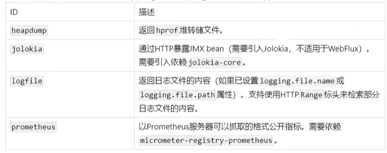

# SpringBoot Actuator 笔记

## 1. 简介

未来每个微服务在云上部署以后,我们都需要对其进行监控、追踪、审计、控制等。 SpringBoot就抽取了 Actuator场景,使得
我们每个微服务快速引用即可获得生产级别的应用监控、审计等功能。

```xml
<!--springboot Actuator-->
<dependency>
    <groupId>org.springframework.boot</groupId>
    <artifactId>spring-boot-starter-actuator</artifactId>
</dependency>
```


## 2. 1.x与2x的不同 


## 3. 如何使用
* 引入场景

* 访问http://localhost:8080/actuator/**

* 暴露所有监控信息为HTTP

  ```yaml
  management:
    endpoints:
      enabled-by-default: true # 暴露所有端点
      web:
        exposure:
          include: '*' # 以web方式暴露所有端点
  ```

   

   


## 4. 监控端点

### 4.1 常使用的端点


果您的应用程序是Web应用程序( Spring MVC, Spring WebFluxi或 Jersey),则可以使用以下附加端点




其中最常用的Endpoint：

- **Health：监控状况**
- **Metrics：运行时指标**
- **Loggers：日志记录**


### 4.2 Health Endpoint

健康检查端点，我们一般用于在云平台，平台会定时的检查应用的健康状况，我们就需要Health Endpoint可以为平台返回当前应用的一系列组件健康状况的集合。

重要的几点：

* health endpoint返回的结果，应该是一系列健康检查后的一个汇总报告。
* 很多的健康检查默认已经自动配置好了，比如：数据库、redis等。

可以很容易的添加自定义的健康检查机制。

 

**开启详细信息**

```yaml
management:
  endpoints: #对某一个端点进行配置
    enabled-by-default: true # 暴露所有端点
    web:
      exposure:
        include: '*' # 以web方式暴露所有端点
  endpoint: #对指定端点配置
    health:
      show-details: always # 显示所有信息
```

 

 

### 4.3 Metrics Endpoint

提供详细的、层级的、空间指标信息，这些信息可以被pull（主动推送）或者push（被动获取）方式得到：

* 通过Metrics对接多种监控系统。
* 简化核心Metrics开发。
* 添加自定义Metrics或者扩展已有Metrics。

访问：http://localhost:8002/actuator/metrics 显示所有信息

 

 


## 5. 可视化

1. 创建服务端项目spring-boot-admin

2. 引入服务端依赖

   ```xml
   <dependency>
       <groupId>org.springframework.boot</groupId>
       <artifactId>spring-boot-starter-web</artifactId>
   </dependency>
   <!--Actuator 可视化服务端-->
   <dependency>
       <groupId>de.codecentric</groupId>
       <artifactId>spring-boot-admin-starter-server</artifactId>
       <version>2.3.1</version>
   </dependency>
   ```

3. 在启动类上加注解开启服务

   ```java
   package com.lyx.boot;
   
   import de.codecentric.boot.admin.server.config.EnableAdminServer;
   import org.springframework.boot.SpringApplication;
   import org.springframework.boot.autoconfigure.SpringBootApplication;
   
   /**
    * @Description: Actuator监控可视化启动类
    * @ClassName: AdminMain8088
    * @Author: 吕总
    * @Date: 2021/9/14 16:39
    * @Version: 1.0
    */
   @SpringBootApplication
   @EnableAdminServer
   public class AdminMain8088 {
       public static void main(String[] args) {
           SpringApplication.run(AdminMain8088.class, args);
       }
   }
   ```

4. 客户端（被监控的服务）引入依赖

   ```xml
   <dependency>
       <groupId>org.springframework.boot</groupId>
       <artifactId>spring-boot-starter-web</artifactId>
   </dependency>
   <!--springboot Actuator-->
   <dependency>
       <groupId>org.springframework.boot</groupId>
       <artifactId>spring-boot-starter-actuator</artifactId>
   </dependency>
   <!--Actuator 可视化客户端-->
   <dependency>
       <groupId>de.codecentric</groupId>
       <artifactId>spring-boot-admin-starter-client</artifactId>
       <version>2.3.1</version>
   </dependency>
   ```

5. 客户端修改yaml配置

   ```yaml
   spring:
     application:
       name: stock-service
     boot:
       admin:
         client:
           url: http://localhost:8088 # 可视化Actuator地址
           instance:
             prefer-ip: true # 当前实例注册用实例的地址，默认是主机名
   management:
     endpoints: #对某一个端点进行配置
       enabled-by-default: true # 暴露所有端点
       web:
         exposure:
           include: '*' # 以web方式暴露所有端点
     endpoint: #对指定端点配置
       health:
         show-details: always # 显示所有信息
   ```

6. 分别启动两个服务

7. 访问测试

    