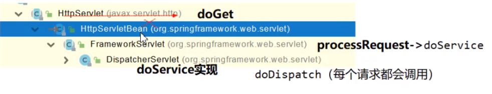
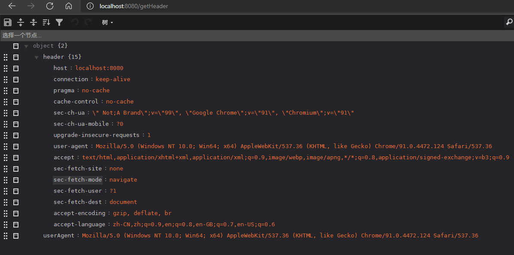

# SpringBoot2教程

## 1. SpringBoot入门案例

### 1.1 系统要求

* Java 8 & 兼容Java 14
* Maven 3.3+
* idea 2019.1.2

### 1.2 Maven设置

settings.xml

```xml
<mirrors>
    <mirror>
        <id>alimaven</id>
        <name>aliyun maven</name>
        <url>http://maven.aliyun.com/nexus/content/groups/public/</url>
        <mirrorOf>central</mirrorOf>       
    </mirror> 
</mirrors>

<profiles>
    <profile>
        <id>jdk-1.8</id>
        <activation>
            <activeByDefault>true</activeByDefault>
            <jdk>1.8</jdk>
        </activation>
        <properties>
            <maven.compiler.source>1.8</maven.complier.source>
            <maven.compiler.target>1.8</maven.compiler.target>
            <maven.compiler.compilerVersion>1.8</maven.compiler.compilerVersion>
        </properties>
    </profile>
</profiles>
```


### 1.3 入门案例 Hello World

> 需求：浏览器发送/hello请求，相应 Hello， SpringBoot2


#### 1.3.1 创建Maven工程


#### 1.3.2 引入依赖

1. 添加父工程做依赖管理

   ```xml
   <parent>
       <groupId>org.springframework.boot</groupId>
       <artifactId>spring-boot-starter-parent</artifactId>
       <version>2.3.4.RELEASE</version>
   </parent>
   ```

   

2. 导入springBoot的web场景启动器

   ```xml
   <dependencies>
       <!--web场景启动器-->
       <dependency>
           <groupId>org.springframework.boot</groupId>
           <artifactId>spring-boot-starter-web</artifactId>
       </dependency>
   </dependencies>
   ```

   

#### 1.3.3 创建主程序

==默认主程序所在包及其下面的所有子包里面的所有组件都会被默认扫描进来==


```java
package com.lyx.boot;

import org.springframework.boot.SpringApplication;
import org.springframework.boot.autoconfigure.SpringBootApplication;

/**
 * 主程序类
 * @SpringBootApplication: 声明这是一个springBoot应用
 */
@SpringBootApplication
//@SpringBootApplication(scanBasePackages = "com.lyx")  //修改默认扫描的包路径
public class MainApplication {
    public static void main(String[] args) {
        SpringApplication.run(MainApplication.class, args);
    }
}

```


#### 1.3.4 编写业务

```java
package com.lyx.boot.controller;

import org.springframework.web.bind.annotation.RequestMapping;
import org.springframework.web.bind.annotation.RestController;

@RestController
public class UserController {

    @RequestMapping("/hello")
    public String hello(){
        return "hello springBoot, hello world !";
    }
}

```


#### 1.3.5 测试


#### 1.3.6 简化配置


#### 1.3.7 简化部署

```xml
<build>
    <plugins>
        <plugin>
            <groupId>org.springframework.boot</groupId>
            <artifactId>spring-boot-maven-plugin</artifactId>
        </plugin>
    </plugins>
</build>
```

* 导出项目为jar包

  

* 使用cmd运行jar

  


### 1.4 依赖管理特性

* 添加的父工程几乎声明了所有开发中常用的依赖的版本号

* 自动版本仲裁机制

  * 修改依赖版本

    * 在spring-boot-dependencies中查看依赖的key

    * 在当前项目properties中重新定义版本

      ```xml
      例如：更换mysql版本
      <properties>
          <mysql.version>5.1.43</mysql.version>
      </properties>
      ```

      

#### 1.4.1 starter场景启动器

1. sprng中场景启动器命名规则：spring-boot-starter-*  

2. 只要引入starter，这个场景的所有常规需要的依赖我们都自动导入

3. springBoot中所有的场景启动器[SpringBoot Starter](https://docs.spring.io/spring-boot/docs/2.3.12.RELEASE/reference/html/using-spring-boot.html#using-boot-starter)

4.  第三方springBoot启动器命名规则：*-srping-boot-starter

5. 所有springboot最底层依赖

   ```xml
   <!--springBoot自动配置核心依赖-->
   <dependency>
       <groupId>org.springframework.boot</groupId>
       <artifactId>spring-boot-starter</artifactId>
       <version>2.3.4.RELEASE</version>
       <scope>compile</scope>
   </dependency>
   ```

   

   

## 2. springBoot注解配置

### 2.1 @Configuration

```java
package com.lyx.boot.config;

import com.lyx.boot.pojo.User;
import org.springframework.context.annotation.Bean;
import org.springframework.context.annotation.Configuration;

/**
 * 1.配置类里使用@Bean标注在方法上，给容器添加组件，默认组件是单例的
 * 2.配置了本身也是一个组件
 * 3.proxyBeanMethods默认值为true，表示使用代理对象调用方法，springBoot调用该组件总会检查这个组件是否在容器中，
 *   如果该组件在容器中，则不会创建新的对象，保持组件的单实例
 *   如果proxyBeanMethods的值为false，则每次调用的都是新创建的实例
 *      Full(proxyBeanMethods = true):全配置模式
 *      Lite(proxyBeanMethods = false):轻量配置模式
 *      当配置类中的组件被的组件依赖的时候proxyBeanMethods = true
 *      当配置类中的组件不被的组件依赖的，单独存在时候proxyBeanMethods = false
 */
@Configuration(proxyBeanMethods = true) //告诉springBoot这是一个配置类，相当于spring工程的application.xml文件
public class MyConfig {

    /**
     * 相当于spring工程在application.xml中配的bean标签
     * 返回值类型为就是组件的类型
     * 返回值就是组件在容器中的势力
     * 默认组件组件实例的名字为类名 可使用value更改
     */
    @Bean(value = "user02")
    public User user01(){
        return new User(1,"张三", "123456", 23, "2020-6-6");
    }
}
```


### 2.2 组件注册

#### 2.2.1 给容器注入组件的方法

1. 包扫描 + 注解（ @Bean,@Component,@Controller,@Service,@Repository）
2. @Bean 导入第三方包里的组件
3. @Import 使用空构造方法导入第三方包里的组件


#### 2.2.2  @ComponentScan + @Component,@Controller,@Service,@Repository

```java
@ComponentScan("com.lyx")  //修改springBoot默认的包扫描路径，可写在springBoot主配置类上，或任意配置类上
```


>@Component,@Controller,@Service,@Repository
>
>这些注解的用法和原生spring的中的用法相同，只要写在springBoot扫描的包下即可。


#### 2.2.3 @Bean

```java
/**
  * 相当于spring工程在application.xml中配的bean标签
  * 返回值类型为就是组件的类型
  * 返回值就是组件在容器中的势力
  * 默认组件组件实例的名字为全类名 可使用value更改
  */
@Bean(value = "user02")
@ConditionalOnBean(name = "role")  //表示当容器中有role组件时才会注册该组件
public User user01(){
    return new User(1,"张三", "123456", 23, "2020-6-6");
}
```


#### 2.2.3,@Import

```java
@Import({User.class, Role.class})  //使用空构造器注册组件，默认组件名为类的全类名
```


### 2.3 @Conditional

> 条件装配：满足Conditional指定的条件，则进行装配(将组件注册到容器中去)
>
> 可写在类上，也可以写在方法上


```java
@Bean(value = "user02")
@ConditionalOnBean(name = "role")  //表示当容器中有role组件时才会注册该组件
public User user01(){
    return new User(1,"张三", "123456", 23, "2020-6-6");
}
```


### 2.4 @ImportResource

```xml
@ImportResource("classpath:bean.xml") //导入spring的xml类型的配置文件
```


### 2.5 配置绑定

java文件读取properties文件的方法

1. @Component + @ ConfigurationProperties

   ```java
   package com.lyx.boot.pojo;
   
   import lombok.AllArgsConstructor;
   import lombok.Data;
   import lombok.NoArgsConstructor;
   import org.springframework.boot.context.properties.ConfigurationProperties;
   import org.springframework.stereotype.Component;
   
   @Data
   @AllArgsConstructor
   @NoArgsConstructor
   @Component //将car放入到容器中，只有放入容器的类才能使用springBoot的功能
   @ConfigurationProperties(prefix = "car")  //将配置文件的前缀为car进行数据的绑定，将car的下级的名字和属性名相同进行绑定
   public class Car {
       private String name;
       private Double price;
   }
   ```

   

2. @EnableConfigurationProperties + @ConfigurationProperties

   @ConfigurationProperties 写在需要配置绑定的java类上

   ```java
   package com.lyx.boot.pojo;
   
   import lombok.AllArgsConstructor;
   import lombok.Data;
   import lombok.NoArgsConstructor;
   import org.springframework.boot.context.properties.ConfigurationProperties;
   
   @Data
   @AllArgsConstructor
   @NoArgsConstructor
   @ConfigurationProperties(prefix = "car")  //将配置文件的前缀为car进行数据的绑定，将car的下级的名字和属性名相同进行绑定
   public class Car {
       private String name;
       private Double price;
   }
   ```

   

   @EnableConfigurationProperties 写在配置类上

   ```java
   package com.lyx.boot.config;
   
   import org.springframework.boot.context.properties.EnableConfigurationProperties;
   
   
   @EnableConfigurationProperties(Car.class) //开启car的绑定配置功能，并经car放入容器中
   public class MyConfig {
   
   
   }
   
   ```

   

## 3. 自动配置原理入门

### 3.1 引导加载自动配置

```java
@SpringBootConfiguration
@EnableAutoConfiguration
@ComponentScan(
    excludeFilters = {@Filter(
    type = FilterType.CUSTOM,
    classes = {TypeExcludeFilter.class}
), @Filter(
    type = FilterType.CUSTOM,
    classes = {AutoConfigurationExcludeFilter.class}
)}
)
public @interface SpringBootApplication {
    ...
}
```

> @@SpringBootApplication = @SpringBootConfiguration + @EnableAutoConfiguration + @ComponentScan

1. **@SpringBootConfiguration**

   相当于@Configuraion，告诉springBoot这是一个配置类

2.  **@ComponentScan** 

   告诉springboot扫描哪些包

3. **@EnableAutoConfiguration**

   ```java
   @AutoConfigurationPackage
   @Import({AutoConfigurationImportSelector.class})
   public @interface EnableAutoConfiguration {
       ...
   }
   ```

   * @AutoConfigurationPackage

     ```java
     @Import({Registrar.class})  
     public @interface AutoConfigurationPackage {
         ...
     }
     //利用register给容器中导入一系列组件
     //将指定的一个包下的所有组件导进来： MainApplicaion所在包下
     ```

     

   * @Import({AutoConfigurationImportSelector.class})

     ```java
     getAutoConfigurationEntry(annotationMetadata);
     //利用getAutoConfigurationEntry导入大量组件
     ```

     

   * [自动配置入门讲解](https://www.bilibili.com/video/BV19K4y1L7MT?p=14&spm_id_from=pageDriver)

   

## 4. 最佳实践

* 引入场景依赖

  * [SpringBoot Starter](https://docs.spring.io/spring-boot/docs/2.4.8/reference/html/using-spring-boot.html#using-boot-starter)

* 查看自动配置了哪些（选做)

  * 自己分析，引入场景对应的自动配置一般都生效了哪些

  * 配置文件中debug=true开启自动配置报告

    * 生效的

      

    * 不生效的

      

* 是否需要修改

  * 参照文档修改配置
  * 自定义加入或者替换组件


## 5. 开发小技巧

1. Lombok

   > 可以简化javaBean的开发

   * idea中搜索Lombok插件进行安装

   * 引入依赖

     ```xml
     <dependency>
         <groupId>org.projectlombok</groupId>
         <artifactId>lombok</artifactId>
     </dependency>
     ```

     

   *  加上注解

     * 简化javaBean开发

       ```java
       package com.lyx.boot.pojo;
       
       import lombok.AllArgsConstructor;
       import lombok.Data;
       import lombok.NoArgsConstructor;
       
       @Data // getter setter toString等方法
       @AllArgsConstructor  //全参数构造
       @NoArgsConstructor  //无参构造
       public class User {
           private Integer id;
           private String name;
           private String password;
           private Integer age;
           private String birthday;
       }
       ```

       

     * 简化日志开发

       ```java
       package com.lyx.boot.pojo;
       
       import lombok.AllArgsConstructor;
       import lombok.Data;
       import lombok.NoArgsConstructor;
       import lombok.extern.slf4j.Slf4j;
       
       @Data
       @AllArgsConstructor
       //@NoArgsConstructor
       @Slf4j  //加入日志注解
       public class User {
           private Integer id;
           private String name;
           private String password;
           private Integer age;
           private String birthday;
       
           public User() {
               log.info("进入User...");  //简化日志开发
           }
       }
       ```


2.  devtools

   > 热更新技术，修改完后入药ctrl+f9重新编译下

   ```
   <!--springBoot热更新-->
   <dependency>
       <groupId>org.springframework.boot</groupId>
       <artifactId>spring-boot-devtools</artifactId>
       <optional>true</optional>
   </dependency>
   ```


3. spring Initializr

   idea构建springBoot项目时可手动选择需要加入的starter，并搭建好springboot的基础架构

   

   

   

## 6. 配置文件

### 6.1 文件类型

#### 6.1.1 properties

同以前的properties用法

#### 6.1.2 yaml

##### 1. 简介

YAML是 "YAML Ain`t Markup Language"(YAML不是一种标记语言)的递归缩写。在开发这种语言时，yaml的意思其实是： "Yet Another Markup Language"(仍是一种递归语言)

非常适合用来做以数据为中心的配置文件

==application.properties与application.yaml同时存在同时生效，都是springBoot的配置文件==

##### 2.基本语法

* key: value; kv之间有空格
* 大小写敏感
* 使用缩进表示层级关系
* 缩进不允许使用tab，只允许使用空格
* 缩进的空格数不重要，只要相同层级的元素左对齐即可
* '#'表示注释
* ==`“`与`'`表示字符串内容会被`转义`/`不转义`==

##### 3. 数据类型

* 字面量：单个的，不可再分的值。date，boolean，string，number，null

  ```yaml
  k: v
  ```

  

* 对象：键值对的集合。map, hash, set, object

  ```yaml
  #行内写法
  k: {k1: v1,k2: v2,k3: v3}
  #或
  k:
    k1: v1
    k2: v2
    k3: v3
  ```

  

*  数组：一组按次序排列的值。array， list，queue

  ```yaml
  #行内写法
  K: [v1,v2,v3]
  #或者
  k:
    - v1
    - v2
    - v3
  ```


##### 4.快速体验

1. pojo类

   ```java
   //User
   package com.lyx.boot.pojo;
   
   import lombok.Data;
   import org.springframework.boot.context.properties.ConfigurationProperties;
   import org.springframework.stereotype.Component;
   
   import java.util.Date;
   import java.util.List;
   import java.util.Map;
   
   @Data
   @Component
   @ConfigurationProperties(prefix = "user01")
   public class User {
       private Integer id;
       private String name;
       private Date birthday;
       private List<String> likes;
       private List<Car> cars;
       private Map<String, Double> carPrice;
   }
   
   //Car
   package com.lyx.boot.pojo;
   
   import lombok.Data;
   
   @Data
   public class Car {
       private String id;
       private String name;
   }
   ```

   

2. yaml

   ```yaml
   user01:
     id: 1
     name: 张三
     birthday: 1998/5/15
     likes:
       - 乒乓球
       - 足球
       - 篮球
     cars:
       - {id: 1,name: byd}
       - id: 2
         name: bwm
     carPrice:
       byd: 100000
   ```

   

##### 5. 提示信息

```xml
!--配置文件提示信息-->
<dependency>
    <groupId>org.springframework.boot</groupId>
    <artifactId>spring-boot-configuration-processor</artifactId>
    <optional>true</optional>
</dependency>
```


## 7. web开发

### 7.1 springMVC自动配置概览

Spring Boot provides auto-configuration for Spring MVC that works with most applications.(大多场景我们都无需自定义配置）

The auto-configuration adds the following features on top of Spring's defaults：

* Inclusion of ContentNegotiatingViewResolver and BeanNameViewResolver beans.
  * 内容协商视图解析器和BeanName视图解析器
* Support for serving static resources, including support for WebJars (covered later in this document)).
  * 静态资源（包括webjars)
* Automatic registration of converter, Genericconverter, and Formatter beans.
  * 自动注册converter,Genericconverter,Formatter
* Support for HttpMessageConverters (covered later in this document).
  * 支持HttpMessageConverters(后来我们配合内容协商理解原理）
* Automatic registration of MessageCodesResolver (covered later in this document).
  * 自动注册MessageCodesResolver(国际化用）
* Static index.html support.
  * 静态index.html页支持
* Custom Favicon support (covered later in this document).
  * 自定义Favicon
* Automatic use of a ConfigurablewebBindingInitializer bean(covered later in this document).
  * 自动使用configurablewebBindingInitializer,(DataBinder负责将请求数据绑定到JavaBean上）


### 7.2 简单功能分析

#### 7.2.1 静态资源访问

##### 1. 静态资源目录

* 类路径下
  * static
  * resources
  * public
  * META-INF
    * resources

> 只要静态资源文件放在静态资源目录下，就可以通过`根目录/` +` 静态资源名`的方式访问到。
>
> 拦截原理：静态资源映射`/**`
>
> 请求进来，先去找Controller看能不能处理，不能处理的所有请求都会交给静态资源处理器,如果静态资源也找不到则会404。==当静态资源名与Controller映射的名称相同时，会优先处理Controller的请求。==


##### 2. 静态资源访问前缀

* 默认无前缀，访问方法：项目根路径 + 静态资源名

* 修改静态资源前缀

  ```yaml
  spring:
    mvc:
      static-path-pattern: /res/**
  ```

  访问方法: 项目根路径/ + 前缀 + 静态资源名

  ==注意：仅仅修改的访问的前缀，并没有修改访问的路径==


##### 3. 支持webjars访问

webjars官网：[WebJars - 官网](https://www.webjars.org/)

* 引入依赖

  ```xml
  <dependency>
      <groupId>org.webjars</groupId>
      <artifactId>jquery</artifactId>
      <version>3.6.0</version>
  </dependency>
  ```

  

* 访问

  

  ```url
  http://localhost:8080/webjars/jquery/3.6.0/jquery.js
  ```

  

#### 7.2.2 欢迎页支持

* 静态资源路径下 index.html
  * 可以配置静态资源路径
  * **但是不可以配置静态资源的访问前缀。否则导致 index.html不能被默认访问**
* 网站图标favicon.ico放在静态资源路径下
  * 可以配置静态资源路径
  * **但是不可以配置静态资源的访问前缀。否则导致 index.html不能被默认访问**


### 7.3 请求参数

#### 1. 请求映射

* @xxxMapping;

* Rest风格支持（使用HTP请求方式动词来表示对资源的操作）

  * 以前：/getUser获取用户 /deleteUser删除用户 /updateUser修改用户 /saveUser保存用户

  * 现在：/user GET-获取用户 DELETE-删除用户 PUT-修改用户 POST-保存用户

  * 核心Filter; HiddenHttpMethodFilter

    * 用法：表单method=post, 隐藏域 _method = POST/GET/DELETE/PUT

    * SpringBoot默认关闭REST风格请求，需要手动开启

      * ```yaml
        spring:
          mvc:
            hiddenmethod:
              filter:
                enabled: true  #开启页面表单的REST风格请求
        ```

        

```java
package com.lyx.boot.controller;

import org.springframework.web.bind.annotation.*;

@RestController
public class UserController {

//    @RequestMapping(value = "/user", method = RequestMethod.GET)
    @GetMapping("/user")
    public String getUser(){
        return "GET-user";
    }
//    @RequestMapping(value = "/user", method = RequestMethod.POST)
    @PostMapping("/user")
    public String saveUser(){
        return "POST-user";
    }
//    @RequestMapping(value = "/user", method = RequestMethod.PUT)
    @PutMapping("/user")
    public String updateUser(){
        return "PUT-user";
    }
//    @RequestMapping(value = "/user", method = RequestMethod.DELETE)
    @DeleteMapping("/user")
    public String deleteUser(){
        return "DELETE-user";
    }
}
```


```html
<form action="/user" method="post">
    <input type="submit" value="POST REQUEST">
</form>
<form action="/user" method="GET">
    <input type="submit" value="GET REQUEST">
</form>
<form action="/user" method="post">
    <input type="hidden" name="_method" value="PUT">
    <input type="submit" value="PUT REQUEST">
</form>
<form action="/user" method="post">
    <input type="hidden" name="_method" value="DELETE">
    <input type="submit" value="DELETE REQUEST">
</form>
```

==注意：PUT / DELETE 请求需要发送name为_method参数为PUT \ DELETE==


Rest原理（表单提交要使用REST的时候）

* 表单提交会带上 **`_method=PUT`**
* 请求过来被 **HiddenHttpMethodFilter**拦截
* 请求是否正常，并且是**POST**
  * 获取到**`_method`**的值。
  * 兼容以下请求；**PUT / DELETE/PATCH**
  * 原生request(post),包装模式requesWrapper重写了getMethod方法，返回的是传入的值。
  * 过滤器链放行的时候用wrapper以后的方法调用getMethod是调用requesWrapper的。
  * Rest使用客户端工具，
    * 如PostMan直接发送Put、delete等方式请求，无需Filter。


自定义**HiddenHttpMethodFilter**

> springBoot 默认使用自己的**HiddenHttpMethodFilter**，当自己创建了**HiddenHttpMethodFilter**就会使用自己创建的。

```java
package com.lyx.boot.config;

import org.springframework.context.annotation.Bean;
import org.springframework.context.annotation.Configuration;
import org.springframework.web.filter.HiddenHttpMethodFilter;

@Configuration(proxyBeanMethods = false)
public class WebConfig {

    @Bean
    public HiddenHttpMethodFilter hiddenHttpMethodFilter(){
        HiddenHttpMethodFilter methodFilter = new HiddenHttpMethodFilter();
        methodFilter.setMethodParam("_m");
        return methodFilter;
    }
}

```


##### 2. 请求映射原理




### 7.4 普通参数与基本注解

* 注解

  @PathVariable、@RequestHeader、@ModelAttribute、@RequestParam、@MatrixVariable、@CookieValue
  @RequestBody

* Servlet API: agugucom

  WebRequest、ServletRequest、MultipartRequest、HttpSession、javax.servlet.http.PushBuilder、Principal、
  InputStream、Reader、HttpMethod、Locale、TimeZone、Zoneld

* 复杂参数：

  Map、Errors/BindingResult、Model、RedirectAttributes、ServletResponse、SessionStatus、
  UriComponentsBuilder、ServletUriComponentsBuilder

* 自定义对象参数：

  可以自动类型转换与格式化，可以级联封装。


#### 7.4.1 注解

##### 1. @PathVariable

> 前端发送Rest风格请求，使用@PathVariable进行数据绑定

```java
//前端请求：/getCar/1/byd/100000
@GetMapping("/getCar/{id}/{name}/{price}")
public Map<String, Object> getCar(
    @PathVariable("id") Integer id,
    @PathVariable("name") String name,
    @PathVariable("price") Double price,
    @PathVariable Map<String, String> pv //将所有的参数全部放在map中，k：@GetMapping中{}中的值，v：请求中对应的值
){
    Map<String, Object> map = new HashMap<>();
    map.put("id", id);
    map.put("name", name);
    map.put("price", price);
    map.put("pv", pv);
    return map;
}
```


 


##### 2. @RequestHeader

> 获取请求头信息

```java
    //前端请求：/getHeader
    @GetMapping("/getHeader")
    public Map<String, Object> getHeader(
            @RequestHeader("User-Agent") String userAgent, //获取请求头中某一项的信息
            @RequestHeader Map<String, String> header  //获取所有请求头中的信息
    ){
        Map<String, Object> map = new HashMap<>();
        map.put("userAgent", userAgent);
        map.put("header", header);
        return map;
    }
```


 


##### 3. @RequestParam

> 接收普通请求

```java
//前端请求：/getParam?id=22&names=zs&names=ls
@GetMapping("/getParam")
public Map<String, Object> getParam(
    @RequestParam("id")Integer id,
    @RequestParam("names")List<String> names,
    @RequestParam Map<String, Object> reqMap  //多选框的值只能接收第一个
){
    Map<String, Object> map = new HashMap<>();
    map.put("id", id);
    map.put("names", names);
    map.put("map", reqMap);
    return map;
}
```

 


##### 4. @CookieValue

> 得到Cookie

```java
//前端请求：/setCookie
@GetMapping("/setCookie")
public String setCookie(HttpServletResponse response){
    Cookie cookie1 = new Cookie("name", "zs");
    Cookie cookie2 = new Cookie("age", "18");
    response.addCookie(cookie1);
    response.addCookie(cookie2);
    return "cookie 设置成功！";
}

//前端请求：getCookie
@GetMapping("/getCookie")
public void getCookie(
    @CookieValue("name") String name, //得到Cookie值
    @CookieValue("name") Cookie cookie //得到Cookie对象
){
    System.out.println("name:"+name);
    System.out.println("cookie:"+cookie);
}
```


##### 5. @RequestBody

> 得到json格式数据

```html
<form action="/save" method="post">
    <label> Name:
        <input type="text" name="name" />
    </label>
    <label> password:
        <input type="password" name="password" />
    </label>
    <input type="submit" value="submit">
</form>
```


```java
//前端请求：getCookie
@PostMapping("/save")
public Map<String, Object> save(
    @RequestBody String content,
    @RequestParam("name") String name
){
    Map<String, Object> map = new HashMap<>();
    map.put("content", content);
    map.put("name", name);
    return map;
}
```


##### 6. @RequestAttribute

> 得到Request域中的值

```java
@GetMapping("/req")
public String req(HttpServletRequest request){
    request.setAttribute("name", "zs");
    request.setAttribute("password", "12345");
    return "forward:/success";
}

@GetMapping("/success")
@ResponseBody
public Map<String, Object> success(@RequestAttribute("name")String name,
                                   @RequestAttribute("password")String password){
    Map<String, Object> map = new HashMap<>();
    map.put("name", name);
    map.put("pwd", password);
    return map;
}
```


##### 7. @MatrivVariable

> 查询字符串格式：/save/{path}?xxx=xxx&yyy=yyy
>
> 矩阵变量格式：/save/path;xxx=xxx,yyy=yyy,ooo,ppp

* 开启矩阵变量

  ```java
  package com.lyx.boot.config;
  
  import org.springframework.context.annotation.Configuration;
  import org.springframework.web.servlet.config.annotation.PathMatchConfigurer;
  import org.springframework.web.servlet.config.annotation.WebMvcConfigurer;
  import org.springframework.web.util.UrlPathHelper;
  
  @Configuration
  public class WebConfig implements WebMvcConfigurer {
      @Override
      public void configurePathMatch(PathMatchConfigurer configurer) {
          UrlPathHelper urlPathHelper=new UrlPathHelper();
          urlPathHelper.setRemoveSemicolonContent(false);
          configurer.setUrlPathHelper(urlPathHelper);
      }
  }
  ```


```java
//前端请求：/cars/shell;low=25;brand=byd,yd
@GetMapping("/cars/{path}")
@ResponseBody
public Map<String, Object> carsShell(@MatrixVariable("low")Integer low,
                                     @MatrixVariable("brand")List<String> brand,
                                     @PathVariable("path")String path){
    Map<String, Object> map = new HashMap<>();
    map.put("low", low);
    map.put("brand", brand);
    map.put("path", path);
    return map;
}
```


```java
//前端请求：/cars2/1;age=1/2;age=2
@GetMapping("/cars2/{path1}/{path2}")
@ResponseBody
public Map<String, Object> carsShell2(@MatrixVariable(value = "age", pathVar = "path1")Integer age1,
                                      @MatrixVariable(value = "age", pathVar = "path2")Integer age2){
    Map<String, Object> map = new HashMap<>();
    map.put("age1", age1);
    map.put("age2", age2);
    return map;
}
```


#### 7.4.2 复杂参数

**Map、Model(map、model里面的数据会被放在request的请求域request.setAttribute)**、Errors/BindingResult、**RedirectAttributes(重定向携带数据）**、ServletResponse(response)、SessionStatus、UriComponentsBuilder、ServletUriComponentsBuilder


### 7.5 数据响应与内容协商

 


### 7.6 Thymeleaf

#### 7.6.1 基本语法

| 表达式名称 | 语法   | 用途                          |
| ---------- | ------ | ----------------------------- |
| 变量取值   | ${...} | 获取请求域，session域，对象等 |
| 选取变量   | *{...} | 获取上下文对象                |
| 消息       | #{...} | 获取国际化等值                |
| 连接       | @{...} | 生成连接                      |
| 片段表达式 | ~{...} | jsp:include作用，引入公共页面 |

