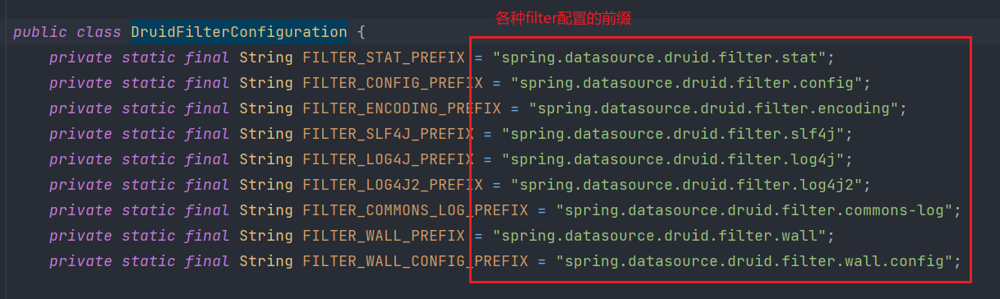
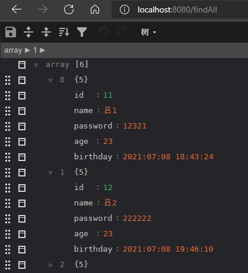
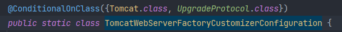

# springBoot基础

## 1. springBoot概述

> SpringBoot提供了一种快速使用Spring的方式，基于约定优于配置的思想，可以让开发人员不必在配置与逻
> 辑业务之间进行思维的切换，全身心的投入到逻辑业务的代码编写中，从而大大提高了开发的效率，一定程度
> 上缩短了项目周期。2014年4月，SpringBoot1.0.0发布。Spring的顶级项目之一（[springBoot官网](https://spring.io/))。

 


### 1.1 springBoot功能

1. **自动配置**

   Spring Boot的自动配置是一个运行时（更准确地说，是应用程序启动时）的过程，考虑了众多因素，才决定Spring配置应该用哪个，不该用哪个。该过程是SpringBoot自动完成的。

2. **起步依赖**
   起步依赖本质上是一个Maven项目对象模型（Project Object Model,POM),定义了对其他库的传递依赖,这些东西加在一起即支持某项功能。简单的说，起步依赖就是将具备某种功能的坐标打包到一起，并提供一些默认的功能。

3. **辅助功能**
   提供了一些大型项目中常见的非功能性特性，如嵌入式服务器、安全、指标，健康检测、外部配置等。

   ==SpringBoot 并不是对 Spring 功能上的增强，而是提供了一种快速使用Spring的方式。==


## 2. springBoot快速体验

### 2.1 需求

> 搭建SpringBoot工程，定义HelloController.hello()方法，返回"Hello SpringBoot!"。


### 2.2 实现步骤

1. 创建Maven项目

2. 导入SpringBoot起步依赖

   ```xml
   <!--springBoot需要的父工程，用于版本依赖管理-->
   <parent>
       <groupId>org.springframework.boot</groupId>
       <artifactId>spring-boot-starter-parent</artifactId>
       <version>2.5.2</version>
       <relativePath/> <!-- lookup parent from repository -->
   </parent>
   
   <!--springBoot WEB项目启动器-->
   <dependency>
       <groupId>org.springframework.boot</groupId>
       <artifactId>spring-boot-starter-web</artifactId>
   </dependency>
   ```

   

3. 定义Controller

   ```java
   package com.lyx.springboothelloworld.controller;
   
   import org.springframework.web.bind.annotation.RequestMapping;
   import org.springframework.web.bind.annotation.RestController;
   
   @RestController
   public class UserController {
   
       @RequestMapping("/hello")
       public String hello(){
           return "hello world , hello boot!";
       }
   }
   ```

   

4. 编写引导类

   ```java
   package com.lyx.springboothelloworld;
   
   import org.springframework.boot.SpringApplication;
   import org.springframework.boot.autoconfigure.SpringBootApplication;
   
   @SpringBootApplication
   public class SpringBootHelloworldApplication {
   
       public static void main(String[] args) {
           SpringApplication.run(SpringBootHelloworldApplication.class, args);
       }
   
   }
   ```

   

5. 启动测试

    


## 3. springBoot配置

### 3.1 配置文件分类

>Springboot是基于约定的,所以很多配置都有默认值,但如果想使用自己的配置替换默认配置的话,就可以使用**application.properties**或者 **application. yml**( **application. yaml**)进行配置。
>
>默认配置名：**application**
>
>同级别目录下优先级：
>
>**properties  > yml > yaml 高优先级的配置会覆盖掉低优先级的相同配置。**

* properties

  ```properties
  spring.port=8080
  ```

  

* yaml

  ```yaml
  spring:
  	port: 8080
  ```


### 3.2 yaml

>YAML全称是 YAML Ain' t Markup Language。YAML是—种直观的能够被电脑识别的的数据数据序列化格式,并且容易被人类阋读,容易和脚本语言交互的,可以被支持YAML库的不同的编程语言程序导入,比如:C ,C++,Ruby. Python,Java,Perl,C#,PHP等。YML文件是以数据为核心的,比传统的xm方式更加简洁。
>
>YAML文件的扩展名可以使用yml或者yaml

* properties

  ```properties
  server.port=8080
  server.address=127.0.0.1
  ```

  

* xml

  ```xml
  <server>
  	<port>8080</port>
      <address>127.0.0.1</address>
  </server>
  ```

  

* yml

  ```yaml
  server:
  	port: 8080
  	address: 127.0.0.1
  ```

  

#### 3.2.1 yaml基本语法

* 大小写敏感
* 数据值前边必须有空格，作为分隔符
* 使用缩进表示层级关系
* 缩进时不允许使用Tab键，只允许使用空格（各个系统Tab对应的空格数目可能不同，导致层次混乱）。
* 缩进的空格数目不重要，只要相同层级的元素左侧对齐即可
* #表示注释，从这个字符一直到行尾，都会被解析器忽略。
* ==`“`与`'`表示字符串内容会被`转义`/`不转义`==


#### 3.2.2 yaml数据类型

* 字面量：单个的，不可再分的值。date，boolean，string，number，null

  ```yaml
  k: v
  ```

  

* 对象：键值对的集合。map, hash, set, object

  ```yaml
  #行内写法
  k: {k1: v1,k2: v2,k3: v3}
  #或
  k:
    k1: v1
    k2: v2
    k3: v3
  ```

  

* 数组：一组按次序排列的值。array， list，queue

  ```yaml
  #行内写法
  K: [v1,v2,v3]
  #或者
  k:
    - v1
    - v2
    - v3
  ```


### 3.3 读取配置文件

#### 3.3.1 @Value

```yaml
msg1: 'hello \n world'
msg2: "hello \n world"

map:
  bwm: 1000000
  byd: 100000
  hq: 500000

list:
  - 1
  - 2
  - 3
  - 4
```


```java
package com.lyx.springboothelloworld.controller;

import org.springframework.beans.factory.annotation.Value;
import org.springframework.web.bind.annotation.RequestMapping;
import org.springframework.web.bind.annotation.RestController;

@RestController
public class UserController {

    @Value("${msg1}")
    private String msg1;

    @Value("${msg2}")
    private String msg2;

    @Value("${map.bwm}")
    private String map1;

    @Value("${list[0]}")
    private String list1;

    @RequestMapping("/hello")
    public String hello(){
        System.out.println(msg1);
        System.out.println(msg2);
        System.out.println(map1);
        System.out.println(list1);
        return "hello world , hello boot!";
    }
}
```


#### 3.3.2 Environment

```yaml
msg1: 'hello \n world'
msg2: "hello \n world"

map:
  bwm: 1000000
  byd: 100000
  hq: 500000

list:
  - 1
  - 2
  - 3
  - 4
```


```java
package com.lyx.springboothelloworld.controller;

import org.springframework.beans.factory.annotation.Autowired;
import org.springframework.beans.factory.annotation.Value;
import org.springframework.core.env.Environment;
import org.springframework.web.bind.annotation.RequestMapping;
import org.springframework.web.bind.annotation.RestController;

@RestController
public class UserController {


    @Autowired
    private Environment env;

    @RequestMapping("/hello")
    public String hello(){
        System.out.println(env.getProperty("msg1"));
        System.out.println(env.getProperty("msg2"));
        System.out.println(env.getProperty("map.bwm"));
        System.out.println(env.getProperty("list[0]"));
        return "hello world , hello boot!";
    }
}

```


#### 3.3.3 @ConfigurationProperties

```yaml
user01:
  id: 1
  name: 张三
  birthday: 1998/5/15
  likes:
    - 乒乓球
    - 足球
    - 篮球
  cars:
    - {id: 1,name: byd}
    - id: 2
      name: bwm
  carPrice:
    byd: 100000
```


```java
//User
package com.lyx.boot.pojo;

import lombok.Data;
import org.springframework.boot.context.properties.ConfigurationProperties;
import org.springframework.stereotype.Component;

import java.util.Date;
import java.util.List;
import java.util.Map;

@Data
@Component
@ConfigurationProperties(prefix = "user01")
public class User {
    private Integer id;
    private String name;
    private Date birthday;
    private List<String> likes;
    private List<Car> cars;
    private Map<String, Double> carPrice;
}

//Car
package com.lyx.boot.pojo;

import lombok.Data;

@Data
public class Car {
    private String id;
    private String name;
}
```


##### 3.3.3.1 代码提示

引入依赖

```xml
<dependency>
    <groupId>org.springframework.boot</groupId>
    <artifactId>spring-boot-configuration-processor</artifactId>
</dependency>
```

打包时排除依赖

```xml
<build>
    <plugins>
        <plugin>
            <groupId>org.springframework.boot</groupId>
            <artifactId>spring-boot-maven-plugin</artifactId>
            <configuration>
                <excludes>
                    <exclude>
                        <groupId>org.springframework.boot</groupId>
                        <artifactId>spring-boot-configuration-processor</artifactId>
                    </exclude>
                </excludes>
            </configuration>
        </plugin>
    </plugins>
</build>
```


### 3.4 profile

> 我们在开发Spring Boot应用时，通常同一套程序会被安装到不同环境，比如：开发、测试、生产等。其中数据库地址、服|等等配置都不同，如果果每次打包时，都要修改配置文件，那么非常麻烦。profile功能就是来进行动态配置切换的

1. profile配置方式
   * 多profile文件方式

     * 创建不同环境下的配置文件

       * application-pro.properties
       * application-test.properties
       * application-dev.properties

     * 在主配置文件中启用不同环境的配置

       ```properties
       spring.profiles.active=test
       ```

       

   * yml多文档方式

     ```yaml
     ---
     server:
       port: 8001
     spring:
       config:
         activate:
           on-profile: dev
     ---
     server:
       port: 8002
     spring:
       config:
         activate:
           on-profile: test
     ---
     server:
       port: 8083
     spring:
       config:
         activate:
           on-profile: pro
     ---
     
     spring:
       profiles:
         active: pro  #启用生产环境配置
     ```

     

1. profile激活方式
   * 配置文件
   
     * properties激活
   
       ```properties
       spring.profiles.active=test
       ```
   
       
   
     * yml激活
   
       ```yaml
       spring:
         profiles:
           active: pro  #启用生产环境配置
       ```
   
       
   
   * 虚拟机参数
   
     ```linux
     -Dspring.profiles.active=test
     ```
   
      
   
   * 命令行参数
   
     ```cmd
     --srping.profiles.active=test
     ```
   
      


### 3.5 内部配置加载顺序

springBoot程序启动时，会从以下位置加载配置文件：

1. `file:./config/`: **当前项目**下的/config目录下
2. `file:./`: **当前项**目根目录下
3. `classpath:/config/`: **classpath**的/config目录下
4. `classpath:/`:  **classpath**的根目录下

==加载顺序为上文的排列顺序，高优先配置的相同属性会生效，低优先级的不同属性也会生效==


### 3.6 外部配置加载顺序

1. 外部跟jar包同级目录的配置文件会被加载
2. 外部跟jar包同级目录的config目录下的配置文件会被加载


## 4. springBoot整合其它框架

### 4.1 springBoot整合Junit

**实现步骤：**

1. 搭建springBoot工程

2. 引入starter-test启动器

   ```xml
   <dependency>
       <groupId>org.springframework.boot</groupId>
       <artifactId>spring-boot-starter-test</artifactId>
       <scope>test</scope>
   </dependency>
   ```

   

3. 编写测试类

   ```java
   package com.lyx.boot;
   
   import com.lyx.boot.service.UserService;
   import org.junit.jupiter.api.Test;
   import org.springframework.beans.factory.annotation.Autowired;
   import org.springframework.boot.test.context.SpringBootTest;
   
   //@RunWith(SpringRunner.class) //新版本中去除该方法
   @SpringBootTest  //与启动类同级目录下可不指定启动类字节码文件
   public class UserServiceTest {
   
   }
   ```

   

4. 添加相关注解

   * @RunWith(SpringRunner.class)  
     * 最新版springBoot中已经去除该注解，无需标注，可直接使用
   * @SpringBootTest(classes = 启动类.class)
     * 与启动类同级目录下可不指定启动类字节码文件

5. 编写测试方法

   ```java
   @Autowired
   private UserService userService;
   
   @Test
   public void testHello(){
       userService.hello();
   }
   ```


## 5 springBoot整合MyBatis

### 5.1 数据源的自动配置

#### 1. 导入jdbc场景

```xml
<dependency>
    <groupId>org.springframework.boot</groupId>
    <artifactId>spring-boot-starter-data-jdbc</artifactId>
</dependency>
```

  


 **根据官方导入的依赖分析得到，并未导入数据库驱动，所以需要我们手动导入数据库启动**

```xml
<dependency>
    <groupId>mysql</groupId>
    <artifactId>mysql-connector-java</artifactId>
</dependency>
```

官方仲裁了版本

```xml
<mysql.version>8.0.25</mysql.version>
```

如果本机的mysql版本与官方不符可以修改版本

* 直接引入带版本的依赖（maven的就近依赖原则）

  ```xml
  <dependency>
      <groupId>mysql</groupId>
      <artifactId>mysql-connector-java</artifactId>
      <version>5.1.47</version>
  </dependency>
  ```

  

* 本项目中重新声明依赖版本（maven的属性就近优先原则）

  ```xml
  <mysql.version>5.1.47</mysql.version>
  ```

  

#### 2. 分析自动配置

* **springBoot自动配置包**

   

  * **jdbc相关自动配置包**

     

    * DataSourceTransactionMangerAutoConfiguration：事务管理器自动配置
    * JdbcTemplateAutoConfiguration：**JdbcTemplate的自动配置，可以对数据库进行crud操作**
      *  
      *  
    * JndiDataSourceAutoConfiguration：jndi的自动配置
    * XADataSourceAutoConfiguraion：分布式事务相关的配置

* **DataSrorceAutoConfiguration：数据源自动配置**

  * 修改数据源的配置，只需要修改前缀为`spring.datasource`的参数即可

     

  * 数据库连接池，自己没有设置，springBoot自动导入

    ```java
    @Configuration(proxyBeanMethods = false)
    @Conditional(PooledDataSourceCondition.class)
    @ConditionalOnMissingBean({ DataSource.class, XADataSource.class })
    @Import({ DataSourceConfiguration.Hikari.class, DataSourceConfiguration.Tomcat.class,
             DataSourceConfiguration.Dbcp2.class, DataSourceConfiguration.OracleUcp.class,
             DataSourceConfiguration.Generic.class, DataSourceJmxConfiguration.class })
    protected static class PooledDataSourceConfiguration {
    
    }
    ```

     

  *  底层默认创建好的数据连接池是：HikariDataSoruce

    ```java
    @Configuration(proxyBeanMethods = false)
    @ConditionalOnClass(HikariDataSource.class)
    @ConditionalOnMissingBean(DataSource.class)
    @ConditionalOnProperty(name = "spring.datasource.type", havingValue = "com.zaxxer.hikari.HikariDataSource",
                           matchIfMissing = true /*没有配置时，默认使用*/)
    static class Hikari {
    
        @Bean
        @ConfigurationProperties(prefix = "spring.datasource.hikari")
        HikariDataSource dataSource(DataSourceProperties properties) {
            HikariDataSource dataSource = createDataSource(properties, HikariDataSource.class);
            if (StringUtils.hasText(properties.getName())) {
                dataSource.setPoolName(properties.getName());
            }
            return dataSource;
        }
    
    }
    ```

* **修改配置项**

  ```yaml
  spring:
    datasource:
      driver-class-name: com.mysql.jdbc.Driver
      url: jdbc:mysql:///test
      username: root
      password: root
      type: com.zaxxer.hikari.HikariDataSource # spring默认导入的是HikariDataSource
  ```

  

### 5.2 使用Druid数据源

#### 5.2.1 Druid官方地址

* 项目地址：[GitHub - alibaba/druid: 阿里云计算平台DataWorks(https://help.aliyun.com/document_detail/137663.html) 团队出品，为监控而生的数据库连接池](https://github.com/alibaba/druid)
* 连接池介绍：[Druid连接池介绍 · alibaba/druid Wiki · GitHub](https://github.com/alibaba/druid/wiki/Druid连接池介绍)

**整合第三方技术的两种方式**

* 自定义
* 使用starter

#### 5.2.2 自定义方式

* 依赖

  ```xml
  <dependency>
      <groupId>com.alibaba</groupId>
      <artifactId>druid</artifactId>
      <version>1.1.21</version>
  </dependency>
  ```

  

* 配置类

  ```java
  package com.lyx.boot.config;
  
  import com.alibaba.druid.pool.DruidDataSource;
  import org.springframework.boot.context.properties.ConfigurationProperties;
  import org.springframework.context.annotation.Bean;
  import org.springframework.context.annotation.Configuration;
  
  import javax.sql.DataSource;
  
  @Configuration
  public class MyDataSourceConfiguration {
  
      @Bean
      @ConfigurationProperties("spring.datasource")
      public DataSource DruidDataSource(){
          return new DruidDataSource();
      }
  }
  ```

  

* 参数属性

  ```yaml
  spring:
    datasource:
      driver-class-name: com.mysql.jdbc.Driver
      url: jdbc:mysql:///test
      username: root
      password: root
  ```


##### 1. Druid的内置监控页面

**官方文档**：[Druid的内置监控页面](https://github.com/alibaba/druid/wiki/配置_StatViewServlet配置)

注册拦截器servlet

```java
@Bean
public ServletRegistrationBean<StatViewServlet> statViewServlet(){
    //注册拦截器
    ServletRegistrationBean<StatViewServlet> servletRegistrationBean = new ServletRegistrationBean<>();
    //添加拦截servlet
    servletRegistrationBean.setServlet(new StatViewServlet());
    //拦截的请求
    servletRegistrationBean.addUrlMappings("/druid/*");
    return  servletRegistrationBean;
}
```

访问连接：[Druid Stat Index](http://localhost:8888/druid/index.html)


##### 2. 开启sql监控功能

官方文档：[sql 监控](https://github.com/alibaba/druid/wiki/配置_StatViewServlet配置)

```java
@Bean
@ConfigurationProperties("spring.datasource")
public DataSource DruidDataSource() throws SQLException {
    DruidDataSource dataSource = new DruidDataSource();
    //开启sql监控
    dataSource.setFilters("stat");
    return dataSource;
}
```


##### 3. 开启web监控

```java
/**
  * WebStatFilter用于采集web-jdbc关联监控的数据。
  * @return org.springframework.boot.web.servlet.FilterRegistrationBean
  */
@Bean
public FilterRegistrationBean<WebStatFilter> webStatFilter(){
    FilterRegistrationBean<WebStatFilter> webStatFilterFilterRegistrationBean = new FilterRegistrationBean<>();
    webStatFilterFilterRegistrationBean.setFilter(new WebStatFilter());
    webStatFilterFilterRegistrationBean.addUrlPatterns("/*");
    webStatFilterFilterRegistrationBean.addInitParameter("exclusions","*.js,*.gif,*.jpg,*.png,*.css,*.ico,/druid/*");
    return webStatFilterFilterRegistrationBean;
}
```


##### 4. 开启sql防火墙

```java
@Bean
@ConfigurationProperties("spring.datasource")
public DataSource DruidDataSource() throws SQLException {
    DruidDataSource dataSource = new DruidDataSource();
    dataSource.setFilters("stat,wall");  //stat,wall : StatFilter统计在SQL执行时间内; stat,wall:StatFilter统计不在SQL执行时间内
    return dataSource;
}
```


#### 5.2.3 使用stater方式

* 映入stater依赖

  ```xml
  <dependency>
      <groupId>com.alibaba</groupId>
      <artifactId>druid-spring-boot-starter</artifactId>
      <version>1.1.17</version>
  </dependency>
  ```

  

*  分析自动配置

  * druid-spring-boot-stater包则自动配置类DruidDataSourcesAutoConfigure

      

  * DruidDataSoutceAutoConfigure

     

    * DruidStatViewServletConfiguraion

       

    * DruidWebStatFilterConfiguraion

      

    * DruidFilterConfiguration

       

    * DruidSrpingAopConfiguration

      

  * DruidStatProperties

    *  
    *  

* 编写配置文件

  ```yml
  spring:
    datasource:
      driver-class-name: com.mysql.jdbc.Driver
      url: jdbc:mysql:///test
      username: root
      password: root
      type: com.alibaba.druid.pool.DruidDataSource
      druid:
        stat-view-servlet:
          enabled: true  #开启Druid监控页
          login-username: admin2 #登录监控页用户名
          login-password: admin #登录监控页密码
          url-pattern: /druid/* #拦截的请求
          reset-enable: false #不允许重置
        web-stat-filter:
          url-pattern: /* #拦截的请求
          exclusions: '*.js,*.gif,*.jpg,*.png,*.css,*.ico,/druid/*' #排除的拦截
        filters: stat,wall
        filter:
          stat:
            log-slow-sql: true #记录超市sql
            slow-sql-millis: 2000 #设置超时时长
            enabled: true
          wall:
            enabled: true
  ```

  更多详细配置：[druid 配置](https://github.com/alibaba/druid/tree/master/druid-spring-boot-starter)


### 5.3 springBoot整合Mybatis

引入官方stater

```xml
<dependency>
    <groupId>org.mybatis.spring.boot</groupId>
    <artifactId>mybatis-spring-boot-starter</artifactId>
    <version>2.1.4</version>
</dependency>
```


#### 5.3.1 配置模式

##### 1. 分析自动配置

* SqlsessionFactory

  * 官方已将SqlsessionFactory放入到spring容器中

     

* Sqlsession

  *  官方已将Sqlsession放入到spring容器中

     

*  Mapper映射文件

  * 自动扫描映射文件

     

* Mapper接口

  * 自动扫描带@Mapper的接口

     


##### 2. 测试整合

1. 编写配置文件

   ```yaml
   mybatis:
     mapper-locations: classpath:mybatis/mapper/*.xml
   #  config-location: classpath:myBatisConfig.xml #配置mybatis全局配置文件位置，使用configuration就不能同时使用配置文件
     configuration:
       map-underscore-to-camel-case: true #驼峰命名规则
   ```

   

2. 编写Dao接口

   ```java
   package com.lyx.boot.mapper;
   
   import com.lyx.boot.pojo.User;
   import org.apache.ibatis.annotations.Mapper;
   
   import java.util.List;
   
   @Mapper
   public interface UserMapper {
       List<User> findAll();
   }
   
   ```

   

3. 编写mapper映射文件

   ```xml
   <?xml version="1.0" encoding="UTF-8" ?>
   <!DOCTYPE mapper PUBLIC "-//mybatis.org//DTD Mapper 3.0//EN" "http://mybatis.org/dtd/mybatis-3-mapper.dtd">
   <mapper namespace="com.lyx.boot.mapper.UserMapper">
       <select id="findAll" resultType="com.lyx.boot.pojo.User">
           select * from user
       </select>
   </mapper>
   ```

   

4. 编写Service接口和实现类

   * 接口

     ```java
     package com.lyx.boot.service;
     
     
     import com.lyx.boot.pojo.User;
     import java.util.List;
     
     public interface UserService {
     
         List<User> findAll();
     }
     ```

     

   * 实现类

     ```java
     package com.lyx.boot.service.impl;
     
     import com.lyx.boot.mapper.UserMapper;
     import com.lyx.boot.pojo.User;
     import com.lyx.boot.service.UserService;
     import org.springframework.beans.factory.annotation.Autowired;
     import org.springframework.stereotype.Service;
     
     import java.util.List;
     
     @Service
     public class UserServiceImpl implements UserService {
     
         @Autowired
         private UserMapper userMapper;
         @Override
         public List<User> findAll() {
             return userMapper.findAll();
         }
     }
     ```

     

5. 编写controller类

   ```controller
   package com.lyx.boot.controller;
   
   import com.lyx.boot.pojo.User;
   import com.lyx.boot.service.UserService;
   import org.springframework.beans.factory.annotation.Autowired;
   import org.springframework.web.bind.annotation.GetMapping;
   import org.springframework.web.bind.annotation.RequestMapping;
   import org.springframework.web.bind.annotation.RestController;
   
   import java.util.List;
   
   @RestController
   
       @Autowired
       private UserService userService;
   
       @GetMapping("/findAll")
       public List<User> findAll(){
           return userService.findAll();
       }
   
   }
   ```

   

6. 访问测试

    


##### 3. 小技巧

在任意配置类上加上@MapperScan注解可以指定mapper的位置，就无需使用@Mapper注解

 


#### 5.3.2 注解模式

无需配置，可直接使用注解模式开发。


#### 5.3.3 整合Mybatis-plus

导入mybatis-plus的stater

```xml
<dependency>
    <groupId>com.baomidou</groupId>
    <artifactId>mybatis-plus-boot-starter</artifactId>
    <version>Latest Version</version>
</dependency>
```


##### 1. 分析自动配置

* MbatisPlusAutoConfiguration配置类

  

* SqlsessionFactory 自动配置好了

   

* Sqlsession自动配置

   

* MapperLocations 自动配置好的

  * 任意包类路径下的所有mapper文件夹下所有xml都是sql映射文件

  

* @Mapper标注的接口也会被自动扫描

   


##### 2. 快速体验

1. 引入依赖

   ```xml
    <dependencies>
        <!--springBoot的web启动类-->
        <dependency>
            <groupId>org.springframework.boot</groupId>
            <artifactId>spring-boot-starter-web</artifactId>
        </dependency>
        <!--mysql驱动类-->
        <dependency>
            <groupId>mysql</groupId>
            <artifactId>mysql-connector-java</artifactId>
            <scope>runtime</scope>
        </dependency>
        <!--druid数据源-->
        <dependency>
            <groupId>com.alibaba</groupId>
            <artifactId>druid-spring-boot-starter</artifactId>
            <version>1.1.17</version>
        </dependency>
        <!--mybatis-plus启动器-->
        <dependency>
            <groupId>com.baomidou</groupId>
            <artifactId>mybatis-plus-boot-starter</artifactId>
            <version>3.4.1</version>
        </dependency>
        <!--spring配置文件代码提示-->
        <dependency>
            <groupId>org.springframework.boot</groupId>
            <artifactId>spring-boot-configuration-processor</artifactId>
            <optional>true</optional>
        </dependency>
        <!--javaBean构建工具-->
        <dependency>
            <groupId>org.projectlombok</groupId>
            <artifactId>lombok</artifactId>
            <optional>true</optional>
        </dependency>
        <!--springBoot测试启动器-->
        <dependency>
            <groupId>org.springframework.boot</groupId>
            <artifactId>spring-boot-starter-test</artifactId>
            <scope>test</scope>
        </dependency>
   </dependencies>
   ```

   

2. 编写Mapper接口继承BaseMapper接口

   ```java
   package com.lyx.boot.mapper;
   
   import com.baomidou.mybatisplus.core.mapper.BaseMapper;
   import com.lyx.boot.pojo.User;
   
   public interface UserMapper extends BaseMapper<User>{
   
   }
   ```

   

3. 编写Service层

   * service接口

     ```java
     package com.lyx.boot.service;
     
     import com.lyx.boot.pojo.User;
     
     import java.util.List;
     
     public interface UserService {
         List<User> findAll();
     }
     ```

     

   * service实现类

     ```java
     package com.lyx.boot.service.impl;
     
     import com.lyx.boot.mapper.UserMapper;
     import com.lyx.boot.pojo.User;
     import com.lyx.boot.service.UserService;
     import org.springframework.beans.factory.annotation.Autowired;
     import org.springframework.stereotype.Service;
     
     import java.util.List;
     @Service
     public class UserServiceImpl implements UserService {
     
         @Autowired
         private UserMapper userMapper;
     
         @Override
         public List<User> findAll() {
             return userMapper.selectList(null);
         }
     }
     
     ```

     

4. 编写Controller层

   ```java
   package com.lyx.boot.controller;
   
   import com.lyx.boot.pojo.User;
   import com.lyx.boot.service.UserService;
   import org.springframework.beans.factory.annotation.Autowired;
   import org.springframework.web.bind.annotation.GetMapping;
   import org.springframework.web.bind.annotation.RestController;
   
   import java.util.List;
   
   @RestController
   public class UserController {
   
       @Autowired
       private UserService userService;
   
       @GetMapping("/findAll")
       public List<User> findAll(){
           return userService.findAll();
       }
   }
   ```

   

5. 访问测试

    


##### 3. 进阶

1. server基础Iservice接口

   ```java
   package com.lyx.boot.service;
   
   import com.baomidou.mybatisplus.extension.service.IService;
   import com.lyx.boot.pojo.User;
   
   import java.util.List;
   
   public interface UserService extends IService<User> {
   }
   ```

   

2. service实现类继承ServiceImpl类

   ```java
   package com.lyx.boot.service.impl;
   
   import com.baomidou.mybatisplus.extension.service.impl.ServiceImpl;
   import com.lyx.boot.mapper.UserMapper;
   import com.lyx.boot.pojo.User;
   import com.lyx.boot.service.UserService;
   import org.springframework.beans.factory.annotation.Autowired;
   import org.springframework.stereotype.Service;
   
   import java.util.List;
   @Service
   public class UserServiceImpl extends ServiceImpl<UserMapper, User> implements UserService {
   
   }
   ```

3. 直接在Controller调用mybatis-plus的方法

   ```java
   package com.lyx.boot.controller;
   
   import com.lyx.boot.pojo.User;
   import com.lyx.boot.service.UserService;
   import org.springframework.beans.factory.annotation.Autowired;
   import org.springframework.web.bind.annotation.GetMapping;
   import org.springframework.web.bind.annotation.RestController;
   
   import java.util.List;
   
   @RestController
   public class UserController {
   
       @Autowired
       private UserService userService;
   
       @GetMapping("/findAll2")
       public List<User> findAll2(){
           return userService.list();
       }
   
   
   }
   ```


##### 4. 开启id自增

```yaml
mybatis-plus:
  global-config:
    db-config:
      id-type: auto # id自增 
```

id策略：

* AUTO(0)：自增，注意这里再实体类中选择这个属性，一定要在数据库中设置自增
* NONE(1)：未设置
* INPUT(2)：手动输入，一旦设置，就需要自己手动输入
* ID_WORKER(3)：采用雪花算法生成的id（默认id生成方式）
* UUID(4)：全局uuid
* ID_WORKER_STR(5)：ID_WORKER(3)的字符串表示法


##### 5. 开启分页插件

1. 配置分页插件

   ```java
   package com.lyx.boot.config;
   
   import com.baomidou.mybatisplus.extension.plugins.MybatisPlusInterceptor;
   import com.baomidou.mybatisplus.extension.plugins.inner.PaginationInnerInterceptor;
   import org.mybatis.spring.annotation.MapperScan;
   import org.springframework.context.annotation.Bean;
   import org.springframework.context.annotation.Configuration;
   
   @Configuration
   @MapperScan("com.lyx.boot.mapper")
   public class MyBatisPlusConfig {
       /**
        * 新的分页插件,一缓和二缓遵循mybatis的规则,需要设置 MybatisConfiguration#useDeprecatedExecutor = false 避免缓存出现问题(该属性会在旧插件移除后一同移除)
        */
       @Bean
       public MybatisPlusInterceptor mybatisPlusInterceptor() {
           MybatisPlusInterceptor interceptor = new MybatisPlusInterceptor();
           PaginationInnerInterceptor paginationInnerInterceptor = new PaginationInnerInterceptor();
           paginationInnerInterceptor.setOverflow(true); //分页到最后一页是否回到第一页
           paginationInnerInterceptor.setMaxLimit(100L); //每页最多显示多少条数据，-1不受限制
           interceptor.addInnerInterceptor(new PaginationInnerInterceptor());
           return interceptor;
       }
   }
   ```

   

2.  分页操作

   ```java
   @GetMapping("/page")
   public Page<User> page(){
       Page<User> userPage = new Page<>(1, 2);
       return userService.page(userPage);
   }
   ```

   

3. 访问测试

    


## 5. springBoot原理分析

### 5.1 SpringBoot 自动配置

#### 5.1.1 Condition
> Condition是在 Spring4.0增加的条件判断功能,通过这个可以功能可以实现选择性的创建Bean操作。

1. 在需要判断的Bean上加上标签@Conditional(xxx.class)，用于判断bean是否被创建

   ```java
   @Bean
   @Conditional(ClassCondition.class) //根据条件判断是否创建Bean
   public User user(){
       return new User();
   }
   ```

   

2. 创建一个判断类实现Condition

   * 实现Condition接口的matches方法
     * 返回false 不创建
     * 返回true 创建

   ```java
   package com.lyx.boot.condition;
   
   
   import org.springframework.context.annotation.Condition;
   import org.springframework.context.annotation.ConditionContext;
   import org.springframework.core.type.AnnotatedTypeMetadata;
   
   public class ClassCondition implements Condition {
       @Override
       public boolean matches(ConditionContext conditionContext, AnnotatedTypeMetadata annotatedTypeMetadata) {
           //需求：判断是否导入了mysql驱动包，，导入就创建Bean
           //思路：判断com.mysql.cj.jdbc.Driver.class文件是否存在
           try {
               Class<?> aClass = Class.forName("com.mysql.cj.jdbc.Driver");
           } catch (ClassNotFoundException e) {
               System.out.println("Bean user 未创建成功");
               return false;
           }
           System.out.println("Bean user 创建成功");
           return true;
       }
   }
   
   ```

   

##### 1. 动态Condition

1. 创建一个判断类实现Condition

   * 根据注解传入的属性值判断

   * 实现Condition接口的matches方法
     * 返回false 不创建
     * 返回true 创建

   ```java
   package com.lyx.boot.condition;
   
   
   import org.springframework.context.annotation.Condition;
   import org.springframework.context.annotation.ConditionContext;
   import org.springframework.core.type.AnnotatedTypeMetadata;
   
   import java.util.Map;
   
   public class ClassCondition implements Condition {
       /**
        *
        * @param conditionContext 上下文对象，用户获取环境，ioc容器，ClassLoader对象
        * @param annotatedTypeMetadata 注解元对象，用于获取注解定义的属性值
        * @return
        */
       @Override
       public boolean matches(ConditionContext conditionContext, AnnotatedTypeMetadata annotatedTypeMetadata) {
           //得到所有ConditionOnClass注解的属性值
           Map<String, Object> map = annotatedTypeMetadata.getAnnotationAttributes(ConditionOnClass.class.getCanonicalName());
           String[] value = (String[])map.get("value");
           String name = "";
           try {
               for (String className :
                       value) {
                   name = className;
                   Class<?> aClass = Class.forName(className);
               }
           } catch (ClassNotFoundException e) {
               System.out.println("未找到："+name);
               return false;
           }
           return true;
       }
   }
   
   ```

   

2. 创建自定义注解

   ```java
   package com.lyx.boot.condition;
   
   import org.springframework.context.annotation.Conditional;
   
   import java.lang.annotation.*;
   
   
   @Target({ElementType.TYPE, ElementType.METHOD})  //表示该注解可以放在任意的方法上和类上
   @Retention(RetentionPolicy.RUNTIME) //表示该注解在运行时生效
   @Documented  //用来标注生成javadoc的时候是否会被记录。
   @Conditional(ClassCondition.class)
   public @interface ConditionOnClass {
     String[] value();
   }
   ```


#### 5.1.2 springBoot常用Condition

| 条件注解                      | 对应的Condition 处理类    | 处理逻辑                                                     |
| ----------------------------- | ------------------------- | ------------------------------------------------------------ |
| @ConditionalOnBean            | OnBeanCondition           | Spring容器中是否存在对应的实例。可以通过实例的类型、类名、注解、昵称去容器中查找(可以配置从当前容器中查找或者父容器中查找或者两者一起查找) |
| @ConditionalOnClass           | OnClassCondition          | 类加载器中是否存在对应的类。可以通过Class指定(value属性)或者Class的全名指定(name属性)如果是多个类或者多个类名的话，关系是”与”关系，也就是说这些类或者类名都必须同时在类加载器中存在 |
| @ConditionalOnExpression      | OnExpressionCondition     | 判断SpEL 表达式是否成立                                      |
| @ConditionalOnMissingBean     | OnBeanCondition           | Spring容器中是否缺少对应的实例。可以通过实例的类型、类名、注解、昵称去容器中查找(可以配置从当前容器中查找或者父容器中查找或者两者一起查找) |
| @ConditionalOnMissingClass    | OnClassCondition          | 跟ConditionalOnClass的处理逻辑一样，只是条件相反，在类加载器中不存在对应的类 |
| @ConditionalOnProperty        | OnPropertyCondition       | 应用环境中的屬性是否存在。提供prefix、name、havingValue以及matchIfMissing属性。prefix表示属性名的前缀，name是属性名，havingValue是具体的属性值，matchIfMissing是个boolean值，如果属性不存在，这个matchIfMissing为true的话，会继续验证下去，否则属性不存在的话直接就相当于匹配不成功 |
| @ConditionalOnResource        | OnResourceCondition       | 是否存在指定的资源文件。只有一个属性resources，是个String数组。会从类加载器中去查询对应的资源文件是否存在 |
| @ConditionalOnSingleCandidate | OnBeanCondition           | Spring容器中是否存在且只存在一个对应的实例。只有3个属性value、type、search。跟ConditionalOnBean中的这3种属性值意义一样 |
| @ConditionalOnWebApplication  | OnWebApplicationCondition | 应用程序是否是Web程序，没有提供属性，只是一个标识。会从判断Web程序特有的类是否存在，环境是否是Servlet环境，容器是否是Web容器等 |


		#### 5.1.3 切换web服务器

*  
  *  
    *  

通过对springBoot的自动配置类分析，springBoot中内置了4种web服务器

* Netty

   

* Undertow

   

* Jetty

   

* Tomcat

   

  

  默认SpringBoot使用的是Tomcat的服务器，即条件中Tomcat.class和UpgradeProtocol.class两个类存在。

  要想使用其他的服务器，则需要排除这两个类所在的依赖。

   

  ```xml
  <dependencies>
      <dependency>
          <groupId>org.springframework.boot</groupId>
          <artifactId>spring-boot-starter-web</artifactId>
          <exclusions>
              <exclusion>
                  <artifactId>spring-boot-starter-tomcat</artifactId>  <!--排除tomcat服务器-->
                  <groupId>org.springframework.boot</groupId>
              </exclusion>
          </exclusions>
      </dependency>
  ```

  

   引入其他服务器的依赖

  ```xml
  <dependency>
      <artifactId>spring-boot-starter-jetty</artifactId>
      <groupId>org.springframework.boot</groupId>
  </dependency>
  ```

  

#### 5.1.4 @Enable*注解

> SpringBoot中提供了很对Enable开头的注解，这些注解都是用于动态启用某些功能的，其底层原理是使用@Import注解导入一些配置类，实现Bean的动态加载。

导入第三方jar包中的Bean的方法：

* @ComponentScan("第三方包中Bean所在类路径")

  使用@ComponentScan扫描第三方包

  ```
  @ComponentScan("com.lyx.enable")
  ```


* @Import("第三方包中Bean所在类字节码")

  使用@Import注解，加载类。这些类都会被spring创建，并放入ioc容器中

  ```java
  @Import(UserBean.class)
  ```


* 对@Import进行封装

  在第三方类中创建EnableUser

  ```java\
  package com.lyx.enable;
  
  import org.springframework.context.annotation.Import;
  
  import java.lang.annotation.*;
  
  @Target({ElementType.TYPE})
  @Retention(RetentionPolicy.RUNTIME)
  @Documented
  @Import(UserBean.class)
  public @interface EnableUser {
  }
  ```

  在项目中使用@EnableUser注解导入需要的bean

   


#### 5.1.5 @Import注解

##### 1. 导入Bean

```java
@import(需要导入的类的字节码)
```


##### 2. 导入配置类

```java
@import(需要导入的配置类的字节码)
```

==使用此方法导入的配置类上可以不适应@Configuration注解==


##### 3. 导入ImportSelectot实现类

* 创建ImportSelector实现类

  ```java
  package com.lyx.enable;
  
  import org.springframework.context.annotation.ImportSelector;
  import org.springframework.core.type.AnnotationMetadata;
  
  public class MyImportSelector implements ImportSelector {
      @Override
      public String[] selectImports(AnnotationMetadata annotationMetadata) {
          return new String[]{ //需要导入bean的全限定类名，可以导入配置文件中的属性值用于导入bean
                  "com.lyx.enable.User",
                  "com.lyx.enable.Role"
          };
      }
  }
  
  ```

  

* 使用@Import注解导入

  ```java
  @Import(MyImportSelector.class)
  ```

  

##### 4. 导入ImportBeanDefinitionRegistrar实现类

* 创建ImportBeanDefinitionRegistrar实现类

  ```java
  package com.lyx.enable;
  
  import org.springframework.beans.factory.support.AbstractBeanDefinition;
  import org.springframework.beans.factory.support.BeanDefinitionBuilder;
  import org.springframework.beans.factory.support.BeanDefinitionRegistry;
  import org.springframework.context.annotation.ImportBeanDefinitionRegistrar;
  import org.springframework.core.type.AnnotationMetadata;
  
  public class MyImportBeanDefinitionRegistrar implements ImportBeanDefinitionRegistrar {
      @Override
      public void registerBeanDefinitions(AnnotationMetadata importingClassMetadata, BeanDefinitionRegistry registry) {
          AbstractBeanDefinition beanDefinition = BeanDefinitionBuilder.rootBeanDefinition(User.class).getBeanDefinition();
          registry.registerBeanDefinition("user",beanDefinition); //第一个参数Bean的名字
      }
  }
  ```

  

* 使用@Import注解导入

  ```java
  @Import(MyImportBeanDefinitionRegistrar.class)
  ```


#### 5.1.6 EnableAutoConfiguration注解

* @EnableAutoConfiguration内部使用@Import({AutoConfigurationImportSelector.class})来加载配置类

   

* AutoConfigurationImportSelector.class

   

* 配置文件位置：META-INF/spring.factories，该配置文件定义了大量的配置类，当SpringBoot启动时，会自动加载这些配置类，初始化Bean

   

*  并不是所有的Bean都会被初始化的，在配置类中使用Condition来加载满足条件的Bean


### 5.2 SpringBoot 监听机制

> SpringBoot的监听机制，其实是对Java提供的事件监听机制的封装。


Java中的事件监听机制定义了以下几个角色：

* 事件：Event,继承java.util.EventObject类的对象
* 事件源：Source,任意对象Object
* 监听器：Listener,实现java.util.EventListener接口的对象

springBoot监听机制

SpringBoot在项目启动时，会对几个监听器进行回调，我们可以实现这些监听器接口，在项目启动时完成一些操作。

* ApplicationContextlnitializer
* SpringApplicationRunListener
* CommandLineRunner
* ApplicationRunner

### 5.3 SpringBoot启动流程分析