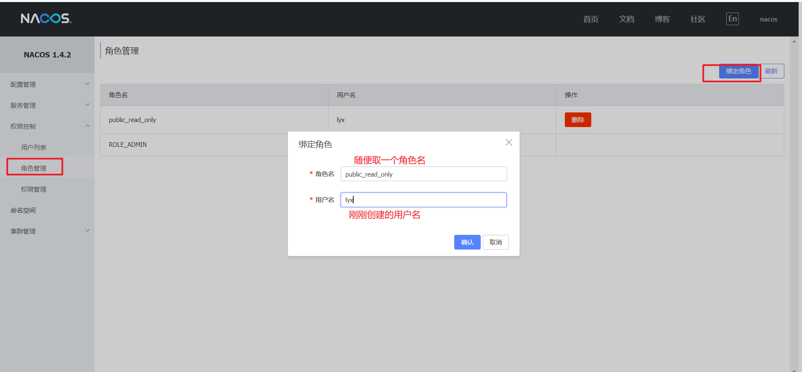
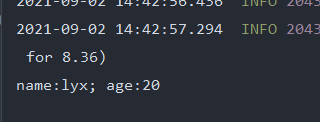
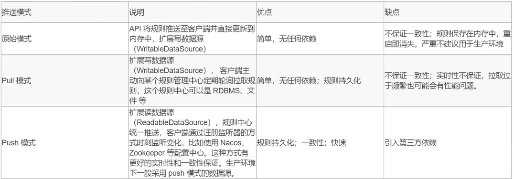
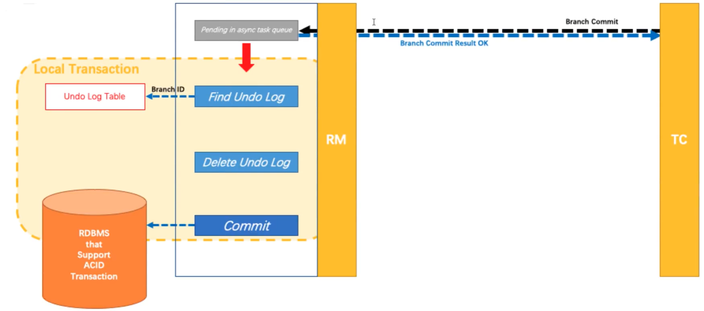
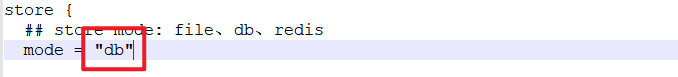
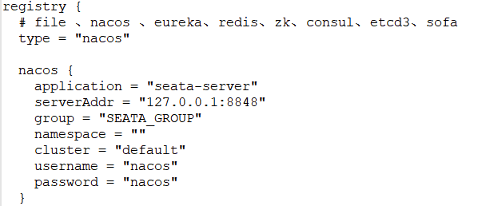
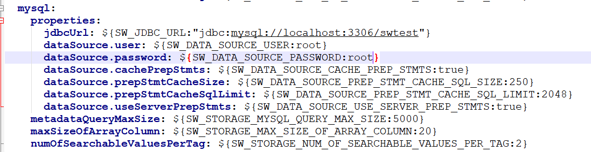
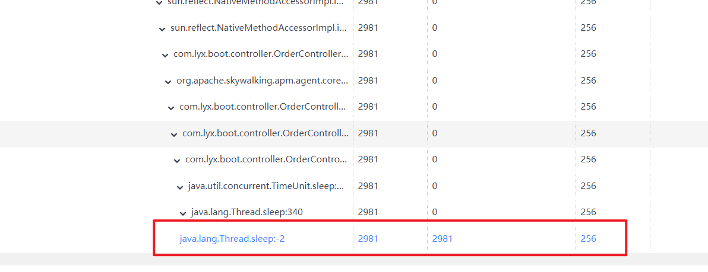

# Spring Cloud Alibaba笔记


## 1. 微服务和Spring Cloud Alibaba介绍

### 1.1 微服务介绍

#### 1.1.1 系统架构演变

随着互联网的发展，网站应用的规模也在不断的扩大，进而导致系统架构也在不断的进行变化。

从互联网早起到现在，系统架构大体经历了下面几个过程：单体应用架构→垂直应用架构一>分布式架构—>SOA架构→微服务架构，当然还有悄然兴起的Service Mesh(服务网格化）。


接下来我们就来了解一下每种系统架构是什么样子的，以及各有什么优缺点。


##### 1.单体应用架构

互联网早期，一般的网站应用流量较小，只需一个应用，将所有功能代码都署在一起就可以，这样可以减少开发、部署和维护的成本。比如说一个电商系统，里面会包含很多用户管理，商品管理，订单管理，物流管理等等很多模块，我们会把它们做成一个web项目，然后部署到一台tomcat服务器上。

**优点：**

* 项目架构简单，小型项目的话，开发成本低
* 项目部署在一个节点上，维护方便

**缺点：**

* 全部功能集成在一个工程中，对于大型项目来讲不易开发和维护
* 项目模块之间紧密精合，单点容错率低
* 无法针对不同模块进行针对性优化和水平扩展


##### 2. 垂直应用架构

随着访问量的逐渐增大，单一应用只能依靠增加节点来应对，但是这时候会发现并不是所有的模块都会有比较大的访问量.还是以上面的电商为例子，用户访问量的增加可能影响的只是用户和订单模块，但是对消息模块的影响就比较小.那么此时我们希望只多增加几个订单模块，而不增加消息模块.此时单体应用就做不到了，垂直应用就应运而生了.

所谓的垂直应用架构，就是将原来的一个应用拆成互不相干的几个应用，以提升效率。比如我们可以将上面电商的单体应用拆分成：

* 电商系统（用户管理商品管理订单管理）
* 后台系统（用户管理订单管理客户管理）
* CMS系统（广告管理营销管理）

这样拆分完毕之后，一旦用户访问量变大，只需要增加电商系统的节点就可以了，而无需增加后台和CMS的节点。

**优点：**

* 系统拆分实现了流量分担，解决了并发问题，而且可以针对不同模块进行优化和水扩展
* 一个系统的问题不会影响到其他系统，提高容错率

**缺点：**

* 系统之间相互独立，无法进行相互调用
* 系统之间相互独立，会有重复的开发任务


##### 3. 分布式架构

再直应用越来越多，重复的业务代码就会越来越多。这时候，我们就思考可不可以将重复的代码抽取出来，做成统一的业务层作为独立的服务，然后由前端用不同的业务层服务呢？

这就产生了新的分布式系统架构。它将把工程拆分成表现层和服务层两个部分，服务层中包含业务辑。表现层只需要处理和页面的交互，业务逻辑都是调用服务层的服务来实现。

**优点：**

* 抽取公共的功能为服务层，提高代码复用性

**缺点：**

* 系统间精合度变高，调用关系错综复杂，难以维护


##### 4. SOA架构

在分布式架构下，当服务越来越多，容量的评估，小服务资源的浪费等问题逐渐显现，此时需增加一个调度中心对集群进行实时管理。此时，用于资源调度和治理中心（SOA Service OrientedArchitecture)是关键。

**优点：**

* 使用治理中心（ESB\dubbo)解决了服务间调用关系的自动调节

**缺点：**

* 服务间会有依赖关系，一旦某个环节出错会影响较大（服务雪崩）

* 服务关系复杂，运维、测试部署困难


##### 5. 微服务架构

服务架构在某种程度上是面向服务的架构SOA继续发展的下一步,它更加强调服务的"彻底拆分"。

**微服务架构与SOA架构的不同**

微服务架构比SOA架构粒度会更加精细，让专业的人去做专业的事情（专注）,目的提高效率，每个服务于服务之间互不影响，微服务架构中，每个服务必须立部署，微服务架构更加轻巧，轻量级。

SOA架构中可能数据库存储会发生共享，微服务强调独每个服务都是单独数据库，保证每个服务于服务之间互不影响。项目体现特征微服务架构比SOA架构更加适合与互联网公司敏捷开发、快速达代版本，因为粒度非常精细。

**优点：**

* 服务原子化拆分，独立打包、部署和升级，保证每个微服务清晰的任务划分，利于扩展
* 微服务之间采用Restful等轻量级http协议相互调用

**缺点：**

* 分布式系统开发的技术成本高（容错、分布式事务等）
* 复杂性更高。各个微服务进行分布式独立部署，当进行模块调用的时候，分布式将会变得更加麻烦。


#### 1.1.2 微服务架构介绍

> 微服务其实是一种架构风格，我们在开发一个应用的时候这个应用应该是由一组小型服务组成，每个小型服务都运行在自己的进程内；小服务之间通过HTP的方式进行互联互通

 


##### 1. 微服务架构的常见问题

一旦采用微服务系统架构，就势必会遇到这样几个问题：

* 这么多小服务，如何管理他们？(服务治理注册中心[服务注册发现剔除])nacos
* 这么多小服务，他们之间如何通讯？(restful rpc dubbo feign)  httpclient("url",参数）springboot restTemplate("url",参数）,feign
* 这么多小服务，客户端怎么访问他们？(网关）gateway
* 这么多小服务，一旦出现问题了，应该如何自处理？(容错） sentinel
* 这么多小服务，一旦出现问题了，应该如何排错？(链路追踪）skywalking

对于上面的问题，是任何一个微服务设计者都不能绕过去的，因此大部分的微服务产品都针对每一个问题提供了相应的组件来解决它们。

##### 2. 常见微服务架构 

1. dubbo:zookeeper+dubbo+SpringMVC/SpringBoot
   * 配套通信方式：rpc
   * 注册中心：zookeeper/redis
   * 配置中心：diamond

2. SpringCloud:全家桶+轻松嵌入第三方组件（Netflix)
   * 配套通信方式：httprestful
   * 注册中心：eruka/consul
   * 配置中心：config
   * 断路器：hystrix
   * 网关：zuul
   * 分布式追踪系统：sleuth+zipkin


### 1.2 Spring Cloud Alibaba介绍

Spring Cloud Alibaba 致力于提供微服务开发的一站式解决方案。此项目包含开发微服务架构的必需组件，方便开发者通过 Spring Cloud 编程模型轻松使用这些组件来开发微服务架构托Spring Cloud Alibaba,您只需要添加一些注解和少量配置，就可以将Spring Cloud应用接入阿里分布式应用解决方案，通过阿里中间件来迅速搭建分布式应用系统。


### 1.3 Spring Cloud Alibaba环境搭建

SpringCloud Alibaba依赖Java环境来运行。还需要为此配置Maven环境，请确保是在以下版本环境中安装使用：

* 64 bit JDK 1.8+;
* Maven 3.2.x+;

#### 1.3.1 搭建分布式项目

1. 基于SpringBoot的父maven项目

    

     

    

2. 创建2个服务（订单服务和库存服务）

    

   * order service

     * pom.xml

       ```xml
       <?xml version="1.0" encoding="UTF-8"?>
       <project xmlns="http://maven.apache.org/POM/4.0.0"
                xmlns:xsi="http://www.w3.org/2001/XMLSchema-instance"
                xsi:schemaLocation="http://maven.apache.org/POM/4.0.0 http://maven.apache.org/xsd/maven-4.0.0.xsd">
           <parent>
               <artifactId>spring-cloud-alibaba</artifactId>
               <groupId>com.lyx</groupId>
               <version>0.0.1-SNAPSHOT</version>
           </parent>
           <modelVersion>4.0.0</modelVersion>
       
           <artifactId>order</artifactId>
       
           <properties>
               <maven.compiler.source>8</maven.compiler.source>
               <maven.compiler.target>8</maven.compiler.target>
           </properties>
       
           <dependencies>
               <dependency>
                   <groupId>org.springframework.boot</groupId>
                   <artifactId>spring-boot-starter-web</artifactId>
               </dependency>
           </dependencies>
       
       </project>
       ```

     * OrderController.java

       ```java
       import org.springframework.beans.factory.annotation.Autowired;
       import org.springframework.http.ResponseEntity;
       import org.springframework.web.bind.annotation.GetMapping;
       import org.springframework.web.bind.annotation.RequestMapping;
       import org.springframework.web.bind.annotation.RestController;
       import org.springframework.web.client.RestTemplate;
       
       @RestController
       @RequestMapping("/order")
       public class OrderController {
       
           @Autowired
           private RestTemplate restTemplate;
       
           @GetMapping("/add")
           public String add(){
               System.out.println("add order");
               String url = "http://localhost:8001/stock/abatement";
               ResponseEntity<String> result = restTemplate.getForEntity(url, String.class);
               System.out.println(result.getBody());
               return "hello world";
           }
       }
       
       ```

       

   * stock service

     * pom.xml

       ```xml
       <?xml version="1.0" encoding="UTF-8"?>
       <project xmlns="http://maven.apache.org/POM/4.0.0"
                xmlns:xsi="http://www.w3.org/2001/XMLSchema-instance"
                xsi:schemaLocation="http://maven.apache.org/POM/4.0.0 http://maven.apache.org/xsd/maven-4.0.0.xsd">
           <parent>
               <artifactId>spring-cloud-alibaba</artifactId>
               <groupId>com.lyx</groupId>
               <version>0.0.1-SNAPSHOT</version>
           </parent>
           <modelVersion>4.0.0</modelVersion>
       
           <artifactId>stock</artifactId>
       
           <properties>
               <maven.compiler.source>8</maven.compiler.source>
               <maven.compiler.target>8</maven.compiler.target>
           </properties>
       
           <dependencies>
               <dependency>
                   <groupId>org.springframework.boot</groupId>
                   <artifactId>spring-boot-starter-web</artifactId>
               </dependency>
           </dependencies>
       
       </project>
       ```

     * Stock.java

       ```java
       package com.lyx.boot.controller;
       
       import org.springframework.web.bind.annotation.RequestMapping;
       import org.springframework.web.bind.annotation.RestController;
       
       @RestController
       @RequestMapping("/stock")
       public class StockController {
       
           @RequestMapping("/abatement")
           public String abatement(){
               System.out.println("扣减库存");
               return "扣减库存";
           }
       }
       
       ```


#### 1.3.2 改造成springCloud

##### 1. 版本说明

官方版本说明地址：[版本说明 · alibaba/spring-cloud-alibaba Wiki (github.com)](https://github.com/alibaba/spring-cloud-alibaba/wiki/版本说明)

###### 组件版本关系

| Spring Cloud Alibaba Version                              | Sentinel Version | Nacos Version | RocketMQ Version | Dubbo Version | Seata Version |
| --------------------------------------------------------- | ---------------- | ------------- | ---------------- | ------------- | ------------- |
| 2.2.6.RELEASE                                             | 1.8.1            | 1.4.2         | 4.4.0            | 2.7.8         | 1.3.0         |
| 2021.1 or 2.2.5.RELEASE or 2.1.4.RELEASE or 2.0.4.RELEASE | 1.8.0            | 1.4.1         | 4.4.0            | 2.7.8         | 1.3.0         |
| 2.2.3.RELEASE or 2.1.3.RELEASE or 2.0.3.RELEASE           | 1.8.0            | 1.3.3         | 4.4.0            | 2.7.8         | 1.3.0         |
| 2.2.1.RELEASE or 2.1.2.RELEASE or 2.0.2.RELEASE           | 1.7.1            | 1.2.1         | 4.4.0            | 2.7.6         | 1.2.0         |
| 2.2.0.RELEASE                                             | 1.7.1            | 1.1.4         | 4.4.0            | 2.7.4.1       | 1.0.0         |
| 2.1.1.RELEASE or 2.0.1.RELEASE or 1.5.1.RELEASE           | 1.7.0            | 1.1.4         | 4.4.0            | 2.7.3         | 0.9.0         |
| 2.1.0.RELEASE or 2.0.0.RELEASE or 1.5.0.RELEASE           | 1.6.3            | 1.1.1         | 4.4.0            | 2.7.3         | 0.7.1         |

###### 毕业版本依赖关系(推荐使用)

| Spring Cloud Version        | Spring Cloud Alibaba Version      | Spring Boot Version |
| --------------------------- | --------------------------------- | ------------------- |
| Spring Cloud 2020.0.0       | 2021.1                            | 2.4.2               |
| Spring Cloud Hoxton.SR9     | 2.2.6.RELEASE                     | 2.3.2.RELEASE       |
| Spring Cloud Greenwich.SR6  | 2.1.4.RELEASE                     | 2.1.13.RELEASE      |
| Spring Cloud Hoxton.SR3     | 2.2.1.RELEASE                     | 2.2.5.RELEASE       |
| Spring Cloud Hoxton.RELEASE | 2.2.0.RELEASE                     | 2.2.X.RELEASE       |
| Spring Cloud Greenwich      | 2.1.2.RELEASE                     | 2.1.X.RELEASE       |
| Spring Cloud Finchley       | 2.0.4.RELEASE(停止维护，建议升级) | 2.0.X.RELEASE       |
| Spring Cloud Edgware        | 1.5.1.RELEASE(停止维护，建议升级) | 1.5.X.RELEASE       |


##### 2. 引入依赖

* spirngboot：  2.3.2.RELEASE
* Spring Cloud Alibaba： 2.2.6.RELEASE
* spring cloud： Hoxton.SR9

在父工程中修改对应版本，并在中引入springCloud alibaba

```xml
<dependencyManagement>
    <dependencies>
        <!--spring-cloud-alibaba版本管理器-->
        <dependency>
            <groupId>com.alibaba.cloud</groupId>
            <artifactId>spring-cloud-alibaba-dependencies</artifactId>
            <version>2.2.6.RELEASE</version>
            <type>pom</type>
            <scope>import</scope>
        </dependency>
        <!--spring-boot版本管理器-->
        <dependency>
            <groupId>org.springframework.boot</groupId>
            <artifactId>spring-boot-starter-parent</artifactId>
            <version>2.3.2.RELEASE</version>
            <type>pom</type>
            <scope>import</scope>
        </dependency>
    </dependencies>
</dependencyManagement>
```


## 2. Alibaba微服务注册中心

### 2.1 什么是 Nacos

官方:一个更易于构建云原生应用的动态服务发现( Nacos Discovery)、服务配置( Nacos Config)和服务管理平台。

集注册中心+配置中心+服务管理平台

Nacos的关键特性包括:

* 服务发现和服务健康监测
* 动态配置服务
* 动态DNS服务
* 服务及其元数据管理


### 2.2 Nacos注册中心

管理所有微服务、解决微服务之间调用关系错综复杂、难以维护的问


### 2.3 核心功能

**服努注册**: Nacos clien会通过发送REST请求的方式向 Nacos server注册自己的服务,提供自身的元数据,比如ip地址、端口等信息。 Nacos server接收刭注册诮求后,就会把这些元数据信息存储在一个双层的内存Map中。

**服务心跳:**在服务注册后, Nacos clien会维护一个定时心跳来持续通知 Nacos server,说明服务一直处于可用状态,防止被剔除。默认5s发送一次心跳。

**服务同步:** Nacos server集群之间会互相同步服务实例,用来保证服务信息的一致性。 leader raft

**服务发现:**服务消费者( Nacos Client)在调用服努提供者的服务时,会发送一个REST请求给 Nacos Server,获取上面注册的服务清单,并且缓存在№ acos Client本地,同时会在 Nacos client本地开启一个定时任务定时拉取服务端最新的注册表信息更新到本地缓存

**服务健康检査:** Nacos Server会开启一个定时任务用来检査注册服务实例的健康情况,对于超过15没有收到客户端心跳的实例会将它的 healthy属性置为fase(客户端服务发现时不会发现),如果某个实例超过30秒没有收到心跳,直接剔除该实例(被剔除的实例如果恢复发送心跳则会重新注册)


### 2.4 Nacos Server服务器搭建

下载地址：[Tags · alibaba/nacos (github.com)](https://github.com/alibaba/nacos/tags)

下载后解压，进入bin目录下，修改Nacos的启动方式为单机模式:


**启动：**

双击startup.cmd文件，如图所示，启动成功！

 

浏览器访问：

```http
http://localhost:8848/nacos
```


用户名和密码都是nacos


### 2.5 Nacos client客户端搭建

1. 改pom

   ```xml
   <?xml version="1.0" encoding="UTF-8"?>
   <project xmlns="http://maven.apache.org/POM/4.0.0"
            xmlns:xsi="http://www.w3.org/2001/XMLSchema-instance"
            xsi:schemaLocation="http://maven.apache.org/POM/4.0.0 http://maven.apache.org/xsd/maven-4.0.0.xsd">
       <parent>
           <artifactId>spring-cloud-alibaba</artifactId>
           <groupId>com.lyx</groupId>
           <version>1.0-SNAPSHOT</version>
       </parent>
       <modelVersion>4.0.0</modelVersion>
   
       <artifactId>stock</artifactId>
   
       <dependencies>
           <!--nacos服务注册与发现-->
           <dependency>
               <groupId>com.alibaba.cloud</groupId>
               <artifactId>spring-cloud-starter-alibaba-nacos-discovery</artifactId>
           </dependency>
           <dependency>
               <groupId>org.springframework.boot</groupId>
               <artifactId>spring-boot-starter-web</artifactId>
           </dependency>
           <dependency>
               <groupId>org.springframework.boot</groupId>
               <artifactId>spring-boot-starter-actuator</artifactId>
           </dependency>
           <!--热部署-->
           <dependency>
               <groupId>org.springframework.boot</groupId>
               <artifactId>spring-boot-devtools</artifactId>
               <scope>runtime</scope>
               <optional>true</optional>
           </dependency>
           <dependency>
               <groupId>org.projectlombok</groupId>
               <artifactId>lombok</artifactId>
           </dependency>
       </dependencies>
   
   </project>
   ```

   

2. 改yml

   ```yaml
   server:
     port: 8002
   spring:
     application:
       name: stock-service # 应用名（nacos服务名）
     cloud:
       nacos:
         server-addr: 127.0.0.1:8848 # nacos服务地址
         discovery:
           username: nacos # nacos服务用户名
           password: nacos # nacos服务密码
           namespace: public # 命名空间
           ephemeral: false # 创建永久实例，服务宕机，也不会剔除服务
   ```


> 注意新版本可不加@EnableDiscoveryClient注解

启动service服务，查看nacos中是否注册成功


**修改controller，使用服务名调用服务：**

```java
@GetMapping("/add")
    public String add(){
        log.info("add order");
//        String url = "http://localhost:8002/stock/abatement";
        String url = "http://stock-service/stock/abatement"; //使用服务名调用服务
        String result = restTemplate.getForObject(url, String.class);
        log.info("add result: "+result);
        return result;
    }
```

给RestTemplate的bean加上负载均衡

```java
@Bean
@LoadBalanced //负载均衡
public RestTemplate restTemplate(RestTemplateBuilder builder){
    return builder.build();
}
```

测试访问：


### 2.6 Nacos管理界面详解

#### 2.6.1 保护阈值


保护阈值: 设置0-1之间的值

设置永久实例: spring, cloud nacos. discovery ephemeral= false,当服务宕机了也不会从服务列表中剔除

当服务宕机时，改服务实例状态为不健康。如果健<span style="color:red">康的实例数/总实例数 < 保护阈值</span>就会触发雪崩保护机制，让不健康的实例也能被访问到。


### 2.7 Nacos 配置

| 配置项              | Key                                            | 默认值                     | 说明                                                         |
| ------------------- | ---------------------------------------------- | -------------------------- | ------------------------------------------------------------ |
| 服务端地址          | spring.cloud.nacos.discovery.server-addr       | 无                         | Nacos Server 启动监听的ip地址和端口                          |
| 服务名              | spring.cloud.nacos.discovery.service           | ${spring.application.name} | 给当前的服务命名                                             |
| 服务分组            | spring.cloud.nacos.discovery.group             | DEFAULT_GROUP              | 设置服务所处的分组                                           |
| 权重                | spring.cloud.nacos.discovery.weight            | 1                          | 取值范围 1 到 100，数值越大，权重越大                        |
| 网卡名              | spring.cloud.nacos.discovery.network-interface | 无                         | 当IP未配置时，注册的IP为此网卡所对应的IP地址，如果此项也未配置，则默认取第一块网卡的地址 |
| 注册的IP地址        | spring.cloud.nacos.discovery.ip                | 无                         | 优先级最高                                                   |
| 注册的端口          | spring.cloud.nacos.discovery.port              | -1                         | 默认情况下不用配置，会自动探测                               |
| 命名空间            | spring.cloud.nacos.discovery.namespace         | 无                         | 常用场景之一是不同环境的注册的区分隔离，例如开发测试环境和生产环境的资源（如配置、服务）隔离等。 |
| AccessKey           | spring.cloud.nacos.discovery.access-key        | 无                         | 当要上阿里云时，阿里云上面的一个云账号名                     |
| SecretKey           | spring.cloud.nacos.discovery.secret-key        | 无                         | 当要上阿里云时，阿里云上面的一个云账号密码                   |
| Metadata            | spring.cloud.nacos.discovery.metadata          | 无                         | 使用Map格式配置，用户可以根据自己的需要自定义一些和服务相关的元数据信息 |
| 日志文件名          | spring.cloud.nacos.discovery.log-name          | 无                         |                                                              |
| 集群                | spring.cloud.nacos.discovery.cluster-name      | DEFAULT                    | 配置成Nacos集群名称                                          |
| 接入点              | spring.cloud.nacos.discovery.enpoint           | UTF-8                      | 地域的某个服务的入口域名，通过此域名可以动态地拿到服务端地址 |
| 是否集成Ribbon      | ribbon.nacos.enabled                           | true                       | 一般都设置成true即可                                         |
| 是否开启Nacos Watch | spring.cloud.nacos.discovery.watch.enabled     | true                       | 可以设置成false来关闭 watch                                  |


## 3. 负载均衡组件Ribbon

### 3.1 Ribbon简介

目前主流的负载方案分为以下两种

* 集中式负载均衡,在消费者和服务提供方中间使用独立的代理方式进行负载,有硬件的(比如F5),也有软件的(比如№gnx)。

* 客户端根据自己的请求情况做负载均衡, Ribbon就属于客户端自己做负载均衡。

Spring Cloud Ribbon是基于Netfilx Ribbon实现的一套**客户端的负载均衡工具**, Ribbon客户端组件提供一系列的完善的配置,如超时,重试等。通过 **Load balancer**获取到服务提供的所有机器实例,Rboη会自动基于某种规则轮询,随机去调用这些服务。 Ribbon也可以实现我们自己的负载均衡算法。


#### 3.1.1客户端的负载均衡
例如 spring cloud中的 Ribbon,客户端会有—个服务器地址列表,在发送请求前通过负载均衡算法选择-个服务器,然后进行访问,这是客户端负载均衡;即在客户端就进行负载均衡算法分配。


#### 3.1.2服务端的负载均衡

例如Nginx,通过Nginx进行负载均衡,先发送请求,然后通过负载均衡算法,在多个服务器之间选择个进行访问;即在服务器端再进行负载均衡算法分配。


#### 3.1.3常见负载均衡算法

* 随机,通过随机选择服务进行执行,一般这种方式使用较少;
* 轮训,负载均衡默认实现方式,请求来之后排队处理;
* 加权轮训,通过对服务器性能的分型,给高配置,低负载的服务器分配更高的权重,均衡各个服务器的压力;
* 地址Hash,通过客户端请求的地址的HASH值取模映射进行服务器调度。 ip hash
* 最小链接数,即使请求均衡了,压力不一定会均衡,最小连接数法就是根据服务器的情凊况,比如请求积压数等参数,将请求分配到当前
* 压力最小的服务器上。最小活跃数


### 3.2 Nacos使用Ribbon

> nacos-discovery依赖了 ribbon,可以不用再引入 ribbon依赖


添加`@LoadBalanced`注解

```java
@Bean
@LoadBalanced //负载均衡
public RestTemplate restTemplate(RestTemplateBuilder builder){
    return builder.build();
}
```

使用

```java
    @GetMapping("/add")
    public String add(){
        log.info("add order");
//        String url = "http://localhost:8002/stock/abatement";
        String url = "http://stock-service/stock/abatement"; //使用服务名调用服务
        String result = restTemplate.getForObject(url, String.class);
        log.info("add result: "+result);
        return result;
    }
```


### 3.3 Ribbon负载均衡策略


**IRule**

这是所有负载均衡策略的父接口,<font style="color:red">里边的核心方法就是 choose方法,用来选择一个服务实例。</font>

**AbstractloadBalancerRule**

AbstractloadBalancerRule是一个抽象类,里边主要定义了一个 ILoadBalancer,就是我们上文所说的负载均衡器,负载均衡器的功能我们在上文已经说的很详细了,这里就不再赘述,这里定义它的目的主要是==辅助负责均衡策略选取合适的服务端实例==

* **RandomRule**

  看名字就知道,这种负载均衡策略就是**随机选择一个服务实例**,看源码我们知道,在RandσmRule的无参枃造方法中初始化了一个Randσm对象,然后在它重写的 choose方法又调用了choose( ILoadBalancer lb, Object key)这个重载的 choose方法,在这个重载的 choose方法中,每次利用 random对象生成—个不大于服务实例总数的随机数,并将该数作为下标所以获取服务实例

* **RoundRobinRule**

  RoundRobinRule这种负载均衡策略叫做**线性轮询负载均衡策略**。这个类的choose(ILoadBalancer Ib, Object key)函数整体逻辑是这样的:开启一个计数 count,在whie循环中遍历服务清单,获取清单之前先通过 incrementAndGetModulo方法获取一个下标,这个下标是一个不断自增长的数先加1然后和服务清单总数取模之后获取到的(所以这个下标从来不会越界),拿着下标再去服务清单列表中取服务,每次循环计数器都会加1,如果连续10次都没有取到服务,则会报一个警告 No available alive servers after10 tries from load balancer:XXX

  

* **RetryRule**(在轮询的基础上进行重试)

  看名字就知道这种负载均衝策略带有**重试**功能。首先 RetryRule中又定义了一个 subRule,它的实现类是 RoundRobinRule,然后在 RetryRule的choose( ILoadBalancer lb, Object key)方法中,每次还是采用 RoundRobinRule中的 choose规则来选择一个服务实例,如果选到的实例正常就返回,如果选择的服务实例为ηu或者已经失效,则在失效时间 deadline之前不断的进行重试(重试时获取服务的策略还是 RoundRobinRule中定义的策略),如果超过了 deadline还是没取到则会返回一个null

  

* **WeightedResponseTimeRule**(权重一 nacos的 NacosRule, Nacos还扩展了一个自己的基于配置的权重扩展)

  WeightedResponseTimeRule是 RoundRobinRule的一个子类,在 WeightedResponseTimeRule中对 RoundRobinRule的功能进行了扩展, WeightedResponseTimeRule中会根据每一个例的运行情况来给计算岀该实例的—个**权重**,然后在挑选实例的时候根据权重进行挑选,这样能够实现更优的实例调用。 WeightedRespoNseTimeRule中有一个名叫DynamicServerWeightTask的定时任努,默认情况下毎隔30秒会计算一次各个服务实例的权重,权重的计算规则也很简单,**如果一个服努的平均响应时间越短则权重越大,那么该服努实例被选中执行任务的概率也就越大**

  

* **ClientConfigEnabledRoundRobinRule**

  ClientConfigEnabledRoundRobinRule选择策略的实现很简单,内部定义了RoundRobinRule,choose方法还是采用了RoundRobinRule的choose方法,所以它的选择策略**和RoundRobinRule的选择策略一致**,不赘述

  

* **BestAvailableRule**

  BestAvailableRule继承自 ClientConfigEnabledRoundRobinRule,它在 ClientConfigEnabledRoundRobinRule的基础上主要增加了根据 loadBalancerStats中保存的服务实例的状态信息来**过滤掉失效的服务实例的功能,然后顺便找出并发请求最小的服务实例来使用**。然而 loadBalancerstats有可能为null,如果loadBalancerStats为null,则 BestAvailableRule将采用它的父类即 ClientConfigEnabledRoundRobinRule的服务选取策略(线性轮询)。

  

*  **ZoneAvoidanceRule**(==**默认规则**==,复合判断 server所在区域的性能和 server的可用性选择服务器。)

  ZoneAvoidanceRule是 PredicateBasedRule的一个实现类,只不过这里多一个过滤条件, ZoneAvoidancerule中的过滤条件是以 ZoneAvoidancePredicate为主过滤条件和以AvailabilityPredicate为次过滤条件组成的一个叫做 CompositePredicate的组合过滤条件,过滤成功之后,继续采用线性轮询( **RoundRobinRule**)的方式从过滤结果中选择一个出来。

  

* **AvailabilityFilteringRule**(先过滤掉故障实例,再选择并发较小的实例

  过滤掉一直连接失败的被标记为 circuit tripped的后端 Server,并过滤掉那些高并发的后端 Serveri或者使用一个 AvailabilitypRedicate来包含过滤 serve的逻辑,其实就是检查 status里记录的各个 Server的运行状态


#### 3.3.1 修改默认负载均衡策略

##### 1. 配置类

1. 修改默认策略为随机的负载均衡

   ```java
   package com.lyx.ribbon;
   
   import com.netflix.loadbalancer.IRule;
   import com.netflix.loadbalancer.RandomRule;
   import org.springframework.context.annotation.Bean;
   import org.springframework.context.annotation.Configuration;
   
   /**
    * @Description: Ribbon随机
    * @ClassName: RibbonRandomRuleConfig
    * @Author: 吕总
    * @Date: 2021/8/31 15:18
    * @Version: 1.0
    */
   @Configuration
   public class RibbonRandomRuleConfig { //需要在springboot扫描不到的位置创建
       @Bean
       public IRule iRule(){ //名字必须叫iRule
           return new RandomRule();
       }
   }
   ```

   

2. 使用自己修改的负载均衡

   ```java
   package com.lyx.boot.config;
   
   import com.lyx.ribbon.RibbonRandomRuleConfig;
   import org.springframework.boot.web.client.RestTemplateBuilder;
   import org.springframework.cloud.client.loadbalancer.LoadBalanced;
   import org.springframework.cloud.netflix.ribbon.RibbonClient;
   import org.springframework.cloud.netflix.ribbon.RibbonClients;
   import org.springframework.context.annotation.Bean;
   import org.springframework.context.annotation.Configuration;
   import org.springframework.web.client.RestTemplate;
   
   @Configuration
   @RibbonClients(value = {
           /**
            * 功能描述: 为自指定服务使用修改的负载均衡策略
            * * @param name: 指定的微服务名
            * * @param configuration: 使用哪个自定义的负载均衡策略
            * @Author: 吕总
            * @Date: 2021/8/31 15:44
            */
           @RibbonClient(name = "stock-service", configuration = RibbonRandomRuleConfig.class)
   })
   public class ApplicationConfig {
   
       @Bean
       @LoadBalanced //负载均衡
       public RestTemplate restTemplate(RestTemplateBuilder builder){
           return builder.build();
       }
   
   }
   
   ```


##### 2. 配置文件

```yaml
stock-service:  # 需要修改负载均衡的服务名
  ribbon:
    NFLoadBalancerRuleClassName: com.alibaba.cloud.nacos.ribbon.NacosRule # 负载均衡策略的全类名
```


##### 3.  懒加载

```yaml
ribbon:
  eager-load:
    enabled: true # 默认false，懒加载，第一次访问是加载； true为饥饿加载，即启动工程就加载
    clients: stock-service # 设置需要使用饥饿加载的服务名，多个服务用","隔开
```


## 4. 负载均衡组件LoadBalance

SpringCloud LoadBalancer是 Spring Cloud官方自己提供的客户端负载均衡器,用来替代Ribbon

Spring官方提供了两种负载均衡的客户端

* **RestTemplate**

  RestτTemplate是 Spring提供的用于访问Rest服务的客户端,RestTemplate提供了多种便捷访问迒程Http服务的方法,能够大大提髙客户端的编写效率。默认情况下, RestTemplate默认依赖jdk的HP连接工具

* **WebClient**

  WebClient是从 Spring WebFlux5.0版本开始提供的一个非阻塞的基于响应式编程的进行Hp请求的客户端工具。它的响应式编程的基于 Reactor的。 WebClient中提供了标准Http请求方式对应的get、post、put、 delete等方法,可以用来发起相应的请求

**使用步骤：**

1. 父工程引入spring-cloud-dependencies

   ```xml
   <!--spring cloud Hoxton.SR9-->
   <dependency>
       <groupId>org.springframework.cloud</groupId>
       <artifactId>spring-cloud-dependencies</artifactId>
       <version>Hoxton.SR9</version>
       <type>pom</type>
       <scope>import</scope>
   </dependency>
   ```

2. 子工程引入

   ```xml
   <!--springcloud loadBalance-->
   <dependency>
       <groupId>org.springframework.cloud</groupId>
       <artifactId>spring-cloud-starter-loadbalancer</artifactId>
   </dependency>
   ```

3. 将子工程nacos-discovery的ribbon派出掉

   ```xml
   <!--nacos服务注册与发现-->
   <dependency>
       <groupId>com.alibaba.cloud</groupId>
       <artifactId>spring-cloud-starter-alibaba-nacos-discovery</artifactId>
       <exclusions>
           <exclusion>
               <groupId>org.springframework.cloud</groupId>
               <artifactId>spring-cloud-starter-netflix-ribbon</artifactId>
           </exclusion>
       </exclusions>
   </dependency>
   ```

4. 配置文件中禁用ribbon

   ```yaml
   spring:
     cloud:
       loadbalancer:
         ribbon:
           enabled: false # 禁用ribbon的负载均衡器使用springcloud的负载均衡器
   ```

   

## 5. 微服务调用组件Fegin

### 5.1 JAVA项目中如何实现接口调用?
1. **Httpclient**
   Httpclient是 Apache Jakarta Common下的子项目,用来提供高效的、最新的、功能丰富的支持http协议的客户端徧程工具包,并且它攴持HTTP协议最新版本和建议。 Httpclient相比传统JDK自带的URLConnection,提升易用性和灵活性,使客户端发送HTTP请求变得容易,提高了开发的效率
2. **Okhttp**
   一个处理网络请求的开源项目,是安卓端最火的轻量级框架,由 Square公司贠献,用于替代 HttpUrlConnection和 Apache Httpclient。OkHttp拥有简洁的API、高效的性能,并支持多种协议(HTTP/2和SPDY)
3. HttpURLConnection
   HttpURLConnection是Java的标准类,它继承自 URLConnection,可用于向指定网站发送GET请求、POST请求。HttpURLConnection使用比较复杂,不像 Httpclient那样容易使用
4. **RestTemplate WebClient**
   RestTemplate是 Spring提供的用于访问Rest服务的客户端,RestTemplate提供了多种便捷访问远程HTTP服务的方法,能够大大提高客户端的编写效率。

上面介绍的是最常见的几种调用接口的方法,我们下面要介绍的方法比上面的更简单、方便,它就是 Feign


### 5.2 什么是 Feign

Feign是Netfilx开发的声明式、模板化的HTTP客户端,其灵感来自Retrofit、JA×RS-2.0以及Websocket。Fegn可帮助我们更加便捷、优雅地调用HttpAPI。Feign支持多种注解,例Fegin自带的注解或者JAX-RS注解等

**Spring Cloud openfeign对 Feign进行了增强,使其攴持 Spring MVC注解,另外还整合了 Ribbon和 Nacos,从而使得Fegn的使用更加方便**

#### 5.2.1 优势

Feign可以做到**使用HTTP请求远程服务时就像调用本地方法一样的体验**,开发者完全感知不到这是远程方法,更感知不到这是个HTTP请求。它像Dubbo一样,consumer直接调用接口方法调用provider,而不需要通过常规的 HttpClient构造请求再解析返回数据。它解决了让开发者调用远程接口就跟调用本地方法样,无需关注与远程的交互细节,更无需关注分布式环境开发


### 5.3 SpringCloud Alibaba 整合Fegin

1. 引入openfeign的依赖

   ```xml
   <!--feign-->
   <dependency>
       <groupId>org.springframework.cloud</groupId>
       <artifactId>spring-cloud-starter-openfeign</artifactId>
   </dependency>
   ```

2. 创建远程调用接口

   ```java
   package com.lyx.boot.feign;
   
   import org.springframework.cloud.openfeign.FeignClient;
   import org.springframework.web.bind.annotation.RequestMapping;
   
   /**
    * @Description: Stock远程调用接口
    * @ClassName: StockFeignService
    * @Author: 吕总
    * @Date: 2021/9/1 8:12
    * @Version: 1.0
    */
   /**
    * name: 远程服务的服务名
    * path: 远程服务的controller上@RequestMapping注解中的路径
    */
   @FeignClient(name = "stock-service", path = "/stock")
   public interface StockFeignService {
   
       @RequestMapping("/abatement")
       String abatement();
   }
   ```

3. Controller使用接口调用远程方法

   ```java
   package com.lyx.boot.controller;
   
   import com.lyx.boot.feign.StockFeignService;
   import lombok.extern.slf4j.Slf4j;
   import org.springframework.beans.factory.annotation.Autowired;
   import org.springframework.web.bind.annotation.GetMapping;
   import org.springframework.web.bind.annotation.RequestMapping;
   import org.springframework.web.bind.annotation.RestController;
   
   @RestController
   @RequestMapping("/order")
   @Slf4j
   public class OrderController {
   
       @Autowired
       private StockFeignService stock;
   
       @GetMapping("/add")
       public String add(){
           log.info("add order");
           return stock.abatement();
       }
   }
   ```


### 5.4 Spring Cloud Feign的自定义配置及使用
> Feign提供了很多的扩展机制,让用户可以更加灵活的使用,

#### 5.4.1 日志配置

有时候我们遇到Bug、接口调用失败、参数没收到等问题,或者想看看调用性能,就需要配置 Feign的日志了,以此i让Feigη把请求信息输出:

**日志级别：**

* **NONE**:【性能最佳,适用于生产】:不记录任何日志(默认值)
* **BASIC**:【适用于生产环境追踪问题】:仅记录请求方法、URL、响应状态代码以及执行时间
* **HEADERS**:记录BAsC级别的基础上,记录请求和响应的 header
* **FULL**:【比较适用于开发及测试环境定位问题】:记录请求和响应的 header、bo和元数据

##### 1. 定义一个配置类,指定日志级别

```java
package com.lyx.boot.confing;

import feign.Logger;
import org.springframework.context.annotation.Bean;

/**
 * @Description: Fegin的相关配置
 * @ClassName: feignConfig
 * @Author: 吕总
 * @Date: 2021/9/1 8:36
 * @Version: 1.0
 */
/**
 * 加上@Configuration注解为全局使用
 * 去掉Configuration,可局部使用
 */
//@Configuration
public class FeignConfig {
    @Bean
    public Logger.Level feignLoggerLevel(){
        return Logger.Level.FULL;
    }
}
```

##### 2. 修改spring默认日志级别

```yaml
# 默认spring的日志级别是info，需要修改为debug才能显示feign的日志
logging:
  level:
    com.lyx.boot.feign: debug #修改包的响应级别为debug
```

##### 3. 定义局部日志配置

1. 注解方式

   ```java
   //configuration 指定feign配置文件
   @FeignClient(name = "stock-service", path = "/stock", configuration = FeignConfig.class)
   ```

   

2. 配置文件方式

   ```yaml
   feign:
     client:
       config:
         stock-service: #服务名
           loggerLevel: BASIC #日志级别
   ```

   

#### 5.4.2 契约配置
Spring Cloud在 Feign的基础上做了扩展,使用 Spring MVC的注解来完成 Feign的功能。原生的Fegn是不攴持 Spring MVC注解的,如果你想在 Spring Cloud中使用原生的注解方式定义客户端也是可以的,通过配置契约来改变这个配置, Spring Cloud中默认的是SpringMVCContract

Spring Cloud1早期版本就是用的原生 Begin.随看neti的停更替换成了 Open feign


##### 1. 修改契约配置,支持 Feign原生的注解

```java
/**
  * 功能描述: 修改feign使用原生注解契约
  * * @return: feign.Contract 契约配置,全局生效
  * @Author: 吕总
  * @Date: 2021/9/1 9:56
  */
@Bean
public Contract feignContract(){
    return new Contract.Default();
}
```

==注意:修改契约配置后, OrderFeignService不再支持 springmvc的注解,需要使用 Feign原生的注解==

##### 2. OrderFeign Service中配置使用 Feign原生的注解

```java
//    @RequestMapping("/abatement")
    @RequestLine("GET /abatement") //feign原生注解
    String abatement();
```

##### 3. 使用配置文件支持Fegin原生注解

```yaml
feign:
  client:
    config:
      stock-service: #服务名
        loggerLevel: BASIC #日志级别
        contract: feign.Contract.Default #指定feign原生注解的契约配置，指定的服务名生效
```


#### 5.4.3 超时时间配置

通过 Options可以配置连接超时时间和读取超时时间, Options的第一个参数是连接的超时时间(ms),默认值是2s;第二个是请求处理的超时时间(ms),默认值是5s

##### 1. 全局配置

```java
/**
  * 功能描述: 超时加载时间
  * * @return: feign.Request.Options
  * @Author: 吕总
  * @Date: 2021/9/1 10:12
  */
@Bean
public Request.Options options(){
    return new Request.Options(5000, 3000);
}
```


##### 2. 局部配置（配置文件）

```yaml
feign:
  client:
    config:
      stock-service: #服务名
        connectTimeout: 5000  # 链接时长
        readTimeout: 3000   #读取时长
```

==**充说明: Feign的底层用的是 Ribbon,但超时时间以 Feign配置为准**==


##### 3. 自定义拦截器实现认证逻辑

1. 创建自定义拦截器

   ```java
   package com.lyx.boot.interceptor.feign;
   
   import feign.RequestInterceptor;
   import feign.RequestTemplate;
   import org.slf4j.Logger;
   import org.slf4j.LoggerFactory;
   
   /**
    * @Description: 自定义拦截器
    * @ClassName: CustomFeginInterceptor
    * @Author: 吕总
    * @Date: 2021/9/1 18:28
    * @Version: 1.0
    */
   public class CustomFeginInterceptor implements RequestInterceptor {
       Logger logger = LoggerFactory.getLogger(this.getClass());
   
       @Override
       public void apply(RequestTemplate requestTemplate) {
           logger.info("feign拦截器");
       }
   }
   ```

2. 使用自定义拦截器

   * 全局配置

     ```java
     /**
      * 功能描述: 自定义拦截器
      * * @return: com.lyx.boot.interceptor.feign.CustomFeginInterceptor 
      * @Author: 吕总
      * @Date: 2021/9/1 18:42
      */
     @Bean
     public CustomFeginInterceptor customFeginInterceptor(){
         return new CustomFeginInterceptor();
     }
     ```

     

   * 局部配置

     ```yaml
     feign:
       client:
         config:
           stock-service: #服务名
             requestInterceptors[0]:
               com.lyx.boot.interceptor.feign.CustomFeginInterceptor
     ```


## 6. Naocs配置中心

### 6.1 配置中心介绍

官方文档：https://github.com/alibaba/spring-cloud-alibaba/wiki/Nacos-config

Nacos提供用于存储配置和其他元数据的keνyaue存储,为分布式系统中的外部化配置提倛服务器端和客户端攴持。使用 Spring Cloud Alibaba Nacos config,您可以在 Nacos server集中管理你Spring Cloud应用的外部属性配置。


**springcloud config对比**

三大优势

* springcloud config大部分场景结合git使用,动态变更还需要依赖 Spring Cloud Bus消息总线来通过所有的客户端变化
* springcloud config不提供可视化界面
* nacos config使用长轮询更新配置,一旦配置有变动后,通知 Provider的过程非常的迅速,从速度上秒杀 springcloud原来的 config几条街


### 6.2 配置中心管理界面

#### 6.2.1 添加配置


#### 6.2.2 查看历史版本


历史版本中可以看到该配置文件历史修改的记录，可以进行回滚


#### 6.2.3 监听查询


可以看到该配置文件是否正确应用到对应的微服务中


#### 6.2.4 克隆


可以将文件快速克隆到其他开发环境中去 


#### 6.2.5 权限控制

##### 1. 开启权限控制

修改nacos配置中心config目录下的application.properties


##### 2. 创建用户


##### 3. 绑定角色




##### 3. 添加权限


### 6.3 Nacos Client读取

1. 导入nacos配==置中心依赖==

   ```xml
   <dependency>
       <groupId>com.alibaba.cloud</groupId>
       <artifactId>spring-cloud-starter-alibaba-nacos-config</artifactId>
   </dependency>
   ```

   

2. 添加bootstrap.yml配置文件

   ```yml
   server:
     port: 8007
   spring:
     application:
       # 会自动根据服务名拉取dataid对应配置文件，如果配置的服务名跟dataid不一致需要手动配置
       name: com.lyx.order.redis
     cloud:
       nacos:
         server-addr: localhost:8848
         username: nacos
         password: nacos
         config:
           file-extension: yaml # 默认文件类型为properties，使用其他格式类型需要指定
   ```


3. 在nacos中创建配置文件

   

    

4. 在启动类中读取测试

   ```java
   package com.lyx.boot;
   
   import org.springframework.boot.SpringApplication;
   import org.springframework.boot.autoconfigure.SpringBootApplication;
   import org.springframework.context.ConfigurableApplicationContext;
   
   /**
    * @Description: nacos配置中心客户端主启动类
    * @ClassName: OrderConfigMain8007
    * @Author: 吕总
    * @Date: 2021/9/2 14:17
    * @Version: 1.0
    */
   @SpringBootApplication
   public class OrderConfigMain8007 {
       public static void main(String[] args) {
           ConfigurableApplicationContext run = SpringApplication.run(OrderConfigMain8007.class, args);
           String name = run.getEnvironment().getProperty("student.name");
           String age = run.getEnvironment().getProperty("student.age");
           System.out.println("name:"+name+"; age:"+age);
       }
   }
   ```

   

6. 读取结果




### 6.4 更多配置

最佳实践:

* Namespace:代表不同环境,如开发、测试、生产环境。
* Group:代表某项目,如XX医疗项目、XX电商项目
* Datald:每个项目下往往有若干个工程(微服务),每个配置集( Datald)是一个工程(微服务)的主配置文件

#### 6.4.1 不感知配置变化

```yaml
spring:
  application:
    # 会自动根据服务名拉取dataid对应配置文件，如果配置的服务名跟dataid不一致需要手动配置
    name: com.lyx.order.redis
  cloud:
    nacos:
      config:
        refresh-enabled: false # 客户端不感知配置中心配置的变化,默认感知
```


#### 6.4.2 使用不同profiles文件

prifile默认文件为

```yaml
spring:
  application:
    name: com.lyx.order.redis #profile默认文件名
```

命名规则：${prefix}-${spring.profile.active}.${file-extension}


修改不同环境的profiles文件

```yaml
spring:
  profiles:
    active: dev
```

==修改的profiles文件会覆盖掉profile的默认配置文件中的相同配置，profile默认文件中的不同配置会保留==


#### 6.4.3 使用不同命名空间配置

```yaml
spring:
  application:
    name: com.lyx.order.config
  cloud:
    nacos:
      config:
        file-extension: yaml # 默认文件类型为properties，使用其他格式类型需要指定
        namespace: ba10e46f-431c-4425-aee6-a87f2e1e6e4f # 命名空间id
```


#### 6.4.4 使用不同group

```yaml
spring:
  application:
    name: com.lyx.order.config
  cloud:
    nacos:
      config:
        file-extension: yaml # 默认文件类型为properties，使用其他格式类型需要指定
        namespace: ba10e46f-431c-4425-aee6-a87f2e1e6e4f # 命名空间id
		group: lvyuanxiang # group
```


#### 6.4.5 使用与项目名不同的配置文件

1. shard-config

   ```yml
   spring:
     application:
       # 会自动根据服务名拉取dataid对应配置文件，如果配置的服务名跟dataid不一致需要手动配置
       name: com.lyx.order.config
     cloud:
       nacos:
         server-addr: localhost:8848
         username: nacos
         password: nacos
         config:
           file-extension: yaml # 默认文件类型为properties，使用其他格式类型需要指定
           namespace: ba10e46f-431c-4425-aee6-a87f2e1e6e4f
           group: lvyuanxiang
           shared-configs:
             - data-id: commons-config.yaml
               refresh: true # 动态刷新（默认关闭）
   #            group: Default-group # 默认是Default-group
             - data-id: commons-config2.yaml #后加载的会覆盖先加载的配置
               refresh: true # 动态刷新（默认关闭）
               
   ```

2. extension-config

   ```yaml
   spring:
     application:
       # 会自动根据服务名拉取dataid对应配置文件，如果配置的服务名跟dataid不一致需要手动配置
       name: com.lyx.order.config
     cloud:
       nacos:
         server-addr: localhost:8848
         username: nacos
         password: nacos
         config:
           file-extension: yaml # 默认文件类型为properties，使用其他格式类型需要指定
           namespace: ba10e46f-431c-4425-aee6-a87f2e1e6e4f
           group: lvyuanxiang
           extension-configs[0]:
                     data-id: commons-config2.yaml
                     refresh: false
   ```


#### 6.4.6 优先级

profile > 默认配置文件 > extension-configs(下标越大，优先级越大) > shared-configs(下标越大，优先级越大) 


#### 6.4.7 RefreshScope

> 当使用@value来获取配置中心的值时，不会动态更新，需要加上@RefreshScope才能实现动态刷新配置

```java
package com.lyx.boot.controller;

import org.springframework.beans.factory.annotation.Value;
import org.springframework.cloud.context.config.annotation.RefreshScope;
import org.springframework.web.bind.annotation.RequestMapping;
import org.springframework.web.bind.annotation.RestController;

/**
 * @Description: config controller
 * @ClassName: ConfigController
 * @Author: 吕总
 * @Date: 2021/9/2 16:18
 * @Version: 1.0
 */
@RestController
@RequestMapping("/config")
@RefreshScope //动态刷新配置
public class ConfigController {
    @Value("${student.name}")
    private String name;

    @RequestMapping("/name")
    public String name(){
        return name;
    }
}

```


## 7. 流控组件sentinel

### 7.1 分布式系统 遇到的问题

#### 7.1.1 服务可用性问题


#### 7.1.2 服务的可用性场景
在一个高度服务化的系统中我们实现的一个业务逻辑通常会依赖多个服务,如图所示


如果其中的下单服务不可用,就会岀现线程池里所有线程都因等待响应而被阻塞,从而造成整个服务链路不可用,进而导致整个系统的服务雪崩.如图所示:


**服努雪崩效应:因服务提倛者的不可用导致服务调用者的不可用,并将不可用逐渐放大的过程,就叫服务雪崩效应**

导致服务不可用的原因：


在服务提倛者不可用的时候,会岀现大量重试的情况:用户重试、代码逻辑重试,这些重试最终导致:进一步加大诮求流量。所以归根结底导致雪崩效应的最根本原因是:大量诮求线程同步等待造成的资源耗尽。当服务调用者使用同步调用时,会产生大量的等待线程占用系统资源。一旦线程资源被耗尽,服务调用者提供的服务也将处于不可用状态,于是服务雪崩效应产生了。


### 7.2 解决方案
稳定性、恢复性


#### 7.2.1 常见的容错机制

* **超时机制**
  在不做任何处理的情况下,服努提供者不可用会导致消费者诮求线程强制等待,而造成系统资源耗尽。加λ超时杋制,一旦超时,就释放资源。由于释放资源速度较快,一定程度上可以抑制资源耗尽的问题。

* **服务限流**

  

* **隔离**
  原理:用户的诮求将不再直接访问服务,而是通过线程池中的空闲线程来访问服务,如果线程池已满,则会进行降级处理,用户的诮求不会被阻塞,至少可以看到个执行结果(例如返回友好的提示信息),而不是无休止的等待或者看到系统崩溃

  * 隔离前：

     

  * 隔离后

    

  信号隔离
  信号隔离也可以用于限制并发访问,防止阻塞扩散,与线程隔离最大不同在于执行依赖代码的线程依然是请求线程(该线程需要通过信号申请,如果客户端是可信的且可以快速返回,可以使用信号隔离莤换线程隔离降低开销。信号量的大小可以动态调整,线程池大小不可以

* **服务熔断**
  ==远程服务不稳定或网络抖动时暂时关闭,就叫服务熔断==。
  现实世界的断路器大家肯定都很了解,断路器实时监控电路的情况,如果发现电路电流异常,就会跳闸,从而防止电路被烧毁
  软件世界的断路器可以这样理解:实时监测应用,如果发现在一定时间内失败次数佚失败率达到_定阈值,就"跳闸¨,断路器打开—此时,诮求直接返回,而不去调用原本调用的逻辑。跳闸段时间后(例如10秒),断路器会进入半开状态,这是一个瞬间态,此时允许一次诮求调用该调的逻辑,如果成功,则断路器关闭,应用正常调用;如果调用依然不成功,断路器继续回到打开状态,过段时再进入半开状态尝试通过跳闸,应用可以保护自己,而且避免浪费资源;而通过半开的设计,可实现应用的自我修复“所以,同样的道理,==当依赖的服务有大量超时时,在让新的诮求去访问根本没有意义==,只会无畏的消耗现有资源。比如我们设置了超时时间为1s,如果短时间内有大量诮求在1s内都得不到响应,就意味着这个服务岀现了异常,此时就没有必要再让其他的诮求去访问这个依赖了,这个时候就应该使用断路器避免资源浪费。

   

* **服务降级**
  有服务熔断,必然要有服务降级
  所谓降级,就是当某服务熔断之后,服务将不再被调用,此时客户端可以自己准备—个本地的 fallback(回退)回调,返回一个缺嘗值。例如:(备用接口缓存/mock数据)。这样做,虽然服务水平下降,但好歹可用,比直接挂掉要强,当然这也要看适合的业务场景。


### 7.3 Sentinel:分布式系统的流量防卫兵

#### 7.3.1 Sentinel是什么


随着微服务的流行,服务和服务之间的稳定性变得越来越重要。sentinel是面向分布式服务架枃的流量控制组件,主要以流量为切入点,从限流、流量整形、炲断降级、系统负载保护、热点防护等多个维度来帮助开发者保障微服务的稳定性
源码地址: https://github.com/alibaba/Sentinel
官方文档: https://github.com/alibaba/sentinel/wiki
Sentinel具有以下特征:

* **丰富的应用场景**: Sentinel承接了阿里巴巴近10年的双十—大促流量的核心场景,例如秒杀(即突发流量控制在系统容量可以承受的范囯)、消息削峰填谷、实时熔断下游不可用应用等
* **完备的实时监控**: Sentinel同时提供实时的监控功能。您可以在控制台中看到接λ应用的单台杋器秒级数据,甚至500台以下规模的集群的汇总运行情况。
* **广泛的开源生态**: Sentinel提倛开箱即用的与其它开源框架/庳旳整合模块,例如与spriηgcloud、dubbo、gRPC的整合。您只霱要引λ相应的依赖并进行简单旳配置即可快速地接入
  Sentinel
* **完善的SPI扩展点**: Sentinel提供简单易用、完善的S門扩展点。您可以通过实现扩展点,快速的定制逻辑。例如定制规则管理、适配数据源等。

==阿里云提供了企业级的 Sentinel服务,应用高可用服务AHAs==


#### 7.3.2 Sentinel和 Hystrix对比


#### 7.3.3 Sentinel初体验（代码实现）

##### 1. 导入依赖

```xml
<!--sentinel核心库-->
<dependency>
    <groupId>com.alibaba.csp</groupId>
    <artifactId>sentinel-core</artifactId>
    <version>1.8.0</version>
</dependency>
```

##### 2. Controller中使用sentinel

```java
package com.lyx.boot.controller;

import com.alibaba.csp.sentinel.Entry;
import com.alibaba.csp.sentinel.SphU;
import com.alibaba.csp.sentinel.Tracer;
import com.alibaba.csp.sentinel.slots.block.BlockException;
import com.alibaba.csp.sentinel.slots.block.RuleConstant;
import com.alibaba.csp.sentinel.slots.block.flow.FlowRule;
import com.alibaba.csp.sentinel.slots.block.flow.FlowRuleManager;
import lombok.extern.slf4j.Slf4j;
import org.springframework.web.bind.annotation.GetMapping;
import org.springframework.web.bind.annotation.RestController;

import javax.annotation.PostConstruct;
import java.util.ArrayList;
import java.util.List;

/**
 * @Description: helloController
 * @ClassName: HelloController
 * @Author: 吕总
 * @Date: 2021/9/3 18:56
 * @Version: 1.0
 */
@RestController
@Slf4j
public class HelloController {
     private static final String RESOURCE_NAME = "hello";


     @GetMapping("/hello")
    public String hello(){

        // 务必保证 finally 会被执行
        // 资源名可使用任意有业务语义的字符串，比如方法名、接口名或其它可唯一标识的字符串。
         Entry entry = null;
         try{
             entry = SphU.entry(RESOURCE_NAME);
             // 被保护的业务逻辑
             // do something here...
             String str = "hello world";
             log.info("======="+str+"============");
             return str;
         } catch (BlockException ex) {
             // 资源访问阻止，被限流或被降级
             // 在此处进行相应的处理操作
             log.info("block!");
             return "被控流了";
         }catch (Exception ex) {
             // 若需要配置降级规则，需要通过这种方式记录业务异常
             Tracer.traceEntry(ex, entry);
         }
         return null;
     }

     @PostConstruct //bean初始化时会被执行，相当于initMethod
     private static void initFlowRules(){
         log.info("initFlowRules ...");
         List<FlowRule> rules = new ArrayList<>();
         //流控
         FlowRule rule = new FlowRule(RESOURCE_NAME);
         //设置受保护的阀值
         // set limit qps to 20
         rule.setCount(1);
         //设置流控QPS
         rule.setGrade(RuleConstant.FLOW_GRADE_QPS);
         rule.setLimitApp("default");
         rules.add(rule);
         FlowRuleManager.loadRules(rules);
     }

}
```


#### 7.3.4 @SentinelResource

##### 1.  引入依赖

```xml
<!--sentinel核心库-->
<dependency>
    <groupId>com.alibaba.csp</groupId>
    <artifactId>sentinel-core</artifactId>
    <version>1.8.0</version>
</dependency>
<!--使用@SentinelResource-->
<dependency>
    <groupId>com.alibaba.csp</groupId>
    <artifactId>sentinel-annotation-aspectj</artifactId>
    <version>1.8.0</version>
</dependency>
```


##### 2. 配置注解支持的Bean

```java
// 注解支持的配置Bean
@Bean
public SentinelResourceAspect sentinelResourceAspect() {
    return new SentinelResourceAspect();
}
```


##### 3. 使用@SentinelResource

1. 降级和异常

```java
package com.lyx.boot.controller;

import com.alibaba.csp.sentinel.Entry;
import com.alibaba.csp.sentinel.SphU;
import com.alibaba.csp.sentinel.Tracer;
import com.alibaba.csp.sentinel.annotation.SentinelResource;
import com.alibaba.csp.sentinel.slots.block.BlockException;
import com.alibaba.csp.sentinel.slots.block.RuleConstant;
import com.alibaba.csp.sentinel.slots.block.flow.FlowRule;
import com.alibaba.csp.sentinel.slots.block.flow.FlowRuleManager;
import com.lyx.boot.entity.User;
import lombok.extern.slf4j.Slf4j;
import org.springframework.web.bind.annotation.GetMapping;
import org.springframework.web.bind.annotation.PathVariable;
import org.springframework.web.bind.annotation.RestController;

import javax.annotation.PostConstruct;
import java.util.ArrayList;
import java.util.List;

/**
 * @Description: helloController
 * @ClassName: HelloController
 * @Author: 吕总
 * @Date: 2021/9/3 18:56
 * @Version: 1.0
 */
@RestController
@Slf4j
public class HelloController {
     private static final String USER_RESOURCE_NAME = "user";

   

     @PostConstruct //bean初始化时会被执行，相当于initMethod
     private static void initFlowRules(){
         log.info("initFlowRules ...");
         List<FlowRule> rules = new ArrayList<>();
         //通过@SentinelResource的流控规则
         //流控
         FlowRule rule2 = new FlowRule(USER_RESOURCE_NAME);
         //设置受保护的阀值
         // set limit qps to 20
         rule2.setCount(1);
         //设置流控QPS
         rule2.setGrade(RuleConstant.FLOW_GRADE_QPS);
         rules.add(rule2);
         FlowRuleManager.loadRules(rules);
     }

     /**
      * 功能描述: 体验sentinel的@SentinelResource
      * 注意：
      *   1. @SentinelResource可以非侵入性改善接口中资源定义和流控降级后的处理方法
      *         * @param value: 定义的资源
      *         * @param (fallback 当前类中的方法 /fallbackClass 其他类中的方法): 资源出错时调用的方法
      *         * @param (blockHandler 当前类中的方法/ blockHandlerClass 其他类中的方法)：资源被流控降级调用的方法
      * * @param id: 
      * * @return: com.lyx.boot.entity.User
      * @Author: 吕总
      * @Date: 2021/9/4 17:36
      */
     @GetMapping("/user/{id}")
     @SentinelResource(value = USER_RESOURCE_NAME,
             fallback = "getUserFallback",
             blockHandler = "getUserBlockHandler"
     )
     public User getUser(@PathVariable(value = "id") int id){
         int a = 1/0;
         return new User(id, "张三");
     }

     /**
      * 功能描述: getUser异常时调用的方法
      *     注意：
      *         1. 一定要public
      *         2. 返回值一定要和源方法一致
      * * @param id:
      * * @return: com.lyx.boot.entity.User
      * @Author: 吕总
      * @Date: 2021/9/4 17:31
      */
    public User getUserFallback(int id){
        return new User(null , "方法出现异常");
    }

    /**
     * 功能描述: getUser流控降级方法
     *     注意：
     *         1. 一定要public
     *         2. 返回值一定要和源方法一致
     *         3. 可以在参数末尾添加BlockException 用来区分是什么规则的处理方法
     * * @param id:
     * * @return: com.lyx.boot.entity.User
     * @Author: 吕总
     * @Date: 2021/9/4 17:33
     */
    public User getUserBlockHandler(int id, BlockException blockException){
        return new User(null , "被流控了");
    }

}

```

2. 熔断

```java
package com.lyx.boot.controller;

import com.alibaba.csp.sentinel.EntryType;
import com.alibaba.csp.sentinel.annotation.SentinelResource;
import com.alibaba.csp.sentinel.slots.block.BlockException;
import com.alibaba.csp.sentinel.slots.block.RuleConstant;
import com.alibaba.csp.sentinel.slots.block.degrade.DegradeRule;
import com.alibaba.csp.sentinel.slots.block.degrade.DegradeRuleManager;
import com.lyx.boot.entity.User;
import lombok.extern.slf4j.Slf4j;
import org.springframework.web.bind.annotation.GetMapping;
import org.springframework.web.bind.annotation.RestController;

import javax.annotation.PostConstruct;
import java.util.ArrayList;
import java.util.List;

/**
 * @Description: 测试熔断
 * @ClassName: TestController
 * @Author: 吕总
 * @Date: 2021/9/4 18:05
 * @Version: 1.0
 */
@RestController
@Slf4j
public class TestController {

    private static final String DEGRADE_RESOURCE_NAME = "degrade";

    @GetMapping("/degrade")
    @SentinelResource(value = DEGRADE_RESOURCE_NAME,entryType = EntryType.IN, blockHandler = "testBlockHandler")
    public User test(){
        int i = 1/0;
        return new User(18, "lyx");
    }

    public User testBlockHandler(BlockException be){
        return new User(null, "熔断了");
    }

    @PostConstruct
    private static void initTestController(){
        log.info("initTestController ...");
        List<DegradeRule> degradeRules = new ArrayList<>();
        DegradeRule dr = new DegradeRule();
            dr.setResource(DEGRADE_RESOURCE_NAME);
        //设置规则:异常数
        dr.setGrade(RuleConstant.DEGRADE_GRADE_EXCEPTION_COUNT);
        //出发熔断异常数
        dr.setCount(2);
        //设置触发熔断最小请求数
        dr.setMinRequestAmount(2);
        //统计时长
        dr.setStatIntervalMs(60*1000); // 1分钟，时间太短不好测
        //综合以上条件：一分钟内，执行两次请求其中异常出现两次便会调用降级方法


        /*
         * 熔断时长
         * 一旦发生了熔断，再吃请求对应的接口就会直接调用降级方法
         * 10秒过后进入半开状态，恢复接口调用，如果第一次请求还是异常，再次熔断
         */
        dr.setTimeWindow(10);

        degradeRules.add(dr);
        DegradeRuleManager.loadRules(degradeRules);
    }

}
```


#### 7.3.5 Sentinel-dashboard

1. 下载地址：https://github.com/alibaba/Sentinel/releases

2. 运行

   ```shell
   java -jar -Dserver.port=8858 sentinel-dashboard-1.8.1.jar 
   ```


#### 7.3.6 整合SpringCloud alibaba

1. 引入依赖

   ```xml
   <!--sentinel启动器-->
   <dependency>
       <groupId>com.alibaba.cloud</groupId>
       <artifactId>spring-cloud-starter-alibaba-sentinel</artifactId>
   </dependency>
   ```

2. 修改配置文件

   ```yaml
   server:
     port: 8009
   spring:
     application:
       name: order-sentinel-service 
     cloud:
       sentinel:
         transport:
           dashboard: 127.0.0.1:8858
   ```


### 7.4 Sentinel控制台介绍
Sentinel提倛—个轻量级的开源控制台,它提倛机器发现以及健康情况管理、监控(单杋和集群),规则管理和推送的功能。

Sentinel控制台包含如下功能:

* 查看机器列表以及健康情况:收集 Sentinel客户端发送的心跳包,用于判断机器是否在线。
* 监控(单机和集群聚合):通过sentinel客户端暴露的监控API,定期拉取并且聚合应用监控信息,最终可以实现秒级的实时监控。
* 规则管理和推送:统一管理推送规则。
* 鉴权:生产环境中鉴权非常重要。这里每个开发者需要根据自己的实际情况进行定制
* 阿里云提供了企业级的 Sentinel控制台,应用高可用服务AHAs


#### 7.4.1 实时监控
监控接口的通过的QPS和拒绝的QPS


#### 7.4.2 簇点链路
用来显示微服务的所监控的API


#### 7.4.3 流控规则
流量控制(flow control),其原理是监控应用流量的QPS或并发线程数等指标,当达到指定的阈值旳对流量进行控制,以避免被瞬时的流量髙峰冲垮,从而保障应用的高可用性。` Flow Rule RT(响应时间)10.25=5`


同一个资源可以创建多条限流规则。 FlowSlot会对该资源的所有限流规则依次遍历,直到有规则触发限流或者所有规则遍历完毕。一条限流规则主要由下面几个因素组成,我们可以组合这些元素来实现不同的限流效果

##### 1. QPS

1. 找到对应资源，添加流控

    

2. 新增规则，阈值类型为QPS,单机阈值为2（每秒最高访问2次）

    

3. 访问测试

    

4. 自定义流控页面

   ```java
   @GetMapping("/flow")
   @SentinelResource(value = "flow", blockHandler = "flowBlockHandler")
   public String flow(){
       return "正常访问！";
   }
   
   public String flowBlockHandler(BlockException e){
       return "流控";
   }
   ```

5. 访问测试

    


##### 2. 并发线程数
并发数控制用于保护业务线程池不被慢调用耗尽。例如,当应用所依赖的下游应用由于某种原因导致服努不稳定、晌应延迟増加,对于调用者来说,意味着吞吐量下降和更多旳线程数占用,极端情况下甚至导致线程池耗尽。为应对太多线程占用的情况,业内有使用隔离的方案,比如通过不同业务逻辑使用不同线程池来隔离业务自身之间的资源争抢(线程池隔离）。这种隔离方案虽然隔离性比较好,但是代价就是线程数目太多,线程上下文切换的 overhead比较大,特别是对低延时的调用有比较大的影响。 **Sentinel并发控制不负责创建和管理线程池,而是简单统计当前诮求上下文的线程数目(正在执行的调用数目),如果超出阈值,新的诮求会被立即拒绝,效果类似于信号量隔离。并发数控制通常在调用端进行配置。**

1. 找到对应资源添加流控

     

2. 添加规则，阈值类型为线程数，单机阈值为1

    

3. 自定义流控方法

   ```java
   @GetMapping("/flowThread")
   @SentinelResource(value = "flowThread", blockHandler = "flowBlockHandler")
   public String flowThread() throws InterruptedException {
       TimeUnit.SECONDS.sleep(5);
       return "正常访问！";
   }
   
   public String flowBlockHandler(BlockException e){
       return "流控";
   }
   ```

   

4. 使用不同浏览器同时访问

    


### 7.5 BlockException异常统一处理
springwebmvc接口资源限流入口在 HandlerInterceptor的实现类 AbstractSentinelInterceptor的 preHandle方法中,对异常的处理是 BlockHandler的实现类

sentinel1.7.1引入了 sentinel- spring- webmvc- adapter.jar

自定义 BlockExceptionHandler的**实现类统一处理 BlockException**

```java
package com.lyx.boot.exception;

import com.alibaba.csp.sentinel.adapter.spring.webmvc.callback.BlockExceptionHandler;
import com.alibaba.csp.sentinel.slots.block.BlockException;
import com.alibaba.csp.sentinel.slots.block.authority.AuthorityException;
import com.alibaba.csp.sentinel.slots.block.degrade.DegradeException;
import com.alibaba.csp.sentinel.slots.block.flow.FlowException;
import com.alibaba.csp.sentinel.slots.block.flow.param.ParamFlowException;
import com.alibaba.csp.sentinel.slots.system.SystemBlockException;
import com.fasterxml.jackson.databind.ObjectMapper;
import com.lyx.boot.entity.R;
import lombok.extern.slf4j.Slf4j;
import org.springframework.http.MediaType;
import org.springframework.stereotype.Component;

import javax.servlet.http.HttpServletRequest;
import javax.servlet.http.HttpServletResponse;

/**
 * @Description: 自定义流控异常类
 * @ClassName: MyBlockExceptinHandler
 * @Author: 吕总
 * @Date: 2021/9/5 20:38
 * @Version: 1.0
 */
@Slf4j
@Component
public class MyBlockExceptinHandler implements BlockExceptionHandler {
    @Override
    public void handle(HttpServletRequest request, HttpServletResponse response, BlockException e) throws Exception {
        log.info("BlockExceptinHandler ==========="+ e.getRule());
        R r = null;
        if(e instanceof FlowException){
            r = new R().error(100, "");
        } else if(e instanceof DegradeException){
            r = new R().error(101, "服务降级了");
        } else if(e instanceof ParamFlowException){
            r = new R().error(102, "热点参数限流了");
        } else if(e instanceof SystemBlockException){
            r = new R().error(103, "触发了系统包含规则");
        } else if(e instanceof AuthorityException){
            r = new R().error(104, "授权规则不通过");
        }

        //返回json数据
        response.setStatus(500);
        response.setCharacterEncoding("utf-8");
        response.setContentType(MediaType.APPLICATION_JSON_VALUE);
        new ObjectMapper().writeValue(response.getWriter(), r);
    }
}
```


### 7.6 流控模式

> 基于调用关系的流量控制。调用关系包括调用方，被调用方；一个方法可能会调用其他方法，形成一个调用链路的层次关系。

#### 7.6.1 直接

调用资源达到设置的阈值后直接被流控抛出异常。


 

#### 7.6.2 Warm Up(激增流量)
Warm υp( Ruleconstant.CONTROL_BEAVIOR_WARM_UP)方式,即预热冷启动方式。当系统长期处于低水位的情况下,当流量突然增加时,直接把系统拉升到高水位可能瞬间把系统压垮。通过"冷启动让通过的流量缓慢增加,在一定时间内逐渐增加到阈值上限,给冷系统一个预热的时间,避兔冷系统被压垮。

**冷加载因子: codeFactor默认是3,即诮求QPS从 threshold/3开始,经预热时长逐渐升至设定的QPS阈值。**

通常冷启动的过程系统允许通过的QPS曲线如下图所示：


#### 7.6.3 匀速排队（脉冲流量）
匀速排队( RuleConstant: CONTROL_BEHAⅥOR_ RATE LIMITER)方式会严格控制请求通过的间隔时间,也即是让诮求以均匀的速度通过,对应的是漏桶算法。

方式的作用如下图所示：


这种方式主要用于处理间隔性突发的流量,例如消息队列。想象—下这样旳场景,在某秒有大量的诮求到来,而接下来的几秒则处于空闲状态,我们希望系统能够在接下来的空闲期间逐渐处理这些请求,而不是在第一秒直接拒绝多余的请求。

> ==注意:匀速排队模式暂时不支持QPS>1000的场景==


### 7.7 熔断降级规则

除了流量控制以外,对调用链路中不稳定的资源进行熔断降级也是保暲髙可用的重要措施之。我们需要对不稳定旳弱依赖服努调用进行熔断降级,暂时切断不稳定调用,避免局部不稳定因素导致整体的雪崩。熔断降级作为保护自身的手段,通常在客户端(调用端)进行配置。

#### 7.7.1 熔断降级与隔离


#### 7.7.2 熔断降级规则说明

熔断降级规则( DegradeRule)包含下面几个重要的属性


#### 7.7.3 熔断策略 

##### 1. 慢调用比例

慢调用比例( SLOW_REQUEST_RATIO): 选**择以慢调用比例作为阈值,需要设置允许的慢调用RT(即最大的响应时间),诮求的响应时间大于该值则统计为慢调用。当单位统计时长( statIntervalms)内请求数目大于设置的最小请求数目,并且慢调用的比例大于阈值**,则接下来的熔断时长内请求会自动被熔断。经过熔断时长后熔断器会进入探测恢复状态(HALF-OPEN状态),若接下来的一个请求响应时间小于设置的慢调用RT则结束熔断,若大于设置的慢调用RT则会再次被熔断。


##### 2. 异常比例

异常比例 (DEGRADE_GRADE_EXCEPTION_RATIO)：**当资源的每秒请求量 >= N（可配置），并且每秒异常总数占通过量的比值超过阈值（DegradeRule 中的 count）之后，资源进入降级状态，即在接下的时间窗口（DegradeRule 中的 timeWindow，以 s 为单位）之内，对这个方法的调用都会自动地返回**。异常比率的阈值范围是 [0.0, 1.0]，代表 0% - 100%。


##### 3. 异常数

异常数 (`DEGRADE_GRADE_EXCEPTION_COUNT`)：当资源近 1 分钟的异常数目超过阈值之后会进行熔断

注意由于统计时间窗口是分钟级别的，若 `timeWindow` 小于 60s，则结束熔断状态后仍可能再进入熔断状态。


### 7.8 整合 openfeign进行降级


1. 导入依赖

   ```xml
   <!--sentinel-->
   <dependency>
       <groupId>com.alibaba.cloud</groupId>
       <artifactId>spring-cloud-starter-alibaba-sentinel</artifactId>
   </dependency>
   <!--feign-->
   <dependency>
       <groupId>org.springframework.cloud</groupId>
       <artifactId>spring-cloud-starter-openfeign</artifactId>
   </dependency>
   <!--fein整合sentinel时会与devtools冲突,需要禁用掉-->
           <!--热部署-->
<!--        <dependency>-->
   <!--            <groupId>org.springframework.boot</groupId>-->
   <!--            <artifactId>spring-boot-devtools</artifactId>-->
   <!--            <scope>runtime</scope>-->
   <!--            <optional>true</optional>-->
   <!--        </dependency>-->
   ```
   
2. 创建openfeign远程调用接口

   ```java
   import org.springframework.cloud.openfeign.FeignClient;
   import org.springframework.web.bind.annotation.RequestMapping;
   
   /**
    * @Description: Stock远程调用接口
    * @ClassName: StockFeignService
    * @Author: 吕总
    * @Date: 2021/9/1 8:12
    * @Version: 1.0
    */
   /**
    * name: 远程服务的服务名
    * path: 远程服务的controller上@RequestMapping注解中的路径
    */
   @FeignClient(name = "stock-service", path = "/stock")
   public interface StockFeignService {
   
       @RequestMapping("/abatement2")
       String abatement2();
   }
   ```

3. 创建接口降级处理类

   ```java
   import org.springframework.stereotype.Component;
   
   /**
    * @Description: openFeign 降级
    * @ClassName: StockFeignServerFallback
    * @Author: 吕总
    * @Date: 2021/9/8 15:42
    * @Version: 1.0
    */
   @Component //需要创建为Bean
   public class StockFeignServiceFallback implements StockFeignService {
       @Override
       public String abatement2() {
           return "降级了！";
       }
   }
   ```

4. 修改远程调用接口的注解

   ```java
   @FeignClient(name = "stock-service", path = "/stock", fallback = StockFeignServiceFallback.class)
   ```

5. fegin整合sentinel

   ```yaml
   feign:
     sentinel:
       enabled: true # feign整合sentinel
   ```


### 7.9 热点参数限流(热点识别流控)
何为热点?热点即经常访问的数据。很多时候我们希望统计某个热点数据中访问频次最高的数据,并对其访问进行限制。比如


**常用场景**

* 热点商品访问/操作控制
* 用户/P防刷

**实现原理:热点淘汰策略(LRU)+ Tokenbucket流控**

**热点参数限流会统计传入参数中的热点参数,并根据配置的限流阈值与模式,对包含热点参数旳资源调用进行限流。**热点参数限流可以看做是一种特殊旳流量控制,仅对包含热点参数的资源调用生


>主意
>
>1. 热点规则需要使用`@SentinelResource(" resource Name")`注解,否则不生效
>2. 参数必须是7种基本数据类型才会生效

1. 调用的接口

   ```java
   @GetMapping("/getById/{id}")
   @SentinelResource(value = "getById", blockHandler = "getByIdBlockHandler")
   public String getById(@PathVariable(value = "id") int id){
       return "id为："+id+"正常访问！";
   }
   
   public String getByIdBlockHandler(int id, BlockException e){
       return "id为："+id+"热点流控！";
   }
   ```

2. 添加规则

    

3. 添加后续热点规则	


### 7.10 系统规则


Sentinel系统自适应限流从整体维度对应用入口流量进行控制,结合应用的Load、CPU使用率、总体平均RT、入口QPS和并发线程数等几个维度的监控指标,通过自适应的流控策略,让系统的入口流量和系统的负载达到一个平衡,让系统尽可能跑在最大吞吐量的同时保证系统整体的稳定性

* **Load自适应**(仅对 Linux/Unix-like机器生效): 系统的load作为启发指标,进行自适应系统保护。当系统load1超过设定的启发值,且系统当前的并发线程数超过估算的系统容量时才会触发系统保护(BBR阶段)。系统容量由系统的`maxQps*minRT`估算得岀。设定参考值-般是 `CPU cores * 2.5`。
  [理解linux下的load - gentleman_hai - 博客园 (cnblogs.com)](https://www.cnblogs.com/gentlemanhai/p/8484839.html)
* **CPU usage** (1.5.0+版本): 当系统CPU使用率超过阈值即触发系统保护(取值范围0.0-1.0),比較灵敏
* **平均RT**: 当单台机器上所有入口流量的*平均RT*达到值即触发系统保护,单位是毫秒
* **并发线程数**: 当单台机器上所有入口流量的并发线程数达到阈值即触发系统保护。
* **入口QPS**: 当单台机器上所有入口流量的QPS达到阈值即触发系统保护


### 7.11 Sentinel持久化模式
Sentinel规则的推送有下面三种模式




#### 7.11.1 原始模式

如果不做任何修改, Dashboard的推送规则方式是通过API将规则推送至客户端并直接更新到内存中

 

这种做法的好处是简单,无依赖;坏处是应用重启规则就会消失,仅用于简单测试,不能用于生产环境。


#### 7.11.2 拉模式

pull模式的数据源(如本地文件、 RDBMS等)—般是可写入的。使用时需要在客户端注册数据源:将对应的读数据源注册至对应的 RuleManager,将写数据源注册至transport的`WritableDataSourceRegistry`中


#### 7.11.3 推模式

生产环境下—般更常用的是push模式旳数据源。对于push模式旳数据源如远程配置中心(zookeeper,acos, Apollo等等),推送旳操作不应由sentine客户端进行,而应该经控制台统一进行管理,直接进行推送,数据源仅负责获取配置中心推送的配置并更新到本地。因岀推送规则正确做法应该是**配置中心控制台/sentinel控制台→配置中心→sentine数据源→Sentinel**,而不是经Sentinel数据源推送至配置中心。这样的流程就非常清晰了

##### 1. 1.3.1基于 Nacos配置中心控制台实现推送

官方demo: sentinel-demo-nacos-datasource

1. 引入依赖

   ```xml
   <!--sentinel持久化-->
   <dependency>
       <groupId>com.alibaba.csp</groupId>
       <artifactId>sentinel-datasource-nacos</artifactId>
   </dependency>
   ```

2. 在nacos配置中心中新增sentinel配置

    

3. 修改项目的配置文件

   ```yaml
   spring:
     application:
       name: order-sentinel-service # 应用名（nacos服务名）
     cloud:
       sentinel:
         transport:
           dashboard: 127.0.0.1:8858
         web-context-unify: false # 默认将调用链路收敛了，需要打开
         datasource: #获取sentinel配置信息
           flow-rule: #可自定义
             nacos: #使用nacos的配置
               server-addr: 127.0.0.1:8848
               username: nacos
               password: nacos
               groupId: SENTINEL_RULE
               dataId: order-sentinel-flow-rule
               namespace: public
               rule-type: flow
   ```

4. 启动项目，在sentinel中查看对应规则

    


## 8. 分布式事物组件Seata

### 8.1 事务简介

事务( Transaction)是访问并可能更新数据库中各种数据项的一个程序执行单元(unit)。在关系数据库中,一个事务由一组SQL语句组成。事务应该具有4个属性:**原子性、一致性、隔离性、持久性**。这四个属性通常称为ACID特性。

* **原子性( atomicity)**：个事务是一个不可分割的工作单位,事务中包括的诸操作要么都做,要么都不做。
* **致性( consistency)**：事务必须是使数据库从一个一致性状态变到另一个一致性状态,事务的中间状态不能被观察到的
* **隔离性( isolation)**：一个事务的执行不能被其他事务千扰。即一个事务內部的操作及使用的数据对并发的其他事务是隔离的,并发执行的各个事务之间不能互相干扰。隔离性又分为四个级别:读未提交( read uncommitted)、读已提交( read committed,解决脏读)、可重复读l( repeatable read,解决虚读)、串行化( serializable,解决幻读)
* **持久性( durability)**：持久性也称永久性( permanence),指一个事务一旦提交,它对数据库中数据的改变就应该是永久性的。接下来的其他操作或故障不应该对其有任何影响。

任何事务机制在实现时,都应该考虑事务的ACID特性,包括: 本地事务、分布式事务,及时不能都很好的满足,也要考虑攴持到什么程度。


### 8.2 本地事务

大多数场景下,我们的应用都只需要操作单一的数据库,这种情况下的事务称之为本地事务(` Local Transaction`)。本地事务的AC|D特性是数据库直接提供支持。本地事务应用架构如下所示


### 8.2 Seata是什么

Seata是一款开源的分布式事务解决方案,致力于提供髙性能和简单易用的分布式事务服务。 Seata将为用户提供了**AT、TCC、SAGA和XA事务模式**,为用户打造一站式的分布式解决方案。**AT模式是阿里首推的模式**,阿里云上有商用版本的GTS( Global transaction service全局事务服务)

官网：[Seata](https://seata.io/zh-cn/index.html)

源码：[seata (github.com)](https://github.com/seata/seata)

官方Demo: [seata/seata-samples: seata-samples (github.com)](https://github.com/seata/seata-samples)


#### 8.2.1 11 Seatal的三大角色
在 Seat的架构中,一共有三个角色

* **TC( Transaction Coordinator)-事务协调者**
  * 维护全局和分支事务的状态,驱动全局事务提交或回滚。
* **TM( Transaction Manager)-事务管理器**
  * 定义全局事务的范围:开始全局事务、提交或回滚全局事务。
* **RM( Resource Manager)-资源管理器**
  * 管理分支事务处理的资源,与TC交谈以注册分支事务和报告分支事务的状态,并驱动分支事务提交或回滚

**其中,TC为单独部署的 Server服务端,TM和RM为嵌入到应用中的 Client客户端。**


1. TM请求TC开启一个全局事务。TC会生成一个XID作为该全局事务的编号。XID,会在微服务的调用链路中传播,保证将多个微服务的子事务关联在一起。
   * 当一进入事务方法中就会生成XID, global_table就是存储的全局事务信息
2. RM请求TC将本地事务注册为全局事务的分支事务,通过全局事务的XID进行关联
   * 当运行数据库操作方法, branch_table存储事务参与者
3. TM请求TC告诉XID对应的全局事务是进行提交还是回滚
4. TC驱动RM们将XID对应的自己的本地事务进行提交还是回滚


### 8.4 常见分布式事务解决方案
1. seat阿里分布式事务框架
2. 消息队列
3. saga
4. XA

他们有一个共同点,都是=="两阶段(2PC)"==。“两阶段"是指完成整个分布式事务,划分成两个步骤完成。

实际上,这四种常见的分布式事务解决方案,分别对应着**分布式事务的四种模式:AT、TCC、Saga、XA;**四种分布式事务模式,都有各自的理论基础,分别在不同的时间被提岀;每种模式都有它的适用场景,同样毎个模式也都诞生有各自的代表产品;而这些代表产品,可能就是我们常见的全局事务、基于可靠消息、最大努力通知、TCC)。

今天,我们会分别来看4种模式(AT、TCC、Saga、XA)的分布式事务实现。

在看具体实现之前,先讲下分布式事务的理论基础。


#### 8.4.1 分布式事务理论基础

解决分布式事务,也有相应的规范和协议。分布式事务相关的协议有2PC、3PC

由于**三阶段提交协议3PC非常难实现**,目前市面主流的分布式事务解决方案都是2PC协议。这就是文章开始提及的常见分布式事务解决方案里面,那些列举有一个共同点“两阶段”的内在原因。有些文章分析2PC时,几乎都会用TCC两阶段的例子,第一阶段ty,第二阶段完成confirm或 cancel。其实2PC并不是专为实现TCC设计的,2PC具有普适协议一样的存在,目前绝大多数分布式解决方案都是以两阶段提交协议2PC为基础的。

TCC( Try-Confirm-Cance)实际上是服务化的两阶段提交协议。

##### 1. 2PC两阶段提交协议

**2PC(两阶段提交, Two-Phase Commit)**

顾名思义,分为两个阶段: Prepare和 Commit

**Prepare:提交事务请求**

基本流程如下图

 

1. 询问协调者向所有参与者发送事务请求,询问是否可执行事务操作,然后等待各个参与者的响应
2. 执行各个参与者接收到协调者事务请求后,执行事务操作(例如更新一个关系型数据库表中的记录),并将Undo和Redo信息记录事务日志中。
3. 响应如果参与者成功执行了事务并写入Undo和Redo信息,则向协调者返回YES响应,否则返回NO响应。当然,参与者也可能宕机,从而不会返回响应。

##### 2. Commit:执行事务提交

执行事务提交分为两种情况,正常提交和回退

**正常提交事务**

流程如下图:

 

1. commit请求协调者向所有参与者发送 Commit请求。
2. 事务提交参与者收到 Commit请求后,执行事务提交,提交完成后释放事务执行期占用的所有资源
3. 反馈结果参与者执行事务提交后向协调者发送Ack响应
4. 完成事务接收到所有参与者的Ack响应后,完成事务提交

**中断事务**

在执行 Prepare步骤过程中,如果某些参与者执行事务失败、宕机或与协调者之间的网络中断,那么协调者就无法收到所有参与者的YES响应,或者某个参与者返回了No响应此时,协调者就会进入回退流程,对事务进行回退。流程如下图红色部分(将 Commit请求替换为红色的 Rollback请求)

 

1. rollback请求协调者向所有参与者发送 Rollback请求。
2. 事务回滚参与者收到 Rollback后,使用 Prepare阶段的Undo日志执行事务回滚,完成后释放事务执行期占用的所有资源。
3. 反馈结果参与者执行事务回滚后向协调者发送Ack响应。
4. 中断事务接收到所有参与者的Ack响应后,完成事务中断。

##### 3. 2Pc的问题

1. 同步阻塞参与者在等待协调者的指令时,其实是在等待其他参与者的响应,在此过程中,参与者是无法进行其他操作的,也就是阻塞了其运行。倘若参与者与协调者之间网络异常导致参与者一直收不到协调者信息,那么会导致参与者一直阻塞下去。
2. 单点在2PC中,一切请求都来自协调者,所以协调者的地位是至关重要的,如果协调者宕机,那么就会使参与者一直阻塞并一直占用事务资源如果协调者也是分布式,使用选主方式提供服务,那么在—个协调者挂掉后,可以选取另—个协调者继续后续的服驽,可以解决单点问题。但是,新协调者无法知道上一个事务的全部状态信息(例如已等待 Prepare响应的时长等),所以也无法顺利处理上一个事务。
3. 数据不一致 Commit事务过程中comm请求 Rollback请求可能因为协调者宕机或协调者与参与者网络问题丢失,那么就导致了部分参与者没有收到 Commit/rollback请求,而其他参与者则正常收到执行了 Commit/rollback操作,没有收到请求的参与者则继续阻塞。这时,参与者之间的数据就不再一致了,当参与者执行 Commit/Rollback后会向协调者发送Ack,然而协调者不论是否收到所有的参与者的Ack,该事务也不会再有其他补救措施了,协调者能做的也就是等待超时后像事务发起者返回一个我不确定该事务是否成功。
4. 环境可靠性依赖协调者 Prepare请求发出后,等待响应,然而如果有参与者宕机或与协调者之间的网络中断,都会导致协调者无法收到所有参与者的响应,那么在2PC中,协调者会等待一定时间,然后超时后,会触发事务中断,在这个过程中,协调者和所有其他参与者都是岀于阻塞的。这种机制对网络冋题常见的现实环境来说太苛刻了。


#### 8.4.2 分布式事务实现的模式

##### 1. AT模式( auto transcation)

**优点**：无侵入,无需自己实现相关事务控制逻辑
		**缺点**：使用了锁,性能较弱

AT模式是一种无侵入的分布式事务解决方案。

阿里 seata框架,实现了该模式。

在AT模式下,用户只需关注自己的“业务SQL",用户的“业务SQL"作为一阶段, Seat框架会自动生成事务的二阶段提交和回滚操作。


> AT模式如何做到对业务的无侵入?

* **一阶段：**
  在一阶段, Seat会拦截"业务SQL",首先解析SQL语义,找到"业务SQL"要更新的业务数据**,在业务数据被更新前,将其保存成" before image"**,然后执行"业务SQL"更新业务数据,**在业务数据更新之后,再将其保存成" after image"**,最后生成行锁。以上操作全部在一个数据库事务内完成,这样保证了一阶段操作的原子性。

   

* **二阶段**

  * **提交**

    二阶段如果是提交的话,因为业务SQL在一阶段已经提交至数据库,所以seaa框架只需将一阶段保存的快照数据和行锁删掉,完成数据清理即可。

     

  * **回滚**

    二阶段如果是回滚的话, Seata就需要回滚一阶段已经执行的"业务SQL",还原业务数据。回滚方式便是用" before image"还原业务数据;但在还原前要首先要校验脏写,对比数据库当前业务数据和" after image",如果两份数据完全-致就说明没有脏写,可以还原业务数据,如果不-致就说明有脏写,岀现脏写就需要转人工处理。

     

##### 2. TCC模式

**缺点**：侵入性比较强,并且得自己实现相关事务控制逻辑

**优点**：在整个过程基本没有锁,性能更强

TCC模式需要用户根据自己的业务场景实现Try、 Confirm和 Cancel三个操作;事务发起方在一阶段执行Try方式,在二阶段提交执行 Confirm方法,二阶段回滚执行 Cancel方法。


##### 3. MQ模式

有一些第三方的MQ是支持事务消息的，比如RocketMQ，他们支持事务消息的方式也是类似于采用的二阶段提交，但是市面上一些主流的MQ都是不支持事务消息的，比如 RabbitMQ 和 Kafka 都不支持。

以阿里的 RocketMQ 中间件为例，其思路大致为：

第一阶段Prepared消息，会拿到消息的地址。
第二阶段执行本地事务，第三阶段通过第一阶段拿到的地址去访问消息，并修改状态。

也就是说在业务方法内要想消息队列提交两次请求，一次发送消息和一次确认消息。如果确认消息发送失败了RocketMQ会定期扫描消息集群中的事务消息，这时候发现了Prepared消息，它会向消息发送者确认，所以生产方需要实现一个check接口，RocketMQ会根据发送端设置的策略来决定是回滚还是继续发送确认消息。这样就保证了消息发送与本地事务同时成功或同时失败。


### 8.5 Seata的AT模式原理

AT模式的核心是对业务无侵入，是一种改进后的两阶段提交，其设计思路如图

**第一阶段**

业务数据和回滚日志记录在同—个本地事务中提交,释放本地锁和连接资源。核心在于对业务sq进行解析,转换成 undolog,并同时入库,这是怎么做的呢?先拋岀一个概念DataSourceProxy代理数据源,通过名字大家大概也能基本猜到是什么个操作,后面做具体分析

参考官方文档: https://seata.io/zh-cn/doce/dev/mode/at-mode.html


**第二阶段**

**分布式事务操作成功**,则TC通知RM异步删除 undolog



**分布式事务搡作失败**,TM向TC发送回滚请求,RM收到协调器TC发来的回滚请求,通过XID和 Branch ID找到相应的回滚日志记录,通过回滚记录生成反冋的更新SQL并执行,以完成分支的回滚


#### 8.5.1 设计亮点
相比与其它分布式事务框架, Seata架构的亮点主要有几个:

1. 应用层基于SQL解析实现了自动补偿,从而最大程度的降低业务侵入性;
2. 将分布式事务中TC(事务协调者)独立部署,负责事务的注册、回滚
3. 通过全局锁实现了写隔离与读隔离。


#### 8.5.2 存在的问题

**性能损耗**

一条 Update的SQL,则需要全局事务XID获取(与TC通讯)、 before image(解析sαL,查询一次数据库)、 after image(查询-次数据库)、 insert undo log(写一次数据库)、 before commit(与TC通讯,判断锁冲突),这些操作都需要一次远程通讯RPC,而且是同步的。另外 undo log写入时blob字段的插入性能也是不高的。毎条写S都会增加这么多开销粗略估计会增加5倍响应时间。

**性价比**

为了进行自动补偿,需要对所有交易生成前后镜像并持久化,可是在实际业务场景下,这个是成功率有多高,或者说分布式事务失败需要回滚的有多少比率?按照二八原则预估,为了20%的交易回滚,需要将80%的成功交易的响应时间增加5倍,这样的代价相比于让应用开发一个补偿交易是否是值得

**全局锁**

**热点数据**

相比XA, Seata虽然在一阶段成功后会释放数据库锁,但一阶段在 commit前全局锁的判定也拉长了对数据锁的占有时间,这个开销比XA的 prepare低多少需要根据实际业务场景进行测试。全局锁的引入实现了隔离性,但带来的问题就是阻塞,降低并发性,尤其是热点数据,这个问题会更加严重

**回滚锁释放时间**

Seata在回滚时,需要先删除各节点的 undo log,然后才能释放τC内存中的锁,所以如果第二阶段是回滚,释放锁的时间会更长。

**死锁问题**

Seata的引入全局锁会额外增加死锁的风险,但如果岀现死锁,会不断进行重试,最后靠等待全局锁超时,这种方式并不优雅,也延长了对数据库锁的占有时间。


### 8.6 Seata快速开始

#### 8.6.1 Seata Server(Tc)环境搭建

[Seata部署指南](https://seata.io/zh-cn/docs/ops/deploy-guide-beginner.html)

Server端存储模式( store.mode)支持三种

* file: 单机模式,全局事务会话信息内存中读写并持久化本地文件root.data,性能较高(默认)
* db: 高可用模式,全局事务会话信息通过db共享,相应性能差些
* redis: Seata - Server1.3及以上版本攴持,性能较高,存在事务信息丢失风险,请提前配置适合当前场景的 redis持久化配置

资源目录: [seata/script at 1.3.0 · seata/seata (github.com)](https://github.com/seata/seata/tree/1.3.0/script)

* client

  存放 clienti端sq脚本,参数配置

* config-center

  各个配置中心参数导入脚本, config. txt(包含 serve和 client,原名 nacos-config.txt)为通用参数文件

* server

  server端数据库脚本及各个容器配置


##### 1. db存储模式+ Nacos(注册&配置中心)部署

1. 步骤一:下载安装包，并解压

   [Tags · seata/seata (github.com)](https://github.com/seata/seata/tags)

    

2. 进入config文件夹下，修改存储模式为db,并修改数据库连接信息

    

   ```bash
   store {
     mode = "db"
     db {
       ## the implement of javax.sql.DataSource, such as DruidDataSource(druid)/BasicDataSource(dbcp)/HikariDataSource(hikari) etc.
       datasource = "druid"
       ## mysql/oracle/postgresql/h2/oceanbase etc.
       dbType = "mysql"
       driverClassName = "com.mysql.jdbc.Driver"
       url = "jdbc:mysql://127.0.0.1:3306/seata_server"
       user = "root"
       password = "root"
       minConn = 5
       maxConn = 30
       globalTable = "global_table"
       branchTable = "branch_table"
       lockTable = "lock_table"
       queryLimit = 100
       maxWait = 5000
     }
   }
   ```

   

3. 下载db文件并创建数据库（数据库版本5.7+）

   下载地址：[seata/script at 1.3.0 · seata/seata (github.com)](https://github.com/seata/seata/tree/1.3.0/script)

   ```mysql
   -- -------------------------------- The script used when storeMode is 'db' --------------------------------
   -- the table to store GlobalSession data
   CREATE TABLE IF NOT EXISTS `global_table`
   (
       `xid`                       VARCHAR(128) NOT NULL,
       `transaction_id`            BIGINT,
       `status`                    TINYINT      NOT NULL,
       `application_id`            VARCHAR(32),
       `transaction_service_group` VARCHAR(32),
       `transaction_name`          VARCHAR(128),
       `timeout`                   INT,
       `begin_time`                BIGINT,
       `application_data`          VARCHAR(2000),
       `gmt_create`                DATETIME,
       `gmt_modified`              DATETIME,
       PRIMARY KEY (`xid`),
       KEY `idx_gmt_modified_status` (`gmt_modified`, `status`),
       KEY `idx_transaction_id` (`transaction_id`)
   ) ENGINE = InnoDB
     DEFAULT CHARSET = utf8;
   
   -- the table to store BranchSession data
   CREATE TABLE IF NOT EXISTS `branch_table`
   (
       `branch_id`         BIGINT       NOT NULL,
       `xid`               VARCHAR(128) NOT NULL,
       `transaction_id`    BIGINT,
       `resource_group_id` VARCHAR(32),
       `resource_id`       VARCHAR(256),
       `branch_type`       VARCHAR(8),
       `status`            TINYINT,
       `client_id`         VARCHAR(64),
       `application_data`  VARCHAR(2000),
       `gmt_create`        DATETIME(6),
       `gmt_modified`      DATETIME(6),
       PRIMARY KEY (`branch_id`),
       KEY `idx_xid` (`xid`)
   ) ENGINE = InnoDB
     DEFAULT CHARSET = utf8;
   
   -- the table to store lock data
   CREATE TABLE IF NOT EXISTS `lock_table`
   (
       `row_key`        VARCHAR(128) NOT NULL,
       `xid`            VARCHAR(96),
       `transaction_id` BIGINT,
       `branch_id`      BIGINT       NOT NULL,
       `resource_id`    VARCHAR(256),
       `table_name`     VARCHAR(32),
       `pk`             VARCHAR(36),
       `gmt_create`     DATETIME,
       `gmt_modified`   DATETIME,
       PRIMARY KEY (`row_key`),
       KEY `idx_branch_id` (`branch_id`)
   ) ENGINE = InnoDB
     DEFAULT CHARSET = utf8;
   ```

   

4. 配置 Nacos注册中心负责事务参与者(微服务)和TC通信
   将 Seat server注册到 Nacos,修改con目录下的 registry.conf配置

   * 修改注册中心为nacos

      

     ```bash
     type = "nacos"
     
       nacos {
         application = "seata-server"
         serverAddr = "127.0.0.1:8848"
         group = "SEATA_GROUP"
         namespace = ""
         cluster = "default"
         username = "nacos"
         password = "nacos"
       }
     ```

     

   * 修改配置中心为nacos

      

     ```bash
       type = "file"
     
       nacos {
         serverAddr = "127.0.0.1:8848"
         namespace = ""
         group = "SEATA_GROUP"
         username = "nacos"
         password = "nacos"
       }
     ```

     

   * 修改配置文件script\config-center\config.txt文件

      

     * 事物分组：异地机房停电容错机制

        

       my_test_tx_group 可以自定义 比如(beijing,shanghai,guangzhou...),对应的client也要去设置

       ```yaml
       seata.service.vgroup-mapping.projectA=guangzhou
       ```

       default 必须要等于register.config 中 cluster="default"

   * 将配置参数同步到nacos配置中心

     ```shell
     sh ${SEATAPATH}/script/config-center/nacos/nacos-config.sh -h localhost -p 8848 -g SEATA_GROUP -t c098a835-0eac-41d7-ae98-d39a54d375ac -u nacos -w nacos
     ```

     参数说明：

     * -h ： host，默认值localhost
     * -p ：port, 默认值8848
     * -g ：配置分组，默认值为"SEATA_GROUP"
     * -T ：租户信息，对应Nacos命名空间id字段
     * -u ：nacos用户名
     * -w ：nacos密码

5. 启动 Seata Server

   * 源码启动:执行 server模块下io.seata.serve.Server.java的main方法

   * 命令启动

     ```bash
     bin/seata-serve.sh -h 127.0.0.1 -p 8091 -m db -n1- e test
     ```

   支持的启动参数

    

   

 #### 8.6.2 Seata Client环境搭建

##### 1. 导入依赖

```xml
<!--seata组件-->
<dependency>
    <groupId>com.alibaba.cloud</groupId>
    <artifactId>spring-cloud-starter-alibaba-seata</artifactId>
</dependency>
```

##### 2. 使用seata事物管理的服务加上seata的配置

```yaml
server:
  port: 8012
spring:
  datasource: #配置数据源
    driver-class-name: com.mysql.jdbc.Driver
    url: jdbc:mysql:///seata_stock
    username: root
    password: root
    type: com.alibaba.druid.pool.DruidDataSource
  application:
    name: stock-service # 应用名（nacos服务名）
  cloud:
    nacos:
      server-addr: 127.0.0.1:8848 # nacos服务地址
      discovery:
        username: nacos # nacos服务用户名
        password: nacos # nacos服务密码
#        namespace: public # 命名空间
#        ephemeral: false # 创建永久实例，服务宕机，也不会剔除服务
#        weight: 1 #设置权重
    alibaba:
      seata:
        tx-service-group: my_test_tx_group #配置事物分组
mybatis-plus:
  global-config:
    db-config:
      id-type: auto
  configuration:
    map-underscore-to-camel-case: true # 开启驼峰映射
seata:
  # 配置seata注册中心
  registry:
    type: nacos
    nacos:
      server-addr: localhost:8848
#      namespace: public
      username: nacos
      password: nacos
      group: SEATA_GROUP
      application: seata-server
  config:
    # 配置seata配置中心
    type: nacos
    nacos:
      server-addr: localhost:8848
      group: SEATA_GROUP
      username: nacos
      password: nacos
      namespace: c098a835-0eac-41d7-ae98-d39a54d375ac # 非public需要指定namespace的id
  use-jdk-proxy: true # 必须要设置true否则无法创建数据源
```

##### 3. 在需要事物管理的接口上添加注解@GlobalTransactional

```java
@GlobalTransactional //seata事物管理
@GetMapping("/add/{productId}/{number}")
public R add(@PathVariable("productId") Long productId, @PathVariable("number") int number ){
    log.info("add order");
    R abatementResult = stock.abatement(productId, number);
    if(abatementResult.getCode() != 200){
        return R.error(500, "无法修改库存！");
    }
    Order order = new Order();
    order.setNumber(number);
    order.setProductId(productId);
    boolean flag = service.addOrder(order);
    if(flag){
        int i = 1 / 0; //模拟异常
        return R.success();
    }else{
        return R.error(500, "无法创建订单");
    }
}
```

##### 4. 在需要seata管理的事物的数据库内创建表

```mysql
CREATE TABLE IF NOT EXISTS `undo_log`
(
    `branch_id`     BIGINT(20)   NOT NULL COMMENT 'branch transaction id',
    `xid`           VARCHAR(100) NOT NULL COMMENT 'global transaction id',
    `context`       VARCHAR(128) NOT NULL COMMENT 'undo_log context,such as serialization',
    `rollback_info` LONGBLOB     NOT NULL COMMENT 'rollback info',
    `log_status`    INT(11)      NOT NULL COMMENT '0:normal status,1:defense status',
    `log_created`   DATETIME(6)  NOT NULL COMMENT 'create datetime',
    `log_modified`  DATETIME(6)  NOT NULL COMMENT 'modify datetime',
    UNIQUE KEY `ux_undo_log` (`xid`, `branch_id`)
) ENGINE = InnoDB
  AUTO_INCREMENT = 1
  DEFAULT CHARSET = utf8 COMMENT ='AT transaction mode undo table';
```


## 9. 网关组件Gateway

### 9.1 网关简介
大家都都知道在微服务架构中,一个系统会被拆分为很多个微服务。那么作为客户端要如何去调用这么多的微服务呢?如果没有网关的存在,我们只能在客户端记录每个微服务的地址,然后分别去用。


**这样的架构,会存在着诸多的问题：**

* 每个业务都会需要鉴权、限流、权限校验、跨域等逻辑,如果**每个业务都各自为战,自己造轮孑实现一遍**,会很蛋疼,完全可以抽出来,放到个统-的地方去做。
* 如果业务量比较简单的话,这种方式前期不会有什么问题,但随着业务越来越复杂,比如淘宝、亚马逊打开一个页面可能会涉及到数百个微服务协同工作,如果**毎一个微服务都分配一个域名的话,一方面客户端代码会很难维护,涉及到数百个域名,另一方面是连接数的瓶颈**,想象一下你打开一个APP,通过抓包发现涉及到了数百个远程调用,这在移动端下会显得非常低效。
* 后期如果需要对微服务进行重构的话也会变的非常麻烦,需要客户端配合你—起进行改造,比如商品服务,随着业务变的越来越复杂,**后期需要进行拆分成多个微服务,这个时候对外提供的服务也需要拆分成多个**,同时需要客户端配合你进行改造,非常蛋疼。

上面的这些问题可以借助**API网关**来解决


**所谓的API网关**,就是指系统的统一入口,它封装了应用程序的内部结构,为客户端提供统一服努,一些与业务本身功能无关的公共逻辑可以在这里实现,诸如认证、鉴权、监控、路由转发等等。

添加上API网关之后,系统的架构图变成了如下图所示


### 9.2 什么是 Spring Cloud Gateway

* 网关作为流量的入口,常用的功能包括路由转发,权限校验,限流等。

* Spring Cloud Gateway是 Spring Cloud官方推出的第二代网关框架,定位于取代 Netflix Zuul。相比Zuul来说, Spring Cloud Gateway提供更优秀的性能,更强大的有功能。
* Spring Cloud Gateway是由 WebFlux+Netty+ Reactor实现的响应式的API网关。<font color="red">它不能在传统的 servlet容器中工作,也不能构建成war包</font>
* Spring Cloud Gateway旨在为微服务架枃提供种简单且有效的API路由的管理方式,并基于 Filter的方式提供网关的基本功能,例如说安全认证、监控、限流等等。


#### 9.2.1 其他的网关组件:
在 SpringClouc微服务体系中,有个**很重要的组件就是网关**,在1.x版本中都是采用的Zuul网关;但在2x版本中,zuu的升级一直跳票, Springcloud最后自己研发了一个网关替代Zuul,那就是**Spring cloud Gateway**

网上很多地方都说Zuul是阻塞的, Gateway是非阻塞的,这么说是不严谨的,准确的讲Zuul1.x是阻塞的,而在2x的版本中,Zuul是基于Netty,也是非阻塞的,如果一定要说性能,其实这个真没多大差距

而官方出过一个测试项目,创建了一个 benchmark的测试项目: [spring-cloud-gateway-bench](https://github.com/spencergibb/spring-cloud-gateway-bench),其中对比了:

##### 1. Spring Cloud Gateway Benchmark

| Proxy    | Avg Latency | Avg Req/Sec/Thread |
| -------- | ----------- | ------------------ |
| gateway  | 6.61ms      | 3.24k              |
| linkered | 7.62ms      | 2.82k              |
| zuul     | 12.56ms     | 2.09k              |
| none     | 2.09ms      | 11.77k             |

Gateway性能强劲：是第一代网关Zuul的1.6倍

官方文档：[Spring Cloud Gateway](https://docs.spring.io/spring-cloud-gateway/docs/current/reference/html/#gateway-request-predicates-factories)


### 9.3 Spring Cloud Gateway功能特征

* 基于 Spring Framework5, Project Reactor和 Spring Boot2.0进行构建
* 动态路由:能够匹配任何请求属性;
* 支持路径重写;
* 集成 Spring Cloud服务发现功能( Nacos、 Eruka);
* 可集成流控降级功能( Sentinel、 Hystrix)
* 可以对路由指定易于编写的 Predicate(断言)和 Filter(过滤器)


#### 9.3.1 核心概念
* 路由( route)
  * 路由是网关中最基础的部分,路由信息包括一个D、一个目的UR、一组断言工厂、一组Fer组成。如果断言为真,则说明请求的URL和配置的路由匹配
* 断言( predicates)
  * Java8中的断言函数, Spring Cloud Gateway中的断言函数类型是 Spring5.0框架中的 ServerWebExchange。断言函数允许开发者去定义匹配 Http request中的任何信息,比如请求头和参数等
* 过滤器( Filter)
  * Spring Cloud Gateway中的filter分为 Gateway Filler和 Global filter。 Filter可以对请求和响应进行处理。


#### 9.3.2 1.2工作原理
Spring Cloud Gateway的工作原理跟Zuul的差不多,最大的区别就是 Gateway的 Filter只有pre和post两种


客户端向 Spring Cloud Gateway发出请求,如果请求与网关程序定义的路由匹配,则该请求就会被发送到网关web处理程序,此时处理程序运行特定的请求过滤器链。过滤器之间用虛线分开的原因是过滤器可能会在发送代理请求的前后执行逻辑。所有pre过滤器逻辑先执行,然后执行代理请求;代理请求完成后,执行post过滤器逻辑。


### 9.4 Spring Cloud Gateway 快速开

1. 导入依赖

   ```xml
   <!--gateway 网关-->
   <dependency>
       <groupId>org.springframework.cloud</groupId>
       <artifactId>spring-cloud-starter-gateway</artifactId>
   </dependency>
   ```

2. 修改配置文件

   ```yaml
   server:
     port: 8888
   spring:
     application:
       name: api-gateway-service
     cloud:
       # gateway配置
       gateway:
         # 路由规则
         routes:
           - id: order_route #路由唯一标识，路由到order
             uri: http://localhost:8006 # 需要转发的地址
             # 断言规则，用于路由规则的皮牌
             predicates:
               - Path=/order-service/** # 表示将http://localhost:8888/order-server/**转发到http://localhost:8006/order-server/**
             filters:
               - StripPrefix=1 # 转发前去掉第一层路径
   ```

3. 浏览器访问测试

   ```http
   http://localhost:8888/order-server/order/add
   ```

    


#### 9.4.1 Gateway集成Nacos

1. 导入依赖

   ```xml
   <!--gateway 网关-->
   <dependency>
       <groupId>org.springframework.cloud</groupId>
       <artifactId>spring-cloud-starter-gateway</artifactId>
   </dependency>
   <!--nacos-->
   <dependency>
       <groupId>com.alibaba.cloud</groupId>
       <artifactId>spring-cloud-starter-alibaba-nacos-discovery</artifactId>
   </dependency>
   ```

2. 修改配置

   * 简写形式

     ```yaml
     server:
       port: 8888
     spring:
       application:
         name: api-gateway-service
       cloud:
         # gateway配置
         gateway:
           discovery:
             locator:
               enabled: true # 开启nacos服务自动识别
         nacos:
           server-addr: http://localhost:8848
           username: nacos
           password: nacos
     ```

   * 完整模式（推荐）

     ```yaml
     server:
       port: 8888
     spring:
       application:
         name: api-gateway-service
       cloud:
         # gateway配置
         gateway:
           # 路由规则
           routes:
             - id: order_route #路由唯一标识，路由到order
               uri: lb://order-service # 需要转发的地址, lb表示使用nacos的本地负载均衡器
               # 断言规则，用于路由规则的皮牌
               predicates:
                 - Path=/order-service/** # 表示将http://localhost:8888/order-server/**转发到http://localhost:8006/order-server/**
               filters:
                 - StripPrefix=1 # 转发前去掉第一层路径
         nacos:
           server-addr: http://localhost:8848
           username: nacos
           password: nacos
     ```


### 9.5 路由断言工厂( Route Predicate Factories)配置
官方文档：[Spring Cloud Gateway Predicate](https://docs.spring.io/spring-cloud-gateway/docs/current/reference/html/#gateway-request-predicates-factories)

SpringCloud Gateway包括许多内置的断言工厂,所有这些断言都与HTTP请求的不同属性匹配。具体如下：

* **基于Datetime类型的断言工厂**

  * 此类型的断言根据时间做判断,主要有三个：

    * AfterRoutePredicateFactory: 接收一个日期参数,判断请求日期是否晚于指定日期

      ```yaml
      predicates:
        - After=2017-01-20T17:42:47.789-07:00[America/Denver]
      ```

      

    * BeforeRoutePredicateFactory:接收一个日期参数,判断请求日期是否早于指定日期

      ```yaml
      predicates:
        - Before=2017-01-20T17:42:47.789-07:00[America/Denver]
      ```

      

    * BetweenRoutePredicateFactory:接收两个日期参数,判断请求日期是否在指定时间段内

      ```yaml
      # 两个时间之间用，相隔
      predicates:
        - Between=2017-01-20T17:42:47.789-07:00[America/Denver], 2017-01-21T17:42:47.789-07:00[America/Denver]
      ```


* **基于远程地址的断言工厂**

  RemoteAddrRoutePredicateFactory: 接收一个IP地址段,判断请求主机地址是否在地址段中

  ```yaml
  predicates:
    - RemoteAddr=192.168.1.1/24
  ```


* **基于 Cookie的断言工厂**

  * CookieRoutePredicateFactory: 接收两个参数, `cookie名字`和`一个正则表达式`。判断请求Cookie是否具有给定名称且值与正则表达式匹配

  ```yaml
  predicates:
    - Cookie=chocolate,ch.p
  ```

  

* **基于Header的断言工厂**

  * HeaderRouteFactory: 接收两个参数,`标题名`称和`正则表达式`。判断请求 Header是否具有给定名称且值与正则表达式匹配。

  ```yaml
  predicates:
    - Header=X-Request-Id,\d+
  ```

  

* **基于 Method请求方法的断言工厂**

  * MethodRoutePredicateFactory: 接收—个参数,判断请求类型是否跟指定的类型匹

  ```yaml
  predicates:
    - Method=GET,POST
  ```


* **基于Host的断言工**

  * HostRouteFactory:接收一个参数,主机名模式。判断请求的Host是否满足匹配规则。

  ```yaml
  predicates:
    - Host=**.somehost.org,**.anotherhost.org
  ```

  

* **基于Path请求路径的断言工厂**

  * PathRoutePredicateFactory: 接收一个参数,判断请求的URI部分是否满足路径规则

  ```yaml
  predicates:
    - Path=/red/{segment},/blue/{segment}
  ```

  

* **基于 Query请求参数的断言工厂**

  * QueryRouteFactory: 接收两个参数,请求param和正则表达式, 判断请求参数是否具有给定名称且值与正则表达式匹配。

  ```yaml
  predicates:
    - Query=red,gree.
  ```


* **基于路由权重的断言工厂**

  * WeightRoutePredicateFactory: 接收一个[组名，权重], 然后对于同一个组内的路由按照权重转发

  ```yaml
  spring:
    cloud:
      gateway:
        routes:
        - id: weight_high
          uri: https://weighthigh.org
          predicates:
          - Weight=group1, 8
        - id: weight_low
          uri: https://weightlow.org
          predicates:
          - Weight=group1, 2
  ```


#### 9.5.1 自定义路由断言工厂
自定义路由断言工厂需要继承AbstractRoutePredicateFactory类,重写apply方法的逻辑。在apply方法中可以通exchange.getRequest()拿到ServerHttprequest对象,从而可以获取到请求的参数、请求方式请求头等信息。

1. 必须 spring组件bean
2. 类必须加上 RoutePredicateFactory作为结尾
3. 必须继承 AbstractRoutePredicateFactory
4. 必须声明静态内部类声明属性来接收配置文件中对应的断言的信息
5. 需要结合 shortcutFieldOrder进行绑定
6. 通过appy进行逻辑判断true就是匹配成功 false

**注意:命名需要以 RoutePredicateFactory结尾**

```java
package com.lyx.boot.predicate;

import org.springframework.cloud.gateway.handler.predicate.AbstractRoutePredicateFactory;
import org.springframework.cloud.gateway.handler.predicate.GatewayPredicate;
import org.springframework.stereotype.Component;
import org.springframework.validation.annotation.Validated;
import org.springframework.web.server.ServerWebExchange;

import java.util.Collections;
import java.util.List;
import java.util.function.Predicate;

/**
 * @Description: 自定义断言工厂
 * @ClassName: AuthRoutePredicateFactory
 * @Author: 吕总
 * @Date: 2021/9/13 18:35
 * @Version: 1.0
 */
@Component
public class AuthRoutePredicateFactory extends AbstractRoutePredicateFactory<AuthRoutePredicateFactory.Config> {


    public AuthRoutePredicateFactory() {
        super(AuthRoutePredicateFactory.Config.class);
    }

    public List<String> shortcutFieldOrder() {
        return Collections.singletonList("name");
    }

    public Predicate<ServerWebExchange> apply(AuthRoutePredicateFactory.Config config) {
        return new GatewayPredicate() {
            public boolean test(ServerWebExchange exchange) {
                return config.name.equals("lyx");
            }
        };
    }

    @Validated
    public static class Config {
        private String name;

        public String getName() {
            return name;
        }

        public void setName(String name) {
            this.name = name;
        }
    }
}
```


### 9.6 过滤器工厂( Gateway Filter Factories)配置
Gateway内置了很多的过滤器工厂,我们通过一些过滤器工厂可以进行一些业务逻辑处理器,比如添加易除响应头,添加去除参数等


官方文档：[Spring Cloud Gateway Filter](https://docs.spring.io/spring-cloud-gateway/docs/current/reference/html/#gatewayfilter-factories)


> 使用方法和自定义过滤器跟路由的类似


### 9.7 全局过滤器( Global Filters)配置


局部过滤器和全局过滤器区别:

* 局部:针对某个路由,需要在路由中进行配置
* 全局:针对所有路由请求,一旦定义就会投入使用

GlobalFilter接口和 Gateway Filter有一样的接口定义,只不过, GlobalFilter会作用于所有路由。


#### 9.7.1 Load BalancerClientFilter
LoadBalancerClientFilter会查看 exchange的属性 ServerWebEXchangeUtils.GATEWAY_ REQUEST URL_ATTR的值(—个UR),如果该值的 scheme是lb,比如: lb:/myservice,它将会使用 Spring Cloud的loadBalancerClient来将 myservice解析成实际的 host和port,并替掉 ServeerWebExchangeUtils. GATEWAY REQUEST URL ATTR的内容。

<font style="color:red">其实就是用来整合负载均衡器Ribbon的</font>

```yaml
server:
  port: 8888
spring:
  application:
    name: api-gateway-service
  cloud:
    # gateway配置
    gateway:
      # 路由规则
      routes:
        - id: order_route #路由唯一标识，路由到order
          uri: lb://order-service # 需要转发的地址, lb表示使用nacos的本地负载均衡器
          predicates:
            - Path=/order-server/**
          filters:
            - StripPrefix=1 # 转发前去掉第一层路径
    nacos:
      server-addr: http://localhost:8848
      username: nacos
      password: nacos
```


#### 9.7.2 自定义全局过滤器

```java
package com.lyx.boot.filter;

import org.slf4j.Logger;
import org.slf4j.LoggerFactory;
import org.springframework.cloud.gateway.filter.GatewayFilterChain;
import org.springframework.cloud.gateway.filter.GlobalFilter;
import org.springframework.stereotype.Component;
import org.springframework.web.server.ServerWebExchange;
import reactor.core.publisher.Mono;

/**
 * @Description: 全局日志记录过滤器
 * @ClassName: LogFilter
 * @Author: 吕总
 * @Date: 2021/9/13 22:36
 * @Version: 1.0
 */
@Component
public class LogFilter implements GlobalFilter {
    Logger log = LoggerFactory.getLogger(this.getClass());
    @Override
    public Mono<Void> filter(ServerWebExchange exchange, GatewayFilterChain chain) {
        log.info("logFilter: " + exchange.getRequest().getPath().value());
        return chain.filter(exchange);
    }
}

```


### 9.8 Reactor Netty访问日志

要启用Reactor Netty访问日志,请设置

```bash
-Dreactor.netty.http.server.accessLogEnabled=true
```

**它必须是Java系统属性,而不是 Spring Boot属性。**

在idea中可以添加启动参数：

 

您可以将日志记录系统配置为具有单独的访问日志文件。以下示例创建一个 Logback配置:

```xml
<appender name="accessLog" class="ch.qos.logback.core.FileAppender">
    <file>access_log.log</file>
    <encoder>
        <pattern>%msg%n</pattern>
    </encoder>
</appender>

<appender name="async" class="ch.qos.logback.classic.AsyncAppender">
    <appender-ref ref="accessLog"/>
</appender>

<logger name="reactor.netty.http.server.AccessLog" level="info" additivity="false">
    <appender-ref ref="async"/>
</logger>
```


### 9.9 Gateway跨域配置( CORS Configuration)

通过yml配置方式：

[Spring Cloud Gateway CORS](https://docs.spring.io/spring-cloud-gateway/docs/current/reference/html/#cors-configuration)


```yaml
spring:
  application:
    name: api-gateway-service
  cloud:
    # gateway配置
    gateway:
      globalcors:
        cors-configurations:
          '[/**]':  # 表示对所有的请求跨域
            allowedOrigins: "*" # 开放所有的来源
            allowedMethods:
              - GET
              - POST
```


### 9.10 Gateway整合 sentinel流控降级
网关作为内部系统外的一层屏障,对内起到一定的保护作用,限流便是其中之一.网关层的限流可以简单地针对不同路由进行限流,也可针对业务的接口进行限流,或者根据接口的特征分组限流。

官方文档：[Spring Cloud Alibaba Sentinel Gateway]([网关限流 · alibaba/Sentinel Wiki (github.com)](https://github.com/alibaba/Sentinel/wiki/网关限流))


#### 9.10.1 使用sentinel的控制台方式

1. 导入依赖

   ```xml
   <!--sentinel整合gateway-->
   <dependency>
       <groupId>com.alibaba.cloud</groupId>
       <artifactId>spring-cloud-alibaba-sentinel-gateway</artifactId>
   </dependency>
   <!--sentinel-->
   <dependency>
       <groupId>com.alibaba.cloud</groupId>
       <artifactId>spring-cloud-starter-alibaba-sentinel</artifactId>
   </dependency>
   ```

   

2. 修改yaml配置

   ```yaml
   sentinel:
         transport:
           dashboard: 127.0.0.1:8858
   ```

   

3. 添加流控规则

    

   

4. 访问测试

    


#### 9.10.1 自定义异常

1. 通过GatewayCallbackManager自定义流控界面

```java
package com.lyx.boot.config;

import com.alibaba.csp.sentinel.adapter.gateway.sc.callback.BlockRequestHandler;
import com.alibaba.csp.sentinel.adapter.gateway.sc.callback.GatewayCallbackManager;
import org.springframework.context.annotation.Configuration;
import org.springframework.http.HttpStatus;
import org.springframework.http.MediaType;
import org.springframework.web.reactive.function.BodyInserters;
import org.springframework.web.reactive.function.server.ServerResponse;
import org.springframework.web.server.ServerWebExchange;
import reactor.core.publisher.Mono;

import javax.annotation.PostConstruct;
import java.util.HashMap;

/**
 * @Description: 网关配置
 * @ClassName: GatewayConfig
 * @Author: 吕总
 * @Date: 2021/9/14 14:29
 * @Version: 1.0
 */
@Configuration
public class GatewayConfig {
    @PostConstruct //@PostConstruct该注解被用来修饰一个非静态的void（）方法。被@PostConstruct修饰的方法会在服务器加载Servlet的时候运行，并且只会被服务器执行一次。PostConstruct在构造函数之后执行，init（）方法之前执行。
    public void init(){
        BlockRequestHandler blockRequestHandler = new BlockRequestHandler(){

            @Override
            public Mono<ServerResponse> handleRequest(ServerWebExchange serverWebExchange, Throwable throwable) {
                HashMap<String, Object> result = new HashMap<>();
                result.put("code",HttpStatus.TOO_MANY_REQUESTS.toString());
                result.put("msg", "被限流了！");
                result.put("errType", throwable);
                return ServerResponse.status(HttpStatus.OK)
                        .contentType(MediaType.APPLICATION_JSON)
                        .body(BodyInserters.fromValue(result));
            }
        };
        GatewayCallbackManager.setBlockHandler(blockRequestHandler);
    }
}
```


2. 通过yaml方式设置

```yaml
scg:
    fallback:
    mode: response
    response-body: "{code: '429', massage: '被限流了！'}"
    response-status: 429
```


## 10. SkyWalking链路追踪

### 10.1 前言


讨于—个大型的几十个、几百个微服务构成的微服务架构系统,通常会遇到下面一些问题,比如

1. 如何串联整个调用链路,快速定位问题?
2. 如何缕清各个微服务之间的依赖关系？
3. 如何进行各个微服务接口的性能分折?
4. 如何跟踪整个业务流程的调用处理顺序？


### 10.2 skywalking是什么
skywalking是一个**国产**开源框架,2015年由吴晟开源,2017年加入 Apache孵化器。 skywalking是分布式系统的应用程序**性能监视工具,**专为微服务、云原生架构和基于容器( Docke、κ8s、 Mesos)架构而设计。它是一款优秀的**APM**( Application Performance Managemen)工具,包括了分布式追踪、性能指标分析、应用和服务依赖分析等。

官网： [Apache SkyWalking](http://skywalking.apache.org/)

下载：[Downloads | Apache SkyWalking](https://skywalking.apache.org/downloads/)

Github: [apache/skywalking: APM, Application Performance Monitoring System (github.com)](https://github.com/apache/skywalking)

文档：[Welcome | Apache SkyWalking](https://skywalking.apache.org/docs/main/v8.4.0/readme/)、

中文文档：[SkyWalking 文档中文版（社区提供） (skyapm.github.io)](https://skyapm.github.io/document-cn-translation-of-skywalking/)

#### 10.2.1 链路追踪框架对比

1. **Zipkin**是 Twitter开源的调用链分析工具,目前基于 springcloud sleuth得到了广泛的使用,特点是轻量,使用部署简单。
2. **Pinpoint**是韩囯人开源的基于字节码注入的调用链分析,以及应用监控分析工具。特点是攴持多种插件,ui功能强大,接入端无代码侵入。
3. **SkyWalking**是本土开源的基于字节码注入的调用链分析,以及应用监控分析工具。特点是支持多种插件,ui功能较强,接入端无代码侵入。目前已加入 Apache孵化器
4. **CAT**是大众点评开源的基于编码和配置的调用链分析,应用监控分析,日志采集,监控报警等一系列的监控平台工具。


#### 10.2.2 性能对比
模拟了三种并发用户:500, 750, 1000。使用 Jmeter测试,每个线程发送30个请求,设置思考时间为10ms。使用的采样率为1,即100%,这边与生产可能有差别。 pinpoint默认的采样率为20,即50%,通过设置agent的配置文件改为100%。 zipkin默认也是1。组合起来,一共有12种。下面看下汇总表


从上表可以看出,在三种链路监控组件中, **skywalking的探针对吞吐量的影响最小, zipkin的昋吐量居中。 pInpointτ的探针对吞吐量的影响较为明显**,在500并发用户时,测试服务的吞吐量从1385降低到774,影响很大。然后再看下CPU和 memory的影响,在内部服务器进行的压测,对CPU和 memory的影响都差不多在10%之内。


#### 10.2.3 14 Skywalking主要功能特性
1. 多种监控手段,可以通过语言探针和 service mesh获得监控的数据
2. 支持多种语言自动探针,包括Java, NET Core和Node.js
3. 轻量高效,无需大数据平台和大量的服务器资源;
4. 模块化,UI、存储、集群管理都有多种机制可选
5. 支持告警
6. 优秀的可视化解决方案


### 10.3 SkyWalking 环境搭建部署


* skywalking agent和业务系统绑定在一起,负责收集各种监控数据
* Skywalking oapservice是负责处理监控数据的,比如接受 skywalking agent的监控数据,并存储在数据库中;接受 skywalking webaρp的前端请求,从数据库查询数据,并返回数据给前端。 Skywalking oapservice通常以集群的形式存在。
* skywalking webapp,前端界面,用于展示数据。
* 用于存储监控数据的数据库,比如 mysql、 elasticsearch等。

1. **下载**

   官方下载地址：[Downloads | Apache SkyWalking](https://skywalking.apache.org/downloads/)

    

   **下载解压后目录结构如下图所示**

    


2. 搭建SkyWalking OPA服务

   启动脚本bin/startup.sh

    

   启动后cmd中不会打印日志信息，需要进logs文件下打开查看

    

   启动成功后会启动两个服务,一个是 skywalking-oap-server,一个是 skywalking-web-ui

   skywalking-oap- server服务启动后会暴露**11800和12800**两个端口,分别为**收集监控数据的端口11800**和**接受前端请求的端口12800**,修改端口可以修改config/applicaiton.yml

    

   skywalking-web-ui占用的是8080端口，可以去webapp文件夹下的webapp.yml文件修改

    

   启动成后进入http://localhost:8080/可进入如下界面

    


### 10.4 SkyWalking多个微服务跟踪

Skywalking跨多个微服务跟踪，只需要每个微服务启动时添加javaagent参数即可。 

```shell
# 复制的时候需要去掉这些参数
-javaagent:F:\Server\apache-skywalking-apm-bin-es7\agent\skywalking-agent.jar #skywalking安装目录下agen目录内的skywalking-agent.ja
-DSW_AGENT_NAME=api-gateway-service #该服务在skywalking中显示的名字
-DSW_AGENT_COLLECTOR_BACKEND_SERVICES=127.0.0.1:11800 #skywalking暴露的服务调用ip和端口
```


 

==注意：gateway在默认情况下不会显示在skywalking中，需要将skywalking安装目录/agent/optional-plugins中的apm-spring-cloud-gateway-2.1.x-plugin-8.5.0.jar的包复制到skywalking安装目录/agent/plugins中然后重启skywalking==


### 10.5 linux环境一通过jar包方式接入
准备一个 springboot程序,打成可执行jar包,写一个shell脚本,在启动项目的Shell脚本上,通过- javaagent参数进行配置 SkyWalking Agent来跟踪微服务;

startup.sh脚本：

```shell
#!/bin/bash
# SkyWalking Agent配置
export SW_AGENT_NAME=spring-skywalking-demo # 该服务在skywalking中显示的名字，一般与注册中心中的名字相同
export SW_AGENT_COLLECTOR_BACKEND_SERVICES=127.0.0.1:11800 # SkyWalking暴露的收集监控数据的端口
export SW_AGENT_SPAN_LIMIT=2000 # 配置链路的最大span数量，默认为300
export JAVA_AGENT=-javaabent:/usr/local/soft/apache-skywalking-apm-bin-es7/agent/skywalking-agent.jar
java $JAVA_AGENT -jar springboot-skywalking-demo.jar # 需要启动的jar
```

或者直接在终端中启动：

```bash
# 复制的时候需要去掉这些参数
java -javaagent:F:\Server\apache-skywalking-apm-bin-es7\agent\skywalking-agent.jar #skywalking安装目录下agen目录内的skywalking-agent.ja
-DSW_AGENT_NAME=api-gateway-service #该服务在skywalking中显示的名字
-DSW_AGENT_COLLECTOR_BACKEND_SERVICES=127.0.0.1:11800 #skywalking暴露的服务调用ip和端口
-jar springboot-skywalking-demo.jar # 需要启动的jar
```


### 10.6 Skywalking持久化跟踪数据
默认使用的H2数据库存储

config/application.yml

 


#### 10.6.1 基于mysql持久化

==注意：mysql版本不能太低，实测5.6无法运行，5.7运行成功！==

1. 修改 config目录下的 application.yml,使用mysq作为持久化存储的仓库

    

2. 修改mysql连接的配置

    

3. 新建数据库（服务启动成功后，会自动创建所需的表）

    

4. 找到一个mysql驱动包放到skywalking根目录下的oap-libs目录下

   

5. 启动skywalking，会发现数据库中会自动创建出所有的表

    

6. 重启测试监控信息是否丢失

   发现之前监控的信息并未丢失

    


### 10.7 自定义 Sky Walking链路追踪
如果我们希望对项目中的业务方法,实现链路追踪,方便我们排查问题,可以使用如下的代码

引入依赖

```xml
<!--SkyWalking工具类-->
<dependency>
    <groupId>org.apache.skywalking</groupId>
    <artifactId>apm-toolkit-trace</artifactId>
    <version>8.5.0</version>
</dependency>
```


#### 10.7.1 @Trace将方法加入追踪链路

如果一个业务方法想在ui界面的跟踪链路上显示出来,只需要在业务方法上加上@Trace注解即可

```java
package com.lyx.boot.service.impl;

import com.lyx.boot.entity.Order;
import com.lyx.boot.service.OrderService;
import org.apache.skywalking.apm.toolkit.trace.Trace;
import org.springframework.stereotype.Service;

/**
 * @Description: 订单业务层接口实现类
 * @ClassName: OrderServicImpl
 * @Author: 吕总
 * @Date: 2021/9/12 14:40
 * @Version: 1.0
 */
@Service
public class OrderServiceImpl implements OrderService {
    @Override
    @Trace
    public boolean addOrder(Order order) {
        return order.insert();
    }
}
```


#### 10.7.2 加入@Tags或@Tag
我们还可以为追踪链路增加其他额外的信息,比如记录**参数**和**返回信息**。实现方式:在方法上增加@Tag或者@Tags

```java
package com.lyx.boot.service.impl;

import com.lyx.boot.entity.Order;
import com.lyx.boot.service.OrderService;
import org.apache.skywalking.apm.toolkit.trace.Tag;
import org.apache.skywalking.apm.toolkit.trace.Tags;
import org.apache.skywalking.apm.toolkit.trace.Trace;
import org.springframework.stereotype.Service;

/**
 * @Description: 订单业务层接口实现类
 * @ClassName: OrderServicImpl
 * @Author: 吕总
 * @Date: 2021/9/12 14:40
 * @Version: 1.0
 */
@Service
public class OrderServiceImpl implements OrderService {
    @Override
    @Trace
    @Tags({ //key可以自定义， arg[0]表示参数列表中的第一个参数，returnedObj表示返回值，实体类要重写toString，否则只显示内存地址信息
            @Tag(key = "param", value = "arg[0]"),
           @Tag(key = "return", value = "returnedObj")
    })
    public boolean addOrder(Order order) {
        return order.insert();
    }
}
```


### 10.8 性能分析
skywalking的性能分析,在根据服务名称、端点名称,以及相应的规则建立了任务列表后,在调用了此任务列表的端点后。 skywalking会自动记录,剖析当前端口,生成剖析结果,具体流程如图

==如果健康的端点响应太快，不会出现分析结果的==


然后刷新几次连接，查看监控情况


点击分析按钮后可以看出具体哪个方法耗时最长



 

### 10.9 Skywalking集成日志框架

引入依赖

```xml
<!--skyWalking日志记录-->
<dependency>
    <groupId>org.apache.skywalking</groupId>
    <artifactId>apm-toolkit-logback-1.x</artifactId>
    <version>8.5.0</version>
</dependency>
```

创建logback-srping.xml日志文件

```xml
<?xml version="1.0" encoding="utf-8" ?>
<configuration>
    <!--引入spring boot 默认的logback xml配置文件-->
    <include resource="org/springframework/boot/logging/logback/defaults.xml"/>

    <appender name="console" class="ch.qos.logback.core.ConsoleAppender">
        <!--日志格式化,加入[%tid]-->
        <layout class="org.apache.skywalking.apm.toolkit.log.logback.v1.x.TraceIdPatternLogbackLayout">
            <pattern>-%clr(%d{${LOG_DATEFORMAT_PATTERN:-yyyy-MM-dd HH:mm:ss.SSS}}){faint} [%tid] %clr(${LOG_LEVEL_PATTERN:-%5p}) %clr(${PID:- }){magenta} %clr(---){faint} %clr([%15.15t]){faint} %clr(%-40.40logger{39}){cyan} %clr(:){faint} %m%n${LOG_EXCEPTION_CONVERSION_WORD:-%wEx}}</pattern>
        </layout>
    </appender>
    <!--设置Appender-->
    <root level="INFO">
        <appender-ref ref="console"/>
    </root>
</configuration>
```

重启后访问项目，控制台中即可显示tid


在skywalking控制台中即可通过tid搜索追踪的信息


将日志推送到skywalking控制台中

修改webpack-srping.xml文件，使用grpc上传日志

```xml
<?xml version="1.0" encoding="utf-8" ?>
<configuration>
    <!--引入spring boot 默认的logback xml配置文件-->
    <include resource="org/springframework/boot/logging/logback/defaults.xml"/>

    <appender name="console" class="ch.qos.logback.core.ConsoleAppender">
        <!--日志格式化-->
        <layout class="org.apache.skywalking.apm.toolkit.log.logback.v1.x.TraceIdPatternLogbackLayout">
            <pattern>-%clr(%d{${LOG_DATEFORMAT_PATTERN:-yyyy-MM-dd HH:mm:ss.SSS}}){faint} [%tid] %clr(${LOG_LEVEL_PATTERN:-%5p}) %clr(${PID:- }){magenta} %clr(---){faint} %clr([%15.15t]){faint} %clr(%-40.40logger{39}){cyan} %clr(:){faint} %m%n${LOG_EXCEPTION_CONVERSION_WORD:-%wEx}}</pattern>
        </layout>
    </appender>

    <!-- skywalking grpc 日志收集 8.4.0版本开始支持 -->
    <appender name="grpc-log" class="org.apache.skywalking.apm.toolkit.log.logback.v1.x.log.GRPCLogClientAppender">
        <encoder class="ch.qos.logback.core.encoder.LayoutWrappingEncoder">
            <layout class="org.apache.skywalking.apm.toolkit.log.logback.v1.x.mdc.TraceIdMDCPatternLogbackLayout">
                <Pattern>%d{yyyy-MM-dd HH:mm:ss.SSS} [%tid] [%thread] %-5level %logger{36} -%msg%n</Pattern>
            </layout>
        </encoder>
    </appender>

    <!--设置Appender-->
    <root level="INFO">
        <appender-ref ref="console"/>
        <appender-ref ref="grpc-log"/>
    </root>
</configuration>
```

如果skywalking跟项目不是在同一台主机上，需要在skywalking根目录\agent\config目录下的agent.conf文件下添加如下配置：

```bash
# 如果服务器地址和项目地址不一致需要此配置，如果都在本地，可以不配置
plugin.toolkit.log.grpc.reporter.server_host=${SW_GRPC_LOG_SERVER_HOST:127.0.0.1}
plugin.toolkit.log.grpc.reporter.server_port=${SW_GRPC_LOG_SERVER_PORT:11800}
plugin.toolkit.log.grpc.reporter.max_message_size=${SW_GRPC_LOG_MAX_MESSAGE_SIZE:10485760}
plugin.toolkit.log.grpc.reporter.upstream_timeout=${SW_GRPC_LOG_GRPC_UPSTREAM_TIMEOUT:30}
```

重启项目和skywalking，查看日志如下


直接点击追踪id可进入对应的链路追踪界面（相当于使用tid来搜索）


### 10.10 SkyWalking告警功能

#### 10.10.1 告警规则

SkyWalking的发行版都会默认提供 config/alarm-settings.yml文件,里面预先定义了一些常用的告警规则。如下

1. 过去3分钟内服务平均响应时间超过1秒。
2. 过去2分钟服务成功率低于80%
3. 过去3分钟内服务响应时间超过1s的百分比
4. 服务实例在过去2分钟内平均响应时间超过1s,并且实例名称与正则表达式匹配
5. 过去2分钟内端点平均响应时间超过1秒
6. 过去2分钟内数据库问平均响应时间超过1秒。
7. 过去2分钟内端点关系平均响应时间超过1秒。

这些预定义的告警规则,打开 config/alarm-settings.yml文件即可看到


#### 10.10.2 告警规则配置项的说明

* Rule name
  * 规则名称,也是在告警信息中显示的唯一名称。必须以rule结尾,前绥可自定义
* Metrics name
  * 度量名称,取值为oal脚本中的度量名,目前只支持long、 double和int类型。详见 Official OAL script
* Include names
  * 该规则作用于哪些实体名称,比如服务名,终端名(可选,默认为全部)
* Exclude names
  * 该规则作不用于哪些实体名称,比如服务名,终端名(可选,默认为空)
* Threshold
  * 阈值
* OP
  * 操作符,目前支持 > < =
* Period
  * 多久告警规则需要被核实一下。这是一个时间窗口,与后端部署环境时间相匹配
* Count
  * 在个 Perioc窗口中,如果 values超过 Threshold值(按op),达到 Count值,需要发送警报
* Silence period
  * 在时间N中触发报警后,在TN => TN + period这个阶段不告警。默认情况下,它和period样,这意味看相同的告警(在同个 Metrics name拥有相同的ID)在同-个 Period内只会触发一次
* message
  * 告警消息


#### 10.10.3 Webhook(网络钩子)
Webhook可以简单理解为是一种web层面的回调机制,通常由一些事件触发,与代码中的事件回调类似,只不过是Web层面的。由于是web层面的,所以当事件发生时,回调的不再是代码中的方法或函数,而是服务接口。例如,在告警这个场景,告警就是一个事件。当该事件发生时, Sky Walking就会主动去调用一个配置好的接口,该接口就是所调的 Webhook.

SkyWalking的告警消息会通过HTTP请求进行发送,请求方法为POST,Content-Type为application/json,其JSON数据实基于List<org.apache.skywalking.oap.server.core.alarm.AlarmMessage进行序列化的JSON数据

实例

```json
[
    {
        "scopeId":1,  //指的是告警的范围类型（源码中有定义常量org.apache.skywalking.oap.server.core.source.DefaultScopeDefine）
        "scope": "SERVICE",
        "name":"serviceA", //告警服务名称
        "id0":"12",  //与服务名称一一匹配
        "id1":"",  //暂时未做使用 
        "alarmMessage":"Response time of service gateway is more than 1000ms in 3 minutes of last 10 minutes.",
        "startTime":1569552742633  //告警发起时间戳
    },
    {
        "scopeId":1,
        "scope": "SERVICE"
        "name":"service",
        "id0":"23",
        "id1":"",
        "alarmMessage":"Response time of service en-exercise is more than 1000ms in 3 minutes of last 10 minutes.",
        "startTime":1569552742633
    }
]
```

字段说明：

* scopeId、 scope: 所有可用的 Scope详见org.apache.skywalking.oap.server.core.source.DefaultScopeDefine
* name: 目标 Scope的实体名称
* id0: Scope实体的ID
* id1: 保留字段,目前暂末使用
* ruleName: 告警规则名称
* alarmMessage: 告警消息内容
* startTime: 告警时间,格式为时间戳

在conf文件夹下的alarm-settings.yml文件中可以配置发送邮件的接口

 

**实现对应的接口**

1. 导入邮件发送依赖

   ```xml
   <!--邮件发送-->
   <dependency>
       <groupId>org.springframework.boot</groupId>
       <artifactId>spring-boot-starter-mail</artifactId>
   </dependency>
   <!--springboot web启动器-->
   <dependency>
       <groupId>org.springframework.boot</groupId>
       <artifactId>spring-boot-starter-web</artifactId>
   </dependency>
   <!--实体类代码简化-->
   <dependency>
       <groupId>org.projectlombok</groupId>
       <artifactId>lombok</artifactId>
   </dependency>
   ```

2. 修改yaml文件

   ```yaml
   server:
     port: 9999
   spring:
     application:
       name: mail-service
     mail:
       #smtp服务主机
       host: smtp.163.com
       #服务协议
       protocol: smtp
       # 编码集
       default-encoding: UTF-8
       #发送邮件的账户
       username: testlv@163.com
       #授权码
       password: OGTCSSLHYLJFNFLE
       test-connection: true
       properties:
         mail:
           smtp:
             auth: true
             starttls:
               enable: true
               required: true
     
   
   
   ```

   

3. 创建邮件发送封装实体

   ```java
   package com.lyx.boot.pojo;
   
   import lombok.AllArgsConstructor;
   import lombok.Data;
   import lombok.NoArgsConstructor;
   
   import java.io.Serializable;
   
   /**
    * @Description: 邮件发送实体类
    * @ClassName: ToEmail
    * @Author: 吕总
    * @Date: 2021/9/16 12:59
    * @Version: 1.0
    */
   @Data
   @AllArgsConstructor
   @NoArgsConstructor
   public class ToEmail implements Serializable {
       /**
        * 邮件接收方，可多人
        */
       private String[] tos;
       /**
        * 邮件标题
        */
       private String subject;
       /**
        * 邮件内容
        */
       private String content;
   }
   ```

4. 创建SkyWalking发送警告时的实体

   ```java
   package com.lyx.boot.pojo;
   
   import lombok.Data;
   import lombok.Getter;
   import lombok.Setter;
   
   import java.util.List;
   
   /**
    * Alarm message represents the details of each alarm.
    */
   @Setter
   @Getter
   public class AlarmMessage {
       private int scopeId;
       private String scope;
       private String name;
       private String id0;
       private String id1;
       private String ruleName;
       private String alarmMessage;
       private List<Tag> tags;
       private long startTime;
       private transient int period;
       private transient boolean onlyAsCondition;
   
       @Data
       public static class Tag{
           private String key;
           private String value;
       }
   }
   ```

5. 创建消息发送业务

   ```java
   package com.lyx.boot.service.impl;
   
   import com.lyx.boot.pojo.R;
   import com.lyx.boot.pojo.ToEmail;
   import com.lyx.boot.service.SenderService;
   import org.springframework.beans.factory.annotation.Autowired;
   import org.springframework.beans.factory.annotation.Value;
   import org.springframework.mail.MailException;
   import org.springframework.mail.SimpleMailMessage;
   import org.springframework.mail.javamail.JavaMailSender;
   import org.springframework.mail.javamail.MimeMessageHelper;
   import org.springframework.stereotype.Service;
   
   import javax.mail.MessagingException;
   import javax.mail.internet.MimeMessage;
   import java.util.HashMap;
   
   /**
    * @Description: 邮件发送业务类实现
    * @ClassName: SercerServiceImpl
    * @Author: 吕总
    * @Date: 2021/9/16 13:03
    * @Version: 1.0
    */
   @Service
   public class SenderServiceImpl implements SenderService {
   
       @Autowired
       private JavaMailSender mailSender; //邮件发送
   
       @Value("${spring.mail.username}")
       private String from; //邮件发送者地址
   
   
       @Override
       public R Sender(ToEmail toEmail) {
           //创建邮件消息
           SimpleMailMessage message = new SimpleMailMessage();
           //发送者
           message.setFrom(from);
           //接收者
           message.setTo(toEmail.getTos());
           //邮件标题
           message.setSubject(toEmail.getSubject());
           //邮件内容
           message.setText(toEmail.getContent());
           try {
               mailSender.send(message);
               HashMap<String, Object> data = new HashMap<>();
               data.put("mailMessage", message);
               return R.success(200, "邮件发送成功", data);
           } catch (MailException e) {
               e.printStackTrace();
              return R.error(500, "邮件发失败");
           }
       }
   
       @Override
       public R SenderHtml(ToEmail toEmail) {
           //创建邮件消息
           MimeMessage message = mailSender.createMimeMessage();
           MimeMessageHelper messageHelper = null;
           try {
               messageHelper = new MimeMessageHelper(message, true);
               messageHelper.setFrom(from);
               messageHelper.setTo(toEmail.getTos());
               messageHelper.setSubject(toEmail.getSubject());
               messageHelper.setText(toEmail.getContent(), true); //发送html邮件
               mailSender.send(message);
               HashMap<String, Object> data = new HashMap<>();
               data.put("mailMessage", message);
               return R.success(200, "邮件发送成功", data);
           }catch (MessagingException e) {
               e.printStackTrace();
               return R.error(500, "邮件发失败");
           }
       }
   }
   ```

6. 处理消息发送的工具类

   ```java
   package com.lyx.boot.utils;
   
   import com.lyx.boot.pojo.AlarmMessage;
   
   import java.text.DateFormat;
   import java.text.SimpleDateFormat;
   import java.util.Date;
   
   /**
    * @Description: 邮件发送工具类
    * @ClassName: SenderUtils
    * @Author: 吕总
    * @Date: 2021/9/16 14:56
    * @Version: 1.0
    */
   public class SenderUtils {
   
       public static String msgToStr(AlarmMessage msg){
           return  "<html><body><div style='width:60%;margin=0 auto;'>" +
                   "<p><strong>服务名：</strong>" + msg.getName() + "</p>" +
                   "<p><strong>服实体ID：</strong>" + msg.getId0() + "</p>" +
                   "<p><strong>服务名：</strong>" + msg.getName() + "</p>" +
                   "<p><strong>告警类型：</strong>" + msg.getScopeId() + "</p>" +
                   "<p><strong>告警消息：</strong>" + msg.getAlarmMessage() + "</p>" +
                   "<p><strong>告警时间：</strong>" + timeUtil(msg.getStartTime()) + "</p>" +
                   "</div></body></html>";
       }
   
       public static String timeUtil(Long timestamp){
           Date date = new Date(timestamp);
           DateFormat dateFormat = new SimpleDateFormat("yyyy-MM-dd HH:mm:ss");
           return dateFormat.format(date);
       }
   
   }
   ```

7. 发送邮件控制类

   ```java
   package com.lyx.boot.controller;
   
   import com.lyx.boot.pojo.AlarmMessage;
   import com.lyx.boot.pojo.R;
   import com.lyx.boot.pojo.ToEmail;
   import com.lyx.boot.service.SenderService;
   import com.lyx.boot.utils.SenderUtils;
   import org.springframework.beans.factory.annotation.Autowired;
   import org.springframework.web.bind.annotation.*;
   
   import java.util.List;
   
   /**
    * @Description: 邮件发送控制层
    * @ClassName: SenderController
    * @Author: 吕总
    * @Date: 2021/9/16 14:29
    * @Version: 1.0
    */
   @RestController
   @RequestMapping("/alarm")
   public class SenderController {
   
       @Autowired
       private SenderService senderService;
   
       @PostMapping("/receive")
       public void receive(@RequestBody List<AlarmMessage> alarmMessages) {
           ToEmail toEmail = new ToEmail();
           String[] tos = new String[]{"testlv@foxmail.com"};
           toEmail.setTos(tos);
           toEmail.setSubject("skyWalking警告");
           for (AlarmMessage msg : alarmMessages) {
               String content = SenderUtils.msgToStr(msg);
               toEmail.setContent(content);
               R result = senderService.SenderHtml(toEmail);
               System.out.println(result);
           }
       }
   }
   ```

8. 模拟异常发送告警邮件

    

9. 查看邮件

    