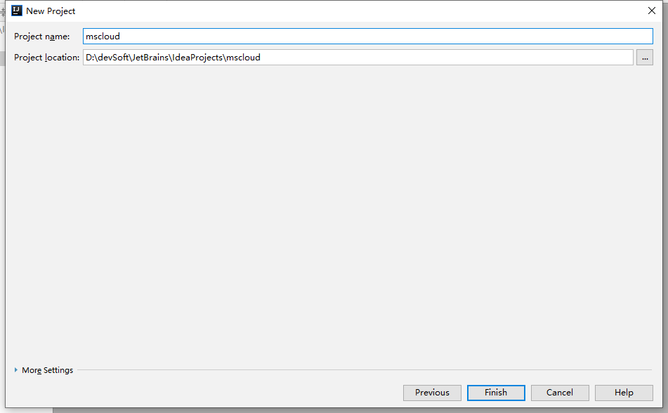

# SpringCloud入门

## 1. 版本选择

### 1.1 SpringBoot版本选择

SpringBoot的git源码地址：[SpringCloud | GitHub](https://github.com/spring-projects/spring-boot/releases/)

 


SpringBoot2.0新特性: [Spring Boot 2.0 Release Notes · spring-projects/spring-boot Wiki (github.com)](https://github.com/spring-projects/spring-boot/wiki/Spring-Boot-2.0-Release-Notes)

 

**通过上面官网发现，Boot官方强烈建议你升级到2.X以上版本**


### 1.2 SpringCloud版本选择

SpringCloud的git源码地址：[SpringCloud | GitHub](https://github.com/spring-projects/spring-cloud)

SpringCloud官网：[SpringCloud 官网](https://spring.io/projects/spring-cloud)

#### 1.2.1 SpringCloud的版本关系

 Spring Cloud **采用了英国伦敦地铁站的名称来命名**，并由地铁站名称字母A-Z依次类推的形式来发布迭代版本
SpringCloud是一个由许多子项目组成的综合项目，各子项目有不同的发布节奏。为了管理SpringCloud与各子项目的版本依赖关系，发布了一个清单，其中包括了某个SpringCloud版本对应的子项目版本。为了避免SpringCloud版本号与子项目版本号混淆，**SpringCloud版本采用了名称而非版本号的命名，这些版本的名字采用了伦敦地铁站的名字，根据字母表的顺序来对应版本时间顺序**。例如Angel是第一个版本, Brixton是第二个版本。

当SpringCloud的发布内容积累到临界点或者一个重大BUG被解决后，会发布一个"service releases"版本，简称SRX版本，比如Greenwich.SR2就是SpringCloud发布的Greenwich版本的第2个SRX版本。


### 1.3 Springcloud和Springboot之间的依赖关系如何看

Springcloud和Springboot之间版本对应：[SpringCloud官方版本对应关系](https://spring.io/projects/spring-cloud#overview)


 

#### 1.3.1 依赖

Finchley 是基于 Spring Boot 2.0.x 构建的不再 Boot 1.5.x

Dalston 和 Edgware 是基于 Spring Boot 1.5.x 构建的，不支持 Spring Boot 2.0.x

Camden 构建于 Spring Boot 1.4.x，但依然能支持 Spring Boot 1.5.x

 


#### 1.3.2 更详细的版本对应查看方法

https://start.spring.io/actuator/info

```json
{
    "git":{
        "branch":"1d3ec43f546f23dffaefe2703daa5baa8a43d734",
        "commit":{
            "id":"1d3ec43",
            "time":"2021-08-09T12:16:52Z"
        }
    },
    "build":{
        "version":"0.0.1-SNAPSHOT",
        "artifact":"start-site",
        "versions":{
            "spring-boot":"2.5.3",
            "initializr":"0.11.0-SNAPSHOT"
        },
        "name":"start.spring.io website",
        "time":"2021-08-09T12:17:57.745Z",
        "group":"io.spring.start"
    },
    "bom-ranges":{
        "azure":{
            "3.2.0":"Spring Boot &gt;=2.3.0.M1 and &lt;2.4.0-M1",
            "3.5.0":"Spring Boot &gt;=2.4.0.M1 and &lt;2.5.0-M1",
            "3.6.0":"Spring Boot &gt;=2.5.0.M1 and &lt;2.6.0-M1"
        },
        "codecentric-spring-boot-admin":{
            "2.4.3":"Spring Boot &gt;=2.3.0.M1 and &lt;2.6.0-M1"
        },
        "solace-spring-boot":{
            "1.1.0":"Spring Boot &gt;=2.3.0.M1 and &lt;2.6.0-M1"
        },
        "solace-spring-cloud":{
            "1.1.1":"Spring Boot &gt;=2.3.0.M1 and &lt;2.4.0-M1",
            "2.1.0":"Spring Boot &gt;=2.4.0.M1 and &lt;2.6.0-M1"
        },
        "spring-cloud":{
            "Hoxton.SR12":"Spring Boot &gt;=2.2.0.RELEASE and &lt;2.4.0.M1",
            "2020.0.3":"Spring Boot &gt;=2.4.0.M1 and &lt;2.5.4-SNAPSHOT",
            "2020.0.4-SNAPSHOT":"Spring Boot &gt;=2.5.4-SNAPSHOT and &lt;2.6.0-M1",
            "2021.0.0-M1":"Spring Boot &gt;=2.6.0.M1 and &lt;2.6.0-SNAPSHOT",
            "2021.0.0-SNAPSHOT":"Spring Boot &gt;=2.6.0-SNAPSHOT"
        },
        "spring-cloud-gcp":{
            "2.0.3":"Spring Boot &gt;=2.4.0-M1 and &lt;2.6.0-M1"
        },
        "spring-cloud-services":{
            "2.3.0.RELEASE":"Spring Boot &gt;=2.3.0.RELEASE and &lt;2.4.0-M1",
            "2.4.1":"Spring Boot &gt;=2.4.0-M1 and &lt;2.5.0-M1"
        },
        "spring-geode":{
            "1.3.12.RELEASE":"Spring Boot &gt;=2.3.0.M1 and &lt;2.4.0-M1",
            "1.4.9":"Spring Boot &gt;=2.4.0-M1 and &lt;2.5.0-M1",
            "1.5.3":"Spring Boot &gt;=2.5.0-M1 and &lt;2.6.0-M1",
            "1.6.0-M1":"Spring Boot &gt;=2.6.0-M1"
        },
        "vaadin":{
            "14.6.8":"Spring Boot &gt;=2.1.0.RELEASE and &lt;2.6.0-M1"
        },
        "wavefront":{
            "2.0.2":"Spring Boot &gt;=2.1.0.RELEASE and &lt;2.4.0-M1",
            "2.1.1":"Spring Boot &gt;=2.4.0-M1 and &lt;2.5.0-M1",
            "2.2.0":"Spring Boot &gt;=2.5.0-M1"
        }
    },
    "dependency-ranges":{
        "native":{
            "0.9.0":"Spring Boot &gt;=2.4.3 and &lt;2.4.4",
            "0.9.1":"Spring Boot &gt;=2.4.4 and &lt;2.4.5",
            "0.9.2":"Spring Boot &gt;=2.4.5 and &lt;2.5.0-M1",
            "0.10.0":"Spring Boot &gt;=2.5.0-M1 and &lt;2.5.2",
            "0.10.1":"Spring Boot &gt;=2.5.2 and &lt;2.5.3",
            "0.10.2":"Spring Boot &gt;=2.5.3 and &lt;2.5.4-SNAPSHOT",
            "0.10.3-SNAPSHOT":"Spring Boot &gt;=2.5.4-SNAPSHOT and &lt;2.6.0-M1"
        },
        "okta":{
            "1.4.0":"Spring Boot &gt;=2.2.0.RELEASE and &lt;2.4.0-M1",
            "1.5.1":"Spring Boot &gt;=2.4.0-M1 and &lt;2.4.1",
            "2.0.1":"Spring Boot &gt;=2.4.1 and &lt;2.5.0-M1",
            "2.1.0":"Spring Boot &gt;=2.5.0-M1 and &lt;2.6.0-M1"
        },
        "mybatis":{
            "2.1.4":"Spring Boot &gt;=2.1.0.RELEASE and &lt;2.5.0-M1",
            "2.2.0":"Spring Boot &gt;=2.5.0-M1"
        },
        "camel":{
            "3.5.0":"Spring Boot &gt;=2.3.0.M1 and &lt;2.4.0-M1",
            "3.10.0":"Spring Boot &gt;=2.4.0.M1 and &lt;2.5.0-M1",
            "3.11.1":"Spring Boot &gt;=2.5.0.M1 and &lt;2.6.0-M1"
        },
        "open-service-broker":{
            "3.2.0":"Spring Boot &gt;=2.3.0.M1 and &lt;2.4.0-M1",
            "3.3.0":"Spring Boot &gt;=2.4.0-M1 and &lt;2.5.0-M1"
        }
    }
}
```


### 1.4 本教程版本选择

| 组件          | 版本          |
| ------------- | ------------- |
| cloud         | Hoxton.SR1    |
| boot          | 2.2.2.RELEASE |
| cloud alibaba | 2.1.0.RELEASE |
| JAVA          | java8         |
| Maven         | 3.5及以上     |
| Mysql         | 5.7及以上     |


## 2. 关于停更组件的的替换

**以前：**

 


**现在：**

 


## 3. 微服务架构编码构建

> 约定 > 配置 > 编码


### 3.1 IDEA新建project工作空间

#### 3.1.1 微服务cloud整体聚合父工程Project

##### 1. New Project

 

##### 2. 聚合总父工程名字

 

##### 3. Maven选版本

 

##### 4. 工程名字

 

##### 5. 字符编码

 

##### 6. 注解生效激活

 

##### 7. java编译版本选8

 

##### 8. File Type过滤

 

#### 3.1.2 父工程POM

```xml
 
<?xml version="1.0" encoding="UTF-8"?>

<project xmlns="http://maven.apache.org/POM/4.0.0" xmlns:xsi="http://www.w3.org/2001/XMLSchema-instance"
         xsi:schemaLocation="http://maven.apache.org/POM/4.0.0 http://maven.apache.org/xsd/maven-4.0.0.xsd">
    <modelVersion>4.0.0</modelVersion>

    <groupId>com.atguigu.springcloud</groupId>
    <artifactId>mscloud03</artifactId>
    <version>1.0-SNAPSHOT</version>
    <packaging>pom</packaging>
 
    <!-- 统一管理jar包版本 -->
    <properties>
        <project.build.sourceEncoding>UTF-8</project.build.sourceEncoding>
        <maven.compiler.source>1.8</maven.compiler.source>
        <maven.compiler.target>1.8</maven.compiler.target>
        <junit.version>4.12</junit.version>
        <log4j.version>1.2.17</log4j.version>
        <lombok.version>1.16.18</lombok.version>
        <mysql.version>5.1.47</mysql.version>
        <druid.version>1.1.16</druid.version>
        <mybatis.spring.boot.version>1.3.0</mybatis.spring.boot.version>
    </properties>
 
    <!-- 子模块继承之后，提供作用：锁定版本+子modlue不用写groupId和version  -->
    <dependencyManagement>
        <dependencies>
            <!--spring boot 2.2.2-->
            <dependency>
                <groupId>org.springframework.boot</groupId>
                <artifactId>spring-boot-dependencies</artifactId>
                <version>2.2.2.RELEASE</version>
                <type>pom</type>
                <scope>import</scope>
            </dependency>
            <!--spring cloud Hoxton.SR1-->
            <dependency>
                <groupId>org.springframework.cloud</groupId>
                <artifactId>spring-cloud-dependencies</artifactId>
                <version>Hoxton.SR1</version>
                <type>pom</type>
                <scope>import</scope>
            </dependency>
            <!--spring cloud alibaba 2.1.0.RELEASE-->
            <dependency>
                <groupId>com.alibaba.cloud</groupId>
                <artifactId>spring-cloud-alibaba-dependencies</artifactId>
                <version>2.1.0.RELEASE</version>
                <type>pom</type>
                <scope>import</scope>
            </dependency>
            <dependency>
                <groupId>mysql</groupId>
                <artifactId>mysql-connector-java</artifactId>
                <version>${mysql.version}</version>
            </dependency>
            <dependency>
                <groupId>com.alibaba</groupId>
                <artifactId>druid</artifactId>
                <version>${druid.version}</version>
            </dependency>
            <dependency>
                <groupId>org.mybatis.spring.boot</groupId>
                <artifactId>mybatis-spring-boot-starter</artifactId>
                <version>${mybatis.spring.boot.version}</version>
            </dependency>
            <dependency>
                <groupId>junit</groupId>
                <artifactId>junit</artifactId>
                <version>${junit.version}</version>
            </dependency>
            <dependency>
                <groupId>log4j</groupId>
                <artifactId>log4j</artifactId>
                <version>${log4j.version}</version>
            </dependency>
            <dependency>
                <groupId>org.projectlombok</groupId>
                <artifactId>lombok</artifactId>
                <version>${lombok.version}</version>
                <optional>true</optional>
            </dependency>
        </dependencies>
    </dependencyManagement>

    <build>
        <plugins>
            <plugin>
                <groupId>org.springframework.boot</groupId>
                <artifactId>spring-boot-maven-plugin</artifactId>
                <configuration>
                    <fork>true</fork>
                    <addResources>true</addResources>
                </configuration>
            </plugin>
        </plugins>
    </build>

</project>
```


#### 3.1.3 Maven工程落地细节复习

##### 1. Maven中的DependencyManagement和Dependencies

Maven 使用dependencyManagement 元素来提供了一种管理依赖版本号的方式。

通常会在一个组织或者项目的最顶层的父POM 中看到dependencyManagement 元素。

使用pom.xml 中的dependencyManagement 元素能让所有在子项目中引用一个依赖而不用显式的列出版本号。
Maven 会沿着父子层次向上走，直到找到一个拥有dependencyManagement 元素的项目，然后它就会使用这个dependencyManagement 元素中指定的版本号。

 

这样做的好处就是**：如果有多个子项目都引用同一样依赖，则可以避免在每个使用的子项目里都声明一个版本号，这样当想升级或切换到另一个版本时，只需要在顶层父容器里更新，而不需要一个一个子项目的修改 ；另外如果某个子项目需要另外的一个版本，只需要声明version就可。**

*     **dependencyManagement里只是声明依赖，并不实现引入，因此子项目需要显示的声明需要用的依赖。**

*   **如果不在子项目中声明依赖，是不会从父项目中继承下来的；只有在子项目中写了该依赖项，并且没有指定具体版本，才会从父项目中继承该项，并且version和scope都读取自父pom;**
    
*     如果子项目中指定了版本号，那么会使用子项目中指定的jar版本。

##### 2. maven中跳过单元测试

1. 配置

   ```xml
   <build><!-- maven中跳过单元测试 -->
       <plugins>
           <plugin>
               <groupId>org.apache.maven.plugins</groupId>
               <artifactId>maven-surefire-plugin</artifactId>
               <configuration>
                   <skip>true</skip>
               </configuration>
           </plugin>
       </plugins>
   </build>
   ```

   

2.  IDEA工具支持(推荐)

    


##### 3. 父工程细节设置

父工程创建完成执行**mvn:install**将父工程发布到仓库方便子工程继承


#### 3.1.4 mysql驱动说明

* com.mysql.jdbc.Driver和mysql-connector-java 5一起用。

* com.mysql.cj.jdbc.Driver和mysql-connector-java 6 一起用。

* com.mysql.cj.jdbc.Driver是mysql-connector-java 6 中的特性，相比mysql-connector-java 5 多了一个时区：serverTimezone，把数据源配置的驱动改一下就好了

 org.gjt.mm.mysql.Driver是当时最好的MySQL JDBC，但不是MySQL公司的，然后MySQL将MM的JDBC驱动 收为官方的JDBC驱动，所以将驱动的package也改了，但还保留了org.gjt.mm.mysql.Driver这个路径的引用，也就是你使用新版的JDBC驱动时还可以通过这个来引用，打开下载的新版JDBC驱动的jar文件可以看到，只有一个文件的目录是org.gjt.mm.mysql，就是为了兼容而设计的。


### 3.2 Rest微服务工程构建

#### 3.2.1 cloud-provider-payment8001微服务提供者支付Module模块

##### 1. 建cloud-provider-payment8001

##### 2. 改POM

```xml
<?xml version="1.0" encoding="UTF-8"?>
<project xmlns="http://maven.apache.org/POM/4.0.0"
         xmlns:xsi="http://www.w3.org/2001/XMLSchema-instance"
         xsi:schemaLocation="http://maven.apache.org/POM/4.0.0 http://maven.apache.org/xsd/maven-4.0.0.xsd">

    <parent>
        <artifactId>mscloud03</artifactId>
        <groupId>com.atguigu.springcloud</groupId>
        <version>1.0-SNAPSHOT</version>
    </parent>
    <modelVersion>4.0.0</modelVersion>

    <artifactId>cloud-provider-payment8001</artifactId>


    <dependencies>
        <dependency>
            <groupId>org.springframework.boot</groupId>
            <artifactId>spring-boot-starter-web</artifactId>
        </dependency>
        <dependency>
            <groupId>org.springframework.boot</groupId>
            <artifactId>spring-boot-starter-actuator</artifactId>
        </dependency>
        <dependency>
            <groupId>org.mybatis.spring.boot</groupId>
            <artifactId>mybatis-spring-boot-starter</artifactId>
        </dependency>
        <dependency>
            <groupId>com.alibaba</groupId>
            <artifactId>druid-spring-boot-starter</artifactId>
            <version>1.1.10</version>
        </dependency>
        <!--mysql-connector-java-->
        <dependency>
            <groupId>mysql</groupId>
            <artifactId>mysql-connector-java</artifactId>
        </dependency>
        <!--jdbc-->
        <dependency>
            <groupId>org.springframework.boot</groupId>
            <artifactId>spring-boot-starter-jdbc</artifactId>
        </dependency>
        <dependency>
            <groupId>org.springframework.boot</groupId>
            <artifactId>spring-boot-devtools</artifactId>
            <scope>runtime</scope>
            <optional>true</optional>
        </dependency>
        <dependency>
            <groupId>org.projectlombok</groupId>
            <artifactId>lombok</artifactId>
            <optional>true</optional>
        </dependency>
        <dependency>
            <groupId>org.springframework.boot</groupId>
            <artifactId>spring-boot-starter-test</artifactId>
            <scope>test</scope>
        </dependency>
    </dependencies>

</project>

```


##### 3. 写YML

```yaml
 
server:
  port: 8001

spring:
  application:
    name: cloud-payment-service
  datasource:
    type: com.alibaba.druid.pool.DruidDataSource            # 当前数据源操作类型
    driver-class-name: org.gjt.mm.mysql.Driver              # mysql驱动包 com.mysql.jdbc.Driver
    url: jdbc:mysql://localhost:3306/db2019?useUnicode=true&characterEncoding=utf-8&useSSL=false
    username: root
    password: 123456


mybatis:
  mapperLocations: classpath:mapper/*.xml
  type-aliases-package: com.atguigu.springcloud.entities    # 所有Entity别名类所在包
```


##### 4. 主启动

```java
import org.springframework.boot.SpringApplication;
import org.springframework.boot.autoconfigure.SpringBootApplication;

@SpringBootApplication
public class PaymentMain8001
{
    public static void main(String[] args)
    {
        SpringApplication.run(PaymentMain8001.class,args);
    }
}
```


##### 6. 业务类

1. 建表SQL

   ```sql
    CREATE TABLE `payment` (
     `id` bigint(20) NOT NULL AUTO_INCREMENT COMMENT 'ID',
     `serial` varchar(200) DEFAULT '',
     PRIMARY KEY (`id`)
   ) ENGINE=InnoDB AUTO_INCREMENT=1 DEFAULT CHARSET=utf8
   ```

   

2. entities

   * 主实体类

     ```java
     import lombok.AllArgsConstructor;
     import lombok.Data;
     import lombok.NoArgsConstructor;
     
     import java.io.Serializable;
     
     @Data
     @AllArgsConstructor
     @NoArgsConstructor
     public class Payment implements Serializable
     {
         private Long id;
         private String serial;
     }
     ```

     

   * Json封装CommonsResult

     ```java
     import lombok.AllArgsConstructor;
     import lombok.Data;
     import lombok.NoArgsConstructor;
     
     import java.io.Serializable;
     
     
     @Data
     @AllArgsConstructor
     @NoArgsConstructor
     public class Payment implements Serializable
     {
         private Long id;
         private String serial;
     }
     ```

     

   

3. dao

   * dao接口

     ```java
     import com.atguigu.springcloud.entities.Payment;
     import org.apache.ibatis.annotations.Mapper;
     
     /**
      * @auther zzyy
      * @create 2020-01-27 20:21
      */
     @Mapper  //import org.apache.ibatis.annotations.Mapper;
     public interface PaymentDao
     {
         public int create(Payment payment);
     
         public Payment getPaymentById(@Param("id") Long id);
     }
     ```

     

   * mybaits的映射文件PaymentMapper.xml

     * 路径：src\main\resources\mapper\PaymentMapper.xml

     * 文件头

       ```xml
       <?xml version="1.0" encoding="UTF-8" ?>
       <!DOCTYPE mapper PUBLIC "-//mybatis.org//DTD Mapper 3.0//EN" "http://mybatis.org/dtd/mybatis-3-mapper.dtd" >
        
       <mapper namespace="">
       
       </mapper>
       ```

     * PaymentMapper.xml

       ```xml
       <?xml version="1.0" encoding="UTF-8" ?>
       <!DOCTYPE mapper PUBLIC "-//mybatis.org//DTD Mapper 3.0//EN" "http://mybatis.org/dtd/mybatis-3-mapper.dtd" >
       
       <mapper namespace="com.xxx.xxx.dao.PaymentDao">
       
           <resultMap id="BaseResultMap" type="com.atguigu.springcloud.entities.Payment">
               <id column="id" property="id" jdbcType="BIGINT"/>
               <result column="serial" property="serial" jdbcType="VARCHAR"/>
           </resultMap>
       
           <insert id="create" parameterType="Payment" useGeneratedKeys="true" keyProperty="id">
               INSERT INTO payment(SERIAL) VALUES(#{serial});
           </insert>
       
           <select id="getPaymentById" parameterType="Long" resultMap="BaseResultMap" >
               SELECT * FROM payment WHERE id=#{id};
           </select>
       
       </mapper>
       ```

       

4. service

   * 接口PaymentService

     ```java
     import org.apache.ibatis.annotations.Param;
     
     public interface PaymentService
     {
         public int create(Payment payment);
     
         public Payment getPaymentById(@Param("id") Long id);
     
     }
     ```

     

   * 实现类

     ```java
     import org.springframework.stereotype.Service;
     import javax.annotation.Resource;
     
     @Service
     public class PaymentServiceImpl implements PaymentService
     {
         @Resource
         private PaymentDao paymentDao;
     
     
         @Override
         public int create(Payment payment)
         {
             return paymentDao.create(payment);
         }
     
         @Override
         public Payment getPaymentById(Long id)
         {
             return paymentDao.getPaymentById(id);
         }
     }
     ```

     

5. controller

   ```java
   package com.atguigu.springcloud.controller;
   
   import com.sun.media.jfxmedia.logging.Logger;
   import lombok.extern.slf4j.Slf4j;
   import org.springframework.web.bind.annotation.*;
   
   import javax.annotation.Resource;
   
   @RestController
   @Slf4j
   public class PaymentController
   {
       @Resource
       private PaymentService paymentService;
   
       @PostMapping(value = "/payment/create")
       public CommonResult create(@RequestBody Payment payment)
       {
           int result = paymentService.create(payment);
           log.info("*****插入操作返回结果:" + result);
   
           if(result > 0)
           {
               return new CommonResult(200,"插入数据库成功",result);
           }else{
               return new CommonResult(444,"插入数据库失败",null);
           }
       }
   
       @GetMapping(value = "/payment/get/{id}")
       public CommonResult<Payment> getPaymentById(@PathVariable("id") Long id)
       {
           Payment payment = paymentService.getPaymentById(id);
           log.info("*****查询结果:{}",payment);
           if (payment != null) {
               return new CommonResult(200,"查询成功",payment);
           }else{
               return new CommonResult(444,"没有对应记录,查询ID: "+id,null);
           }
       }
   }
   ```

   

##### 7. 测试

1. 浏览器访问：

   ```http
   http://localhost:8001/payment/get/31
   ```

2. postman模拟post

3. 运行

   * 通过修改idea的workspace.xml的方式来快速打开Run Dashboard窗口

   * 开启Run DashBoard

     ```xml
     <!--你自己路径：D:\devSoft\JetBrains\IdeaProjects\自己project名\.idea
     -->
     <option name="configurationTypes">
         <set>
             <option value="SpringBootApplicationConfigurationType" />
         </set>
     </option>
     ```

      

     部分idea版本不同，需要关闭重启

##### 8. 总结

1. 建module
2. 改POM
3. 写YML
4. 主启动
5. 业务类


#### 3.2.2 热部署Devtools

1. Adding devtools to your project

   ```xml
   <dependency>
       <groupId>org.springframework.boot</groupId>
       <artifactId>spring-boot-devtools</artifactId>
       <scope>runtime</scope>
       <optional>true</optional>
   </dependency>
   ```

   

2. Adding plugin to your pom.xml

   ```xml
   <!--下段配置我们粘贴进聚合父类总工程的pom.xml里-->
    
   <build>
       <finalName>你自己的工程名字</finalName>
       <plugins>
           <plugin>
               <groupId>org.springframework.boot</groupId>
               <artifactId>spring-boot-maven-plugin</artifactId>
               <configuration>
                   <fork>true</fork>
                   <addResources>true</addResources>
               </configuration>
           </plugin>
       </plugins>
   </build>
   ```

   

3. Enabling automatic build

    

    

4. Update the value of

     

    

5. 重启IDEA

#### 3.2.3 cloud-consumer-order80微服务消费者订单Module模块


#### 2.2.4 工程重构


#### 2.2.5 目前工程样图

