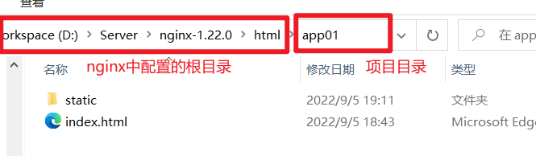

# vue打包时publicPath设置的问题

## 1. 通过nginx方式部署

> 假设vue打包后，将打包好的文件放到对应的项目目录下面


nginx中对静态文件的访问的配置

```
location / {
        root   D:\Server\nginx-1.22.0\html;  # 根目录位置
        index  index.html index.htm;
 }
```

如果将打包好的项目放置到nginx配置的根目录下的项目目录(app01)下

```
D:\Server\nginx-1.22.0\html\app01\
```



如果nginx中拦截的端口是8080，此时访问html页面的路径为:

```
http://127.0.0.1:8080/app01/index.html
```

如果nginx中拦截的端口是8080，此时访问静态资源的路径为:

```
http://127.0.0.1:8080/app01/static/css/xxx.css
http://127.0.0.1:8080/app01/static/js/xxx.js
...
```


在vue配置中：

* 将静态文件输出到static文件夹下

```js
assetsDir: 'static',
```

* 配置部署后的请求路径

  1. `publicPath: '/'`

     表所有静态请求从根目录出发(也就是通过nginx配置的跟目录)，根目录下的static为静态资源目录

     ```
     D:\Server\nginx-1.22.0\html\static\
     ```

     此时页面中请求的静态资源地址为：

     ```
     http://127.0.0.1:8080/static/css/xxx.css
     http://127.0.0.1:8080/static/js/xxx.js
     ...
     ```

     所以不符合上述nginx的配置方式，资源不能被正常访问到

     

  2. `publicPath: './'`

     表所有静态请求从根目录出发(也就是通过nginx配置的跟目录下面的项目目录)，根目录下项目目录的static为静态资源目录

     ```
     D:\Server\nginx-1.22.0\html\app01\static\
     ```

     此时页面中对静态资源请求的地址为

     ```
     http://127.0.0.1:8080/app01/static/css/xxx.css
     http://127.0.0.1:8080/app01/static/js/xxx.js
     ...
     ```

     所以符合上述nginx的配置方式，资源能被正常访问到

     > 注意：
     >
     > 如果项目中有写这种格式的地址
     >
     > ``
     >
     > 请求的时候会默认加上前缀： http:127.0.0.1:8080/static/img/a.png, 此时这种格式路径的图片也是无法访问的


## 2. 通过Django方式部署

在django中配置对静态资源的拦截

```python
STATIC_URL = "/static/"
STATICFILES_DIRS = (
	os.path.join(BASE_DIR, "static") # django项目目录下的static文件夹
)
```

表示django会拦截所有请求根目录(http://127.0.0.1:8080/)下的"/static/"请求`http://127.0.0.1:8080/static/xxx/xxx.js`的请求方式，会被转发到配置好的静态资源目录下面

即：http://127.0.0.1:8080/static/xxx/xxx.js 会请求到django项目跟目录下的 static目录下的xxx目录下的xxx.js


在vue配置中：

* 将静态文件输出到static文件夹下

```js
assetsDir: 'static',
```

* 配置部署后的请求路径

  1. `publicPath: '/'`

     表所有静态请求从根目录出发(也就是通过nginx配置的跟目录)，根目录下的static为静态资源目录

     ```
     D:\Server\nginx-1.22.0\html\static\
     ```

     此时页面中请求的静态资源地址为：

     ```
     http://127.0.0.1:8080/static/css/xxx.css
     http://127.0.0.1:8080/static/js/xxx.js
     ...
     ```

     所以符合上述django的配置方式，资源能被正常访问到

     

  2. `publicPath: './'`

     表所有静态请求从根目录出发(也就是通过nginx配置的跟目录下面的项目目录)，根目录下项目目录的static为静态资源目录

     ```
     D:\Server\nginx-1.22.0\html\app01\static\
     ```

     此时页面中对静态资源请求的地址为

     ```
     http://127.0.0.1:8080/app01/static/css/xxx.css
     http://127.0.0.1:8080/app01/static/js/xxx.js
     ...
     ```

     所以不符合上述django的配置方式，资源不能被正常访问到


