# Git使用技巧
==注意：图片无法显示，请下载后方可观看完整教程==

## 一，Git安装

### 1.安装

下载地址：https://git-scm.com/

注意：就这一步选择Use Git from Git Bash only 其它步骤默认

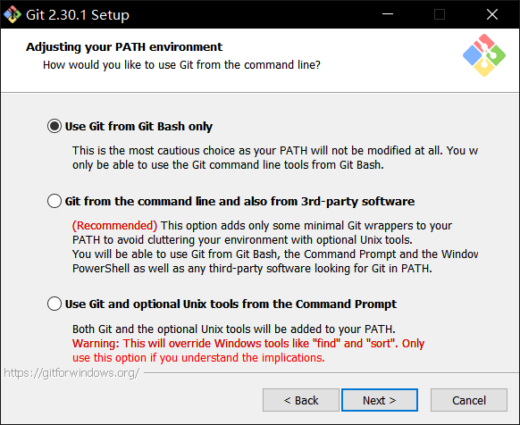

### 2.配置环境变量

在系统的环境变量中将Git的bin目录配置到path中即可

### 3.配置Git

桌面空白处右键选择Git bash here

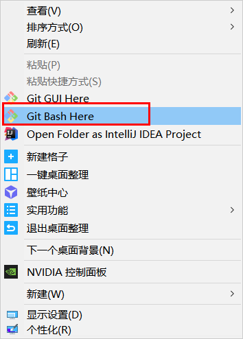

设置用户名：git config --global user.name "lyx"

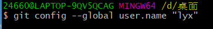

设置电子邮件地址：git config --global user.email "2466057319@qq.com"

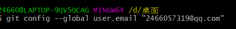

若系统用户目录下生成.getconfig文件且内容如下即为配置成功

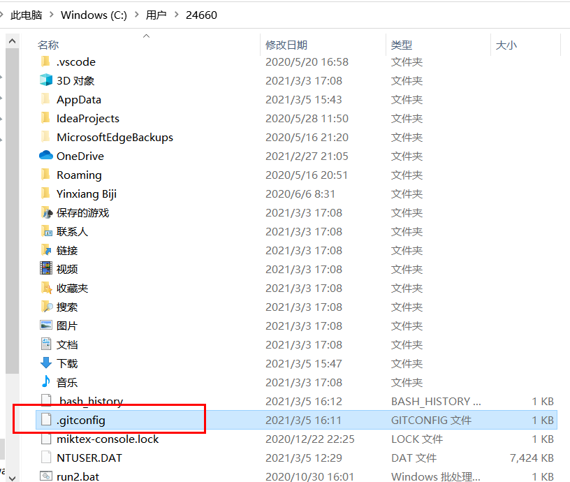

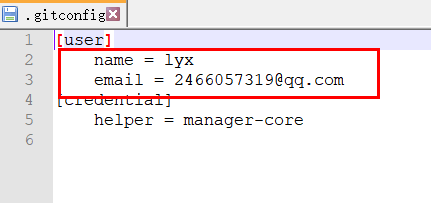

### 3.配置github

配置本地与github仓库ssh免密钥登陆，使用ssh-keygen -t rsa -b 4096 -C “你的邮箱”命令创建ssh密钥

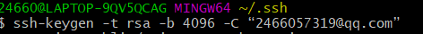

然后输入两下回车就可以完成创建，在用户目录的.ssh文件夹下就可以生成id_rsa和id_rsa.public两个文件

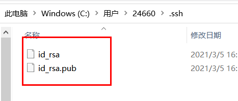

**将ssh发送给github仓库**

* 进入github选择settings  

  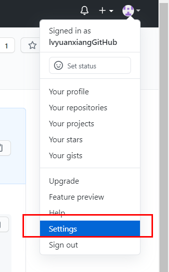

* 选择SSH and GPG keys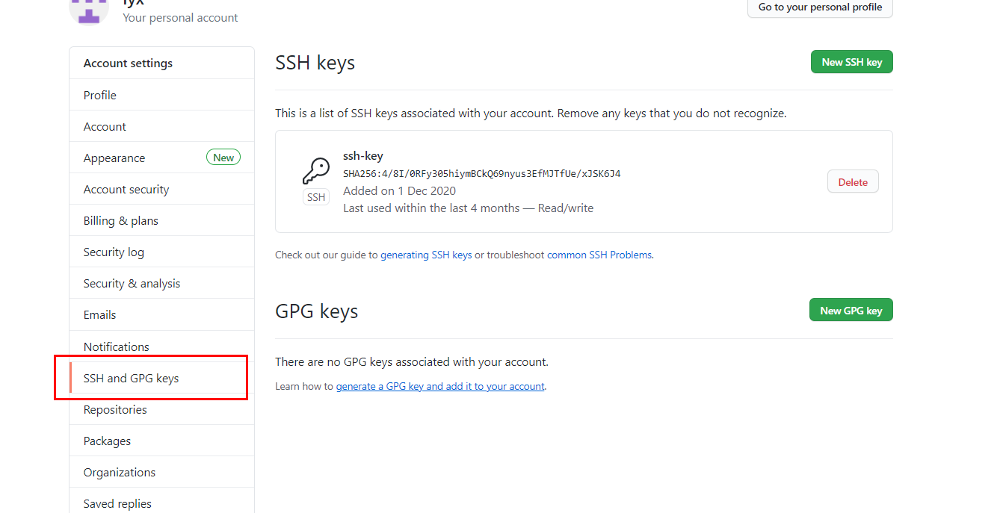

* 选择New ssh key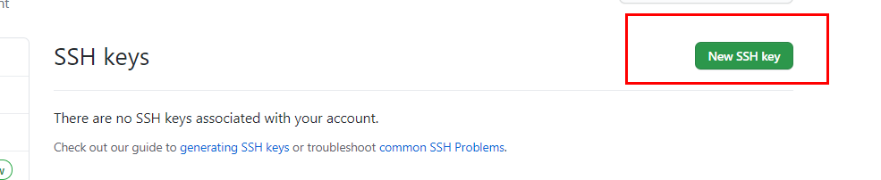

* 在弹出的页面中输入任意的Title,key中输入刚刚生成的id_rsa.public中的代码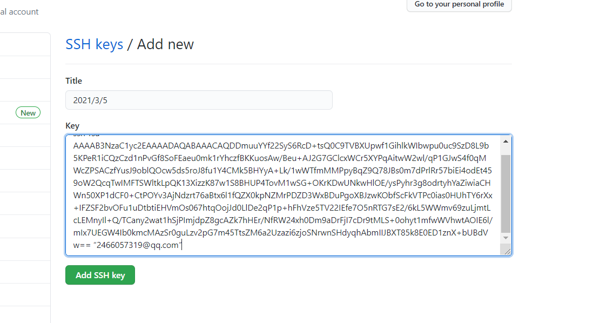

* 在桌面中右键选择Git bash here进入命令窗口，输入ssh -T git@github.com

==注意：由于网络原因可能造成失败，建议没有成功的多试几次==

当出现successfully并且用户目录出现lnowm_hosts文件即为本地和远程可以创建通信

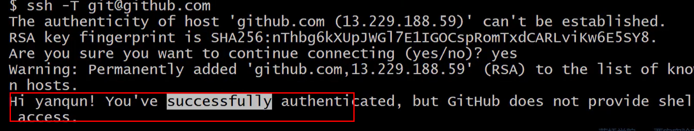

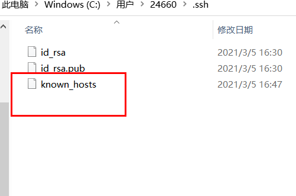

### 4.本地项目与远程项目关联

在任意位置建一个文件夹，里面创建一个txt文件用于测试

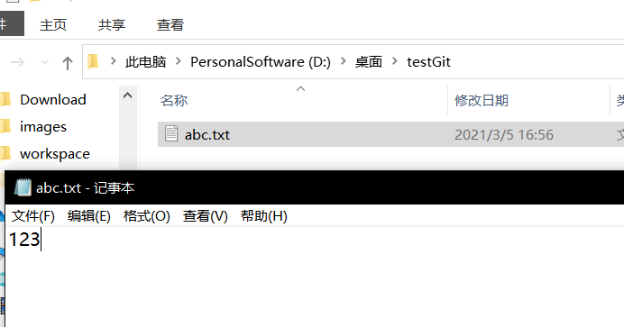

在文件夹内右键Git bash here进入命令行窗口，输入git init初始化项目，出现.get文件夹即为创建成功

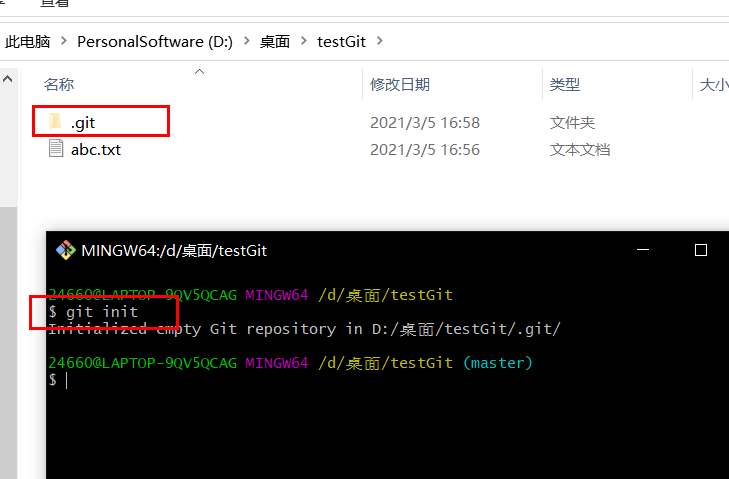

在Github中创建项目

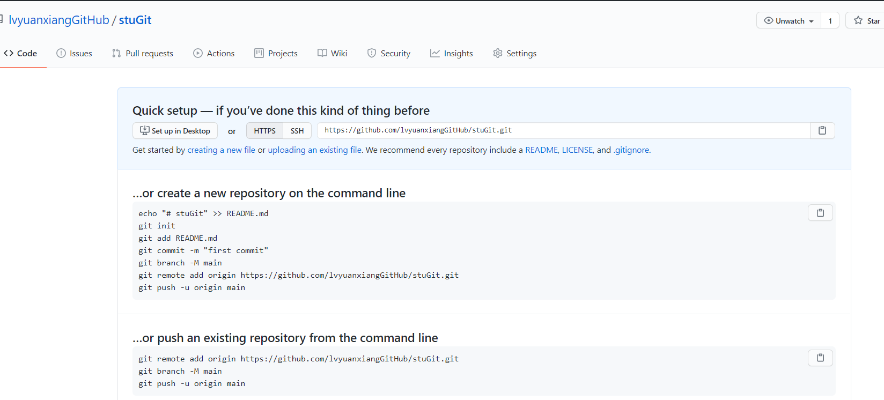

使用ssh方式将本地项目与远程项目进行关联，复制Github中生成的ssh，在命令行窗口中输入get remote add origin 复制的ssh

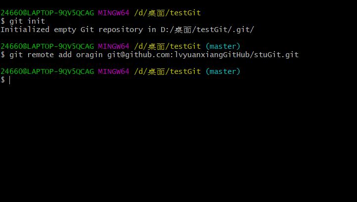

### 5.第一次发布项目到远程

> 1. 将文件放到暂存区 git add .
>
>    
>
> 2. 将文件从暂存区放入本地分支（默认 master）git commit -m "注释内容"
>
>    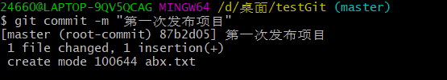
>
> 3. 将文件放入github仓库的master分支 git push -u origin master
>
>    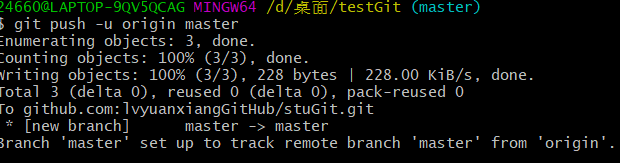

### 6.第一次克隆远程中的项目

桌面右键选择Git bash here 进入命令行窗口，输入Git clone 项目的ssh克隆地址,如图

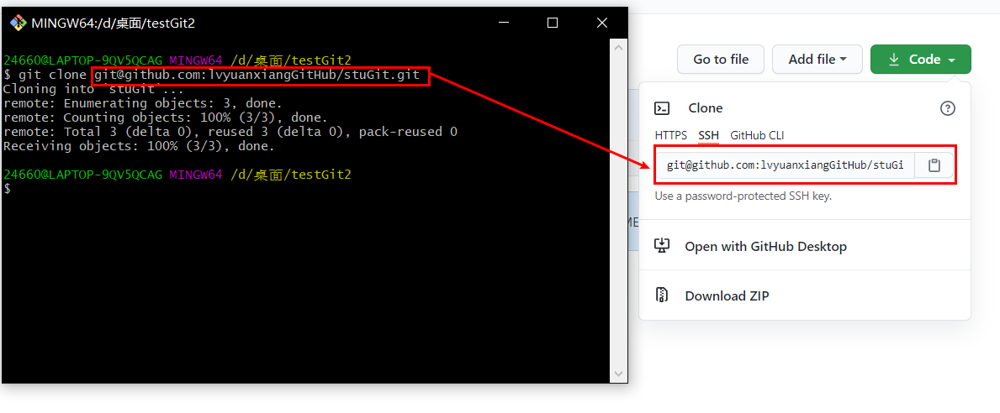

运行成功后github中的项目就克隆到本地了

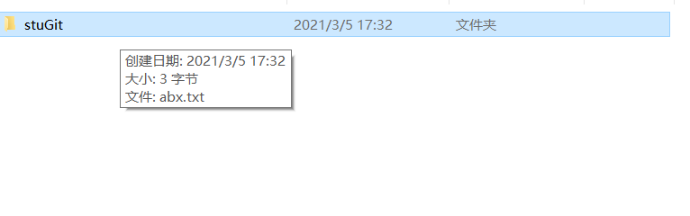

### 7.提交项目

> 1. 将项目放入暂存区 git add .
>
> 2. 将项目提交到本地仓库 git commit -m "修改的内容"
>
> 3. 将项目推送到远程 git push origin master
>
>    ==注意：本次提交与第一次提交的的命令中少了-u==
>
>    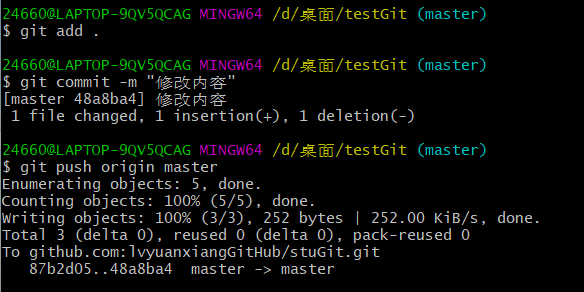

### 8.更新项目

命令行输入git pull

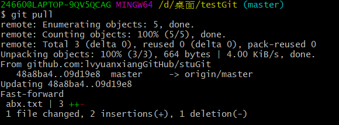

##  二，常用命令

> * 设置用户名：git config --global user.name "lyx"
> * 设置电子邮件地址：git config --global user.email "2466057319@qq.com"
> * 配置本地与github仓库ssh免密钥登陆：ssh-keygen -t rsa -b 4096 -C “你的邮箱”
> * 与获得密钥的github仓库进行链接：ssh -t git@github.com
> * 初始化项目：git init
> * 将项目添加到暂存区：git add .
> * 提交项目到本地仓库：git commit -m "日志内容"
> * 将文件放入github仓库的master分支：git push -u origin master（第一次提交文件）
> * 将文件提交到github仓库：git push origin master 
> * 克隆项目：git clone github中的克隆地址
> * 更新本地项目：git pull

## 三，git高级

三个状态：

* 已修改：modified

* 已暂存：staged

* 已提交：commited

  ---

  

> * git init : 将目录纳入git管理，默认master分支
> * rm -rf .git : 删除.git目录并且迭代删除里面的子目录
> * touch 123.txt : 新建123.txt文件
> * git status ：显示状态
>
> 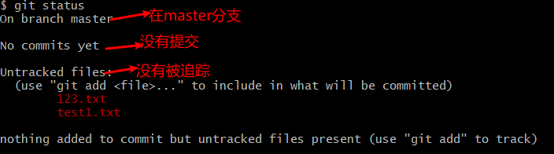
>
> 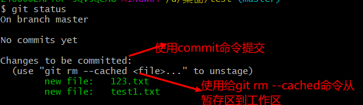
>
> * git rm --cached 123.txt：将123.txt文件从暂存区放到工作区
>
> * git commit 回车，进入注释编辑模式，或者使用git commit -m "注释内容"
>
>   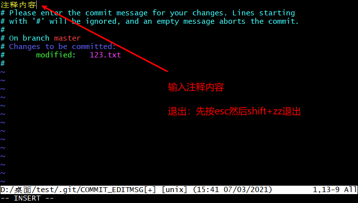
>
> * git log：查看所有提交日志
> * git log: -次数：查看最近次数的日志
> * git log --pretty=oneline：一行显示日志主要内容
> * git log --pretty=format:"%h - %an , %ar : %s"：按照格式显示日志内容
> * git restore 文件名 ：提交过后的文件修改了，可放弃修改，还原到已提交状态


### ==常用linux命令和快捷键==

+ ctrl+a：光标到定位到开头
+ ctrl+e：光标定位到结尾
+ ctrl+c：放弃当行重新输入
+ echo '输入的内容' > 文件名：覆盖文件的内容
+ cat "文件名"：查看文件内容
+ vm 文件名：进入编辑模式
+ :set number：显示行号
+ 

### 1.git账户

* git config --system: 基本不用，给计算机一次性设置 优先级最低
* git config --global ：给当前用户一次性设置 优先级中等
* git config --local ：给当前项目一次性设置 优先级最高

---

> **给当前项目设置用户名和邮箱**
>
> * git config --local user.name "用户名" ：设置项目用户名
> * git config --local user.email "邮箱地址" ：设置项目邮箱
>
> 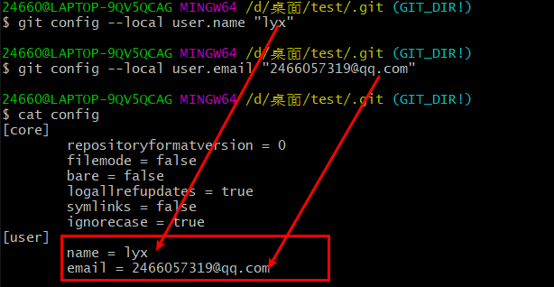
>
> * git config --local --unset user.name ：删除项目用户名
> * git config --local --unset user.email : 删除项目的邮箱
>
> ==修改用户名和邮箱后，只对修改后的操作有效，修改之前的操作用的还是之前的用户名和邮箱==

### 2.git删除

删除已经提交到对象区的文件：git rm 文件名，删除后文件在暂存区

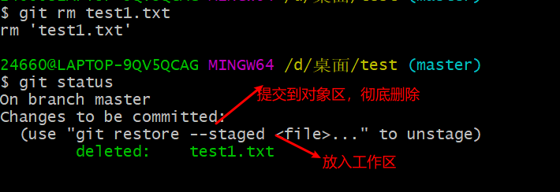

将删除操作放入工作区后，查看状态：

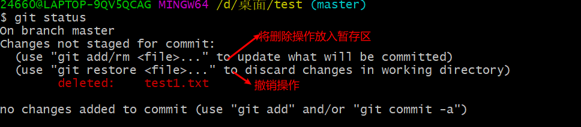


## 四， 补充命令

### 1、 取消追踪

> 将文件由被追踪状态变为取消追踪状态，文件并未被删除

```shell
git rm --cached <filename>
```


### 2、提交

1、git commit '注释内容'

2、git commit -m  ‘注释内容’

3、git commit -am ‘注释内容’  ： 相当于 git add . +  git commit -m '注释内容' 两步操作合二为一，但是未提交到暂存区的（未追踪的文件）无法使用该命令提交文件。


### 3、查看修改前后文件

>查看文件修改前后的区别（未commit之前）

```shell
# 不带文件名可展示所有的文件的差异
git diff
git diff <filename>
```

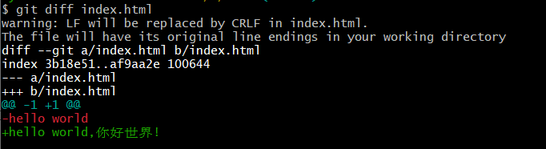

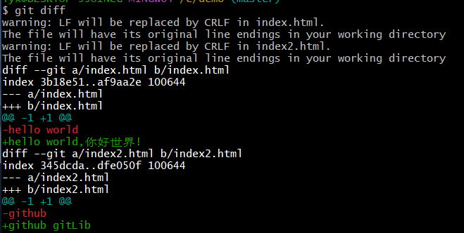

查看add后但未提交的版本差异

```
git diff --staged
git diff --staged <filename>
```

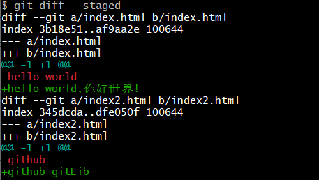


### 4、文件忽略

* 忽略文件的名称必须叫`.gitignore`

  * ```
    /module 忽略名叫module的文件夹及其下面的所有文件
    *.log   忽略以.log结尾的所有文件
    a.txt   忽略a.txt这个文件
    ```

* 已经提交过的文件的忽略

  * ```
    1、git rm -r --cached . 强制将缓存里面的所有文件剔除（但是本地文件不会删除）
    2、创建.gitignore文件
    3、重新提交文件
    ```

  * ```
    1、git rm -r --cached <filename> 强制将缓存里面的指定文件剔除（但是本地文件不会删除）
    2、创建.gitignore文件
    3、重新提交文件
    ```


### 5、回退到上一个版本

未添加到缓冲区还原版本

```
git checkout -- <filename>
```


已经添加到缓冲区还原版本

```
# 回退到文件的上一步操作
git reset HEAD <filename>
# 还原文件
git checkout -- <filename>
```


### 6、版本回退（不保留版本号）

```
git reset --hard HEAD^ 回退到上一个版本
git reset --hard HEAD^^ 回退到上上个版本
git reset --hard HEAD [hash号] 回退到指定版本
git reflog 查看指针游标
```


### 7、回到旧版本 （保留版本号）

```
git checkout hash号 -- <filename>  # 回退指定文件到指定版本
git checkout hash号 -- .			  # 回退所有文件到指定版本
```

