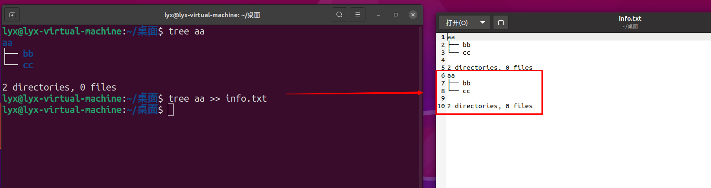
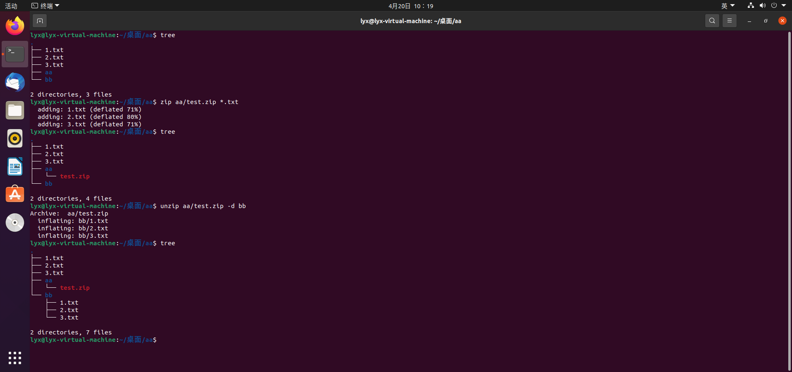
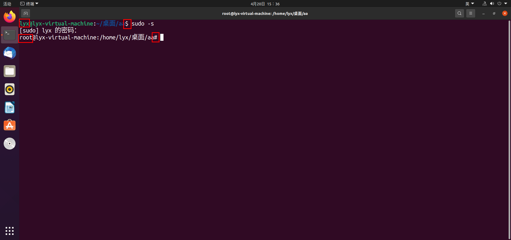
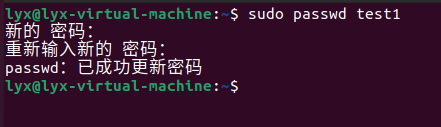
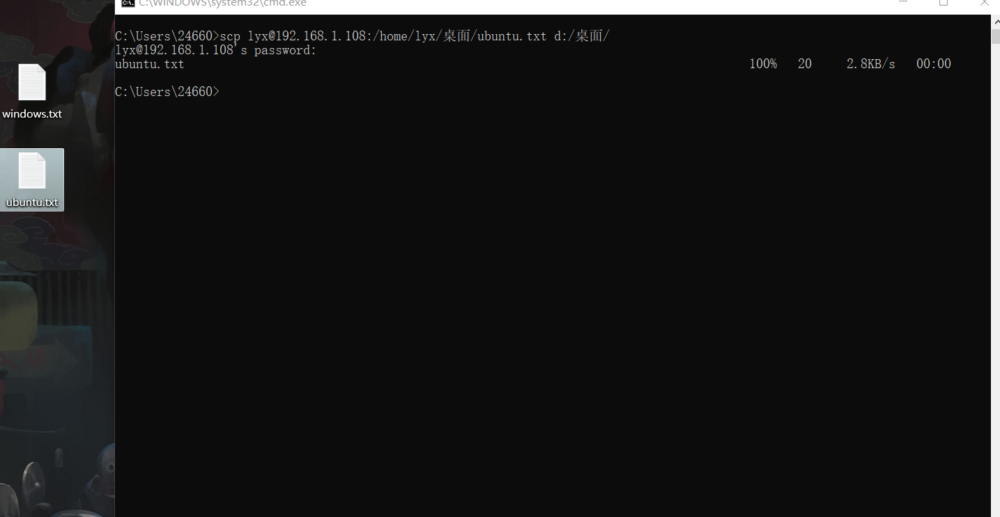
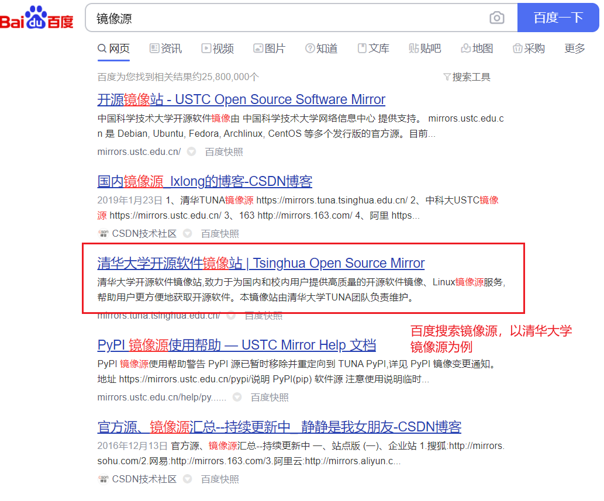
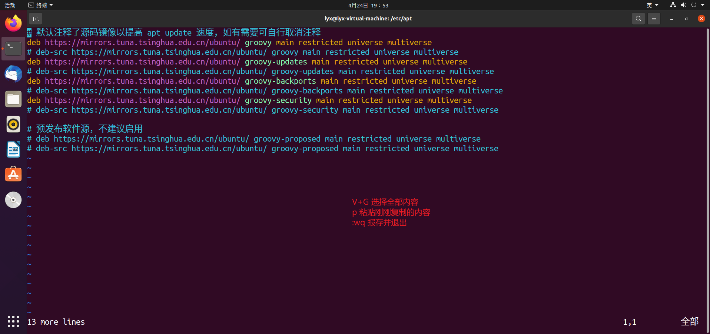

#  linux常用命令

## 1. 使用技巧

### 1.1 清除终端命令

| 命令  | 说明             |
| ----- | ---------------- |
| clear | 清除终端上的代码 |

### 1.2 字体大小

| 快捷键                 | 说明         |
| ---------------------- | ------------ |
| `ctrl` + `shift` + `+` | 放大终端字体 |
| `ctrl` + `-`           | 缩小终端字体 |

### 1.3 打开终端

| 快捷键               | 说明         |
| -------------------- | ------------ |
| `ctrl` + `alt` + `t` | 快速打开终端 |

### 1.4 进入root模式

| 命令    | 说明         |
| ------- | ------------ |
| su root | 进入root模式 |


### 1.4 文档浏览

| 操作 | 说明   |
| ---- | ------ |
| f    | 下一页 |
| d    | 上一页 |
| 空格 | 下一页 |
| 回车 | 下一行 |
| q    | 退出   |


### 1.5 操作隐藏目录或文件

与操作普通文件和目录相似，只需在文件名或目录名前加`.`即可

如：mkdir .aa(创建隐藏文件夹aa) 	touch .aa.txt(创建隐藏文件a.txt)


### 1.6 查看python3解释器路径

| 命令          | 说明                  |
| ------------- | --------------------- |
| which python3 | 查看python3解释器路径 |

### 1.7 使用系统执行文件

| 命令     | 说明     |
| -------- | -------- |
| ./文件名 | 执行文件 |


拓展：

| 格式                    | 说明                                  |
| ----------------------- | ------------------------------------- |
| `# 注释内容`            | #表示一个注释                         |
| `# _*_conding:utf-8_*_` | #表示文件指定编码格式                 |
| `#!/python解释器路径`   | #表示操作系统直接执行文件选择的解释器 |

###  1.8 修改当前用户密码

| 命令     | 说明             |
| -------- | ---------------- |
| password | 修改当前用户密码 |

### 1.9 查看命令路径

| 命令         | 说明         |
| ------------ | ------------ |
| which 命令名 | 查看命令路径 |

### 1.10 查看系统用户

| 命令 | 说明         |
| ---- | ------------ |
| who  | 查看系统用户 |


## 2. 查看目录命令

### 2.1 查看目录

| 命令 | 说明                   |
| ---- | ---------------------- |
| ls   | 查看当前目录信息       |
| tree | 以树状方式显示目录信息 |


### 2.2 查看当前目录路径

| 命令 | 说明             |
| ---- | ---------------- |
| pwd  | 查看当前目录路径 |


## 3. 切换目录

| 命令    | 说明                 |
| ------- | -------------------- |
| cd 目录 | 切换到指定目录       |
| cd ~    | 切换到当前用户主目录 |
| cd ..   | 切换到上一级目录     |
| cd .    | 切换到当前目录       |
| cd -    | 切换到上次目录       |


## 4. 创建，删除文件和目录

| 命令         | 说明                             |
| ------------ | -------------------------------- |
| touch 文件名 | 创建指定文件                     |
| mkdir        | 创建目录                         |
| rm 文件名    | 删除指定文件                     |
| rm 文件夹 -r | 递归方式删除文件夹即里面所有文件 |
| rmdir 目录名 | 删除空目录                       |


## 5. 复制，移动文件及目录

| 命令                               | 目录                                                         |
| ---------------------------------- | ------------------------------------------------------------ |
| cp 文件 目标路径                   | 拷贝文件                                                     |
| cp 目录 目标路径 -r                | 拷贝目录                                                     |
| mv 文件名或目录 目标路径           | 移动文件，目录                                               |
| mv 文件名或目录名 新文件名或目录名 | 重命名文件或目录（重命名目录时，新的目录名不能存在，否则执行移动命令） |


## 6. 终端命令格式

```linux
command [-options] [parameter]
```

**每项信息说明：**

* command：命令名 如：ls，pwd
* [-options]：选项，可以有零个或多个，对个项可以合并，比如使用的-r就是项
* [parameter]：参数，可以有零个或多个，比如touch 文件名， mkdir 目录名
* []：代表可选

**注意：**

* 对于命令，他的选项和参数一般情况下没有顺序要求，但是使用scp命令时必须选项后再跟上参数
* 选项可以分为短选项和长选项
  1. 短选项格式为`-`后面跟单个字母，如`-r`
  2. 长选项格式为`--`后面阶单词，如：`--help`


## 7. ls命令选项

| 命令选项 | 说明                     |
| -------- | ------------------------ |
| -l       | 以列表方式显示           |
| -h       | 以大小单位显示，默认字节 |
| -a       | 显示隐藏文件夹和目录     |

> 注意：可搭配使用，如：`ls -l -h -a` 简化为 `ls -lha` 无顺序要求。

信息说明：


## 8. mkdir命令选项

| 命令选项 | 说明               |
| -------- | ------------------ |
| -p       | 创建所依赖的文件夹 |


## 9. rm命令选项

| 命令选项 | 说明                                 |
| -------- | ------------------------------------ |
| -i       | 交互式提示（询问是否删除）           |
| -r       | 递归删除目录及其内容                 |
| -f       | 强制删除，忽略不存在的文件，无需提示 |
| -d       | 删除空目录                           |


## 10. cp命令选项

| 命令选项 | 说明                                                         |
| -------- | ------------------------------------------------------------ |
| -i       | 交互式提示                                                   |
| -r       | 递归拷贝目录及其内容                                         |
| -v       | 显示拷贝后的路径描述                                         |
| -a       | 保留文件的原有权限（还可以在拷贝文件夹时使文件夹内文件权限不丢失） |


## 12. mv命令选项

| 命令选项 | 说明                 |
| -------- | -------------------- |
| -i       | 交互式提示           |
| -v       | 显示移动后的路径描述 |


## 13. 重定向

> **重定向**也称之为**输出重定向**，把终端执行命令的结果保存到目标文件。

| 命令 | 说明                                                      |
| ---- | --------------------------------------------------------- |
| `>`  | 如果文件存在会覆盖原有文件内容，相当于文件操作中的`w`模式 |
| `>>` | 如果文件存在会追加写入文件末尾，相当于文件操作中的`a`模式 |

快速体验：

* `>`


* `>>`



## 14.查看文件内容

| 命令 | 说明             |
| ---- | ---------------- |
| cat  | 查看小型文件     |
| more | 分屏查看大型文件 |

### 14.1 管道`|`命令

管道`i`：一个命令的输出可以通过管道作为另一个命令的输出，可以理解成是一个容器，存放在终端显示内容 。


> 说明：cat无法修改文件，可思议gedit命令查看和编辑文件

## 15. 链接命令

| 命令  | 说明       |
| ----- | ---------- |
| ln -s | 创建软连接 |
| ln    | 创建硬链接 |

### 15.1 软连接

> 类似于Windows下创建文件的快捷方式

语法

```linux
ln -s 源文件绝对地址 软链接文件路径
```

快速体验：


### 15.2 硬链接

> 类似于**源文件的一个别名**，也就是说这两个名字指向同一个文件数据。

语法：

```linux
lh 源文件绝对地址 硬链接文件地址
```

快速体验：


## 16. 文本搜索命令

| 命令 | 说明     |
| ---- | -------- |
| grep | 文本搜索 |

快速体验：


### 16.1 grep命令选项

| 命令选项 | 说明                       |
| -------- | -------------------------- |
| -i       | 忽略大小写                 |
| -n       | 匹配行号                   |
| -v       | 显示不包含匹配文本的所有行 |

快速体验：


### 16.2 grep配和正则表达式使用

| 正则表达式 | 说明                   |
| ---------- | ---------------------- |
| ^          | 以指定字符串开头       |
| $          | 以指定字符串结尾       |
| .          | 匹配一个非换行符的字符 |

快速体验：


### 16.3 grep配合管道`|`使用

快速体验：


## 17. 文件搜索命令

| 命令        | 说明                           |
| ----------- | ------------------------------ |
| find  -name | 根据文件名在指定目录下查找文件 |

快速体验：


###  17.1 find命令配合通配符使用

| 通配符 | 说明                  |
| ------ | --------------------- |
| *      | 代表0个或多个任意字符 |
| ？     | 代表任意一个字符      |

快速体验：


## 18. 压缩和解压缩

> linux默认支持的压缩格式：
>
> * .gz
> * .bz2
> * .zip
>
> 说明：
>
> * .gz和.bz2的压缩包需要使用tat命令来压缩和解压缩
> * .zip的压缩包需要使用zip命令来压缩。使用uzip命令来解压

### 18.1 tar命令及选项的使用

| 命令 | 说明             |
| ---- | ---------------- |
| tar  | 压缩和解压缩命令 |

tar命令选项：

| 选项 | 说明                               |
| ---- | ---------------------------------- |
| -c   | 创建打包文件                       |
| -v   | 显示打包或解包的详细信息           |
| -f   | 指定文件名称，必须放到所有选项后面 |
| -z   | 压缩或解压缩(.gz)                  |
| -j   | 压缩或解压缩(.bz2)                 |
| -x   | 解包                               |
| -C   | 解压缩到指定目录                   |

> 一般步骤：
>
> * 压缩： `-zcvf`  `-jcvf`   => - 压缩 创建打包文件 显示打包解包信息 指定文件名
> * 解压：`-zxvf`  `-jxvf` => - 解压 解包 显示打包解包信息 指定文件名

快速体验：

.gz


.bz2


### 18.2 zip和unzip命令及选项的使用

| 命令  | 说明               |
| ----- | ------------------ |
| zip   | 压缩成.zip格式文件 |
| unzip | 解压缩.zip格式文件 |

unzip命令选项

| 命令选项 | 说明           |
| -------- | -------------- |
| -d       | 解压到指定目录 |

快速体验：



## 19. 文件权限

### 19.1 chmod命令

| 命令  | 说明         |
| ----- | ------------ |
| chmod | 修改文件属性 |

`chmod`修改文件权限有两种方式:

* 字母法
* 数字法

### 19.1.1 字母法

| 角色 | 说明                   |
| ---- | ---------------------- |
| u    | user，表示文件的所有者 |
| g    | group，表示用户组      |
| o    | other，表示其他用户    |
| a    | all，表示所有用户      |

权限设置说明：

| 操作符 | 说明     |
| ------ | -------- |
| +      | 增加权限 |
| -      | 撤销权限 |
| =      | 设置权限 |

权限说明：

| 权限 | 说明       |
| ---- | ---------- |
| r    | 可读       |
| w    | 可写       |
| x    | 可执行     |
| -    | 无任何权限 |

文件权限格式：


快速体验：


### 19.1.2 数字法

| 权限 | 说明            |
| ---- | --------------- |
| r    | 可读，权限值4   |
| w    | 可写，权限值2   |
| x    | 可执行，权限值1 |
| -    | 无权限，权限值0 |

快速体验：


## 20. 获取管理员权限

### 20.1 sudo命令

| 命令    | 说明                                                     |
| ------- | -------------------------------------------------------- |
| sudo -s | 切换到root用户，获取管理员权限                           |
| sudo    | 某个命令执行需要获取管理员权限可以在执行命令前面加上sudo |

sudo -s快速体验：



sudo快速体验：


## 21. 用户相关操作

### 21.1 创建用户

| 命令    | 说明               |
| ------- | ------------------ |
| useradd | 创建用户，添加用户 |

useradd命令选项：

| 命令 | 说明                                               |
| ---- | -------------------------------------------------- |
| -m   | 自动创建主目录，主目录名字就是用户名               |
| -g   | 指定用户所属组，默认不指定会自动创建一个同名用户组 |

快速体验：


> 说明：
>
> * useradd命令的使用需要管理员权限，前面要加上sudo
> * 创建用户如果不指定用户组，默认会自动创建一个同名的用户组
> * 查看用户是否创建成功可以查看`/etc/passwd`这个文件
> * 查看用户是否创建成功可以查看`/etc/grup`这个文件

```shell
passwd文件中的每项信息说明，以root:x:0:0:root:/root:/bin/bash为例
* 第一个：用户名
* 第二个：密码占位符
* 第三个：uid，用户id
* 第四个：gid，用户组所在id
* 第五个：用户描述，可选
* 第六个：用户主目录所在位置
* 第七个：用户所有shell的类型，一般由bash或者sh，默认不设置sh类型
```

```shell
grup文件中每项信息说明，以laowang:x:1001为例：
* 第一个：用户组名
* 第二个：用户组名密码占位符，一般Linux系统的用户组都没有密码
* 第三个：组id
```

### 21.2 修改密码

>  给其他用户设置密码，需要使用： sudo passwd 用户名

快速体验：



### 21.3 切换用户

| 命令 | 说明     |
| ---- | -------- |
| su   | 切换用户 |

语法

```语法
su - 用户名
```

快速体验：


### 21.4 修改用户信息

| 命令    | 说明         |
| ------- | ------------ |
| usermod | 修改用户信息 |

usermod选项：

| 命令选项 | 说明           |
| -------- | -------------- |
| -G       | 设置一个附加组 |
| -g       | 修改用户组     |

> 注意：
>
> * 每一个用户只有一个用户组，用户组可以认为是主组
> * 附加组可以有很多个

快速体验：


**删除附加组**

| 命令    | 说明                 |
| ------- | -------------------- |
| gpasswd | 添加和删除附加组信息 |

gpasswd命令选项

| 命令选项  | 说明             |
| --------- | ---------------- |
| -a 用户名 | 给用户添加附加组 |
| -d 用户名 | 给用户删除附加组 |

快速体验：


### 21.5 删除用户组

| 命令    | 说明     |
| ------- | -------- |
| userdel | 删除用户 |

userdel命令选项：

| 命令选项  | 说明                                             |
| --------- | ------------------------------------------------ |
| -r 用户名 | 删除用户主目录，必须设置，否则用户主目录不会删除 |

快速体验：


### 21.6 创建用户组

| 命令     | 说明               |
| -------- | ------------------ |
| groupadd | 创建（添加）用户组 |

快速体验：


**修改用户组**

> 步骤：
>
> 1. 创建新用户组
> 2. 修改用户用户组


**删除用户组**

| 命令     | 说明       |
| -------- | ---------- |
| groupdel | 删除用户组 |

快速体验：


## 22. 远程登录和远程拷贝

| 命令 | 说明     |
| ---- | -------- |
| ssh  | 远程登录 |
| scp  | 远程拷贝 |

### 22.1 ssh命令使用

ssh是专门为远程登录提供的安全协议，常用语远程登录，想要使用ssh服务，需要安装相应的服务端和客户端软件，当软件安装后就可以使用ssh命令了，以后可以通过远程登录操作远程服务器。

> 安装步骤：
>
> 1. 判断电脑中是否安装了openssh-server
>
>    | 命令     | 说明                     |
>    | -------- | ------------------------ |
>    | apt list | 查看电脑中所有安装的软件 |
>
>    ​	
>
> 2. 在linux中安装openssh-server
>
>    | 命令                                | 说明        |
>    | ----------------------------------- | ----------- |
>    | sudo apt-get install openssh-server | 安装ssh服务 |
>
>    ​	
>
> 3. 在远程电脑中安装ssh客户端。由于macOS中自带ssh客户端软件，无需安装可直接使用ssh命令。如果是windows系统则需要安装OpenSSH for Windows这个软件
>
> 4. 建立连接
>
>    | 命令              | 说明           |
>    | ----------------- | -------------- |
>    | ssh 用户名@ip地址 | 连接远程的电脑 |
>
>    

### 22.2 scp命令使用

**将文件拷贝到远程**

| 命令                                             | 说明                 |
| ------------------------------------------------ | -------------------- |
| scp 本地文件路径 用户名@ip地址:/远程文件存放地址 | 将本地文件拷贝到远程 |

快速体验：


**将远程文件拷贝到本地**

| 命令                                             | 说明                 |
| ------------------------------------------------ | -------------------- |
| scp 用户名@ip地址:/远程文件存放地址 本地文件路径 | 将远程文件拷贝到本地 |

快速体验：



**命令选项**

| 命令选项 | 说明                   |
| -------- | ---------------------- |
| -r       | 递归拷贝文件夹内的文件 |

快速体验：


## 23. vim

> vim是一款功能强大的文本编辑器，于是早年vi编辑器的加强版，它的最大特色就是使用命令进行编辑，完全脱离鼠标的操作

**vim工作模式**


**vim末行模式命令**

| 命令 | 说明     |
| ---- | -------- |
| :w   | 保存     |
| :wq  | 保存退出 |
| :x   | 保存退出 |
| :q!  | 强制退出 |

**vim的常用命令	**

| 命令                                      | 说明                                           |
| ----------------------------------------- | ---------------------------------------------- |
| yy                                        | 复制光标所在行                                 |
| p                                         | 粘贴                                           |
| dd                                        | 删除/剪切当前行                                |
| V                                         | 按行选中                                       |
| u                                         | 撤销                                           |
| ctrl+r                                    | 反撤销                                         |
| >>                                        | 往右缩进                                       |
| <<                                        | 往左缩进                                       |
| :/搜索的内容                              | 搜索指定内容（n查看下一个，shift+n查看上一个） |
| :%s/要替换的内容/替换后的内容/g           | 全局替换                                       |
| :开始行,结束行s/要替换的内容/替换后的内容 | 局部替换                                       |
| .                                         | 重复上一次命令操作                             |
| G                                         | 回到最后一行                                   |
| gg                                        | 回到第一行                                     |
| 数字+G                                    | 回到指定行                                     |
| shift+6                                   | 回到当前行首                                   |
| shift+4                                   | 回到当前行末                                   |
| ctrl+f                                    | 上一屏                                         |
| ctrl+b                                    | 下一屏                                         |
| :set number                               | 显示/隐藏行号                                  |

## 24. 文件安装

Ubuntu软件安装有两种方式：

* 离线安装（deb文件格式安装)
* 在线安装（apt-get方式安装）

### 24.1 离线安装

> deb文件格式安装
>
> * deb格式时Ubuntu的安装包格式，可以使用dpkg命令进行安装和卸载

| 命令 | 说明                |
| ---- | ------------------- |
| dpkg | 安装和卸载deb安装包 |

dpkg命令选项

| 命令选项 | 说明              |
| -------- | ----------------- |
| -i       | 离线安装deb安装包 |

### 24.3 在线安装

> 在线安装deb软件包的命令，主要用于在线从互联网的软件仓库中搜索，安装，升级，卸载软件。

**在线安装命令格式**

| 命令                        | 说明              |
| --------------------------- | ----------------- |
| sudo apt-get install 安装包 | 在线安装deb安装包 |

#### 24.3.1 更改镜像源

> 因为使用apt-get命令默认是从国外服务器下载安装软件的，会导致下载速度很慢，所有需要更改成国内的镜像源服务器。

镜像源效果图


##### 可视化更改


##### 手动更改镜像源







## 25. 软件卸载

> Ubuntu软件卸载有两种方式：
>
> * 离线安装包卸载（deb文件格式卸载）
> * 在线安装包的卸载（apt-get方式卸载）

### 25.1 deb软件格式卸载

| 命令                | 说明            |
| ------------------- | --------------- |
| sudo dpkg -r 安装包 | 卸载deb格式文件 |

### 25.2 apt-get软件卸载

| 命令                       | 说明               |
| -------------------------- | ------------------ |
| sudo apt-get remove 安装包 | 卸载在线安装的软件 |

