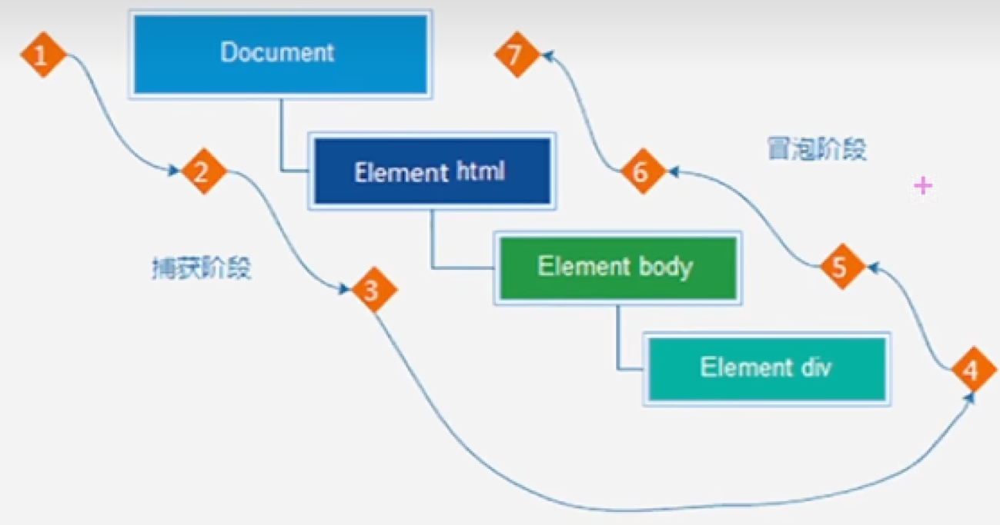

# webApi

> 作用和分类
> - 作用：就是使用JS去操作Html和浏览器
> - 分类：`DOM`（文档对象模型）和 `BOM` （浏览器对象模型）


## 一、变量
### 1.1 变量声明

1. 变量声明有三个 var、let 和 const, 我们应该用哪个？

    * 首先排除var，很老的写法，有非常多的问题，可以淘汰...

2. let 和 const ？

    * 优先选择`const`，const语义化好，很多变量我们声明了，就知道不会被改变了

3. 使用思路

    * 定义变量优先使用const，当发现变量会被更改，在改为let


## 二、DOM
### 2.1 什么是DOM?

- DOM(Document Object Model - 文档对象模型)是用来**呈现**以及与任意HTML或者XML文档**交互**的Api


### 2.2 什么是DOM树？

- 将HTML文档以树状结构直观的表现出来，我们称之为文档树或DOM树


### 2.3 什么是DOM对象？

-   浏览器根据Html标签生成的**js对象**
    -   所有的标签属性都可以在这个对象上面找到
    -   修改这个对象的属性会自动映射到标签身上
-   DOM的核心思想
    -   把网页中的内容当作**对象**来处理
-   document对象
    -   是DOM里提供的一个**对象**
    -   所以它提供的属性和方法都是**用来访问和操作网页内容的**
    -   网页所有的内容都在document里面


### 2.4 获取DOM元素

> 查找页面中的DOM元素就是利用js选择页面中的标签元素

根据CSS选择器来获取

1. 选择匹配的**第一个**元素

   * 语法：
        ```javascript
        document.querySelector('css选择器')
        ```
    * 参数
        - 包含一个或者多个有效的css选择器字符串
    * 返回值
        - css选择器匹配的**第一个元素（HTMLElement对象）**
        - 如果没有匹配到的，返回null
    * 练习：
        ```javascript
        // 页面中的第一个div
        document.querySelector('div')
        // 根据类名选择
        document.querySelector('.box')
        // 根据id选择
        document.querySelector('#box')
        // 获取ul下的第一个li
        document。querySelector('ul li:first-child')
        ```


2. 选择匹配的多个元素

   * 语法
        ```javascript
        doucument.querySelectorAll('css选择器')
        ```
    * 参数
        - 包含一个或者多个有效的css选择器字符串
    * 返回值
        - css选择器匹配的**NodeList对象集合**


querySelectorAll得到的是一个**伪数组**：

* 有长度有索引号的数组
* 但是没有prop()、push()等数组方法

要想得到里面的每一个对象，则需要遍历的方式获得。


### 2.5 操作元素内容

> 目标： 能够修改元素的文本更换内容


* DOM对象都是根据标签生成的，所以操作标签本质上就是操作DOM对象
* 操作对象使用的是点语法
* 如果要修改元素里面的内容，可以使用以下几个方法
  - 对象.innerText属性
  - 对象.innerHTML属性


1. innerText属性

   * 将文本内容添加/更新到任意标签
   * 显示纯文本，不解析标签
   ```javascript
   const box = document.querySelector('.box')
   cont text = box.innerText // 获取文字内容
   box.innerText = 'hello world' // 修改文字内容

   ```
2. innerHTML属性

   * 将文本内容添加/更新到任意标签
   * 会解析标签，多标签建议使用模板字符
   ```javascript
   const box = document.querySelector('.box')
   cont text = box.innerText // 获取文字内容
   box.innerText = '<strong>hello world</strong>' // 修改文字内容
   ```

### 2.6 操作元素属性

1. 修改元素的**常用**属性

    * 通过js设置/修改标签元素属性，比如更换src地址
    * 常见的属性比如：href、title、src等
    * 语法：
        ```javascript
        对象.属性 = 值
        ```
    * 示例：
        ```javascript
        const img = document.querySelector('.img')
        img.src = 'http://xxxx.xxx/xxxx.png'
        img.title = 'hello world'
        ```

2. 操作元素的**样式**属性

   * 通过js设置/修改标签的样式属性
        - 比如通过轮播图的小圆点更换颜色样式
        - 点击按钮可以滚动图片，这是移动图片的位置left等等

    **分类：**

    * 通过style属性操作css
        - 语法：
            ```javascript
            对象.style.样式属性 = 值
            ```
        - 示例
            ```javascript
            const box = document.querySelector('.box')
            box.style.width = '300px'
            box.style.heigth = '300px'
            // 多组单词采用小驼峰命名法
            box.style.backgroundColor = 'red'
            ```
    * 通过类名（ClassName）操作css
        - 语法
            ```javascript
            DOM对象.className = 类名 // 会覆盖其他类名
            ```
        - 示例
            ```javascript
            const box = document.querySelector('.box')
            box.className = 'nav box1' // 多个类名之间空格分隔
            ```
    * 通过classList操作类控制css
        - 语法
            ```javascript
            DOM对象.classList.add('类名') // 添加类样式
            DOM对象.classList.remove('类名') // 删除类样式
            DOM对象.classList.toggle('类名') // 切换（有就删除，没有就添加）类样式
            ```
        - 示例
            ```javascript
            const box = document.querySelector('.box')
            box.classList.add('active')
            box.classList.remove('box')
            box.classList.toggle('active')
            ```


3. 操作**表单元素**属性

   * 很多情况下，表单也需要修改属性，比如点击眼睛可以看到密码，本质是将输入框的类型改为文本类型
     - 正常的有属性有取值的 跟其它的标签属性没有任何区别
     - 语法：
          ```javascript
          获取：DOM对象.属性名
          设置：DOM对象.属性名 = 新值
          ```
      - 示例
          ```html
          <input type="password" value="hello world" />

          <script>
              let in = doucment.querySelector('input')
              console.log(in.value) // out: hello world
              in.value = '你好世界'
              console.log(in.value) // out: 你好世界
              in.type = 'text' // 修改表单类型为text
          </script>
          ```
    * 表单中添加就有属性，移除就没有属性（实际上，就是HTML5中，规定属性为Boolean类型的时候，添加上属性就表示默认值为True，省去了在标签中给属性赋值），如 disabled, checked, selected 等等
        - 语法：
          ```javascript
          获取：DOM对象.属性名
          设置：DOM对象.属性名 = 新值
          ```
      - 示例
          ```html
          <input type="checkbox" value="hello world" />

          <script>
              let cb = doucment.querySelector('input')
              cb.checked = true
          </script>
          ```


4. 自定义属性

   * 标准属性：标签自带的属性，比如class，id，title等，可以直接使用点语法去操作
   * 自定义属性
        - 在html5中推出来专门的`data-自定义属性`
        - 在标签上一律以`data-`开头
        - 在DOM对象上一律以dataset对象方式获取
    * 语法：
        ```javascript
        DOM对象.dataset.id
        ```
    * 示例
        ```html
        <div data-id="1"></div>

        <script>
            let div = doucment.querySelector('input')
            console.log(div.dataset.id)
        </script>
        ```


### 2.7 事件监听

> 目标：能过给DOM元素添加事件监听
> * 什么是事件？
>   - 事件是在编程时系统内发生的**动作**或者发生的事情
>       - 比如用户在网页上**单击**一个按钮
> * 什么是事件监听？
>   - 就是程序检测是否有事件产生，一旦有事件触发，就立即调用一个函数做出响应，也成为事件绑定或者注册事件
>       - 比如鼠标经过显示下拉菜单


1. 事件监听

   * 语法：
     ```javascript
     DOM对象.addEventListener('事件类型'， 要执行的函数)
     ```
   * 事件监听三要素
       - **事件源**：哪个dom元素被触发了事件
       - **事件类型**：用什么方式触发
       - **事件的回调函数**：要做什么事情
   * 示例：
     ```html
     <button>button</button>
     <script>
       const btn = doucment.querySelector('button')
       btn.addEventListener('click', () => {
           alert('按钮被点击了~')
       })
     </script>
     ```

   a. 事件监听版本

      * DOM L0
         - 事件源.on事件 = function
      * DOM L2
         - 事件源.addEventListener(事件，处理函数)
      * 区别：
         - on方式会被覆盖， `addEventListener`方式可以绑定多次，拥有事件多特性，推荐使用

   b. 发展史
      * DOM L0: 是DOM的发展的第一个版本
      * DOM L1: DOM级别1，于1998年10月1日成为W3C推荐标准
      * DOM L2: 使用addEventListener注册事件
      * DOM L3: DOM3级事件模块在DOM2级事件基础上重新定义了这些事件，也添加了一些新事件类型


2. 事件类型

  * 鼠标事件
    - click：当用户点击鼠标按钮时触发。
    - mouseenter：当鼠标指针进入元素时触发。
    - mouseLeave：当鼠标指针离开元素时触发。
  * 焦点事件
    - focus：当元素获得焦点时触发。例如，当用户点击或使用Tab键导航到元素时。
    - blur：当元素失去焦点时触发。例如，当用户点击页面上的其他地方或使用Tab键导航到其他元素时。
  * 键盘事件
    - keydown：当用户按下键盘上的任意键时触发。
    - keyup：当用户释放键盘上的按键时触发。
  * 文本事件
    - input：当用户在文本输入字段中输入内容或对其进行修改时触发。例如，当用户键入文本、粘贴内容或使用自动填充功能时触发该事件。
  * 页面加载事件
    - load：当页面完全加载并呈现给用户时触发。
    - DOMContentLoaded：当HTML文档被完全加载和解析时触发，而无需等待样式表、图像和子框架的加载。
  * 表单事件
    - submit：当用户提交表单时触发。
    - reset：当用户重置表单时触发。
    - change：当表单元素的值发生变化时触发。适用于输入字段、下拉列表、复选框等。
  * 滚动事件
    - scroll：当元素的滚动位置发生变化时触发。
  * 视频/音频事件
    - play：当视频或音频开始播放时触发。
    - pause：当视频或音频暂停时触发。
    - ended：当视频或音频播放结束时触发。
  * 右键菜单事件
    - contextmenu：当用户在元素上右键单击时触发上下文菜单。
  * 手势事件
    - touchstart：当用户触摸触摸屏时触发。
    - touchend：当用户停止触摸触摸屏时触发。
    - touchmove：当用户在触摸屏上移动手指时触发。


3. 事件对象

   a. 获取事件对象

   * 事件对象是什么？
      - 事件对象也是个对象，这个对象里面有事件触发相关的信息
      - 例如：鼠标点击事件中，事件对象就存储了鼠标点哪个位置等信息
   * 使用场景
      - 可以判断用户按下了哪个按键，比如按下回车提交表单
      - 可以判断鼠标点击了哪个元素，从而做出相应变化
    * 语法：
      - 在事件绑定的回调函数的第一个参数就是事件对象
      - 一般命名为event, ev, e
      ```javascript
      元素.addEventListener('click', (e) => {})
      ```

   b. 事件对象的常用属性
    * **常用属性**
      - `type`: 获取当前事件的类型
      - `clientX/clientY`: 获取光标相对于浏览器可见窗口左上角的位置
      - `offsetX/offsetY`: 获取光标相对于当前DOM元素左上角的位置
      - `key`: 用户按下的键盘按键的值（现在不提倡使用keyCode）


4. 环境对象
  > 目标： 能过分析判断出函数运行在不同环境中this所指代的对象

  **环境对象**：指的是函数内部特殊的**变量this**，它代表当前函数运行时所处的环境

  **作用**：弄清楚this的指向，能是我们的代码更简洁

  * 函数调用方式不同，this指向也不同
    - `谁调用，this指向谁`，是判断this的粗略规则
      - 直接调用函数，相当于是window.函数，所以this指向的是window

  *示例：
    ```javascript
    btn.addEventListener('click', () => {
      // btn.style.color = 'red' // 不推荐
      this.style.color = 'red'
    })
    ```

5. 回调函数

   > 目标：能够说出什么是回调函数

   如果将函数A作为参数传递给函数B，我们称函数A为回调函数

   * 示例：
      ```javascript
      function func() { console.log('func') }
      // func传递给了setInterval, func就是回调函数
      setInterval(func, 1000)
      ```


### 2.8 事件流
1. 事件流与两个阶段说明

   > `事件流`指的是事件完整执行过程中的流动路径
   

   * 说明：假设页面里有个dV,当触发事件时，会经历两个阶段，分别是捕获阶段、冒泡阶段
   * 简单来说：捕获阶段是从父到子冒泡阶段是从子到父
   * **实际工作都是使用事件冒泡为主**

2. 事件捕获（简单了解）

   * 捕获事件的概念
      - 从DOM的根元素开始去执行对于的事件（从外到里）
   * 事件捕获需要写对应代码才能看到效果
     - 代码：
        ```javascript
        DOM对象.addEventListener(事件类型, 事件处理函数, 是否使用捕获机制)
        ```
     - 说明：
       - addEventListener第三个参数传入`true`代表捕获阶段触发（很少使用）
       - 若传入false代表冒泡阶段触发，默认就是false
       - 如是使用`L0`级别的事件监听，则只有冒泡阶段，没有捕获


3. 事件冒泡

   * 事件冒泡概念：
      - 当一个元素的事件被触发时，同样的事件将会在该元素的所有先祖元素中依次被触发。这一过程被称为事件冒泡。
      - 简单理解：当一个元素触发事件后，会依次向上调用所有父级元素的**同名事件**
      - L2事件监听的第三个参数是false，默认值为false

4. 阻止冒泡

   * 问题：因为默认就有冒泡模式的存在，所以容易导致事件影响到父级元
   * 需求：若想把事件就限制在当前元素内，就需要阻止事件冒泡
   * 前提：阻止事件冒泡需要拿到事件对象
   * 语法：
      ```javascript
      事件对象.stopPropagation()
      ```
   * 注意：此方法可以阻断事件流动传播，不光在冒泡阶段，在捕获阶段也有用

5. 解绑事件

   * on事件方式
      - 直接使用null覆盖掉就可以实现事件的解绑
      - 语法：
        ```javascript
        // 事件绑定
        btn.onClick = func(){}

        // L0事件解绑
        btn.onClick = null
        ```
   * addEventListener方式
      - 必须使用，removeEventListener(事件类型，处理函数，[捕获或者冒泡阶段])
      - **匿名函数无法被解绑**
      - 示例：
        ```javascript
        function func() {}

        // 绑定事件
        btn.addEventListener('click', func)

        // L2解绑事件
        btn.removeEventListener('click', func)
        ```

6. 鼠标经过事件区别

  * 鼠标经过事件
    - mouseover 和 mouseout 会有冒泡效果
    - mouseenter 和 mouseleave 没有冒泡效果（推荐）


### 2.9 事件委托

问题：

如果同时给多个元素注册事件，我们应该怎么做？
  * 使用for循环注册事件(旧)
    ```javascript
    const lst = doucment.querySelector('ul li')
    for(const dom of lst) {
      dom.addEventListener('click', () => {})
    }
    ```

有没有一种技巧可以注册一次来完成以上内容呢？

> `事件委托`就是**利用事件流的特征**解决一些开放需求的知识技巧
> * 优点：减少注册次数，可以提高程序性能
> * 原理：事件委托其实是利用事件冒泡的特点。
>   - **给父元素注册事件**，当我们的子元素触发的时候，就会冒泡到父元素身上，从而触发父元素的事件

示例：
```html
<!-- 使用事件委托，当点击li时，字体变为红色 -->
<ul>
  <li>1</li>
  <li>2</li>
  <li>3</li>
  <li>4</li>
  <li>5</li>
  <p>6</p>
</ul>
<script>
  const ul = document.querySelector('ul')
  ul.addEventListener('click', (e) => {
    // 子元素
    const li = e.target
    if (li.tagName == 'LI'){
      li.style.color = 'red'
    }
  })
</script>
```


### 2.10 阻止默认行为

1. 阻止默认行为

   * 在某些情况下需要阻止默认行为的发生，如： 阻止链接的跳转，表单域的跳转
   * 语法：
      ```html
      <form action="http://xxx/xxx">
        <input type="submit" value="提交"/>
      </form>
      <script>
        const form = document.querySelector("form")
        form.addEventListener('click', (e) => {
          // 阻止表单的提交行为
          e.preventDefault()
        })
      </script>
      ```

2. 总结

   * 阻止冒泡
      ```javascript
      实际对象.stopPropagation()
      ```
   * 阻止事件默认行为
      ```javascript
      实际对象.preventDefault()
      ```


### 2.11 其它事件

#### 1. 页面加载事件

* 加载外部资源（如图片、外联CSS和avaScript等）加载完毕时触发的事件
* 为什么要学？
    - 有些时候需要等页面资源全部处理完了做一些事情
    - 老代码喜欢把script写在head中，这时候直接找dom元素找不到

1. `load`
  * 监听页面所有资源加载完成：
     - 给window添加load事件
        ```javascript
        window.addEventListener('load', () => {})
        ```
     - 注意：不光可以监听整个页面的资源加载完毕，也可以针对某个资源绑定load事件

2. `DOMContentLoaded`
   * 当初始的HTML文档被完全加载和解析完成之后，DOMContentLoaded事件被触发，而无需等待样式表、图像等完全加载
   * 监听页面DOM加载完毕：
      - 给document添加DOMContentLoaded事件
         ```javascript
         document.addEventListener('DOMContentLoaded', () => {})
         ```

#### 2. 页面滚动事件

* 滚动条在页面滚动的时候持续触发的事件
* 为什么要学？
  - 很多网页需要检测用户把页面滚动到某个区域后做一些处理

1. `scroll`
   * 监听整个页面滚动：
      ```javascript
      window.addEventListener('scroll', () => {})
      ```
      - 给window或者给document添加`scroll`事件都可以
   * 监听某个元素的内部滚动直接给元素添加`scroll`事件即可
   * 获取滚动位置
      - `scrollLeft`属性：被卷去的x轴距离（可读写）
      - `scrollTop`属性：被卷去的y轴距离（可读写）
        ```javascript
        const div = document.querySelector(".box")
        div.addEventListener('scroll', () => {
          console.log(div.scrollTop)
        })

        // 获取页面滚动
        window.addEventListener('scroll', () => {
          // 获取html
          const html = document.documentElement
          console.log(html.scrollTop)
        })
        ```

#### 3. 页面尺寸事件

* 会在窗口尺寸改变的时候触发的事件
    - `resize`
      ```javascript
      window.addEventListener('resize', () => {})
      ```

* 获取元素宽高
  - 获取元素的可见部分宽高（不包含边框，margin， 滚动条）
  - `clientWidth` 和 `clientHeight`

* 元素尺寸位置
  - 获取宽高：
    - 获取元素的自身宽高、包含元素自身设置的宽高、padding、border
    - `offsetWidth` 和 `offsetHeight`

* 获取元素位置
  - **获取元素距离自己最近一级带有定位的祖先元素**的左、上距离
  - `offsetLef` 和 `offsetTop` (只读)


### 2.12 查找DOM节点

1. DOM节点

   * DOM树里面的每一个内容都成为节点
   * 节点类型
     - 元素节点
       - 所有的标签，比如：body div
       - html是根节点
     - 属性节点
       - 所有的属性，如：href src
     - 文件节点
       - 所有的文本内容
     - 其它

2. 查找节点

    * 节点的关系： 针对的找亲戚返回的都是对象
      - 父节点
      - 兄弟节点
      - 子节点
    * `父节点查找`
      - `parentNode` 属性
      - 返回最近一级父节点，找不懂返回null
        ```javascript
        子元素.parentNode
        ```
    * `子节点查找`
      - `childNodes` 属性
        - 获得所有子节点，包括文本节点（空格，换行）、注释等等
      - **`children` 属性 （重点）**
        - **仅获得所有元素节点**
        - 返回的还是一个伪数组
          ```javascript
          子元素.children
          ```
    * `兄弟节点查找`
      - `nextElementSibling` 属性
        - 查找下一个兄弟节点
          ```javascript
          DOM元素.nextElementSibling
          ```
      - `previousElementSibling` 属性
        - 查找上一个兄弟节点
          ```javascript
          DOM元素.nextElementSibling
          ```

3. 增加节点

   * 创建节点
      - 即创造出一个新的节点添加到网页内，一般是先创建然后插入
      - 创建节点的方法
        ```javascript
        document.createElement('标签名')
        ```
   * 追加节点
      - 想要在界面中看到，还得插到某个父元素中
      - 插到父元素的最后一个子元素
        ```javascript
        父元素.appendChild(被插入的元素)
        ```
      - 插到父元素中的某一个子元素
        ```javascript
        父元素.insertBefore(要插入的元素，在哪个元素前面)
        // 示例
        ul.insertBefore(li, ul.children[0])
        ```

4. 删除节点
