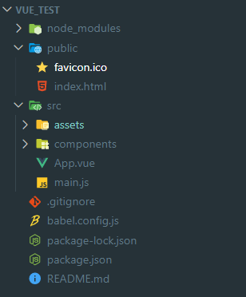

# vue教程

[TOC]

## 1. Vue核心

### 1.1 Vue简介

#### 1.1.1 Vue是什么

> 一套用于**构建用户界**面的**渐进式**JavaScript框架 

**渐进式：**Vue可以自底向上逐层的应用

* 简单应用：只需一个轻量小巧的核心库
* 复杂应用：可以引入各式各样的Vue插件

#### 1.1.2 谁开发的


#### 1.1.3 Vue的特点

> 采用**组件化**模式，提高代码复用率、且让代码更好维护。

 


> **声明式**编码,让编码人员无需直接操作DOM,提高开发效率。


> 使用**虚拟DOM**+优秀的**Diff算法**，尽量复用DOM节点

 


### 1.2 Vue快速体验

#### 1.2.1 准备工作

1. 下载Vue.js的chrome插件

   ​	下载地址：[Vue Devtools](https://chrome.zzzmh.cn/info?token=nhdogjmejiglipccpnnnanhbledajbpd)

2. 修改全局配置

   ```html
   <script type="text/javascript">
       Vue.config.productionTip=false //以阻止 vue 在启动时生成生产提示
   </script>
   ```


#### 1.2.2 案例

```html
<!DOCTYPE html>
<html lang="en">
<head>
    <meta charset="UTF-8">
    <meta http-equiv="X-UA-Compatible" content="IE=edge">
    <meta name="viewport" content="width=device-width, initial-scale=1.0">
    <title>demo-o1</title>
    <script type="text/javascript" src="../js/vue.js" ></script>
</head>
<body>
   
    <div id="box">
        hello, {{name}}！
    </div>
    
    <script type="text/javascript">
       Vue.config.productionTip=false //以阻止 vue 在启动时生成生产提示
       const x = new Vue({
           el:"#box", //用于指定当前Vue实例为哪个容器服务，通常使用css选择器
           data:{ //data中的数据用于存储数据，数据供el所指定的容器使用
               name:"张三"  
           }
       })
    </script>
</body>
</html>
```


#### 1.2.3 总结

1. 想让Vue工作，就**必须创建一个Vue实例**，且要传入一个配置对象；
2. box容器里的代码依然符合html规范，只不过混入了一些特殊的Vue语法；
3. box容器里的代码被称为【Vue模板】；
4. **Vue实例和容器是一 一对应的；**
5. 真实开发中只有一个Vue实例，并且会配合着组件一起使用；
6. {{xxx}}中的**xxx要写js表达式**，且xxx可以自动读取到data中的所有属性；
7. 一且data中的数据发生改变，那么页面中用到该数据的地方也会自动更新；
   * 注意区分：js表达式和js代码（语句）
     * 表达式：一个表达式会产生一个值，可以放在任何一个需要值的地方：
       *  a
       * a+b
       *  demo(1)
       * x===y?'a':'b'
     * js代码(语句)
       *  if(){}
       *  for(){}


### 1.3 Vue模板

**Vue模板语法有2大类：**

1. **插值语法：**
   * 功能：**用于解析标签体内容。**
   * 写法：[{xxx}],xxx是js表达式，且可以直接读取到data中的所有属性。
2. **指令语法：**
   * 功能：**用于解析标**签（包括：标签属性、标签体内容、绑定事件....)。
   * 举例：v-bind:href="xxx"或简写为：href="xxx",xxx同样要写js表达式，且可以直接读取到data中的所有属性。
   * 备注：Vue中有很多的指令，且形式都是：V-????,此处我们只是拿v-bind举个例子。

```html
<!DOCTYPE html>
<html lang="en">
<head>
    <meta charset="UTF-8">
    <meta http-equiv="X-UA-Compatible" content="IE=edge">
    <meta name="viewport" content="width=device-width, initial-scale=1.0">
    <title>Vue模板</title>
    <script src="../js/vue.js" type="text/javascript"></script>
</head>
<body>
    <div id="box">
        <h1>插值语法</h1>
        <p>你好，{{name}}</p>
        <hr>
        <h2>指令语法</h2>
        <p>
            <a :href="url">百度搜索</a>
        </p>
    </div>
</body>
<script type="text/javascript">
    const x = new Vue({
        el:"#box",
        data:{
            name:"Vue",
            url:"https://www.baidu.com"
        }
    })
</script>
</html>
```


### 1.4 数据绑定

Vue中有2种数据绑定的方式：

1. 单向绑定（v-bind):数据只能从data流向页面。

2. 双向绑定（v-model):数据不仅能从data流向页面，还可以从页面流向data。

备注：

1. 双向绑定一般都应用在**表单类**元素上（如：input、select等）

2. V-model:value可以简写为v-model,因为v-mode1默认收集的就是value值。

```html
<!DOCTYPE html>
<html lang="en">
<head>
    <meta charset="UTF-8">
    <meta http-equiv="X-UA-Compatible" content="IE=edge">
    <meta name="viewport" content="width=device-width, initial-scale=1.0">
    <title>数据绑定</title>
    <script src="../js/vue.js" type="text/javascript"></script>
</head>
<body>
    <div id="box">
        单向数据绑定：<input type="text" v-model:value="info1">
        双向数据绑定：<input type="text" v-model:value="info2">
    </div>
    <script type="text/javascript">
        Vue.config.productionTip=false //以阻止 vue 在启动时生成生产提示
        const x = new Vue({
            el:"#box",
            data:{
                info1:"单向数据绑定",
                info2:"双向数据绑定"
            }
        })
    </script>
</body>
</html>
```


### 1.5 data和el的两种写法

data与el的2种写法

1. e1有2种写法
   1. new Vue时候配置el属性。
   2. 先创建Vue实例，随后再通过vm.$mount('#root')指定e1的值。
2. data有2种写法
   1. 对象式
   2. 函数式

**如何选择：目前哪种写法都可以，以后学习到组件时，data必须使用函数式，否则会报错。**

3. 一个重要的原则：
   **Hivue管理的函数，一定不要写箭头函数，一旦写了箭头函数，this就不再是Vue实例了。**

```html
<!DOCTYPE html>
<html lang="en">

<head>
    <meta charset="UTF-8">
    <meta name="viewport" content="width=device-width, initial-scale=1.0">
    <meta http-equiv="X-UA-Compatible" content="ie=edge">
    <title>helloworld</title>
    <script src="../js/vue.min.js"></script>
</head>

<body>
    <div id="app">
        {{name}}
    </div>
    <script>
        Vue.config.productionTip=false //以阻止 vue 在启动时生成生产提示
        const v = new Vue({
            // el: '#app',  //el的第一种写法
            // data: {  //data的第一张写法：对象式
            //    name:"hello world!" 
            // }
            data(){  //data的第二种写法：函数式 （data(){} === data:function(){})
                return{
                    name:"hello vue"
                }
            }
        })
        v.$mount("#app")  //el的第二种写法
    </script>
</body>

</html>
```


### 1.6 MVVM模型


MVVM模型

1. M:模型（Model): data中的数据
2. V:视图（View): 模板代码
3. VM:视图模型（ViewModel): **Vue实例**

观察发现：

1. data中所有的属性，最后都出现在了vm身上。
2. **vm身上所有的属性及Vue原型上所有属性，在Vue模板中都可以直接使用。**


### 1.7 数据代理

#### 1.7.1 原生Object.defindProperty方法

```html
<!DOCTYPE html>
<html lang="en">
<head>
    <meta charset="UTF-8">
    <meta http-equiv="X-UA-Compatible" content="IE=edge">
    <meta name="viewport" content="width=device-width, initial-scale=1.0">
    <title>Object.defindProperty</title>
</head>
<body>
    <script type="text/javascript">
        let Person = {
            name:"张三",
            sex:"男"
        }
        // 直接使用defineProperty，传入属性
        // Object.defineProperty(Person, "age", {
        //     value:18, //传入的值
        //     enumerable:true, //控制属性是否可以枚举（遍历），默认值false
        //     writable:true, //控制属性的值是否可以被修改，默认值false
        //     configurable:true //控制属性是否可以别删除，默认值false
        // })
        // console.log(Person)
        // console.log(Object.keys(Person))

        // 使用defineProperty，传入变量 
        let age = 18
        Object.defineProperty(Person, "age", {
            get(){ //当age值被读取时，调用该方法，读取的值为返回的值
                console.log("age属性被读取")
                return age;
            },
            set(value){ //当age的值被修改时，修改的值会当作参数传入
                console.log("age属性被修改")
                age = value
            }
        }) 
    </script>
</body>
</html>
```


#### 1.7.2 数据代理

> 数据代理：通过一个对象代理对另一个对象中属性的操作（读/写

```html
<!DOCTYPE html>
<html lang="en">
<head>
    <meta charset="UTF-8">
    <meta http-equiv="X-UA-Compatible" content="IE=edge">
    <meta name="viewport" content="width=device-width, initial-scale=1.0">
    <title>数据代理</title>
</head>
<body>
    <script type="text/javascript">
        let obj1 = {x:100}
        let obj2 = {y:200}
        Object.defineProperty(obj2, 'x', {
            get(){
                return obj1.x
            },
            set(value){
                obj1.x = value
            }
        })
    </script>
</body>
</html>
```

 


#### 1.7.3 Vue中的数据代理

1. Vue中的数据代理：

   通过vm对象来代理data对象中属性的操作（读/写）

2. Vue中数据代理的好处：

   更加方便的操作data中的数据

3. 基本原理：

   通过object.defineProperty()把data对象中所有属性添加到vm上。为每一个添加到vm上的属性，都指定一个getter/setter。在getter/setter内部去操作（读/写）data中对应的属性。

   ```html
   <!DOCTYPE html>
   <html lang="en">
   
   <head>
       <meta charset="UTF-8">
       <meta name="viewport" content="width=device-width, initial-scale=1.0">
       <meta http-equiv="X-UA-Compatible" content="ie=edge">
       <title>vue数据代理</title>
       <script src="../js/vue.min.js"></script>
   </head>
   
   <body>
       <div id="app">
           {{name}}{{_data.name}}<!--vue中真实数据在_data中-->
       </div>
       <script>
           Vue.config.productionTip=false //以阻止 vue 在启动时生成生产提示
           const vm = new Vue({
               el: '#app',
               data: {
                   name:张三   
               }
           })
       </script>
   </body>
   
   </html>
   ```

   


### 1.8 事件处理

#### 1.8.1 事件的基本使用

1. 使用v-on:xx或@x绑定事件,其中xxx是事件名

2. 事件的回调需要配置在 methods对象中,最终会在vm上

3. methods中配置的函数,不要用箭头函数!否则this就不是vm了
4. methods中置的函数,都是被vue所管理的函数,this的指向是vm或组件实例对像
5. **@c1ick="demo”和cick="demo($ event)"效果一致,但后者可以传参**

```html
<!DOCTYPE html>
<html lang="en">

<head>
    <meta charset="UTF-8">
    <meta name="viewport" content="width=device-width, initial-scale=1.0">
    <meta http-equiv="X-UA-Compatible" content="ie=edge">
    <title>事件处理</title>
    <script src="../js/vue.min.js"></script>
</head>

<body>
    <div id="app">
        <h1>{{name}}</h1>
        <button type="button" v-on:click="showInfo1">点我提示信息1</button>
        <!-- v-on:click 可以简写为 @click -->
        <button type="button" @click="showInfo2($event, '张三')">点我提示信息2</button> 
    </div>
    <script>
        Vue.config.productionTip=false //以阻止 vue 在启动时生成生产提示
        const vm = new Vue({
            el: '#app',
            data: {
               name:"hello world" 
            },
            methods: {
                showInfo1(event){ //默认点击时间会传入button的event
                    console.log(event)
                    console.log(event.target)
                    console.log(event.target.innerText)
                    alert("hello vue!")
                },
                showInfo2(event, name){  //调用方法时可用$event占位传入
                    console.log(this == vm)  //this为vm
                    console.log(event)
                    console.log(event.target)
                    console.log(event.target.innerText) 
                    alert("hello，"+name)
                }
            },
        })
    </script>
</body>

</html>
```


#### 1.8.2 事件修饰符

Vue中的事件修饰符：

1. prevent:阻止默认事件（常用）;
2. stop:阻止事件冒泡（常用）;
3. once:事件只触发一次（常用）;
4. capture:使用事件的捕获模式；
5. self:只有event.target是当前操作的元素是才触发事件；
6. passive:事件的默认行为立即执行，无需等待事件回调执行完毕；

```html
<!DOCTYPE html>
<html lang="en">

<head>
    <meta charset="UTF-8">
    <meta name="viewport" content="width=device-width, initial-scale=1.0">
    <meta http-equiv="X-UA-Compatible" content="ie=edge">
    <title>事件修饰符</title>
    <script src="../js/vue.min.js"></script>
    <script src="http://apps.bdimg.com/libs/jquery/1.9.1/jquery.min.js"></script>
    <style>
        *{margin: 10px;}
        .box1{
            width: 100px;
            height: 100px;
            background-color: aquamarine;
        }
        .box2{
            width: 50px;
            height: 50px;
            margin: 20;
            background-color:cyan;
        }
        ul{
            height: 300px;
            width:120px;
            background-color: darkorange;
            padding: 10px;
            overflow: auto; 
        }
        li{
            height: 150px;
            width: 100px;
            margin-top: 10px;
            background-color: darksalmon;
        }
    </style>
</head>

<body>
    <!-- Vue中的事件修饰符：

    1. prevent:阻止默认事件（常用）;
    2. stop:阻止事件冒泡（常用）;
    3. once:事件只触发一次（常用）;
    4. capture:使用事件的捕获模式；
    5. self:只有event.target是当前操作的元素是才触发事件；
    6. passive:事件的默认行为立即执行，无需等待事件回调执行完毕； -->
    <div id="app">
        <!-- prevent:阻止默认事件（常用）, 阻止a标签的跳转 -->
        <a href="https://www.baidu.com" @click.prevent="showInfo">点我显示信息</a>

        <!-- stop:阻止事件冒泡（常用） -->
        <div class="box1" @click="showInfo2($event,'box')">
            <button type="button" @click.stop="showInfo2($event, 'button')">button</button>
        </div>
        <!-- 修饰符可以一起使用 -->
        <div class="box1" @click="showInfo2($event,'box')">
            <a href="https://www.baidu.com" @click.stop.prevent="showInfo2($event, 'a')">a</a>
        </div>

        <!-- once:事件只触发一次（常用） -->
        <button type="button" id="onceButton" @click.once="onceButton">once button</button>

        <!-- capture:使用事件的捕获模式,(捕获阶段就开始处理) -->
        <div class="box1" @click.capture="showInfo2($event,'box1')">
            box1
            <div class="box2" @click="showInfo2($event,'box2')">
                box2
            </div>
        </div>

        <!-- self:只有event.target是当前操作的元素是才触发事件 -->
        <div class="box1" @click.self="showInfo2($event,'box1')">
            box1
            <div class="box2" @click="showInfo2($event,'box2')">
                box2
            </div>
        </div>

        <!-- passive:事件的默认行为立即执行，无需等待事件回调执行完毕； -->
        <!-- @scroll:滚动条滚动事件(事件触发时默认行为立即执行) -->
        <!-- @wheel:滚轮滚动事件（事件处理玩后才执行默认事件） -->
        <ul @wheel.passive="demo">
            <li>1</li>
            <li>2</li>
            <li>3</li>
            <li>4</li>
            <li>5</li>
        </ul>

    </div>
    <script>
        Vue.config.productionTip=false //以阻止 vue 在启动时生成生产提示
        const vm = new Vue({
            el: '#app',
            data: {
                
            },
            methods: {
                showInfo(event){
                    alert("hello vue")
                    console.log(event.target)
                },
                showInfo2(event, info){
                    console.log(info)
                },
                onceButton(event){
                    console.log(event.currentTarget.id)
                    $("#"+event.currentTarget.id).attr("disabled",true)
                },
                demo(){
                    for (let index = 0; index < 50000; index++) {
                        console.log("@")
                    }
                    alert("事件处理完成")
                }
            },
        })
    </script>
</body>

</html>
```


#### 1.8.3 键盘事件

1. Vue中常用的按键别名：（真实名字首字母大写）
   * 回车=>**enter**
   * 删除=>**delete**(捕获“删除”和“退格”键）
   * 退出=>**esc**
   * 空格=>**space**
   * 换行=>**tab **（必须配合@keydown使用）
   * 上=>**up**
   * 下=>**down**
   * 左=>**left**
   * 右=>**right**

2. Vue未提供别名的按键，可以使用按键原始的key值去绑定，但注意要转为kebab-case(短横线命名）
3. 系统修饰键（用法特殊）:ctrl、alt、shift、meta
   1. 配合keyup使用：按下修饰键的同时，再按下其他键，随后释放其他键，事件才被触发。
   2. 配合keydown使用：正常触发事件。
4. 也可以使用keyCode去指定具体的按键（不推荐）
5. Vue.config.keyCodes.自定义键名=键码，可以去定制按键别名

```html
<!DOCTYPE html>
<html lang="en">

<head>
    <meta charset="UTF-8">
    <meta name="viewport" content="width=device-width, initial-scale=1.0">
    <meta http-equiv="X-UA-Compatible" content="ie=edge">
    <title>helloworld</title>
    <script src="../js/vue.min.js"></script>
    <style>
        *{
            margin: 10px;
        }
    </style>
</head>

<body>
    <!-- 1. Vue中常用的按键别名：
        * 回车=>**enter**
        * 删除=>**delete**(捕获“删除”和“退格”键）
        * 退出=>**esc**
        * 空格=>**space**
        * 换行=>**tab**
        * 上=>**up**
        * 下=>**down**
        * 左=>**left**
        * 右=>**right**

    2. Vue未提供别名的按键，可以使用按键原始的key值去绑定，但注意要转为kebab-case(短横线命名）
    3. 系统修饰键（用法特殊）:ctrl、alt、shift、meta
    1. 配合keyup使用：按下修饰键的同时，再按下其他键，随后释放其他键，事件才被触发。
    2. 配合keydown使用：正常触发事件。
    4. 也可以使用keyCode去指定具体的按键（不推荐）
    5. Vue.config.keyCodes.自定义键名=键码，可以去定制按键别名 -->
    <div id="app">
        <input type="text" placeholder="输入文字,回车键触发事件" @keyup.enter="showInfo"><br>
        <input type="text" placeholder="输入文字,delete键触发事件" @keyup.delete="showInfo"><br>
        <input type="text" placeholder="输入文字,esc键触发事件" @keyup.esc="showInfo"><br>
        <input type="text" placeholder="输入文字,空格键触发事件" @keyup.space="showInfo"><br>
        <input type="text" placeholder="输入文字,换行键触发事件" @keydown.tab="showInfo"><br>
        <input type="text" placeholder="输入文字,上键触发事件" @keyup.up="showInfo"><br>
        <input type="text" placeholder="输入文字,下键触发事件" @keyup.down="showInfo"><br>
        <input type="text" placeholder="输入文字,左键触发事件" @keyup.left="showInfo"><br>
        <input type="text" placeholder="输入文字,右键触发事件" @keyup.right="showInfo"><br>
        <!-- 多个单词的按键小写中间用-连接，单个字母的首字母大写 -->
        <input type="text" placeholder="输入文字,其它按键（大小写）触发事件" @keyup.caps-lock="showInfo"><br>
        <!-- 系统修饰键（用法特殊）:ctrl、alt、shift、meta -->
        <input type="text" placeholder="输入文字,ctrl+其他按键触发事件触发事件" @keyup.ctrl="showInfo"><br>
        <input type="text" placeholder="输入文字,ctrl+y键触发事件触发事件" @keyup.ctrl.y="showInfo"><br>
        <!-- 自定义按键别名 -->
        <input type="text" placeholder="输入文字,回车键触发事件" @keyup.huiche="showInfo"><br>
    </div>
    <script>
        Vue.config.productionTip=false //以阻止 vue 在启动时生成生产提示
        Vue.config.keyCodes.huiche=13 //自定义按键别名
        const vm = new Vue({
            el: '#app',
            data: {
                
            },
            methods: {
                showInfo(event){
                    console.log(event.key,event.keyCode)
                    console.log(event.target.value)
                    alert(event.target.value)
                }
            },
        })
    </script>
</body>

</html>
```


### 1.9 计算属性

> 案例要求：两个输入框分别输入姓和名，下方将姓名文字组合在一起


#### 1.9.1 插值语法实现

```html
<!DOCTYPE html>
<html lang="en">

<head>
    <meta charset="UTF-8">
    <meta name="viewport" content="width=device-width, initial-scale=1.0">
    <meta http-equiv="X-UA-Compatible" content="ie=edge">
    <title>helloworld</title>
    <script src="../js/vue.min.js"></script>
</head>

<body>
    <div id="app">
        <input type="text" v-model="firstName"> <br>
        <input type="text" v-model="lastName"> <br>
        姓名：{{firstName}}-{{lastName}}
    </div>
    <script>
        Vue.config.productionTip=false //以阻止 vue 在启动时生成生产提示
        const vm = new Vue({
            el: '#app',
            data: {
                firstName: "张",
                lastName: "三"
            }
        })
    </script>
</body>

</html>
```


#### 1.9.2 methods方法实现

```html
<!DOCTYPE html>
<html lang="en">

<head>
    <meta charset="UTF-8">
    <meta name="viewport" content="width=device-width, initial-scale=1.0">
    <meta http-equiv="X-UA-Compatible" content="ie=edge">
    <title>helloworld</title>
    <script src="../js/vue.min.js"></script>
</head>

<body>
    <div id="app">
        <input type="text" v-model="firstName"> <br>
        <input type="text" v-model="lastName"> <br>
        姓名：{{showName()}}
    </div>
    <script>
        Vue.config.productionTip=false //以阻止 vue 在启动时生成生产提示
        const vm = new Vue({
            el: '#app',
            data: {
                firstName: "张",
                lastName: "三"
            },
            methods: {
                showName(){
                    return this.firstName + "-" +  this.lastName
                }
            },
        })
    </script>
</body>

</html>
```


#### 1.9.3 计算属性

计算属性：

1. 定义：要用的属性不存在，要通过已有属性计算得来。
2. 原理：底层借助了objcet.defineproperty方法提供的getter和setter。
3. get雨敬什么时候执行？
   * 初次读取时会执行一次。
   * 当依赖的数据发生改变时会被再次调用。
4. 优势：与methods实现相比，内部有缓存机制（复用）,效率更高，调试方便。
5. 备注：
   * 计算属性最终会出现在vm上，直接读取使用即可。
   * 如果计算属性要被修改，那必须写set两数去响应修改，且set中要引起计算时依赖的数据发变化

```html
<!DOCTYPE html>
<html lang="en">

<head>
    <meta charset="UTF-8">
    <meta name="viewport" content="width=device-width, initial-scale=1.0">
    <meta http-equiv="X-UA-Compatible" content="ie=edge">
    <title>helloworld</title>
    <script src="../js/vue.min.js"></script>
</head>

<body>
    <div id="app">
        <input type="text" v-model="firstName"> <br>
        <input type="text" v-model="lastName"> <br>
        姓名：{{fullName}}
    </div>
    <script>
        Vue.config.devtools = true
        Vue.config.productionTip=false //以阻止 vue 在启动时生成生产提示
        const vm = new Vue({
            el: '#app',
            data: {
                firstName: "张",
                lastName: "三"
            },
            computed:{
                fullName:{
                    //get有什么作用？当有人读取fullName时，get就会被调用，且返回值就作为fullName的值
                    //get什么时候调用？1.初次读取fullName时。2.所依赖的数据发生变化时。
                    get(){
                        console.log('get 方法被调用了')
                        return this.firstName + "-" + this.lastName
                    },
                    //候调用？当fullName被修改时。
                    set(value){
                        let arr = value.split("-")
                        this.firstName = arr[0]
                        this.lastName = arr[1]
                    }
                }
            }
        })
    </script>
</body>

</html>
```


**简写形式：**

```html
<!DOCTYPE html>
<html lang="en">

<head>
    <meta charset="UTF-8">
    <meta name="viewport" content="width=device-width, initial-scale=1.0">
    <meta http-equiv="X-UA-Compatible" content="ie=edge">
    <title>helloworld</title>
    <script src="../js/vue.min.js"></script>
</head>

<body>
    <div id="app">
        <input type="text" v-model="firstName"> <br>
        <input type="text" v-model="lastName"> <br>
        姓名：{{fullName}}
    </div>
    <script>
        Vue.config.devtools = true
        Vue.config.productionTip=false //以阻止 vue 在启动时生成生产提示
        const vm = new Vue({
            el: '#app',
            data: {
                firstName: "张",
                lastName: "三"
            },
            computed:{
                fullName(){ //不考虑修改计算属性的情况下，可简写为函数形式，相当于直接调用了get方法
                    return this.firstName + "-" + this.lastName
                }
            }
        })
    </script>
</body>

</html>
```


### 1.10 监视属性

> 案例：实现页面显示的天气状态的改变

#### 1.10.1 使用插值语法实现

```html
<!DOCTYPE html>
<html lang="en">

<head>
    <meta charset="UTF-8">
    <meta name="viewport" content="width=device-width, initial-scale=1.0">
    <meta http-equiv="X-UA-Compatible" content="ie=edge">
    <title>helloworld</title>
    <script src="../js/vue.min.js"></script>
</head>

<body>
    <div id="app">
        <h1>今天的天气{{showWeacher}}</h1>
        <button type="button" @click="switchWeather">点击切换</button>
    </div>
    <script>
        Vue.config.devtools = true //使用VueTools工具进行调试
        Vue.config.productionTip=false //以阻止 vue 在启动时生成生产提示
        const vm = new Vue({
            el: '#app',
            data: {
               isHot:true 
            },
            methods: {
                switchWeather(){
                    this.isHot = !this.isHot
                }
            },
            computed:{
                showWeacher(){
                    return this.isHot ? "炎热":"凉爽"
                }
            }
        })
    </script>
</body>

</html>
```


#### 1.10.2 监视属性

监视属性watch:

1. 当被监视的属性变化时，回调函数自动调用，进行相关操作
2. 监视的属性必须存在，才能进行监视！!
3. 监视的两种写法：
   * new Vue时传入watch配置
   * 通过vm.$watch监视

```html
<!DOCTYPE html>
<html lang="en">

<head>
    <meta charset="UTF-8">
    <meta name="viewport" content="width=device-width, initial-scale=1.0">
    <meta http-equiv="X-UA-Compatible" content="ie=edge">
    <title>helloworld</title>
    <script src="../js/vue.min.js"></script>
</head>

<body>
    <div id="app">
        <h1>今天的天气{{showWeacher}}</h1>
        <button type="button" @click="switchWeather">点击切换</button>
    </div>
    <script>
        Vue.config.devtools = true //使用VueTools工具进行调试
        Vue.config.productionTip=false //以阻止 vue 在启动时生成生产提示
        const vm = new Vue({
            el: '#app',
            data: {
               isHot:true 
            },
            methods: {
                switchWeather(){
                    this.isHot = !this.isHot
                }
            },
            computed:{
                showWeacher(){
                    return this.isHot ? "炎热":"凉爽"
                }
            },
            watch:{
                isHot:{
                    immediate:true, //初始化时让handler调用一下
                    handler(newValue, oldVale){ //handler什么时候调用？当isHot发生改变时。
                        console.log("new value: "+ newValue + ", old value: " + oldVale)
                    }
                }
            }
        })

        // 第二种写法
        // vm.$watch("isHot",{
        //     immediate:true, //初始化时让handler调用一下
        //     handler(newValue, oldVale){ //handler什么时候调用？当isHot发生改变时。
        //         console.log("new value: "+ newValue + ", old value: " + oldVale)
        //     }
        // })
    </script>
</body>

</html>
```


#### 1.10.3 深度监视

深度监视：

1. Vue中的watch默认不监测对象内部值的改变（一层）。
2. 配置**deep:true**可以监测对象内部值改变（多层）。

备注：

1. Vue自身可以监测对象内部值的改变，但Vue提供的watch默认不可以
2. 使用watch时根据数据的具体结构，决定是否采用深度监视。

```html
<!DOCTYPE html>
<html lang="en">

<head>
    <meta charset="UTF-8">
    <meta name="viewport" content="width=device-width, initial-scale=1.0">
    <meta http-equiv="X-UA-Compatible" content="ie=edge">
    <title>helloworld</title>
    <script src="../js/vue.min.js"></script>
</head>

<body>
    <div id="app">
        <h1>今天的天气{{showWeacher}}</h1>
        <button type="button" @click="switchWeather">点击切换</button>
        <hr>
        <h2>{{number.a}}</h2>
        <button type="button" @click="number.a++">点我+1</button>
    </div>
    <script>
        Vue.config.devtools = true //使用VueTools工具进行调试
        Vue.config.productionTip=false //以阻止 vue 在启动时生成生产提示
        const vm = new Vue({
            el: '#app',
            data: {
               isHot:true,
               number:{
                   a: 1,
                   b: 1
               }
            },
            methods: {
                switchWeather(){
                    this.isHot = !this.isHot
                }
            },
            computed:{
                showWeacher(){
                    return this.isHot ? "炎热":"凉爽"
                }
            },
            watch:{
                isHot:{
                    immediate:true, //初始化时让handler调用一下
                    handler(newValue, oldVale){ //handler什么时候调用？当isHot发生改变时。
                        console.log("new value: "+ newValue + ", old value: " + oldVale)
                    }
                },
                "number.a":{ //监控多级属性种的某一个属性发生变化
                    immediate:true, //初始化时让handler调用一下
                    handler(newValue, oldVale){ //handler什么时候调用？当isHot发生改变时。
                        console.log("new value: "+ newValue + ", old value: " + oldVale)
                    }
                },
                number:{ //监控多级属性种的所有值的变化
                    deep:true,
                    immediate:true, //初始化时让handler调用一下
                    handler(newValue, oldVale){ //handler什么时候调用？当isHot发生改变时。
                        console.log("new value: "+ JSON.stringify(newValue) + ", old value: " + JSON.stringify(oldVale))
                    }
                }
            }
        })

    </script>
</body>

</html>
```


#### 1.10.4 简写

```html
<!DOCTYPE html>
<html lang="en">

<head>
    <meta charset="UTF-8">
    <meta name="viewport" content="width=device-width, initial-scale=1.0">
    <meta http-equiv="X-UA-Compatible" content="ie=edge">
    <title>helloworld</title>
    <script src="../js/vue.min.js"></script>
</head>

<body>
    <div id="app">
        <h1>今天的天气{{showWeacher}}</h1>
        <button type="button" @click="switchWeather">点击切换</button>
    </div>
    <script>
        Vue.config.devtools = true //使用VueTools工具进行调试
        Vue.config.productionTip=false //以阻止 vue 在启动时生成生产提示
        const vm = new Vue({
            el: '#app',
            data: {
               isHot:true 
            },
            methods: {
                switchWeather(){
                    this.isHot = !this.isHot
                }
            },
            computed:{
                showWeacher(){
                    return this.isHot ? "炎热":"凉爽"
                }
            },
            watch:{
                //完整写法
                // isHot:{
                //     immediate:true, //初始化时让handler调用一下
                //     handler(newValue, oldVale){ //handler什么时候调用？当isHot发生改变时。
                //         console.log("new value: "+ newValue + ", old value: " + oldVale)
                //     }
                // }
                //简写，只需要监控，不需要其他属性
                // isHot(newValue, oldVale){
                //     console.log("new value: "+ newValue + ", old value: " + oldVale)
                // }
            }
        })

        // 第二种写法
        // vm.$watch("isHot",{
        //     immediate:true, //初始化时让handler调用一下
        //     handler(newValue, oldVale){ //handler什么时候调用？当isHot发生改变时。
        //         console.log("new value: "+ newValue + ", old value: " + oldVale)
        //     }
        // })
        //简写形式
        vm.$watch("isHot",function(newValue, oldVale){
            console.log("new value: "+ newValue + ", old value: " + oldVale)
        })
    </script>
</body>

</html>
```


#### 1.10.5 watch实现姓名案例

computed和watch之间的区别：

1. computed能完成的功能，watch都可以完成。
2. watch能完成的功能，computed不一定能完成，例如：watch可以进行异步操作。

两个重要的小原则：

1. 所被Vue管理的函数，最好写成普通函数，这样this的指向才是vm或组件实例对象。
2. **所有不被Vue所管理的函数（定时器的回调函数、ajax的回调函数等、Promise的回调函数）,最好写成箭头函刻，这样this的指向才是vm或组件实例对象。**

```html
<!DOCTYPE html>
<html lang="en">

<head>
    <meta charset="UTF-8">
    <meta name="viewport" content="width=device-width, initial-scale=1.0">
    <meta http-equiv="X-UA-Compatible" content="ie=edge">
    <title>helloworld</title>
    <script src="../js/vue.min.js"></script>
</head>

<body>
    <div id="app">
        <input type="text" v-model="firstName"> <br>
        <input type="text" v-model="lastName"> <br>
        姓名：{{fullName}}
    </div>
    <script>
        Vue.config.devtools = true
        Vue.config.productionTip=false //以阻止 vue 在启动时生成生产提示
        const vm = new Vue({
            el: '#app',
            data: {
                firstName: "张",
                lastName: "三",
                fullName: "张 - 三"
            },
            // computed:{
            //     fullName(){ //不考虑修改计算属性的情况下，可简写为函数形式，相当于直接调用了get方法
            //         return this.firstName + "-" + this.lastName
            //     }
            // }
            watch:{
                firstName(value){ //需要使用异步的只能使用watch而不能使用computed
                    console.log("firstName...")
                    setTimeout(()=>{
                        this.fullName = value + this.lastName
                    }, 1000) //一秒响应
                    
                },
                lastName(value){
                    console.log("lastName...")
                    setTimeout(()=>{
                        this.fullName = this.firstName + value
                    }, 1000) //一秒响应
                    
                },
            }
        })
    </script>
</body>

</html>
```


### 1.11 样式绑定

绑定样式：

1. class样式

   写法：class="xxx"xxx可以是字符串、对象、数组。

   * 字符串写法适用于：类名不确定，要动态获取。
   * 对象写法适用于：要绑定多个样式，个数不确定，名字也不确定。
   * 数组写法适用于：要绑定多个样式，个数确定，名字也确定，但不确定用不用。

2. style样式

   * :style="{fontSize:xxx}"其中xxx是动态值。
   * :style="[a,b]"其中a、b是样式对象。

#### 1.11.1 css绑定

```html
<!DOCTYPE html>
<html lang="en">

<head>
    <meta charset="UTF-8">
    <meta name="viewport" content="width=device-width, initial-scale=1.0">
    <meta http-equiv="X-UA-Compatible" content="ie=edge">
    <title>helloworld</title>
    <script src="../js/vue.min.js"></script>
    <style>
        .base{
            width: 300px;
            height: 300px;
            border: 1px solid #000;
            padding: 5%;
            margin-top: 10px;
        }
        .common{
            background: rgb(182,214,237);
            background: -moz-linear-gradient(left, rgb(182,214,237) 0%, rgb(113,189,239) 55%, rgb(34,156,226) 100%);
            background: -webkit-gradient(left top, right top, color-stop(0%, rgb(182,214,237)), color-stop(55%, rgb(113,189,239)), color-stop(100%, rgb(34,156,226)));
            background: -webkit-linear-gradient(left, rgb(182,214,237) 0%, rgb(113,189,239) 55%, rgb(34,156,226) 100%);
            background: -o-linear-gradient(left, rgb(182,214,237) 0%, rgb(113,189,239) 55%, rgb(34,156,226) 100%);
            background: -ms-linear-gradient(left, rgb(182,214,237) 0%, rgb(113,189,239) 55%, rgb(34,156,226) 100%);
            background: linear-gradient(to right, rgb(182,214,237) 0%, rgb(113,189,239) 55%, rgb(34,156,226) 100%);
            filter: progid:DXImageTransform.Microsoft.gradient( startColorstr='#b6d6ed', endColorstr='#229ce2', GradientType=1 );
        }
        .happy{
            background: rgb(255,215,82);
            background: -moz-linear-gradient(left, rgb(255,215,82) 0%, rgb(229,231,64) 39%, rgb(241,91,146) 100%);
            background: -webkit-gradient(left top, right top, color-stop(0%, rgb(255,215,82)), color-stop(39%, rgb(229,231,64)), color-stop(100%, rgb(241,91,146)));
            background: -webkit-linear-gradient(left, rgb(255,215,82) 0%, rgb(229,231,64) 39%, rgb(241,91,146) 100%);
            background: -o-linear-gradient(left, rgb(255,215,82) 0%, rgb(229,231,64) 39%, rgb(241,91,146) 100%);
            background: -ms-linear-gradient(left, rgb(255,215,82) 0%, rgb(229,231,64) 39%, rgb(241,91,146) 100%);
            background: linear-gradient(to right, rgb(255,215,82) 0%, rgb(229,231,64) 39%, rgb(241,91,146) 100%);
            filter: progid:DXImageTransform.Microsoft.gradient( startColorstr='#ffd752', endColorstr='#f15b92', GradientType=1 );
        }
        .unhappy{
            background: rgb(221,181,235);
            background: -moz-linear-gradient(left, rgb(221,181,235) 0%, rgb(113,189,239) 47%, rgb(235,168,35) 100%);
            background: -webkit-gradient(left top, right top, color-stop(0%, rgb(221,181,235)), color-stop(47%, rgb(113,189,239)), color-stop(100%, rgb(235,168,35)));
            background: -webkit-linear-gradient(left, rgb(221,181,235) 0%, rgb(113,189,239) 47%, rgb(235,168,35) 100%);
            background: -o-linear-gradient(left, rgb(221,181,235) 0%, rgb(113,189,239) 47%, rgb(235,168,35) 100%);
            background: -ms-linear-gradient(left, rgb(221,181,235) 0%, rgb(113,189,239) 47%, rgb(235,168,35) 100%);
            background: linear-gradient(to right, rgb(221,181,235) 0%, rgb(113,189,239) 47%, rgb(235,168,35) 100%);
            filter: progid:DXImageTransform.Microsoft.gradient( startColorstr='#ddb5eb', endColorstr='#eba823', GradientType=1 );
        }
        .border1{
            border:darkorchid solid 2px;
        }
        .border2{
            border-radius: 20px;
        }
        .border3{
            box-shadow: gray 5px 2px;
        }

    </style>
</head>

<body>
    <div id="app">
        <!--绑定class样式--字符串写法，适用于：样式的类名不确定，需要动态指定 -->
        <div class="base" :class="bgColor" @click="changeBgColor">
            心情{{mood}}
        </div>
        <!--绑定c1ass样式--数组写法,适用于:要绑定的样式个数不确定、名字也不确定-->
        <div class="base" :class="arr" @click="changeBorderStyle">
            使用样式：{{arr}}
        </div>
        <!--绑定class样式--对象写法，适用于：要绑定的样式个数确定、名字也确定，但要动态决定用不用 -->
        <div class="base" :class="selectArr">
            <input type="checkbox" v-model="selectArr.border1" > border1 <br>
            <input type="checkbox" v-model="selectArr.border2"> border3 <br>
            <input type="checkbox" v-model="selectArr.border3" > border3 <br>
        </div>
    </div>
    <script>
        Vue.config.devtools = true //使用VueTools工具进行调试
        Vue.config.productionTip=false //以阻止 vue 在启动时生成生产提示
        const vm = new Vue({
            el: '#app',
            data: {
                bgColor: "common",
                mood:"平常心",
                arr:[],
                selectArr:{
                    border1:false,
                    border2:false,
                    border3:false
                }
            },
            methods: {
                changeBgColor(){
                    const arrBgColor = ["common","happy","unhappy"]
                    const arrMood = ["平常心","开心","不开心"]
                    let index = Math.floor(Math.random()*3)
                    this.bgColor = arrBgColor[index]
                    this.mood = arrMood[index]
                },
                changeBorderStyle(){
                    const style = ["border1", "border2", "border3"]
                    if(this.arr.length < 3)
                        this.arr.push(style[this.arr.length])
                },
            },
        })
    </script>
</body>

</html>
```


#### 1.22.2 style绑定

```html
<!DOCTYPE html>
<html lang="en">

<head>
    <meta charset="UTF-8">
    <meta name="viewport" content="width=device-width, initial-scale=1.0">
    <meta http-equiv="X-UA-Compatible" content="ie=edge">
    <title>helloworld</title>
    <script src="../js/vue.min.js"></script>
    <style>
        .base{
            width: 200px;
            height: 200px;
            border: 1px solid #000;
            padding: 5%;
            margin-top: 10px;
        }
      
    </style>
</head>

<body>
    <div id="app">
        
        <div class="base" :style="{borderRadius: borderRadius}">
            style绑定
        </div>

        <div class="base" :style="style">
            style绑定
        </div>
        <div class="base" :style="[{backgroundColor,backgroundColor}, {borderRadius, borderRadius}]">
            style绑定
        </div>
        
    </div>
    <script>
        Vue.config.devtools = true //使用VueTools工具进行调试
        Vue.config.productionTip=false //以阻止 vue 在启动时生成生产提示
        const vm = new Vue({
            el: '#app',
            data: {
               borderRadius: '15px',
               backgroundColor: 'red', 
               style:{
                    borderRadius: '15px', 
                    backgroundColor: 'red',
               }
            },
            methods: {
               
            },
        })
    </script>
</body>

</html>
```


### 1.12 条件渲染

条件渲染：

1. v-if
   写法：

   * v-if="表达式"
   * v-else-if="表达式"
   * v-else="表达式"

   适用于：**切换频率较低的场景**。

   特点：不展示的DOM元素**直接被移除**。

   注意：**v-if可以和：v-else-if、v-else一起使用，但要求结构不能被“打断”。**

2. v-show

   写法：V-show="表达式"

   适用于：**切换频率较高的场景**。

   特点：不展示的DOM元素未被移除，仅仅是使用**样式隐藏掉**

3. 备注：使用v-if的时，元素可能无法获取到，而使用v-show一定可以获取到。

```html
<!DOCTYPE html>
<html lang="en">

<head>
    <meta charset="UTF-8">
    <meta name="viewport" content="width=device-width, initial-scale=1.0">
    <meta http-equiv="X-UA-Compatible" content="ie=edge">
    <title>helloworld</title>
    <script src="../js/vue.min.js"></script>
</head>

<body>
    <div id="app">
        <div v-show="true">v-show</div>
        <div v-show="1===3">v-show</div>
        <div v-show="isShow">v-show</div>
        <hr>
        <div v-if="true">v-if</div>
        <div v-if="1===3">v-if</div>
        <div v-if="isShow">v-if</div>
        <hr>
        计数器：{{count}} <button @click="count++">点击+1</button>
        <div v-if="count === 1">tony</div>
        <div v-if="count === 2">admin</div>
        <div v-if="count === 3">pony</div>
        <template v-if="count > 3"> <!--在页面解析的时候不会显示template标签，不破坏结构-->
            <hr>
            <div>张三</div>
            <div>李四</div>
            <div>王五</div>
        </template>
        <hr>
        <div v-if="count === 1">hello</div> <!--v-else-if和v-else不能跟v-if中间打断-->
        <div v-else-if="count === 2">world</div>
        <div v-else >hello world</div>

    </div>
    <script>
        Vue.config.devtools = true //使用VueTools工具进行调试
        Vue.config.productionTip=false //以阻止 vue 在启动时生成生产提示
        const vm = new Vue({
            el: '#app',
            data: {
                info:"helloworld",
                isShow:true,
                count:0
            }
        })
    </script>
</body>

</html>
```


### 1.13 列表渲染

#### 1.13.1 基本列表

v-for指令：

1. 用于展示列表数据
2. 语法：v-for="(item,index)in xxx" :key="yyy"
3. 可遍历：数组、对象、字符串（用的很少）、指定次数（用的很少）

```html
<!DOCTYPE html>
<html lang="en">

<head>
    <meta charset="UTF-8">
    <meta name="viewport" content="width=device-width, initial-scale=1.0">
    <meta http-equiv="X-UA-Compatible" content="ie=edge">
    <title>helloworld</title>
    <script src="../js/vue.min.js"></script>
</head>

<body>
    <div id="app">
        <h1>解析列表信息</h1>
        <ul>
            <li v-for="(item,index) in persons" :key="index">{{item.name}}-{{item.age}}</li>
        </ul>
        <h1>解析对象信息</h1>
        <ul>
            <li v-for="(value,key) in car" :key="key">{{key}}-{{value}}</li>
        </ul>
        <h1>解析字符串</h1>
        <ul>
            <li v-for="(char,index) in say" :key="index">"{{char}}"-{{index}}</li>
        </ul>
        <h1>解析数字</h1>
        <ul>
            <li v-for="(number,index) in 10" :key="index">"{{number}}"-{{index}}</li>
        </ul>
    </div>
    <script>
        Vue.config.devtools = true //使用VueTools工具进行调试
        Vue.config.productionTip=false //以阻止 vue 在启动时生成生产提示
        const vm = new Vue({
            el: '#app',
            data: {
                persons:[
                    {id:"001",name:"张三",age:"18"},
                    {id:"002",name:"李四",age:"19"},
                    {id:"003",name:"王五",age:"20"}
                ],
                car:{
                    name:"hq",
                    price:1000000,
                    color: "black"
                },
                say:"hello world"
            }
        })
    </script>
</body>

</html>
```


#### 1.13.2 key原理

面试题：react、vue中的key有什么作用？(key的内部原理）

1. 虚拟DOM中key的作用：
   * key是虚拟DOM对象的标识，当数据发生变化时，Vue会根据【新数据】生成【新的虚拟DOM】
   * 随后Vue进行【新虚拟DOM】与【旧虚拟DOM】的差异比较，比较规则如下：
2. 对比规则：
   * 旧虚拟DOM中找到了与新虚拟DOM相同的key:
     * 若虚拟DOM中内容没变，直接使用之前的真实DOM!
     * 若虚拟DOM中内容变了，则生成新的真实DOM,随后替换掉页面中之前的真DOM。
   * 旧虚拟DOM中未找到与新虚拟DOM相同的key
     * 创建新的真实DOM,随后渲染到到页面。
3. 用index作为key可能会引发的问题：
   * 若对数据进行：逆序添加、逆序删除等破坏顺序操作：
     * 会产生没有必要的真实DOM更新==》界面效果没问题，但效率低。
   * 如果结构中还包含输入类的DOM:
     * 会产生错误DOM更新==》界面有问题。

```html
<!DOCTYPE html>
<html lang="en">

<head>
    <meta charset="UTF-8">
    <meta name="viewport" content="width=device-width, initial-scale=1.0">
    <meta http-equiv="X-UA-Compatible" content="ie=edge">
    <title>helloworld</title>
    <script src="../js/vue.min.js"></script>
</head>

<body>
    <div id="app">
        <h1>解析列表信息，key为index</h1>
        <ul>
            <li v-for="(item,index) in persons" :key="index">
                {{item.name}}-{{item.age}} <input type="text">
            </li>
        </ul>
        <h1>解析列表信息，key为id</h1>
        <ul>
            <li v-for="(item,index) in persons" :key="item.id">
                {{item.name}}-{{item.age}} <input type="text">
            </li>
        </ul>
        <button @click.once="addPerson">添加一个用户</button>
        
    </div>
    <script>
        Vue.config.devtools = true //使用VueTools工具进行调试
        Vue.config.productionTip=false //以阻止 vue 在启动时生成生产提示
        const vm = new Vue({
            el: '#app',
            data: {
                persons:[
                    {id:"001",name:"张三",age:"18"},
                    {id:"002",name:"李四",age:"19"},
                    {id:"003",name:"王五",age:"20"}
                ]
            },
            methods: {
                addPerson(){
                    const person = {id:"004",name:"赵六",age:"20"}
                    this.persons.unshift(person)
                }    
            },
        })
    </script>
</body>

</html>
```


#### 1.13.4 列表过滤

```html
<!DOCTYPE html>
<html lang="en">

<head>
    <meta charset="UTF-8">
    <meta name="viewport" content="width=device-width, initial-scale=1.0">
    <meta http-equiv="X-UA-Compatible" content="ie=edge">
    <title>helloworld</title>
    <script src="../js/vue.min.js"></script>
</head>

<body>
    <div id="app">
        <h1>模糊搜索-watch实现</h1>
        <input type="text" v-model="keyWord" placeholder="请输入姓名" />
        <ul>
            <li v-for="(item,index) in searchResult" :key="item.id">
                姓名：{{item.name}}，年龄：{{item.age}}，性别：{{item.sex}}
            </li>
        </ul>

        <h1>模糊搜索-computed实现</h1>
        <input type="text" v-model="keyWord2" placeholder="请输入姓名" />
        <ul>
            <li v-for="(item,index) in searchResult2" :key="item.id">
                姓名：{{item.name}}，年龄：{{item.age}}，性别：{{item.sex}}
            </li>
        </ul>
    </div>
    <script>
        Vue.config.devtools = true //使用VueTools工具进行调试
        Vue.config.productionTip=false //以阻止 vue 在启动时生成生产提示
        const vm = new Vue({
            el: '#app',
            data: {
                keyWord:"",
                keyWord2:"",
                persons:[
                    {id:"001",name:"张三",age:"18", sex:"男"},
                    {id:"002",name:"李四",age:"19", sex:"男"},
                    {id:"003",name:"王五",age:"20", sex:"男"},
                    {id:"004",name:"赵六",age:"20", sex:"女"},
                    {id:"004",name:"赵七",age:"20", sex:"女"}
                ],
                searchResult:[],
            },
            computed:{
                searchResult2(){
                    return this.persons.filter((p)=>{
                            return p.name.indexOf(this.keyWord2) !== -1
                       }) 
                }
            },
            watch:{
                keyWord:{ 
                    immediate:true, //初始化时执行handler
                    handler(val){ 
                       this.searchResult = this.persons.filter((p)=>{
                            return p.name.indexOf(val) !== -1
                       }) 
                    }
                }
            }
        })
    </script>
</body>

</html>
```


#### 1.13.4 列表排序

```html
<!DOCTYPE html>
<html lang="en">

<head>
    <meta charset="UTF-8">
    <meta name="viewport" content="width=device-width, initial-scale=1.0">
    <meta http-equiv="X-UA-Compatible" content="ie=edge">
    <title>helloworld</title>
    <script src="../js/vue.min.js"></script>
    <style>
        table{
            border: 1px solid #000;
            margin: 0 auto;
            
        }
        td{
            padding:10px 60px;
            text-align: left;
        }
    </style>
</head>

<body>
    <div id="app">
        <table>
            <tr>
                <th>id</th>
                <th>姓名</th> 
                <th>年龄 <br/>
                    <button type="button" @click="changeSortType(0)">○</button>
                    <button type="button" @click="changeSortType(1)">↑</button>
                    <button type="button" @click="changeSortType(2)">↓</button>
                </th>
                <th>性别</th>
            </tr>
            <tr v-for="(item,index) in searchResult" :key="item.id">
                <td>{{item.id}}</td>
                <td>{{item.name}}</td>
                <td>{{item.age}}</td>
                <td>{{item.sex}}</td>
            </tr>
            <tr>
                <td colspan="4"><input type="text" v-model="keyWord" placeholder="请输入姓名" ></td>
            </tr>
        </table>
    </div>
    <script>
        Vue.config.devtools = true //使用VueTools工具进行调试
        Vue.config.productionTip=false //以阻止 vue 在启动时生成生产提示
        const vm = new Vue({
            el: '#app',
            data: {
                keyWord:"",
                sortType:0,
                persons:[
                    {id:"001",name:"张三",age:"18", sex:"男"},
                    {id:"002",name:"李四",age:"19", sex:"男"},
                    {id:"003",name:"王五",age:"17", sex:"男"},
                    {id:"004",name:"赵六",age:"25", sex:"女"},
                    {id:"004",name:"赵七",age:"23", sex:"女"}
                ],
            },
            methods: {
                changeSortType(type){
                    this.sortType = type
                }
            },
            computed:{
                searchResult(){
                    const arr = this.persons.filter((p)=>{
                            return p.name.indexOf(this.keyWord) !== -1
                       }) 
                    if(this.sortType){
                        arr.sort((p1,p2)=>{  // p1 - p2升序，p2 - p1 降序
                            return this.sortType === 1 ? p1.age - p2.age : p2.age - p1.age
                        })
                    }
                    return arr;
                }
            }
        })
    </script>
</body>

</html>
```


#### 1.13.5 数据更新时的小问题

分别修改列表中对象的每一个属性时，vue会检测到，页面会立即响应。

直接修改列表中的一个对象时，vue不会检测到，代码层面数据生效，但页面不会立即生效。

```html
<!DOCTYPE html>
<html lang="en">

<head>
    <meta charset="UTF-8">
    <meta name="viewport" content="width=device-width, initial-scale=1.0">
    <meta http-equiv="X-UA-Compatible" content="ie=edge">
    <title>helloworld</title>
    <script src="../js/vue.min.js"></script>
</head>

<body>
    <div id="app">
        <ul>
            <li v-for="(item, index) in persons" :key="item.id">
                {{item.id}}--{{item.name}}--{{item.age}}--{{item.sex}}
            </li>
        </ul>
        <button type="button" @click="changeInfo">修改张三信息（正常修改）</button>
        <button type="button" @click="changeInfo2">修改张三信息（异常修改）</button>
    </div>
    <script>
        Vue.config.devtools = true //使用VueTools工具进行调试
        Vue.config.productionTip=false //以阻止 vue 在启动时生成生产提示
        const vm = new Vue({
            el: '#app',
            data: {
                persons:[
                    {id:"001",name:"张三",age:"18", sex:"男"},
                    {id:"002",name:"李四",age:"19", sex:"男"},
                    {id:"003",name:"王五",age:"17", sex:"男"},
                    {id:"004",name:"赵六",age:"25", sex:"女"},
                    {id:"004",name:"赵七",age:"23", sex:"女"}
                ],
            },
            methods: {
                changeInfo(){ //页面立即响应
                    this.persons[0].name = "hello",
                    this.persons[1].age = "22"
                },
                changeInfo2(){ //后台数据发生变化，页面不响应
                    this.persons[0] = {id:"001",name:"world",age:"22", sex:"男"}
                }
            },
        })
    </script>
</body>

</html>
```


### 1.14 数据监测原理

#### 1.14.1 模拟vue数据监测

> 单层对象的数据监测

```html
<!DOCTYPE html>
<html lang="en">
<head>
    <meta charset="UTF-8">
    <meta http-equiv="X-UA-Compatible" content="IE=edge">
    <meta name="viewport" content="width=device-width, initial-scale=1.0">
    <title>Document</title>
</head>
<body>
    
</body>
<script type="text/javascript">
    let data = {
        name:"zs",
        age: 18
    }
    //创建一个监视对象，用于监视data中属性的变化
    const obs = new Obsrever(data);
    console.log(obs)

    //创建一个vm实例
    let vm = {}
    vm._data = data = obs

    function Obsrever(obj){
        //汇总对象中的所有属性形成一个数组
        const keys = Object.keys(obj)

        //遍历数组
        keys.forEach((k)=>{
            Object.defineProperty(this, k,{
                get(){
                    return obj[k]
                },
                set(val){
                    obj[k] = val
                }
            })
        })
    }
</script>
</html>
```


#### 1.14.2 Vue.set()方法

向响应式对象中添加一个 property，并确保这个新 property 同样是响应式的，且触发视图更新。它必须用于向响应式对象上添加新 property，

==注意对象不能是 Vue 实例，或者 Vue 实例的根数据对象。==

```html
<!DOCTYPE html>
<html lang="en">

<head>
    <meta charset="UTF-8">
    <meta name="viewport" content="width=device-width, initial-scale=1.0">
    <meta http-equiv="X-UA-Compatible" content="ie=edge">
    <title>helloworld</title>
    <script src="../js/vue.min.js"></script>
    <script src="http://libs.baidu.com/jquery/2.0.0/jquery.min.js"></script>
</head>

<body>
    <div id="app">
        <h1>学生信息</h1>
        <ul>
            <li v-for="(value, key) in person">
                {{key}}-- {{value}}
            </li>
        </ul>
        <h2>添加学生信息</h2>
        字段名：<input type="text" id="key">
        值：<input type="text" id="value">
        <button type="button" @click="add" >添加</button>

    </div>
    <script>
        Vue.config.devtools = true //使用VueTools工具进行调试
        Vue.config.productionTip=false //以阻止 vue 在启动时生成生产提示
        const vm = new Vue({
            el: '#app',
            data: {
                person:{
                    name:"张三",
                    age: 20,
                    sex: "男",
                },
            },
            methods: {
                add(){
                    let key = $("#key").val()
                    let value = $("#value").val()
                    // Vue.set(vm.person, key, value)
                    vm.$set(vm.person, key, value)

                }
            },
        })
    </script>
</body>

</html>
```


#### 1.14.3 数组数据监测

Vue 将被侦听的数组的变更方法进行了包裹，所以它们也将会触发视图更新。这些被包裹过的方法包括：

- `push()`
- `pop()`
- `shift()`
- `unshift()`
- `splice()`
- `sort()`
- `reverse()`

```html
<!DOCTYPE html>
<html lang="en">

<head>
    <meta charset="UTF-8">
    <meta name="viewport" content="width=device-width, initial-scale=1.0">
    <meta http-equiv="X-UA-Compatible" content="ie=edge">
    <title>helloworld</title>
    <script src="../js/vue.min.js"></script>
</head>

<body>
    <div id="app">
        <ul>
            <li v-for="(item, index) in persons" :key="item.id">
                {{item.id}}--{{item.name}}--{{item.age}}--{{item.sex}}
            </li>
        </ul>
        <input type="button" value="修改张三信息（使用下标修改）" @click="update1">
        <input type="button" value="修改张三信息（使用方法修改）" @click="update2">
    </div>
    <script>
        Vue.config.devtools = true //使用VueTools工具进行调试
        Vue.config.productionTip=false //以阻止 vue 在启动时生成生产提示
        const vm = new Vue({
            el: '#app',
            data: {
                persons:[
                    {id:"001",name:"张三",age:"18", sex:"男"},
                    {id:"002",name:"李四",age:"19", sex:"男"},
                    {id:"003",name:"王五",age:"17", sex:"男"},
                    {id:"004",name:"赵六",age:"25", sex:"女"},
                    {id:"005",name:"赵七",age:"23", sex:"女"}
                ],
                
            },
            methods: {
                update1(){
                    this.persons[0] = {id:"001",name:"pony",age:"19", sex:"男"}
                    console.log(this.persons[0])
                },
                update2(){
                    //方法一
                    // this.persons.splice(0,1,{id:"001",name:"pony",age:"19", sex:"男"})
                    //方法二
                    Vue.set(vm.persons,0,{id:"001",name:"pony",age:"19", sex:"男"})
                }
            },

        })
    </script>
</body>

</html>
```


#### 1.14.4 总结

Vue监视数据的原理：

1. vue会监视data中所有层次的数据。
2. 如何监测对象中的数据？


通过setter实现监视，且要在new Vue时就传入要监测的数据。

1. 对象中后追加的属性，Vue默认不做响应式处理

2. 如需给后添加的属性做响应式，请使用如下API:
   Vue.set(target,propertyName/index,value)或
   vm.$set(target,propertyName/index,value)

3. 如何监测数组中的数据？
   通过包裹数组更新元素的方法实现，本质就是做了两件事：

   1. 调用原生对应的方法对数组进行更新。
   2. 重新解析模板，进而更新页面。

4. 在Vue修改数组中的某个元素一定要用如下方法：

   1. 使用这些API:push()、pop()、shift()、unshift()、splice()、sort()、reverse()

   2. Vue.set()或vm.$​set()

      

   ==特别注意：Vue.set()和vm.$set()不能给vm或vm的根数据对象添加属性！==

```html
<!DOCTYPE html>
<html lang="en">

<head>
    <meta charset="UTF-8">
    <meta name="viewport" content="width=device-width, initial-scale=1.0">
    <meta http-equiv="X-UA-Compatible" content="ie=edge">
    <title>helloworld</title>
    <script src="../js/vue.min.js"></script>
</head>

<body>
    <div id="app"> 
        姓名：{{student.name}}<br/>
        年龄：{{student.age}}<br>
        <template v-show="student.sex">
            性别：{{student.sex}} <br/>
        </template>
        好友： 
        <ul>
            <li v-for="(item,index) in student.friends">
                姓名：{{item.name}}, 年龄：{{item.age}}
            </li>
        </ul>
        爱好：
        <ul>
            <li v-for="(item, index) in student.hobby">{{item}}</li>
        </ul>

        <button type="button" @click="student.age++">姓名+1</button><br/><br/>
        <button type="button" @click="addSex">添加性别为男</button><br/><br/>
        <button type="button" @click="addFriend">添加一个好友</button><br/><br/>
        <button type="button" @click="updateLastFriendName">修改最后一个好友姓名为张三</button><br/><br/>
        <button type="button" @click="addHobby">添加一个爱好</button><br/><br/>
        <button type="button" @click="updateHobbyFrist">修改第一个爱好</button><br/><br/>

    </div>
    <script>
        Vue.config.devtools = true //使用VueTools工具进行调试
        Vue.config.productionTip=false //以阻止 vue 在启动时生成生产提示
        const vm = new Vue({
            el: '#app',
            data: {
                student:{
                    name:"张三",
                    age:18,
                    friends:[
                        {name:"pony",age:18},
                        {name:"admin",age:20},
                    ],
                    hobby:["抽烟","喝酒","烫头"]
                }
            },
            methods: {
                addSex(){
                    this.$set(this.student,"sex","男")
                },
                addFriend(){
                   
                    this.student.friends.push({name:"zs", age:18})
                },
                updateLastFriendName(){
                    //  this.$set(this.student.friends, this.student.friends.length-1, {name:"张三", age:18})
                    this.student.friends[this.student.friends.length-1].name = "张三"
                },
                addHobby(){
                    this.student.hobby.push("写代码")
                },
                updateHobbyFrist(){
                    this.$set(this.student.hobby, 0 , "开车")
                }
            },
        })
    </script>
</body>

</html>
```


### 1.15 收集表单数据

收集表单数据：

若：<input type="text"/>,则v-mode1收集的是value值，用户输入的就是value值。

若：<input type="radio"/>,则v-mode]收集的是value值，且要给标签配置value值。

若：<input type="checkbox"/>

1. 没有配置input的value属性，那么收集的就是checked(勾选or未勾选，是布尔值）
2. 配置input的value属性：
   * v-mode1的初始值是非数组，那么收集的就是checked(勾选or未勾选，是布尔值）
   * v-mode1的初始值是数组，那么收集的的就是value组成的数组

备注：V-mode1的三个修饰符：

1. lazy:失去焦点再收集数据
2. number:输入字符申转为有效的数字
3. trim:输入首尾空格过滤

```html
<!DOCTYPE html>
<html lang="en">

<head>
    <meta charset="UTF-8">
    <meta name="viewport" content="width=device-width, initial-scale=1.0">
    <meta http-equiv="X-UA-Compatible" content="ie=edge">
    <title>helloworld</title>
    <script src="../js/vue.min.js"></script>
    <style>
        .box{
            width: 20%;
            height: 100%;
            margin: 0 auto;
            padding: 25px;
            border: 2px solid #000;
            box-shadow: cadetblue 5px 5px;
        }
    </style>
</head>

<body>
    <div id="app" class="box">
        <form @submit.prevent="formSubmit"> <!--当表单提交时，阻止默认提交行为，并调用方法formSubmit-->
            <label for="name">姓名：</label>
            <input type="text" id="name" v-model.trim="userInfo.name"> <br> <br>
            <label for="password">密码：</label>
            <input type="password" id="password" v-model.trim="userInfo.password"><br> <br>
            <label for="age">年龄：</label>
            <input type="number" id="age" v-model.trim.number="userInfo.age"><br> <br>
            <label>性别：</label>
            <label for="male">男:</label><input type="radio" id="male" name="sex" value="male" v-model="userInfo.sex">
            <label for="female">女:</label><input type="radio" id="female" name="sex" value="female" v-model="userInfo.sex"><br> <br>
            <label>爱好：</label>
            <label for="sing">唱歌:</label><input type="checkbox" id="sing" value="sing" v-model="userInfo.hobby">
            <label for="dance">跳:</label><input type="checkbox" id="dance" value="dance" v-model="userInfo.hobby">
            <label for="rap">rap:</label><input type="checkbox" id="rap" value="rap" v-model="userInfo.hobby">
            <label for="basketball">篮球:</label><input type="checkbox" id="basketball" value="basketball" v-model="userInfo.hobby"><br> <br>
            <label for="school">学校：</label>
            <select id="school" v-model="userInfo.school">
                <option value="">-请选择-</option>
                <option value="武汉东湖">武汉东湖</option>
                <option value="武汉软件">武汉软件</option>
                <option value="武汉大学">武汉大学</option>
            </select><br><br>
            <label for="info">简介：</label>
            <textarea id="info" v-model.lazy="userInfo.info"></textarea><br><br>
            <input type="checkbox" id="agree" v-model="userInfo.agree"><label for="agree"><a href="https://www.baidu.com">用户协议</a></label><br> <br>
            <button>提交</button>
        </form>
        

    </div>
    <script>
        Vue.config.devtools = true //使用VueTools工具进行调试
        Vue.config.productionTip=false //以阻止 vue 在启动时生成生产提示
        const vm = new Vue({
            el: '#app',
            data: {
               userInfo:{
                   name:"",
                   password:"",
                   age:18,
                   sex:"male",
                   hobby:[],
                   info:"",
                   agree:"",
                   school:""
               } 
            },
            methods: {
                formSubmit(){
                    let jsonInfo = JSON.stringify(this.userInfo)
                    console.log(jsonInfo)
                }
            },
        })
    </script>
</body>

</html>
```


### 1.16 过滤器

过滤器：

定义：对要显示的数据进行特定格式化后再显示（适用于一些简单逻辑的处理）。

语法：

1. 注册过滤器：Vue.filter(name,callback)或new Vue{filters:{}}
2. 使用过滤器：{{xxx|过滤器名}}或v-bind:属性="xxx|过滤器名"

备注：

1. 过滤器也可以接收额外参数、多个过滤器也可以串联
2. 并没有改变原本的数据，是产生新的对应的数据

```html
<!DOCTYPE html>
<html lang="en">

<head>
    <meta charset="UTF-8">
    <meta name="viewport" content="width=device-width, initial-scale=1.0">
    <meta http-equiv="X-UA-Compatible" content="ie=edge">
    <title>helloworld</title>
    <script src="../js/vue.min.js"></script>
    <script src="https://cdn.bootcdn.net/ajax/libs/dayjs/1.10.6/dayjs.min.js"></script>
</head>

<body>
    <div id="app">
        <p>时间戳：{{time}}</p>
        <p>计算属性实现的时间格式化：{{nowDate}}</p>
        <p>methods方法实现时间格式化：{{getDate()}}</p>
        <p>过滤器实现1时间格式化：{{time | dateFormate1}}</p>
        <p>过滤器实现2时间格式化：{{time | dateFormate2("YYYY-MM-DD")}}</p>
        <p>过滤器实现3时间格式化：{{time | dateFormate2("YYYY-MM-DD") | mySlice}}</p><!--多级过滤会一层一层的往后传参-->
    </div>
    <div id="app2">
        <p>过滤器实现截取字符串：{{"helloworld" |  mySlice}}</p>
    </div>
    <script>
        Vue.config.devtools = true //使用VueTools工具进行调试
        Vue.config.productionTip=false //以阻止 vue 在启动时生成生产提示
        Vue.filter("mySlice", function(value){ //全局的filter可以不同的vue实例一起使用
            return value.slice(0,4)
        })
        const vm = new Vue({
            el: '#app',
            data: {
                time:1628216520045 //时间戳
            },
            computed:{
                nowDate(){
                    return dayjs(this.time).format("YYYY-MM-DD HH:mm:ss")
                }
            },
            methods: {
                getDate(){
                    return dayjs(this.time).format("YYYY-MM-DD HH:mm:ss") 
                }
            },
            filters:{
                dateFormate1(value){
                    return dayjs(this.time).format("YYYY-MM-DD HH:mm:ss")  
                },
                dateFormate2(value, str){ //要过滤的参数会默认放在第一个，第二个是方法传入的参数
                    return dayjs(this.time).format(str)  
                }
            }

        })

        new Vue({
            el:"#app2",
            data:{
                time: vm.time
            }
        })
    </script>
</body>

</html>
```


### 1.17 内置指令

我们学过的指令：

* v-bind: 单向绑定解析表达式，可简写为：XXX
* V-model: 双向数据绑定
* v-for: 遍历数组/对象/字符串
* V-on: 绑定事件监听，可简写为@
* v-if: 条件渲染（动态控制节点是否存存在）
* V-else: 条件渲染（动态控制节点是否存存在）
* v-show: 条件渲染（动态控制节点是否展示）

#### 1.17.1 v-text指令

v-text指令：

1. 作用：向其所在的节点中渲染文本内容。
2. 与插值语法的区别：v-text会替换掉节点中的内容，{{xx}}则不会。

```html
<!DOCTYPE html>
<html lang="en">

<head>
    <meta charset="UTF-8">
    <meta name="viewport" content="width=device-width, initial-scale=1.0">
    <meta http-equiv="X-UA-Compatible" content="ie=edge">
    <title>helloworld</title>
    <script src="../js/vue.min.js"></script>
</head>

<body>
    <div id="app">
        <p>{{say}}, 张三!</p>
        <p v-text="say">, 张三!</p> <!--标签内的文本会别覆盖-->
    </div>
    <script>
        Vue.config.devtools = true //使用VueTools工具进行调试
        Vue.config.productionTip=false //以阻止 vue 在启动时生成生产提示
        const vm = new Vue({
            el: '#app',
            data: {
               say:"hello" 
            }
        })
    </script>
</body>

</html>
```


#### 1.17.2 v-html指令

v-html指令：

1. 作用：向指定节点中渲染包含html结构的内容。
2. 与插值语法的区别：
   * v-html会替换掉节点中所有的内容，{{xx}}则不会。
   * v-html可以想别html结构。
3. ==严重注意：v-html有安全性问题！!!!==
   * 在网站上动态渲染任意HTML是非常危险的，容易导致XSS攻击。
   * 一定要在可信的内容上使用v-html,永不要用在用户提交的内容上！

```html
<!DOCTYPE html>
<html lang="en">

<head>
    <meta charset="UTF-8">
    <meta name="viewport" content="width=device-width, initial-scale=1.0">
    <meta http-equiv="X-UA-Compatible" content="ie=edge">
    <title>helloworld</title>
    <script src="../js/vue.min.js"></script>
</head>

<body>
    <div id="app">
        <div v-html="tag1"></div>
        <!-- 携带网站的cookie发送到服务器 -->
        <!-- 指令：<a href=javascript:location.href='https://www.baidu.com?'+document.cookie>点击跳转</a><br> -->
        <input type="text" v-model="tag2" placeholder="请输入"/>
        <div v-html="tag2"></div>
    </div>
    <script>
        Vue.config.devtools = true //使用VueTools工具进行调试
        Vue.config.productionTip=false //以阻止 vue 在启动时生成生产提示
        const vm = new Vue({
            el: '#app',
            data: {
                tag1:"<h1>hello world</h1>",
                tag2:""
            }
        })
    </script>
</body>

</html>
```


#### 1.17.3 v-cloak指令

V-cloak指令（没有值）:

1. 本质是一个特殊属性，Vue实例创建完毕并接管容器后，会删掉v-cloak属性。
2. 使用css配合v-cloak可以解决网速慢时页面展示出{{xxx}}的问题。

```html
<!DOCTYPE html>
<html lang="en">

<head>
    <meta charset="UTF-8">
    <meta name="viewport" content="width=device-width, initial-scale=1.0">
    <meta http-equiv="X-UA-Compatible" content="ie=edge">
    <title>helloworld</title>
   
    <style>
        [v-cloak]{
            display: none; 
        }
    </style>
</head>

<body>
    <div id="app" v-cloak>
        {{name}}
    </div>
    <script src="../js/vue.min.js"></script>
    <script>
        Vue.config.devtools = true //使用VueTools工具进行调试
        Vue.config.productionTip=false //以阻止 vue 在启动时生成生产提示
        const vm = new Vue({
            el: '#app',
            data: {
                name:"helloworld"    
            }
        })
    </script>
</body>

</html>
```


#### 1.17.4 v-once指令

V-once指令：

1. v-once所在节点在初次动态渲染后，就视为静态内容了。
2. 以后数据的改变不会引起v-once所在结构的更新，可以用于优化性能。

```html
<!DOCTYPE html>
<html lang="en">
<head>
    <meta charset="UTF-8">
    <meta http-equiv="X-UA-Compatible" content="IE=edge">
    <meta name="viewport" content="width=device-width, initial-scale=1.0">
    <title>helloworld</title>
    <script src="js/vue.js"></script>
</head>
<body>
    <div id="app">
        <h1 v-once>计数器初始值：{{count}}</h1>
        <p>计数器数值：{{count}}</p>
        <button @click="count++">计数器+1</button>
    </div>
</body>
<script type="text/javascript">
    Vue.config.devtools = true //使用VueTools工具进行调试
    Vue.config.productionTip=false //以阻止 vue 在启动时生成生产提示
    const vm = new Vue({
        el: '#app',
        data: {
            count:0,   
        }
    })
</script>
</html>
```


#### 1.17.5 v-pre指令

V-pre指令：

1. 跳过其所在节点的编译过程。
2. 可利用它跳过：没有使用指令语法、没有使用插值语法的节点，会加快编译。

```html
<!DOCTYPE html>
<html lang="en">
<head>
    <meta charset="UTF-8">
    <meta http-equiv="X-UA-Compatible" content="IE=edge">
    <meta name="viewport" content="width=device-width, initial-scale=1.0">
    <title>helloworld</title>
    <script src="js/vue.js"></script>
</head>
<body>
    <div id="app">
        <p v-pre>{{a}}</p>
    </div>
</body>
<script type="text/javascript">
    Vue.config.devtools = true //使用VueTools工具进行调试
    Vue.config.productionTip=false //以阻止 vue 在启动时生成生产提示
    const vm = new Vue({
        el:"#app",
        data:{
            a:"helloworld"
        },
        methods:{},
    })
</script>
</html>
```


### 1.18 自定义指令

> 需求1:定义一个v-big指令，和v-text功能类似，但会把绑定的数值放大10倍。
>
> 需求2:定义一个v-fbind指令，和v-bind功能类似，但可以让其所绑定的input元素默认获取焦点。

自定义指令总结：

1. 定义语法：

   * 局部指令：

     ```javascript
     new Vue({
         directive:{指令名:配置对象}
     })
     
     new Vue({
         directive:{指令名:回调函数}
     })
     ```

     

   * 全局指令：Vue.directive(指令名，配置对象）或 Vue.directive(指令名，回调函数）

2. 配置对象中常用的3个回调：

   * bind:指令与元素成功绑定时调用。
   * inserted:指令所在元素被插入页面时调用。
   * update:指令所在模板结构被重新解析时调用。

3. 备注：

   * 指令定义时不加V-,但使用时要加V-;
   * 指令名如果是多个单词，要使用kebab-case命名方式，不要用came1Case命名。

```html
<!DOCTYPE html>
<html lang="en">
<head>
    <meta charset="UTF-8">
    <meta http-equiv="X-UA-Compatible" content="IE=edge">
    <meta name="viewport" content="width=device-width, initial-scale=1.0">
    <title>helloworld</title>
    <script src="js/vue.js"></script>
</head>
<body>
    <div id="app">
        <h1>number的原始值：{{number}}</h1>
        <h2>number放大十倍：<span v-big="number"></span></h2>
        <button @click="number++">点我number+1</button>
        <input type="text" v-fbind="number">
    </div>
</body>
<script type="text/javascript">
    Vue.config.devtools = true //使用VueTools工具进行调试
    Vue.config.productionTip=false //以阻止 vue 在启动时生成生产提示
    // Vue.directive("fbind",{  //全局自定义指令
    //     bind(element, binding){ //指令与元素成功绑定时调用
    //         console.log("bind")
    //         element.value = binding.value*10
    //     },
    //     inserted(element, binding){ //指令所在元素被插入页面后调用
    //         console.log("inserted")
    //         element.focus()
    //     },
    //     update(element, binding){ //指令所用到的数据发生更新时调用
    //         console.log("update")
    //         element.value = binding.value*10
    //     }
    // })
    const vm = new Vue({
        el:"#app",
        data:{
            number:1
        },
        directives:{
            big(element, binding){ //big函数何时会被调用？1.指令与元素成功绑定时2.指令所用到的数据发生更新时
                console.log("big loading...")
                console.log(binding)
                console.dir(element)
                element.innerText = binding.value*10
            },
            // "big"(element, binding){ //完整写法指令名加引号
            //     console.log("big loading...")
            //     console.log(binding)
            //     console.dir(element)
            //     element.innerText = binding.value*10
            // },
            fbind:{
                bind(element, binding){ //指令与元素成功绑定时调用
                    console.log("bind")
                    element.value = binding.value*10
                },
                inserted(element, binding){ //指令所在元素被插入页面后调用
                    console.log("inserted")
                    element.focus()
                },
                update(element, binding){ //指令所用到的数据发生更新时调用
                    console.log("update")
                    element.value = binding.value*10
                }
            }
        }
    })
</script>
</html>
```


### 1.19 生命周期

>生命周期：
>
>1. 又名：生命周期回调函数、生命周期函数、生命周期钩子。
>2. 是什么：Vue在关键时刻帮我们调用的一些特殊名称的函数。
>3. 生命周期函数的名字不可更改，但函数的具体内容是程序员根据需求编写的。
>4. 生命周期函数中的this指向是vm或组件实例对象。


#### 1.19.1 引出生命周期

```html
<!DOCTYPE html>
<html lang="en">
<head>
    <meta charset="UTF-8">
    <meta http-equiv="X-UA-Compatible" content="IE=edge">
    <meta name="viewport" content="width=device-width, initial-scale=1.0">
    <title>helloworld</title>
    <script src="js/vue.js"></script>
</head>
<body>
    <div id="app">
        <h1 :style="{opacity}">helloworld</h1>
    </div>
</body>
<script type="text/javascript">
    Vue.config.devtools = true //使用VueTools工具进行调试
    Vue.config.productionTip=false //以阻止 vue 在启动时生成生产提示
    const vm = new Vue({
        el:"#app",
        data:{
            opacity:1
        },
        mounted() {
            console.log("mounted")
            setInterval(()=>{ //vue完成模板的解析并把初始的真实DOM元素放入页面后(挂载完毕）调用mount
                this.opacity -= 0.005
                if(this.opacity <= 0) 
                    this.opacity = 1
            })
        },
    })
</script>
</html>
```


#### 1.19.2 生命周期


vm的一生（vm的生命周期）:

* 将要创建-->调用beforeCreate函数。
* 创建完毕-->调用created函数。
* 将要挂载-->调用beforeMount函数。
* 挂载完毕**(重要)**-->调用mounted函数。------>【重要的钩子】
* 将要更新-->调用beforeUpdate函数。
* 更新完毕-->调用updated函数。
* 将要销毁**(重要)**-->调用beforeDestroy函数。------>【重要的钩子】
* 销毁完毕-->调用destroyed函数。

常用的生命周期钩子：

1. ==mounted:发送ajax请求、启动定时器、绑定自定义事件、订阅消息等【初始化操作】。==
2. ==beforeDestroy:清除定时器、解绑自定义事件、取消订阅消息等【收尾工作】。==

关于销毁Vue实例

1. 销毁后借助Vue开发者工具看不到任何信息。
2. 销毁后自定义事件会失效，但原生DOM事件依然有效。
3. 一般不会在beforeDestroy操作数据，因为即便操作数据，也不会再触发更新流程了。

```html
<!DOCTYPE html>
<html lang="en">
<head>
    <meta charset="UTF-8">
    <meta http-equiv="X-UA-Compatible" content="IE=edge">
    <meta name="viewport" content="width=device-width, initial-scale=1.0">
    <title>helloworld</title>
    <script src="js/vue.js"></script>
</head>
<body>
    <div id="app">
        <p>n的值是：{{n}}</p>
        <button @click="add">n+1</button>
        <button @click="destroy">点我销毁</button>
    </div>
</body>
<script type="text/javascript">
    Vue.config.devtools = true //使用VueTools工具进行调试
    Vue.config.productionTip=false //以阻止 vue 在启动时生成生产提示
    const vm = new Vue({
        el:"#app",
        data:{
            n:1
        },
        methods:{
            add(){
                this.n++
            },
            destroy(){
                this.$destroy()
            }
        },
        beforeCreate() {
            //此时data还未做数据带来，无法操作data和method等
            console.log("beforeCreate")
        },
        created() {
            console.log("beforeCreate")
        },
        beforeMount() {
            console.log("beforeMount")
        },
        mounted() {
            console.log("mounted")
        },
        beforeUpdate() {
            console.log("beforeUpdate")
        },
        updated() {
            console.log("updated")
        },
        beforeDestroy() {
            console.log("beforeDestroy")
        },
        destroyed() {
            console.log("destroyed")  
        },
    })
</script>
</html>
```


## 2. Vue组件化编程 

### 2.1 模块与组件，模块化与组件化

#### 2.1.1 模块

1. 理解：向外提供特定功能的js程序，一般就是一个js文件
2. 为什么：js文件很多很复杂
3. 作用：复用js,简化js的编写，提高js运行效率


#### 2.1.2 组件

1. 理解：用来实现局部（特定）功能效果的代码集合（html/css/js/image...))
2. 为什么：一个界面的功能很复杂
3. 作用：复用编码，简化项目编码，提高运行效率


#### 2.1.43 模块化

1. 当应用中的js都以模块来编写的，那这个应用就是一个模块化的应用。


#### 2.1.4 组件化

1. 当应用中的功能都是多组件的方式来编写的，那这个应用就是一个组件化的应用


### 2.2 非单文件组件

```html
<!DOCTYPE html>
<html lang="en">
<head>
    <meta charset="UTF-8">
    <meta http-equiv="X-UA-Compatible" content="IE=edge">
    <meta name="viewport" content="width=device-width, initial-scale=1.0">
    <title>helloworld</title>
    <script src="js/vue.js"></script>
</head>
<body>
    
    <div id="app">
        <!--第三步：使用组件-->
        <hello></hello>
        <hr>
        <student></student>
        <hr>
        <school></school>
    </div>
    <div id="app2">
        <hello></hello>
    </div>
</body>
<script type="text/javascript">
    Vue.config.devtools = true //使用VueTools工具进行调试
    Vue.config.productionTip=false //以阻止 vue 在启动时生成生产提示

    //第一步：创建学生组件
    const student = Vue.extend({
        template:`
            <div>
                <p>学生姓名：{{sudentName}}</p>
                <p>学生年龄：{{age}}</p>
                <button @click="ageAdd">年龄+1</button>
            </div>
        `,
        data(){
            return {
                sudentName:"Lyx",
                age: 23
            }
        },
        methods: {
            ageAdd(){
                this.age ++
            }
        },
    })
    //第一步：创建学校组件
    const school = Vue.extend({
        template:`
            <div>
                <p>学校名称：{{schoolName}}</p>
                <p>学校地址：{{address}}</p>
            </div>
        `,
        data(){
            return {
                schoolName:"Lyx",
                address: "武汉"
            }
        }
    })

    //第一步：创建学校组件
    const hello = Vue.extend({
        template:`
            <div>
                <p>{{hello}}</p>
            </div>
        `,
        data(){
            return {
                hello:"hello vue!"
            }
        }
    })

    //第二步：注册组件（全局）
    Vue.component("hello", hello)
    
    const vm = new Vue({
        el:"#app",
        components:{ //第二步：注册组件(局部)
            student, //student ==》 xuesheng:student
            school,
            hello
        }
    })

    
    new Vue({
        el:"#app2"
    })
</script>
</html>
```


### 2.3 使用组件的注意点

几个注意点：

1. 关于组件名：

   * 一个单词组成：
     * 第一种写法（首字母小写）: school
     * 第二种写法（首字母大写）: School
   * 多个单词组成：
     * 第一种写法（kebab-case命名）:my-school
     * 第二种写法（Came1Case命名）:MySchool(需要Vue脚手架支持）

   * 备注：
     1. 组件名尽可能回避HTML中已有的元素名称，例如：h2、H2都不行。
     2. **可以使用name配置项指定组件在开发者工具中呈现的名字。**

2. 关于组件标签：

   * 第一种写法：`<school>/school>`

   * 第二种写法：`<school/>`

     备注：**不用使用脚手架时，<school/>会导致后续组件不能渲染。**

3. 一个简写方式：
   
   * const school = Vue.extend(options) 可简写为：const school=options

```html
<!DOCTYPE html>
<html lang="en">
<head>
    <meta charset="UTF-8">
    <meta http-equiv="X-UA-Compatible" content="IE=edge">
    <meta name="viewport" content="width=device-width, initial-scale=1.0">
    <title>helloworld</title>
    <script src="js/vue.js"></script>
</head>
<body>
    <div id="app">
        <school></school>
        <School></School>
        <my-school></my-school>
        <say></say>
    </div>
</body>
<script type="text/javascript">
    Vue.config.devtools = true //使用VueTools工具进行调试
    Vue.config.productionTip=false //以阻止 vue 在启动时生成生产提示

    const s = Vue.extend({
        template:`
        <div>
            <div>{{address}}</div>
            <div>{{schoolName}}</div>
        </div>
        `,
        data(){
            return{
                schoolName:"武汉东湖学院",
                address:"武汉"
            }
        }
    })

    const s2 = {
        name:"hello",
        template:`
        <div>
            <div>{{say}}</div>
        </div>
        `,
        data(){
            return{
                say:"hello world"
            }
        }
    }

    const vm = new Vue({
        el:"#app",
        components:{
            school:s,
            School:s,
            'my-school':s,
            say:s2
        }
    })
</script>
</html>
```


### 2.4 嵌套组件

```html
<!DOCTYPE html>
<html lang="en">
<head>
    <meta charset="UTF-8">
    <meta http-equiv="X-UA-Compatible" content="IE=edge">
    <meta name="viewport" content="width=device-width, initial-scale=1.0">
    <title>helloworld</title>
    <script src="js/vue.js"></script>
</head>
<body>
    <div id="root">
        <app></app>
    </div>
    <div id="root2">
    </div>
</body>
<script type="text/javascript">
    Vue.config.devtools = true //使用VueTools工具进行调试
    Vue.config.productionTip=false //以阻止 vue 在启动时生成生产提示

    //定义学生组件
    const student ={
        template:`
            <div>
                <h1>{{studentName}}</h1>    
                <h2>{{age}}</h2>    
            </div>
        `,
        data(){
            return{
                studentName:"张三",
                age:20
            }
        }
    }

    //定义老师组件
    const teacher ={
        template:`
            <div>
                <h1>{{teacherName}}</h1>    
                <h2>{{grade}}</h2>    
            </div>
        `,
        data(){
            return{
                teacherName:"罗翔",
                grade:"高级"
            }
        }
    }

    //定义学校组件
    const school ={
        template:`
            <div>
                <h1>{{schoolName}}</h1>    
                <h2>{{address}}</h2>  
                <hr>
                <teacher></teacher>
                <hr>
                <student></student>  
            </div>
        `,
        data(){
            return{
                schoolName:"武汉东湖学院",
                address:"武汉"
            }
        },
        components:{
            student,
            teacher
        }
    }

     //定义hello组件
     const hello ={
        template:`
            <div>
                <h1>{{hello}}</h1>      
            </div>
        `,
        data(){
            return{
                hello:"welcome to vue!"
            }
        }
    }

    //定义app组件统一管理嵌套的组件
    const app ={
        template:`
        <div>
            <hello></hello>
            <school></school>
        </div>
        `,
        components:{
            hello,
            school
        }
    }


    const vm = new Vue({
        el:"#root",
        components:{app}
    })

    const vm2 = new Vue({
        template:`
            <app></app>
        `,
        el:"#root2",
        components:{app}
    })
</script>
</html>
```

### 2.5 VueComponent

关于VueComponent:

1. school组件本质是一个名为VueComponent的构造函数，且不是程序员定义的，是Vue.extend生成的。
2. 我们只需要写<school/>或<school>/school>,Vue解析时会帮我们创建school组件的实例对象，即Vue帮我们执行的：new VueComponent(options)。
3. 特别注意：每次调用Vue.extend,返回的都是一个全新的VueComponent!!!!
4. 关于this指向：
   * 组件配置中：
     data函数、methods中的函数、watch中的函数、computed中的函数它们的this均是**【VueComponent实例对象】**
   * new Vue()配置中：
     data函数、methods中的函数、watch中的函数、computed中的函数它们的this均是**【Vue实例对象】。**
5. VueComponent的实例对象，以后简称vc(也可称之为：组件实例对象）。
   Vue的实例对象，以后简称vm。

>1. 一个重要的内置关系: ==**VueComponent.prototype.__ proto __ == Vue.prototype**==
>2. 为什么要有这个关系:让组件实例对象(vc)可以访问到vue原型上的属性、方法

```html
<!DOCTYPE html>
<html lang="en">
<head>
    <meta charset="UTF-8">
    <meta http-equiv="X-UA-Compatible" content="IE=edge">
    <meta name="viewport" content="width=device-width, initial-scale=1.0">
    <title>helloworld</title>
    <script src="js/vue.js"></script>
</head>
<body>
    <div id="root">
        <school></school>
    </div>
</body>
<script type="text/javascript">
    Vue.config.devtools = true //使用VueTools工具进行调试
    Vue.config.productionTip=false //以阻止 vue 在启动时生成生产提示
    Vue.prototype.n=99

    const school = {
        template:`
            <div>
                <h1 v-if="flag">n的值为：{{n}}</h1>
                <button @click="show">显示n</button>
            </div>
        `,
        data(){
            return{
                flag:false
            }
        },
        methods: {
            show(){
                this.flag =true
            }
        },
    }

    const vm = new Vue({
        el:"#root",
        data:{},
        components:{school}
    })
</script>
</html>
```


### 2.6 单文件组件

* School.vue

  ```vue
  <template>
      <div>
          <h1>学校名称：{{name}}</h1>
          <h2>学校地址：{{address}}</h2>
          <hr>
      </div>
  </template>
  
  <script>
  export default {
      name:"School",
      data() {
          return {
              name:"武汉东湖",
              address:"武汉"
          }
      },
  }
  </script>
  
  <style>
  
  </style>
  ```

  

* Student.vue

  ```vue
  <template>
      <div>
          <h1>学生姓名：{{name}}</h1>
          <h2>学生年龄：{{age}}</h2>
          <hr>
      </div>
  </template>
  
  <script>
  export default {
      name:"School",
      data() {
          return {
              name:"张三",
              age:"19"
          }
      },
  }
  </script>
  
  <style>
  
  </style>
  ```

  

* App.vue

  ```vue
  <template>
    <div>
  
    </div>
  </template>
  
  <script>
  import School from "./School.vue"
  import Student from "./Student.vue"
  
  export default {
      name:"App",
      components:{
          School,
          Student
      }
  }
  </script>
  
  <style>
  
  </style>
  ```

  

* main.js

  ```js
  import App from "./App.vue"
  
  new Vue({
      el:"#root",
      template:`
          <App></App>
      `,
      components:{App}
  })
  ```

  

* index.html

  ```html
  <!DOCTYPE html>
  <html lang="en">
  <head>
      <meta charset="UTF-8">
      <meta http-equiv="X-UA-Compatible" content="IE=edge">
      <meta name="viewport" content="width=device-width, initial-scale=1.0">
      <title>Document</title>
  </head>
  <body>
      <div id="root"></div>
      <script type="text/javascript" src="../js/vue.js"></script>
      <script type="text/javascript" src="./main.js"></script>
  </body>
  </html>
  ```

  

### 2.7 初始化脚手架

1. 安装最新版的CLI

   ```bash
   npm install -g @vue/cli
   # OR
   yarn global add @vue/cli
   ```

   如果网络很慢使用npm的淘宝镜像的加速

   ```bash
   npm config set registry https://registry.npm.taobao.org
   ```

2. 创建项目

   切换到你需要的目录下创建一个新项目

   ```bash
   vue create xxx
   ```

   你会被提示选取一个 preset。你可以选默认的包含了基本的 Babel + ESLint 设置的 preset，也可以选“手动选择特性”来选取需要的特性。

    

   这个默认的设置非常适合快速创建一个新项目的原型，而手动设置则提供了更多的选项，它们是面向生产的项目更加需要的。

3. 运行项目

   进入到项目的目录下，运行项目

   ```bash
    npm run serve
   ```

   启动成功后出现如下界面

   

4. 测试访问

   


### 2.8 分析脚手架



* `node_modules`：用于存放我们项目的各种依赖；

* `public`：用于存放静态资源（不会变动的）；

  * `public/index.html`：模板文件，作用是生成项目的入口文件。浏览器访问项目的时候就会默认打开的是生成好的 index.html。

    ```html
    <!DOCTYPE html>
    <html lang="">
      <head>
        <meta charset="utf-8">
        <!-- 针对IE浏览器的一个特殊配置，含义是让IE浏览器以最高的渲染级别渲染页面 -->
        <meta http-equiv="X-UA-Compatible" content="IE=edge">
        <!-- 开启移动端理想视口 -->
        <meta name="viewport" content="width=device-width,initial-scale=1.0">
        <!-- 网站图标，<%= BASE_URL %>相当于指定网站根目录 -->
        <link rel="icon" href="<%= BASE_URL %>favicon.ico">
        <!-- 网站标题 -->
        <title><%= htmlWebpackPlugin.options.title %></title>
      </head>
      <body>
        <!-- 不支持javascript会输出下面这句话 -->
        <noscript>
          <strong>We're sorry but <%= htmlWebpackPlugin.options.title %> doesn't work properly without JavaScript enabled. Please enable it to continue.</strong>
        </noscript>
        <div id="app"></div>
        <!-- built files will be auto injected -->
      </body>
    </html>
    ```

    

  * `public/favicon.ico`：网站图标

* `src`：是存放各种 .vue 文件的地方。

  * `src/assets`：用于存放着各种静态文件（可能会变动），比如图片。
  * `src/components`：存放公共组件（可复用），比如 header.vue、footer.vue 等。
  * `src/App.vue`：App.vue 是项目的主组件；App.vue 中使用 router-link 引入其他模块，所有的页面都是在 App.vue 下切换的。
  * `src/main.js`：入口文件，主要作用是初始化 vue 实例，同时可以在此文件中引用某些组件库或者全局挂载一些变量。

* `.gitignore`：配置 git 上传想要忽略的文件格式。

* `babel.config.js`：一个工具链，主要用于在当前和较旧的浏览器或环境中将 ES6 的代码转换向后兼容（低版本ES）。

* `package.json`：模块基本信息项目开发所需要的模块，版本，项目名称。

* `package-lock.json`：是在 npm install 时候生成的一份文件，用于记录当前状态下实际安装的各个 npm package 的具体来源和版本号。


#### 2.18.1 关于不同版本的vue:

1. `wue.js`与`vue.runtime.xxx.js`的区别:
   * wue.js是完整版的vue,包含:核心功能+模板解析器
   * vue.runtime.xxx.js是运行版的vue,**只包含核心功能,没有模板解析器**
2. 因为vue.runtime.xxx,js没有模板解析器,所以不能使用 template配置项,需要**使用render函数接收到的 createElementi函数去指定具体内容**


### 2.9 ref属性

1. 被用来给元素或子组件注册引用信息(id的替代者

2. 应用在htm标签上获取的是真实DM元素,应用在组件标签上是组件实例对象(vc

3. 使用方式

   * 打标识:<h1 ref="xxx">...</h1>或< School ref="xxx"></ Schoo1>
   * 获取: this.$refs.xxx

   ```vue
   <template>
       <div>
           <School ref="sch"></School>
           <button ref="btn" @click="showDom">button</button>
       </div>
     
   </template>
   
   <script>
   import School from "./components/School.vue"
   
   export default {
       name:"App",
       components:{School},
       methods: {
           showDom(){
               console.log(this.$refs.sch)
               console.log(this.$refs.btn)
   
           }
       },
   }
   </script>
   
   <style>
   
   </style>
   ```


### 2.10 配置项props

>  功能: 让组件接收外部传过来的数据

1. 传递数据:
   <Demo name="xxx"/>

2. 接收数据:

   * 第一种方式(只接收)
     props:["name"]

   * 第二种方式(限制类型)

     ```vue
     props:{
     	name: Number
     }
     ```

     

   * 第三种方式(限制类型、限制必要性、指定默认值)

     ```vue
     props:{
     	name:{
     		type: String,//类型
             required:true,//必要性
             default:'老王'//默认值
     	}
     }
     ```

     

备注: props是**只读**的,Wue底层会监测你对 props的修改,如果进行了修改,就会发出警告若业务需求确实**需要修改,那么请复制 props的内容到data中一份,然后去修改data中的数据。**

```vue
<template>
    <div>
        <School :studentNumber="studentNumber" :tuition="tuition"></School>
    </div>
  
</template>

<script>
import School from "./components/School.vue"

export default {
    name:"App",
    components:{School},
    data() {
        return {
            studentNumber: 20000,
            tuition: 30000            
        }
    },
}
</script>

<style>

</style>
```

```vue
<template>
    <div>
        <h1>学习名称：{{name}}</h1>
        <h2>地址：{{address}}</h2>
        <h2>学生人数：{{studentNumber}}</h2>
        <h2>学费：{{tuition}}</h2>
    </div>
</template>

<script>
export default {
    name:"School",
    data() {
        return {
            name:"武汉东湖学院",
            address:"湖北武汉"
        }
    },
    //第一种：简单接收数据
    // props:["studentNumber","tuition"]

    //第二种：接收数据并指定类型
    // props:{
    //     studentNumber: Number,
    //     tuition: Number
    // }

    //第三种：接收参数并指定详细内容
    props:{
        studentNumber:{
            type: Number,
            required: true,
        },
        tuition:{
            type: Number,
            default: 25000,
        }
    }
}
</script>

<style>

</style>
```


### 2.11 mixin(混入)

> 功能:可以把说个组件共用的配置提取成一个混入对象

使用方式:

* 第一步定义混合,例如:

  ```vue
  export const a = {
  	data(){...},
  	method(){...},
  	...
  }
  ```

  

* 第二步使用混入,例如:

  * 全局混入

    ```vue
    Vue.mixin(组件名)
    ```

    

  * 局部混入

    ```vue
    mixins:[组件名]
    ```


1. mixin.js

   ```js
   export const mixin = {
       methods: {
           showName(){
               alert(this.name)
           }
       },
   }
   
   export const mixin2 = {
       mounted() {
           console.log("hello vue!")
       },
       data(){
           return{
               x: 100,
               y: 200
           }
       }
   }
   ```

   

2. main.js

   ```js
   import Vue from 'vue'
   import App from './App.vue'
   import {mixin2} from "./mixin"
   
   Vue.config.productionTip = false
   //定义全局混合组件
   Vue.mixin(mixin2)
   
   new Vue({
     render: h => h(App),
   }).$mount('#app')
   
   ```

   

3. Student.vue

   ```vue
   <template>
       <div>
           <h1 @click="showName">学生姓名：{{name}}</h1>
           <h2>年龄：{{age}}</h2>
           <h3>x:{{x}}; y:{{y}}</h3>
       </div>
   </template>
   
   <script>
   //引入一个混合组件
   import {mixin} from "../mixin"
   export default {
       name:"Student",
       data() {
           return {
               name:"pony",
               age:22
           }
       },
       mixins:[mixin]
   }
   </script>
   
   <style>
   
   </style>
   ```

   

4. School.vue

   ```vue
   <template>
       <div>
           <h1 @click="showName">学习名称：{{name}}</h1>
           <h2>地址：{{address}}</h2>
           <h3>x:{{x}}; y:{{y}}</h3>
       </div>
   </template>
   
   <script>
   //引入一个混合组件
   import {mixin} from "../mixin"
   export default {
       name:"School",
       data() {
           return {
               name:"武汉东湖学院",
               address:"湖北武汉",
               x: 200 //与混合组件中有相同的属性以自己的为准
           }
       },
       mixins:[mixin]
   }
   </script>
   
   <style>
   
   </style>
   ```

   

### 2.12 插件

功能: 用于增强Vue

本质: 包含 insta11方法的一个对象, insta11的第一个参数是vue,第二个以后的参数是插件使用者传递的数

定义插件: 

```javascript
对象. insta11= function(vue, options){
    //1.添加全局过滤器
    Vue filter(...)
    //2.添加全局指令
    Vue.directive(...)
    //3.配置全局混入(合)
    Vue mixin (...)
    //4.添加实例方法
    Vue.prototype.$myMethod=function(){}
    Vue.prototype.$myProperty=xxx
}
```

使用插件: Vue.use()

快速体验：

```javascript
export default {
    install(Vue){
        // console.log("@@@install",Vue)

        //全局的filter
        Vue.filter("mySlice", function(value){ 
            return value.slice(0,4)
        })

        //全局自定义指令
        Vue.directive("fbind",{  
            bind(element, binding){ //指令与元素成功绑定时调用
                console.log("bind")
                element.value = binding.value*10
            },
            inserted(element){ //指令所在元素被插入页面后调用
                console.log("inserted")
                element.focus()
            },
            update(element, binding){ //指令所用到的数据发生更新时调用
                console.log("update")
                element.value = binding.value*10
            }
        })

        //全局混入
        Vue.mixin({
            data(){
                return{
                    x: 20,
                    y: 30
                }
            }
        })

    }
}
```

```javascript
import plugins from "./plugins"
Vue.use(plugins)
```


### 2.13 scoped样式

> 每个模块里面定义的样式默认都是全局使用的，在app里面后引入的模块样式会覆盖掉先引入的样式，只需要在style标签里定义scoped属性即可定义局部的style样式，只在模块内生效。

```html
<style scoped>
    .demo{
        background-color: skyblue;
    }
</style>
```


### 2.14 TodoList案例


1. 组件化编码流程:
   * 拆分静态组件: 组件要按照功能点拆分,命名不要与hm元素冲突。
   * 实现动态组件: 考虑好数据的存放位置,数据是一个组件在用,还是些组件在用
   * 一个组件在用: 放在组件自身即可。
   * 一些组件在用: 放在他们共同的父组件上(状态提升)
   * 实现交互: 从绑定事件开始。

2. props适用于
* 父组件 => 子组件通信
* 子组件 => 父组件通信(要求父先给子一个函数)
* 使用 v-mode时要切记: v-mode绑定的值不能是 props传过来的值,因为 **props是不可以修改的**
3. props传过来的若是对象类型的值,修改对象中的属性时vue不会报错,但不推荐这样做。

#### 2.14.1 App.Vue

```vue
<template>
    <div id="main">
        <FormTop :addTodo="addTodo"/>
        <FormList 
        :todos="todos" 
        :checkTodo="checkTodo"
        :deleteTodo="deleteTodo"/>
        <FormFooter 
        :todos="todos"
        :checkAllTodo="checkAllTodo"
        :deleteDoneTodo="deleteDoneTodo"/>
    </div>
  
</template>

<script>
import FormTop from "./components/FormTop.vue"
import FormList from "./components/FormList.vue"
import FormFooter from "./components/FormFooter.vue"


export default {
    name:"App",
    components:{FormTop,FormList,FormFooter},
    data(){
        return{
            todos:[
                {id:"001", name:"唱", done: false },
                {id:"002", name:"跳", done: true },
                {id:"003", name:"rap", done: false },
                {id:"004", name:"篮球", done: true },
            ]
        }
    },
    methods:{
        //添加一个todo
        addTodo(todoObj){
            this.todos.unshift(todoObj)
        },
        //勾选或取消勾选任务
        checkTodo(id){
            this.todos.forEach((todo)=>{
                if(todo.id === id) todo.done = !todo.done
            })
        },
        //删除任务
        deleteTodo(id){
            this.todos = this.todos.filter(todo => todo.id !== id )
        },
        //勾选或者取消全部
        checkAllTodo(done){
            this.todos.forEach(todo => todo.done = done)
        },
        //删除已完成任务
        deleteDoneTodo(){
            if(confirm("确定删除？"))
                this.todos = this.todos.filter(todo => !todo.done)
        }
    }
}
</script>

<style>
    input{
            margin: 0px;
        }
    *{margin:0px;padding:0px}
    #main{
        border:1px solid #000;
        border-radius: 5px;
        box-shadow: slategray 5px 5px;
        width: 30%;
        margin: 0 auto;
    }
    #main{
        margin-top: 30px;
        padding: 30px;
    }
    
</style>
```


#### 2.14.2 FormTop.vue

```vue
<template>
  <div id="top">
    <input type="text" id="input" v-model="inputText" @keyup.enter="add" placeholder="输入您的任务，按回车确认"/>
  </div>
</template>

<script>
import {nanoid} from "nanoid"
export default {
    neme:"FormTop",
    data(){
      return{
        inputText:""
      }
    },
    props:["addTodo"],
    methods:{
      add(){
        //校验输入框是否为空
        if(!this.inputText.trim()) return alert("输入不能为空！")
        //输入框不为空创建todo对象
        const todoObj = {
          id: nanoid(), //使用nanoid生成id
          name: this.inputText,
          done: false
        }
        //传入数据添加到todos中
        this.addTodo(todoObj)
        this.inputText=""
      }
    },

}
</script>

<style scoped>
    #top{
      margin-bottom: 10px;
    }
    #input{
      outline-style: none ;
      border: 1px solid #ccc; 
      border-radius: 3px;
      padding: 8px 14px;
      width: 100%;
      font-size: 14px;
      font-weight: 700;
      font-family: "Microsoft soft";
    }
    #input:focus{
      border-color: #66afe9;
      outline: 0;
      -webkit-box-shadow: inset 0 1px 1px rgba(0,0,0,.075),0 0 8px rgba(102,175,233,.6);
      box-shadow: inset 0 1px 1px rgba(0,0,0,.075),0 0 8px rgba(102,175,233,.6)
    }
</style>
```


#### 2.14.3 FormList.vue

```vue
<template>

    <ul id="list">
        <FormListItem 
        v-for="todo in todos" 
        :key="todo.id" 
        :todo="todo" 
        :checkTodo="checkTodo"
        :deleteTodo="deleteTodo"/>
        <li v-show="!todos.length" :style="noTask">暂无任务,请添加！</li>
    </ul>
  
</template>

<script>
import FormListItem from "./FormListItem.vue"
export default {
    neme:"FormList",
    components:{FormListItem},
    data(){
        return{
            noTask:{
                listStyle: "none",
                color: "red",
                textAlign: "center",
                fontSize: "20px",
                fontWeight: "600",
                marginTop: "20px"
            }
        }
    },
    props:["todos", "checkTodo", "deleteTodo"]
    

}
</script>

<style>
    
</style>
```


#### 2.14.4 FormListItem.vue

```vue
<template>
    <li>
        <input type="checkbox" 
        :checked="todo.done" 
        @change="check(todo.id)"><span class="text" :style="isDone(todo.done)" @click="showInfo(todo)">{{todo.name | mySlice}}</span>
        <span><a href="#" @click="todoDelete(todo.id)">×</a></span>
    </li>
  
</template>

<script>
export default {
    neme:"FormListItem",
    props:["todo", "checkTodo", "deleteTodo"],
    methods:{
        check(id){
            this.checkTodo(id)
        },
        todoDelete(id){
            if(confirm("确定删除？")){
                this.deleteTodo(id)
            }
        },
        isDone(done){
            const doneStyle = {
                color: "slategray",
                fontWeight: "200",
                textDecoration:"line-through"
            }
            if(done)
                return doneStyle
        },
        showInfo(todo){
           alert("任务名："+ todo.name + "\r\n\n完成情况："+ (todo.done ? "完成":"未完成")) 
        }
    },
    filters:{
        mySlice(value){
            return value.slice(0,15) + (value.length > 15 ? "...":"") 

        }
    }

}
</script>

<style scoped>
    
    li{
        list-style: none;
        border: 1px solid #ccc;
        width: 100%;
        height: 35px;
        line-height: 33px;
        border-radius: 3px;
        padding: 1px 5px;
    }
    li span:last-child{
        display: none;
        float: right;
        margin-right: 10px;
        font-size: 28px;
        font-weight: 100;
    }
    li:hover{
        background-color:silver;
    }
    li:hover span:last-child{
        display: block;
    }
    .text{
        font-size: 14px;
        font-weight: 600;
        margin-left: 12px;
    }
    a{
        text-decoration: none;
        color:seashell;
    }
    a:hover{
        color: red;
    }

    
    
</style>
```


#### 2.14.5 FormFooter.vue

```vue
<template>
  <div id="footer" v-show="count">
      <input type="checkbox" v-model="isAllCheck"> <span>已完成{{doneCount}} / 未完成{{count}}</span> <input class="myButton" type="button" @click="deleteDoneTodo" value="清除已完成任务">
  </div>
</template>

<script>
export default {
    neme:"FormFooter",
    props:["todos", "checkAllTodo", "deleteDoneTodo"],
    computed:{
        count(){
            return this.todos.length
        },
        doneCount(){
            return this.todos.reduce((pre,todo) => pre+(todo.done ? 1 : 0), /*初始值*/0)
        },
        isAllCheck:{
            get(){
                return this.count === this.doneCount && this.count !== 0
            },
            set(value){
                this.checkAllTodo(value)
            }
        }
    }

}
</script>

<style scoped>
    #footer{
        margin: 20px 0px 0px 0px;
    }
    .myButton {
        box-shadow:inset 0px 1px 0px 0px #f7c5c0;
        background:linear-gradient(to bottom, #fc8d83 5%, #e4685d 100%);
        background-color:#fc8d83;
        border-radius:3px;
        border:1px solid #d83526;

        cursor:pointer;
        color:#ffffff;
        font-family:Arial;
        font-size:15px;
        font-weight:bold;
        padding:3px 20px;
        text-decoration:none;
        text-shadow:0px 1px 0px #b23e35;
        float: right;
    }
    .myButton:hover {
        background:linear-gradient(to bottom, #e4685d 5%, #fc8d83 100%);
        background-color:#e4685d;
    }
    .myButton:active {
        position:relative;
        top:1px;
    }

</style>
```


### 2.15 webStorage

1. 存储内容大小一般支持5MB左右(不同浏览器可能还不一样)
2. 浏览器端通过 Window. sessionStorage和 Window.localStorage属性来实现本地存储机制。
3. 相关API
   * `xxxxxStorage.setItem('key','value')`
     该方法接受—个键和值作为参数,会把键值对添加到存储中,如果键名存在,则更新其对应的值。
   * `xxxxxStorage.getItem('person')`
     该方法接受一个键名作为参数,返回键名对应的值。
   * `xxxxxStorage.removeItem('key')`
     该方法接受—个键名作为参数,并把该键名从存储中删除。
   * `xxxxxStorage.clear()`
     该方法会清空存储中的所有数据
4. 备注
   * sessionStorage存储的内容会随着浏览器窗口关闭而消失
   * localStorage存储的内容,需要手动清除才会消失
   * xxxxxStorage.getItem(x)如果x对应的vae获取不到,那么 getter的返回值是null
   * JSON. parse(null)的结果依然是null


#### 2.15.1 localStorage

```html
<!DOCTYPE html>
<html lang="en">
<head>
    <meta charset="UTF-8">
    <meta http-equiv="X-UA-Compatible" content="IE=edge">
    <meta name="viewport" content="width=device-width, initial-scale=1.0">
    <title>localStroage</title>
</head>
<body>
    <h1>localStorage</h1>
    <button onclick="add()">添加stroage</button>
    <button onclick="deleteOne()">删除一个stroage</button>
    <button onclick="get()">得到stroage</button>
    <button onclick="deleteAll()">清空stroage</button>
    <script type="text/javascript">
        function add(){
            localStorage.setItem("msg", "hello world!")
            const person = {"id": "001", "name": "张三", "age": 18}
            localStorage.setItem("pserson", JSON.stringify(person))
        }
        function deleteOne(){
            localStorage.removeItem("msg")
        }
        function get(){
            console.log("msg", localStorage.getItem("msg"))
            console.log("person", JSON.parse(localStorage.getItem("msg")))
        }
        function deleteAll(){
            localStorage.clear()
        }
    </script>
</body>
</html>
```


#### 2.15.2 SessionStorage

```html
<!DOCTYPE html>
<html lang="en">
<head>
    <meta charset="UTF-8">
    <meta http-equiv="X-UA-Compatible" content="IE=edge">
    <meta name="viewport" content="width=device-width, initial-scale=1.0">
    <title>sessionStroage</title>
</head>
<body>
    <h1>sessionStorage</h1>
    <button onclick="add()">添加stroage</button>
    <button onclick="deleteOne()">删除一个stroage</button>
    <button onclick="get()">得到stroage</button>
    <button onclick="deleteAll()">清空stroage</button>
    <script type="text/javascript">
        function add(){
            sessionStorage.setItem("msg", "hello world!")
            const person = {"id": "001", "name": "张三", "age": 18}
            sessionStorage.setItem("pserson", JSON.stringify(person))
        }
        function deleteOne(){
            sessionStorage.removeItem("msg")
        }
        function get(){
            console.log("msg", sessionStorage.getItem("msg"))
            console.log("person", JSON.parse(sessionStorage.getItem("msg")))
        }
        function deleteAll(){
            sessionStorage.clear()
        }
    </script>
</body>
</html>
```


### 2.16 本地存储TodoList案例

使用js原生自带的localStorage属性，仅修改App.vue即可，其他的组件使用上面案例即可！

```vue
<template>
    <div id="main">
        <FormTop :addTodo="addTodo"/>
        <FormList 
        :todos="todos" 
        :checkTodo="checkTodo"
        :deleteTodo="deleteTodo"/>
        <FormFooter 
        :todos="todos"
        :checkAllTodo="checkAllTodo"
        :deleteDoneTodo="deleteDoneTodo"/>
    </div>
  
</template>

<script>
import FormTop from "./components/FormTop.vue"
import FormList from "./components/FormList.vue"
import FormFooter from "./components/FormFooter.vue"


export default {
    name:"App",
    components:{FormTop,FormList,FormFooter},
    data(){
        return{
            // todos:[
            //     {id:"001", name:"唱", done: false },
            //     {id:"002", name:"跳", done: true },
            //     {id:"003", name:"rap", done: false },
            //     {id:"004", name:"篮球", done: true },
            // ]
            todos: JSON.parse(localStorage.getItem("todos")) || []
        }
    },
    methods:{
        //添加一个todo
        addTodo(todoObj){
            this.todos.unshift(todoObj)
        },
        //勾选或取消勾选任务
        checkTodo(id){
            this.todos.forEach((todo)=>{
                if(todo.id === id) todo.done = !todo.done
            })
        },
        //删除任务
        deleteTodo(id){
            this.todos = this.todos.filter(todo => todo.id !== id )
        },
        //勾选或者取消全部
        checkAllTodo(done){
            this.todos.forEach(todo => todo.done = done)
        },
        //删除已完成任务
        deleteDoneTodo(){
            if(confirm("确定删除？"))
                this.todos = this.todos.filter(todo => !todo.done)
        }
    },
    watch:{
        todos:{
            deep:true, //开启深度监视
            handler(value){
                localStorage.setItem("todos", JSON.stringify(value))
            }    
        }
    }
}
</script>

<style>
    input{
            margin: 0px;
        }
    *{margin:0px;padding:0px}
    #main{
        border:1px solid #000;
        border-radius: 5px;
        box-shadow: slategray 5px 5px;
        width: 30%;
        margin: 0 auto;
    }
    #main{
        margin-top: 30px;
        padding: 30px;
    }
    
</style>
```


### 2.17 自定义事件

1. 一种组件间通信的方式,适用于:**子组件=>父组件**

2. 使用场景 :A是父组件, B是子组件, B想给A传数据, 那么就要在A中给B绑定自定义事件(事件的回调在A中)

3. 绑定自定义事件

   * 第一种方式,在父组件中: <Demo @atguigu="test"/>或< Demo v-on:atguigu="test"/>

   * 第二种方式,在父组件中

     ```vue
     <Demo ref="demo"/>
     ......
     mounted(){
     	this.$refs.xxx.$on("事件名", this.绑定的回调函数)
     }
     ```

   * 若想让自定义事件只能触发一次,可以使用`once`修饰符,或`$once`方法

4. 触发自定义事件:this. `$emit("事件名', 传入的参数)`

5. 解绑自定义事件`this.$​​​off('事件名')`

6. 组件上也可以绑定原生DOM事件,需要使用 native修饰符。

#### 2.17.1 绑定自定义事件

```vue
<template>
    <div>
        <!-- 通过父组件给子组件传递函数类型的 props实现:子给父传递数据 -->
        <School :showName="showName"/>
        <hr>
        <!-- 通过父组件给子组件绑定一个自定义事件实现:子给父传递数据(第一种写法,使用@或v-on) -->
        <Student @lyx="showName"/>
        <hr>
        <!-- 通过父组件给子组件绑定一个自定义事件实现:子给父传递数据(第二种写法,使用ref) -->
        <Student ref="stu"/>
    </div>
  
</template>

<script>
import School from "./components/School.vue"
import Student from "./components/Student.vue"

export default {
    name:"App",
    components:{School,Student},
    methods: {
        showName(name){
            alert(name)
        }
    },
    mounted(){
        setTimeout(()=>{ //3秒后绑定事件
            this.$refs.stu.$on("lyx", this.showName)
        },3000)
        
    }
}
</script>

<style>

</style>
```


```vue
<template>
    <div>
        <h1 @click="inApp">学生姓名：{{name}}</h1>
        <h2>学生年龄：{{address}}</h2>
    </div>
</template>

<script>
export default {
    name:"Student",
    data() {
        return {
            name:"张三",
            address:18
        }
    },
    methods:{
        inApp(){
            this.$emit("lyx", "学生传来消息："+this.name)
        }
    }
}
</script>

<style>

</style>
```


```vue
<template>
    <div>
        <h1 @click="inApp">学校名称：{{name}}</h1>
        <h2>学校地址：{{address}}</h2>
    </div>
</template>

<script>
export default {
    name:"School",
    data() {
        return {
            name:"武汉东湖学院",
            address:"湖北武汉"
        }
    },
    props:["showName"],
    methods:{
        inApp(){
            this.showName("学校传来消息："+this.name)
        }
    }
}
</script>

<style>

</style>
```


#### 2.17.2 解绑自定义事件

```vue
<template>
    <div>
        <h1 @click="inApp">学生姓名：{{name}}</h1>
        <h2>学生年龄：{{address}}</h2>
        <button @click="destruction">销毁自定义事件</button>
        <button @click="destructionVC">销毁vc实例</button>
    </div>
</template>

<script>
export default {
    name:"Student",
    data() {
        return {
            name:"张三",
            address:18
        }
    },
    methods:{
        inApp(){
            this.$emit("lyx", "学生传来消息："+this.name)
            this.$emit("clog")
        },
        destruction(){
            // this.$off("lyx") //销毁一个自定义事件
            // this.$off(["lyx","clog"]) //销毁多个自定义事件
            this.$off() // 销毁所有的自定义事件
        },
        destructionVC(){
            this.$destroy() //销毁实例对象，自定义事件都销毁了
        }
    }
}
</script>

<style>

</style>
```


### 2.18 全局事件总线(G| obalEventBus)
1. —种组件间通信的方式,适用于**任意组件间通信。**

2. 安装全局事件总线

   ```js
   new Vue({
   	......
       beforeCreate(){
       	Vue.prototype.$bus = this // 安装全局事件总线，$bus就是当前应用的vm
       
   	},
       ......
   })
   ```

   

3. 使用事件总线

   * 接收数据: A组件想接收数据,则在A组件中给$bus绑定自定义事件,事件的回调留在A组件自身

     ```js
     methods:{
         demo(data){......}
     },
     mounted(){
         this.$bus.$on("xxx", this.demo)
     }
     ```

   * 提供数据: `this.$bus.$emit("xxx", 数据)`

4. 最好在 beforeDestroy钩子中,用$off去解绑**当前组件所用到的事件**。

**快速体验：**

* main.js

  ```js
  import Vue from 'vue'
  import App from './App.vue'
  
  Vue.config.productionTip = false
  
  
  new Vue({
    render: h => h(App),
    beforeCreate(){
      Vue.prototype.$bus = this // 安装全局事件总线
    }
  }).$mount('#app')
  ```

  

* School.vue

  ```vue
  <template>
      <div>
          <h1>学习名称：{{name}}</h1>
          <h2>地址：{{address}}</h2>
      </div>
  </template>
  
  <script>
  export default {
      name:"School",
      data() {
          return {
              name:"武汉东湖学院",
              address:"湖北武汉",
          }
      },
      mounted(){
          this.$bus.$on("sendName", (name)=>{ //在总线上创建自定义事件用于接收数据
              alert("School收到学生姓名："+name);
          })
      },
      beforeDestroy(){
          this.$bus.$off("sendName") //生命周期结束，销毁自定义事件
      }
  }
  </script>
  
  <style>
  
  </style>
  ```

  

* Student.vue

  ```vue
  <template>
      <div>
          <h1>学生姓名：{{name}}</h1>
          <h2>年龄：{{age}}</h2>
          <button @click="sendName">sendName</button>
      </div>
  </template>
  
  <script>
  export default {
      name:"Student",
      data() {
          return {
              name:"pony",
              age:22
          }
      },
      methods:{
          sendName(){
              this.$bus.$emit("sendName", this.name) //使用自定义事件传递数据
          }
      }
  }
  </script>
  
  <style>
  
  </style>
  ```


### 2.19 消息订阅与发布( pubsub)
1. 种组件间通信的方式,适用于**任意组件间通信**。

2. 使用步骤

   1. 安装 pubsub: `npm i pubsub-js`

   2. 引入:  `import pubsub from 'pubsub-js'`

   3. 接收数据:A组件想接收数据, 则在**A组件中订阅消息**, **订阅的回调留在A组件自身**。

      ```js
      methods:{
      	demo(data){...}
      }
      ...
      mounted(){
      	this.pid = pubsub.subscribe("xxx", this.demo) //订阅消息
      }
      ```

   4. 提供数据：`pubsub.publish("xxx", 数据)`

   5. 最好在beforeDestroy钩子中，使用`pubsub.unsubscribe(pid)`去<span style="color:red">取消订阅</span>

**快速体验：**

* 消息订阅者

  ```vue
  <template>
      <div>
          <h1>学习名称：{{name}}</h1>
          <h2>地址：{{address}}</h2>
      </div>
  </template>
  
  <script>
  import pubsub from "pubsub-js"
  export default {
      name:"School",
      data() {
          return {
              name:"武汉东湖学院",
              address:"湖北武汉",
          }
      },
      mounted(){
          // this.$bus.$on("sendName", (name)=>{ //在总线上创建自定义事件用于接收数据
          //     alert("School收到学生姓名："+name);
          // })
  
          // this.pid = pubsub.subscribe("hello", (msgName,data)=>{
          //     alert("学校收到学生姓名："+data)
          /})
           this.pid = pubsub.subscribe("hello", (_,data)=>{ //使用_站位，表示不使用
              alert("学校收到学生姓名："+data)
          })
      },
      beforeDestroy(){
          // this.$bus.$off("sendName") //生命周期结束，销毁自定义事件
          pubsub.unsubscribe(this.pid) //取消订阅
      }
  }
  </script>
  
  <style>
  
  </style>
  ```

  

* 消息发布者

  ```vue
  <template>
      <div>
          <h1>学生姓名：{{name}}</h1>
          <h2>年龄：{{age}}</h2>
          <button @click="sendName">sendName</button>
      </div>
  </template>
  
  <script>
  import pubsub from "pubsub-js"
  export default {
      name:"Student",
      data() {
          return {
              name:"pony",
              age:22
          }
      },
      methods:{
          sendName(){
              // this.$bus.$emit("sendName", this.name)
              pubsub.publish("hello", this.name)
          }
      }
  }
  </script>
  
  <style>
  
  </style>
  ```

  

### 2.20 nextTick
1. 语法:this.$nextTick(回调函数)
2. 作用: 在下一次DOM更新结束后执行其指定的回调。
3. 什么时候用: 当改变数据后,要基于更新后的新DOM进行某些操作时,要在 nextTick所指定的回调函数中执行


### 2.21 Vue封装的过度与动画
1. 作用: 在插入、更新或移除DOM元素时,在合适的时候给元素添加样式类名

2. 图示

   

3. 写法

   1. 准备好样式:

      * 元素进入的样式
        1. v- enter: 进入的起点
        2. V-enter-active: 进入过程中
        3. v-enter-to: 进入的终点
      * 元素离开的样式
        1. v-leave: 离开的起点
        2. v-leave-active: 离开的过程
        3. v-leave-to: 离开的终点

   2. 使用`<transition>`包裹要过度的元素，并配置name属性

      ```vue
      <transition name="hello">
      	<h1 v-show="isShow">
              hello vue
          </h1>
      </transition>
      ```

   3. 备注:若有多个元素需要过度,则需要使用: `< transition- group>`, 且每个元素都要指定key值

**快速体验：**

```vue
<template>
    <div>
        <button @click="isShow = !isShow">显示/隐藏</button>
        <transition name="h" appear>
            <div class="box" v-show="isShow">hello vue!</div>
        </transition>
    </div>
</template>

<script>
export default {
    name:"test",
    data(){
        return{
            isShow:true
        }
    }
}
</script>

<style>
.box{
    margin: 20px 0px;
    box-shadow:darkorange  5px 5px;
    border:black 1px solid;
    border-radius: 5px;
    width: 200px;
    height: 200px;
    padding: 20px;
    font-size: 40px;
    font-weight: 800;
}
/*自定义动画*/
@keyframes effect {
    from{
        transform: translateX(-100%);
    }
    to{
        transform: translateX(0px);
    }
}
 /*默认transition没有name，使用v开头，有name就替换掉v*/
.h-enter-active{
    animation: effect 1s linear;
}
.h-leave-active{
    animation: effect 1s linear reverse;
}

</style>
```


```vue
<template>
    <div>
        <button @click="isShow = !isShow">显示/隐藏</button>
        <transition name="h" appear>
            <h1 class="box" v-show="isShow">hello vue!</h1>
        </transition>
    </div>
</template>

<script>
export default {
    name:"test2",
    data(){
        return{
            isShow:true
        }
    }
}
</script>

<style>
.box{
    margin: 20px 0px;
    box-shadow:darkorange  5px 5px;
    border:black 1px solid;
    border-radius: 5px;
    width: 200px;
    height: 200px;
    padding: 20px;
    font-size: 40px;
    font-weight: 800;
}


/*使用过渡*/
/*进入的起点，离开的终点*/
.h-enter, .h-leave-to{
    transform: translateX(-100%);
}
/*进入的终点，离开的起点*/
.h-enter-active, .h-leave-active{
    transition: 0.5 linear;
}
/*进入或离开时响应的动画*/
.h-enter-to, .h-leave{
    transform: translateX(0);
}
</style>
```


```vue
<template>
    <div>
        <button @click="isShow = !isShow">显示/隐藏</button>
        <transition-group name="h" appear>
            <h1 class="box" v-show="!isShow" key="1">hello vue!</h1>
            <h1 class="box" v-show="isShow" key="2">hello world!</h1>
        </transition-group>
    </div>
</template>

<script>
export default {
    name:"test3",
    data(){
        return{
            isShow:true
        }
    }
}
</script>

<style scoped>
.box{
    margin: 20px 0px;
    box-shadow:darkorange  5px 5px;
    border:black 1px solid;
    border-radius: 5px;
    width: 200px;
    height: 200px;
    padding: 20px;
    font-size: 40px;
    font-weight: 800;
}


/*使用过渡*/
/*进入的起点，离开的终点*/
.h-enter, .h-leave-to{
    transform: translateX(-100%);
}
/*进入的终点，离开的起点*/
.h-enter-active, .h-leave-active{
    transition: 0.5 linear;
}
/*进入或离开时响应的动画*/
.h-enter-to, .h-leave{
    transform: translateX(0);
}
</style>
```


```vue
<template>
    <div>
        <button @click="isShow = !isShow">显示/隐藏</button>
        <transition-group
         appear
         name="animate__animated animate__bounce"
         enter-active-class="animate__bounceInDown"
         leave-active-class="animate__bounceOutUp">
            <h1 class="box" v-show="!isShow" key="1">hello vue 1212!</h1>
            <h1 class="box" v-show="isShow" key="2">hello world !</h1>
        </transition-group>
    </div>
</template>

<script>
import "animate.css"
export default {
    name:"test4",
    data(){
        return{
            isShow:true
        }
    }
}
</script>

<style scoped>

.box{
    margin: 20px 0px;
    box-shadow:darkorange  5px 5px;
    border:black 1px solid;
    border-radius: 5px;
    width: 200px;
    height: 200px;
    padding: 20px;
    font-size: 40px;
    font-weight: 800;
}


</style>
```


### 2.22 vue脚手架配置代理
#### 2.22.1 方法一

在 vue.config. js中添加如下配置:

```js
devServer: {
    proxy: "被代理服务器的ip:端口"
  }
```

说明

1. 优点:配置简单,请求资源时直接发给前端(8080)即可
2. 缺点:不能配置多个代理,不能灵活的控制请求是否走代理
3. 工作方式:若按照上述配置代理,当请求了前端不存在的资源时,那么该请求会转发给服务器(优先匹配前端资源


#### 2.22.3 方法二
编写vue.config. js 配置具体代理规则:

```js
devServer: {
    proxy: {
        "/server": {
            target: "http://localhost:8001",
            pathRewrite: {"^/server": ""}, //将请求头中的字符替换掉
            ws: true, //用于支持websocket
            changeOrigin: true, //用于支持请求头中的host值
        },
        "/server2": {
            target: "http://localhost:8002",
            pathRewrite: {"^/server2": ""}, //将请求头中的字符替换掉
            ws: true, //用于支持websocket
            changeOrigin: true, //用于支持请求头中的host值
        },
    }
}
```

说明

1. 优点:可以配置多个代理,且可以灵活的控制请求是否走代理。
2. 缺点:配置略微繁琐,请求资源时必须加前缀。

**快速体验：**

vue.config.js

```js
module.exports = {
  pages: {
    index: {
      entry: "src/main.js",
    },
  },
  lintOnSave: false,
  //代理服务器方法一：
  // devServer: {
  //   proxy: "http://localhost:8001"
  // }
  //代理服务器方法二
  devServer: {
    proxy: {
      "/server": {
        target: "http://localhost:8001",
        pathRewrite: {"^/server": ""}, //将请求头中的字符替换掉
        ws: true, //用于支持websocket
        changeOrigin: true, //用于支持请求头中的host值
      }
    }
  }
}
```

App.vue

```vue
<template>
     <div>
         <button @click="getStudents">得到所有学生信息</button>
     </div>
</template>

<script>
import axios from "axios"

export default {
    name:"App",
    components:{},
    methods:{
        getStudents(){
            axios.get("http://localhost:8080/server/user/getAll").then(
                response => {
                    console.log("请求成功了", response.data)
                },
                error => {
                    console.log("请求失败了", error.message)
                }
            )
        }
    }
   
}
</script>

<style>   
</style>
```


### 2.23 插槽
1. 作用:让父组件可以向子组件指定位置插入hm结构,也是一种组件间通信的方式,适用于父组件=>子组件

2. 分类:默认插槽、具名插槽、作用域插槽

3. 使用方式

   1. 默认插槽

      ```vue
      父组件：
      <Category>
      	<h1>
              hello world
          </h1>
      </Category>
      
      子组件
      <template>
      	<slot>父组件不传入插槽时显示</slot>
      </template>
      ```

      

   2. 具名插槽

      ```vue
      父组件：
      <Category>
      	<h1 slot:center>
              hello world!
          </h1>
          <p slot:footer>
              你好，世界!
          </p>
      </Category>
      
      子组件
      <template>
      	<slot name="center">父组件不传入插槽时显示</slot>
      	<slot name="footer">父组件不传入插槽时显示</slot>
      </template>
      ```

      

   3. 作用域插槽

      1. 理解:**数据在组件的自身,但根据数据生成的结构需要组件的使用者来决定**。( games据在 Category组件中,但使用数据所遍历出来的结构由App组件决定)

      2. 具体编码

         ```vue
         父组件：
         <Category>
         	<ul slot-scope="games">
                 <li v-for="game in games">{{game}}</li>
             </ul>
         </Category>
         
         子组件
         <template>
         	<slot :games="games">父组件不传入插槽时显示</slot>
         </template>
         ...
         data(){
                 return{
                     games: ["穿越火线", "绝地求生", "欢乐斗地主", "魔兽世界"]
                 }
             }
         ...
         ```

## 3 Vuex

1. 安装vuex

   ```bash
   npm i vuex
   ```

2. 创建store文件夹，并在其中创建index.js文件

   ```js
   //该文件用于创建Vuex中最核心的store
   
   //引入Vue
   import Vue from 'vue'
   //引入Vuex
   import Vuex from "vuex"
   //应用Vuex插件
   Vue.use(Vuex)
   
   //准备actions-用于响应组件中的动作
   const actions = {
       add(context, value){
           console.log("actions.add() 被调用了");
           context.commit("ADD", value)
   
       },
       subtraction(context, value){
           console.log("actions.subtraction() 被调用了"); 
           context.commit("SUBTRACTION", value)
       },
       addWait(context, value){
           console.log("actions.addWait() 被调用了"); 
           setTimeout(() => {
               context.commit("ADDWATI", value)
           }, 3000);
       },
       addOdd(context, value){
           console.log("actions.addOdd() 被调用了"); 
           if(context.state.num % 2)
               context.commit("ADDODD", value)
       },
   }
   //准备mutations-用于操作数据（state）
   const mutations = {
       ADD(state,value){
           console.log("mutations.add() 被调用了");
           state.num += value
       },
       SUBTRACTION(state,value){
           console.log("mutations.subtraction() 被调用了");
           state.num -= value
       },
       ADDWATI(state,value){
           console.log("mutations.ADDWATI() 被调用了");
           state.num += value
   
       },
       ADDODD(state,value){
           console.log("mutations.ADDODD() 被调用了");
           state.num += value
       },
   }
   //准备state-用于存储数据
   const state = {
       num: 99
   }
   
   //创建并暴露store
   export default new Vuex.Store({
       actions,
       mutations,
       state,
   })
   ```

3. main.js中引入vuex

   ```js
   import store from "./store"
   
   
   new Vue({
     render: h => h(App),
     store,
   }).$mount('#app')
   
   ```

4. 使用vuex

   ```vue
   <template>
   <div class="container">
     <div class="row">
       <div class="col-md-offset-4 col-md-4">
         <h1 class="text-center">n的值是：<span class="text-danger">{{$store.state.num}}</span></h1>
         <div class="col-md-3">
           <select class="form-control" v-model="selNum">
             <option :value="1">1</option>
             <option :value="2">2</option>
             <option :value="3">3</option>
             <option :value="4">4</option>
           </select>
         </div>
         <div class="col-md-9">
           <button class="btn btn-success" @click="add">+</button>
           <button class="btn btn-info" @click="subtraction">-</button>
           <button class="btn btn-warning" @click="addWait">延时+</button>
           <button class="btn btn-default" @click="addOdd">奇数+</button>
         </div>
         
         
       </div>
     </div>
   </div>
   </template>
   
   <script>
   export default {
     name: "Counter",
     data(){
       return{
         selNum: 1
       }
     },
     methods:{
       add(){
         this.$store.dispatch("add", this.selNum)
       },
       subtraction(){
         this.$store.dispatch("subtraction", this.selNum)
       },
       addWait(){
         this.$store.dispatch("addWait", this.selNum)
       },
       addOdd(){
         this.$store.dispatch("addOdd", this.selNum)
       }
     }
   }
   </script>
   
   <style>
   button{
     margin-left: 5px;
   }
   </style>
   ```

   

### 3.1 getters的使用
1. 概念:当 state中的数据需要经过加工后再使用时,可以使用 getters加工。

2. 在 `store.js`中追加 `getters`配置

   ```js
   const getters = {
       bigNum(state){
           return state.num * 10
       }
   }
   
   //创建并暴露store
   export default new Vuex.Store({
       actions,
       mutations,
       state,
       getters
   })
   ```

3. 组件中读取：`$store.getters.bigNum`


### 3.2 四个map方法的使用

导入map

```vue
import {mapState,mapGetters} from 'vuex'
```


1. mapState方法: 用于帮助我们映射 state中的数据为计算属性

   ```js
   //借助mapState生成计算属性，从state中读取数据。（对象写法）
   ...mapState({num:"num", name:"name", address:"address"}),
   //借助mapState生成计算属性，从state中读取数据。（数组写法）
   ...mapState(["num","name","address"]),
   ```

2. mapGetters方法: 用于帮助我们映射 getters中的数据为计算属性

   ```js
   //借助mapGetters生成计算属性，从getters中读取数据。（对象写法）
   ...mapGetters({bigNum:"bigNum"}),
   //借助mapGetters生成计算属性，从getters中读取数据。（数组写法）
   ...mapGetters(["bigNum"])
   ```

3. mapActions方法: 用于帮助我们生成与 `actions`对话的方法,即:包含 `$store.dispatch(xx)`的函数

   ```js
   //借助mapActions生成方法。（对象写法）
   ...mapActions({add:"add", subtraction:"subtraction", addWait:"addWait", addOdd:"addOdd"}),
   //借助mapActions生成方法。（数组写法）
   ...mapActions(["add","subtraction","addWait","addOdd"])
   ```

4. mapMutations方法: 用于帮助我们生成与`mutations`对话的方法,即:包含`$store.commit(x)`的函数

   ```js
   //借助mapMutations生成方法。（对象写法）
   ...mapMutations({add:"ADD", subtraction:"SUBTRACTION"}),
   //借助mapMutations生成方法。（数组写法）
   ...mapMutations(["ADD", "SUBTRACTION"])
   ```

   

### 3.3 模块化+命名空间
1. 目的:让代码更好维护,让多种数据分类更加明确

2. 修改`store.js`

   ```js
   const counterOption = {
       namespaced:true, //开启命名空间
       actions:{
           add(context, value){
               console.log("actions.add() 被调用了");
               context.commit("ADD", value)
       
           },
           subtraction(context, value){
               console.log("actions.subtraction() 被调用了"); 
               context.commit("SUBTRACTION", value)
           },
           addWait(context, value){
               console.log("actions.addWait() 被调用了"); 
               setTimeout(() => {
                   context.commit("ADDWATI", value)
               }, 3000);
           },
           addOdd(context, value){
               console.log("actions.addOdd() 被调用了"); 
               if(context.state.num % 2)
                   context.commit("ADDODD", value)
           },
       },
       mutations:{
           ADD(state,value){
               console.log("mutations.add() 被调用了");
               state.num += value
           },
           SUBTRACTION(state,value){
               console.log("mutations.subtraction() 被调用了");
               state.num -= value
           },
           ADDWATI(state,value){
               console.log("mutations.ADDWATI() 被调用了");
               state.num += value
       
           },
           ADDODD(state,value){
               console.log("mutations.ADDODD() 被调用了");
               state.num += value
           },
       },
       state:{
           num: 1,
           name: "lyx",
           address: "蕲春",
       },
       getters:{
           bigNum(state){
               return state.num * 10
           }
       }
   }
   
   const personOption = {
       namespaced:true, //开启命名空间
       actions:{
       },
       mutations:{
           ADD_PERSON(state, value){
               console.log("mutations.ADD_PERSON() 被调用了");
               state.personList.unshift(value)
           }
       },
       state:{
           personList:[{id:"001",name:"张三"}]
       },
       getters:{
           
       }
   }
   
   //创建并暴露store
   export default new Vuex.Store({
       modules:{
           counterAbout:counterOption,
           personAbout:personOption
       }
   })
   ```

3. 开启命名空间后,组件中读取 state数据

   ```js
   //方式一：直接读取（state后接命名空间，用于区分该state属于哪个模块）
   this.$store.state.personAbout.personList
   //方式二：借助mapState
   ...mapActions("counterAbout",["addWait","addOdd"]),
   ```

4. 开启命名空间后,组件中读取 getters数据

   ```js
   //方式一：直接读取
   this.$store.getters["counterAbout/bigNum"]
   //方式二：使用mapGetters读取
   ...mapGetters("counterAbout",["bigNum"])
   ```

5. 开启命名空间后,组件中调用 dispatch

   ```js
   //方式一：直接调用
   this.$store.dispatch("personAbout/addPersonWang",person)
   //方式二：借助mapAction调用
   ...mapAction("personAbout",["addPersonWang"])
   ```

6. 开启命名空间后,组件中调用 commit

   ```js
   //方式一：直接调用
   this.$store.commit("personAbout/ADD_PERSON_WANG",person)
   //方式二：借助mapAction调用
   ...mapAction("personAbout",["ADD_PERSON_WANG"])
   ```

   

## 4. vue-router

### 4.1 相关理解

#### 4.1.1 vue-router的理解

vue的一个插件库，专门用来实现SPA应用


#### 4.1.2 对SPA应用的理解4
1. 单页Web应用( single page web application,SPA)。
2. 整个应用只有**一个完整的页面**。
3. 点击页面中的导航链接**不会刷新**页面,只会做页面的**局部更新。**
4. 数据需要通过ajax请求获取。


#### 4.1.3 路由的理解

##### 1. 什么是路由?

1. —个路由就是组映射关系(key-vaue)
2. key为路径 value可能是 function或 component

##### 2. 路由分类

1. 后端路由
   * 理解: value是 function,用于处理客户端提交的请求。
   * 工作过程:服务器接收到个请求时,根据请求路径找到匹配的函数来处理请求返回响应数据。
2. 前端路由:
   * 理解: value是 component,用于展示页面内容。
   * 工作过程: 当浏览器的路径改变时,对应的组件就会显示。


### 4.2 基本使用

1. 安装 vue-router,命令: `npm i vue- router`

2. 应用插件: `Vue.use( VueRouter)`

3. 编写 router配置项

   ```js
   //该文件用于创建整个应用的路由器
   import VueRouter from 'vue-router'
   //引入组件
   import About from "../components/About"
   import Home from "../components/Home"
   
   //创建并暴露一个路由器
   export default new VueRouter({
       routes:[
           {
               path:"/about",
               component:About
           },
           {
               path:"/home",
               component:Home
           }
       ]
   })
   ```

4. 实现路由切换

   ```html
   <!--active-class可以配置选中时的样式-->
   <router-link to="/about" active-class="active">About</router-link>
   ```

5. 指定展示位置

   ```html
   <router-view></router-view>
   ```


#### 4.2.1 几个注意点 

1. 路由组件通常存放在 `pages`文件夹,—般组件通常存放在` components`文件夹

2. 通过切换,隐藏了的路由组件,默认是被**销毁**掉的,需要的时候再去挂载。
3. 每个组件都有自己的 `$route`属性,里面存储着自己的路由信息
4. 整个应用只有一个 router,可以通过组件的 `$router`属性获取到。


### 4.3 多级路由(嵌套路由)
1. 配置路由规则,使用 children配置项

   ```js
   {
       path:"/about",
       component:About,
       children:[ //通过children配置子级路由
           {
               path:"news", //子级路由前面不能加/
               component:News
            },
            {
                path:"massages",
                component:Massages
              }
         ]
   },
   ```

2. 跳转（要写完整路径）

   ```html
   <router-link to="/about/news" active-class="active">News</router-link>
   ```


### 4.4 路由的 query参数
1. 传递参数

   ```html
   <!--跳转并携带 query参数,to的字符串写法-->
   <router-link :to="`/about/massages/detail?id=${m.id}&msg=${m.msg}`">{{m.msg}}</router-link>
   <!--跳转并携带 query参数,to的对象写法-->
   <router-link :to="{
                     path:'/about/massages/detail',
                     query:{
                     	id: m.id,
                     	msg: m.msg
                     }
                  }">
       {{m.msg}}
   </router-link>
   ```

2. 接收参数

   ```html
   $route.query.id
   $route.query.msg
   ```


### 4.5 命名路由
1. 作用:可以简化路由的跳转。

2. 如何使用

   * 给路由命名:

     ```js
     //该文件用于创建整个应用的路由器
     import VueRouter from 'vue-router'
     //引入组件
     import About from "../pages/About"
     import Home from "../pages/Home"
     import News from "../pages/News"
     import Massages from "../pages/Massages"
     import Detail from "../pages/Detail"
     
     //创建并暴露一个路由器
     export default new VueRouter({
         routes:[
             {
                 name:"guanyu",
                 path:"/about",
                 component:About,
                 children:[
                     {
                         path:"news",
                         component:News
                     },
                     {
                         path:"massages",
                         component:Massages,
                         children:[
                             {
                                 name:"xiangqing", //给路由命名
                                 path:"detail",
                                 component:Detail  
                             }
                         ]
                     }
                 ]
             },
             {
                 path:"/home",
                 component:Home
             }
         ]
     })
     ```

   * 简化跳转

     ```html
     <!--使用完整路径跳转-->
     <router-link :to="{
                       path:'/about/massages/detail',
                       query:{
                       id: m.id,
                       msg: m.msg
                       }
                       }">
         {{m.msg}}
     </router-link>
     
     <!--使用name简化跳转-->
     <router-link :to="{
                       name:'xiangqing',
                       query:{
                       id: m.id,
                       msg: m.msg
                       }
                       }">
         {{m.msg}}
     </router-link>
     ```

   

### 4.6 路由的params参数

1. 声明接收params参数

   ```js
   //该文件用于创建整个应用的路由器
   import VueRouter from 'vue-router'
   //引入组件
   import About from "../pages/About"
   import Home from "../pages/Home"
   import News from "../pages/News"
   import Massages from "../pages/Massages"
   import Detail from "../pages/Detail"
   
   //创建并暴露一个路由器
   export default new VueRouter({
       routes:[
           {
               name:"guanyu",
               path:"/about",
               component:About,
               children:[
                   {
                       path:"news",
                       component:News
                   },
                   {
                       path:"massages",
                       component:Massages,
                       children:[
                           {
                               name:"xiangqing",
                               path:"detail/:id/:msg", //声明接收params参数
                               component:Detail  
                           }
                       ]
                   }
               ]
           },
           {
               path:"/home",
               component:Home
           }
       ]
   })
   ```

   

2. 传递参数

   ```html
   <!--跳转并携带 query参数,to的字符串写法-->
   <router-link :to="`/about/massages/detail/${m.id}/${m.msg}`">{{m.msg}}</router-link>
   
   <!--跳转并携带 params参数,to的对象写法（必须使用name访问）-->
   <router-link :to="{
                     name:'xiangqing',
                     params:{
                     id: m.id,
                     msg: m.msg
                     }
                     }">
       {{m.msg}}
   </router-link>
   ```

   ==特别注意:路由携带 params参数时,若使用to的对象写法,则不能使用path配置项,必须使用ηame配置==

3. 接收参数

   ```html
   $route.params.id
   $route.params.msg
   ```

   

### 4.7 路由的 props配置

作用:让路由组件更方便的收到参数

```js
//该文件用于创建整个应用的路由器
import VueRouter from 'vue-router'
//引入组件
import About from "../pages/About"
import Home from "../pages/Home"
import News from "../pages/News"
import Massages from "../pages/Massages"
import Detail from "../pages/Detail"

//创建并暴露一个路由器
export default new VueRouter({
    routes:[
        {
            name:"guanyu",
            path:"/about",
            component:About,
            children:[
                {
                    path:"news",
                    component:News
                },
                {
                    path:"massages",
                    component:Massages,
                    children:[
                        {
                            name:"xiangqing",
                            path:"detail/:id/:msg", //声明接收params参数
                            component:Detail,
                            //第一种写法: props值为对象,该对象中所有的key- value的组合最终都会通过 props传给 Detail组件  
                            // props:{a:"hello"}

                            // 第二种写法: props值为布尔值,布尔值为true,则把路由收到的所有 params参数通过 props传给 Detail组件
                            // props:true

                            //第三种写法: props值为函数,该函数返回的对象中每一组key-va1ue都会通过 props传给 Detai1组件
                            props($route){
                                return{
                                    id: $route.params.id,
                                    msg: $route.params.msg
                                }
                            }
                        }
                    ]
                }
            ]
        },
        {
            path:"/home",
            component:Home
        }
    ]
})
```


### 4.8 < router-1ink>的 replace属性
1. 作用: 控制路由跳转时操作浏览器历史记录的模式

2. 浏览器的历史记录有两种写入方式:分别为`push`和`replace`,`push`是追加历史记录（默认模式）,`replace`是替换当前记录路由跳转时候默认为push

3. 如何开启 replace模式

   ```html
   <router-link replace to="/about">About</router-link>
   ```


### 4.9 编程式路由导航
1. 作用:不借助< router-link>实现路由跳转,让路由跳转更加灵活

2. 具体编码

   ```js
   pushShow(m){
       this.$router.push({
           name:'xiangqing',
           params:{
               id: m.id,
               msg: m.msg
           }
       })
   },
   replaceShow(m){
       this.$router.replace({
            name:'xiangqing',
             params:{
                 id: m.id,
                 msg: m.msg
              }
        })
    }
   
   this.$router.back() //后退一步，底层调用 $router.go(-1)
   this.$router.forward() //前进一步,底层调用 $router.go(-1)
   this.$router.go(num) //前进或后退几步，num为正前进num步，num为负，后退-num步
   ```


### 4.10 缓存路由组件
1. 作用:让不展示的路由组件保持挂载,不被销毁。

2. 具体编码:

   ```vue
   <keep-alive :include="['News']">
       <router-view></router-view>
   </keep-alive>
   ```


### 4.11 两个新的生命周期钩子
1. 作用:路由组件所独有的两个钩子,用于捕获路由组件的激活状态

2. 具体名字

   1. `activated`路由组件被激活时触发
   2. `deactivated`路由组件失活时触发

   ```vue
   <template>
    <ul>
        <li :style="{opacity}">hello vue</li>
        <li>news 1 <input type="text"></li>
        <li>news 2 <input type="text"></li>
        <li>news 3 <input type="text"></li>
        <li>news 4 <input type="text"></li>
        <li>news 5 <input type="text"></li>
   </ul> 
   </template>
   
   <script>
   export default {
       name:"News",
       data() {
           return {
               opacity:1
           }
       },
       activated(){
           console.log("News 被激活");
           this.timer = setInterval(()=>{
               console.log("@")
               this.opacity -= 0.1
               if(this.opacity <= 0 ) this.opacity = 1
           }, 200)
       },
       deactivated(){
            console.log("News 失活");
           clearInterval(this.timer)
       },
       beforeDestroy(){
           console.log("News 即将销毁。。。")
       }
   }
   </script>
   
   <style>
   
   </style>
   ```

   

### 4.12 路由守卫
1. 作用:对路由进行权限控制

2. 分类:全局守卫、独享守卫、组件内守卫

   * 全局守卫

     ```js
     // 全局前置路由守卫——初始化的时候被调用、每次路由切换之前被调用
     router.beforeEach((to, from, next)=>{
         console.log("to: ",to)
         console.log("from: ",from)
         // if(to.path === "/about/news"){ //判断当前路由路径要进行权限控制
         if(to.meta.isAuth){ //判断当前路由是否需要进行权限控制
             if(sessionStorage.getItem("role") === "admin"){
                 next() //放行
             }else{
                 alert("权限不足，无法访问！")
             }
         }else{
             next()
         }
     })
     
     //全局后置路由守卫—初始化的时候被调用、每次路由切换之后被调用
     router.afterEach((to,from)=>{
         console.log("后置守卫：",to);
         console.log("后置守卫：",from);
         document.title = to.meta.title || "hellovue" //修改网页标题
     })
     ```

   * 独享守卫

     ```js
     {
         path:"/home",
         component:Home,
         meta:{
             title:"主页"
         },
         beforeEnter: (to, from, next) => {
             if(sessionStorage.getItem("name") === "lyx"){
                 next()
             }else{
                 alert("权限不足，无法访问！")
             }
         }
     }
     ```

   * 组件内守卫

     ```js
     export default {
         name:"Home",
         //进入守卫:通过路由规则,进入该组件时被调用
         beforeRouteEnter (to, from, next) {
             console.log("beforeRouteEnter");
             if(sessionStorage.getItem("name") == "lyx"){
                 next()
             }
         },
         //离开守卫:通过路由规则,离开该组件时被调用
         beforeRouteLeave (to, from, next) {
            console.log("beforeRouteLeave"); 
            next()
         }
     }
     ```


### 4.13 路由器的两种工作模式
1. 对于一个u来说,什么是hash值?—#及其后面的内容就是hash值。
2. hash值不会包含在HTTP请求中,即:hash值不会带给服务器。
3. hash模式
   * 地址中永远带着#号,不美观
   * 若以后将地址通过第三方手机app分享,若ap校验严格,则地址会被标记为不合法。
   * 兼容性较好。
4. history模式
  * 地址干净,美观。
  * 兼容性和hash模式相比略差
  * 应用部署上线时需要后端人员支持,解决刷新页面服务端404的问题


#### 4.13.1 前端解决history模式404问题

1. 项目打包

   ```shell
   npm run build
   ```

2. 初始化服务器

   ```shell
   npm init
   ```

3. 使用express

   ```shell
   npm i express
   ```

4. 解决history模式404问题的模块

   ```shell
   npm i connect-history-api-fallback
   ```

5. 创建server.js

   ```js
   const express = require("express")
   
   const app = express()
   const history = require('connect-history-api-fallback');
   app.get('/person', (req, res)=>{
       res.send({
           name:'tom',
           age:18
       })
   })
   app.use(history)
   app.use(express.static(__dirname+'/public'))
   
   app.listen(8888, (err)=>{
       if(!err){
           console.log("server 8888 启动成功");
       }
   })
   ```

6. 启动服务器

   ```shell
   node server
   ```

   

## 5. UI组件库

### 5.1 移动端常用UI组件库

1. Vant : https://youzan.github.io/vant
2. Cube UI : https://didi.github.io/cube-uie
3. Mint Ui : http://mint-ui.github.io


### 5.2 PC端常用U组件库

1. elEment Ui : https://element.eleme.cn
2. IView Ui : https://www.iviewui.com


### 

