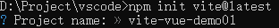
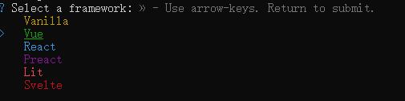
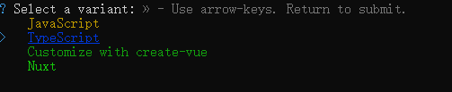
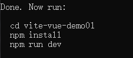
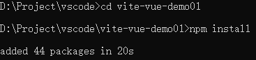
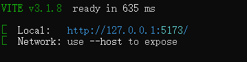
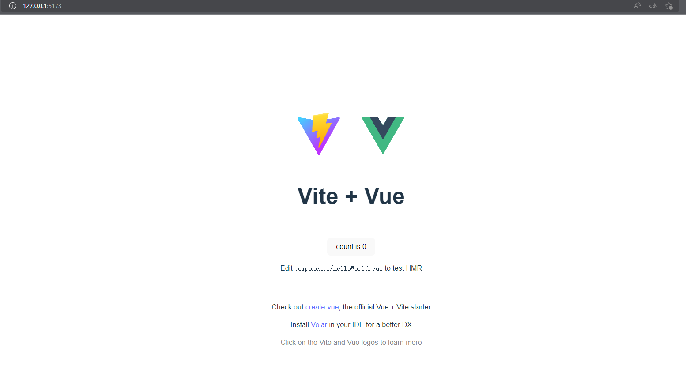
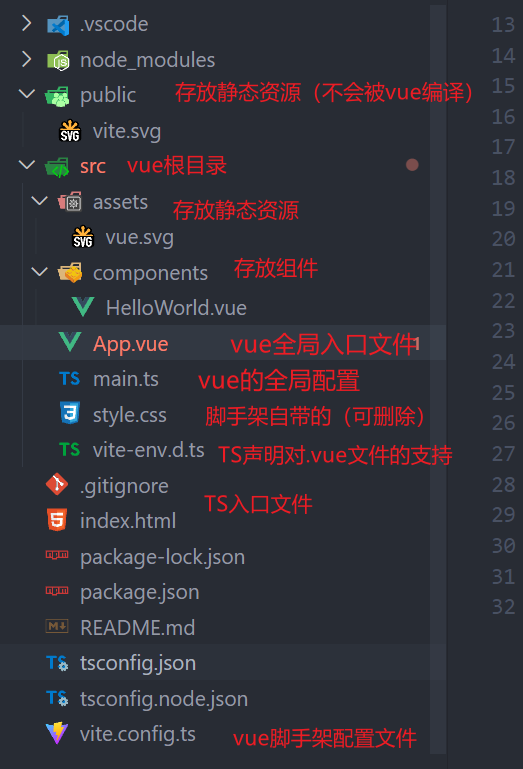
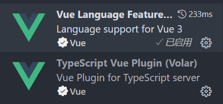
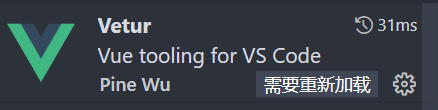

# Vue3 学习笔记

## 一、初识vue3

### 1. 使用vite构建vue3工程

```shell
npm init vite@latest
```

 

* 输入项目名称
  *  
* 选择项目类型为vue
  *  
* 使用TyteScript进行开发
  * ​	 
* 创建成功
  *  
* 进入项目根目录，安装所需的依赖（以前使用vue-cli在创建的时候会将依赖自动下载好，但是使用vite是按需加载的，所以启动的时候需要先install安装依赖）
  *  
* 启动项目，进入初始页面则安装成功
  *  
  * ​	  

### 2. Vue3项目结构



vscode 安装插件，使开发vue3时候有代码提示：

 

并且对vetur进行一个禁用，否则会有冲突

 


### 3. 启动命令

> "dev": "vite",   									开发环境下的启动命令
>
>  "build": "vue-tsc && vite build", 	打包命令
>
>  "preview": "vite preview" 				预览打包的项目


### 4. vue2 与 vue3的区别

1. v-if 与 v-for的优先级

   * 2.x版本中 v-for > v-if
   * 3.x版本中 v-if > v-for

2. v-for中的ref数组

   * 2.x版本中会自动把ref填充成数组（会导致多层v-for嵌套的性能影响）

   * 3.x版本中需要自己手动添加

     * ```vue
       <ul>
           <li v-for="index in 100" :key="item" :ref="setItemRef"></li>
       </ul>
       
       methods:{
           setItemRef(el){
               // 根据需要将ref添加到数组中
               this.arr.push(el)
           }
       }
       ```

3. $children

   * 2.x版本中可以获取到当前组件的子组件实例对象

   * 3.x版本中移除此用法，使用$refs即可获得相同效果

     * ```vue
       <HelloWorld ref="hw" />
       
       // 通过refs获取
       this.refs.hw
       ```

4. 响应式原理的区别
   * 2.x版本中使用的是： Object.defin  dProperty()
   * 3.x版本中使用的是：Proxy


## 二、setup基础

1. **是什么？**

   组合式API

2. **解决什么问题？**

   使用(data、computed、methods、watch)组件选项来组织逻辑通常都很有效。然而，当我们的组件开始变得更大时，==逻辑关注点的列表也会增长==。尤其对于那些一开始没有编写这些组件的人来说，这会==导致组件难以阅读和理解==。

3. setup语法糖插件：unplugin-auto-import

   解决场景：在开发中，无需下每一个组件中导入vue或vue-router相关组件

   1. 下载安装

      ```shell
      npm i unplugin-auto-import -D
      ```

      

   2. 配置vite.config.js文件

      ```js
      import AutoImport from 'unplugin-auto-import/vite'
      export default defineConfig({
          plugins:[
              vue(),
              AutoImport({ 
                 imports: ["vue", "vue-router"] // 自动导入vue和vue-router相关函数
              })
          ]
      })
      ```

      

## 三、生命周期钩子

1. 选项式API

   与vue中的生命周期基本一致

2.  setup 组合式API

   注意：没有beforeCreate 和 create两个生命周期钩子

   其他生命周期钩子需要在前面加上“on” 例如：onMounted

参考链接：[组合式 API：生命周期钩子 | Vue.js (vuejs.org)](https://cn.vuejs.org/api/composition-api-lifecycle.html)