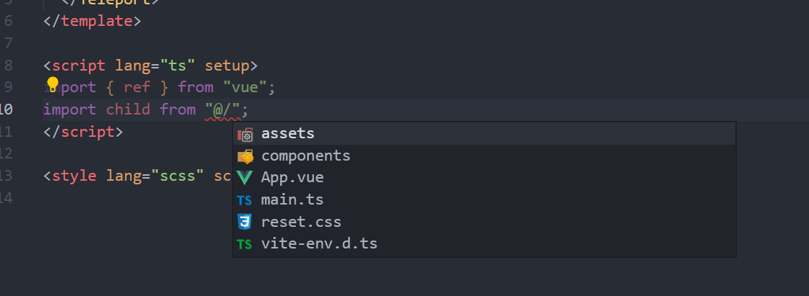
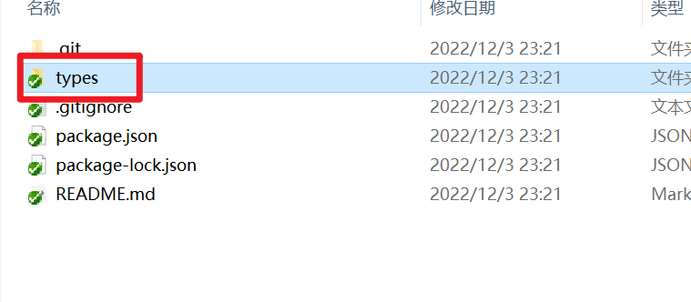

# Vue3通用配置

## 1. 配置项目路径别名@

1. 配置vscode中使用@符号会提示路径

   打开vscode -> 设置 ->打开设置(json) 进入settings.json, 在settings.json中假如如下配置

   ```json
   "path-intellisense.mappings": {
       "@": "${workspaceRoot}/src", // 配置@符号表示的路径
    },
   ```

    

   

2.  配置TS中@符号的作用，让其不会出现红色波浪线

   在项目的tsconfig.json中加入如下配置

   ```json
   "compilerOptions": {
   	...
       "baseUrl": "./",
       "paths": {
         "@/*": [
           "src/*"
         ],
         "#/*": [
           "types/*"
         ]
       }
     },
   ```

   

3.  配置vite在打包的时候，自动将@符号转换成对应的路径

   ```shell
   npm i -D @types/node
   ```

   在项目的vite.config.ts中假如如下配置

   ```json
   import * as path from "path";
   
   export default defineConfig({
     resolve: {
       alias: {
         "@": path.join(__dirname, "src"),
         "#": path.join(__dirname, "types"),
       },
     },
   });
   ```


## 2. 使用scss

```shell
npm install sass --save-dev
npm install sass-loader --save-dev
npm install node-sass --save-dev
```


## 3. 使用高德地图API

高德地图JSAPI官方文档：[概述-地图 JS API v2.0 | 高德地图API (amap.com)](https://lbs.amap.com/api/jsapi-v2/summary/)


1. 使用安全密钥

   * **JSAPI key搭配代理服务器并携带安全密钥转发（安全）**

     * 密钥引入

       ```html
       <script type="text/javascript">         
           window._AMapSecurityConfig = {  
               serviceHost:'您的代理服务器域名或地址/_AMapService',               
               // 例如 ：serviceHost:'http://1.1.1.1:80/_AMapService',         }
       </script>
       ```

       

     * 代理服务器的设置

       ```javascript
       server {
               listen       80;             #nginx端口设置，可按实际端口修改
               server_name  127.0.0.1;      #nginx server_name 对应进行配置，可按实际添加或修改
               
               # 自定义地图服务代理
               location /_AMapService/v4/map/styles {
                   set $args "$args&jscode=您的安全密钥";
                   proxy_pass https://webapi.amap.com/v4/map/styles;
               }
               # 海外地图服务代理
               location /_AMapService/v3/vectormap {
                   set $args "$args&jscode=您的安全密钥";
                   proxy_pass https://fmap01.amap.com/v3/vectormap;
               }
               # Web服务API 代理
               location /_AMapService/ {
                   set $args "$args&jscode=您的安全密钥";
                   proxy_pass https://restapi.amap.com/;
               }
       }
       ```

       

   * **JSAPI key搭配静态安全密钥以明文设置（不安全，建议开发环境用）：**

     ```html
     <script type="text/javascript">
             window._AMapSecurityConfig = {
                 securityJsCode:'您申请的安全密钥',
             }
     </script>
     ```

     

     

2. JSAPI引入

   ==注意：安全密钥一定要在JSAPI之前引入==

   ```html
   <script type="text/javascript">
           window._AMapSecurityConfig = {
               serviceHost:'您的代理服务器域名或地址/_AMapService',  
               // 例如 ：serviceHost:'http://1.1.1.1:80/_AMapService',
           }
   </script>
   <script type="text/javascript" src="https://webapi.amap.com/maps?v=1.4.15&key=您申请的key值"></script> 
   ```


3. 如果是TS项目需要引入DTS声明文件

   a.  JSAPI2.0 核心文件的接口(不包含插件的接口）

   ​	文档地址：[wanwenqing-amap-jsapi-types - npm (npmjs.com)](https://www.npmjs.com/package/wanwenqing-amap-jsapi-types)

   ```shell
   npm i wanwenqing-amap-jsapi-types
   ```

   

   b. 引入第三方插件DTS

   ​	文档地址：[GitHub - Ludidi/amap-jsapi-plugins-types: 高德地图 jsapi-2.0 插件DTS](https://github.com/Ludidi/amap-jsapi-plugins-types)

   ​	克隆项目地址：https://github.com/Ludidi/amap-jsapi-plugins-types.git

   ​	拷贝 types/amap 文件夹下所引用的插件放置于自己的项目下

    

    

   c. 全局声明刚刚引入的types文件

   ​	在tsconfig.json中加入如下配置

   ```json
   "include": [
       ...
       "types/**/*.d.ts", // 声明types目录下的所有类型全局可用
   ],
   ```

   

   

4. 项目中使用JSAPI创建简单的定位地图demo

   * 创建map

     ```javascript
     const createMap = (AMap: any) => {
         // container 表示地图要挂载的容器
         // 第二个对象参数表示地图选项
     	return new AMap.Map('container', {
     		viewMode: '2D',
     		zoom: 10, //初始化地图级别
     		resizeEnable: true
     	});
     };
     ```

     

   * 使用插件

     ```javascript
     const addMapGeolocationPlugin = (map: any, AMap: any) => {
     	AMap.plugin('AMap.Geolocation', function () {
     		var geolocation = new AMap.Geolocation({
     			showMarker: true,
     			showCircle: false,
     			enableHighAccuracy: true, //是否使用高精度定位，默认:true
     			timeout: 10000, //超过10秒后停止定位，默认：5s
     			position: 'RB', //定位按钮的停靠位置
     			offset: [10, 20], //定位按钮与设置的停靠位置的偏移量，默认：[10, 20]
     			zoomToAccuracy: true //定位成功后是否自动调整地图视野到定位点
     		});
     		map.addControl(geolocation);
     		geolocation.getCurrentPosition(function (status: any, result: any) {
     			if (status == 'complete') {
     				onComplete(result);
     			} else {
     				onError(result);
     			}
     		});
     	});
     };
     
     function onComplete(result: any) {
     	console.log(result);
     	let { position, formattedAddress } = result;
     	if (lat.value == 0) {
     		lat.value = position.Q;
     		lng.value = position.R;
     		address.value = formattedAddress;
     	}
     }
     
     function onError(result: any) {}
     ```

     

      

     


