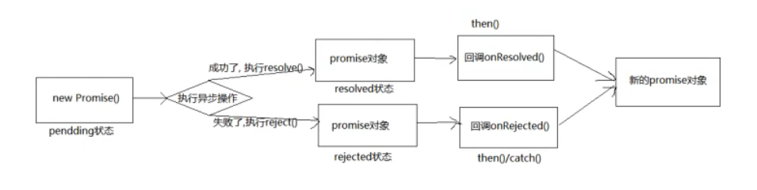

# 异步函数笔记


## Promise

###  Promise入门

**什么是Promise？**

>Promise用于处理一些需要花费长时间的任务，进行异步处理，防止任务阻塞。一般是说解决了回调地狱的问题。

什么是回调地狱?

```js
getHotPot(function (data) {  //吃火锅
    console.log(data);
    getTea(function (data) {  //吃奶茶
        console.log(data);
        getNailArt(function (data) {  //美甲
            console.log(data);
            getMassage(function (data) {  //按摩
                console.log(data);
                getMovie(function (data) {  //看电影
                    console.log(data);
                })
            })
        })
    })
})
```

为了控制顺序获得结果，并且这个结果是异步操作，那就不能直接return，用回调函数获取，还需要嵌套，嵌套多了就形成了回调地狱，代码不易维护。


**Promise解决了什么问题?**

- 回调地狱，代码难以维护， 常常第一个的函数的输出是第二个函数的输入这种现象
- promise可以支持多个并发的请求，获取并发请求中的数据
- 这个promise可以解决异步的问题，本身不能说promise是异步的


**Promise初体验**

```js
 function rander(m, n) {
     return Math.floor(Math.random() * (n - m + 1) + m)
 }

const p = new Promise((resolve, reject) => {
    setTimeout(() => {
        let n = rander(1, 10)
        if (n < 9) {
            reject(n) // 成功回调
        } else {
            resolve(n) // 失败回调
        }
    }, 2000)
})

p.then((value) => {
    alert("success " + value)
}, (reason) => {
    alert("error " + reason)
})
```


### Promise属性

#### 状态属性 PromiseState

> 实例对象的一个属性：【PromiseState】
>
> * **pending** 未决定的
> * **resolved / fulfilled** 成功
> * **rejected** 失败

**状态改变**

1. pending 变为 resolved
2. pending 变为 rejected

说明：有且只有2种改变，且一个Promise对象只能改变一次，无论变为成功还是失败，都会有一个结果数据，成功结果数据一般称为value，失败结果数据一般称为reason。


#### 结果属性 PromiseResult

> 实例对象的一个属性：【PromiseResult】
>
> 保存着对象**成功或者失败**的结果

**结果改变**

1. resolved
2. rejected


### Promise工作流程




### Promise API

1. **Promise构造函数：Promise(executor)}**

   1. executor函数：执行器(resolve,reject)=>{}
   2. resolve函数：内部定义成功时我们调用的函数(value)=>{}
   3. reject函数：内部定义失败时我们调用的函数(reason)=>{}

   ==说明：executor会在Promise内部立即同步调用，异步操作在执行器中执行==

2. **Promise.prototype.then方法：(onResolved,onRejected)=>{}**

   1. onResolved函数：成功的回调函数(value)=>{}
   2. onRejected函数：失败的回调函数(reason)=>{}

   ==说明：指定用于得到成功value的成功回调和用于得到失败reason的失败回调返回一个新的promise对象==

3. **Promise.prototype.catch方法：(onRejected)=>{}**

   1. onRejected函数：失败的回调函数(reason)=>{}

   ==说明：then()的语法糖，相当于：then(undefined,onRejected)==

4. **Promise.resolve方法：(value)=>{}**

   1. value:成功的数据或promise对象

      ```js
      // a为一个Promise对象，此时a对象是否成功，取决于里面的Promise对象
      const a = Promise.resolve(new Promise(resolve, reject) => {})
      ```

   ==说明：返回一个成功/失败的promise对象==

5. **Promise.reject方法：(reason)=>{}**

   1. value:成功的数据或promise对象

      ```js
      // a为一个失败的Promise对象， 无论里面的Promise是否成功，始终失败
      const a = Promise.resolve(new Promise(resolve, reject) => {})
      ```

   ==说明：返回一个失败的promise对象==

6. **Promise.all方法：(promises)=>{}**

   1. promises:包含n个promise的数组

   ==说明：返回一个新的promise,只有所有的promise都成功才成功，只要有一个失败了就直接失败==

7. **Promise.rce方法：(promises)=>{}**

   1. promises:包含n个promise的数组

   ==说明：返回一个新的promise,第一个完成的promise的结果状态就是最终的结果状态==


### Promise中几个关键问题

1. **如何改变promise的状态？**

   1. resolve(value):如果当前是pending就会变为resolved

   2. reject(reason):如果当前是pending就会变为rejected

   3. 抛出异常：如果当前是pending就会变为rejected

      

2. **一个promise指定多个成功/失败回调函数,都会调用吗?**

   当promise改变为对应状态时都会调用


3. **改变 promise状态和指定回调函数谁先谁后?**

   1. 都有可能，正常情况下是先指定回调再改变状态，但也可以先改状态再指定回调

   2. 如何先改状态再指定回调?

      a.  在执行器中直接调用resolve()/reject()

      b. 延迟更长时间才调用then()

   3. 什么时候才能得到数据?

      a. 如果先指定的回调，那当状态发生改变时，回调函数就会调用，得到数据

      b. 如果先改变的状态，那当指定回调时，回调函数就会调用，得到数据


4. **promise.then()返回的新promise的结果状态由什么决定?**

   1. 简单表达:由then()指定的回调函数执行的结果决定

   2. 详细表达:

      a. 如果抛出异常，新 promise变为rejected,reason为抛出的异常

      b. 如果返回的是非promise的任意值,新promise变为resolved, value为返回的值

      c. 如果返回的是另一个新promise，此promise的结果就会成为新promise的结果


5. **promise 如何串连多个操作任务?**
   1. promise 的 then()返回一个新的 promise，可以开成then()的链式调用
   2. 通过then的链式调用串连多个同步/异步任务


6. **promise异常传透?**

   1. 当使用promise的 then 链式调用时,可以在最后指定失败的回调,

   2. 前面任何操作出了异常，都会传到最后失败的回调中处理

      

7. **中断promise链?**

   1. 当使用promise的 then 链式调用时,在中间中断，不再调用后面的回调函数
   2. 办法：在回调函数中返回一个pendding状态的promise对象