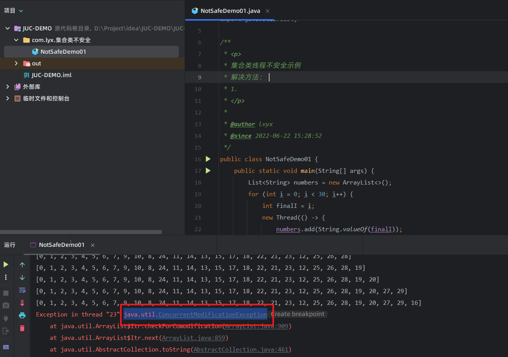
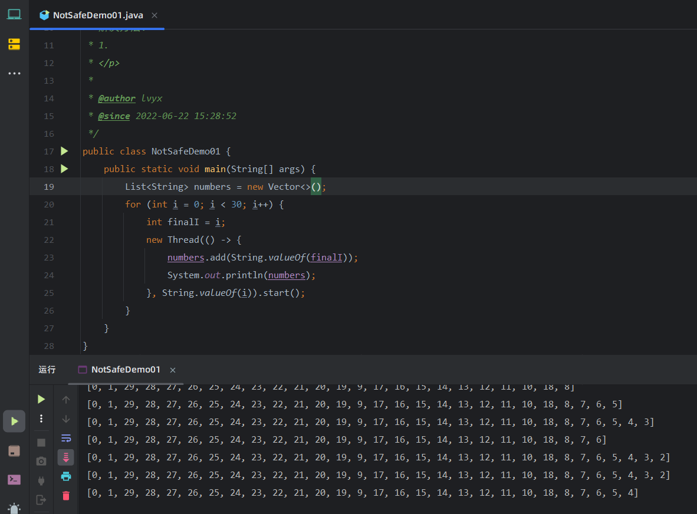
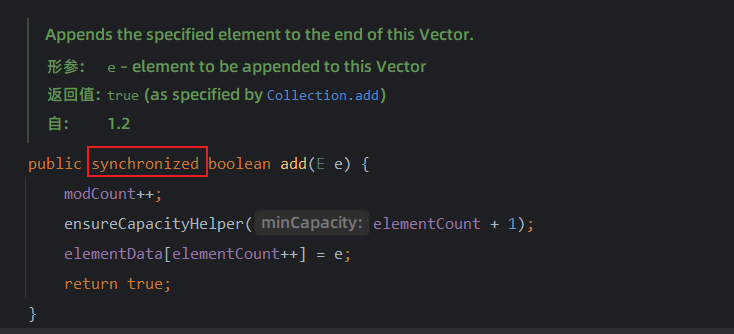
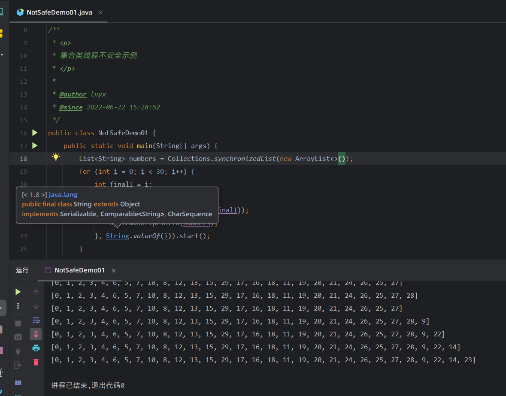
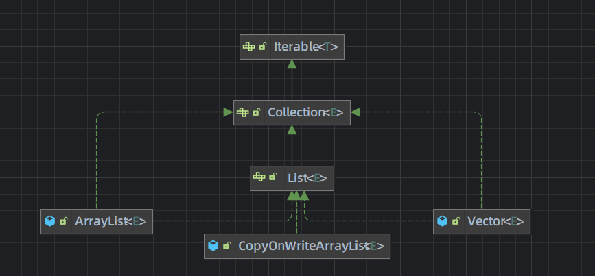
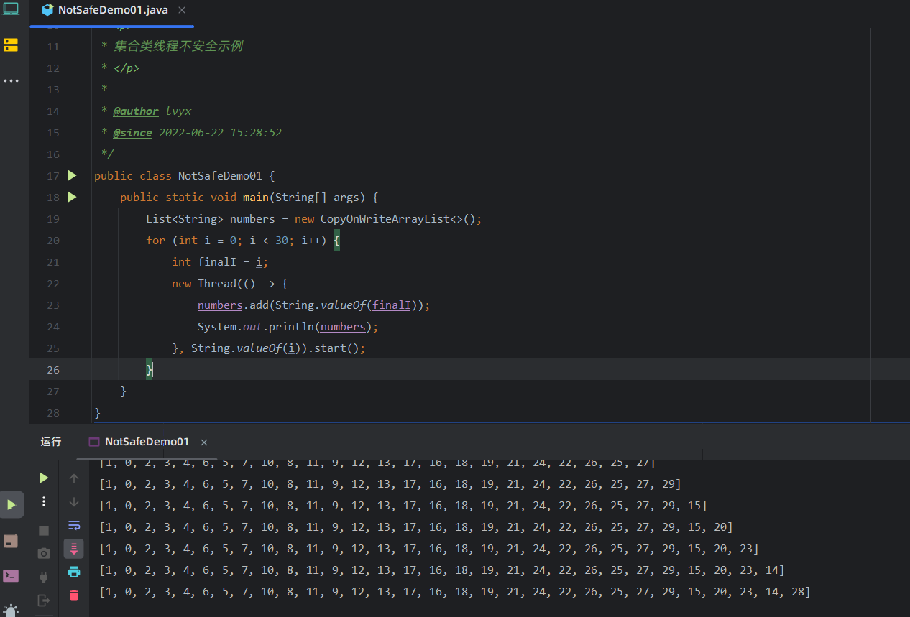
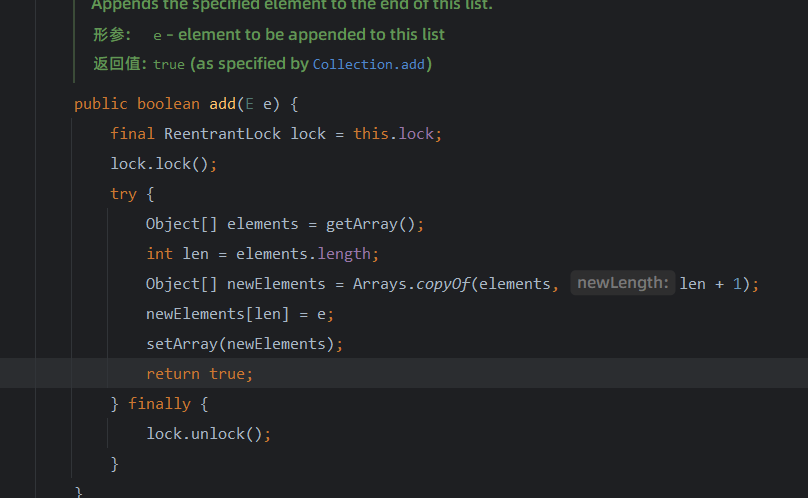

# JUC并发编程

## 1、 集合类不安全

### 1.1 面试总结

> 面试小知识：
>
> 1. new ArrayList(); 实际上是new了一个**长度为10类型为Object的数组**
> 2. **数组扩容为原来一半的长度**（向下取整）
> 3. 数组扩容使用的是**Arrays.copyOf()** 方法，将旧的数组复制到新的数组上
> 4. **ArrayList线程不安全**
> 5. HashSet 底层是new了一个HashMap<>(), 其中Key为添加的元素，保证了元素的唯一性，value是一个Object类型的常量


### 1.2 集合类线程不安全

> 异常类型：java.util.ConcurrentModificationException （并发修改异常）

**示例：**

```java
package com.lyx.集合类不安全;

import java.util.ArrayList;

/**
 * <p>
 * 集合类线程不安全示例
 * </p>
 *
 * @author lvyx
 * @since 2022-06-22 15:28:52
 */
public class NotSafeDemo01 {
    public static void main(String[] args) {
        List<String> numbers = new ArrayList<>();
        for (int i = 0; i < 30; i++) {
            int finalI = i;
            new Thread(() -> {
                numbers.add(String.valueOf(finalI));
                System.out.println(numbers);
            }, String.valueOf(i)).start();
        }
    }
}
```




### 1.3 解决方法

#### 1. 使用Vector(不推荐)

```java
package com.lyx.集合类不安全;

import java.util.ArrayList;
import java.util.List;
import java.util.Vector;

/**
 * <p>
 * 集合类线程不安全示例
 * 解决方法：
 * 1.
 * </p>
 *
 * @author lvyx
 * @since 2022-06-22 15:28:52
 */
public class NotSafeDemo01 {
    public static void main(String[] args) {
        List<String> numbers = new Vector<>();
        for (int i = 0; i < 30; i++) {
            int finalI = i;
            new Thread(() -> {
                numbers.add(String.valueOf(finalI));
                System.out.println(numbers);
            }, String.valueOf(i)).start();
        }
    }
}
```




解决原理：

> 底层使用了synchronized加锁，保证了线程的安全




#### 2. 使用Collections.synchronizedList() (不推荐)

```java
package com.lyx.集合类不安全;

import java.util.ArrayList;
import java.util.Collections;
import java.util.List;
import java.util.Vector;

/**
 * <p>
 * 集合类线程不安全示例
 * </p>
 *
 * @author lvyx
 * @since 2022-06-22 15:28:52
 */
public class NotSafeDemo01 {
    public static void main(String[] args) {
        List<String> numbers = Collections.synchronizedList(new ArrayList<>());
        for (int i = 0; i < 30; i++) {
            int finalI = i;
            new Thread(() -> {
                numbers.add(String.valueOf(finalI));
                System.out.println(numbers);
            }, String.valueOf(i)).start();
        }
    }
}
```




#### 3. 使用CopyOnWriteArrayList() (推荐)

> **写时复制技术**
>
> CopyOnwrite容器即写时复制的容器。往一个容器添加元素的时候，不直接往当前容器object[]添加，而是先将当前容器object[]进行Copy,复制出一个新的容器object[] newELements,然后新的容器object[] newELements里添加元素，添加完元素之后，再将原容器的引用指向新的容器setArray(newELements)j。这样做的好处是可以对CopyOnwrite容器进行并发的读，而不需要加锁，因为当前容器不会添加任何元素。**所以CopyOnwrite容器也是一种读写分离的思想，读和写不同的容器**



```java
package com.lyx.集合类不安全;

import java.util.ArrayList;
import java.util.Collections;
import java.util.List;
import java.util.Vector;
import java.util.concurrent.CopyOnWriteArrayList;

/**
 * <p>
 * 集合类线程不安全示例
 * </p>
 *
 * @author lvyx
 * @since 2022-06-22 15:28:52
 */
public class NotSafeDemo01 {
    public static void main(String[] args) {
        List<String> numbers = new CopyOnWriteArrayList<>();
        for (int i = 0; i < 30; i++) {
            int finalI = i;
            new Thread(() -> {
                numbers.add(String.valueOf(finalI));
                System.out.println(numbers);
            }, String.valueOf(i)).start();
        }
    }
}

```




解决原理：底层使用lock锁




## 2、八锁问题

### 2.1 锁1

>**同一个对象，同一时刻，只允许有一个线程访问同步方法**
>
>解释：只要一个线程访问了一个资源类里面的任何一个同步方法，那么它会将整个资源类所在的对象锁住。所以，当短信线程得到资源时，电话线程会等待短信线程释放资源，才会继续向下运行。

```java
package com.lyx.八锁问题;

import java.util.concurrent.TimeUnit;

/**
 * <p>
 *   * 短信加锁
 *   * 邮件加锁
 * 普通调用资源类
 *
 * ** 同一个对象，同一时刻，只允许有一个线程访问同步方法
 *
 * 解释：只要一个线程访问了一个资源类里面的任何一个同步方法，那么它会将
 * 整个资源类所在的对象锁住。所以，当短信线程得到资源时，电话线程会等待
 * 短信线程释放资源，才会继续向下运行。
 *
 * </p>
 *
 * @author lvyx
 * @since 2022-06-23 14:05:37
 */
public class Demo01 {

    public static void main(String[] args) {
        Phone phone = new Phone();

        new Thread(() -> {
            phone.sendSMS();
        }).start();
        // 等待100毫秒, 保证短信线程优先抢夺到资源
        try {
            TimeUnit.MILLISECONDS.sleep(100);
        } catch (InterruptedException e) {
            throw new RuntimeException(e);
        }
        new Thread(() -> {
            phone.sendEmail();
        }).start();
    }
}

class Phone{
    public synchronized void sendSMS(){
        System.out.println("发送短信");
    }

    public synchronized void sendEmail(){
        System.out.println("发送邮件");
    }
}
```


### 2.2 锁2

>解释：只要一个线程访问了一个资源类里面的任何一个同步方法，那么它会将整个资源类所在的对象锁住。所以，当短信线程得到资源时，电话线程会等待短信线程释放资源，才会继续向下运行。

```java
package com.lyx.八锁问题;

import java.util.concurrent.TimeUnit;

/**
 * <p>
 *     * 短信加锁
 *     * 邮件加锁
 *  发短信内部暂停4秒
 *
 *  解释：只要一个线程访问了一个资源类里面的任何一个同步方法，那么它会将
 *  整个资源类所在的对象锁住。所以，当短信线程得到资源时，电话线程会等待
 *  短信线程释放资源，才会继续向下运行。
 *
 * </p>
 *
 * @author lvyx
 * @since 2022-06-23 14:05:37
 */
public class Demo02 {

    public static void main(String[] args) {
        Phone2 phone = new Phone2();

        new Thread(() -> {
            try {
                phone.sendSMS();
            } catch (InterruptedException e) {
                throw new RuntimeException(e);
            }
        }).start();
        // 等待100毫秒, 保证短信线程优先抢夺到资源
        try {
            TimeUnit.MILLISECONDS.sleep(100);
        } catch (InterruptedException e) {
            throw new RuntimeException(e);
        }
        new Thread(() -> {
            phone.sendEmail();
        }).start();
    }
}

class Phone2{
    public synchronized void sendSMS() throws InterruptedException {
        TimeUnit.SECONDS.sleep(4);
        System.out.println("发送短信");
    }

    public synchronized void sendEmail(){
        System.out.println("发送邮件");
    }
}
```


### 2.3 锁3

>解释： 同步代码方法，无法锁住普通方法

```java
package com.lyx.八锁问题;

import java.util.concurrent.TimeUnit;

/**
 * <p>
 *  * 短信加锁
 *  * 邮件不加锁
 *  短信内部暂停4秒
 * </p>
 *
 * 解释： 同步代码方法，无法锁住普通方法
 *
 * @author lvyx
 * @since 2022-06-23 14:05:37
 */
public class Demo03 {

    public static void main(String[] args) {
        Phone3 phone = new Phone3();

        new Thread(() -> {
            try {
                phone.sendSMS();
            } catch (InterruptedException e) {
                throw new RuntimeException(e);
            }
        }).start();
        // 等待100毫秒, 保证短信线程优先抢夺到资源
        try {
            TimeUnit.MILLISECONDS.sleep(100);
        } catch (InterruptedException e) {
            throw new RuntimeException(e);
        }
        new Thread(() -> {
            phone.sendEmail();
        }).start();
    }
}

class Phone3{
    public synchronized void sendSMS() throws InterruptedException {
        TimeUnit.SECONDS.sleep(4);
        System.out.println("发送短信");
    }

    public void sendEmail(){
        System.out.println("发送邮件");
    }
}
```


### 2.4 锁4

> 解释：两台手机分别是不同的对象，所以都只能锁住所在对象的同步方法。

```java
package com.lyx.八锁问题;

import java.util.concurrent.TimeUnit;

/**
 * <p>
 *  * 短信加锁
 *  * 邮件加锁
 *  短信内部暂停4秒，使用两台手机分别调用短信和邮件
 *
 *  解释：两台手机分别是不同的对象，所以都只能锁住所在对象的同步方法。
 *
 * </p>
 *
 * @author lvyx
 * @since 2022-06-23 14:05:37
 */
public class Demo04 {

    public static void main(String[] args) {
        Phone4 phone1 = new Phone4();
        Phone4 phone2 = new Phone4();

        new Thread(() -> {
            try {
                phone1.sendSMS();
            } catch (InterruptedException e) {
                throw new RuntimeException(e);
            }
        }).start();
        // 等待100毫秒, 保证短信线程优先抢夺到资源
        try {
            TimeUnit.MILLISECONDS.sleep(100);
        } catch (InterruptedException e) {
            throw new RuntimeException(e);
        }
        new Thread(() -> {
            phone2.sendEmail();
        }).start();
    }
}

class Phone4{
    public synchronized void sendSMS() throws InterruptedException {
        TimeUnit.SECONDS.sleep(4);
        System.out.println("发送短信");
    }

    public synchronized void sendEmail(){
        System.out.println("发送邮件");
    }
}
```


### 2.5 锁5

>解释： 由于是静态方法，所以锁的是Class类类型，所以，不管是不是同一个对象，他们都是同一个字节码文件。静态同步方法相当于是全局锁。

```java
package com.lyx.八锁问题;

import java.util.concurrent.TimeUnit;

/**
 * <p>
 *  * 短信加锁，静态方法
 *  * 邮件加锁，静态方法
 *  短信内部暂停4秒, 两台手机分别调用短信和邮件方法
 *
 *  解释： 由于是静态方法，所以锁的是Class类类型，所以，
 *  不管是不是同一个对象，他们都是同一个字节码文件。静态同步
 *  方法相当于是全局锁。
 *
 * </p>
 *
 * @author lvyx
 * @since 2022-06-23 15:05:37
 */
public class Demo05 {

    public static void main(String[] args) {
        Phone5 phone1 = new Phone5();
        Phone5 phone2 = new Phone5();

        new Thread(() -> {
            try {
                phone1.sendSMS();
            } catch (InterruptedException e) {
                throw new RuntimeException(e);
            }
        }).start();
        // 等待100毫秒, 保证短信线程优先抢夺到资源
        try {
            TimeUnit.MILLISECONDS.sleep(100);
        } catch (InterruptedException e) {
            throw new RuntimeException(e);
        }
        new Thread(() -> {
            phone2.sendEmail();
        }).start();
    }
}

class Phone5{
    public static synchronized void sendSMS() throws InterruptedException {
        TimeUnit.SECONDS.sleep(4);
        System.out.println("发送短信");
    }

    public static synchronized void sendEmail(){
        System.out.println("发送邮件");
    }
}
```


### 2.6 锁6

>解释： 由于是静态方法，所以锁的是Class类类型，所以，不管是不是同一个对象，他们都是同一个字节码文件。静态同步方法相当于是全局锁。

```java
package com.lyx.八锁问题;

import java.util.concurrent.TimeUnit;

/**
 * <p>
 *  * 短信加锁，静态方法
 *  * 邮件加锁，静态方法
 *  短信内部暂停4秒, 一台手机
 * </p>
 *
 *  解释： 由于是静态方法，所以锁的是Class类类型，所以，
 *  不管是不是同一个对象，他们都是同一个字节码文件。静态同步
 *  方法相当于是全局锁。
 *
 * @author lvyx
 * @since 2022-06-23 15:05:37
 */
public class Demo06 {

    public static void main(String[] args) {
        Phone6 phone = new Phone6();

        new Thread(() -> {
            try {
                phone.sendSMS();
            } catch (InterruptedException e) {
                throw new RuntimeException(e);
            }
        }).start();
        // 等待100毫秒, 保证短信线程优先抢夺到资源
        try {
            TimeUnit.MILLISECONDS.sleep(100);
        } catch (InterruptedException e) {
            throw new RuntimeException(e);
        }
        new Thread(() -> {
            phone.sendEmail();
        }).start();
    }
}

class Phone6{
    public static synchronized void sendSMS() throws InterruptedException {
        TimeUnit.SECONDS.sleep(6);
        System.out.println("发送短信");
    }

    public static synchronized void sendEmail(){
        System.out.println("发送邮件");
    }
}
```


### 2.7 锁7

>解释：短信锁的是Class对象，而邮件锁的是this对象，两个锁的对象不一样。所以，两把锁不会互相干扰

```java
package com.lyx.八锁问题;

import java.util.concurrent.TimeUnit;

/**
 * <p>
 *  * 短信加锁，静态方法
 *  * 邮件加锁
 *  短信内部暂停4秒, 一台手机
 *
 *  解释：短信锁的是Class对象，而邮件锁的是this对象，两个锁的对象不一样
 *  所以，两把锁不会互相干扰
 *
 * </p>
 *
 * @author lvyx
 * @since 2022-06-23 15:05:37
 */
public class Demo07 {

    public static void main(String[] args) {
        Phone7 phone = new Phone7();

        new Thread(() -> {
            try {
                phone.sendSMS();
            } catch (InterruptedException e) {
                throw new RuntimeException(e);
            }
        }).start();
        // 等待100毫秒, 保证短信线程优先抢夺到资源
        try {
            TimeUnit.MILLISECONDS.sleep(100);
        } catch (InterruptedException e) {
            throw new RuntimeException(e);
        }
        new Thread(() -> {
            phone.sendEmail();
        }).start();
    }
}

class Phone7{
    public static synchronized void sendSMS() throws InterruptedException {
        TimeUnit.SECONDS.sleep(6);
        System.out.println("发送短信");
    }

    public synchronized void sendEmail(){
        System.out.println("发送邮件");
    }
}
```


### 2.8 锁8

>解释：短信锁的是Class对象，而邮件锁的是this对象，两个锁的对象不一样。所以，两把锁不会互相干扰

```java
package com.lyx.八锁问题;

import java.util.concurrent.TimeUnit;

/**
 * <p>
 *  * 短信加锁，静态方法
 *  * 邮件加锁
 *  短信内部暂停4秒, 两台手机分别调用邮件和短信的方法
 * </p>
 *
 * 解释：短信锁的是Class对象，而邮件锁的是this对象，两个锁的对象不一样
 * 所以，两把锁不会互相干扰
 *
 * @author lvyx
 * @since 2022-06-23 15:55:37
 */
public class Demo08 {

    public static void main(String[] args) {
        Phone8 phone1 = new Phone8();
        Phone8 phone2 = new Phone8();

        new Thread(() -> {
            try {
                phone1.sendSMS();
            } catch (InterruptedException e) {
                throw new RuntimeException(e);
            }
        }).start();
        // 等待100毫秒, 保证短信线程优先抢夺到资源
        try {
            TimeUnit.MILLISECONDS.sleep(100);
        } catch (InterruptedException e) {
            throw new RuntimeException(e);
        }
        new Thread(() -> {
            phone2.sendEmail();
        }).start();
    }
}

class Phone8{
    public static synchronized void sendSMS() throws InterruptedException {
        TimeUnit.SECONDS.sleep(6);
        System.out.println("发送短信");
    }

    public synchronized void sendEmail(){
        System.out.println("发送邮件");
    }
}
```

