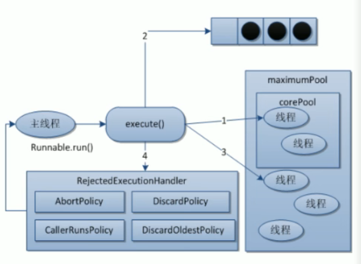

# JUC并发编程

## 1、 集合类不安全

### 1.1 面试总结

> 面试小知识：
>
> 1. new ArrayList(); 实际上是new了一个**长度为10类型为Object的数组**
> 2. **数组扩容为原来一半的长度**（向下取整）
> 3. 数组扩容使用的是**Arrays.copyOf()** 方法，将旧的数组复制到新的数组上
> 4. **ArrayList线程不安全**
> 5. HashSet 底层是new了一个HashMap<>(), 其中Key为添加的元素，保证了元素的唯一性，value是一个Object类型的常量


### 1.2 集合类线程不安全

> 异常类型：java.util.ConcurrentModificationException （并发修改异常）

**示例：**

```java
package com.lyx.集合类不安全;

import java.util.ArrayList;

/**
 * <p>
 * 集合类线程不安全示例
 * </p>
 *
 * @author lvyx
 * @since 2022-06-22 15:28:52
 */
public class NotSafeDemo01 {
    public static void main(String[] args) {
        List<String> numbers = new ArrayList<>();
        for (int i = 0; i < 30; i++) {
            int finalI = i;
            new Thread(() -> {
                numbers.add(String.valueOf(finalI));
                System.out.println(numbers);
            }, String.valueOf(i)).start();
        }
    }
}
```


### 1.3 解决方法

#### 1. 使用Vector(不推荐)

```java
package com.lyx.集合类不安全;

import java.util.ArrayList;
import java.util.List;
import java.util.Vector;

/**
 * <p>
 * 集合类线程不安全示例
 * 解决方法：
 * 1.
 * </p>
 *
 * @author lvyx
 * @since 2022-06-22 15:28:52
 */
public class NotSafeDemo01 {
    public static void main(String[] args) {
        List<String> numbers = new Vector<>();
        for (int i = 0; i < 30; i++) {
            int finalI = i;
            new Thread(() -> {
                numbers.add(String.valueOf(finalI));
                System.out.println(numbers);
            }, String.valueOf(i)).start();
        }
    }
}
```


解决原理：

> 底层使用了synchronized加锁，保证了线程的安全


#### 2. 使用Collections.synchronizedList() (不推荐)

```java
package com.lyx.集合类不安全;

import java.util.ArrayList;
import java.util.Collections;
import java.util.List;
import java.util.Vector;

/**
 * <p>
 * 集合类线程不安全示例
 * </p>
 *
 * @author lvyx
 * @since 2022-06-22 15:28:52
 */
public class NotSafeDemo01 {
    public static void main(String[] args) {
        List<String> numbers = Collections.synchronizedList(new ArrayList<>());
        for (int i = 0; i < 30; i++) {
            int finalI = i;
            new Thread(() -> {
                numbers.add(String.valueOf(finalI));
                System.out.println(numbers);
            }, String.valueOf(i)).start();
        }
    }
}
```


#### 3. 使用CopyOnWriteArrayList() (推荐)

> **写时复制技术**
>
> CopyOnwrite容器即写时复制的容器。往一个容器添加元素的时候，不直接往当前容器object[]添加，而是先将当前容器object[]进行Copy,复制出一个新的容器object[] newELements,然后新的容器object[] newELements里添加元素，添加完元素之后，再将原容器的引用指向新的容器setArray(newELements)j。这样做的好处是可以对CopyOnwrite容器进行并发的读，而不需要加锁，因为当前容器不会添加任何元素。**所以CopyOnwrite容器也是一种读写分离的思想，读和写不同的容器**


```java
package com.lyx.集合类不安全;

import java.util.ArrayList;
import java.util.Collections;
import java.util.List;
import java.util.Vector;
import java.util.concurrent.CopyOnWriteArrayList;

/**
 * <p>
 * 集合类线程不安全示例
 * </p>
 *
 * @author lvyx
 * @since 2022-06-22 15:28:52
 */
public class NotSafeDemo01 {
    public static void main(String[] args) {
        List<String> numbers = new CopyOnWriteArrayList<>();
        for (int i = 0; i < 30; i++) {
            int finalI = i;
            new Thread(() -> {
                numbers.add(String.valueOf(finalI));
                System.out.println(numbers);
            }, String.valueOf(i)).start();
        }
    }
}

```


解决原理：底层使用lock锁


## 2、八锁问题

### 2.1 锁1

>**同一个对象，同一时刻，只允许有一个线程访问同步方法**
>
>解释：只要一个线程访问了一个资源类里面的任何一个同步方法，那么它会将整个资源类所在的对象锁住。所以，当短信线程得到资源时，电话线程会等待短信线程释放资源，才会继续向下运行。

```java
package com.lyx.八锁问题;

import java.util.concurrent.TimeUnit;

/**
 * <p>
 *   * 短信加锁
 *   * 邮件加锁
 * 普通调用资源类
 *
 * ** 同一个对象，同一时刻，只允许有一个线程访问同步方法
 *
 * 解释：只要一个线程访问了一个资源类里面的任何一个同步方法，那么它会将
 * 整个资源类所在的对象锁住。所以，当短信线程得到资源时，电话线程会等待
 * 短信线程释放资源，才会继续向下运行。
 *
 * </p>
 *
 * @author lvyx
 * @since 2022-06-23 14:05:37
 */
public class Demo01 {

    public static void main(String[] args) {
        Phone phone = new Phone();

        new Thread(() -> {
            phone.sendSMS();
        }).start();
        // 等待100毫秒, 保证短信线程优先抢夺到资源
        try {
            TimeUnit.MILLISECONDS.sleep(100);
        } catch (InterruptedException e) {
            throw new RuntimeException(e);
        }
        new Thread(() -> {
            phone.sendEmail();
        }).start();
    }
}

class Phone{
    public synchronized void sendSMS(){
        System.out.println("发送短信");
    }

    public synchronized void sendEmail(){
        System.out.println("发送邮件");
    }
}
```


### 2.2 锁2

>解释：只要一个线程访问了一个资源类里面的任何一个同步方法，那么它会将整个资源类所在的对象锁住。所以，当短信线程得到资源时，电话线程会等待短信线程释放资源，才会继续向下运行。

```java
package com.lyx.八锁问题;

import java.util.concurrent.TimeUnit;

/**
 * <p>
 *     * 短信加锁
 *     * 邮件加锁
 *  发短信内部暂停4秒
 *
 *  解释：只要一个线程访问了一个资源类里面的任何一个同步方法，那么它会将
 *  整个资源类所在的对象锁住。所以，当短信线程得到资源时，电话线程会等待
 *  短信线程释放资源，才会继续向下运行。
 *
 * </p>
 *
 * @author lvyx
 * @since 2022-06-23 14:05:37
 */
public class Demo02 {

    public static void main(String[] args) {
        Phone2 phone = new Phone2();

        new Thread(() -> {
            try {
                phone.sendSMS();
            } catch (InterruptedException e) {
                throw new RuntimeException(e);
            }
        }).start();
        // 等待100毫秒, 保证短信线程优先抢夺到资源
        try {
            TimeUnit.MILLISECONDS.sleep(100);
        } catch (InterruptedException e) {
            throw new RuntimeException(e);
        }
        new Thread(() -> {
            phone.sendEmail();
        }).start();
    }
}

class Phone2{
    public synchronized void sendSMS() throws InterruptedException {
        TimeUnit.SECONDS.sleep(4);
        System.out.println("发送短信");
    }

    public synchronized void sendEmail(){
        System.out.println("发送邮件");
    }
}
```


### 2.3 锁3

>解释： 同步代码方法，无法锁住普通方法

```java
package com.lyx.八锁问题;

import java.util.concurrent.TimeUnit;

/**
 * <p>
 *  * 短信加锁
 *  * 邮件不加锁
 *  短信内部暂停4秒
 * </p>
 *
 * 解释： 同步代码方法，无法锁住普通方法
 *
 * @author lvyx
 * @since 2022-06-23 14:05:37
 */
public class Demo03 {

    public static void main(String[] args) {
        Phone3 phone = new Phone3();

        new Thread(() -> {
            try {
                phone.sendSMS();
            } catch (InterruptedException e) {
                throw new RuntimeException(e);
            }
        }).start();
        // 等待100毫秒, 保证短信线程优先抢夺到资源
        try {
            TimeUnit.MILLISECONDS.sleep(100);
        } catch (InterruptedException e) {
            throw new RuntimeException(e);
        }
        new Thread(() -> {
            phone.sendEmail();
        }).start();
    }
}

class Phone3{
    public synchronized void sendSMS() throws InterruptedException {
        TimeUnit.SECONDS.sleep(4);
        System.out.println("发送短信");
    }

    public void sendEmail(){
        System.out.println("发送邮件");
    }
}
```


### 2.4 锁4

> 解释：两台手机分别是不同的对象，所以都只能锁住所在对象的同步方法。

```java
package com.lyx.八锁问题;

import java.util.concurrent.TimeUnit;

/**
 * <p>
 *  * 短信加锁
 *  * 邮件加锁
 *  短信内部暂停4秒，使用两台手机分别调用短信和邮件
 *
 *  解释：两台手机分别是不同的对象，所以都只能锁住所在对象的同步方法。
 *
 * </p>
 *
 * @author lvyx
 * @since 2022-06-23 14:05:37
 */
public class Demo04 {

    public static void main(String[] args) {
        Phone4 phone1 = new Phone4();
        Phone4 phone2 = new Phone4();

        new Thread(() -> {
            try {
                phone1.sendSMS();
            } catch (InterruptedException e) {
                throw new RuntimeException(e);
            }
        }).start();
        // 等待100毫秒, 保证短信线程优先抢夺到资源
        try {
            TimeUnit.MILLISECONDS.sleep(100);
        } catch (InterruptedException e) {
            throw new RuntimeException(e);
        }
        new Thread(() -> {
            phone2.sendEmail();
        }).start();
    }
}

class Phone4{
    public synchronized void sendSMS() throws InterruptedException {
        TimeUnit.SECONDS.sleep(4);
        System.out.println("发送短信");
    }

    public synchronized void sendEmail(){
        System.out.println("发送邮件");
    }
}
```


### 2.5 锁5

>解释： 由于是静态方法，所以锁的是Class类类型，所以，不管是不是同一个对象，他们都是同一个字节码文件。静态同步方法相当于是全局锁。

```java
package com.lyx.八锁问题;

import java.util.concurrent.TimeUnit;

/**
 * <p>
 *  * 短信加锁，静态方法
 *  * 邮件加锁，静态方法
 *  短信内部暂停4秒, 两台手机分别调用短信和邮件方法
 *
 *  解释： 由于是静态方法，所以锁的是Class类类型，所以，
 *  不管是不是同一个对象，他们都是同一个字节码文件。静态同步
 *  方法相当于是全局锁。
 *
 * </p>
 *
 * @author lvyx
 * @since 2022-06-23 15:05:37
 */
public class Demo05 {

    public static void main(String[] args) {
        Phone5 phone1 = new Phone5();
        Phone5 phone2 = new Phone5();

        new Thread(() -> {
            try {
                phone1.sendSMS();
            } catch (InterruptedException e) {
                throw new RuntimeException(e);
            }
        }).start();
        // 等待100毫秒, 保证短信线程优先抢夺到资源
        try {
            TimeUnit.MILLISECONDS.sleep(100);
        } catch (InterruptedException e) {
            throw new RuntimeException(e);
        }
        new Thread(() -> {
            phone2.sendEmail();
        }).start();
    }
}

class Phone5{
    public static synchronized void sendSMS() throws InterruptedException {
        TimeUnit.SECONDS.sleep(4);
        System.out.println("发送短信");
    }

    public static synchronized void sendEmail(){
        System.out.println("发送邮件");
    }
}
```


### 2.6 锁6

>解释： 由于是静态方法，所以锁的是Class类类型，所以，不管是不是同一个对象，他们都是同一个字节码文件。静态同步方法相当于是全局锁。

```java
package com.lyx.八锁问题;

import java.util.concurrent.TimeUnit;

/**
 * <p>
 *  * 短信加锁，静态方法
 *  * 邮件加锁，静态方法
 *  短信内部暂停4秒, 一台手机
 * </p>
 *
 *  解释： 由于是静态方法，所以锁的是Class类类型，所以，
 *  不管是不是同一个对象，他们都是同一个字节码文件。静态同步
 *  方法相当于是全局锁。
 *
 * @author lvyx
 * @since 2022-06-23 15:05:37
 */
public class Demo06 {

    public static void main(String[] args) {
        Phone6 phone = new Phone6();

        new Thread(() -> {
            try {
                phone.sendSMS();
            } catch (InterruptedException e) {
                throw new RuntimeException(e);
            }
        }).start();
        // 等待100毫秒, 保证短信线程优先抢夺到资源
        try {
            TimeUnit.MILLISECONDS.sleep(100);
        } catch (InterruptedException e) {
            throw new RuntimeException(e);
        }
        new Thread(() -> {
            phone.sendEmail();
        }).start();
    }
}

class Phone6{
    public static synchronized void sendSMS() throws InterruptedException {
        TimeUnit.SECONDS.sleep(6);
        System.out.println("发送短信");
    }

    public static synchronized void sendEmail(){
        System.out.println("发送邮件");
    }
}
```


### 2.7 锁7

>解释：短信锁的是Class对象，而邮件锁的是this对象，两个锁的对象不一样。所以，两把锁不会互相干扰

```java
package com.lyx.八锁问题;

import java.util.concurrent.TimeUnit;

/**
 * <p>
 *  * 短信加锁，静态方法
 *  * 邮件加锁
 *  短信内部暂停4秒, 一台手机
 *
 *  解释：短信锁的是Class对象，而邮件锁的是this对象，两个锁的对象不一样
 *  所以，两把锁不会互相干扰
 *
 * </p>
 *
 * @author lvyx
 * @since 2022-06-23 15:05:37
 */
public class Demo07 {

    public static void main(String[] args) {
        Phone7 phone = new Phone7();

        new Thread(() -> {
            try {
                phone.sendSMS();
            } catch (InterruptedException e) {
                throw new RuntimeException(e);
            }
        }).start();
        // 等待100毫秒, 保证短信线程优先抢夺到资源
        try {
            TimeUnit.MILLISECONDS.sleep(100);
        } catch (InterruptedException e) {
            throw new RuntimeException(e);
        }
        new Thread(() -> {
            phone.sendEmail();
        }).start();
    }
}

class Phone7{
    public static synchronized void sendSMS() throws InterruptedException {
        TimeUnit.SECONDS.sleep(6);
        System.out.println("发送短信");
    }

    public synchronized void sendEmail(){
        System.out.println("发送邮件");
    }
}
```


### 2.8 锁8

>解释：短信锁的是Class对象，而邮件锁的是this对象，两个锁的对象不一样。所以，两把锁不会互相干扰

```java
package com.lyx.八锁问题;

import java.util.concurrent.TimeUnit;

/**
 * <p>
 *  * 短信加锁，静态方法
 *  * 邮件加锁
 *  短信内部暂停4秒, 两台手机分别调用邮件和短信的方法
 * </p>
 *
 * 解释：短信锁的是Class对象，而邮件锁的是this对象，两个锁的对象不一样
 * 所以，两把锁不会互相干扰
 *
 * @author lvyx
 * @since 2022-06-23 15:55:37
 */
public class Demo08 {

    public static void main(String[] args) {
        Phone8 phone1 = new Phone8();
        Phone8 phone2 = new Phone8();

        new Thread(() -> {
            try {
                phone1.sendSMS();
            } catch (InterruptedException e) {
                throw new RuntimeException(e);
            }
        }).start();
        // 等待100毫秒, 保证短信线程优先抢夺到资源
        try {
            TimeUnit.MILLISECONDS.sleep(100);
        } catch (InterruptedException e) {
            throw new RuntimeException(e);
        }
        new Thread(() -> {
            phone2.sendEmail();
        }).start();
    }
}

class Phone8{
    public static synchronized void sendSMS() throws InterruptedException {
        TimeUnit.SECONDS.sleep(6);
        System.out.println("发送短信");
    }

    public synchronized void sendEmail(){
        System.out.println("发送邮件");
    }
}
```


## 3、生产者消费者

### 3.1 synchronized锁

> 创建两个线程，生产者线程和消费者线程
>
> 生产者线程对资源进行 +1 ， 消费者线程对资源进行 -1 
>
> 当资源为0时生产者进行+1操作，当资源不为0时消费者进行-1操作。

```java
package com.lyx.生产者消费者;

/**
 * <p>
 * 生产者消费者问题
 * </p>
 *
 * @author lvyx
 * @since 2022-06-23 16:23:50
 */
public class ProdConsumer {
    public static void main(String[] args) {
        ResourceClass resourceClass = new ResourceClass();
        
        new Thread(() -> {
            for (int i = 0; i < 30; i++) {
                try {
                    resourceClass.increment();
                } catch (InterruptedException e) {
                    throw new RuntimeException(e);
                }
            }
        }, "生产者").start();

        new Thread(() -> {
            for (int i = 0; i < 30; i++) {
                try {
                    resourceClass.decrement();
                } catch (InterruptedException e) {
                    throw new RuntimeException(e);
                }
            }
        }, "消费者").start();
    }

}

class ResourceClass{

    private int number;

    public synchronized void increment() throws InterruptedException {
        // 判断
        while (number != 0){
            // wait()会释放资源  sleep()不会释放资源
            // wait()会从哪里等待，从哪里唤醒，需要使用while来判断，否则会出现虚假唤醒现象
            this.wait();
        }
        // 操作
        number ++;
        System.out.println(Thread.currentThread().getName() + " : " + number);
        // 唤醒其他等待线程
        this.notify();
    }


    public synchronized void decrement() throws InterruptedException {
        // 判断
        while (number == 0){
            this.wait();
        }
        // 操作
        number --;
        System.out.println(Thread.currentThread().getName() + " : " + number);
        // 唤醒其他等待线程
        this.notify();
    }

}
```


### 3.2 lock锁

```
package com.lyx.生产者消费者;

import java.time.Clock;
import java.util.concurrent.locks.Condition;
import java.util.concurrent.locks.Lock;
import java.util.concurrent.locks.ReentrantLock;

/**
 * <p>
 * 生产者消费者问题-使用lock锁解决
 * </p>
 *
 * @author lvyx
 * @since 2022-06-23 16:23:50
 */
public class ProdConsumerLock {
    public static void main(String[] args) {
        ResourceClass resourceClass = new ResourceClass();

        new Thread(() -> {
            for (int i = 0; i < 30; i++) {
                try {
                    resourceClass.increment();
                } catch (InterruptedException e) {
                    throw new RuntimeException(e);
                }
            }
        }, "生产者").start();

        new Thread(() -> {
            for (int i = 0; i < 30; i++) {
                try {
                    resourceClass.decrement();
                } catch (InterruptedException e) {
                    throw new RuntimeException(e);
                }
            }
        }, "消费者").start();
    }

}

class LockResourceClass{

    private int number;
    private Lock lock = new ReentrantLock();
    private Condition condition = lock.newCondition();

    public synchronized void increment() throws InterruptedException {
        lock.lock();
        try{
            // 判断
            while (number != 0){
                condition.await();
            }
            // 操作
            number ++;
            System.out.println(Thread.currentThread().getName() + " : " + number);
            // 唤醒其他等待线程
            condition.signalAll();
        }finally {
            lock.unlock();
        }
    }


    public synchronized void decrement() throws InterruptedException {
        lock.lock();
        try{
            // 判断
            while (number == 0){
                condition.await();
            }
            // 操作
            number --;
            System.out.println(Thread.currentThread().getName() + " : " + number);
            // 唤醒其他等待线程
            condition.signalAll();
        }finally {
            lock.unlock();
        }
    }

}
```


## 4、Condition精确唤醒

```java
package com.lyx.精确唤醒;

import java.util.concurrent.locks.Condition;
import java.util.concurrent.locks.Lock;
import java.util.concurrent.locks.ReentrantLock;

/**
 * <p>
 * 精确唤醒
 * </p>
 *
 * @author lvyx
 * @since 2022-06-23 17:19:59
 */
public class ConditionDemo {
    public static void main(String[] args) {
        ShareDemo shareDemo = new ShareDemo();
        new Thread(() -> {
            for (int i = 0; i < 10; i++) {
                shareDemo.print1();
            }
        }, "A").start();
        new Thread(() -> {
            for (int i = 0; i < 10; i++) {
                shareDemo.print2();
            }
        }, "B").start();
        new Thread(() -> {
            for (int i = 0; i < 10; i++) {
                shareDemo.print3();
            }
        }, "C").start();
    }
}

class ShareDemo {

    private Integer flag = 1; // 标志位： A:1 B:2 C:3

    private Lock lock = new ReentrantLock();

    private Condition c1 = lock.newCondition();
    private Condition c2 = lock.newCondition();
    private Condition c3 = lock.newCondition();


    public void print1(){
        lock.lock();
        try {
            // 等待
            if (flag != 1){
                c1.await();
            }
            // 操作
            System.out.println(Thread.currentThread().getName() + " 标志位：" + flag);
            // 唤醒
            flag = 2;
            // 精确唤醒
            c2.signal();
        } catch (InterruptedException e) {
            throw new RuntimeException(e);
        } finally {
            lock.unlock();
        }
    }

    public void print2(){
        lock.lock();
        try {
            // 等待
            if (flag != 2){
                c2.await();
            }
            // 操作
            System.out.println(Thread.currentThread().getName() + " 标志位：" + flag);
            // 唤醒
            flag = 3;
            // 精确唤醒
            c3.signal();
        } catch (InterruptedException e) {
            throw new RuntimeException(e);
        } finally {
            lock.unlock();
        }
    }

    public void print3(){
        lock.lock();
        try {
            // 等待
            if (flag != 3){
                c3.await();
            }
            // 操作
            System.out.println(Thread.currentThread().getName() + " 标志位：" + flag);
            // 唤醒
            flag = 1;
            // 精确唤醒
            c1.signal();
        } catch (InterruptedException e) {
            throw new RuntimeException(e);
        } finally {
            lock.unlock();
        }
    }


}
```


## 5、Callable

> 实现Callable方法创建线程

```java
package com.lyx.callable创建线程;

import java.util.concurrent.Callable;
import java.util.concurrent.ExecutionException;
import java.util.concurrent.FutureTask;
import java.util.concurrent.TimeUnit;

/**
 * <p>
 * 实现Callable接口方式创建线程
 * </p>
 *
 * @author lvyx
 * @since 2022-06-23 18:22:32
 */
public class CallableDemo {
    public static void main(String[] args) throws ExecutionException, InterruptedException {
        FutureTask<String> stringFutureTask = new FutureTask<>(new CallableThread());
        new Thread(stringFutureTask, "CallableThread").start();
        String result = stringFutureTask.get();
        System.out.println(result);
    }
}

class CallableThread implements Callable<String>{

    @Override
    public String call() throws Exception {
        System.out.println("... call method runtime");
        TimeUnit.SECONDS.sleep(2);
        return "hello world";
    }
}
```

**总结：**

1. 使用get()方法获取线程的返回值时，应该放在方法的最后，否则会阻塞方法的执行。

2. 使用同一个FutureTask对象创建多个线程，线程只会执行一次，后面的线程会复用第一次的结果。

   ```java
   package com.lyx.callable创建线程;
   
   import java.util.concurrent.Callable;
   import java.util.concurrent.ExecutionException;
   import java.util.concurrent.FutureTask;
   import java.util.concurrent.TimeUnit;
   
   /**
    * <p>
    * 实现Callable接口方式创建线程
    * </p>
    *
    * @author lvyx
    * @since 2022-06-23 18:22:32
    */
   public class CallableDemo {
       public static void main(String[] args) throws ExecutionException, InterruptedException {
           FutureTask<String> stringFutureTask = new FutureTask<>(new CallableThread());
           new Thread(stringFutureTask, "CallableThread2").start();
           String result1 = stringFutureTask.get();
           System.out.println(result1);
           new Thread(stringFutureTask, "CallableThread1").start();
           String result2 = stringFutureTask.get();
           System.out.println(result2);
       }
   }
   
   class CallableThread implements Callable<String>{
   
       @Override
       public String call() throws Exception {
           System.out.println("... call method runtime");
           System.out.println(Thread.currentThread().getName());
           TimeUnit.SECONDS.sleep(2);
      
           return "hello world";
       }
   }
   ```


## 6、JUC工具类

### 6.1 CountDownLatch

>CountDownLatch是一个**同步工具类**，用来协调多个线程之间的同步，或者说起到线程之间的通信（而不是用作互斥的作用）。
>
>CountDownLatch能够使一个线程在等待另外一些线程完成各自工作之后，再继续执行。使用一个计数器进行实现。计数器初始值为线程的数量。当每一个线程完成自己任务后，计数器的值就会减一。当计数器的值为0时，表示所有的线程都已经完成一些任务，然后在CountDownLatch上等待的线程就可以恢复执行接下来的任务。

```java
package com.lyx.JUC工具类;

import java.util.concurrent.CountDownLatch;

/**
 * <p>
 * TODO(类描述信息)
 * </p>
 *
 * @author lvyx
 * @since 2022-06-24 00:31:41
 */
public class CountDownLatchDemo {
    public static void main(String[] args) throws InterruptedException {
        CountDownLatch countDownLatch = new CountDownLatch(6);
        for (int i = 0; i < 6; i++) {
            new Thread(() -> {
                System.out.println(Thread.currentThread().getName());
                // 计数器 -1
                countDownLatch.countDown();
            }, String.valueOf(i)).start();
        }
        // 阻塞线程，指导计数器归零，程序才向下执行
        countDownLatch.await();
        System.out.println(Thread.currentThread().getName() + " game over");
    }
}
```


### 6.2 CyclicBarrier

> CyclicBarrier 是另外一种多线程并发控制工具。和 CountDownLatch 非常类似，它也可以实现线程间的计数等待，但它的功能比 CountDownLatch 更加复杂且强大。
>
> CyclicBarrier 可以理解为循环栅栏。当所有线程运行到栅栏位置会进行等待，直到达到规定的线程数量，程序才会往下执行。若CyclicBarrier传入了Runnable接口实现类，当规定数量线程等待，才会运行传入的线程。知道传入的线程结束后，等待的线程才会继续向下执行。
>

```java
package com.lyx.JUC工具类;

import java.util.concurrent.BrokenBarrierException;
import java.util.concurrent.CyclicBarrier;
import java.util.concurrent.TimeUnit;

/**
 * <p>
 * 加法计数器
 * </p>
 *
 * @author lvyx
 * @since 2022-06-24 00:42:08
 */
public class CyclicBarrierDemo {

    public static void main(String[] args) {
        CyclicBarrier cyclicBarrier = new CyclicBarrier(7, () -> {
            try {
                TimeUnit.SECONDS.sleep(1);
            } catch (InterruptedException e) {
                throw new RuntimeException(e);
            }
            System.out.println("cyclicBarrier game over");
        });
        for (int i = 0; i < 7; i++) {
            new Thread(() -> {
                System.out.println("come on thread:" + Thread.currentThread().getName());
                try {
                    cyclicBarrier.await();
                    System.out.println(Thread.currentThread().getName() + " game over");
                } catch (InterruptedException e) {
                    throw new RuntimeException(e);
                } catch (BrokenBarrierException e) {
                    throw new RuntimeException(e);
                }
            }, String.valueOf(i)).start();
        }
    }

}
```


### 6.3 Semaphore

> 在信号量上我们定义两种操作：
>
> * acquire(获取)当一个线程调用acquire操作时，它要么通过成功获取信号量（信号量减1），要么一直等下去，直到有线程释放信号量，或超时。
> * release(释放)实际上会将信号量的值加1，然后唤醒等待的线程。
>
> 信号量主要用于两个目的，**一个是用于多个共享资源的互斥使用**，**另一个用于并发线程数的控制**

```java
package com.lyx.JUC工具类;

import java.util.concurrent.Semaphore;
import java.util.concurrent.TimeUnit;

/**
 * <p>
 * 信号灯
 * </p>
 *
 * @author lvyx
 * @since 2022-06-24 14:56:43
 */
public class SemaphoreDemo {
    public static void main(String[] args) {
        // 初始化信号量为3的信号灯
        Semaphore semaphore = new Semaphore(3);

        for (int i = 0; i < 6; i++) {
            int finalI = i;
            new Thread(() -> {
                try {
                    semaphore.acquire();
                    System.out.println(Thread.currentThread().getName() + "抢夺到资源 ");
                    TimeUnit.SECONDS.sleep(finalI);
                    System.out.println(Thread.currentThread().getName() + "释放资源 ");
                    semaphore.release();
                } catch (InterruptedException e) {
                    throw new RuntimeException(e);
                }
            }, String.valueOf(i)).start();
        }

    }
}
```


## 7、读写锁

>多个线程同时读一个资源类没有任何间题，所以为了满足并发量，读取共享资源应该可以同时进行。
>
>但是如果有一个线程想写共享资源来，就不应该再有其它线程可以对该资源进行读或写
>
>小总结
>
>* 读-读 能共存
>* 读-写 不能共存在
>* 写-写 不能共存

```java
package com.lyx.读写锁;

import java.sql.Time;
import java.util.HashMap;
import java.util.Map;
import java.util.concurrent.TimeUnit;
import java.util.concurrent.locks.ReadWriteLock;
import java.util.concurrent.locks.ReentrantReadWriteLock;

/**
 * <p>
 * 读写锁
 * </p>
 *
 * @author lvyx
 * @since 2022-06-24 15:26:40
 */
public class ReadWriteLockDemo {
    public static void main(String[] args) {
        MaCache maCache = new MaCache();
        for (int i = 0; i < 6; i++) {
            int finalI = i;
            new Thread(() -> {
                maCache.put(String.valueOf(finalI), finalI);
            }, "写线程 " + i).start();
            new Thread(() -> {
                maCache.get(String.valueOf(finalI));
            }, "读线程 " + i).start();
        }
    }
}

class MaCache {
    private volatile Map<String, Object> cacheMap = new HashMap<>();
    private ReadWriteLock readWriteLock = new ReentrantReadWriteLock();

    public void put(String key, Object value){
        readWriteLock.writeLock().lock();
        try{
            System.out.println(Thread.currentThread().getName() + " 正在写入缓存: " + key);
            TimeUnit.SECONDS.sleep(1);
            cacheMap.put(key, value);
            System.out.println(Thread.currentThread().getName() + " 写入缓存成功");
        } catch (InterruptedException e) {
            throw new RuntimeException(e);
        } finally {
            readWriteLock.writeLock().unlock();
        }
    }


    public void get(String key){
        readWriteLock.readLock().lock();
        try{
            System.out.println(Thread.currentThread().getName() + " 正在读取缓存：" + key);
            TimeUnit.MILLISECONDS.sleep(300);
            Object result = cacheMap.get(key);
            System.out.println(Thread.currentThread().getName() + " 读取缓存成功 " + result);
        } catch (InterruptedException e) {
            throw new RuntimeException(e);
        } finally {
            readWriteLock.readLock().unlock();
        }
    }
}
```


## 8、阻塞队列

>当队列是空的，从队列中**获取**元素的操作将会被阻塞
>
>当队列是满的，从队列中**添加**元素的操作将会被阻塞


**用处: **

在多线程领域：所谓阻塞，在某些情况下会**挂起**线程（即阻塞），一旦条件满足，被挂起的线程又会自动**被唤起**为什么需要BlockingQueue,好处是我们不需要关心什么时候需要阻塞线程，什么时候需要唤醒线程，因为这一切BlockingQueue都给你一手包办了

在concurrent包发布以前，在多线程环境下，**我们每个程序员都必须去自己控制这些细节，尤其还要兼顾效率和线程安全**，而这会给我们的程序带来不小的复杂度。


### 8.1 架构介绍


* **`ArrayBlockingQueue`：由数组结构组成的有界阻塞队列**
* **`LinkedBlockingQueue`：由链表结构组成的有界（但大小默认值为：Integer.MAX_VALUE）阻塞队列**
* `PriorityBlockingQueue`：支持优先级排序的无界阻塞队列
* `DelayQueue`：使用优先级队列实现的延迟无界队列
* **`SynchronousQueue`：不存储元素的阻塞队列，即单个元素队列**
* `LinkedTransferQueue`：由链表组成的无界阻塞队列
* `LinkedBlockingDeque`：由链表组成的双向阻塞队列


### 8.2 BlockingQueue

**核心方法**

| 方法类型 | 抛出异常  | 特殊值   | 阻塞   | 超时                |
| -------- | --------- | -------- | ------ | ------------------- |
| 插入     | add(e)    | offer(e) | put(e) | offer(e, time,unit) |
| 移除     | remove(e) | poll()   | take() | poll(time, unit)    |
| 检查     | element() | peek()   | 不可用 | 不可用              |

* 抛出异常
  * 当阻塞队列满时，再往队列里add插入元素会抛`IllegalStateException:Queue full`
  * 当阻塞队列空时，再往队列里remove移除元素会抛`NoSuchElementException`
* 特殊值
  * 插入方法，成功ture失败false
  * 移除方法，成功返回出队列的元素，队列里没有就返回null
* 阻塞
  * 当阻塞队列满时，生产者线程继续往队列里put元素，队列会一直阻塞生产者线程直到put数据or响应中断退出
  * 当阻塞队列空时，消费者线程试图从队列里take元素，队列会一直阻塞消费者线程直到队列可用
* 超时
  * 当阻塞队列满时，队列会阻塞生产者线程一定时间，超过限时后生产者线程会退出


## 9、线程池

>**线程池的优势：**
>
>线程池做的工作只要是控制运行的线程数量，**处理过程中将任务放入队列**，然后在线程创建后启动这些任务，**如果线程数量超过了最大数量，超出数量的线程排队等候**，等其他线程执行完毕，再从队列中取出任务来执行。
>
>**主要特点：**线程复用：控制最大并发数：管理线程。
>
>第一：降低资源消耗。通过重复利用己创建的线程降低线程创建和销毁造成的销耗。
>
>第二：提高响应速度。当任务到达时，任务可以不需要等待线程创建就能立即执行。
>
>第三：提高线程的可管理性。线程是稀缺资源，如果无限制的创建，不仅会销耗系统资源，还会降低系统的稳定性，使用线程池可以进行统一的分配，调优和监控。

**架构图**


### 9.1 FixedThreadPool

> 固定线程数量的线程池

```java
package com.lyx.线程池;

import java.util.concurrent.ExecutorService;
import java.util.concurrent.Executors;
import java.util.concurrent.TimeUnit;

/**
 * <p>
 * 固定数量线程池
 * </p>
 *
 * @author lvyx
 * @since 2022-06-25 15:45:25
 */
public class FixedThreadPoolDemo {
    public static void main(String[] args) {
        // 创建5个固定受理线程的线程池
        ExecutorService pool = Executors.newFixedThreadPool(5);

        try{
            for (int i = 0; i < 10; i++) {
                int finalI = i;
                pool.execute(() -> {
                    System.out.println(Thread.currentThread().getName() + " 线程处理任务"+ finalI +"开始");
                    try {
                        TimeUnit.SECONDS.sleep(1);
                    } catch (InterruptedException e) {
                        throw new RuntimeException(e);
                    }
                    System.out.println(Thread.currentThread().getName() + " 线程处理任务"+ finalI +"结束");
                });
            }
        } finally {
            // 关闭线程池
            pool.shutdown();
        }


    }
}
```

**底层源码：**

 


### 9.2 SingleThread

>单个线程的线程池

```java
package com.lyx.线程池;

import java.util.concurrent.ExecutorService;
import java.util.concurrent.Executors;
import java.util.concurrent.TimeUnit;

/**
 * <p>
 * 单个线程的线程池
 * </p>
 *
 * @author lvyx
 * @since 2022-06-25 15:45:25
 */
public class SingleThreadDemo {
    public static void main(String[] args) {
        // 单个线程的线程池
        ExecutorService pool = Executors.newSingleThreadExecutor();

        try{
            for (int i = 0; i < 10; i++) {
                int finalI = i;
                pool.execute(() -> {
                    System.out.println(Thread.currentThread().getName() + " 线程处理任务"+ finalI +"开始");
                    try {
                        TimeUnit.SECONDS.sleep(1);
                    } catch (InterruptedException e) {
                        throw new RuntimeException(e);
                    }
                    System.out.println(Thread.currentThread().getName() + " 线程处理任务"+ finalI +"结束");
                });
            }
        } finally {
            // 关闭线程池
            pool.shutdown();
        }


    }
}
```

**底层源码：**

 


### 9.3 CachedThreadPool

> 可伸缩线程池

```java
package com.lyx.线程池;

import java.util.concurrent.ExecutorService;
import java.util.concurrent.Executors;
import java.util.concurrent.TimeUnit;

/**
 * <p>
 * 可伸缩线程池
 * </p>
 *
 * @author lvyx
 * @since 2022-06-25 16:01:34
 */
public class CachedThreadDemo {
    public static void main(String[] args) {
        // 创建5个固定受理线程的线程池
        ExecutorService pool = Executors.newCachedThreadPool();

        try{
            for (int i = 0; i < 10000; i++) {
                int finalI = i;
                pool.execute(() -> {
                    System.out.println(Thread.currentThread().getName() + " 线程处理任务"+ finalI +"开始");
                    System.out.println(Thread.currentThread().getName() + " 线程处理任务"+ finalI +"结束");
                });
            }
        } finally {
            // 关闭线程池
            pool.shutdown();
        }
    }
}
```

**底层源码：**

 


### 9.4 七大参数（重点）

> 前面三个创建线程池的方法，底层实际调用的是ThreadPoolEcecutor方法创建的。


1. `coreRoolSize`：线程池中的常驻核心线程数
2. `maximumPoolSize`：线程池中能够容纳同时执行的最大线程数，此值必须大于等于1
3. `keepAliveTime`：多余的空闲线程的存活时间当前池中线程数量超过corePoolSizel时，当空闲时间达到keepAliveTimel时，多余线程会被销毁直到只剩下corePoolSize个线程为止
4. `unit`：keepAliveTime的单位
5. `workQueue`：任务队列，被提交但尚未被执行的任务
6. `threadFactory`：表示生成线程池中工作线程的线程工厂用于创建线程，**一般默认的即可**
7. `handler`：拒绝策略，表示当队列满了，并且工作线程大于等于线程池的最大线程数(maximumPoolSize)时如何来拒绝请求执行的runnablef的策略       


### 9.5 工作原理




1. 在创建了线程池后，开始等待请求。

2. 当调用**execute()**方法添加一个请求任务时，线程池会做出如下判断：

   2.1 如果正在运行的线程数量小于**corePoolSize**,那么马上创建线程运行这个任务

   2.2 如果正在运行的线程数量**大于或等于corePoo1Size,那么将这个任务放入队列**：

   2.3如果这个时候队列满了且正在运行的线程数量还**小于maximumPoo1Size,那么还是要创建非核心线程立刻运行这个任务：**

   2.4如果队列满了且正在运行的线程数量**大于或等于maximumPoolSize,那么线程池会启动饱和拒绝策略来执行。**

3. 当一个线程完成任务时，它会从队列中取下一个任务来执行
4. 当一个线程无事可做**超过一定的时间(keepAliveTime)时**，线程会判断：如果当前运行的线程数**大于corePoolSize**,那么这个线程就被停掉。所以线程池的所有任务完成后**，它最终会收缩到corePoolSize的大小。**


### 9.6 线程池使用

#### 1、自定义线程池

> 线程池可容纳最大线程数量：线程池最大线程数 + 阻塞队列容量

```java
package com.lyx.线程池;

import java.util.concurrent.*;

/**
 * <p>
 * 自定义线程池
 * </p>
 *
 * @author lvyx
 * @since 2022-06-26 16:48:22
 */
public class MyThreadPoolDemo1 {
    public static void main(String[] args) {
        ExecutorService pool = new ThreadPoolExecutor(
                2,
                5,
                3L,
                TimeUnit.SECONDS,
                new LinkedBlockingQueue<>(3),
                Executors.defaultThreadFactory(),
                new ThreadPoolExecutor.AbortPolicy());

        try{
            for (int i = 0; i < 9; i++) {
                int finalI = i;
                pool.execute(() -> {
                    System.out.println(Thread.currentThread().getName() + " 线程处理任务"+ finalI +"开始");
                    try {
                        TimeUnit.SECONDS.sleep(1);
                    } catch (InterruptedException e) {
                        throw new RuntimeException(e);
                    }
                    System.out.println(Thread.currentThread().getName() + " 线程处理任务"+ finalI +"结束");
                });
            }
        } finally {
            // 关闭线程池
            pool.shutdown();
        }

    }
}
```

当超过可容纳最大线程数量时，会报错如下图：


#### 2、拒绝策略

>**等待队列已经排满了**，再也塞不下新任务了同时，线程池中的**max线程也达到了**，无法继续为新任务服务。这个时候我们就需要拒绝策略机制合理的处理这个问题。

**四大拒绝策略: **

1. `AbortPolicy(默认)`：直接抛出RejectedExecutionException异常阻I止系统正常运行
2. `CallerRunsPolicy`："调用者运行”一种调节机制，该策略既不会抛弃任务，也不会抛出异常，而是将某些任务回退到调用者，从而降低新任务的流量。
3. `DiscardOldestPolicy`：抛弃队列中等待最久的任务，然后把当前任务加人队列中尝试再次提交当前任务。
4. `DiscardPolicy`：该策略默默地丢弃无法处理的任务，不予任何处理也不抛出异常。如果允许任务丢失，这是最好的一种策略。


**AbortPolicy**

```java
package com.lyx.线程池.四大拒绝策略;

import java.util.concurrent.*;

/**
 * <p>
 * 拒绝策略 -- 直接抛出异常
 * </p>
 *
 * @author lvyx
 * @since 2022-06-26 17:03:03
 */
public class AbortPolicyDemo {
    public static void main(String[] args) {
        ExecutorService pool = new ThreadPoolExecutor(
                2,
                5,
                3L,
                TimeUnit.SECONDS,
                new LinkedBlockingQueue<>(3),
                Executors.defaultThreadFactory(),
                new ThreadPoolExecutor.AbortPolicy());

        try{
            for (int i = 0; i < 9; i++) {
                int finalI = i;
                pool.execute(() -> {
                    System.out.println(Thread.currentThread().getName() + " 线程处理任务"+ finalI +"开始");
                    try {
                        TimeUnit.SECONDS.sleep(1);
                    } catch (InterruptedException e) {
                        throw new RuntimeException(e);
                    }
                    System.out.println(Thread.currentThread().getName() + " 线程处理任务"+ finalI +"结束");
                });
            }
        } finally {
            // 关闭线程池
            pool.shutdown();
        }
    }
}
```

运行结果：


**CallerRunsPolicy**

```JAVA
package com.lyx.线程池.四大拒绝策略;

import java.util.concurrent.*;

/**
 * <p>
 * 拒绝策略 -- 返回给调用者
 * </p>
 *
 * @author lvyx
 * @since 2022-06-26 17:03:03
 */
public class CallerRunsPolicyDemo {
    public static void main(String[] args) {
        ExecutorService pool = new ThreadPoolExecutor(
                2,
                5,
                3L,
                TimeUnit.SECONDS,
                new LinkedBlockingQueue<>(3),
                Executors.defaultThreadFactory(),
                new ThreadPoolExecutor.CallerRunsPolicy());

        try{
            for (int i = 0; i < 20; i++) {
                int finalI = i;
                pool.execute(() -> {
                    System.out.println(Thread.currentThread().getName() + " 线程处理任务"+ finalI +"开始");
                    try {
                        TimeUnit.SECONDS.sleep(1);
                    } catch (InterruptedException e) {
                        throw new RuntimeException(e);
                    }
                    System.out.println(Thread.currentThread().getName() + " 线程处理任务"+ finalI +"结束");
                });
            }
        } finally {
            // 关闭线程池
            pool.shutdown();
        }
    }
}
```

运行结果：


**DiscardPolicy**

```java
package com.lyx.线程池.四大拒绝策略;

import java.util.concurrent.*;

/**
 * <p>
 * 拒绝策略 -- 抛弃任务
 * </p>
 *
 * @author lvyx
 * @since 2022-06-26 17:03:03
 */
public class DiscardPolicyDemo {
    public static void main(String[] args) {
        ExecutorService pool = new ThreadPoolExecutor(
                2,
                5,
                3L,
                TimeUnit.SECONDS,
                new LinkedBlockingQueue<>(3),
                Executors.defaultThreadFactory(),
                new ThreadPoolExecutor.DiscardPolicy());

        try{
            for (int i = 0; i < 20; i++) {
                int finalI = i;
                pool.execute(() -> {
                    System.out.println(Thread.currentThread().getName() + " 线程处理任务"+ finalI +"开始");
                    try {
                        TimeUnit.SECONDS.sleep(1);
                    } catch (InterruptedException e) {
                        throw new RuntimeException(e);
                    }
                    System.out.println(Thread.currentThread().getName() + " 线程处理任务"+ finalI +"结束");
                });
            }
        } finally {
            // 关闭线程池
            pool.shutdown();
        }
    }
}
```

运行结果：


**DiscardOldPolicy**

```java
package com.lyx.线程池.四大拒绝策略;

import java.util.concurrent.*;

/**
 * <p>
 * 拒绝策略 -- 抛弃等的最久的任务
 * </p>
 *
 * @author lvyx
 * @since 2022-06-26 17:03:03
 */
public class DiscardOldPolicyDemo {
    public static void main(String[] args) {
        ExecutorService pool = new ThreadPoolExecutor(
                2,
                5,
                3L,
                TimeUnit.SECONDS,
                new LinkedBlockingQueue<>(3),
                Executors.defaultThreadFactory(),
                new ThreadPoolExecutor.DiscardOldestPolicy());

        try{
            for (int i = 0; i < 20; i++) {
                int finalI = i;
                pool.execute(() -> {
                    System.out.println(Thread.currentThread().getName() + " 线程处理任务"+ finalI +"开始");
                    try {
                        TimeUnit.SECONDS.sleep(1);
                    } catch (InterruptedException e) {
                        throw new RuntimeException(e);
                    }
                    System.out.println(Thread.currentThread().getName() + " 线程处理任务"+ finalI +"结束");
                });
            }
        } finally {
            // 关闭线程池
            pool.shutdown();
        }
    }
}
```

运行结果：


#### 3、线程池的选择

> 不推荐使用原生的三个创建线程池的方法：FixedThreadPool/ SingleThread/CachedThreadPool


## 10、分支合并ForkJoin

```java
package com.lyx.分支合并ForkJoin;

import java.util.concurrent.ExecutionException;
import java.util.concurrent.ForkJoinPool;
import java.util.concurrent.ForkJoinTask;
import java.util.concurrent.RecursiveTask;

/**
 * <p>
 * 分支合并框架
 * </p>
 *
 * @author lvyx
 * @since 2022-06-26 19:08:28
 */
public class ForkJoinDemo {
    public static void main(String[] args) {
        // 资源类
        MyTask myTask = new MyTask(0, 100);

        // 创建线程池
        ForkJoinPool pool = new ForkJoinPool();
        try{
            ForkJoinTask<Integer> forkJoinTask = pool.submit(myTask);
            Integer result = forkJoinTask.get();
            System.out.println("result: " + result);
        } catch (ExecutionException e) {
            throw new RuntimeException(e);
        } catch (InterruptedException e) {
            throw new RuntimeException(e);
        } finally {
            pool.shutdown();
        }

    }
}

class MyTask extends RecursiveTask<Integer>{

    /**
     * 临界值
     **/
    private static final Integer ADJUST_VALUE = 10;

    /**
     * 起始值
     **/
    private int begin;
    /**
     * 结束值
     **/
    private int end;
    /**
     * 结果
     **/
    private int result;

    public MyTask(int begin, int end) {
        this.begin = begin;
        this.end = end;
    }

    @Override
    protected Integer compute() {
        if ((end - begin) > ADJUST_VALUE){
            // 大于临界值，继续分支合并
            int middle = (end + begin) / 2;
            MyTask myTask1 = new MyTask(begin, middle);
            MyTask myTask2 = new MyTask(middle + 1, end );
            // 分支
            myTask1.fork();
            myTask2.fork();
            // 合并
            result = myTask1.join() + myTask2.join();
        }else {
            // 计算结果
            for (int i = begin; i <= end; i++) {
                result += i;
            }
        }
        return result;
    }
}
```


## 11、异步回调

```java
package com.lyx.异步回调;

import java.sql.Time;
import java.util.concurrent.CompletableFuture;
import java.util.concurrent.ExecutionException;
import java.util.concurrent.TimeUnit;

/**
 * <p>
 * 异步回调
 * </p>
 *
 * @author lvyx
 * @since 2022-06-26 23:18:15
 */
public class CompletableFutureDemo {
    public static void main(String[] args) throws Exception {
        // 不带返回值的异步回调
        CompletableFuture<Void> voidCompletableFuture = CompletableFuture.runAsync(() -> {
            System.out.println(Thread.currentThread() + " 不带返回值的异步回调");
        });
        Void voidResult = voidCompletableFuture.get();
        System.out.println(voidResult);
        // 带返回值的异步回调
        CompletableFuture<String> stringCompletableFuture = CompletableFuture.supplyAsync(() -> {
            System.out.println(Thread.currentThread().getName() + " 带返回值的异步回调");
//            throw new RuntimeException();  // 模拟异常
            return "ok";
        });
        String result = stringCompletableFuture.whenComplete((res, exception) -> {
            // 成功回调
            System.out.println("result: " + res);
            System.out.println("exception: " + exception);
        }).exceptionally(exception -> {
            // 异常回调
            System.out.println("exception: " + exception);
            return "error";
        }).get();
        System.out.println(result);

    }
}
```

