# Redis教程

## 1. Nosql简介

### 1.1 NoSql是什么

#### 1.1.1 NoSql

NoSQL=NotOnlySQL(不仅仅是SQL)

关系型数据库：表格，行，列

泛指非关系型数据库的，随着web2.0互联网的诞生！传统的关系型数据库很难对付web2.0时代！尤其是超大规模的高并发的社
区！暴露出来很多难以克服的问题，NoSQL在当今大数据环境下发展的十分迅速，Redis是发展最快的，而且是我们当下必须要掌
握的一个技术！

很多的数据类型用户的个人信息，社交网络，地理位置。这些数据类型的存储不需要一个固定的格式！不需要多月的操作就可以横
向扩展的！Map<String,Object>使用键值对来控制！


#### 1.1.2 NoSql特点

**解藕！**

1. 方便扩展（数据之间没有关系，很好扩展！)
2. 大数据量高性能（Redis一秒写8万次，读取11万，NoSQL的缓存记录级，是一种细粒度的缓存，性能会比较高！)
3. 数据类型是多样型的！(不需要事先设计数据库！随取随用！如果是数据量十分大的表，很多人就无法设计了！)
4. 传统RDBMS和NoSQL

> **传统RDBMS:**
>
> * 结构化组织
> * SQL
> * 数据和关系都存在单独的表中
> * 操作操作，数据定义语言
> * 严格的一致性
> * 基础的事务
> * ...
>
> **NoSQL:**
>
> * 不仅仅是数据
> * 没有固定的查询语言
> * 键值对存储，列存储，文档存储，图形数据库（社交关系）
> * 最终一致性
> * CAP定理和BASE(异地多活）初级架构师！(狂神理念：只要学不死，就往死里学！
> * 高性能，高可用，高可扩
> * ...


**3v+3高：**

* 3V
  * 海量Velume
  * 多样Variety
  * 实时Velocity

* 3高
  * 高并发
  * 高可扩
  * 高性能 


### 1.2 NoSql的四大分类

#### 1.2.1 KV键值对

* 新浪：Redis
* 美团：Redis+Tair

阿里、百度：Redis+memecache

#### 1.2.2 文档型数据库

（bson格式和json一样）

* MongoDB(一般必须要掌握）
* MongoDB是一个基于分布式文件存储的数据库，C++编写，主要用来处理大量的文档！
* MongoDB是一个介于关系型数据库和非关系型数据中中间的产品！MongoDB是非关系型数据库中功能最丰富，最像关
  系型数据库的！
* ConthDB

#### 1.2.3 列存储数据库

* HBase
* 分布式文件系统

#### 1.2.4 图关系数据库


* 他不是存图形，放的是关系，比如：朋友圈社交网络，广告推荐！
* Neo4j InfoGrid;


#### 1.2.5 四大分类特点	

| 分类              | Examples举例                                       | 典型应用场景                                                 | 数据模型                                        | 优点                                                         | 缺点                                                         |
| ----------------- | -------------------------------------------------- | ------------------------------------------------------------ | ----------------------------------------------- | ------------------------------------------------------------ | ------------------------------------------------------------ |
| 键值（key-value） | Tokyo Cabinet/Tyrant, Redis, Voldemort, Oracle BDB | 内容缓存，主要用于处理大量数据的高访问负载，也用于一些日志系统等等。 | Key 指向 Value 的键值对，通常用hash table来实现 | 查找速度快                                                   | 数据无结构化，通常只被当作字符串或者二进制数据               |
| 列存储数据库      | Cassandra, HBase, Riak                             | 分布式的文件系统                                             | 以列簇式存储，将同一列数据存在一起              | 查找速度快，可扩展性强，更容易进行分布式扩展                 | 功能相对局限                                                 |
| 文档型数据库      | CouchDB, MongoDb                                   | Web应用（与Key-Value类似，Value是结构化的，不同的是数据库能够了解Value的内容） | Key-Value对应的键值对，Value为结构化数据        | 数据结构要求不严格，表结构可变，不需要像关系型数据库一样需要预先定义表结构 | 查询性能不高，而且缺乏统一的查询语法。                       |
| 图形(Graph)数据库 | Neo4J, InfoGrid, Infinite Graph                    | 社交网络，推荐系统等。专注于构建关系图谱                     | 图结构                                          | 利用图结构相关算法。比如最短路径寻址，N度关系查找等          | 很多时候需要对整个图做计算才能得出需要的信息，而且这种结构不太好做分布式的集群方案。 |


## 2. Redis入门

### 2.1 概述

#### 2.1.1 Redis是什么

Redis（**Re**mote **Di**ctionary **S**erver )，即远程字典服务

是一个开源的使用ANSI C语言编写、支持网络、可基于内存亦可持久化的日志型、Key-Value数据库，并提供多种语言的API。redis会周期性的把更新的数据写入磁盘或者把修改操作写入追加的记录文件，并且在此基础上实现了master-slave(主从)同步。

免费和开源！是当下最热门的NoSql技术之一！也被人们称之为结构化数据库！


#### 2.1.2 Redis能干什么

1. 内存存储、持久化，内存中是断电即失、所以说持久化很重要（rdb、aof)
2. 效率高，可以用于高速缓存
3. 发布订阅系统
4. 地图信息分析
5. 计时器、计数器（浏览量！)
6. ...


#### 2.1.3 特性

1. 多样的数据类型
2. 持久化
3. 集群
4. 事务
5. ...


#### 2.1.3 Redis学工具

* [redis中文官方网站](http://redis.cn/)
* [GitHub - redis](https://github.com/redis/redis)
* [下载地址](http://download.redis.io/releases/redis-6.0.6.tar.gz)
* 注意：windows在github上下载，停更很久了，官方不建议在windows上安装


#### 2.1.4 windows安装

1. github上下载

2. 解压到环境文件夹内

   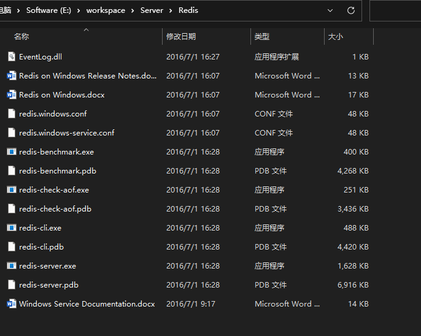 

3. 双击redis-server.exe启动服务

   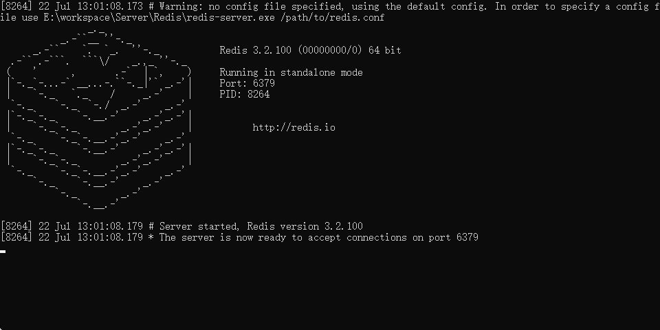 

4. 双击redis-cli.exe启动客户端来连接服务端

   

5. 输入ping命令测试连接，返回PONG表示连接成功

    


#### 2.1.5 linux安装

##### 1. 安装

1. 执行sudo apt-get update更新软件包

   ```
   sudo apt-get update
   ```

   

2. 执行sudo apt-get install redis-server ，输入y 确认安装并使用空间

   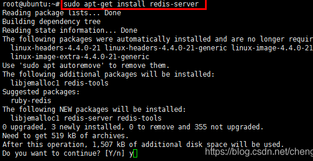 

3. 执行完成后，查看redis服务的状态，执行ps -ef|grep redis查看 或者 service redis status 命令查看

   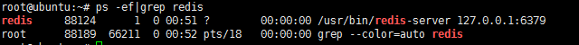 

   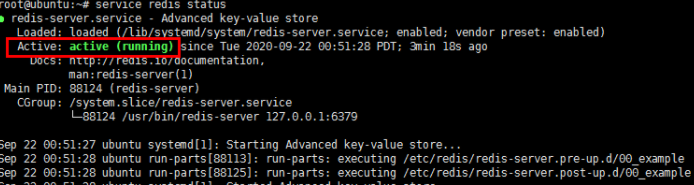 

   状态为running，说明安装完成后系统自动启动了服务 。

4. 执行命令whereis redis 可以查看配置文件所在位置

    

   

##### 2. 配置

1. 设置redis端口，默认端口是6379，可以根据自己的需要，找到/et/redis/redis.conf文件, 修改port

    

2. 设置密码，配置文件中添加 requirepass 123456

   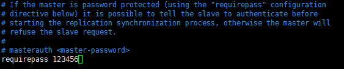 

3. 其他电脑连接redis的时候发现连接失败，通过命令netstat -talnp查看，发现6379只允许本地访问了

    

   所以要远程连接redis，需要注释掉redis配置中的 #bind 127.0.0.1

    

4. 重启redis，命令service redis restart。在查看端口情况如下

    


##### 1. 操作

1. 连接redis

   * 本地连接

      

   * 远程连接（windows）

     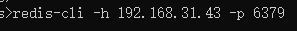 

2. 关闭服务

    


#### 2.1.6 测试性能

redis-benchmark压力测试工具！

官方自带性能测试工具

|      |                           |                                            |           |
| :--- | :------------------------ | :----------------------------------------- | :-------- |
| 序号 | 选项                      | 描述                                       | 默认值    |
| 1    | **-h**                    | 指定服务器主机名                           | 127.0.0.1 |
| 2    | **-p**                    | 指定服务器端口                             | 6379      |
| 3    | **-s**                    | 指定服务器 socket                          |           |
| 4    | **-c**                    | 指定并发连接数                             | 50        |
| 5    | **-n**                    | 指定请求数                                 | 10000     |
| 6    | **-d**                    | 以字节的形式指定 SET/GET 值的数据大小      | 2         |
| 7    | **-k**                    | 1=keep alive 0=reconnect                   | 1         |
| 8    | **-r**                    | SET/GET/INCR 使用随机 key, SADD 使用随机值 |           |
| 9    | **-P**                    | 通过管道传输 <numreq> 请求                 | 1         |
| 10   | **-q**                    | 强制退出 redis。仅显示 query/sec 值        |           |
| 11   | **--csv**                 | 以 CSV 格式输出                            |           |
| 12   | ***-l\*（L 的小写字母）** | 生成循环，永久执行测试                     |           |
| 13   | **-t**                    | 仅运行以逗号分隔的测试命令列表。           |           |
| 14   | ***-I\*（i 的大写字母）** | Idle 模式。仅打开 N 个 idle 连接并等待。   |           |


测试

```bash
# 测试： 100个并发连接，10000个请求
redis-benchmark -h localhost -p 6379 -c 100 -n 10000
```

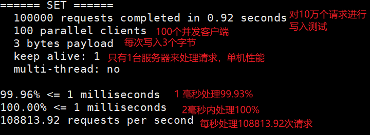 

#### 2.1.7 基础知识

redis默认有16个数据库

 

默认使用的是第0个数据库

##### 1. 切换数据库

```bash
192.168.31.43:6379> select 3 #切换数据库
OK
192.168.31.43:6379[3]>
```


##### 2. 查看数据库大小

```bash
192.168.31.43:6379[3]> DBSIZE #查看数据库大小
(integer) 0
```


##### 3. 查看所有的key

```bash
192.168.31.43:6379[3]> keys * #查看所有的key
1) "name"
```


##### 4. 清空当前数据库

```bash
192.168.31.43:6379[3]> flushdb #清空当前数据库
OK
192.168.31.43:6379[3]> keys *
(empty list or set)
```


##### 5. 清空所有数据库

```bash
192.168.31.43:6379[3]> FLUSHALL #清空所有数据库
OK
192.168.31.43:6379[3]> keys *
(empty list or set)
```


##### 6. 判断key是否存在

```bash
192.168.31.43:6379[3]> EXISTS name #判断key是否存在
(integer) 1
```


##### 7. 设置过期时间

```bash
192.168.31.43:6379[3]> set name zs
OK
192.168.31.43:6379[3]> EXPIRE name 10 #设置过期时间10秒
(integer) 1
192.168.31.43:6379[3]> keys *
1) "name"
192.168.31.43:6379[3]> keys *
(empty list or set)
```


##### 8. 查看过期时间

```bash
192.168.31.43:6379[3]> set name zs
OK
192.168.31.43:6379[3]> ttl name #查看过期时间
(integer) -1 #-1表示没有设置过期时间
192.168.31.43:6379[3]> EXPIRE name 10
(integer) 1
192.168.31.43:6379[3]> ttl name
(integer) 8
192.168.31.43:6379[3]> ttl name
(integer) 3
192.168.31.43:6379[3]> ttl name
(integer) 0
192.168.31.43:6379[3]> ttl name
(integer) -2 #-2表示过期了
192.168.31.43:6379[3]> keys *
(empty list or set)
```


##### 6. reids是单线程的

Redis是很快的，官方表示，Resid是基于内存操作的，cpu不是Redis的性能瓶颈，Redis的瓶颈是根据机器内存和网络带宽。

Redis是c语言来写的，官方提供的数据是 100000+的QPS，完全不比同样使用Key-value的Memecahe差！

Redis为什么单线程还这么快?

1. 误区一： 高性能的服务器一定是多线程的
2. 误区二：多线程一定比单线程快

核心：redis是将数据全部放在内存中，所以说单线程去操作效率就是最高的，多线程（cpu上下文会切换：耗时操作！！！），对于内存系统来说，如果没有上下文切换效率是最高的。多次读写都是在一个cpu上，在内存情况下，这个就是最佳方案。


## 3. 五大数据类型

> Redis 是一个开源（BSD许可）的，内存中的数据结构存储系统，它可以用作数据库、缓存和消息中间件。 它支持多种类型的数据结构，如 字符串（strings）， 散列（hashes）， 列表（lists）， 集合（sets）， 有序集合（sorted sets） 与范围查询， bitmaps， hyperloglogs 和 地理空间（geospatial） 索引半径查询。 Redis 内置了 复制（replication），LUA脚本（Lua scripting）， LRU驱动事件（LRU eviction），事务（transactions） 和不同级别的 磁盘持久化（persistence）， 并通过 Redis哨兵（Sentinel）和自动 分区（Cluster）提供高可用性（high availability）。


### 3.1 Redis-key

```bash
192.168.31.43:6379[3]> keys * #查看所有key
(empty list or set)
192.168.31.43:6379[3]> set name zs #设置一对键值对
OK
192.168.31.43:6379[3]> EXISTS name #判断key是否存在
(integer) 1
192.168.31.43:6379[3]> move name 2 #移除一个key，到另一个数据库
(integer) 1
192.168.31.43:6379[3]> SET name zs
OK
192.168.31.43:6379[3]> EXPIRE name 10 #设置key的过期时间，单位秒
(integer) 1
192.168.31.43:6379[3]> ttl name #查看key的过期时间
(integer) 7
192.168.31.43:6379[3]> ttl name
(integer) 4
192.168.31.43:6379[3]> ttl name
(integer) 2
192.168.31.43:6379[3]> ttl name
(integer) -2 #-1表示没有设置过期时间，-2表示已经过期了
192.168.31.43:6379[3]> set name zs
OK
192.168.31.43:6379[3]> type name #查看key对应value的数据类型
string
```

更多命令：[Redis命令中心](http://redis.cn/commands.html)


### 3.2 String

```bash
#####################一般场景########################
192.168.31.43:6379[2]> keys * #查看所有key
(empty list or set)
192.168.31.43:6379[2]> SET k1 v1 #设置一个key
OK
192.168.31.43:6379[2]> keys *
1) "k1"
192.168.31.43:6379[2]> APPEND k1 hello #给key的值后面追加一个字符串
(integer) 7
192.168.31.43:6379[2]> get k1 #得到一个key
"v1hello"
192.168.31.43:6379[2]> STRLEN k1 #查看一个key的长度
(integer) 7
#####################网页浏览量统计#####################
192.168.31.43:6379[2]> set views 0
OK
192.168.31.43:6379[2]> get views
"0"
192.168.31.43:6379[2]> incr views #自增1，浏览量+1
(integer) 1
192.168.31.43:6379[2]> incr views
(integer) 2
192.168.31.43:6379[2]> incrby views 10  #根据步长自增
(integer) 12
192.168.31.43:6379[2]> get views
"12"
192.168.31.43:6379[2]> decr views #自减1
(integer) 11
192.168.31.43:6379[2]> decrby views 10 #根据步长自减
(integer) 1
#####################字符串范围##########################
######获取字符串范围内容
192.168.31.43:6379[2]> set say helloworld
OK
192.168.31.43:6379[2]> get say
"helloworld"
192.168.31.43:6379[2]> GETRANGE say 0 3 #下标查看0~3之间字符串
"hell"
192.168.31.43:6379[2]> GETRANGE say 0 -1 #-1表示查看到结尾
"helloworld"
######替换字符串范围内容
192.168.31.43:6379[2]> SETRANGE say 2 123 #从下标为2开始替换，替换内容为123
(integer) 10
192.168.31.43:6379[2]> get say
"he123world"
#######################################################
######setex (set with expire) 设置过期时间
######setnx (set if on exit) 如果当前key不存在才设置
92.168.31.43:6379[2]> setex name 10 zs #设置key的过期时间
OK
192.168.31.43:6379[2]> ttl name
(integer) 7
192.168.31.43:6379[2]> ttl name
(integer) 2
192.168.31.43:6379[2]> ttl name
(integer) -2
192.168.31.43:6379[2]> setnx mykey redis #如果没有mykey才创建key
(integer) 1
192.168.31.43:6379[2]> get  mykey
"redis"
192.168.31.43:6379[2]> setnx mykey mysql
(integer) 0
192.168.31.43:6379[2]> get mykey
"redis"
#######################################################
192.168.31.43:6379[2]> mset k1 v1 k2 v2 k3 v3 #同时设置多个key
OK
192.168.31.43:6379[2]> keys *
1) "k3"
2) "k2"
3) "k1"
192.168.31.43:6379[2]> mget k1 k2 k3 #同时获取多个值
1) "v1"
2) "v2"
3) "v3"
192.168.31.43:6379[2]> msetnx k1 v2 k4 v4 #如果不存在才创建，有一个存在所有都无法创建
(integer) 0
192.168.31.43:6379[2]> keys *
1) "k3"
2) "k2"
3) "k1"
######################################################
######存储对象
127.0.0.1:6379> set user:1 {name:zs,age:18,password:123}  #设置一个user:1对象，值为json字符保存的一个对象
OK
127.0.0.1:6379> get user:1
"{name:zs,age:18,password:123}"
######这里的key是一个巧妙的设计： user:{id}:{filed}
192.168.31.43:6379> mset user:1:name ls user:1:age 18 user:1:password 123
OK
192.168.31.43:6379> mget user:1:name user:1:age user:1:password
1) "ls"
2) "18"
3) "123"
######################################################
#####先得到值，然后设置新的值
192.168.31.43:6379> set name zs
OK
192.168.31.43:6379> getset name ls #先得到值（不存在就返回nil），然后设置新的值
"zs"
192.168.31.43:6379> get name
"ls"


```


String类似的使用场景：value除了是字符串还可以是数字！

* 计数器
* 统计多单位的数量
* 粉丝数
* 对象缓存


### 3.3 List

> 所有的List操作都是L开头的

```bash
#######################################################
192.168.31.43:6379> LPUSH list1 1 #从列表的头部插入数据
(integer) 1
192.168.31.43:6379> LPUSH list1 2
(integer) 2
192.168.31.43:6379> LPUSH list1 3
(integer) 3
192.168.31.43:6379> LRANGE list1 0 -1 #通过区间获取list的值
1) "3"
2) "2"
3) "1"
192.168.31.43:6379> RPUSH list1 4 #从列表的尾部插入数据
(integer) 4
192.168.31.43:6379> LRANGE list1 0 -1
1) "3"
2) "2"
3) "1"
4) "4"
#######################################################
192.168.31.43:6379> LRANGE list1 0 -1
1) "3"
2) "2"
3) "1"
4) "4"
192.168.31.43:6379> LPOP list1 #移除列表的第一个数据
"3"
192.168.31.43:6379> LRANGE list1 0 -1
1) "2"
2) "1"
3) "4"
192.168.31.43:6379> RPOP  list1 #移除列表的最后一个数据
"4"
192.168.31.43:6379> LRANGE list1 0 -1 
1) "2"
2) "1"
#######################################################
192.168.31.43:6379> LINDEX list1 0 #根据数组下标获取值
"2"
192.168.31.43:6379> LINDEX list1 1
"1"
#######################################################
127.0.0.1:6379> LPUSH list1 1
(integer) 1
127.0.0.1:6379> LPUSH list1 2
(integer) 2
127.0.0.1:6379> LPUSH list1 3
(integer) 3
127.0.0.1:6379> LRANGE list1 0 -1
1) "3"
2) "2"
3) "1"
127.0.0.1:6379> LLEN list1 #获取列表长度
(integer) 3
#######################################################
######移除指定值
127.0.0.1:6379> LRANGE list1 0 -1
1) "4"
2) "3"
3) "2"
4) "1"
127.0.0.1:6379> LREM list1 2 4 #移除两个4，如果有多个，先移除靠近头部的
(integer) 1
127.0.0.1:6379> LRANGE list1 0 -1
1) "3"
2) "2"
3) "1"
#######################################################
127.0.0.1:6379> LRANGE list1 0 -1
1) "4"
2) "3"
3) "2"
4) "1"
127.0.0.1:6379> LTRIM list1 2 3 #截取下标2到3之间的值
OK
127.0.0.1:6379> LRANGE list1 0 -1
1) "2"
2) "1"
######################################################
127.0.0.1:6379> LPUSH list1 hello1
(integer) 1
127.0.0.1:6379> LPUSH list1 hello2
(integer) 2
127.0.0.1:6379> LPUSH list1 hell3
(integer) 3
127.0.0.1:6379> LPUSH list2 world1
(integer) 1
127.0.0.1:6379> RPOPLPUSH list1 list2 #移除列表的最后一个值，加到其他列表的头部
"hello1"
127.0.0.1:6379> LRANGE list1 0 -1
1) "hell3"
2) "hello2"
127.0.0.1:6379> LRANGE list2 0 -1
1) "hello1"
2) "world1"
######################################################
127.0.0.1:6379> EXISTS list #判断key是否存在
(integer) 0
127.0.0.1:6379> LSET list 0 hello #修改列表指定下标的值，列表不存在，返回：(error) ERR no such key
(error) ERR no such key
127.0.0.1:6379> LPUSH list hello
(integer) 1
127.0.0.1:6379> LSET list 0 world  #修改列表指定下标的值
OK
127.0.0.1:6379> LRANGE list 0 -1
1) "world"
127.0.0.1:6379> LSET list 1 world  #修改列表指定下标的值，指定下标没有值，返回：(error) ERR index out of range
(error) ERR index out of range
127.0.0.1:6379> EXISTS list
(integer) 1
######################################################
127.0.0.1:6379> LRANGE list 0 -1
1) "world"
127.0.0.1:6379> LINSERT list before world before #在list指定value的前面插入值
(integer) 2
127.0.0.1:6379> LRANGE list 0 -1
1) "before"
2) "world"
127.0.0.1:6379> LINSERT list after world after #在list指定value的后面插入值
(integer) 3
127.0.0.1:6379> LRANGE list 0 -1
1) "before"
2) "world"
3) "after"
######有多个相同value时
127.0.0.1:6379> LRANGE list 0 -1
1) "before"
2) "world"
3) "world"
4) "after"
127.0.0.1:6379> LINSERT list after world hello #list指定value的值有多个，会给靠近头部的value进行操作
(integer) 5
127.0.0.1:6379> LRANGE list 0 -1
1) "before"
2) "world"
3) "hello"
4) "world"
5) "after"


```


**小结：**

* list实际上是一个链表，before node after， left，right都可以插入
* 如果Key不存在，创建新的列表
* 如果key存在，添加内容
* 如果移除了所有的值，空链表，也代表不存在
* 在两边插入或者改动，效率最高，中间元素，相对来说效率会低一些
* 消息队列（LPUSH RPOP） 栈（LPUSH LPOP）


### 3.4 Set

> set集合无序不重复

```bash
#######################################################
127.0.0.1:6379> sadd s1 hello #往set中添加元素，如果没有该set就创建新的set
(integer) 1
127.0.0.1:6379> sadd s1 world
(integer) 1
127.0.0.1:6379> SMEMBERS s1 #查看set中的元素
1) "hello"
2) "world"
127.0.0.1:6379> sadd s1 hello #set中无法添加相同元素，添加失败返回0
(integer) 0
127.0.0.1:6379> SMEMBERS s1
1) "hello"
2) "world"
127.0.0.1:6379> SISMEMBER s1 hello #判断元素是否在set中
(integer) 1 #存在返回1
127.0.0.1:6379> SISMEMBER s1 redis
(integer) 0 #不存在返回1
127.0.0.1:6379> scard s1
(integer) 2
127.0.0.1:6379> scard s1 #查看set中元素的个数
(integer) 2
#######################################################
127.0.0.1:6379> SMEMBERS s1
1) "hello"
2) "mysql"
3) "world"
4) "redis"
127.0.0.1:6379> SREM s1 redis #移除set中指定元素
(integer) 1
127.0.0.1:6379> SMEMBERS s1
1) "hello"
2) "mysql"
3) "world"
#######################################################
127.0.0.1:6379> SRANDMEMBER s1 #随机从set中取出一个元素
"world"
127.0.0.1:6379> SRANDMEMBER s1
"world"
127.0.0.1:6379> SRANDMEMBER s1
"mysql"
127.0.0.1:6379> SRANDMEMBER s1 2 #随机从set中取出多个元素
1) "hello"
2) "mysql"
127.0.0.1:6379> SRANDMEMBER s1 2
1) "hello"
2) "world"
127.0.0.1:6379> SRANDMEMBER s1 2
1) "hello"
2) "world"
127.0.0.1:6379> SRANDMEMBER s1 2
1) "hello"
2) "world"
127.0.0.1:6379> SRANDMEMBER s1 2
1) "hello"
2) "mysql"
#######################################################
127.0.0.1:6379> SMEMBERS s1
1) "hello"
2) "mysql"
3) "world"
127.0.0.1:6379> SPOP s1 #随机删除set中一个元素
"world"
127.0.0.1:6379> SPOP s1
"mysql"
127.0.0.1:6379> SPOP s1
"hello"
127.0.0.1:6379> SPOP s2 2  #随机删除set中多个个元素
1) "1"
2) "3"
#######################################################
127.0.0.1:6379> SMEMBERS s1
1) "1"
2) "2"
3) "3"
127.0.0.1:6379> SMEMBERS s2
1) "4"
2) "5"
3) "6"
127.0.0.1:6379> SMOVE s1 s2 1 #将集合中指定元素移动到另一个集合中
(integer) 1
127.0.0.1:6379> SMEMBERS s1
1) "2"
2) "3"
127.0.0.1:6379> SMEMBERS s2
1) "1"
2) "4"
3) "5"
4) "6"
#######################################################
127.0.0.1:6379> SMEMBERS s1
1) "c"
2) "b"
3) "a"
127.0.0.1:6379> SMEMBERS s2
1) "c"
2) "d"
127.0.0.1:6379> SDIFF s1 s2 #查看s1中与s2的差集
1) "a"
2) "b"
127.0.0.1:6379> SINTER s1 s2 #查看s1与s2的交集
1) "c"
127.0.0.1:6379> SUNION s1 s2 #查看s1与s2的并集
1) "a"
2) "b"
3) "c"
4) "d"
```


### 3.5 Hash

> Map集合，key-map，这时候值是一个map

```bash
#######################################################
127.0.0.1:6379> hset h1 name lyx age 18 #设置一个hash
(integer) 2
127.0.0.1:6379> hget h1 name #得到hash的map中指定key的值
"lyx"
127.0.0.1:6379> hget h1 age
"18"
127.0.0.1:6379> hmset h2 name xxx age  20 
OK
127.0.0.1:6379> hmget h2 name age #得到hash的map中指定多个key的值
1) "xxx"
2) "20"
127.0.0.1:6379> hgetall h2 #得到hash中所有的元素
1) "name"
2) "xxx"
3) "age"
4) "20"
#######################################################
127.0.0.1:6379> hgetall h2
1) "name"
2) "xxx"
3) "age"
4) "20"
127.0.0.1:6379> hdel h2 name #删除hash的map中指定的键值对
(integer) 1
127.0.0.1:6379> hgetall h2
1) "age"
2) "20"
#######################################################
127.0.0.1:6379> HGETALL h1
1) "name"
2) "lyx"
3) "age"
4) "18"
127.0.0.1:6379> HLEN h1 #查看hash中的map中有多少个键值对
(integer) 2
#######################################################
127.0.0.1:6379> HEXISTS h1 name 判断hash中指定字段是否存在
(integer) 1
127.0.0.1:6379> HEXISTS h1 address
(integer) 0
#######################################################
127.0.0.1:6379> hkeys h1 #获取hash中所有的字段
1) "name"
2) "age"
127.0.0.1:6379> HVALS h1 #获取hash中所有的值
1) "lyx"
2) "18"
#######################################################
127.0.0.1:6379> hset h2 views 0
(integer) 1
127.0.0.1:6379> HINCRBY h2 views 1 #指定字段的值自增1
(integer) 1
127.0.0.1:6379> HINCRBY h2 views -1 #指定字段的值自减1
(integer) 0
127.0.0.1:6379> hsetnx h2 field1 hello #指定字段不存在才创建
(integer) 1
127.0.0.1:6379> hsetnx h2 field1 world
(integer) 0
```


### 3.6 Zset

> 在set基础上增加了一个值，set k1 v1(set)  zset k1 score v1(zset)

```bash
#######################################################
127.0.0.1:6379> zadd k1 1 one #往zset中添加一个值
(integer) 1
127.0.0.1:6379> zadd k1 2 tow 3 three #往zset中添加多个值
(integer) 2
127.0.0.1:6379> ZRANGE k1 0 -1 #查看zset中的值
1) "one"
2) "tow"
3) "three"
#######################################################
127.0.0.1:6379> ZADD age 18 zs 19 ls 20 ww
(integer) 3
127.0.0.1:6379> ZRANGE age 0 -1 #正序显示所有元素
1) "zs"
2) "ls"
3) "ww"
127.0.0.1:6379> ZREVRANGE age 0 -1 #逆序显示所有元素
1) "ww"
2) "ls"
3) "zs"
127.0.0.1:6379> ZRANGEBYSCORE age -inf +inf #按负无穷到正无穷排序
1) "zs"
2) "ls"
3) "ww"
127.0.0.1:6379> ZRANGEBYSCORE age -inf +inf withscores #按负无穷到正无穷排序，带上source
1) "zs"
2) "18"
3) "ls"
4) "19"
5) "ww"
6) "20"
127.0.0.1:6379> ZRANGEBYSCORE age (18 20 withscores #在指定区间排序，（表示不包含
1) "ls"
2) "19"
3) "ww"
4) "20"
#######################################################
127.0.0.1:6379> zadd age 18 zs 19 ls 20 ww
(integer) 3
127.0.0.1:6379> ZREM age zs #删除zset指定元素
(integer) 1
127.0.0.1:6379> ZRANGE age 0 -1
1) "ls"
2) "ww"
127.0.0.1:6379> ZCARD age #获取zset中元素个数
(integer) 2
#######################################################
127.0.0.1:6379> zadd age 18 zs 19 ls 20 ww
(integer) 3
127.0.0.1:6379> ZRANGE age 0 -1
1) "zs"
2) "ls"
3) "ww"
127.0.0.1:6379> ZCOUNT age 18 20 #查看区间中元素个数
(integer) 3
127.0.0.1:6379> ZCOUNT age 18 (20 #(表示不包含
(integer) 2
```


## 4. 三种特殊数据类型

### 4.1 geospatial 地理位置

> redis的Geo在Redis3.2版本就推出了，这个功能可以推算地理位置的信息，两地之间的距离，方圆几里的人！
>
> 只有六个命令：
>
> * GEOADD
> * GEODIST
> * GEOHASH
> * GEOPOS
> * GEORADIUS
> * GEORADIUSBYMEMBER

在线经纬度查询工具：[城市经纬度查询](http://www.jsons.cn/lngcode/)


#### 4.1.1 GEOADD

> 添加地理位置，将指定的地理空间项目（经度，纬度，名称）添加到指定的键
>
> * 有效经度从-180到180度。
>
> - 有效纬度从 -85.05112878 到 85.05112878 度。

```bash
#规则：南北两极无法添加，我们一般会下载城市数据，通过java程序直接导入
127.0.0.1:6379> clear
127.0.0.1:6379> GEOADD china:city 116.4 39.9 beijing # 添加一个城市的经纬度
(integer) 1
127.0.0.1:6379> GEOADD china:city 112.4 31.2 shanghai 113.2 23.1 guangzhou 114.0 22.4 shenzhen #添加多个城市的经纬度
(integer) 3
```


#### 4.1.2 GEOPOS

> 获取指定城市的经度纬度

```bash
127.0.0.1:6379> GEOPOS china:city beijing #获取一个指定城市的经度纬度
1) 1) "116.39999896287918091"
   2) "39.90000009167092543"
127.0.0.1:6379> GEOPOS china:city shanghai beijing #获取多个指定城市的经度纬度
1) 1) "112.39999920129776001"
   2) "31.20000061483705878"
2) 1) "116.39999896287918091"
   2) "39.90000009167092543"

```


#### 4.1.3 GEODIST

> 返回排序集合表示的地理空间索引中两个成员之间的距离。
>
> 给定一个表示地理空间索引的有序集合，该集合使用 GEOADD 命令填充，该命令返回指定单元中两个指定成员之间的距离。
>
> 如果一个或两个成员都缺失，则该命令返回 NULL 。
>
> 该单位必须是以下之一，并且默认为米：
>
> - **m** 为米。
>
> - **km** 为千米。
>
> - **mi** 为英里。
>
> - **ft** 为英尺。

```bash
127.0.0.1:6379> GEODIST china:city beijing shanghai #查看北京到上海之间的直线距离
"1032838.3305"
127.0.0.1:6379> GEODIST china:city beijing shenzhen  #查看北京到深圳之间的直线距离
"1959602.6822"
127.0.0.1:6379> GEODIST china:city beijing shenzhen km #查看北京到深圳之间的直线距离，单位km
"1959.6027"
127.0.0.1:6379> GEODIST china:city beijing shenzhen mi #查看北京到深圳之间的直线距离，单位英里
"1217.6437"
127.0.0.1:6379> GEODIST china:city beijing shenzhen ft #查看北京到深圳之间的直线距离，单位英尺
"6429142.6581"
```


#### 4.1.4 GEORADIUS

> **时间复杂度：** O（N + log（M））其中N是由中心和半径界定的圆形区域的边界框内的元素的数量，M 是索引内的项目的数量。

半径以下列单位之一指定：

- **m** 为米。

- **km** 为千米。

- **mi** 为英里。

- **ft** 为英尺。

该命令有选择地使用以下选项返回附加信息：

- `WITHDIST`：还要返回指定中心返回物品的距离。距离以与指定为命令的半径参数的单位相同的单位返回。

- `WITHCOORD`：还返回匹配项目的经度，纬度坐标。

- `WITHHASH`：还以52位无符号整数的形式返回项目的原始 geohash 编码的有序集合分数。这只对低级别的黑客或调试很有用，对于普通用户来说这很有趣。

该命令的默认设置是返回未排序的项目。使用以下两个选项可以调用两种不同的排序方法：

- `ASC`：将返回的项目从最近的到最远的，相对于中心排序。

- `DESC`：从最远到最近的相对于中心的返回项目排序。

默认情况下会返回所有匹配的项目。通过使用 **COUNT** **`<count>`**选项，可以将结果限制为前 N 个匹配项。但是请注意，在内部，命令需要执行与匹配指定区域的项目数量成比例的努力，因此，`COUNT`即使只返回几个结果，使用非常小的选项查询非常大的区域也可能会很慢。另一方面，`COUNT`如果通常只使用第一个结果，则可以成为减少带宽使用的非常有效的方法。

```bash
127.0.0.1:6379> GEORADIUS china:city 110 30 1000 km #查看经度110纬度30半径1000km的所有城市
1) "shanghai"
2) "shenzhen"
3) "guangzhou"
127.0.0.1:6379> GEORADIUS china:city 110 30 500 km
1) "shanghai"
127.0.0.1:6379> GEORADIUS china:city 110 30 1000 km withdist #查看经度110纬度30半径1000km的所有城市，带上距离
1) 1) "shanghai"
   2) "265.7114"
2) 1) "shenzhen"
   2) "934.6156"
3) 1) "guangzhou"
   2) "830.7525"
127.0.0.1:6379> GEORADIUS china:city 110 30 1000 km withdist withcoord #查看经度110纬度30半径1000km的所有城市，带上距离和经纬度
1) 1) "shanghai"
   2) "265.7114"
   3) 1) "112.39999920129776001"
      2) "31.20000061483705878"
2) 1) "shenzhen"
   2) "934.6156"
   3) 1) "114.00000125169754028"
      2) "22.39999878410379353"
3) 1) "guangzhou"
   2) "830.7525"
   3) 1) "113.20000022649765015"
      2) "23.10000005307264104"
127.0.0.1:6379> GEORADIUS china:city 110 30 1000 km withdist withcoord asc #升序显示
1) 1) "shanghai"
   2) "265.7114"
   3) 1) "112.39999920129776001"
      2) "31.20000061483705878"
2) 1) "guangzhou"
   2) "830.7525"
   3) 1) "113.20000022649765015"
      2) "23.10000005307264104"
3) 1) "shenzhen"
   2) "934.6156"
   3) 1) "114.00000125169754028"
      2) "22.39999878410379353"
127.0.0.1:6379> GEORADIUS china:city 110 30 1000 km withdist withcoord desc #降序排列
1) 1) "shenzhen"
   2) "934.6156"
   3) 1) "114.00000125169754028"
      2) "22.39999878410379353"
2) 1) "guangzhou"
   2) "830.7525"
   3) 1) "113.20000022649765015"
      2) "23.10000005307264104"
3) 1) "shanghai"
   2) "265.7114"
   3) 1) "112.39999920129776001"
      2) "31.20000061483705878"
127.0.0.1:6379> GEORADIUS china:city 110 30 1000 km withdist withcoord desc count 2 #显示最近的两条数据
1) 1) "shenzhen"
   2) "934.6156"
   3) 1) "114.00000125169754028"
      2) "22.39999878410379353"
2) 1) "guangzhou"
   2) "830.7525"
   3) 1) "113.20000022649765015"
      2) "23.10000005307264104"

```


#### 4.1.5 GEORADIUSBYMEMBER

> 查询存储内的坐标半径内的坐标

```bash
127.0.0.1:6379> GEORADIUSBYMEMBER china:city guangzhou 500 km #查询广州半径500km内的城市
1) "shenzhen"
2) "guangzhou"
127.0.0.1:6379> GEORADIUSBYMEMBER china:city guangzhou 1000 km #查询广州半径1000km内的城市
1) "shenzhen"
2) "guangzhou"
3) "shanghai"

```


#### 4.1.6 GEOHASH

> 该命令返回11个字符的 Geohash 字符串

```bash
127.0.0.1:6379> GEOHASH china:city beijing shanghai #返回11个字符的 Geohash 字符串
1) "wx4fbxxfke0"
2) "wmxcmxz1jv0"
```


#### 4.1.7 小技巧

> GEO底层实现的原理其实是zset，可以用zset命令来操作GEO数据！

```bash
127.0.0.1:6379> ZRANGE china:city 0 -1
1) "shanghai"
2) "shenzhen"
3) "guangzhou"
4) "beijing"
127.0.0.1:6379> ZREM china:city guangzhou
(integer) 1
127.0.0.1:6379> ZRANGE china:city 0 -1
1) "shanghai"
2) "shenzhen"
3) "beijing"

```


### 4.2 Hyperloglog

#### 4.2.1 什么是基数

数据集：

* A: {1, 3, 5, 7, 5}
* B: {1, 3, 5, 7}

基数：（不重复的元素） = 5，可以接受误差！

#### 4.2.2 简介

> redis 2.8.9版本就更新了Hyperloglog数据结构
>
> Redis Hyperloglog 基数统计的算法！
>
> 优点：
>
> * 占用的内存是固定的，2^64不同的元素，只需要12kb内存，如果从内存角度来说Hyperloglog是首选！
>
> * 错误率仅0.18%

应用场景：网页的UV（一个人访问同一个网站多次，但还是算同一个人）

传统方式：set保存用户的id，然后就可统计set中元素数量作为标准判断

如果是这个方式，需要保存大量用户的id，就会比较麻烦！魔门的目的是为了计数，而不是为了存储id！

```bash
127.0.0.1:6379> PFADD p1 a b c d d g g r t u #往p1中添加元素
(integer) 1
127.0.0.1:6379> PFCOUNT p1 #查看p1中的元素
(integer) 7
127.0.0.1:6379> PFADD p2 a b c d g t u v 
(integer) 1
127.0.0.1:6379> PFMERGE p3 p1 p2 #合并p1和p2中的元素到p3中，并集
OK
127.0.0.1:6379> PFCOUNT p3
(integer) 8

```

==允许容错才可以使用Hyperloglog==


### 4.3 Bitmaps

> 位存储

使用场景：统计用户信息（活跃，不活跃）（登录，未登录）（打卡，未打卡）

Bitmaps位图，数据结构！都是操作二进制来进行记录，就只有0和1两个状态。

```bash
#模拟一周的打卡
127.0.0.1:6379> setbit login 1 1
(integer) 0
127.0.0.1:6379> setbit login 2 1
(integer) 0
127.0.0.1:6379> setbit login 3 0
(integer) 0
127.0.0.1:6379> setbit login 4 0
(integer) 0
127.0.0.1:6379> setbit login 5 1
(integer) 0
127.0.0.1:6379> setbit login 6 1
(integer) 0
127.0.0.1:6379> setbit login 7 0
(integer) 0
#查看某一天是否打卡
127.0.0.1:6379> getbit login 1
(integer) 1
127.0.0.1:6379> getbit login 4
(integer) 0
#统计打卡天数
127.0.0.1:6379> BITCOUNT login
(integer) 4

```


## 5. 事务


Redis事务的本质：一组命令的集合！一个事务中的所有命令都会被序列化，在事务执行的过程中，会安装顺序执行！一次性，顺序性，排他性！执行一系列命令！

```
-----队列 set set set 执行---------
```

==Redis事务没有隔离级别的概念！==

所有命令在事务中没有直接被执行！只有发起执行命令的时候才会执行！

==Redis单条命令是有原子性的，但事务不保证原子性==


### 5.1 开启事务

redis的事务：

* 开启事务(multi)
* 命令入队(...)
* 执行事务 (exec)

```bash
127.0.0.1:6379> multi #开启事务
OK
127.0.0.1:6379> set k1 v1 #命令入队
QUEUED
127.0.0.1:6379> set k2 v2 #命令入队
QUEUED
127.0.0.1:6379> get k1 #命令入队
QUEUED
127.0.0.1:6379> set k3 v3 #命令入队
QUEUED
127.0.0.1:6379> exec #执行事务
1) OK
2) OK
3) "v1"
4) OK

```


### 5.2 放弃事务

> 放弃事务，还在队列中的命令不会继续执行！

```bash
127.0.0.1:6379> MULTI
OK
127.0.0.1:6379> set k1 v1
QUEUED
127.0.0.1:6379> set k2 v2
QUEUED
127.0.0.1:6379> DISCARD #取消事务
OK
127.0.0.1:6379> get k1 
(nil) #队列中的命令没有被执行
```


### 5.3 异常

#### 5.3.1 编译型异常

> 事务中所有的命令都不会被执行

```bash
127.0.0.1:6379> MULTI
OK
127.0.0.1:6379> set k1 v1
QUEUED
127.0.0.1:6379> set k1 #模拟错误
(error) ERR wrong number of arguments for 'set' command
127.0.0.1:6379> set k2 vc
QUEUED
127.0.0.1:6379> EXEC
(error) EXECABORT Transaction discarded because of previous errors.
127.0.0.1:6379> get k1 
(nil) #正常命令并没有被执行
```


#### 5.3.2 运行时异常

> 有语法错误的命令不会被执行，正常命令都会被执行，错误命令抛出异常

```bash
127.0.0.1:6379> MULTI
OK
127.0.0.1:6379> set k1 a
QUEUED
127.0.0.1:6379> INCR k1  #模拟错误
QUEUED
127.0.0.1:6379> set k2 b
QUEUED
127.0.0.1:6379> EXEC
1) OK #执行成功
2) (error) ERR value is not an integer or out of range #执行失败
3) OK #执行成功

```


### 5.4 监控

#### 5.4.1 悲观锁

> 很悲观，认为什么时候都会出问题，无论做什么都会加锁，影响性能。

#### 5.4.2 乐观锁

> 很悲观，认为什么时候都不会出问题，所有不会上锁。更新的时候去判断下，在此期间是否有人修改过这个数据！
>
> * 获取version
> * 更新的时候比较version

正常执行成功！

```bash
127.0.0.1:6379> set money 100
OK
127.0.0.1:6379> set out 0
OK
127.0.0.1:6379> watch money #监视money
OK 
127.0.0.1:6379> MULTI #事务正常执行结束
OK
127.0.0.1:6379> DECRBY money 20
QUEUED
127.0.0.1:6379> INCRBY out 20
QUEUED
127.0.0.1:6379> EXEC
1) (integer) 80
2) (integer) 20

```

测试多线程修改值，使用watch可以当作redis的乐观锁操作！

```bash
127.0.0.1:6379> WATCH money
OK
127.0.0.1:6379> MULTI
OK
127.0.0.1:6379> DECRBY money 20
QUEUED
127.0.0.1:6379> INCRBY out 20
QUEUED
127.0.0.1:6379> EXEC #在给money上锁后执行前，money被其他线程修改了，当前线程就会执行失败！
(nil)
127.0.0.1:6379> UNWATCH #解锁
OK
```


## 6. Jedis

> 使用java来操作redis
>
> jedis时redis官方推荐的java连接开发工具！使用java操作Redis的中间件！如果你要使用java操作redis，那么一定要对jedis十分熟悉！

### 6.1 快速体验

1. 导如jedis依赖

   ```xml
   <dependency>
       <groupId>redis.clients</groupId>
       <artifactId>jedis</artifactId>
       <version>3.3.0</version>
   </dependency>
   ```

   

2. 测试连接

   ```java
   public static void main( String[] args )
   {
       Jedis jedis = new Jedis("192.168.31.43", 6379);
       jedis.auth("root"); //登录密码
       String ping = jedis.ping();
       System.out.println("ping: "+ping); //out: ping: PONG
   }
   ```

   

> 所有方法与命令操作一样。

```java
public static void main( String[] args ) throws InterruptedException {
    Jedis jedis = new Jedis("192.168.31.43", 6379);
    jedis.auth("root"); //登录密码
    String ping = jedis.ping();
    System.out.println("ping: "+ping); //out: ping: PONG

    System.out.println("清空当前数据库："+jedis.flushDB());
    System.out.println("判断某个键是否存在："+jedis.exists("name"));
    System.out.println("新增键值对<'name','tony'>："+jedis.set("name", "tony"));
    System.out.println("新增键值对<'password','123'>："+jedis.set("password", "123"));
    System.out.println("新增键值对<'age','23'>："+jedis.set("age", "23"));
    System.out.println("显示所有的键："+jedis.keys("*"));
    System.out.println("删除键password："+jedis.del("password"));
    System.out.println("判断password是否存在："+jedis.exists("password"));
    System.out.println("判断键age存储的时什么类型的："+jedis.type("age"));
    System.out.println("随机返回key空间的一个："+jedis.randomKey());
    System.out.println("重命名键："+ jedis.rename("name", "username"));
    System.out.println("查看所有的key"+jedis.keys("*"));
    System.out.println("返回当前数据库中所有的key的数量："+jedis.dbSize());
    System.out.println("清空当前数据库："+jedis.flushDB());
    System.out.println("返回当前数据库中所有的key的数量："+jedis.dbSize());
    System.out.println("增加多个键值对："+jedis.mset("name", "zs", "age", "18", "pwd", "123"));
    System.out.println("查看所有的key"+jedis.keys("*"));
    System.out.println("设置key的失效时间："+jedis.setex("time", 5, "10s"));
    System.out.println("查看key的失效时间："+(jedis.ttl("time") == -2L ? "失效":"未失效"));
    Thread.sleep(5000); //线程暂停5s
    System.out.println("查看key的失效时间："+(jedis.ttl("time") == -2L ? "失效":"未失效"));
    System.out.println("切换数据库："+jedis.select(1));
	jedis.close();//关闭连接
}
```


### 6.2 事务

#### 6.2.1 异常

```java
package com.lyx;

import com.alibaba.fastjson.JSONObject;
import redis.clients.jedis.Jedis;
import redis.clients.jedis.Transaction;

public class TransactionTest {
    public static void main(String[] args) {
        JSONObject jsonObject = new JSONObject();
        jsonObject.put("name","zs");
        jsonObject.put("age","ls");
        Jedis jedis = new Jedis("192.168.31.43", 6379);
        jedis.auth("root");
        String ping = jedis.ping();
        System.out.println("ping: "+ping);
        Transaction multi = null;
        try {
            multi =jedis.multi(); //开启事务
            int i = 1/0; //模拟发生运行时异常
            multi.set("user:1", jsonObject.toJSONString());
            multi.set("user:2", jsonObject.toJSONString());
            multi.exec();//执行事务
        } catch (Exception e) {
            System.out.println("运行时出现异常");
            multi.discard(); //放弃事务
            e.printStackTrace();
        }finally {
            if(multi != null){
                multi.get("user:1");
                multi.get("user:2");
                System.out.println("关闭连接！");
                multi.close();
            }
        }

    }
}
```


#### 6.2.2 监控

```java
package com.lyx;

import redis.clients.jedis.Jedis;
import redis.clients.jedis.Response;
import redis.clients.jedis.Transaction;

import java.util.List;

public class TransactionTest2 {
    public static void main(String[] args) {
        Jedis jedis = new JedisUtils().getJedis();
        System.out.println(Thread.currentThread().getName()+"连接redis成功");
        System.out.println("redis初始化："+jedis.flushDB());
        System.out.println("插入键值对money,100:"+jedis.set("money", "100"));
        System.out.println("插入键值对out,100:"+jedis.set("out", "0"));
        System.out.println(Thread.currentThread().getName()+"-money:"+jedis.get("money"));
        System.out.println(Thread.currentThread().getName()+"-out:"+jedis.get("out"));
        Thread thread1 = new Thread(new Thread1());
        thread1.start();
    }
}

class  Thread1 implements Runnable{

    @Override
    public void run() {
        JedisUtils ju = new JedisUtils();
        Jedis jedis = ju.getJedis();
        System.out.println(Thread.currentThread().getName()+"连接redis成功");
        System.out.println(Thread.currentThread().getName()+"-money:"+jedis.get("money"));
        System.out.println(Thread.currentThread().getName()+"-out:"+jedis.get("out"));
        jedis.watch("money");
        Transaction multi = null;
        try {
            multi = jedis.multi();
            Thread thread = new Thread(new Thread2());
            thread.start();
            thread.join();
            multi.decrBy("money", 20);
            multi.incrBy("out", 20);
            multi.exec();
        } catch (Exception e) {
            System.out.println(Thread.currentThread().getName()+"发生异常！");
            if(multi != null)
                multi.discard();
            e.printStackTrace();
        }finally {
            System.out.println("money:"+jedis.get("money"));
            System.out.println("out:"+jedis.get("out"));
            assert multi != null;
            multi.close();
        }
    }
}
class  Thread2 implements Runnable{

    @Override
    public void run() {
        JedisUtils ju = new JedisUtils();
        Jedis jedis = ju.getJedis();
        System.out.println(Thread.currentThread().getName()+"连接redis成功");
        jedis.incrBy("money", 10);
        System.out.println(Thread.currentThread().getName()+"给money增加成功");
        System.out.println(Thread.currentThread().getName()+"-money:"+jedis.get("money"));
        System.out.println(Thread.currentThread().getName()+"-out:"+jedis.get("out"));
        System.out.println(Thread.currentThread().getName()+"执行完毕");
        jedis.close();
    }
}

class JedisUtils{
    public Jedis getJedis(){
        Jedis jedis = new Jedis("192.168.31.43", 6379);
        jedis.auth("root");
        String ping = jedis.ping();
        System.out.println("ping: "+ping);
        return  jedis;
    }

    public void close(Transaction multi){
        if(multi!=null)
            multi.close();
    }
} 	
```


## 7. springBoot整合

SpringBoot 操作数据：spring-data jpa jdbc mongodb redis!

SpringData也是和SpringBoot齐名的项目！

说明：在SpringBoot2.x之后，原来使用的jedis被替换为了lettuce?

* jedis:采用的直连，多个线程操作的话，是不安全的，如果想要避免不安全的，使用jedis pool连接池！更新Bio模式
* lettuce:采用netty,实例可以再多个线程中进行共享，不存在线程不安全的情况！可减少线程数量，更像Nio模式

**整合步骤：**

1. 导入Redis启动stater

   ```xml
    <dependency>
        <groupId>org.springframework.boot</groupId>
        <artifactId>spring-boot-starter-data-redis</artifactId>
   </dependency>
   ```

   

2. 配置redis

   ```yaml
   spring:
     redis:
       host: 192.168.31.43
       port: 6379
       password: root
   ```

   

3. 快速体验

   ```java
   @Autowired
   private RedisTemplate redisTemplate;
   
   @Test
   void contextLoads() {
       redisTemplate.opsForValue().set("name","Tony");
       String name = (String) redisTemplate.opsForValue().get("name");
       System.out.println("name: "+name);
   }
   ```

   

### 7.1 保存对象

* 自定义对象

  ```java
  @Data
  @AllArgsConstructor
  @NoArgsConstructor
  public class User implements Serializable{ //注意：一定要序列化，否则redis保存对象时会报错
      private String name;
      private String password;
  }
  ```

  

* 使用JdbcTemplate保存User对象

  ```java
  @Test
  void test() {
      User user = new User("name", "123456");
      redisTemplate.opsForValue().set("user1", user);
      Object user1 = redisTemplate.opsForValue().get("user1");
      System.out.println(user1);
  }
  ```


未使用序列化会报错：

 

由于默认使用的时JDK序列化，redis数据库中仍是乱码:

 


### 7.2 自定义RedisTemplate

```java
package com.lyx.boot.config;

import com.fasterxml.jackson.annotation.JsonAutoDetect;
import com.fasterxml.jackson.annotation.PropertyAccessor;
import com.fasterxml.jackson.databind.ObjectMapper;
import com.fasterxml.jackson.databind.ObjectMapper.DefaultTyping;
import com.fasterxml.jackson.databind.jsontype.impl.LaissezFaireSubTypeValidator;
import org.springframework.context.annotation.Bean;
import org.springframework.context.annotation.Configuration;
import org.springframework.data.redis.connection.RedisConnectionFactory;
import org.springframework.data.redis.core.RedisTemplate;
import org.springframework.data.redis.serializer.Jackson2JsonRedisSerializer;
import org.springframework.data.redis.serializer.StringRedisSerializer;


@Configuration
public class RedisConfig {

    @Bean("redisTemplate")
    @SuppressWarnings("all")
    public RedisTemplate<String, Object> redisTemplate(RedisConnectionFactory connectionFactory) {
        RedisTemplate<String, Object> template = new RedisTemplate<>();
        template.setConnectionFactory(connectionFactory);
        //自定义Jackson序列化配置
        Jackson2JsonRedisSerializer jsonRedisSerializer = new Jackson2JsonRedisSerializer(Object.class);
        ObjectMapper objectMapper = new ObjectMapper();
        objectMapper.setVisibility(PropertyAccessor.ALL, JsonAutoDetect.Visibility.ANY);
        objectMapper.activateDefaultTyping(LaissezFaireSubTypeValidator.instance, DefaultTyping.NON_FINAL);
        jsonRedisSerializer.setObjectMapper(objectMapper);

        //key使用String的序列化方式
        StringRedisSerializer stringRedisSerializer = new StringRedisSerializer();
        template.setKeySerializer(stringRedisSerializer);
        //hash的key也是用String的序列化方式
        template.setHashKeySerializer(stringRedisSerializer);
        //value的key使用jackson的序列化方式
        template.setValueSerializer(jsonRedisSerializer);
        //hash的value也是用jackson的序列化方式
        template.setHashValueSerializer(jsonRedisSerializer);
        template.afterPropertiesSet();

        return template;

    }
}
```

测试：

```java
package com.lyx.boot;

import com.lyx.boot.pojo.User;
import org.junit.jupiter.api.Test;
import org.springframework.beans.factory.annotation.Autowired;
import org.springframework.beans.factory.annotation.Qualifier;
import org.springframework.boot.test.context.SpringBootTest;
import org.springframework.data.redis.core.RedisTemplate;

@SpringBootTest
public class RedisTest {

    @Autowired
    @Qualifier("redisTemplate")
    private RedisTemplate redisTemplate;

    @Test
    void useRedisTemplate() {
        User user = new User("张三","123");
        redisTemplate.opsForValue().set("user",user);
    }
}
```

数据库：

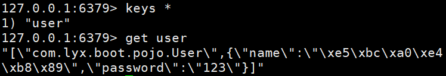 


### 7.3 自定义RedisTemplate工具类

```java
package com.lyx.boot.utils;

import org.springframework.beans.factory.annotation.Autowired;
import org.springframework.beans.factory.annotation.Qualifier;
import org.springframework.data.redis.core.RedisTemplate;
import org.springframework.stereotype.Component;
import org.springframework.util.CollectionUtils;

import java.util.Collection;
import java.util.List;
import java.util.Map;
import java.util.Set;
import java.util.concurrent.TimeUnit;

@Component
public final class RedisUtil {

    @Autowired
    private RedisTemplate<String, Object> redisTemplate;

    // =============================common============================

    /**
     * 指定缓存失效时间
     *
     * @param key  键
     * @param time 时间(秒)
     */
    public boolean expire(String key, long time, TimeUnit timeUnit) {
        try {
            if (time > 0) {
                redisTemplate.expire(key, time, timeUnit);
            }
            return true;
        } catch (Exception e) {
            e.printStackTrace();
            return false;
        }
    }

    /**
     * 根据key 获取过期时间
     *
     * @param key 键 不能为null
     * @return 时间(秒) 返回0代表为永久有效
     */
    public long getExpire(String key) {
        return redisTemplate.getExpire(key, TimeUnit.SECONDS);
    }


    /**
     * 判断key是否存在
     *
     * @param key 键
     * @return true 存在 false不存在
     */
    public boolean hasKey(String key) {
        try {
            return redisTemplate.hasKey(key);
        } catch (Exception e) {
            e.printStackTrace();
            return false;
        }
    }


    /**
     * 删除缓存
     *
     * @param key 可以传一个值 或多个
     */
    @SuppressWarnings("unchecked")
    public void del(String... key) {
        if (key != null && key.length > 0) {
            if (key.length == 1) {
                redisTemplate.delete(key[0]);
            } else {
                redisTemplate.delete((Collection<String>) CollectionUtils.arrayToList(key));
            }
        }
    }


    // ============================String=============================

    /**
     * 普通缓存获取
     *
     * @param key 键
     * @return 值
     */
    public Object get(String key) {
        return key == null ? null : redisTemplate.opsForValue().get(key);
    }

    /**
     * 普通缓存放入
     *
     * @param key   键
     * @param value 值
     * @return true成功 false失败
     */

    public boolean set(String key, Object value) {
        try {
            redisTemplate.opsForValue().set(key, value);
            return true;
        } catch (Exception e) {
            e.printStackTrace();
            return false;
        }
    }


    /**
     * 普通缓存放入并设置时间
     *
     * @param key   键
     * @param value 值
     * @param time  时间(秒) time要大于0 如果time小于等于0 将设置无限期
     * @return true成功 false 失败
     */

    public boolean set(String key, Object value, long time) {
        try {
            if (time > 0) {
                redisTemplate.opsForValue().set(key, value, time, TimeUnit.SECONDS);
            } else {
                set(key, value);
            }
            return true;
        } catch (Exception e) {
            e.printStackTrace();
            return false;
        }
    }


    /**
     * 递增
     *
     * @param key   键
     * @param delta 要增加几(大于0)
     */
    public long incr(String key, long delta) {
        if (delta < 0) {
            throw new RuntimeException("递增因子必须大于0");
        }
        return redisTemplate.opsForValue().increment(key, delta);
    }


    /**
     * 递减
     *
     * @param key   键
     * @param delta 要减少几(小于0)
     */
    public long decr(String key, long delta) {
        if (delta < 0) {
            throw new RuntimeException("递减因子必须大于0");
        }
        return redisTemplate.opsForValue().increment(key, -delta);
    }


    // ================================Map=================================

    /**
     * HashGet
     *
     * @param key  键 不能为null
     * @param item 项 不能为null
     */
    public Object hget(String key, String item) {
        return redisTemplate.opsForHash().get(key, item);
    }

    /**
     * 获取hashKey对应的所有键值
     *
     * @param key 键
     * @return 对应的多个键值
     */
    public Map<Object, Object> hmget(String key) {
        return redisTemplate.opsForHash().entries(key);
    }

    /**
     * HashSet
     *
     * @param key 键
     * @param map 对应多个键值
     */
    public boolean hmset(String key, Map<String, Object> map) {
        try {
            redisTemplate.opsForHash().putAll(key, map);
            return true;
        } catch (Exception e) {
            e.printStackTrace();
            return false;
        }
    }


    /**
     * HashSet 并设置时间
     *
     * @param key  键
     * @param map  对应多个键值
     * @param time 时间(秒)
     * @return true成功 false失败
     */
    public boolean hmset(String key, Map<String, Object> map, long time, TimeUnit timeUnit) {
        try {
            redisTemplate.opsForHash().putAll(key, map);
            if (time > 0) {
                expire(key, time, timeUnit);
            }
            return true;
        } catch (Exception e) {
            e.printStackTrace();
            return false;
        }
    }


    /**
     * 向一张hash表中放入数据,如果不存在将创建
     *
     * @param key   键
     * @param item  项
     * @param value 值
     * @return true 成功 false失败
     */
    public boolean hset(String key, String item, Object value) {
        try {
            redisTemplate.opsForHash().put(key, item, value);
            return true;
        } catch (Exception e) {
            e.printStackTrace();
            return false;
        }
    }

    /**
     * 向一张hash表中放入数据,如果不存在将创建
     *
     * @param key   键
     * @param item  项
     * @param value 值
     * @param time  时间(秒) 注意:如果已存在的hash表有时间,这里将会替换原有的时间
     * @return true 成功 false失败
     */
    public boolean hset(String key, String item, Object value, long time, TimeUnit timeUnit) {
        try {
            redisTemplate.opsForHash().put(key, item, value);
            if (time > 0) {
                expire(key, time, timeUnit);
            }
            return true;
        } catch (Exception e) {
            e.printStackTrace();
            return false;
        }
    }


    /**
     * 删除hash表中的值
     *
     * @param key  键 不能为null
     * @param item 项 可以使多个 不能为null
     */
    public void hdel(String key, Object... item) {
        redisTemplate.opsForHash().delete(key, item);
    }


    /**
     * 判断hash表中是否有该项的值
     *
     * @param key  键 不能为null
     * @param item 项 不能为null
     * @return true 存在 false不存在
     */
    public boolean hHasKey(String key, String item) {
        return redisTemplate.opsForHash().hasKey(key, item);
    }


    /**
     * hash递增 如果不存在,就会创建一个 并把新增后的值返回
     *
     * @param key  键
     * @param item 项
     * @param by   要增加几(大于0)
     */
    public double hincr(String key, String item, double by) {
        return redisTemplate.opsForHash().increment(key, item, by);
    }


    /**
     * hash递减
     *
     * @param key  键
     * @param item 项
     * @param by   要减少记(小于0)
     */
    public double hdecr(String key, String item, double by) {
        return redisTemplate.opsForHash().increment(key, item, -by);
    }


    // ============================set=============================

    /**
     * 根据key获取Set中的所有值
     *
     * @param key 键
     */
    public Set<Object> sGet(String key) {
        try {
            return redisTemplate.opsForSet().members(key);
        } catch (Exception e) {
            e.printStackTrace();
            return null;
        }
    }


    /**
     * 根据value从一个set中查询,是否存在
     *
     * @param key   键
     * @param value 值
     * @return true 存在 false不存在
     */
    public boolean sHasKey(String key, Object value) {
        try {
            return redisTemplate.opsForSet().isMember(key, value);
        } catch (Exception e) {
            e.printStackTrace();
            return false;
        }
    }


    /**
     * 将数据放入set缓存
     *
     * @param key    键
     * @param values 值 可以是多个
     * @return 成功个数
     */
    public long sSet(String key, Object... values) {
        try {
            return redisTemplate.opsForSet().add(key, values);
        } catch (Exception e) {
            e.printStackTrace();
            return 0;
        }
    }


    /**
     * 将set数据放入缓存
     *
     * @param key    键
     * @param time   时间(秒)
     * @param values 值 可以是多个
     * @return 成功个数
     */
    public long sSetAndTime(String key, long time, TimeUnit timeUnit, Object... values) {
        try {
            Long count = redisTemplate.opsForSet().add(key, values);
            if (time > 0) {
                expire(key, time, timeUnit);
            }
            return count;
        } catch (Exception e) {
            e.printStackTrace();
            return 0;
        }
    }


    /**
     * 获取set缓存的长度
     *
     * @param key 键
     */
    public long sGetSetSize(String key) {
        try {
            return redisTemplate.opsForSet().size(key);
        } catch (Exception e) {
            e.printStackTrace();
            return 0;
        }
    }


    /**
     * 移除值为value的
     *
     * @param key    键
     * @param values 值 可以是多个
     * @return 移除的个数
     */

    public long setRemove(String key, Object... values) {
        try {
            Long count = redisTemplate.opsForSet().remove(key, values);
            return count;
        } catch (Exception e) {
            e.printStackTrace();
            return 0;
        }
    }

    // ===============================list=================================

    /**
     * 获取list缓存的内容
     *
     * @param key   键
     * @param start 开始
     * @param end   结束 0 到 -1代表所有值
     */
    public List<Object> lGet(String key, long start, long end) {
        try {
            return redisTemplate.opsForList().range(key, start, end);
        } catch (Exception e) {
            e.printStackTrace();
            return null;
        }
    }


    /**
     * 获取list缓存的长度
     *
     * @param key 键
     */
    public long lGetListSize(String key) {
        try {
            return redisTemplate.opsForList().size(key);
        } catch (Exception e) {
            e.printStackTrace();
            return 0;
        }
    }


    /**
     * 通过索引 获取list中的值
     *
     * @param key   键
     * @param index 索引 index>=0时， 0 表头，1 第二个元素，依次类推；index<0时，-1，表尾，-2倒数第二个元素，依次类推
     */
    public Object lGetIndex(String key, long index) {
        try {
            return redisTemplate.opsForList().index(key, index);
        } catch (Exception e) {
            e.printStackTrace();
            return null;
        }
    }


    /**
     * 将list放入缓存
     *
     * @param key   键
     * @param value 值
     */
    public boolean lSet(String key, Object value) {
        try {
            redisTemplate.opsForList().rightPush(key, value);
            return true;
        } catch (Exception e) {
            e.printStackTrace();
            return false;
        }
    }


    /**
     * 将list放入缓存
     *
     * @param key   键
     * @param value 值
     * @param time  时间(秒)
     */
    public boolean lSet(String key, Object value, long time,TimeUnit timeUnit) {
        try {
            redisTemplate.opsForList().rightPush(key, value);
            if (time > 0) {
                expire(key, time,timeUnit);
            }
            return true;
        } catch (Exception e) {
            e.printStackTrace();
            return false;
        }

    }


    /**
     * 将list放入缓存
     *
     * @param key   键
     * @param value 值
     * @return
     */
    public boolean lSet(String key, List<Object> value) {
        try {
            redisTemplate.opsForList().rightPushAll(key, value);
            return true;
        } catch (Exception e) {
            e.printStackTrace();
            return false;
        }

    }


    /**
     * 将list放入缓存
     *
     * @param key   键
     * @param value 值
     * @param time  时间(秒)
     * @return
     */
    public boolean lSet(String key, List<Object> value, long time,TimeUnit timeUnit) {
        try {
            redisTemplate.opsForList().rightPushAll(key, value);
            if (time > 0) {
                expire(key, time,timeUnit);
            }
            return true;
        } catch (Exception e) {
            e.printStackTrace();
            return false;
        }
    }


    /**
     * 根据索引修改list中的某条数据
     *
     * @param key   键
     * @param index 索引
     * @param value 值
     * @return
     */

    public boolean lUpdateIndex(String key, long index, Object value) {
        try {
            redisTemplate.opsForList().set(key, index, value);
            return true;
        } catch (Exception e) {
            e.printStackTrace();
            return false;
        }
    }


    /**
     * 移除N个值为value
     *
     * @param key   键
     * @param count 移除多少个
     * @param value 值
     * @return 移除的个数
     */

    public long lRemove(String key, long count, Object value) {
        try {
            Long remove = redisTemplate.opsForList().remove(key, count, value);
            return remove;
        } catch (Exception e) {
            e.printStackTrace();
            return 0;
        }

    }

    // ===============================HyperLogLog=================================

    public long pfadd(String key, String value) {
        return redisTemplate.opsForHyperLogLog().add(key, value);
    }

    public long pfcount(String key) {
        return redisTemplate.opsForHyperLogLog().size(key);
    }

    public void pfremove(String key) {
        redisTemplate.opsForHyperLogLog().delete(key);
    }

    public void pfmerge(String key1, String key2) {
        redisTemplate.opsForHyperLogLog().union(key1, key2);
    }


}
```


快速体验：

```java
@SpringBootTest
public class RedisUtilsTest {

    @Autowired
    private RedisUtil redis;

    @Test
    public void testSet(){
        boolean flag = redis.set("name", "zs");
        System.out.println("set method is "+flag);
    }
}
```


## 8. redis.conf详解

> 启动的时候就是通过配置文件来启动的

1. **unit单位对大小写不敏感**

    

2. **可以将多个文件导入**

   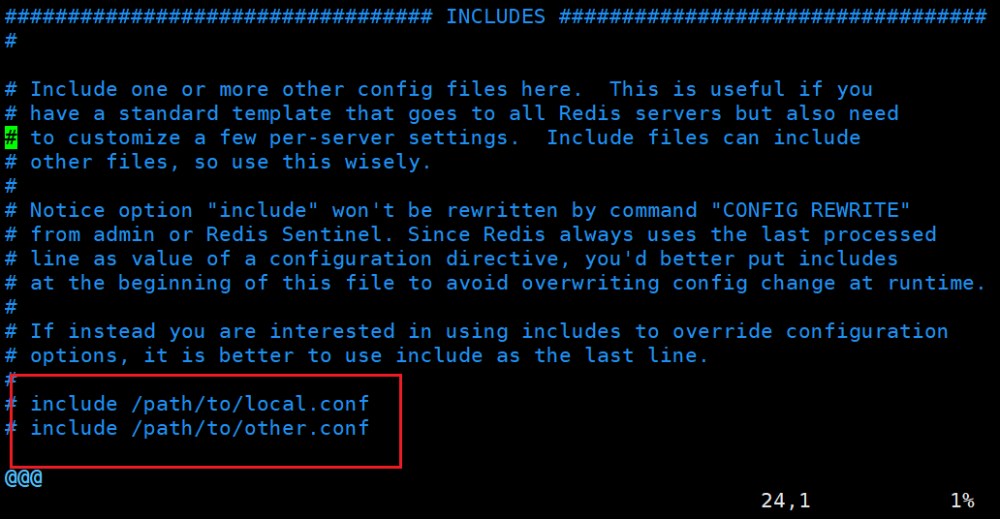 

3. **网络**

   * 绑定的ip

      

   * 保护模式

      

   * 端口号

      

4. **通用GENERAL**

   * 线程守护

     * 默认是no，需要手动开启

      

   * pidfile

      

   * 日志级别

     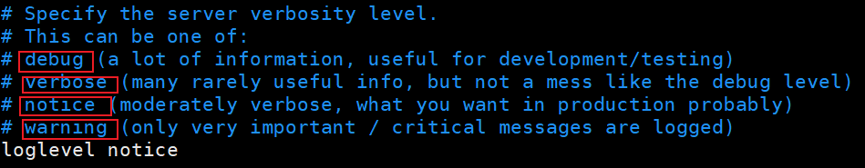 

   * 日志文件位置

     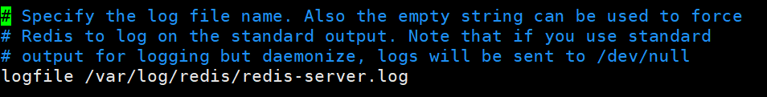 

   * 默认数据库数量

     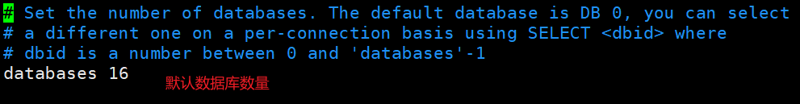 

   * redis的logo

      

5. 快照

   > 持久化，在规定的时间内，执行了对少次操作，则会持久化到文件.rdb .apf
   >
   > redis是内存数据库，没有持久化，数据就会断电丢失！

   * 开启持久化规则

      

   * 持久化出错

      

   * 压缩rdb文件（持久化文件），消耗cpu资源

      

   * 保存rdb错误校验

      

   * rdb文件保存的目录

      

6. 安全

   * 设置密码

     ```bash
     config set requirepass root #使用命令设置密码
     ```

      

7. 限制

   * 最大连接的客户端数

      

   * 最大内存容量

      

   * 内存达到上限策略

      

     * volatile-lru：只对设置了过期时间的key进行LRU（默认值） 
     * allkeys-lru ： 删除lru算法的key  
     * volatile-random：随机删除即将过期key  
     * allkeys-random：随机删除  
     * volatile-ttl ： 删除即将过期的  
     * noeviction ： 永不过期，返回错误

8. APPEND ONLY 模式aof配置

   * 是否开启aof

     * 默认不开启，使用rdb持久化，在大部分情况下rdb足够了

      

   * aof持久化名字

      

   * 同步策略

      

     具体配置在Redis持久化中。

     

## 9. 持久化

>Redis是内存数据库,如果不将内存中的数据库状态保存到磁盘,那么一旦服务器进程退岀,服务器中的数据库状态也会消失。所以 Redis提供了持久化功能


### 9.1 RDB(Redis DataBases)


在指定的时间间隔内将内存中的数据集快照写入磁盘，也就是行话讲的Snapshot快照，它恢复时是将快照文件直接读到内存里。

Redis会单独创建（fork)一个子进程来进行持久化，会先将数据写入到一个临时文件中，待持久化过程都结束了，再用这个临时文件替换上次持久化好的文件。整个过程中，主进程是不进行任何IO操作的。这就确保了极高的性能。如果需要进行大规模数据的恢复，且对于数据恢复的完整性不是非常敏感，那**RDB方式要比AOF方式更加的高效**。==RDB的缺点是最后一次持久化后的数据可能失==。

==rdb保存的文件是dump.rdb==

 


#### 9.1.1触发生成rdb的机制

1. save的规则满足的情况下，会自动触发rdb规则
2. 执行flushall命令，也会触发我们的rdb规则！
3. 退出redis,也会产生rdb文件！


#### 9.1.2 恢复rdb数据

1. 只需要将rdb文件放在我们redis启动目录就可以，redis启动的时候会自动检查dump.rdb恢复其中的数据！

2. 查看需要存在的位置

   > 如果这个目录下存在dump.rdb文件，启动就会自动恢复其中的数据

    

   

#### 9.1.3 优缺点

优点：

* 适合大规模的数据恢复！
* 对数据的完整性要不高！

缺点：

* 需要一定的时间间隔进程操作！如果redis意外岩机了，这个最后一次修改数据就没有的了！
* fork进程的时候，会占用一定的内容空间！!


### 9.2 AOF(Append Only File)

> 将我们的所有命令都记录下来，history,恢复的时候就把这个文件全部在执行一遍！

 


以日志的形式来记录每个写操作，将Redis执行过的所有指令记录下来（读操作不记录）,只许追加文件但不可以改写文件，redis启动之初会读取该文件重新构建数据，换言之，redis重启的话就根据日志文件的内容将写指令从前到后执行一次以完成数据的恢复工作

**Aof保存的是appendonly.aof文件**

**重写规则**

**** 

#### 9.2.1 开启Aof

 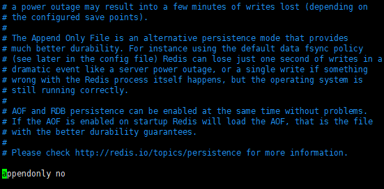

默认是不开启的，我们需要手动进行配置！我们只需要将appendonly改为yes就开启了aof!

重启服务就会自动生成appendonly.aof文件

```bash
sudo service redis stop
sudo service redis strat
```

 

测试是否开启成功

1. 使用redis客户端插入几条数据、

   ```bash
   127.0.0.1:6379> set k1 v1
   OK
   127.0.0.1:6379> set k2 v2
   OK
   127.0.0.1:6379> set k3 v3
   OK
   ```

   

2. 查看appendonly.aof文件

   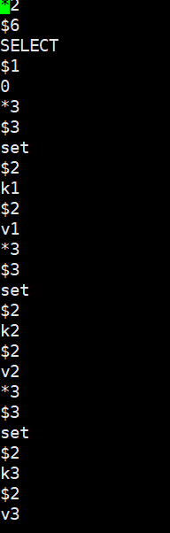 


#### 9.2.2 恢复aof数据

如果这个aof文件有错误，这时候redis是启动不起来的吗，我们需要修复这个aof文件edis给我们提供了一个工具redis-check-aof --fix

测试文件出错情况

1. 随意修改appendonly.aof文件

   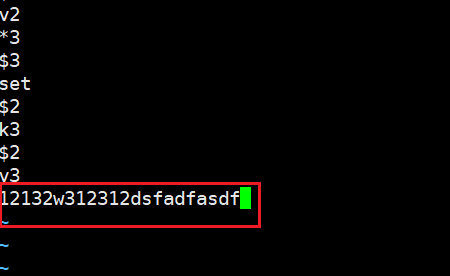 

2. 测试redis连接

    

   无法正常连接redis服务 

3. 使用redis-check-aof --fix修复

   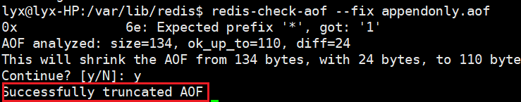 

4. 再次测试redis连接

    


#### 9.2.3 优缺点

优点：

* 每一次修改都同步，文件的完整会更加好！
* 每秒同步一次，可能会丢失一秒的数据
* 从不同步，效率最高的！

缺点：

* 相对于数据文件来说，aof远远大于rdb,修复的速度也比rdb慢！
* Aof运行效率也要比Fdb慢，所以我们redis默认的配置就是rdb持久化！


### 9.3 扩展

1. RDB持久化方式能够在指定的时间间隔内对你的数据进行快照存储
2. AOF持久化方式记录每次对服务器写的操作，当服务器重启的时候会重新执行这些命令来恢复原始的数据，AOF命令以Redis协议追加保存每次写的操作到文件末尾，Redis还能对AOF文件进行后台重写，使得AOF文件的体积不至于过大。
3. 只做缓存，如果你只希望你的数据在服务器运行的时候存在，你也可以不使用任何持久化
4. 同时开启两种持久化方式
   * 在这种情况下，当redis重启的时候会优先载入AOF文件来恢复原始的数据，因为在通常情况下AOF文件保存的数据集要比RDB文件保存的数据集要完整。
   * RDB的数据不实时，同时使用两者时服务器重启也只会找AOF文件，那要不要只使用AOF呢？作者建议不要，因为RDB更适合用于备份数据库（AOF在不断变化不好备份）,快速重启，而且不会有AOF可能潜在的Bug,留着作为一个万一的手段。
5. 性能建议
   * 因为RDB文件只用作后备用途，建议只在Slave上持久化RDB文件，而且只要15分钟备份一次就够了，只保留save9001这条规则。
   * 如果EnableAOF,好处是在最恶劣情况下也只会丢失不超过两秒数据，启动脚本较简单只load自己的AOF文件就可以了，代价一是带来了持续的IO,二是AOF rewrite的最后将rewrite过程中产生的新数据写到新文件造成的阻塞几乎是不可避免的。只要硬盘许可，应该尽量减少AOF rewrite的频率，AOF重写的基础大小默认值64M太小了，可以设到5G以上，默认超过原大小100%大小重写可以改到适当的数值。
   * 如果不Enable AOF,仅靠Master-Slave Repllcation实现高可用性也可以，能省掉一大笔IO,也减少了rewrite时带来的系统波动。代价是如果Master/Slave同时倒掉，会丢失十几分钟的数据，启动脚本也要比较两个Master/Slave中的RDB文件，载入较新的那个，微博就是这种架构。


## 10. Redis发布订阅

Redis发布订阅（pub/sub)是一种消息通信模式：发送者（pub)发送消息，订阅者（sub)接收消息。Redis客户端可以订阅任意数量的频道。

**订阅/发布消息图：**

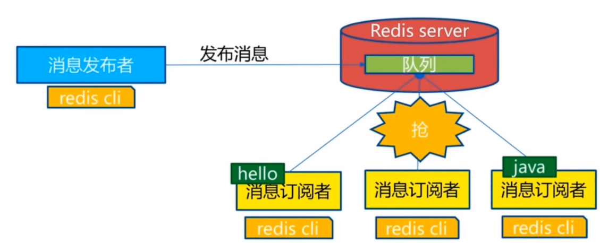 

下图展示了频道channel1,以及订阅这个频道的三个客户端--client2、client5和client1之间的关系：

 

当有新消息通过PUBLISH命令发送给频道channel1时，这个消息就会被发送给订阅它的三个客户端：

 

下表列出了 redis 发布订阅常用命令：

| 序号 | 命令及描述                                                   |
| :--- | :----------------------------------------------------------- |
| 1    | [PSUBSCRIBE pattern \[pattern ...\\]](https://www.runoob.com/redis/pub-sub-psubscribe.html) 订阅一个或多个符合给定模式的频道。 |
| 2    | [PUBSUB subcommand [argument [argument ...\]]](https://www.runoob.com/redis/pub-sub-pubsub.html) 查看订阅与发布系统状态。 |
| 3    | [PUBLISH channel message](https://www.runoob.com/redis/pub-sub-publish.html) 将信息发送到指定的频道。 |
| 4    | [PUNSUBSCRIBE [pattern [pattern ...\]]](https://www.runoob.com/redis/pub-sub-punsubscribe.html) 退订所有给定模式的频道。 |
| 5    | [SUBSCRIBE channel \[channel ...\\]](https://www.runoob.com/redis/pub-sub-subscribe.html) 订阅给定的一个或多个频道的信息。 |
| 6    | [UNSUBSCRIBE [channel [channel ...\]]](https://www.runoob.com/redis/pub-sub-unsubscribe.html) 指退订给定的频道。 |

### 10.1 测试

* 订阅者

  ```bash
  127.0.0.1:6379> SUBSCRIBE lyx
  Reading messages... (press Ctrl-C to quit)
  1) "subscribe"
  2) "lyx"
  3) (integer) 1
  # 等待读取推送的消息
  1) "message" # 消息
  2) "lyx" # 频道的名称
  3) "hello,world" # 消息的具体内容
  1) "message"
  2) "lyx"
  3) "hello,redis"
  ```

  

* 发布者

  ```bash
  127.0.0.1:6379> PUBLISH lyx "hello,world" # 发布者发布消息到频道
  (integer) 1
  127.0.0.1:6379> PUBLISH lyx "hello,redis" # 发布者发布消息到频道
  (integer) 1
  ```


### 10.2 原理

Redis是使用C实现的，通过分析Redis源码里的pubsub.c文件，了解发布和订阅机制的底层实现，籍此加深对Redis的理解。Redis通过PUBLISH、SUBSCRIBE和PSUBSCRIBE等命令实现发布和订阅功能。

通过SUBSCRIBE命令订阅某频道后，redis-server里维护了一个字典，字典的键就是一个个channel（频道）,而字典的值则是一个链表，链表中保存了所有订阅这个channel的客户端。SUBSCRIBE命令的关键，就是将客户端添加到给定channel的订阅链表中。

通过PUBLISH命令向订阅者发送消息，redis-server会使用给定的频道作为键，在它所维护的channel字典中查找记录了订阅这个频道的所有客户端的链表，遍历这个链表，将消息发布给所有订阅者。

Pub/Sub从字面上理解就是发布（Publish)与订阅（Subscribe),在Redis中，你可以设定对某一个key值进行消息发布及消息订阅，当一个key值上进行了消息发布后，所有订阅它的客户端都会收到相应的消息。这一功能最明显的用法就是用作实时消息系统，比如普通的即时聊天，群聊等功能。


### 10.2 使用场景

* 实时消息系统！
* 事实聊天！(频道当做聊天室，将信息回显给所有人即可！)
* 订阅，关注系统都是可以的！

稍微复杂的场景我们就会使用消息中间件MQ


## 11. 主从复制

### 11.1 概念

主从复制，是指将一台Redis服务器的数据，复制到其他的Redis服务器。前者称为主节点（master/leader),后者称为从节点(slave/follower);数据的复制是单向的，只能由主节点到从节点。Master以写为主，Slave以读为主。

**默认情况下，每台Redis服务器都是主节点**；

且一个主节点可以有多个从节点（或没有从节点）,但一个从节点只能有一个主节点。

**主从复制的作用主要包括：**

1. 数据穴余：主从复制实现了数据的热备份，是持久化之外的一种数据穴余方式。
2. 故障恢复：当主节点出现问题时，可以由从节点提供服务，实现快速的故障恢复；实际上是一种服务的穴余。
3. 负载均衡：在主从复制的基础上，配合读写分离，可以由主节点提供写服务，由从节点提供读服务（即写Redis数据时应用连接主节点，读Redis数据时应用连接从节点）,分担服务器负载；尤其是在写少读多的场景下，通过多个从节点分担读负载，可以大大提高Redis服务器的并发量。
4. 高可用基石：除了上述作用以外，主从复制还是哨兵和集群能够实施的基础，因此说主从复制是Redis高可用的基础。

**一般来说，要将Redis运用于工程项目中，只使用一台Redis是万万不能的，原因如下：**

1. 从结构上，单个Redis服务器会发生单点故障，并且一台服务器需要处理所有的请求负载，压力较大；
2. 从容量上，单个Redis服务器内存容量有限，就算一台Redis服务器内存容量为256G,也不能将所有内存用作Redis存储内存，
   一般来说，单台Redis最大使用内存不应该超过20G。

电商网站上的商品，一般都是一次上传，无数次浏览的，说专业点也就是”多读少写”。对于这种场景，我们可以使如下这种架构：

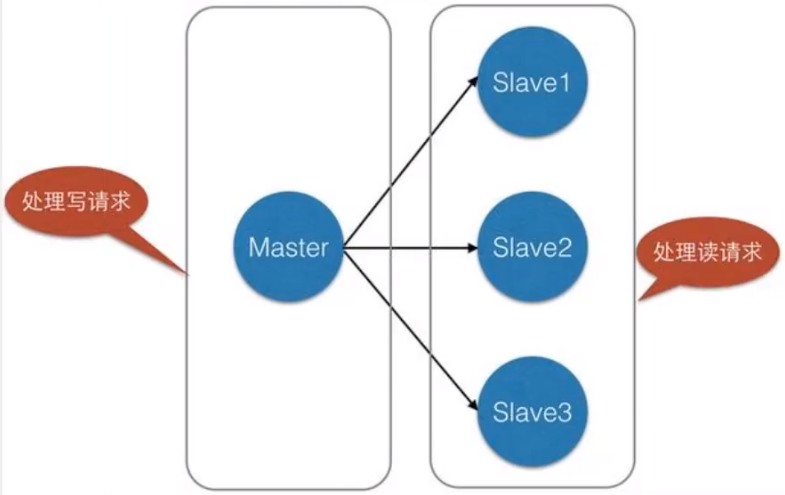 

主从复制，读写分离！80%的情况下都是在进行读操作！减缓服务器的压力！架构中经常使用！一主二从！

只要在公司中，主从复制就是必须要使用的，因为在真实的项目中不可能单机使用Redis!


### 11.2 环境配置

> 只用配置从库，不用配置主库，默认redis就是主库！

```bash
127.0.0.1:6379> info replication #查看当前库的信息
# Replication
role:master #角色master
connected_slaves:0 #从机0个
master_replid:60dcfc1059e361721c79f6fc8dd73cd809e946d0
master_replid2:0000000000000000000000000000000000000000
master_repl_offset:0
second_repl_offset:-1
repl_backlog_active:0
repl_backlog_size:1048576
repl_backlog_first_byte_offset:0
repl_backlog_histlen:0
```

将redis的配置文件复制两份，分别修改以下信息：

* 端口
* pid名字
* log文件名
* dump.rdb名字

使用端口号命名，防止冲突！

修改完毕后，使用三个不同的配置文件启动redis服务，查看服务如下：

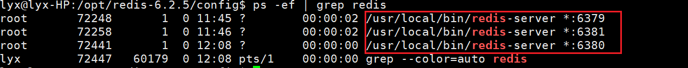 

### 11.3 一主二从

默认情况下，每台Redis服务器都是主节点；我们一般情况下只用配置从机就好了！

认老大！一主（79)二从（80,81)

```bash
#从机配置主机
SLAVEOF 127.0.0.1 6379

#主机库信息（79）
127.0.0.1:6379> info replication
# Replication
role:master
connected_slaves:2
slave0:ip=127.0.0.1,port=6380,state=online,offset=336,lag=1
slave1:ip=127.0.0.1,port=6381,state=online,offset=336,lag=1
master_failover_state:no-failover
master_replid:43f73a34799e6ee44127891eb48aa13236768978
master_replid2:0000000000000000000000000000000000000000
master_repl_offset:336
second_repl_offset:-1
repl_backlog_active:1
repl_backlog_size:1048576
repl_backlog_first_byte_offset:1
repl_backlog_histlen:336

#从机库信息（80）
127.0.0.1:6380> info replication
# Replication
role:slave
master_host:127.0.0.1
master_port:6379
master_link_status:up
master_last_io_seconds_ago:4
master_sync_in_progress:0
slave_repl_offset:420
slave_priority:100
slave_read_only:1
replica_announced:1
connected_slaves:0
master_failover_state:no-failover
master_replid:43f73a34799e6ee44127891eb48aa13236768978
master_replid2:0000000000000000000000000000000000000000
master_repl_offset:420
second_repl_offset:-1
repl_backlog_active:1
repl_backlog_size:1048576
repl_backlog_first_byte_offset:1
repl_backlog_histlen:420

#从机库信息（81）
127.0.0.1:6381> info replication
# Replication
role:slave
master_host:127.0.0.1
master_port:6379
master_link_status:up
master_last_io_seconds_ago:2
master_sync_in_progress:0
slave_repl_offset:448
slave_priority:100
slave_read_only:1
replica_announced:1
connected_slaves:0
master_failover_state:no-failover
master_replid:43f73a34799e6ee44127891eb48aa13236768978
master_replid2:0000000000000000000000000000000000000000
master_repl_offset:448
second_repl_offset:-1
repl_backlog_active:1
repl_backlog_size:1048576
repl_backlog_first_byte_offset:113
repl_backlog_histlen:336
```

真实的从主配置应该在配置文件中配置，这样的话是永久的，我们这里使用的是命令，暂时的！

 


> 注意：主机可以写，从机不能写只能读！主机中的所有信息和数据，都会自动被从机保存！

* 主机读写

   

* 从机只能读不能写

   


**注意：**

* 主机断开连接，从机依旧连接到主机的，但是没有写操作，这个时候，主机如果回来了，从机依旧可以直接获取到主机写的信息！
* 如果是使用命令行，来配置的主从，这个时候如果重启了，就会**变回主机**！**只要变为从机，立马就会从主机中获取值**！


### 11.4 复制原理

Slave启动成功连接到master后会发送一个sync同步命令

Master 接到命令，启动后台的存盘进程，同时收集所有接收到的用于修改数据集命令，在后台进程执行完毕之后，**master将传送整个数据文件到slave,并完成一次完全同步。**

**全量复制：**而slave服务在接收到数据库文件数据后，将其存盘并加载到内存中。

**增量复制：**Master继续将新的所有收集到的修改命令依次传给slave,完成同步

**但是只要是重新连接master,就会进行一次完全同步，（全量复制）将被自动执行**


### 11.5 层层链路模式

之前使用一台Master主机来连接多个Slave从机的树形模式：

 

现在使用层层链路模式

 


```bash
# 根据11.4的配置，修改slave6381的主机
127.0.0.1:6381> SLAVEOF 127.0.0.1 6380
OK

#主机库信息（79）
127.0.0.1:6379> info replication
# Replication
role:master
connected_slaves:1
slave0:ip=127.0.0.1,port=6380,state=online,offset=8732,lag=0
master_failover_state:no-failover
master_replid:43f73a34799e6ee44127891eb48aa13236768978
master_replid2:0000000000000000000000000000000000000000
master_repl_offset:8732
second_repl_offset:-1
repl_backlog_active:1
repl_backlog_size:1048576
repl_backlog_first_byte_offset:1
repl_backlog_histlen:8732

#从机库信息（80）
127.0.0.1:6380> info replication
# Replication
role:slave
master_host:127.0.0.1
master_port:6379
master_link_status:up
master_last_io_seconds_ago:5
master_sync_in_progress:0
slave_repl_offset:8704
slave_priority:100
slave_read_only:1
replica_announced:1
connected_slaves:1
slave0:ip=127.0.0.1,port=6381,state=online,offset=8704,lag=0
master_failover_state:no-failover
master_replid:43f73a34799e6ee44127891eb48aa13236768978
master_replid2:0000000000000000000000000000000000000000
master_repl_offset:8704
second_repl_offset:-1
repl_backlog_active:1
repl_backlog_size:1048576
repl_backlog_first_byte_offset:1
repl_backlog_histlen:8704

#从机库信息（81）
127.0.0.1:6381> info replication
# Replication
role:slave
master_host:127.0.0.1
master_port:6380
master_link_status:up
master_last_io_seconds_ago:3
master_sync_in_progress:0
slave_repl_offset:8690
slave_priority:100
slave_read_only:1
replica_announced:1
connected_slaves:0
master_failover_state:no-failover
master_replid:43f73a34799e6ee44127891eb48aa13236768978
master_replid2:0000000000000000000000000000000000000000
master_repl_offset:8690
second_repl_offset:-1
repl_backlog_active:1
repl_backlog_size:1048576
repl_backlog_first_byte_offset:113
repl_backlog_histlen:8578
```


> 如果主机断开了连接，我们可以使用 `SLAVEOF no one `让自己变成主机！其他的节点就可以手动连接到最新的这个主节点（手动）


## 12. 哨兵模式

### 12.1 概述

主从切换技术的方法是：当主服务器容机后，需要手动把一台从服务器切换为主服务器，这就需要人工干预，费事费力，还会造成一段时间内服务不可用。这不是一种推荐的方式，更多时候，我们优先考虑哨兵模式。Redis从2.8开始正式提供了Sentinel(哨兵）架构来解决这个问题。

谋朝篡位的自动版，能够后台监控主机是否故障，如果故障了**根据投票数自动将从库转换为主库**。

哨兵模式是一种特殊的模式，首先Redis提供了哨兵的命令，哨兵是一个独立的进程，作为进程，它会独立运行。其原理是**哨兵**
**过发送命令，等待Redis服务器响应，从而监控运行的多个Redis实例。**

 

这里的哨兵有两个作用

* 通过发送命令，让Redis服务器返回监控其运行状态，包括主服务器和从服务器。
* 当哨兵监测到master容机，会自动将slave切换成master,然后通过发布订阅模式通知其他的从服务器，修改配置文件，让它们切换主机。

然而一个哨兵进程对Redis服务器进行监控，可能会出现问题，为此，我们可以使用多个哨兵进行监控。各个哨兵之间还会进行监控，这样就形成了多哨兵模式。

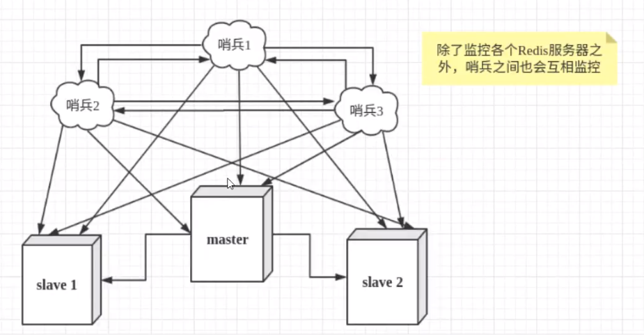 

假设主服务器启机，哨兵1先检测到这个结果，系统并不会马上进行failover过程，仅仅是哨兵1主观的认为主服务器不可用，这个现象成为主观下线。当后面的哨兵也检测到主服务器不可用，并且数量达到一定值时，那么哨兵之间就会进行一次投票，投票的结果由一个哨兵发起，进行failover[故障转移]操作。切换成功后，就会通过发布订阅模式，让各个哨兵把自己监控的从服务器实现切换主机，这个过程称为客观下线。

### 12.3 测试哨兵模式

目前状态时一主二从

1. 哨兵配置文件sentinel.conf

   ```bash
   # sentinel monitor 被监控的名字（可任意） ip port 1
   sentinel monitor myredis 127.0.0.1 6379 1
   ```

   后面数字1表示，主机挂了，slave通过投票来决定谁是主机，票数最多的就会成为主机！

2. 启动哨兵

   ```bash
   sudo /usr/local/bin/redis-sentinel sentinel.conf 
   ```

   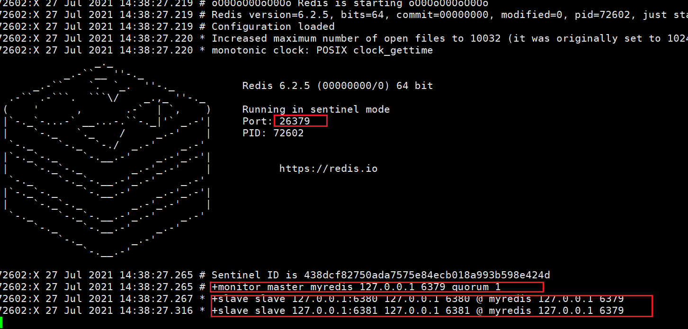  


如果Master节点断开了，这个时候就会从从机中随机选择一个服务器！(这里面有一个投票算法！)

 

**如果之前的主机回来了，哨兵会自动将之前的主机变成现在主机的从机**

 


### 12.3 优缺点

**优点：**

1. 哨兵集群，基于主从复制模式，所有的主从配置优点，它全有
2. 主从可以切换，故障可以转移，系统的可用性就会更好
3. 哨兵模式就是主从模式的升级，手动到自动，更加健壮！

**缺点：**

1. Redis不好啊在线扩容的，集群容量一旦到达上限，在线扩容就十分麻烦！
2. 实现哨兵模式的配置其实是很麻烦的，里面有很多选择！


### 12.4 哨兵模式详细配置文件

> 需要多个哨兵时，就要跟搭建集群的redis一样多创建几个不同的哨兵配置文件分别开启！

```bash
# Example sentinel.conf
 
# 哨兵sentinel实例运行的端口 默认26379
port 26379
 
# 哨兵sentinel的工作目录
dir /tmp
 
# 哨兵sentinel监控的redis主节点的 ip port 
# master-name  可以自己命名的主节点名字 只能由字母A-z、数字0-9 、这三个字符".-_"组成。
# quorum 当这些quorum个数sentinel哨兵认为master主节点失联 那么这时 客观上认为主节点失联了
# sentinel monitor <master-name> <ip> <redis-port> <quorum>
  sentinel monitor mymaster 127.0.0.1 6379 2
 
# 当在Redis实例中开启了requirepass foobared 授权密码 这样所有连接Redis实例的客户端都要提供密码
# 设置哨兵sentinel 连接主从的密码 注意必须为主从设置一样的验证密码
# sentinel auth-pass <master-name> <password>
sentinel auth-pass mymaster MySUPER--secret-0123passw0rd
 
 
# 指定多少毫秒之后 主节点没有应答哨兵sentinel 此时 哨兵主观上认为主节点下线 默认30秒
# sentinel down-after-milliseconds <master-name> <milliseconds>
sentinel down-after-milliseconds mymaster 30000
 
# 这个配置项指定了在发生failover主备切换时最多可以有多少个slave同时对新的master进行 同步，
这个数字越小，完成failover所需的时间就越长，
但是如果这个数字越大，就意味着越 多的slave因为replication而不可用。
可以通过将这个值设为 1 来保证每次只有一个slave 处于不能处理命令请求的状态。
# sentinel parallel-syncs <master-name> <numslaves>
sentinel parallel-syncs mymaster 1
 
 
 
# 故障转移的超时时间 failover-timeout 可以用在以下这些方面： 
#1. 同一个sentinel对同一个master两次failover之间的间隔时间。
#2. 当一个slave从一个错误的master那里同步数据开始计算时间。直到slave被纠正为向正确的master那里同步数据时。
#3.当想要取消一个正在进行的failover所需要的时间。  
#4.当进行failover时，配置所有slaves指向新的master所需的最大时间。不过，即使过了这个超时，slaves依然会被正确配置为指向master，但是就不按parallel-syncs所配置的规则来了
# 默认三分钟
# sentinel failover-timeout <master-name> <milliseconds>
sentinel failover-timeout mymaster 180000
 
# SCRIPTS EXECUTION
 
#配置当某一事件发生时所需要执行的脚本，可以通过脚本来通知管理员，例如当系统运行不正常时发邮件通知相关人员。
#对于脚本的运行结果有以下规则：
#若脚本执行后返回1，那么该脚本稍后将会被再次执行，重复次数目前默认为10
#若脚本执行后返回2，或者比2更高的一个返回值，脚本将不会重复执行。
#如果脚本在执行过程中由于收到系统中断信号被终止了，则同返回值为1时的行为相同。
#一个脚本的最大执行时间为60s，如果超过这个时间，脚本将会被一个SIGKILL信号终止，之后重新执行。
 
#通知型脚本:当sentinel有任何警告级别的事件发生时（比如说redis实例的主观失效和客观失效等等），将会去调用这个脚本，
这时这个脚本应该通过邮件，SMS等方式去通知系统管理员关于系统不正常运行的信息。调用该脚本时，将传给脚本两个参数，
一个是事件的类型，
一个是事件的描述。
如果sentinel.conf配置文件中配置了这个脚本路径，那么必须保证这个脚本存在于这个路径，并且是可执行的，否则sentinel无法正常启动成功。
#通知脚本
# sentinel notification-script <master-name> <script-path>
  sentinel notification-script mymaster /var/redis/notify.sh
 
# 客户端重新配置主节点参数脚本
# 当一个master由于failover而发生改变时，这个脚本将会被调用，通知相关的客户端关于master地址已经发生改变的信息。
# 以下参数将会在调用脚本时传给脚本:
# <master-name> <role> <state> <from-ip> <from-port> <to-ip> <to-port>
# 目前<state>总是“failover”,
# <role>是“leader”或者“observer”中的一个。 
# 参数 from-ip, from-port, to-ip, to-port是用来和旧的master和新的master(即旧的slave)通信的
# 这个脚本应该是通用的，能被多次调用，不是针对性的。
# sentinel client-reconfig-script <master-name> <script-path>
 sentinel client-reconfig-script mymaster /var/redis/reconfig.sh
```


## 13. Redis缓存穿透和雪崩

> （面试高频，工作常用）
>
> 服务器高可用问题！

Redis缓存的使用，极大的提升了应用程序的性能和效率，特别是数据查询方面。但同时，它也带来了一些问题。其中，最要害的问题，就是数据的一致性问题，从严格意义上讲，这个问题无解。如果对数据的一致性要求很高，那么就不能使用缓存。

另外的一些典型问题就是，缓存穿透、缓存雪崩和缓存击穿。目前，业界也都有比较流行的解决方案。

 


### 13.1 缓存穿透(查不到)

#### 13.1.1 概念

缓存穿透的概念很简单，用户想要查询一个数据，发现redis内存数据库没有，也就是缓存没有命中，于是向持久层数据库查询。发现也没有，于是本次查询失败。当用户很多的时候，缓存都没有命中，于是都去请求了持久层数据库。这会给持久层数据库造成很大的压力，这时候就相当于出现了缓存穿透。


#### 13.1.2 解决方案

##### 1. 布隆过滤器

>布隆过滤器是一种数据结构，对所有可能查询的参数以hash形式存储，在控制层先进行校验，不符合则丢弃，从而避免了对底层存系统的查询压力；

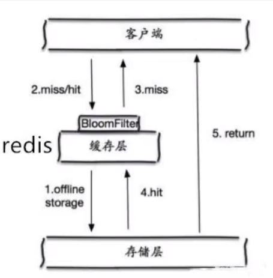 


##### 2. 缓存空对象

> 当存储层不命中后，即使返回的空对象也将其缓存起来，同时会设置一个过期时间，之后再访问这个数据将会从缓存中获取，保护了后端数据源；

 


**但是这种方法会存在两个问题：**

1. 如果空值能够被缓存起来，I这就意味着缓存需要更多的空间存储更多的键，因为这当中可能会有很多的空值的键；
2. 即使对空值设置了过期时间，还是会存在缓存层和存储层的数据会有一段时间窗口的不一致，这对于需要保持一致性的业务会有影响。


### 13.2 缓存击穿（量太大，缓存过期！）

#### 13.2.1 概念

这里需要注意和缓存击穿的区别，缓存击穿，是指一个key非常热点，在不停的扛着大并发，大并发集中对这一个点进行访问，当这个key在失效的瞬间，持续的大并发就穿破缓存，直接请求数据库，就像在一个屏障上凿开了一个洞。

当某个key在过期的瞬间，有大量的请求并发访问，这类数据一般是热点数据，由于缓存过期，会同时访问数据库来查询最新数据，并且回写缓存，会导使数据库瞬间压力过大。


#### 13.2.2 解决方案

##### 1. 设置热点数据永不过期

从缓存层面来看，没有设置过期时间，所以不会出现热点key过期后产生的问题。

##### 2. 加互斥锁

分布式锁：使用分布式锁，保证对于每个key同时只有一个线程去查询后端服务，其他线程没有获得分布式锁的权限，因此只需要等待即可。这种方式将高并发的压力转移到了分布式锁，因此对分布式锁的考验很大。


### 13.4 缓存雪崩

#### 13.4.1 概念

缓存雪崩,是指在某一个时间段,缓存集中过期失效。 Redis宕机

产生雪崩的原因之一,比如在写本文的时候,马上就要到双十二零点,很快就会迎来一波抢购,这波商品时间比较集中的放入了缓存,假设缓存一个小时。那么到了凌晨一点钟的时候,这批商品的缓存就都过期了。而对这批商品的访问査询,都落到了数据库上,对于数据库而言,就会产生周期性的压力波峰。于是所有的请求都会达到存储层,存储层的调用量会暴増,造成存储层也会挂掉的情况

 

其实集中过期,倒不是非常致命,比较致命的缓存雪崩,是缓存服务器某个节点宕机或断网。因为自然形成的缓存雪崩,一定是在某个时间段集中创建缓存,这个时候,数据库也是可以顶住压力的。无非就是对数据库产生周期性的压力而已。而缓存服务节点的宕机,对数据库脹务器造成的压力是不可预知的,很有可能瞬间就把数据库压垮。


#### 13.4.2 解决方案

##### 1. redis高可用

这个思想的含义是,既然eds有可能挂掉,那我多增设几台 redis,这样一合掉之后其他的还可以继续工作,其实就是搭建的集群

##### 2. 限流降级

这个解决方案的思想是,在缓存失效后,通过加锁或者队列来控制渎数据库写缓存的线程数量。比如对某个key只允许一个线程查询数据和写缓存,其他线程等待。

##### 3. 数据预热

数据加热的含乂就是在正式部署之前,我先把可能的数据先预先访问-遍,这样部分可能大量访问的数据就会加载到缓存中。在即将发生大并发访问前手动触发加载缓存不同的key,设置不同的过期时间,让缓存失效的时间点尽量均匀


