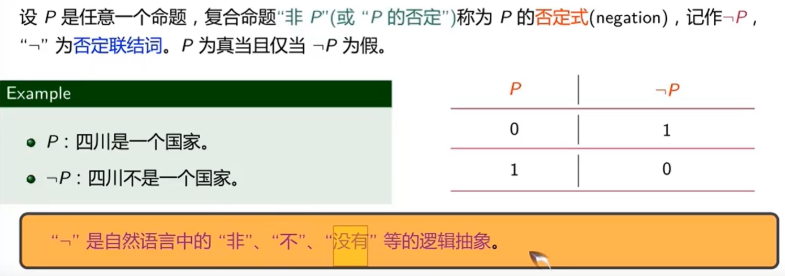

# 离散数学

## 命题

> ==具有确切真值的陈述句称为**命题**==
>
> 该命题可以取一个“值”，称为真值。真值只有“真”和“假”两种，分别用“T"(或“1”)和“F”（或“0”）表示。
>
> 注意：一切没有判断内容的句子，如命令句（祈使句），感叹句，疑问句，二义性的陈述句都==不能作为命题==。
>
> >原子命题：不能再继续分解为更简单的命题。
> >
> >复合命题：可分解为更简单的命题。


## 1.命题连接词

### 1.1否定式



---

### 1.2合取式


---

### 1.3析取连接词


---

### 1.4蕴涵连接词


---

### 1.5等价连接词


---

**总结**


### 1.6真值表


==注意：连接词是**两个命题真值之间的连接**，而且不是命题内容之间的连接，因此复合命的真值只取决于构成他们的哥简单命题，而与它们的内容无关，与二者之间是否有关无关。==

### 1.7连接词优先级

>* ###### 所有五个联接词的优先顺序为:否定,合取,析取,蕴涵,等价;
>
>* 同级的联结词,按其出现的先后次序(从左到右);
>
>* 若运算要求与优先次序不一致时,可使用括号;同级符号相邻时,也可使用括号。括号中的运算为最高优先级。

**例题**


## 2。命题公式和真值表

### 2.1命题变元

* 一个特定的命题是一个**常值命题**，它不是具有值“T”（“1”），就是具有值“F"("0")

* 一个任意的<u>没有赋予具体内容</u>的原子命题是一个变量命题,常称它为**命题变量(或命题变**
  **元(** propositional variable),该命题变量无具体的真值,它的变域是集合{T,F}或{0,1})。

  

  >复合命题是由原子命题与联结词构成的命题。所以，当其中的原子命题是命题变元时，此 复合命题也即为命题变元的函数，且该函数的值仍为“真”或“假”值，这样的函数可形 象地称为**“真值函数” 或 “命题公式”**，此命题公式没有确切的真值。 例如：G = P ∧ Q → ¬R


### 2.2命题公式 

> 命题演算的合式公式 (well formed formula，wff)，又称**命题公式 (简称公式)**，按如下规则生成：
>
> 1. 命题变元本身是一个公式；（如：P, Q, R, · · · ）
>
> 2.  如 G 是公式，则(¬G)也是公式；（如：¬P, ¬Q, ¬R, · · · ） 
>
> 3.  如 G，H 是公式，则(G ∧ H)、(G ∨ H)、(G → H)、(G ↔ H)也是公式；（如： P ∧ Q,(¬Q) → R, · · · ） 
>
> 4. 仅由有限步使用规则 (1)、(2)、(3)后所得到的包含命题变元、联结词和括号的符号串才是命 题公式. （如：¬(P ∧ Q) ↔ R,(¬Q ∨ (P ∧ ¬R)) → R, · · · ） 如果 G 是含有 n 个命题变元 P1、P2、P3、· · · 、Pn 的公式，可记为：G(P1, P2, P3, · · · , Pn) 或简 写为 G。

#### 2.2.1命题公式的说明

> 1. 原子命题变元是最简单的合式公式，称为原子合式公式，简称原子公式； 
>
> 2. 命题公式没有真值，只有对其命题变元进行真值指派后，方可确定命题公式的真值； 
>
> 3. 整个公式的最外层括号可以省略；公式中不影响运算次序的括号也可以省略。 
>
> 4. 在实际应用中，为了便于存储和运算，命题公式常用二元树的方式来表达。
>
>    

#### 2.2.1公式的解释

> 设 P1、P2、P3、· · · 、Pn 是出现在公式 G 中的所有命题变元，指定 P1、P2、P3、· · · 、Pn 一组真 值，则这组真值称为 G 的一个**解释**，常记为 I。


* 如果公式 G 在解释 I 下是真的，则称I 满足 G，此时 I 是 G 的**成真赋值**；如果 G 在解 释 I 下是假的，则称I 弄假于 G，此时 I 是 G 的**成假赋值**。

### 2.3真值表

> * 一般来说，若有 n 个命题变元，则应有 **2 的n次方**个不同的解释。 
> * 利用真值表，可得到公式的所有成真赋值和成假赋值。

> **由公式 G 在其所有可能的解释下所取真值构成的表，称为 ==G 的真值表==**

**真值表的画法**

一般我们将公式中的命题变元放在真值表的左边，将公式的结果放在真值表的右边。有时 为了清楚起见，可将求公式的中间结果也放在真值表中。


## 3.命题公式的分类和等价

### 3.1命题公式的分类

> * 公式 G 称为**永真公式(重言式,tautology)**，如果在它的所有解释之下其真值都为“真”。 
> * 公式 G 称为**永假公式(矛盾式,contradiction)**，如果在它的所有解释之下其真值都为“假”。 有时也称永假公式为不可满足公式。 
> * 公式 G 称为**可满足公式(satisfiable)**，如果它不是永假的。
>
> >**三种公式之间的关系**
> >
> >1. G 是永真的当且仅当 ¬G 是永假的； 
> >2. G 是可满足的当且仅当至少有一个解释 I，使 G 在 I 下为真。 
> >3. 若 G 是永真式，则 G 一定是可满足式，但反之可满足公式不一定是永真式；

### 3.2公式的逻辑等价

> 设 G，H 是两个命题公式，P1，P2，P3，· · · ，Pn是出现在 G，H 中所有的命题变元，如果对于 P1，P2，P3，· · · ，Pn 的 2 n 个解释，G 与 H 的真值结果都相同，则称公式 G 与 H 是**等价**的， 记作G = H。（或G ⇔ H）
>
> > 对于任意两个公式 G 和 H，G = H 的**充分必要条件**是公式 G ↔ H 是**永真公式**。
> >
> > > * 必要性：假定 G = H，则 G，H 在其任意解释 I 下或同为真或同为假，于是由 “↔” 的意义 知，公式 G ↔ H 在其任何的解释 I 下，其真值为“真”，即 G ↔ H 为永真公式。 
> > > * 充分性：假定公式 G ↔ H 是永真公式，I 是它的任意解释，在 I 下，G ↔ H 为真，因此， G，H 或同为真，或同为假，由于 I 的任意性，故有 G = H。

#### 3.2.1命题公式的可判定性

> 可判定性: 能否给出一个可行方法，完成对任意公式的判定类问题。（类型或等价判定） **命题公式是可判定的**


## 4.命题等价公式

**设 G, H, S 为任意的命题公式。**


## 5.范式 

### 5.1引入范式

> 真值表能够方便的给出命题公式的真值情况，但真值表的规模随命题变元的数量 呈指数形式增长，因而我们考虑一种真值表的替代方法，这种方法是基于命题公 式的一种标准形式。

* **命题变元**或**命题变元的否定**称为`文字`。P, ¬P, Q, ¬Q, · · · 
* **有限个**文字的**析取**称为`简单析取式`(或`子句`)。P ∨ Q ∨ ¬R, · · · P,¬P 
* **有限个**文字的**合取**称为`简单合取式`(或`短语`)。¬P ∧ Q ∧ R, · · · P,¬P 
* P 与 ¬P 称为**互补对**。

### 5.2范式定义

> * **有限个**简单合取式（短语）的析取式称为`析取范式`(disjunctive normal form)； 如 (P ∧ Q) ∨ (¬P ∧ Q) ，又如 P ∧ ¬Q，P,¬P 
>
> * **有限个**简单析取式（子句）的合取式称为`合取范式`(conjunctive normal form)。 如 (P ∨ Q) ∧ (¬P ∨ Q)，又如 P ∨ ¬Q，P, ¬P

**总结**

> 1. 范式关注的是命题公式的当**前书**写形式；
> 2. 单个的文字是子句、短语、析取范式，合取范式； 
> 3.  析取范式、合取范式仅含联结词集 {¬, ∧, ∨}，且否定联接词仅出现在命题 变元之前。

### 5.3范式存在定理

> 对于任意命题公式，都存在与其等价的析取范式和合取范式。

**总结**

> 1. 命题公式的析取范式可以指出公式何时为真，而合取范式可以指出公式何时 为假，从而能够替代真值表。((¬P ∨ Q) ∧ (P ∨ ¬R),¬P ∨ (¬Q ∧ R)) 
> 2. 命题公式的范式表达并不唯一，比如对公式 (P ∨ Q) ∧ (P ∨ R) 而言，对应的 析取范式有很多： P ∨ (Q ∧ R) (P ∧ P) ∨ (Q ∧ R) P ∨ (Q ∧ ¬Q) ∨ (Q ∧ R) P ∨ (P ∧ R) ∨ (Q ∧ R) 
> 3. 一般而言，求解范式时，需要进行最后的化简步骤；

由于联结词之间可以通过命题公式的基本等价关系进行相互的转换，所以可通过逻辑等价公式求出等价于它 的析取范式和合取范式，具体步骤如下：

1. 将公式中的 →,↔ 用联结词 ¬,∧,∨ 来取代：

   * E20 : G → H = ¬G ∨ H, (蕴涵式)
   * E22 : G ↔ H = (G → H) ∧ (H → G) = (¬G ∨ H) ∧ (¬H ∨ G) (等价式) 

2.  将否定联接词移到各个命题变元的前端，并消去多余的否定号： 

   * E17 : ¬(¬G) = G. (双重否定律) 
   * E18 : ¬(G ∨ H) = ¬G ∧ ¬H; (德摩根律) 
   * E19 : ¬(G ∧ H) = ¬G ∨ ¬H. 

3. 利用分配律，可将公式化成一些合取式的析取，或化成一些析取式的合取：

   * E11 : G ∨ (H ∧ S) = (G ∨ H) ∧ (G ∨ S); (分配律)
   *  E12 : G ∧ (H ∨ S) = (G ∧ H) ∨ (G ∧ S).

   >  任意一个公式，经过以上步骤，必能化成与其等价的析取范式和合取范式。

### 5.4范式和真值

1. 命题公式的**析取范式可以指出公式何时为真**，而**合取范式可以指出公式何时为假**，从而能够替代真值表。((¬P ∨ Q) ∧ (P ∨ ¬R),¬P ∨ (¬Q ∧ R)) 
2. 命题公式的范式表达并不唯一，比如对公式 (P ∨ Q) ∧ (P ∨ R) 而言，对应的 析取范式有很多： P ∨ (Q ∧ R) (P ∧ P) ∨ (Q ∧ R) P ∨ (Q ∧ ¬Q) ∨ (Q ∧ R) P ∨ (P ∧ R) ∨ (Q ∧ R) 
3. 一般而言，求解范式时，需要进行最后的化简步骤；

### 5.5极小项和极大项

> 在含有 n 个命题变元 P1, P2, P3, · · · , Pn 的短语或子句中，若每个**命题变元与其否定不同时存在**， 但二者之一**恰好出现一次且仅一次**，并且出现的次序与 P1, P2, P3, · · · , Pn 一致，则称此短语或子句为关于 P1, P2, P3, · · · , Pn 的一个`极小项`（合取）或`极大项`（析取）。

> 一般来说，若有 n 个命题变元，则应有 2的n次方个不同的极小项和 2的n次方个不同的极大项。

#### 5.5.1极小项的性质


> * **没有两个不同的极小项是等价的。** 
> * 每个极小项**只有一组**成真赋值，因此可用于给极小项编码。 编码规律为：**命题变元 与 1 对应，命题变元的否定与 0 对应。**

#### **5.5.2极大项的性质**


> * **没有两个不同的极大项是等价的。** 
> * 每个极大项**只有一组**成假赋值，因此可用于给极大项编码。 编码规律为：**命题变元 与 0 对应，命题变元的否定与 1 对应。**

==注意：极小项和极大项的编码方式相反==

> **记忆技巧**：
>
> * 极小项是让真值结果为真，即：Q ∧ R为真，即（Q为1）合取（R为1）结果才为真，m11（m3）
>
> * 极大项是让真值结果为假，即：Q ∨ R为假，即（Q为0）合取（R为0）结果才为假，M00（M0）

#### 5.5.3极小项和极大项的性质


### 5.6主析取范式和主合取范式

> * 在给定的析取范式中，若每一个短语都是**极小项**，且**按照编码从小到大**的顺序排列， 则称该范式为`主析取范式`(principal disjunctive normal form)。 
> * 在给定的合取范式中，若每一个子句都是**极大项**，且**按照编码从小到大的顺序**排列， 则称该范式为`主合取范式`(principal conjunctive normal form)。 
> * 如果一个主析取范式不包含任何极小项，则称该**主析取范式为 “空”**；如果一个主合 取范式不包含任何极大项，则称**主合取范式为 “空”**。

==任何一个公式都有与之等价的主析取范式和主合取范式==

### 5.7主范式求解

#### 5.7.1定理求解

> 1. 求出该公式所对应的析取范式和合取范式； 
> 2. 消去重复出现的命题变元，矛盾式或重言式； 
>    * E1 : G ∨ G = G; E2 : G ∧ G = G. (幂等律)
>    * E15 : ¬G ∧ G = 0. (矛盾律) 
>    * E7 : G ∨ 0 = G; 
>    * E8 : G ∧ 1 = G.(同一律) 
>    * E16 : ¬G ∨ G = 1. (排中律) 
>    * E9 : G ∨ 1 = 1; E10 : G ∧ 0 = 0.(零律)
> 3. 若析取（合取）范式的某一个短语（子句）Bi 中缺少命题变元 P，则可用如下方式将 P 补进去： 
>    * Bi = Bi ∧ 1 = Bi ∧ (¬P ∨ P) = (Bi ∧ ¬P) ∨ (Bi ∧ P)； 
>    * Bi = Bi ∨ 0 = Bi ∨ (¬P ∧ P) = (Bi ∨ ¬P) ∧ (Bi ∨ P)。 重复至所有短语或子句都是标准的极小项或极大项为止。
> 4. 幂等律将重复的极小项和极大项合并，并利用交换律进行顺序调整，由此可转换成标准的主析取范 式和主合取范式。 
>    * E1 : G ∨ G = G; E2 : G ∧ G = G. (幂等律)
>    * E3 : G ∨ H = H ∨ G; E4 : G ∧ H = H ∧ G.(交换律)

#### 5.7.2真值表技术

> 利用真值表技术求主析取范式和主合取范式的简要方法： 
>
> * 列出真值表，选出公式的**真值结果为真**的所有的行，在这样的每一行中，找到其每一 个解释所对应的**极小项**，将这些极小项进行**析取**即可得到相应的主析取范式。 
>
> * 列出真值表，选出公式的**真值结果为假**的所有的行，在这样的每一行中，找到其每一 个解释所对应的**极大项**，将这些极大项进行**合取**即可得到相应的主合取范式。
>
>    从真值表按所给的算法求出主范式的方法，称为`真值表技术` (technique of truth table)。

### 5.8主范式应用

> 主范式可用于了解公式的真值情况，进行公式类型的判定以及等价关系的判定。 
>
> * 如果主析取范式包含所有的**极小项**，则该公式为**永真公式**； 
> * 如果主合取范式包含所有的**极大项**，则该公式为**永假公式**； 
> * 若两个公式具有**相同的**主析取范式或主合取范式，则**两公式等价**

## 6.命题蕴含公式

> 设G1, G2, · · · ,Gn, H是**公式**，称H 是G1,G2, · · · , Gn的**逻辑结果**当且仅当对任意**解释 I**， 如果I使得G1 ∧ G2 ∧ · · · ∧ Gn为真，则I也会使H为真。记为G1, G2, · · · ,Gn ⇒ H。“⇒” 称为蕴涵关系。此时称 G1, G2, · · · , Gn ⇒ H 为有效的, 否则称为无效的。G1, G2, · · · , Gn 称为一组`前提`，有时用集合 Γ 来表示，记为 Γ = {G1, G2, · · · ,Gn}，H 称为`结论`。此时 也称 H 是前提集合 Γ 的`逻辑结果`。记为 Γ ⇒ H。

> 公式 H 是前提集合 Γ = {G1, G2, · · · , Gn} 的逻辑结果当且仅当 **(G1 ∧ G2 ∧ · · · ∧ Gn) → H 为永真公式**。
>
> 判定命题是否有效:
>
> * 真值表技术。 
> * 公式转换法。 
> * 主析取范式法。

### 6.1基本蕴含关系

> 设 G, H, I 为任意的命题公式。 
>
> 1.  I1 : G ∧ H ⇒ G; I2 : G ∧ H ⇒ H. (简化规则) 
> 2.  I3 : G ⇒ G ∨ H; I4 : H ⇒ G ∨ H. (添加规则) 
> 3.  I5 : G, H ⇒ G ∧ H; (合取引入规则) 
> 4.  I6 : G ∨ H, ¬G ⇒ H; I7 : G ∨ H,¬H ⇒ G. (选言三段论) 
> 5.  I8 : G → H, G ⇒ H; (假言推理规则) 
> 6.  I9 : G → H, ¬H ⇒ ¬G; (否定后件式) 
> 7.  I10 : G → H, H → I ⇒ G → I; (假言三段论) 
> 8.  I11 : G ∨ H,G → I, H → I ⇒ I; (二难推论)

## 7.演绎法推理

> * `规则 P` (称为前提引用规则)：在推导的过程中，可随时引入前提集合中的任意一个前提；
>
> * ` 规则 T `(称为逻辑结果引用规则)：在推导的过程中，可以随时引入公式 S，该公式 S 是由其 前的一个或多个公式推导出来的逻辑结果,即可随时引入中间结论。
>
> *  `规则CP` (称为附加前提规则)：如果能从给定的前提集合 Γ 与公式 P 推导出 S，则能从此 前提集合 Γ 推导出 P → S。
>
>   > * 原理：P → (Q → R) = (P ∧ Q) → R。 
>   > * 使用场合: 当结论公式是蕴涵式或析取式时使用。

> 从前提集合 Γ 推出结论 H 的一个`演绎`是构造命题公式的一个有限序列：
>
>  H1, H2, H3, · · · , Hn−1, Hn 
>
> 其中，Hi 或者是 Γ 中的某个前提，或者是前面的某些 Hj(j < i) 的有效结论，并且 Hn 就是 H， 则称公式 H 为该演绎的**有效结论，**或者称从前提 Γ 能够演绎出结论 H 来。

## 8.谓词

> 为了研究简单命题句子内部的逻辑关系，我们需要对简单命题进行分解，利用**个体词，谓 词和量词**来描述它们，并研究个体与总体的内在联系和数量关系，这就是`谓词逻辑`或`一 阶逻辑`。

### 8.1 个体词和谓词

> 在原子命题中，可以独立存在的客体（句子中的**主语、宾语**等），称为`个体词`。而用以 刻划**客体的性质或客体之间的关系**即是`谓词`。

#### 8.1.1个体词

个体词可分为两种，`个体常量`和`个体变量`，均在个体域内取值。 

1. 表示**具体或特定**的个体词称为`个体常量`。一般用带或不带下标的小写英文字母 a, b, c, · · · , a1, b1, c1, · · · 等表示。 
2. 表示**抽象的或泛指**的个体词称为`个体变量`。一般用带或不带下标的小写英文字母 x, y, z, · · · , x1, y1, z1, · · · 等表示。 
3. 个体词的取值范围称为`个体域` (或`论域`)，常用 D 表示； 
4. 宇宙间的所有个体域聚集在一起所构成的个体域称为`全总个体域`。若无特别说明， 均使用全总个体域。

#### 8.1.2谓词

1. 表示**具体性质或关系**的谓词称为`谓词常量`。 
2.  表示**抽象的或泛指的性质或关系**的谓词称为`谓词变量`。

```例子
* 小张和小李同岁。可描述为：F(a, b)，其中 a：小张，b：小李，这里的 F 是谓词常量。
* x 与 y 具有关系 L。可描述为：L(x, y)，这里的 L 是谓词变量。
```

### 8.2复合命题的谓词符号化

```例子
如果王童是一个三好学生，那么她的学习成绩一定很好。
设 S(x):x 是一个三好学生，H(x)：x 学习成绩好，a：王童,
则该命题符号化为：S(a) → H(a)
```

```例子
李新华是李兰的父亲并且李兰和张三是同班同学。
设 F(x, y):x 是 y 的父亲，M(x, y)：x 与 y 是同班同学，b: 李新华，c: 李兰，d: 张三，
则该命题符号化为：F(b, c) ∧ M(c, d)
```

### 8.3总结

> * 谓词中个体词的顺序是十分重要的，**不能随意变更**。F(b, c) ̸= F(c, b) 
> * 一元谓词用以描述某一个个体的某种**特性**，而 n 元谓词 (n ⩾ 2) 则用以描述 n 个个 体之间的**关系**。 
> * 谓词 P(x1, x2, · · · , xn) 包含了个体变量，因而本身并不是命题，只有用谓词常量取 代 P，用个体常量取代 x1, x2, · · · , xn 后才会成为命题。 
> * 一般将没有**任何个体变量**的谓词称为`0 元谓词`，如 F(a), G(a, b), H(a1, a2, · · · , an) 等。当 F,G, H 为谓词常量时，0 元谓词就成为了命题。此时，命题逻辑中的所有命 题都可以表示成 0 元谓词。

## 9.量词

* `全称量词 (∀x)`: 所有的 x；任意的 x；一切的 x；每一个 x；· · · 
* `存在量词 (∃x)`: 有些 x；至少有一个 x；某一些 x；存在 x；· · · 
* 其中的 x 称为作用变量。一般将其量词加在其谓词之前，记为 (∀x)F(x)，(∃x)F(x)。此时，F(x) 称为全称量词和存在量词的辖域。

```例子
* 所有的老虎都要吃人；P(x):x 要吃人。(∀x)P(x),x ∈{老虎}
* 每一个大学生都会说英语；Q(x):x 会说英语。(∀x)Q(x),x ∈{大学生}
* 有一些人登上过月球； R(x):x 登上过月球。(∃x)R(x),x ∈{人}
* 存在自然数是素数。S(x):x 是素数。(∃x)S(x),x ∈{自然数}
```

### 9.1谓词逻辑符号化的两条规则

统一个体域为全总个体域，而对每一个句子中个体变量的变化范围用一元特性谓词刻划 之。这种特性谓词在加入到命题函数中时必定遵循如下原则： 

* `对于全称量词 (∀x)`，刻划其对应个体域的特性谓词作为**蕴涵式之前**件加入。
* `对于存在量词 (∃x)`，刻划其对应个体域的特性谓词作为**合取式之合取**项加入。

## 10.谓词公式

> 在基于谓词的形式化中，我们将使用如下四种符号： 
>
> 1. `常量符号`：指所属个体域 D 中的某个元素，用带或不带下标的小写英文字母 a, b, c, · · · , a1, b1, c1, · · · 来表示。 
> 2.  `变量符号`：指所属个体域D 中的任意元素，用带或不带下标的小写英文字母 x, y, z, · · · , x1, y1, z1, · · · 来表示。 
> 3.  `函数符号`：n 元函数符号 f(x1, x2, · · · , xn) 可以是所属个体域集合D n → D的任意一 个函数，用带或不带下标的小写英文字母 f, g, h, · · · , f1, g1, h1, · · · 来表示。 
> 4.  `谓词符号`：n 元谓词符号 P(x1, x2, · · · , xn) 可以是所属个体域集合D n → {0, 1}的任 意一个谓词，用带或不带下标的大写英文字母 P, Q, R, · · · , P1, Q1, R1, · · · 来表示

```列子
命题 “周红的父亲是教授”：
若令 f(x)：x 的父亲；P(x)：x 是教授；c：周红，则该命题符号化为 P(f(c))
若令 P(x)：x 是教授；F(x, y)：x 是 y 的父亲；c：周红，则该命题符号化为
(∀x)(F(x, c) → P(x))
```

从上面的例子可以看出，函数可用于表达个体词之间的转换关系，给谓词逻辑中的个体 词表示带来了很大的方便。

### 10.1项

> 谓词逻辑中的项（Term），被递归地定义为： 
>
> * 任意的**常量符号**或任意的**变量符号**是项； 
> * 若 f(x1, x2, · · · , xn) 是 n 元函数符号，t1,t2, · · · ,tn 是项，则f(t1,t2, · · · ,tn)是项； 
> * 仅由**有限次**使用以上两个规则产生的符号串才是项。

### 10.2合式公式

> 若 P(x1, x2, · · · , xn) 是 n 元谓词，t1,t2, · · · ,tn 是项，则称 P(t1,t2, · · · ,tn) 为原子`谓词公式`，简称`原子公式`。

> 满足下列条件的表达式，称为合式公式(well-formed formulae/wff)，简称公式。 
>
> 1. **原子公式**是合式公式； 
> 2. 若 G，H 是合式公式，则(¬G)，(¬H)，(G ∨ H)，(G ∧ H)，(G → H)，(G ↔ H) 也 是合式公式； 
> 3.  若 G 是合式公式，x 是个体变量，则(∀x)G、(∃x)G也是合式公式； 
> 4.  由**有限次**使用以上三个规则产生的表达式才是合式公式

**关于合式公式:**

* 公式的最外层括号可省略； 
* 量词后面的括号省略方式为：一个量词的辖域中**仅出现一个原子公式**，则此辖域的 外层括号可省略，否则不能省略； 
* 一个个体词只能受**一个量词**的约束，否则就是没有意义的。

p20