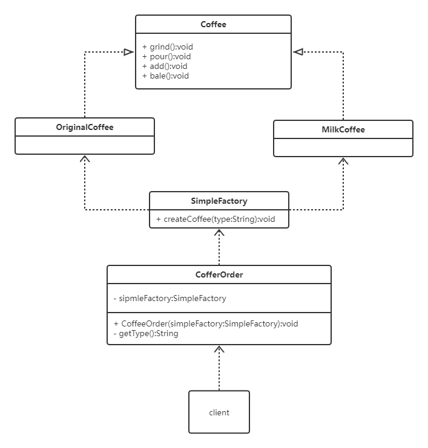

# 设计模式

## 1、工厂设计模式

### 1.1 简单工厂模式

#### a. 模式介绍

> 简单工厂模式的实质就是由一个工厂类根据传入的参数，动态决定应该创建哪一个操作类（这些操作类继承自同一个父类或接口）的实例。

该模式中包含的角色及其职责：

**工厂（Factory）角色：**它负责实现创建所有实例的内部逻辑。工厂类的创建操作类的方法（静态的）可以被外界直接调用，从而创建所需要的操作对象。

**抽象操作（Operation）角色：**简单工厂模式所创建的操作对象的父类，他负责描述所有实例所有的公共接口。

**具体的操作角色：**就是简单工厂模式的创建目标，所有创建的对象都是充当这个角色的某个具体类的实例。

#### b. uml类图

